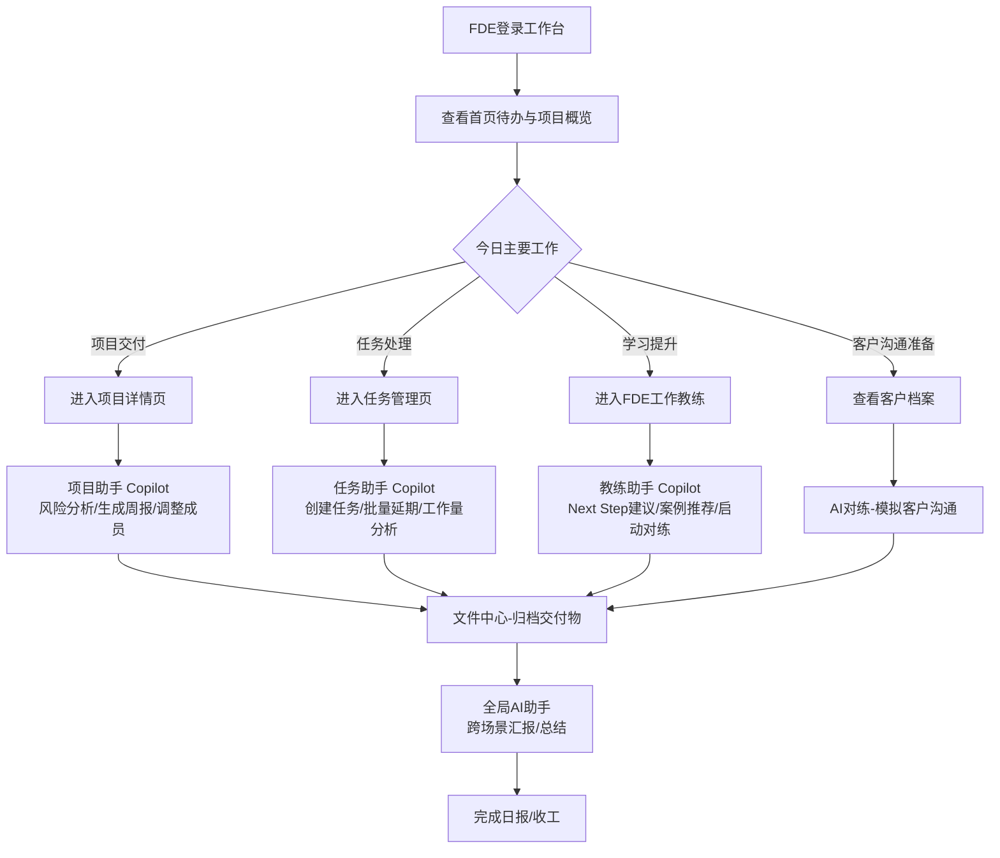
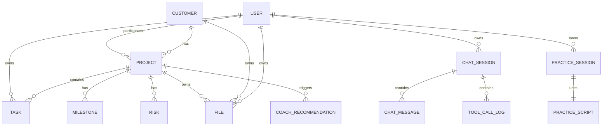

# FDE工作台 产品需求文档（PRD）

> 文档类型：新增类需求 - 需求分析文档（spec.md）
> 文档版本：v0.1
> 创建日期：2026-04-28
> 文档作者：吾明
> 适用 Skill：`request-analysis`（新增类需求规范）

---

## 1. 文档基本信息

### 1.1 参考文档

| 编号 | 文档名称 | 用途 |
|---|---|---|
| R-01 | FDE 岗位职责说明 | 明确目标用户的工作场景和核心痛点 |
| R-02 | 同类工作台产品调研：ServiceNow / Jira Service Management / Linear | 借鉴成熟工作台的信息架构与交互范式 |
| R-03 | 阿里通义千问 / DashVector 文档 | 大模型与向量库技术选型参考 |
| R-04 | 内部 AiCoach OpenAPI 文档 | AI 对练能力对接参考 |

### 1.2 修订记录

| 版本 | 日期 | 修订人 | 修订内容 |
|---|---|---|---|
| v0.1 | 2026-04-28 | 吾明 | 初稿，含 5 大模块 + 场景化 AI Copilot 设计 |

### 1.3 术语表

| 术语 | 全称 / 定义 |
|---|---|
| FDE | Field Delivery Engineer，交付工程师，负责客户现场实施、交付、运维支持 |
| 工作台 | 集成日常工作、知识、客户、项目、文件、AI 能力的统一 Web 入口 |
| Copilot | 嵌入业务页面的场景化 AI 助手，强绑定当前业务对象 |
| 全局 AI 助手 | 独立页面的多模式智能助手，支持通用对话/RAG/Agent 切换 |
| RAG | Retrieval-Augmented Generation，检索增强生成 |
| Agent | 具备工具调用能力的智能体，可调用工作台数据接口 |
| SOP | Standard Operating Procedure，标准作业流程 |
| 对练 | 基于 AI 角色扮演的客户沟通场景模拟训练 |
| 剧本 | AI 对练使用的预设场景脚本（如客户验收冲突处理） |
| 健康度 | 项目综合状态评分（绿/黄/红），由进度、风险、客户满意度等加权计算 |

---

## 2. 项目概述

### 2.1 需求背景

#### 问题描述

当前 FDE/交付工程师 在日常工作中面临以下痛点：

1. **工具碎片化**：日常工作分散在钉钉、Excel、企业网盘、邮件、内部 Wiki、CRM 等多个系统，频繁切换效率低下
2. **知识沉淀难**：交付经验和最佳实践依赖个人，缺乏体系化的知识库与案例库；新人成长周期长（平均 6 个月才能独立交付）
3. **客户/项目信息割裂**：客户信息、项目进度、交付物分散存储，无法形成统一视图
4. **AI 能力未被有效使用**：通用大模型问答与具体业务场景脱节，无法直接基于工作台数据进行操作（如"创建任务"、"分析项目风险"）

#### 业务价值

- **效率提升**：统一工作入口 + AI Copilot 场景化辅助，预计提升 FDE 日常工作效率 30%+
- **新人成长加速**：通过 AI 教练 + 案例推荐 + 对练训练，将新人独立交付周期从 6 个月缩短至 3 个月
- **知识资产沉淀**：结构化沉淀交付方法论、客户案例、SOP 流程，形成组织资产
- **差异化产品力**：「AI as Copilot, Not as Tool」—— AI 不是孤立的问答页面，而是嵌入每个核心业务场景的执行助手

### 2.2 项目范围

#### 包含内容（一期）

✅ Web 端响应式工作台（PC + 移动浏览器）
✅ 五大核心模块：日常工作管理、FDE 工作教练、客户/项目管理、文件管理、大模型问答
✅ 场景化 AI Copilot：任务助手、项目助手、教练助手（嵌入对应业务页面）
✅ 全局 AI 助手（多模式：通用对话 / RAG / Agent）
✅ 基础用户体系与权限管理

#### 不包含内容（一期）

❌ 原生 iOS / Android App
❌ 桌面客户端（Electron 等）
❌ 与外部 CRM / PMO / ERP 系统的深度双向集成
❌ 复杂的 BI 分析与自定义报表
❌ 多租户 SaaS 化部署

---

## 3. 需求分析

### 3.1 业务流程

FDE 一天典型工作流（含 AI Copilot 介入节点）：



### 3.2 用户故事

按模块编号：
- `US-WM-xxx`：工作管理（Work Management）
- `US-CO-xxx`：FDE 教练（Coach）
- `US-CR-xxx`：客户与项目（Customer & pRoject）
- `US-FM-xxx`：文件管理（File Management）
- `US-AI-xxx`：全局 AI 助手（AI Assistant）
- `US-CP-xxx`：场景化 AI Copilot（Copilot）

格式：**作为 [角色]，我想要 [功能]，以便 [价值]**

#### 工作管理（US-WM）

| 编号 | 用户故事 | 优先级 |
|---|---|---|
| US-WM-001 | 作为 FDE，我想在首页看到今日待办、本周任务、逾期提醒，以便快速规划当日工作 | P0 |
| US-WM-002 | 作为 FDE，我想以看板（待办/进行中/已完成）形式管理任务，以便直观跟踪进度 | P0 |
| US-WM-003 | 作为 FDE，我想为任务设置优先级（P0/P1/P2）、截止时间、关联项目/客户，以便分类管理 | P0 |
| US-WM-004 | 作为 FDE，我想接收任务提醒（站内信/邮件/钉钉），以便不遗漏关键工作 | P1 |
| US-WM-005 | 作为 FDE，我想用模板生成日报/周报，以便降低汇报成本 | P1 |
| US-WM-006 | 作为 FDE Leader，我想看到团队成员的任务负载分布，以便合理分配工作 | P2 |

#### FDE 教练（US-CO）

| 编号 | 用户故事 | 优先级 |
|---|---|---|
| US-CO-001 | 作为 FDE，我想检索 FDE 方法论与交付 SOP 的问答，以便快速找到操作规范 | P0 |
| US-CO-002 | 作为 FDE，我想根据当前项目阶段获取下一步建议，以便不漏关键动作 | P0 |
| US-CO-003 | 作为 FDE，我想检索历史交付案例库（按行业/规模/痛点），以便参考成熟方案 | P0 |
| US-CO-004 | 作为新手 FDE，我想在客户首次需求沟通前进行 AI 对练，以便提升沟通信心和质量 | P1 |
| US-CO-005 | 作为 FDE，我想在对练结束后获取评分报告与改进建议，以便针对性提升 | P1 |
| US-CO-006 | 作为 FDE Leader，我想沉淀团队优秀案例为知识库，以便组织复用 | P2 |

#### 客户与项目（US-CR）

| 编号 | 用户故事 | 优先级 |
|---|---|---|
| US-CR-001 | 作为 FDE，我想维护客户档案（基本信息、联系人、健康度），以便统一管理客户关系 | P0 |
| US-CR-002 | 作为 FDE，我想查看项目列表，按客户/阶段/健康度筛选，以便快速定位项目 | P0 |
| US-CR-003 | 作为 FDE，我想查看项目详情（里程碑、成员、风险、文件、时间线），以便全局掌控 | P0 |
| US-CR-004 | 作为 FDE，我想为项目添加里程碑并跟踪完成情况，以便阶段性把控进度 | P0 |
| US-CR-005 | 作为 FDE，我想标记和跟踪项目风险（等级/影响/应对措施），以便提前规避问题 | P1 |
| US-CR-006 | 作为 FDE Leader，我想在交付看板看到所有项目的健康度，以便聚焦风险项目 | P1 |

#### 文件管理（US-FM）

| 编号 | 用户故事 | 优先级 |
|---|---|---|
| US-FM-001 | 作为 FDE，我想上传/下载交付文件（拖拽、批量），以便高效管理文档 | P0 |
| US-FM-002 | 作为 FDE，我想按"个人 / 项目 / 客户 / 共享"四个空间组织文件，以便分类管理 | P0 |
| US-FM-003 | 作为 FDE，我想在线预览 PDF/Office/图片/Markdown，以便不下载就能查看 | P0 |
| US-FM-004 | 作为 FDE，我想生成带权限和有效期的分享链接，以便安全地与客户共享文件 | P1 |
| US-FM-005 | 作为 FDE，我想查看文件版本历史并恢复历史版本，以便防止误改 | P2 |

#### 全局 AI 助手（US-AI）

| 编号 | 用户故事 | 优先级 |
|---|---|---|
| US-AI-001 | 作为 FDE，我想与通用大模型对话，以便处理通用问题（写邮件、翻译、总结） | P0 |
| US-AI-002 | 作为 FDE，我想基于内部 RAG 知识库提问，以便获取来源可追溯的答案 | P0 |
| US-AI-003 | 作为 FDE，我想用 Agent 模式让 AI 调用工作台数据（"我手上有哪些项目快到期了"），以便不切页面就能查询 | P0 |
| US-AI-004 | 作为 FDE，我想 AI 自动根据问题意图选择合适的模式，以便降低使用门槛 | P1 |
| US-AI-005 | 作为 FDE，我想保存、分组、收藏会话历史，以便回溯历史对话 | P1 |

#### 场景化 AI Copilot（US-CP）

| 编号 | 用户故事 | 优先级 |
|---|---|---|
| US-CP-001 | 作为 FDE，我想在任务页对 AI 说"创建一个明天截止的 P0 任务：完成客户A的POC方案"，AI 自动创建并预览给我确认 | P0 |
| US-CP-002 | 作为 FDE，我想在项目详情页直接问"分析下当前项目的风险"，AI 自动结合项目上下文生成分析报告 | P0 |
| US-CP-003 | 作为 FDE，我想批量操作"把所有逾期任务延期到下周五"，AI 列出影响清单后让我确认 | P0 |
| US-CP-004 | 作为 FDE，我想在教练页问"针对当前项目阶段，我下一步该做什么"，AI 结合项目阶段+方法论给出建议 | P0 |
| US-CP-005 | 作为 FDE，我想 @项目B 切换上下文，让 AI 对比当前项目与项目B的差异 | P1 |
| US-CP-006 | 作为 FDE，我想折叠 AI 侧边栏获得更大主区域，再次展开时会话不丢失 | P0 |
| US-CP-007 | 作为 FDE，我想 AI 在执行删除/批量等危险操作前进行二次确认，以便防止误操作 | P0 |
| US-CP-008 | 作为 FDE Leader，我想审计 Copilot 的所有写操作日志，以便追溯异常行为 | P1 |

### 3.3 功能需求清单

| 模块 | 功能编号 | 功能名称 | 优先级 | 关联用户故事 |
|---|---|---|---|---|
| **工作管理** | F-WM-01 | 工作台首页（待办/统计/日历） | P0 | US-WM-001 |
| | F-WM-02 | 任务管理（CRUD + 看板/列表视图） | P0 | US-WM-002/003 |
| | F-WM-03 | 提醒与通知 | P1 | US-WM-004 |
| | F-WM-04 | 日报/周报模板 | P1 | US-WM-005 |
| | F-WM-05 | 团队任务负载视图 | P2 | US-WM-006 |
| **FDE 教练** | F-CO-01 | 知识问答（FDE 方法论 RAG） | P0 | US-CO-001 |
| | F-CO-02 | 流程指导（项目阶段 Next Step） | P0 | US-CO-002 |
| | F-CO-03 | 案例库 + 智能案例推荐 | P0 | US-CO-003 |
| | F-CO-04 | AI 对练（剧本管理 + 对练会话） | P1 | US-CO-004 |
| | F-CO-05 | 对练评分报告 | P1 | US-CO-005 |
| **客户项目** | F-CR-01 | 客户档案管理 | P0 | US-CR-001 |
| | F-CR-02 | 项目列表与筛选 | P0 | US-CR-002 |
| | F-CR-03 | 项目详情（多 Tab） | P0 | US-CR-003 |
| | F-CR-04 | 里程碑管理 | P0 | US-CR-004 |
| | F-CR-05 | 风险管理 | P1 | US-CR-005 |
| | F-CR-06 | 交付看板（团队级） | P1 | US-CR-006 |
| **文件管理** | F-FM-01 | 文件上传下载（拖拽/批量） | P0 | US-FM-001 |
| | F-FM-02 | 四空间组织（个人/项目/客户/共享） | P0 | US-FM-002 |
| | F-FM-03 | 在线预览 | P0 | US-FM-003 |
| | F-FM-04 | 文件分享（链接/权限/有效期） | P1 | US-FM-004 |
| | F-FM-05 | 文件版本管理 | P2 | US-FM-005 |
| **全局 AI 助手** | F-AI-01 | 通用对话模式 | P0 | US-AI-001 |
| | F-AI-02 | RAG 知识库模式 | P0 | US-AI-002 |
| | F-AI-03 | Agent 模式（工作台数据调用） | P0 | US-AI-003 |
| | F-AI-04 | 模式自动路由 | P1 | US-AI-004 |
| | F-AI-05 | 会话历史管理 | P1 | US-AI-005 |
| **场景化 Copilot** | F-CP-01 | Copilot 通用框架（侧边栏+折叠） | P0 | US-CP-006 |
| | F-CP-02 | 任务助手 Copilot | P0 | US-CP-001/003 |
| | F-CP-03 | 项目助手 Copilot | P0 | US-CP-002 |
| | F-CP-04 | 教练助手 Copilot | P0 | US-CP-004 |
| | F-CP-05 | 上下文感知与 @ 引用 | P1 | US-CP-005 |
| | F-CP-06 | 操作确认机制（二次确认/影响清单） | P0 | US-CP-007 |
| | F-CP-07 | Copilot 审计日志 | P1 | US-CP-008 |

---

## 4. 功能详细设计

### 4.1 日常工作管理和跟踪

#### 4.1.1 工作台首页

**功能描述**：用户登录后默认进入的统一工作入口，聚合关键信息。

**前置条件**：用户已登录。

**页面区块**：
- **欢迎语 Banner**：显示问候语 + 今日待办数量摘要
- **数据概览卡片**（4 个）：进行中项目、今日待办、本周交付、AI 对练时长
- **任务看板**（嵌入式简版）：待办 / 进行中 / 已完成 三列
- **项目进度列表**：Top 5 项目，含进度条 + 健康度标签
- **日历周视图 + Top 3 提醒**：右侧栏

**业务规则**：
- 数据卡片实时刷新（轮询或 WebSocket 推送）
- 项目排序：健康度低优先，其次按截止日期升序

**对应原型**：[#dashboard](./prototype/index.html#dashboard)

#### 4.1.2 任务管理（独立页面）

**功能描述**：FDE 个人任务的全生命周期管理。

**操作流程**：
1. 进入任务管理页 → 默认看板视图
2. 点击「新建任务」 → 弹出表单（标题、描述、优先级、截止时间、关联项目/客户、负责人）
3. 任务卡片支持拖拽流转（待办 → 进行中 → 已完成）
4. 支持列表/看板/日历三视图切换

**业务规则**：
- 优先级：P0（红）/ P1（黄）/ P2（蓝）
- 状态：待办 / 进行中 / 已完成 / 已取消
- 关联项目的任务，进度同步到项目里程碑
- 逾期任务自动高亮（红色徽标）

**异常处理**：
- 截止时间早于当前时间：表单校验报错
- 删除关联其他任务的父任务：弹窗确认级联处理

**对应原型**：[#tasks](./prototype/index.html#tasks)（含任务助手 Copilot）

#### 4.1.3 工作日报/周报

**功能描述**：基于模板的汇报生成，支持 AI 辅助填充。

**业务规则**：
- 模板字段：今日完成、明日计划、风险与求助、需要协同事项
- AI 辅助：基于已完成任务自动生成草稿，用户编辑后提交
- 提交后自动同步到团队群（钉钉机器人）

#### 4.1.4 提醒与通知

**功能描述**：站内信、邮件、钉钉机器人三通道通知。

**触发场景**：任务被指派、任务即将到期（提前 1 天/2 小时）、任务被评论、项目状态变更、风险新增等。

**业务规则**：
- 用户可在「设置-通知」中配置每类事件的接收通道
- 重要级别：高（多通道）/ 中（站内+钉钉）/ 低（仅站内）

---

### 4.2 FDE 工作教练

#### 4.2.1 知识问答助手

**功能描述**：基于 RAG 的 FDE 方法论与交付 SOP 检索式问答。

**业务规则**：
- 答案必须附引用来源（文档名 + 段落锚点）
- 找不到答案时，引导用户提问到「全局 AI 助手」尝试通用模式

#### 4.2.2 工作流程指导

**功能描述**：根据用户当前所在项目阶段，智能推荐 Next Step 清单。

**业务规则**：
- 项目阶段定义：售前 / 启动 / 需求 / 设计 / 实施 / 验收 / 运维
- 每个阶段预置 5-10 个标准动作清单
- 用户可标记「已完成 / 暂不适用」并补充实际执行内容

#### 4.2.3 案例库

**功能描述**：结构化的历史交付案例库，支持检索与浏览。

**案例字段**：行业、客户规模、交付周期、技术栈、痛点、方案亮点、避坑要点、关联文档。

**业务规则**：
- 案例分级：金牌（精选）/ 银牌 / 普通
- 支持全文检索 + 标签筛选

#### 4.2.4 案例智能推荐

**功能描述**：基于当前项目的特征（行业、规模、技术栈），智能推荐相似历史案例。

**业务规则**：
- 推荐展示匹配度百分比（基于向量相似度）
- 默认推荐 Top 3，可一键展开 Top 10

#### 4.2.5 AI 对练

**功能描述**：基于剧本的 AI 角色扮演式沟通训练。

**操作流程**：
1. 选择剧本（如「客户首次需求沟通」、「验收冲突处理」、「续约谈判」）
2. 进入对练会话，AI 扮演客户角色
3. 用户与 AI 多轮对话，AI 根据剧本设定提出问题/挑战
4. 结束对练 → AI 自动生成评分报告（沟通质量、专业度、应变能力等维度）

**业务规则**：
- 单次对练时长建议 15-30 分钟
- 对练历史可回放，评分报告可分享给 Leader

**对应原型**：[#coach](./prototype/index.html#coach)（含教练助手 Copilot）

---

### 4.3 客户、项目管理

#### 4.3.1 客户管理

**功能描述**：客户档案与联系人统一管理。

**字段**：客户名称、行业、规模、所属销售、健康度、首要联系人、客户层级（战略/重点/普通）、备注。

**业务规则**：
- 健康度三档：绿 / 黄 / 红，由 FDE 手动评估，每月更新
- 客户与项目多对多关联

#### 4.3.2 项目管理

**功能描述**：项目全生命周期管理。

**字段**：项目名称、所属客户、阶段、负责人、计划起止时间、健康度、关键里程碑、团队成员、风险列表。

**业务规则**：
- 项目健康度由：进度偏差 + 风险数 + 客户反馈 三个维度计算
- 阶段流转需要 Leader 审批（验收阶段 → 运维阶段）

**对应原型**：[#project-detail](./prototype/index.html#project-detail)（含项目助手 Copilot）

#### 4.3.3 项目-客户-任务关联

- 项目必须归属一个客户
- 任务可关联到项目或独立存在
- 文件可挂载到项目空间或客户空间

#### 4.3.4 交付看板

**功能描述**：团队级的所有项目健康度看板，供 Leader 查看。

**视图**：按健康度分组（红区聚焦预警）、按客户分组、按 FDE 分组三种视图切换。

---

### 4.4 日常文件管理

#### 4.4.1 文件上传下载

- 支持拖拽上传、点击上传、批量上传
- 单文件 ≤ 500MB（可配置），支持断点续传
- 自动识别文件类型并匹配预览能力

#### 4.4.2 文件夹组织（四空间）

- **个人空间**：仅自己可见
- **项目空间**：自动按项目创建，项目成员可见
- **客户空间**：与客户档案关联，相关 FDE 可见
- **共享给我**：他人通过分享链接共享的文件

#### 4.4.3 在线预览

- 支持：PDF / Word / Excel / PPT / 图片 / Markdown / 文本
- 大文件预览采用流式加载

#### 4.4.4 文件分享

- 生成分享链接，支持设置：访问密码、有效期（1天/7天/30天/永久）、权限（仅查看/可下载）
- 链接可随时撤销
- 含组织外水印（防泄漏）

#### 4.4.5 文件版本管理

- 同名文件覆盖时自动生成版本
- 最多保留 10 个历史版本
- 支持回滚到任意历史版本

**对应原型**：[#files](./prototype/index.html#files)

---

### 4.5 大模型问答（全局 AI 助手）

#### 4.5.1 通用对话模式

直接调用底层大模型，处理通用问题（写作、翻译、总结、闲聊）。

#### 4.5.2 RAG 知识库模式

基于内部知识库（FDE 方法论、SOP、案例库、产品文档）的检索增强问答，答案必须附来源。

#### 4.5.3 Agent 模式

可调用工作台业务数据接口的智能体，工具集包括：
- `query_my_projects()` / `query_my_tasks()` / `query_customer(name)`
- `search_files(keyword)` / `query_calendar(date_range)`
- 写操作工具同样需要二次确认（与 Copilot 保持一致）

#### 4.5.4 模式自动路由

根据用户 query 意图自动选择模式：
- 含「我的 / 当前 / 这个项目」等代词 → Agent 模式
- 含「方法论 / SOP / 怎么做」等知识查询 → RAG 模式
- 其他通用问题 → 通用模式
- 用户可手动切换覆盖

#### 4.5.5 会话历史管理

- 多会话并行，左侧列表展示
- 支持收藏、重命名、归档、删除
- 场景化 Copilot 的会话也同步到此处，按助手类型分组

**对应原型**：[#ai-chat](./prototype/index.html#ai-chat)

---

### 4.6 场景化 AI Copilot（核心新增）

#### 4.6.1 通用 Copilot 框架设计

**布局规范**：
- 嵌入页面右侧，固定宽度 400px
- 折叠态宽度 56px（仅显示助手图标 + 展开箭头）
- 主区域自动适应宽度（最小 720px 保护，低于则强制折叠 Copilot）

**会话管理**：
- 每个 Copilot 独立会话历史（不与全局助手混淆）
- 顶部有「☰ 历史」按钮，可查看/切换/新建会话
- 会话同步到全局 AI 助手的「场景会话」分组

**上下文感知机制**：
- **自动注入**：进入页面时自动将当前业务对象注入上下文（如项目详情页 → 当前项目 ID）
- **手动 @ 引用**：在输入框输入 `@` 唤起选择器（项目/任务/客户/文件），可追加多个上下文
- **可关闭**：每个上下文标签可单独 × 移除

**工具调用预览与确认机制**：
- AI 触发工具调用 → 立即在对话流中插入「操作预览卡片」
- 卡片三态：⏳ 待确认 / 🔄 执行中 / ✅ 已完成 / ❌ 失败
- 用户必须主动点击「确认执行」才会真正调用业务接口
- 5 分钟未确认自动失效

#### 4.6.2 任务助手（Task Copilot）

**嵌入位置**：任务管理页（4.1.2）右侧

**系统提示词**：
> 你是 FDE 任务管理助手。你可以帮助用户创建、查询、修改、批量处理任务。所有写操作必须先生成预览卡片，等待用户确认后再执行。当前用户的所有任务上下文将自动注入。

**工具集**：

| 工具名 | 类型 | 描述 |
|---|---|---|
| `query_tasks(filters)` | 只读 | 查询任务（按状态/优先级/截止日期/项目筛选） |
| `create_task(payload)` | 写 | 创建任务（需确认） |
| `update_task(id, changes)` | 写 | 修改任务（需确认） |
| `batch_update_tasks(filter, changes)` | 批量 | 批量修改（需确认 + 影响清单） |
| `delete_task(id)` | 写 | 删除任务（二次输入校验） |
| `analyze_workload(date_range)` | 智能分析 | 工作量负载分析 |

**典型场景**：
- "创建一个明天截止的 P0 任务：完成客户A的POC方案" → `create_task` 预览卡片
- "把所有逾期任务延期到下周五" → `batch_update_tasks` + 影响清单（共 X 个任务）
- "我下周工作量怎样" → `analyze_workload` 返回热力图 + 风险提示

#### 4.6.3 项目助手（Project Copilot）

**嵌入位置**：项目详情页（4.3.2）右侧

**系统提示词**：
> 你是 FDE 项目管理助手。你强绑定当前打开的项目。你可以分析项目风险、生成各类报告、调整项目成员/里程碑。所有写操作需用户确认。

**工具集**：

| 工具名 | 类型 | 描述 |
|---|---|---|
| `get_project_info(project_id?)` | 只读 | 查询项目信息（默认当前项目） |
| `update_project(id, changes)` | 写 | 修改项目基本信息（需确认） |
| `add_milestone / update_milestone / delete_milestone` | 写 | 里程碑管理（需确认） |
| `assign_member(role, user)` | 写 | 调整成员角色（需确认） |
| `analyze_risk(project_id?)` | 智能分析 | 风险分析报告 |
| `generate_report(type)` | 智能分析 | 生成周报/月报/交付报告 |

**典型场景**：
- "分析下当前项目的风险" → `analyze_risk` 返回结构化分析（高/中/低三档 + 应对建议）
- "把负责人改成张三" → `assign_member` 预览卡片
- "生成本周项目周报" → `generate_report(weekly)` 返回 Markdown 报告，支持一键复制/导出

#### 4.6.4 教练助手（Coach Copilot）

**嵌入位置**：FDE 工作教练页（4.2）右侧

**系统提示词**：
> 你是 FDE 工作教练。你融合 FDE 方法论知识库 + 历史案例库 + 用户当前项目阶段，为用户提供个性化的工作指导和学习建议。

**工具集**：

| 工具名 | 类型 | 描述 |
|---|---|---|
| `query_knowledge(question)` | 只读 | RAG 知识问答 |
| `recommend_cases(project_context)` | 只读 | 案例智能推荐 |
| `suggest_next_step(project_id)` | 智能分析 | 项目阶段下一步建议 |
| `start_practice(scenario)` | 写 | 启动 AI 对练（需确认） |
| `evaluate_practice(session_id)` | 智能分析 | 对练评估 |

**典型场景**：
- "这个阶段我下一步该做什么" → `suggest_next_step` 返回 5 个 Next Step + 关联案例
- "找几个类似的银行业大数据项目案例" → `recommend_cases` 返回 Top 3 案例卡片
- "开始一场客户验收冲突处理对练" → `start_practice` 启动卡片

#### 4.6.5 操作确认机制（安全设计）

| 操作类型 | 确认方式 | 示例 |
|---|---|---|
| 只读查询 | 无需确认，直接返回 | "我有几个逾期任务？" |
| 单对象写操作 | 操作卡片 + 一键确认按钮 | "把这个任务改成 P0" |
| 批量操作 | 影响清单展开（默认显示前 5 条 + 可展开全部） + 确认按钮 | "延期所有逾期任务" |
| 删除操作 | 二次输入校验（输入对象名） | "删除项目A" → 输入"项目A"确认 |
| 不可逆操作 | 确认 + 5 秒倒计时 + 撤销窗口（10 秒内） | "归档项目" |

**审计要求**：所有写操作记录审计日志（操作人、时间、工具、参数、结果），保留期限见待决议项。

---

## 5. 非功能性需求

### 5.1 性能

| 指标 | 要求 |
|---|---|
| 首页首屏加载 | ≤ 2s |
| 页面切换 | ≤ 500ms |
| 文件预览（10MB 内） | ≤ 3s |
| AI 首字响应 | ≤ 1.5s |
| AI 完整响应（500 tokens） | ≤ 8s |
| Copilot 工具调用 | ≤ 2s |

### 5.2 安全性

- 登录鉴权：支持企业 SSO（待决议）+ 账号密码兜底
- 数据权限隔离：按用户 / 项目成员 / 客户归属三层校验
- 文件防泄漏：分享链接含组织水印，支持密码 + 有效期
- Copilot 写操作：必须二次确认；批量操作有数量上限保护
- 审计日志：所有写操作可追溯
- 数据加密：传输 HTTPS，敏感字段（手机号/邮箱）落库脱敏

### 5.3 可靠性

- 系统可用性：≥ 99.5%（月度）
- 关键操作幂等：任务创建、文件上传、Copilot 工具调用支持幂等键
- AI 服务降级：大模型超时/失败 → 自动切换备用模型 → 仍失败则提示用户重试

### 5.4 兼容性

- **浏览器**：Chrome / Edge / Safari 最新两个大版本
- **响应式断点**：PC（≥1280px）、平板（≥768px）、手机（≥375px）
- **优先级**：一期 PC 端体验优先，移动端聚焦"查看"场景（不强求完整 Copilot 体验）

---

## 6. 架构设计

### 6.1 分层概要

```
┌────────────────────────────────────────────────────────┐
│  表现层（Web Frontend）                                  │
│  - 响应式 SPA / 6 个核心页面 / 3 个嵌入式 Copilot 组件   │
├────────────────────────────────────────────────────────┤
│  应用层（Application Service）                           │
│  - 业务编排 / DTO 转换 / 权限校验 / 审计日志              │
├────────────────────────────────────────────────────────┤
│  业务层（Domain Service）                                │
│  - 任务域 / 项目域 / 客户域 / 文件域 / 教练域 / AI 域      │
├────────────────────────────────────────────────────────┤
│  数据层（Repository）                                    │
│  - 业务数据库（MySQL）/ 文件存储（OSS）/ 向量库（DashVector）│
├────────────────────────────────────────────────────────┤
│  适配层（Integration）                                   │
│  - LLM 适配器 / SSO / 钉钉 OpenAPI / 邮件服务            │
└────────────────────────────────────────────────────────┘
```

### 6.2 核心实体关系（ER 概要）



> 字段细节、索引设计、分库分表策略 → 系分阶段定义。

### 6.3 错误码定义概要

#### 业务异常（BIZ_ 开头）

| 错误码 | 描述 |
|---|---|
| `BIZ_FDE_TASK_NOT_FOUND` | 任务不存在 |
| `BIZ_FDE_TASK_PERMISSION_DENIED` | 无任务操作权限 |
| `BIZ_FDE_PROJECT_NOT_FOUND` | 项目不存在 |
| `BIZ_FDE_PROJECT_STAGE_INVALID_TRANSITION` | 项目阶段流转非法 |
| `BIZ_FDE_FILE_QUOTA_EXCEEDED` | 文件配额超限 |
| `BIZ_FDE_FILE_TYPE_NOT_ALLOWED` | 文件类型不允许 |
| `BIZ_FDE_COPILOT_TOOL_DENIED` | Copilot 工具调用被拒绝（用户取消） |
| `BIZ_FDE_COPILOT_CONFIRM_TIMEOUT` | Copilot 操作确认超时（5 分钟） |
| `BIZ_FDE_COPILOT_BATCH_LIMIT_EXCEEDED` | Copilot 批量操作超上限 |

#### 系统异常（SYS_ 开头）

| 错误码 | 描述 |
|---|---|
| `SYS_FDE_LLM_TIMEOUT` | 大模型服务超时 |
| `SYS_FDE_LLM_RATE_LIMIT` | 大模型限流 |
| `SYS_FDE_VECTOR_DB_ERROR` | 向量库异常 |
| `SYS_FDE_OSS_UPLOAD_FAILED` | OSS 上传失败 |
| `SYS_FDE_COPILOT_TOOL_FAILED` | Copilot 工具执行异常 |

---

## 7. 风险与依赖

### 7.1 风险识别

| 风险项 | 等级 | 描述 | 应对措施 |
|---|---|---|---|
| 大模型服务稳定性 | 高 | 大模型超时/限流影响 AI 体验 | 多供应商降级、缓存常见问答、关键场景兜底 |
| Copilot 误操作风险 | 高 | AI 错误执行写操作导致数据损坏 | 严格的二次确认机制、审计日志、批量上限 |
| RAG 初始知识不足 | 中 | 一期知识库内容稀薄，影响教练效果 | 一期内置 FDE SOP，二期开放上传与众包 |
| 移动端体验受限 | 中 | 响应式在移动端 Copilot 体验差 | 一期主推 PC，移动端聚焦查看 |
| 用户接受度 | 中 | FDE 习惯了原有工具，迁移成本高 | 灰度发布 + 试点团队 + 培训教练 |
| 性能压力 | 低 | 文件预览/AI 调用密集时压力大 | CDN 加速、流量限速、异步队列 |

### 7.2 外部服务依赖

| 依赖 | 用途 | 备选 |
|---|---|---|
| 大模型服务（通义千问） | 全局 AI / Copilot 问答 | DeepSeek / GPT-4o |
| 向量数据库（DashVector） | RAG 知识库检索 | Milvus 自建 |
| 对象存储（OSS） | 文件存储 | MinIO 自建 |
| 企业 SSO | 统一登录（待决议） | 账号密码兜底 |
| 钉钉开放平台 | 通知机器人、文档读取 | 邮件兜底 |
| AiCoach OpenAPI | AI 对练能力 | 自研对练引擎 |

---

## 8. 待决议列表

> 以下事项需要在系分阶段前与业务方/架构师确认，否则不应进入编码阶段。

- [ ] 1、**用户体系**：是否对接企业 SSO？还是独立账号？
- [ ] 2、**权限模型**：FDE / FDE Leader / 管理员的权限边界如何定义？
- [ ] 3、**客户/项目数据来源**：是否需要从现有 CRM 导入？还是工作台内独立维护？
- [ ] 4、**AI 对练剧本来源**：剧本由谁产出？是否有评分专家审核流程？
- [ ] 5、**RAG 知识库初始内容**：来源（FDE 手册/历史 wiki/钉钉文档）？由谁负责维护？
- [ ] 6、**文件存储限制**：单文件大小上限、单用户配额、是否允许存储敏感数据（合规要求）？
- [ ] 7、**Agent/Copilot 工具范围**：可调用哪些工作台数据接口？写操作清单是否需要业务方逐一审批？
- [ ] 8、**LLM 调用计费与限流**：是否按用户/团队设额度？超额如何处理？
- [ ] 9、**上线节奏**：MVP 范围如何收敛？哪些 P0 必须一期上线？分几个迭代？
- [ ] 10、**UI 视觉规范**：是否复用现有内部设计体系（如 Ant Design / 自有规范）？
- [ ] 11、**Copilot 审计日志保留期限**：保留多久？是否需要支持导出？
- [ ] 12、**Copilot 批量操作上限**：单次最多操作多少条数据（如 100 个任务）？是否分级（普通用户/Leader 不同上限）？
- [ ] 13、**Copilot 自动执行模式**：是否支持「无需每次确认」的自动模式（仅审计）？由谁开关？

---

> 文档结束。下一步：HTML 高保真原型设计（见 `prototype/index.html`）。
