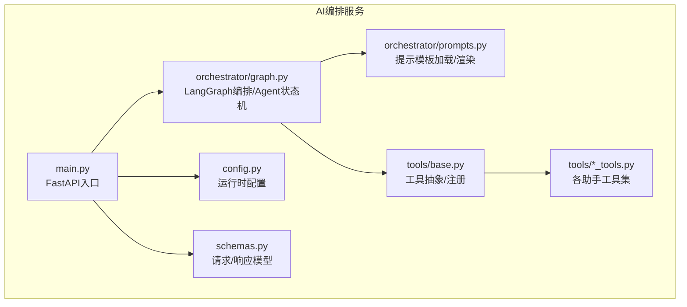
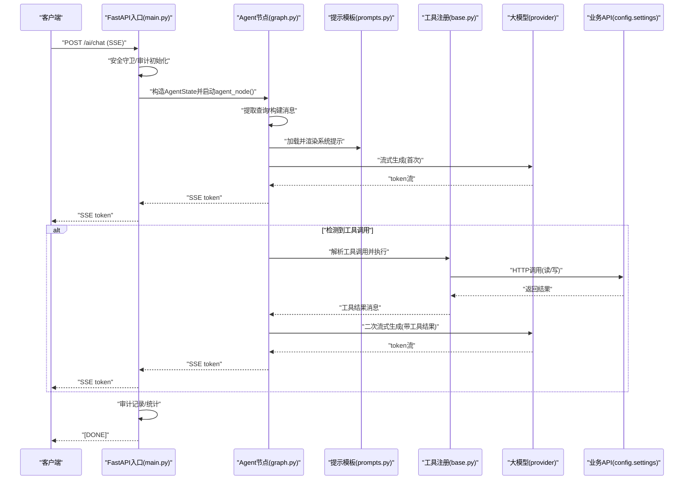
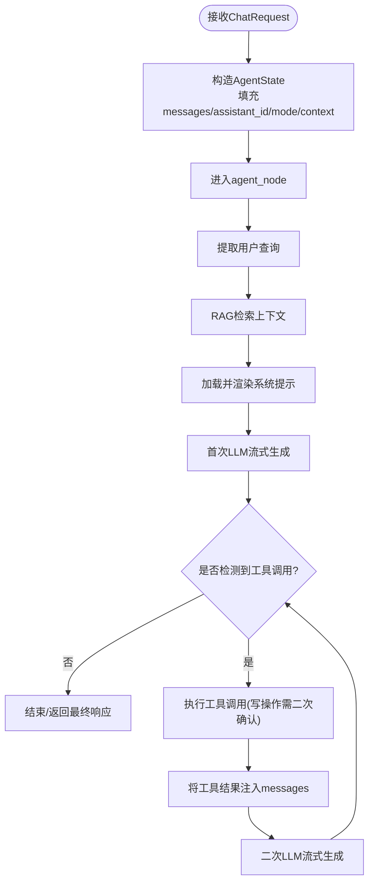
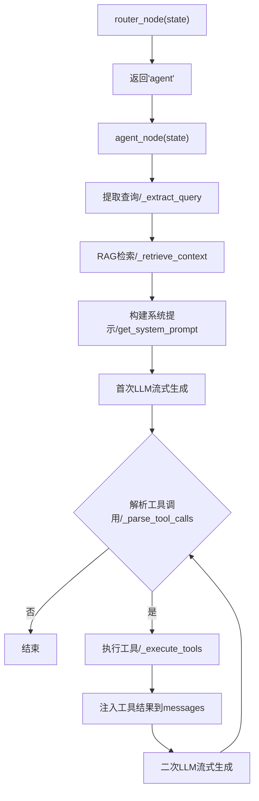
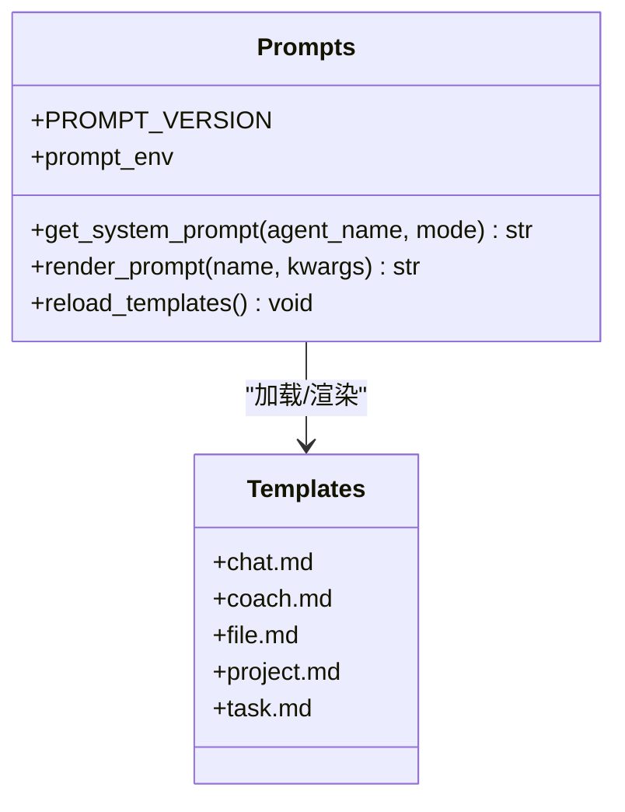
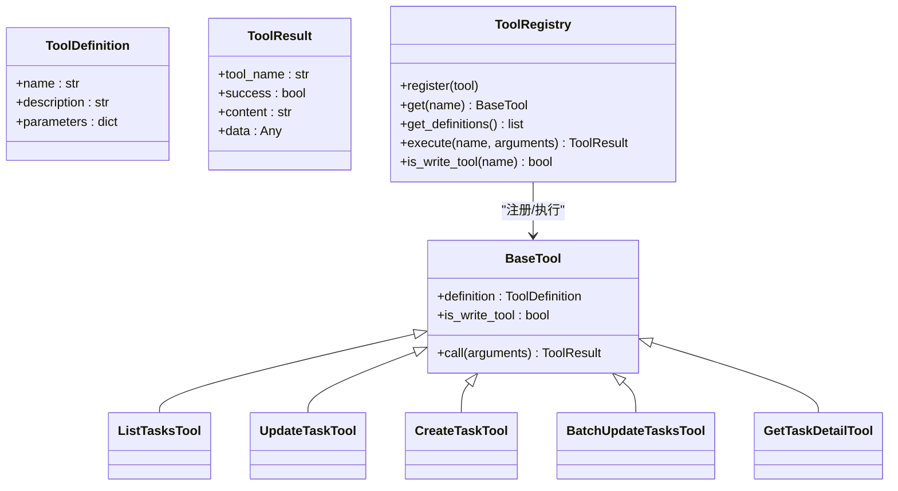
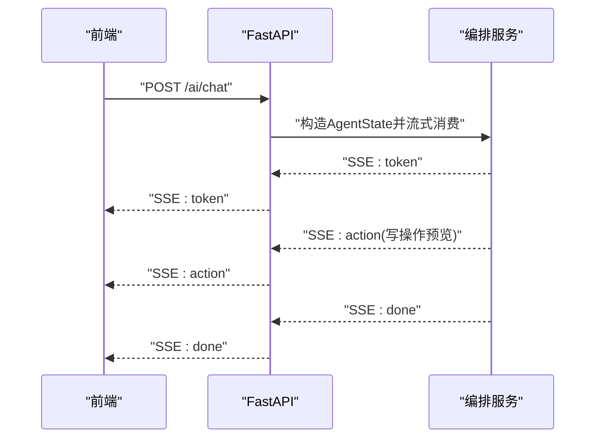
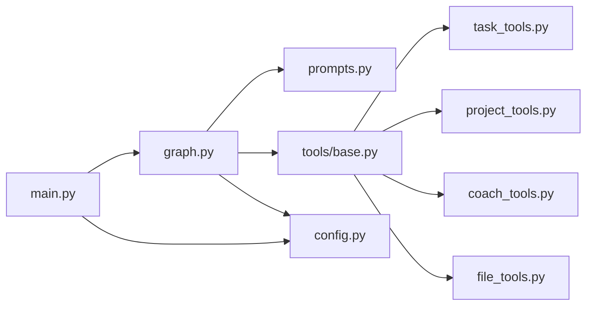

# AI架构设计

<cite>
**本文引用的文件**
- [workspace/ai-orchestrator/app/orchestrator/graph.py](file://workspace/ai-orchestrator/app/orchestrator/graph.py)
- [workspace/ai-orchestrator/app/orchestrator/prompts.py](file://workspace/ai-orchestrator/app/orchestrator/prompts.py)
- [workspace/ai-orchestrator/app/orchestrator/prompts/v1/chat.md](file://workspace/ai-orchestrator/app/orchestrator/prompts/v1/chat.md)
- [workspace/ai-orchestrator/app/orchestrator/prompts/v1/coach.md](file://workspace/ai-orchestrator/app/orchestrator/prompts/v1/coach.md)
- [workspace/ai-orchestrator/app/orchestrator/prompts/v1/file.md](file://workspace/ai-orchestrator/app/orchestrator/prompts/v1/file.md)
- [workspace/ai-orchestrator/app/orchestrator/prompts/v1/project.md](file://workspace/ai-orchestrator/app/orchestrator/prompts/v1/project.md)
- [workspace/ai-orchestrator/app/orchestrator/prompts/v1/task.md](file://workspace/ai-orchestrator/app/orchestrator/prompts/v1/task.md)
- [workspace/ai-orchestrator/app/tools/base.py](file://workspace/ai-orchestrator/app/tools/base.py)
- [workspace/ai-orchestrator/app/tools/task_tools.py](file://workspace/ai-orchestrator/app/tools/task_tools.py)
- [workspace/ai-orchestrator/app/tools/project_tools.py](file://workspace/ai-orchestrator/app/tools/project_tools.py)
- [workspace/ai-orchestrator/app/tools/coach_tools.py](file://workspace/ai-orchestrator/app/tools/coach_tools.py)
- [workspace/ai-orchestrator/app/tools/file_tools.py](file://workspace/ai-orchestrator/app/tools/file_tools.py)
- [workspace/ai-orchestrator/app/main.py](file://workspace/ai-orchestrator/app/main.py)
- [workspace/ai-orchestrator/app/config.py](file://workspace/ai-orchestrator/app/config.py)
- [workspace/ai-orchestrator/app/schemas.py](file://workspace/ai-orchestrator/app/schemas.py)
</cite>

## 目录
1. [引言](#引言)
2. [项目结构](#项目结构)
3. [核心组件](#核心组件)
4. [架构总览](#架构总览)
5. [详细组件分析](#详细组件分析)
6. [依赖分析](#依赖分析)
7. [性能考虑](#性能考虑)
8. [故障排查指南](#故障排查指南)
9. [结论](#结论)
10. [附录](#附录)

## 引言
本文面向FDE工作台的AI编排系统，系统性阐述LangGraph编排框架的设计理念与Agent状态机实现原理；详解AgentState状态管理机制（消息传递、上下文维护、状态转换）；解析提示工程设计（不同助手类型的提示模板与动态提示生成）；说明编排节点的工作流程（状态检查、工具调用、响应生成）；并提供可定位到源码的示例路径，帮助读者快速理解与落地。

## 项目结构
AI编排服务位于workspace/ai-orchestrator中，采用“功能域+分层”的组织方式：
- orchestrator：编排与提示工程
  - graph.py：LangGraph编排、Agent状态机、RAG检索、工具调用与流式输出
  - prompts.py：Jinja2模板加载与渲染
  - prompts/v1/*：各助手类型提示模板
- tools：工具体系
  - base.py：工具抽象、定义与注册
  - task_tools.py、project_tools.py、coach_tools.py、file_tools.py：各助手工具集
- main.py：FastAPI入口，SSE流式聊天接口
- config.py：运行时配置
- schemas.py：请求/响应模型

图表来源
- [workspace/ai-orchestrator/app/main.py:1-307](file://workspace/ai-orchestrator/app/main.py#L1-L307)
- [workspace/ai-orchestrator/app/orchestrator/graph.py:1-211](file://workspace/ai-orchestrator/app/orchestrator/graph.py#L1-L211)
- [workspace/ai-orchestrator/app/orchestrator/prompts.py:1-55](file://workspace/ai-orchestrator/app/orchestrator/prompts.py#L1-L55)
- [workspace/ai-orchestrator/app/tools/base.py:1-89](file://workspace/ai-orchestrator/app/tools/base.py#L1-L89)
- [workspace/ai-orchestrator/app/config.py:1-32](file://workspace/ai-orchestrator/app/config.py#L1-L32)
- [workspace/ai-orchestrator/app/schemas.py:1-42](file://workspace/ai-orchestrator/app/schemas.py#L1-L42)

章节来源
- [workspace/ai-orchestrator/app/main.py:1-307](file://workspace/ai-orchestrator/app/main.py#L1-L307)
- [workspace/ai-orchestrator/app/orchestrator/graph.py:1-211](file://workspace/ai-orchestrator/app/orchestrator/graph.py#L1-L211)
- [workspace/ai-orchestrator/app/orchestrator/prompts.py:1-55](file://workspace/ai-orchestrator/app/orchestrator/prompts.py#L1-L55)
- [workspace/ai-orchestrator/app/tools/base.py:1-89](file://workspace/ai-orchestrator/app/tools/base.py#L1-L89)
- [workspace/ai-orchestrator/app/config.py:1-32](file://workspace/ai-orchestrator/app/config.py#L1-L32)
- [workspace/ai-orchestrator/app/schemas.py:1-42](file://workspace/ai-orchestrator/app/schemas.py#L1-L42)

## 核心组件
- AgentState状态机：统一承载消息历史、助手标识、模式、上下文与响应片段，支撑RAG检索、工具调用与流式输出。
- LangGraph编排节点：单节点线性编排（未来扩展多Agent路由），在节点内完成RAG检索、系统提示拼接、LLM流式生成、工具调用循环与二次LLM生成。
- 提示工程：版本化Markdown模板，Jinja2渲染mode参数，按助手类型注入角色与风格。
- 工具体系：抽象BaseTool、ToolRegistry，统一定义、注册与执行；写操作工具标记为需二次确认。
- FastAPI入口：SSE流式聊天接口，安全守卫与审计日志集成。

章节来源
- [workspace/ai-orchestrator/app/orchestrator/graph.py:16-23](file://workspace/ai-orchestrator/app/orchestrator/graph.py#L16-L23)
- [workspace/ai-orchestrator/app/orchestrator/graph.py:113-183](file://workspace/ai-orchestrator/app/orchestrator/graph.py#L113-L183)
- [workspace/ai-orchestrator/app/orchestrator/prompts.py:38-43](file://workspace/ai-orchestrator/app/orchestrator/prompts.py#L38-L43)
- [workspace/ai-orchestrator/app/tools/base.py:50-89](file://workspace/ai-orchestrator/app/tools/base.py#L50-L89)
- [workspace/ai-orchestrator/app/main.py:89-172](file://workspace/ai-orchestrator/app/main.py#L89-L172)

## 架构总览
整体以“请求进入 -> 状态构建 -> 编排节点 -> 流式输出”为主线，结合RAG检索与工具调用形成闭环。

图表来源
- [workspace/ai-orchestrator/app/main.py:89-172](file://workspace/ai-orchestrator/app/main.py#L89-L172)
- [workspace/ai-orchestrator/app/orchestrator/graph.py:113-183](file://workspace/ai-orchestrator/app/orchestrator/graph.py#L113-L183)
- [workspace/ai-orchestrator/app/orchestrator/prompts.py:38-43](file://workspace/ai-orchestrator/app/orchestrator/prompts.py#L38-L43)
- [workspace/ai-orchestrator/app/tools/base.py:76-84](file://workspace/ai-orchestrator/app/tools/base.py#L76-L84)
- [workspace/ai-orchestrator/app/config.py:25-26](file://workspace/ai-orchestrator/app/config.py#L25-L26)

## 详细组件分析

### Agent状态机与AgentState
- AgentState字段
  - messages：对话消息历史（含system、user、assistant、tool）
  - assistant_id：助手键值（映射到task/project/coach/file/chat）
  - mode：提示模式（smart/creative/rigorous）
  - context：会话上下文（用于提示或工具调用）
  - response_chunks：响应片段（用于流式聚合）
- 状态检查与转换
  - 入口：FastAPI将请求封装为AgentState
  - 转换：agent_node内部通过RAG检索、系统提示拼接、LLM生成、工具调用循环实现状态推进
  - 终止：达到最大迭代次数或无工具调用时结束

图表来源
- [workspace/ai-orchestrator/app/main.py:130-162](file://workspace/ai-orchestrator/app/main.py#L130-L162)
- [workspace/ai-orchestrator/app/orchestrator/graph.py:113-183](file://workspace/ai-orchestrator/app/orchestrator/graph.py#L113-L183)

章节来源
- [workspace/ai-orchestrator/app/main.py:130-162](file://workspace/ai-orchestrator/app/main.py#L130-L162)
- [workspace/ai-orchestrator/app/orchestrator/graph.py:16-23](file://workspace/ai-orchestrator/app/orchestrator/graph.py#L16-L23)
- [workspace/ai-orchestrator/app/orchestrator/graph.py:113-183](file://workspace/ai-orchestrator/app/orchestrator/graph.py#L113-L183)

### 编排节点工作流程
- 节点职责
  - 提取查询：从messages中取最后一条用户消息
  - RAG检索：调用检索器获取上下文文本
  - 系统提示：按agent_name与mode渲染模板
  - LLM流式生成：首次生成token流
  - 工具调用循环：解析JSON块中的tool_calls，执行工具，注入结果，二次LLM生成
  - 迭代限制：最多MAX_ITERATIONS次工具调用循环
- 路由节点：当前为直连agent节点，预留多Agent路由扩展

图表来源
- [workspace/ai-orchestrator/app/orchestrator/graph.py:185-188](file://workspace/ai-orchestrator/app/orchestrator/graph.py#L185-L188)
- [workspace/ai-orchestrator/app/orchestrator/graph.py:113-183](file://workspace/ai-orchestrator/app/orchestrator/graph.py#L113-L183)

章节来源
- [workspace/ai-orchestrator/app/orchestrator/graph.py:185-188](file://workspace/ai-orchestrator/app/orchestrator/graph.py#L185-L188)
- [workspace/ai-orchestrator/app/orchestrator/graph.py:113-183](file://workspace/ai-orchestrator/app/orchestrator/graph.py#L113-L183)

### 提示工程设计
- 版本化模板：prompts/v1下按助手类型存放*.md，通过PROMPT_VERSION统一版本控制
- 渲染机制：Jinja2 FileSystemLoader加载，按agent_name与mode渲染
- 助手模板
  - chat.md：通用助手角色与模式
  - coach.md：FDE教练角色与启发式风格
  - file.md：文件助手角色与简洁风格
  - project.md：项目管理助手角色与结构化风格
  - task.md：任务管理助手角色与专业简洁风格
- 动态提示：mode参数在模板中占位，支持smart/creative/rigorous切换

图表来源
- [workspace/ai-orchestrator/app/orchestrator/prompts.py:1-55](file://workspace/ai-orchestrator/app/orchestrator/prompts.py#L1-L55)
- [workspace/ai-orchestrator/app/orchestrator/prompts/v1/chat.md:1-9](file://workspace/ai-orchestrator/app/orchestrator/prompts/v1/chat.md#L1-L9)
- [workspace/ai-orchestrator/app/orchestrator/prompts/v1/coach.md:1-11](file://workspace/ai-orchestrator/app/orchestrator/prompts/v1/coach.md#L1-L11)
- [workspace/ai-orchestrator/app/orchestrator/prompts/v1/file.md:1-10](file://workspace/ai-orchestrator/app/orchestrator/prompts/v1/file.md#L1-L10)
- [workspace/ai-orchestrator/app/orchestrator/prompts/v1/project.md:1-11](file://workspace/ai-orchestrator/app/orchestrator/prompts/v1/project.md#L1-L11)
- [workspace/ai-orchestrator/app/orchestrator/prompts/v1/task.md:1-11](file://workspace/ai-orchestrator/app/orchestrator/prompts/v1/task.md#L1-L11)

章节来源
- [workspace/ai-orchestrator/app/orchestrator/prompts.py:38-43](file://workspace/ai-orchestrator/app/orchestrator/prompts.py#L38-L43)
- [workspace/ai-orchestrator/app/orchestrator/prompts/v1/chat.md:1-9](file://workspace/ai-orchestrator/app/orchestrator/prompts/v1/chat.md#L1-L9)
- [workspace/ai-orchestrator/app/orchestrator/prompts/v1/coach.md:1-11](file://workspace/ai-orchestrator/app/orchestrator/prompts/v1/coach.md#L1-L11)
- [workspace/ai-orchestrator/app/orchestrator/prompts/v1/file.md:1-10](file://workspace/ai-orchestrator/app/orchestrator/prompts/v1/file.md#L1-L10)
- [workspace/ai-orchestrator/app/orchestrator/prompts/v1/project.md:1-11](file://workspace/ai-orchestrator/app/orchestrator/prompts/v1/project.md#L1-L11)
- [workspace/ai-orchestrator/app/orchestrator/prompts/v1/task.md:1-11](file://workspace/ai-orchestrator/app/orchestrator/prompts/v1/task.md#L1-L11)

### 工具体系与工具调用
- 抽象与注册
  - BaseTool：定义call接口与is_write_tool标记
  - ToolRegistry：注册、导出定义、执行工具、识别写操作
- 工具集
  - task_tools：任务查询、更新、创建、批量更新、详情查询
  - project_tools：项目查询、摘要/健康度、周报、风险、仪表盘摘要
  - coach_tools：最佳实践、SOP、学习路径、个性化推荐
  - file_tools：文件搜索、目录树、详情、配额
- 写操作策略
  - 写工具在直接执行前返回“需要用户确认”的工具消息，并携带预览与参数，交由上层处理

图表来源
- [workspace/ai-orchestrator/app/tools/base.py:33-47](file://workspace/ai-orchestrator/app/tools/base.py#L33-L47)
- [workspace/ai-orchestrator/app/tools/base.py:50-89](file://workspace/ai-orchestrator/app/tools/base.py#L50-L89)
- [workspace/ai-orchestrator/app/tools/task_tools.py:43-75](file://workspace/ai-orchestrator/app/tools/task_tools.py#L43-L75)
- [workspace/ai-orchestrator/app/tools/task_tools.py:77-114](file://workspace/ai-orchestrator/app/tools/task_tools.py#L77-L114)
- [workspace/ai-orchestrator/app/tools/task_tools.py:117-153](file://workspace/ai-orchestrator/app/tools/task_tools.py#L117-L153)
- [workspace/ai-orchestrator/app/tools/task_tools.py:156-189](file://workspace/ai-orchestrator/app/tools/task_tools.py#L156-L189)
- [workspace/ai-orchestrator/app/tools/task_tools.py:192-220](file://workspace/ai-orchestrator/app/tools/task_tools.py#L192-L220)

章节来源
- [workspace/ai-orchestrator/app/tools/base.py:33-47](file://workspace/ai-orchestrator/app/tools/base.py#L33-L47)
- [workspace/ai-orchestrator/app/tools/base.py:50-89](file://workspace/ai-orchestrator/app/tools/base.py#L50-L89)
- [workspace/ai-orchestrator/app/tools/task_tools.py:43-75](file://workspace/ai-orchestrator/app/tools/task_tools.py#L43-L75)
- [workspace/ai-orchestrator/app/tools/task_tools.py:77-114](file://workspace/ai-orchestrator/app/tools/task_tools.py#L77-L114)
- [workspace/ai-orchestrator/app/tools/task_tools.py:117-153](file://workspace/ai-orchestrator/app/tools/task_tools.py#L117-L153)
- [workspace/ai-orchestrator/app/tools/task_tools.py:156-189](file://workspace/ai-orchestrator/app/tools/task_tools.py#L156-L189)
- [workspace/ai-orchestrator/app/tools/task_tools.py:192-220](file://workspace/ai-orchestrator/app/tools/task_tools.py#L192-L220)

### 请求/响应模型与SSE流式接口
- ChatRequest：包含assistantId、sessionId、message、mode、context、mentions、userId
- SSE分片：ChatTokenChunk（token）、ChatActionChunk（action预览）、ChatDoneChunk（done）、ChatErrorChunk（error）
- FastAPI端点：/ai/chat（SSE）、/ai/tools（工具清单）、/ai/rag/*（RAG检索/索引/删除）

图表来源
- [workspace/ai-orchestrator/app/schemas.py:11-42](file://workspace/ai-orchestrator/app/schemas.py#L11-L42)
- [workspace/ai-orchestrator/app/main.py:89-172](file://workspace/ai-orchestrator/app/main.py#L89-L172)

章节来源
- [workspace/ai-orchestrator/app/schemas.py:11-42](file://workspace/ai-orchestrator/app/schemas.py#L11-L42)
- [workspace/ai-orchestrator/app/main.py:89-172](file://workspace/ai-orchestrator/app/main.py#L89-L172)

## 依赖分析
- 组件耦合
  - main.py依赖graph.py的agent_node与AgentState，依赖prompts.py与tools基础能力
  - graph.py依赖prompts.py（系统提示）、tools（工具注册）、rag（检索器）
  - tools依赖config.settings进行业务API访问
- 外部依赖
  - LLM提供商（dashscope/openai/mock）
  - Milvus/ES（RAG检索）
  - aiohttp（工具HTTP调用）

图表来源
- [workspace/ai-orchestrator/app/main.py:24-31](file://workspace/ai-orchestrator/app/main.py#L24-L31)
- [workspace/ai-orchestrator/app/orchestrator/graph.py:7-9](file://workspace/ai-orchestrator/app/orchestrator/graph.py#L7-L9)
- [workspace/ai-orchestrator/app/tools/base.py:1-89](file://workspace/ai-orchestrator/app/tools/base.py#L1-L89)
- [workspace/ai-orchestrator/app/config.py:12-26](file://workspace/ai-orchestrator/app/config.py#L12-L26)

章节来源
- [workspace/ai-orchestrator/app/main.py:24-31](file://workspace/ai-orchestrator/app/main.py#L24-L31)
- [workspace/ai-orchestrator/app/orchestrator/graph.py:7-9](file://workspace/ai-orchestrator/app/orchestrator/graph.py#L7-L9)
- [workspace/ai-orchestrator/app/tools/base.py:1-89](file://workspace/ai-orchestrator/app/tools/base.py#L1-L89)
- [workspace/ai-orchestrator/app/config.py:12-26](file://workspace/ai-orchestrator/app/config.py#L12-L26)

## 性能考虑
- 流式输出：LLM与工具结果均以token粒度推送，降低首字节延迟
- 迭代上限：MAX_ITERATIONS限制工具调用循环，避免长尾耗时
- RAG缓存：提示模板与检索结果建议在上游层做缓存（当前模板加载具备缓存）
- 并发与连接池：工具HTTP调用共享aiohttp会话，减少连接开销
- 日志与审计：轻量级审计记录，避免阻塞主链路

## 故障排查指南
- 安全拦截
  - 现象：SSE返回错误帧且包含稳定code
  - 处理：检查输入守卫规则与审计日志
  - 参考路径：[workspace/ai-orchestrator/app/main.py:97-120](file://workspace/ai-orchestrator/app/main.py#L97-L120)
- 工具执行失败
  - 现象：工具返回失败消息或异常日志
  - 处理：查看工具定义与参数校验，确认业务API可达
  - 参考路径：[workspace/ai-orchestrator/app/orchestrator/graph.py:103-109](file://workspace/ai-orchestrator/app/orchestrator/graph.py#L103-L109)
- RAG检索失败
  - 现象：警告日志与空上下文
  - 处理：检查Milvus/ES连通性与索引状态
  - 参考路径：[workspace/ai-orchestrator/app/orchestrator/graph.py:56-58](file://workspace/ai-orchestrator/app/orchestrator/graph.py#L56-L58)
- 写操作未确认
  - 现象：工具返回“需要用户确认”
  - 处理：前端展示actionCard预览，引导用户二次确认
  - 参考路径：[workspace/ai-orchestrator/app/orchestrator/graph.py:87-96](file://workspace/ai-orchestrator/app/orchestrator/graph.py#L87-L96)

章节来源
- [workspace/ai-orchestrator/app/main.py:97-120](file://workspace/ai-orchestrator/app/main.py#L97-L120)
- [workspace/ai-orchestrator/app/orchestrator/graph.py:56-58](file://workspace/ai-orchestrator/app/orchestrator/graph.py#L56-L58)
- [workspace/ai-orchestrator/app/orchestrator/graph.py:87-96](file://workspace/ai-orchestrator/app/orchestrator/graph.py#L87-L96)
- [workspace/ai-orchestrator/app/orchestrator/graph.py:103-109](file://workspace/ai-orchestrator/app/orchestrator/graph.py#L103-L109)

## 结论
该AI编排系统以LangGraph为核心，围绕AgentState实现消息与上下文的统一管理；通过Jinja2模板与版本化提示，实现多助手角色与模式的灵活切换；借助ToolRegistry与写操作二次确认机制，确保工具调用的安全与可控；配合SSE流式输出与RAG检索，达成低延迟、高可用的智能交互体验。未来可在router_node中扩展多Agent路由，进一步提升复杂场景下的编排能力。

## 附录
- 使用模式示例（路径定位）
  - 构建AgentState并启动agent_node：[workspace/ai-orchestrator/app/main.py:130-162](file://workspace/ai-orchestrator/app/main.py#L130-L162)
  - 系统提示渲染（按助手与模式）：[workspace/ai-orchestrator/app/orchestrator/prompts.py:38-43](file://workspace/ai-orchestrator/app/orchestrator/prompts.py#L38-L43)
  - 工具定义导出（函数调用schema）：[workspace/ai-orchestrator/app/tools/base.py:62-74](file://workspace/ai-orchestrator/app/tools/base.py#L62-L74)
  - 写操作工具预览（需要二次确认）：[workspace/ai-orchestrator/app/orchestrator/graph.py:87-96](file://workspace/ai-orchestrator/app/orchestrator/graph.py#L87-L96)
  - 任务批量更新工具实现：[workspace/ai-orchestrator/app/tools/task_tools.py:156-189](file://workspace/ai-orchestrator/app/tools/task_tools.py#L156-L189)
  - 项目周报工具实现：[workspace/ai-orchestrator/app/tools/project_tools.py:99-128](file://workspace/ai-orchestrator/app/tools/project_tools.py#L99-L128)
  - 文件搜索工具实现：[workspace/ai-orchestrator/app/tools/file_tools.py:26-58](file://workspace/ai-orchestrator/app/tools/file_tools.py#L26-L58)
  - 教练最佳实践工具实现：[workspace/ai-orchestrator/app/tools/coach_tools.py:26-56](file://workspace/ai-orchestrator/app/tools/coach_tools.py#L26-L56)