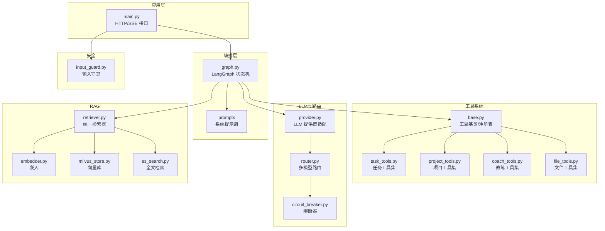
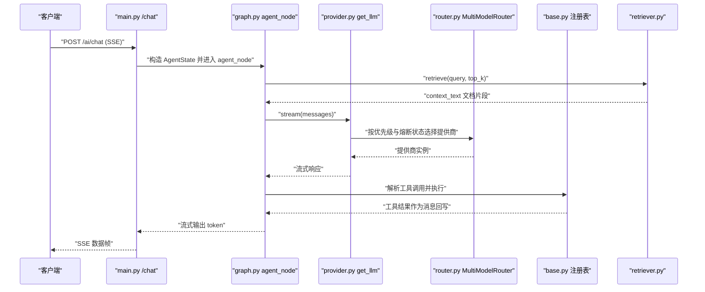
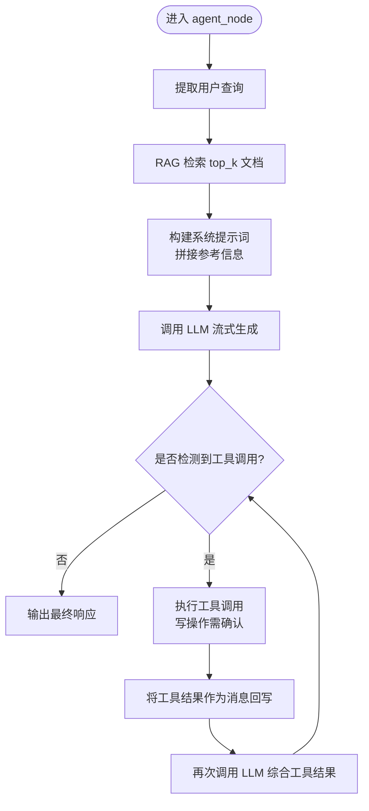
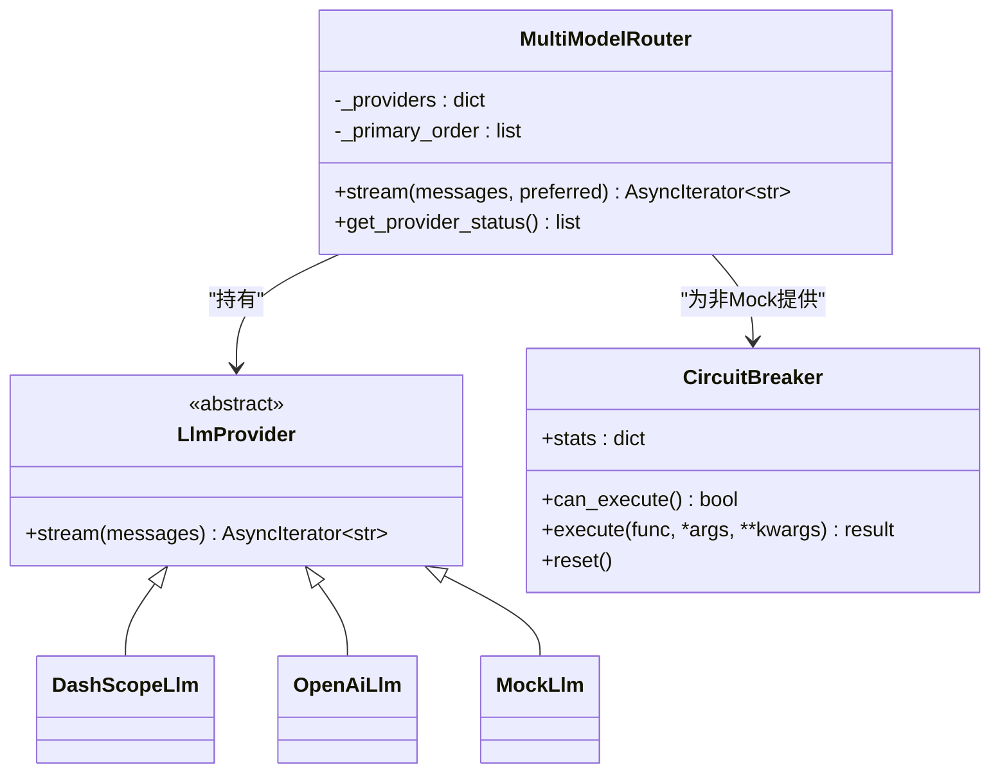
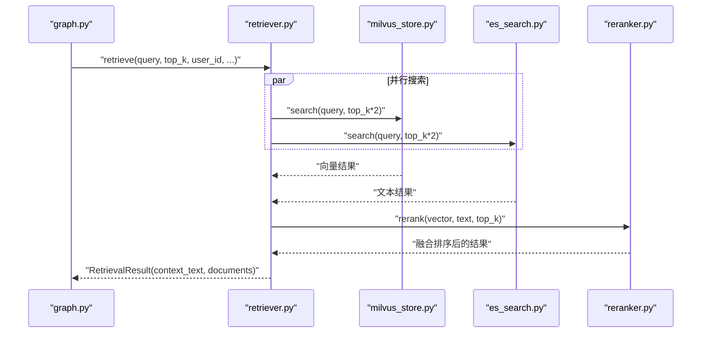
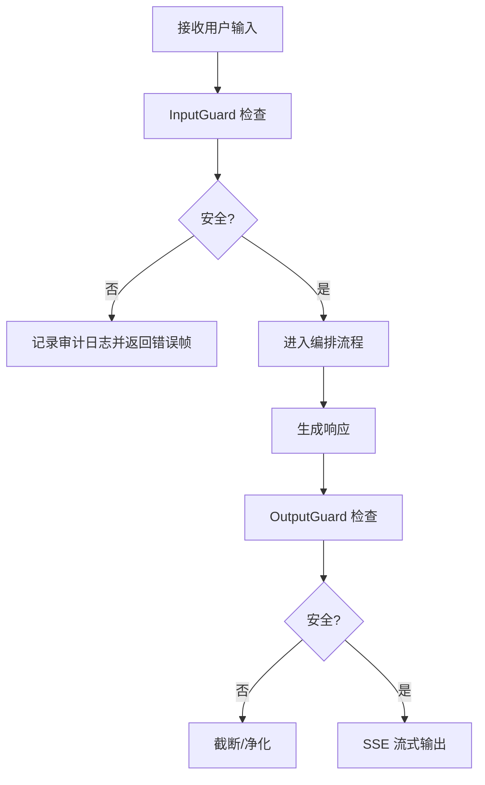
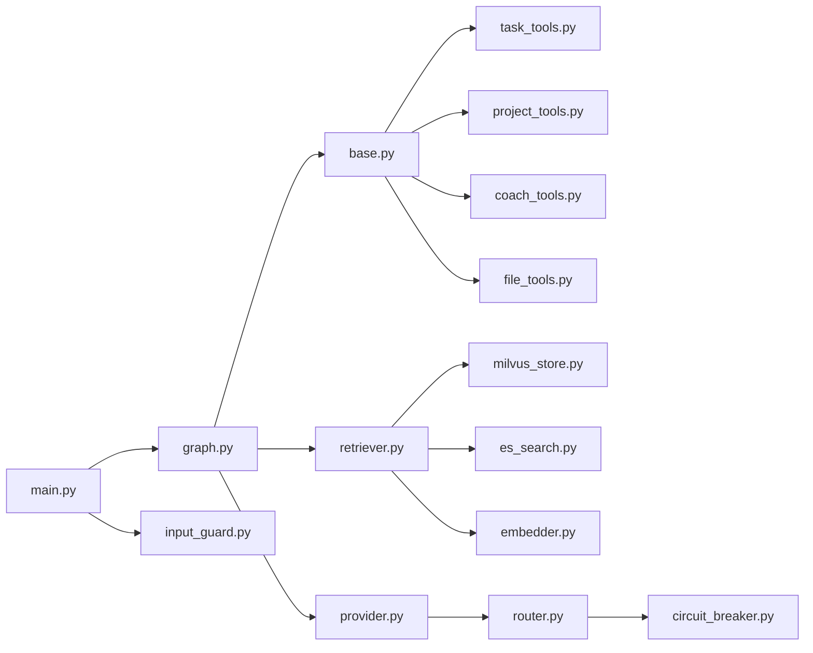

# AI编排器服务

<cite>
**本文引用的文件**
- [main.py](file://workspace/ai-orchestrator/app/main.py)
- [graph.py](file://workspace/ai-orchestrator/app/orchestrator/graph.py)
- [base.py](file://workspace/ai-orchestrator/app/tools/base.py)
- [task_tools.py](file://workspace/ai-orchestrator/app/tools/task_tools.py)
- [project_tools.py](file://workspace/ai-orchestrator/app/tools/project_tools.py)
- [coach_tools.py](file://workspace/ai-orchestrator/app/tools/coach_tools.py)
- [file_tools.py](file://workspace/ai-orchestrator/app/tools/file_tools.py)
- [provider.py](file://workspace/ai-orchestrator/app/llm/provider.py)
- [router.py](file://workspace/ai-orchestrator/app/routing/router.py)
- [circuit_breaker.py](file://workspace/ai-orchestrator/app/routing/circuit_breaker.py)
- [input_guard.py](file://workspace/ai-orchestrator/app/safety/input_guard.py)
- [retriever.py](file://workspace/ai-orchestrator/app/rag/retriever.py)
- [embedder.py](file://workspace/ai-orchestrator/app/rag/embedder.py)
- [es_search.py](file://workspace/ai-orchestrator/app/rag/es_search.py)
- [milvus_store.py](file://workspace/ai-orchestrator/app/rag/milvus_store.py)
</cite>

## 目录
1. [简介](#简介)
2. [项目结构](#项目结构)
3. [核心组件](#核心组件)
4. [架构总览](#架构总览)
5. [详细组件分析](#详细组件分析)
6. [依赖分析](#依赖分析)
7. [性能考虑](#性能考虑)
8. [故障排查指南](#故障排查指南)
9. [结论](#结论)
10. [附录](#附录)

## 简介
本文件为 FDE 工作台的 AI 编排器服务提供系统化技术文档。重点涵盖：
- LangGraph 编排系统的设计理念与 Agent 状态机实现
- 工具系统架构：工具注册表、任务工具集、项目工具集、教练工具集、文件工具集
- LLM 集成策略：提供商适配、提示工程设计、熔断器机制
- RAG 检索系统：向量检索、全文检索、重排序与 ACL 权限过滤
- 安全防护机制：输入过滤、输出净化、审计日志
- 具体实现示例与使用模式

## 项目结构
AI 编排器服务采用“分层+功能域”组织方式：
- 应用入口与路由：FastAPI 应用、SSE 聊天流、工具清单、RAG 搜索/索引
- 编排引擎：LangGraph 状态机、Agent 路由、RAG 检索、工具调用
- 工具系统：抽象基类、工具注册表、各领域工具集
- LLM 与路由：多提供商适配、熔断器、多模型路由
- RAG：向量库 Milvus、ES 全文检索、嵌入、重排序
- 安全：输入守卫、输出守卫、审计日志

图表来源
- [main.py:1-307](file://workspace/ai-orchestrator/app/main.py#L1-L307)
- [graph.py:1-211](file://workspace/ai-orchestrator/app/orchestrator/graph.py#L1-L211)
- [base.py:1-89](file://workspace/ai-orchestrator/app/tools/base.py#L1-L89)
- [task_tools.py:1-221](file://workspace/ai-orchestrator/app/tools/task_tools.py#L1-L221)
- [project_tools.py:1-188](file://workspace/ai-orchestrator/app/tools/project_tools.py#L1-L188)
- [coach_tools.py:1-178](file://workspace/ai-orchestrator/app/tools/coach_tools.py#L1-L178)
- [file_tools.py:1-149](file://workspace/ai-orchestrator/app/tools/file_tools.py#L1-L149)
- [provider.py:1-119](file://workspace/ai-orchestrator/app/llm/provider.py#L1-L119)
- [router.py:1-124](file://workspace/ai-orchestrator/app/routing/router.py#L1-L124)
- [circuit_breaker.py:1-129](file://workspace/ai-orchestrator/app/routing/circuit_breaker.py#L1-L129)
- [retriever.py:1-127](file://workspace/ai-orchestrator/app/rag/retriever.py#L1-L127)
- [embedder.py:1-85](file://workspace/ai-orchestrator/app/rag/embedder.py#L1-L85)
- [milvus_store.py:1-158](file://workspace/ai-orchestrator/app/rag/milvus_store.py#L1-L158)
- [es_search.py:1-128](file://workspace/ai-orchestrator/app/rag/es_search.py#L1-L128)
- [input_guard.py:1-183](file://workspace/ai-orchestrator/app/safety/input_guard.py#L1-L183)

章节来源
- [main.py:1-307](file://workspace/ai-orchestrator/app/main.py#L1-L307)
- [graph.py:1-211](file://workspace/ai-orchestrator/app/orchestrator/graph.py#L1-L211)

## 核心组件
- 应用入口与编排：SSE 聊天流、工具清单、RAG 搜索/索引；LangGraph 状态机负责提取查询、RAG 检索、构建系统提示、调用 LLM、解析工具调用并回写消息
- 工具系统：抽象基类定义工具契约，注册表统一管理工具定义与执行；各领域工具集封装业务 API 调用
- LLM 与路由：多提供商适配（DashScope/OpenAI/Mock），多模型路由与熔断器保护
- RAG：向量检索（Milvus）、全文检索（ES）、嵌入（DashScope/本地 Mock）、重排序与上下文拼接
- 安全：输入守卫检测注入/越狱/敏感信息，输出守卫限制长度与敏感信息

章节来源
- [main.py:89-307](file://workspace/ai-orchestrator/app/main.py#L89-L307)
- [graph.py:113-211](file://workspace/ai-orchestrator/app/orchestrator/graph.py#L113-L211)
- [base.py:33-89](file://workspace/ai-orchestrator/app/tools/base.py#L33-L89)
- [provider.py:107-119](file://workspace/ai-orchestrator/app/llm/provider.py#L107-L119)
- [router.py:14-124](file://workspace/ai-orchestrator/app/routing/router.py#L14-L124)
- [circuit_breaker.py:36-129](file://workspace/ai-orchestrator/app/routing/circuit_breaker.py#L36-L129)
- [retriever.py:32-127](file://workspace/ai-orchestrator/app/rag/retriever.py#L32-L127)
- [input_guard.py:96-183](file://workspace/ai-orchestrator/app/safety/input_guard.py#L96-L183)

## 架构总览
AI 编排器服务以 LangGraph 为核心，串联 LLM、RAG 与工具系统，并通过多模型路由与熔断器保障稳定性。

图表来源
- [main.py:89-172](file://workspace/ai-orchestrator/app/main.py#L89-L172)
- [graph.py:113-183](file://workspace/ai-orchestrator/app/orchestrator/graph.py#L113-L183)
- [provider.py:107-119](file://workspace/ai-orchestrator/app/llm/provider.py#L107-L119)
- [router.py:54-96](file://workspace/ai-orchestrator/app/routing/router.py#L54-L96)
- [base.py:76-89](file://workspace/ai-orchestrator/app/tools/base.py#L76-L89)
- [retriever.py:49-102](file://workspace/ai-orchestrator/app/rag/retriever.py#L49-L102)

## 详细组件分析

### LangGraph 编排系统与 Agent 状态机
- 设计理念
  - 将“RAG 检索 + 工具调用 + LLM 对话”封装为单一 Agent 节点，简化编排复杂度
  - 使用 LangGraph StateGraph 构建线性流程，未来可扩展为多 Agent 路由
- 状态机实现
  - AgentState 包含 messages、assistant_id、mode、context、response_chunks
  - 路由器根据 assistant_id 映射到 agent 名称（任务/项目/教练/文件/聊天）
  - 查询提取：从最后一条用户消息提取 query
  - 上下文拼接：将 RAG 检索结果拼接到系统提示词末尾
  - 工具调用：解析 LLM 输出中的工具调用 JSON，执行并回写消息
  - 迭代上限：防止无限工具循环，默认最多 8 次迭代
- 关键流程图

图表来源
- [graph.py:113-183](file://workspace/ai-orchestrator/app/orchestrator/graph.py#L113-L183)

章节来源
- [graph.py:17-23](file://workspace/ai-orchestrator/app/orchestrator/graph.py#L17-L23)
- [graph.py:26-38](file://workspace/ai-orchestrator/app/orchestrator/graph.py#L26-L38)
- [graph.py:41-58](file://workspace/ai-orchestrator/app/orchestrator/graph.py#L41-L58)
- [graph.py:61-73](file://workspace/ai-orchestrator/app/orchestrator/graph.py#L61-L73)
- [graph.py:76-110](file://workspace/ai-orchestrator/app/orchestrator/graph.py#L76-L110)
- [graph.py:186-211](file://workspace/ai-orchestrator/app/orchestrator/graph.py#L186-L211)

### 工具系统架构
- 抽象与注册表
  - BaseTool 定义工具契约（definition 属性、call 方法、write 标记）
  - ToolRegistry 统一注册、导出 OpenAI 兼容函数定义、执行工具、识别写操作
- 工具集划分
  - 任务工具集：查询/创建/更新/批量更新/详情
  - 项目工具集：项目列表/摘要/周报/风险/仪表盘
  - 教练工具集：最佳实践/详情/SOP/学习路径/个性化推荐
  - 文件工具集：搜索/目录树/详情/配额
- 写操作策略
  - 写工具在解析阶段直接返回“需要用户确认”的工具结果，避免自动执行

```mermaid
classDiagram
class BaseTool {
+definition : ToolDefinition
+call(arguments) ToolResult
+is_write_tool : bool
}
class ToolDefinition {
+name : str
+description : str
+parameters : dict
}
class ToolResult {
+tool_name : str
+success : bool
+content : str
+data : Any
}
class ToolRegistry {
+register(tool)
+get(name) BaseTool
+get_definitions() list
+execute(name, arguments) ToolResult
+is_write_tool(name) bool
}
class ListTasksTool
class UpdateTaskTool
class CreateTaskTool
class BatchUpdateTasksTool
class GetTaskDetailTool
class ListProjectsTool
class GetProjectSummaryTool
class GetWeeklyReportTool
class ListProjectRisksTool
class DashboardSummaryTool
class ListBestPracticesTool
class GetPracticeDetailTool
class ListSopsTool
class GetLearningPathsTool
class GetRecommendationsTool
class SearchFilesTool
class GetFileTreeTool
class GetFileDetailTool
class GetFileQuotaTool
BaseTool <|-- ListTasksTool
BaseTool <|-- UpdateTaskTool
BaseTool <|-- CreateTaskTool
BaseTool <|-- BatchUpdateTasksTool
BaseTool <|-- GetTaskDetailTool
BaseTool <|-- ListProjectsTool
BaseTool <|-- GetProjectSummaryTool
BaseTool <|-- GetWeeklyReportTool
BaseTool <|-- ListProjectRisksTool
BaseTool <|-- DashboardSummaryTool
BaseTool <|-- ListBestPracticesTool
BaseTool <|-- GetPracticeDetailTool
BaseTool <|-- ListSopsTool
BaseTool <|-- GetLearningPathsTool
BaseTool <|-- GetRecommendationsTool
BaseTool <|-- SearchFilesTool
BaseTool <|-- GetFileTreeTool
BaseTool <|-- GetFileDetailTool
BaseTool <|-- GetFileQuotaTool
ToolRegistry --> BaseTool : "管理"
```

图表来源
- [base.py:33-89](file://workspace/ai-orchestrator/app/tools/base.py#L33-L89)
- [task_tools.py:43-221](file://workspace/ai-orchestrator/app/tools/task_tools.py#L43-L221)
- [project_tools.py:33-188](file://workspace/ai-orchestrator/app/tools/project_tools.py#L33-L188)
- [coach_tools.py:26-178](file://workspace/ai-orchestrator/app/tools/coach_tools.py#L26-L178)
- [file_tools.py:26-149](file://workspace/ai-orchestrator/app/tools/file_tools.py#L26-L149)

章节来源
- [base.py:9-31](file://workspace/ai-orchestrator/app/tools/base.py#L9-L31)
- [base.py:50-89](file://workspace/ai-orchestrator/app/tools/base.py#L50-L89)
- [task_tools.py:19-41](file://workspace/ai-orchestrator/app/tools/task_tools.py#L19-L41)
- [project_tools.py:18-31](file://workspace/ai-orchestrator/app/tools/project_tools.py#L18-L31)
- [coach_tools.py:18-25](file://workspace/ai-orchestrator/app/tools/coach_tools.py#L18-L25)
- [file_tools.py:18-24](file://workspace/ai-orchestrator/app/tools/file_tools.py#L18-L24)

### LLM 集成策略
- 提供商适配
  - DashScopeLlm、OpenAiLlm、MockLlm 三类实现，均实现统一 stream 接口
  - 通过配置动态选择真实提供商或回退 Mock
- 多模型路由
  - 优先级：DashScope → OpenAI → Mock
  - 通过 CircuitBreaker 防止对失败提供商的持续冲击
- 熔断器机制
  - CLOSED/HALF_OPEN/OPEN 三种状态，失败阈值与恢复超时可配置
  - 半开状态下限制探测调用次数，成功则回到 CLOSED

图表来源
- [provider.py:10-119](file://workspace/ai-orchestrator/app/llm/provider.py#L10-L119)
- [router.py:14-124](file://workspace/ai-orchestrator/app/routing/router.py#L14-L124)
- [circuit_breaker.py:36-129](file://workspace/ai-orchestrator/app/routing/circuit_breaker.py#L36-L129)

章节来源
- [provider.py:16-119](file://workspace/ai-orchestrator/app/llm/provider.py#L16-L119)
- [router.py:23-96](file://workspace/ai-orchestrator/app/routing/router.py#L23-L96)
- [circuit_breaker.py:18-129](file://workspace/ai-orchestrator/app/routing/circuit_breaker.py#L18-L129)

### RAG 检索系统
- 设计目标
  - 向量检索（语义相似）+ 全文检索（BM25）+ 重排序 + 上下文拼接
  - 支持 ACL 权限过滤（用户维度）
- 组件关系
  - Retriever 统一编排 Milvus 与 ES，支持并行搜索与异常降级
  - MilvusStore：向量 upsert/search/delete，依赖嵌入器
  - ElasticSearch：全文索引/搜索/删除，支持 source 与用户过滤
  - Embedder：DashScope 或 Mock 嵌入
- 检索流程

图表来源
- [graph.py:49-58](file://workspace/ai-orchestrator/app/orchestrator/graph.py#L49-L58)
- [retriever.py:49-102](file://workspace/ai-orchestrator/app/rag/retriever.py#L49-L102)
- [milvus_store.py:101-133](file://workspace/ai-orchestrator/app/rag/milvus_store.py#L101-L133)
- [es_search.py:81-116](file://workspace/ai-orchestrator/app/rag/es_search.py#L81-L116)

章节来源
- [retriever.py:32-127](file://workspace/ai-orchestrator/app/rag/retriever.py#L32-L127)
- [milvus_store.py:21-158](file://workspace/ai-orchestrator/app/rag/milvus_store.py#L21-L158)
- [es_search.py:14-128](file://workspace/ai-orchestrator/app/rag/es_search.py#L14-L128)
- [embedder.py:9-85](file://workspace/ai-orchestrator/app/rag/embedder.py#L9-L85)

### 安全防护机制
- 输入过滤
  - 检测注入/越狱/编码绕过/过长输入/敏感信息（邮箱、卡号）
  - 超长输入直接阻断，高危模式触发拦截
- 输出净化
  - 限制输出长度，检测敏感信息
- 审计日志
  - 记录安全拦截事件、聊天耗时、token 数、输入/输出预览
  - SSE 错误帧携带稳定错误码，便于前端分类处理

图表来源
- [main.py:97-160](file://workspace/ai-orchestrator/app/main.py#L97-L160)
- [input_guard.py:102-132](file://workspace/ai-orchestrator/app/safety/input_guard.py#L102-L132)
- [input_guard.py:141-163](file://workspace/ai-orchestrator/app/safety/input_guard.py#L141-L163)

章节来源
- [input_guard.py:96-183](file://workspace/ai-orchestrator/app/safety/input_guard.py#L96-L183)
- [main.py:56-62](file://workspace/ai-orchestrator/app/main.py#L56-L62)

## 依赖分析
- 组件耦合
  - graph.py 依赖 LLM 提供商、RAG 检索器、工具注册表
  - main.py 依赖 graph、安全守卫、审计日志、路由
  - 工具集通过统一注册表被 graph 调用
  - RAG 模块内部通过组合关系协作
- 外部依赖
  - LLM：langchain_openai ChatOpenAI
  - 向量库：pymilvus
  - 全文检索：elasticsearch AsyncElasticsearch
  - HTTP：aiohttp ClientSession

图表来源
- [main.py:24-31](file://workspace/ai-orchestrator/app/main.py#L24-L31)
- [graph.py:7-11](file://workspace/ai-orchestrator/app/orchestrator/graph.py#L7-L11)
- [retriever.py:9-12](file://workspace/ai-orchestrator/app/rag/retriever.py#L9-L12)

章节来源
- [main.py:24-31](file://workspace/ai-orchestrator/app/main.py#L24-L31)
- [graph.py:7-11](file://workspace/ai-orchestrator/app/orchestrator/graph.py#L7-L11)

## 性能考虑
- 并行检索：RAG 检索对 Milvus 与 ES 并行搜索并设置超时，提升响应速度
- 迭代上限：编排器限制工具调用迭代次数，避免长链路阻塞
- 熔断器：对失败提供商快速熔断，降低整体延迟与错误扩散
- 流式输出：SSE 流式返回，改善首 Token 延迟体验
- 嵌入与向量：批量 upsert 与搜索可进一步优化吞吐

## 故障排查指南
- 常见错误与定位
  - RAG 检索失败：检查 Milvus/ES 可用性、索引是否存在、连接参数
  - LLM 提供商不可用：查看路由状态与熔断器统计，确认 API Key 与网络
  - 工具执行失败：检查工具定义与参数校验、后端业务接口连通性
  - 输入被拦截：查看拦截原因（注入/越狱/敏感信息），调整提示词
- 日志与指标
  - 审计日志包含输入预览、输出预览、耗时、token 数、错误信息
  - 路由器提供各提供商健康状态与统计信息

章节来源
- [main.py:223-248](file://workspace/ai-orchestrator/app/main.py#L223-L248)
- [router.py:97-111](file://workspace/ai-orchestrator/app/routing/router.py#L97-L111)
- [circuit_breaker.py:115-129](file://workspace/ai-orchestrator/app/routing/circuit_breaker.py#L115-L129)
- [input_guard.py:102-132](file://workspace/ai-orchestrator/app/safety/input_guard.py#L102-L132)

## 结论
本服务以 LangGraph 为核心，结合多提供商 LLM、RAG 检索与工具系统，形成可扩展、可观测、可防护的 AI 编排能力。通过熔断器与多模型路由提升稳定性，通过 ACL 过滤与安全守卫强化安全性，通过统一工具注册表与领域工具集实现清晰的职责分离与复用。

## 附录
- 使用模式示例（路径指引）
  - SSE 聊天：[main.py:89-172](file://workspace/ai-orchestrator/app/main.py#L89-L172)
  - 工具清单：[main.py:175-178](file://workspace/ai-orchestrator/app/main.py#L175-L178)
  - RAG 搜索：[main.py:223-248](file://workspace/ai-orchestrator/app/main.py#L223-L248)
  - RAG 索引：[main.py:253-281](file://workspace/ai-orchestrator/app/main.py#L253-L281)
  - 编排主流程：[graph.py:113-183](file://workspace/ai-orchestrator/app/orchestrator/graph.py#L113-L183)
  - 任务工具集：[task_tools.py:43-221](file://workspace/ai-orchestrator/app/tools/task_tools.py#L43-L221)
  - 项目工具集：[project_tools.py:33-188](file://workspace/ai-orchestrator/app/tools/project_tools.py#L33-L188)
  - 教练工具集：[coach_tools.py:26-178](file://workspace/ai-orchestrator/app/tools/coach_tools.py#L26-L178)
  - 文件工具集：[file_tools.py:26-149](file://workspace/ai-orchestrator/app/tools/file_tools.py#L26-L149)
  - LLM 提供商适配：[provider.py:16-119](file://workspace/ai-orchestrator/app/llm/provider.py#L16-L119)
  - 多模型路由：[router.py:14-124](file://workspace/ai-orchestrator/app/routing/router.py#L14-L124)
  - 熔断器：[circuit_breaker.py:36-129](file://workspace/ai-orchestrator/app/routing/circuit_breaker.py#L36-L129)
  - RAG 统一检索器：[retriever.py:32-127](file://workspace/ai-orchestrator/app/rag/retriever.py#L32-L127)
  - 向量库：[milvus_store.py:21-158](file://workspace/ai-orchestrator/app/rag/milvus_store.py#L21-L158)
  - 全文检索：[es_search.py:14-128](file://workspace/ai-orchestrator/app/rag/es_search.py#L14-L128)
  - 嵌入器：[embedder.py:9-85](file://workspace/ai-orchestrator/app/rag/embedder.py#L9-L85)
  - 输入守卫：[input_guard.py:96-183](file://workspace/ai-orchestrator/app/safety/input_guard.py#L96-L183)