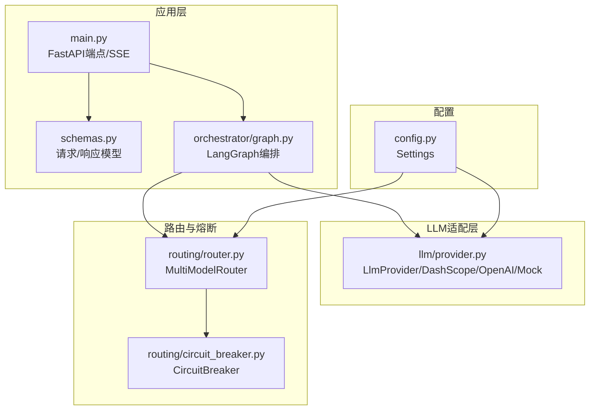
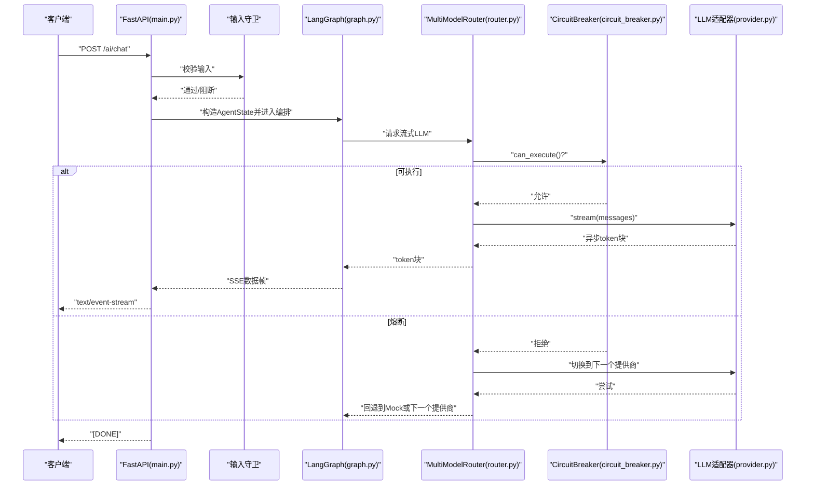
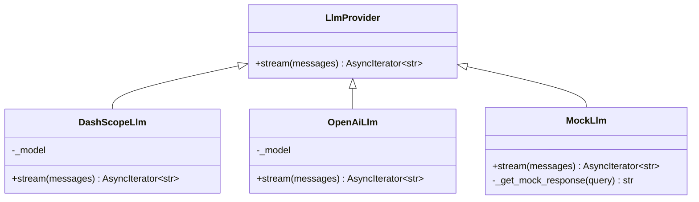
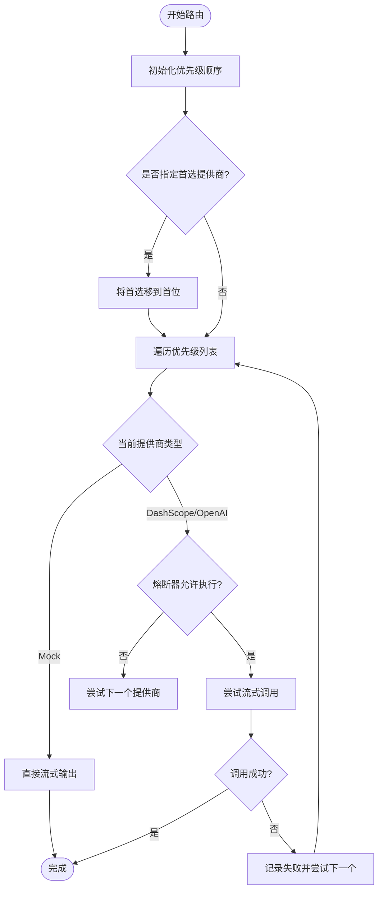
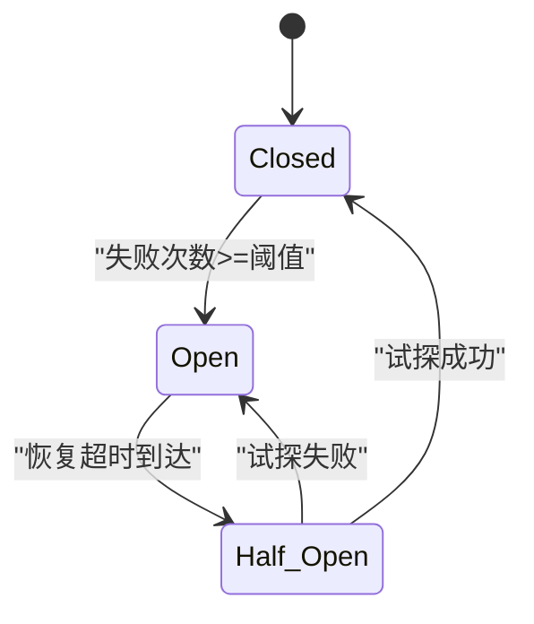
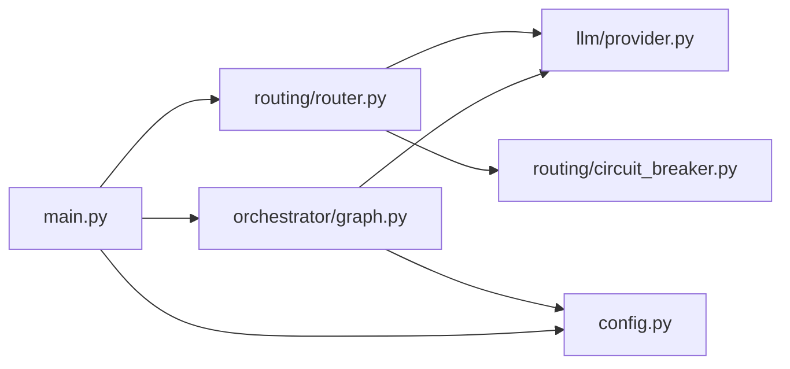

# LLM集成

<cite>
**本文引用的文件**
- [provider.py](file://workspace/ai-orchestrator/app/llm/provider.py)
- [router.py](file://workspace/ai-orchestrator/app/routing/router.py)
- [circuit_breaker.py](file://workspace/ai-orchestrator/app/routing/circuit_breaker.py)
- [config.py](file://workspace/ai-orchestrator/app/config.py)
- [main.py](file://workspace/ai-orchestrator/app/main.py)
- [schemas.py](file://workspace/ai-orchestrator/app/schemas.py)
- [graph.py](file://workspace/ai-orchestrator/app/orchestrator/graph.py)
- [pyproject.toml](file://workspace/ai-orchestrator/pyproject.toml)
- [test_integration.py](file://workspace/ai-orchestrator/tests/test_integration.py)
- [test_main.py](file://workspace/ai-orchestrator/tests/test_main.py)
</cite>

## 目录
1. [简介](#简介)
2. [项目结构](#项目结构)
3. [核心组件](#核心组件)
4. [架构总览](#架构总览)
5. [详细组件分析](#详细组件分析)
6. [依赖分析](#依赖分析)
7. [性能考虑](#性能考虑)
8. [故障排查指南](#故障排查指南)
9. [结论](#结论)
10. [附录](#附录)

## 简介
本文件面向FDE工作台的LLM集成，系统性阐述LLM提供商适配器的设计（DashScope、OpenAI、Mock），统一接口封装与模型路由策略（优先级、故障转移、熔断器保护）、配置管理（环境变量、默认值、运行时状态）、以及扩展新提供商与配置路由策略的实践方法。文档同时提供可视化图示与可追溯的源码路径，帮助开发者快速理解与落地。

## 项目结构
LLM集成位于ai-orchestrator服务中，采用“适配器 + 路由 + 熔断器”的分层设计：
- 适配器层：统一LLM接口，屏蔽不同提供商差异
- 路由层：多提供商路由、优先级与故障转移
- 熔断器层：健康检查、错误统计与自动恢复
- 配置层：环境变量与默认值
- 应用层：FastAPI端点、SSE流式响应、审计与安全

图表来源
- [main.py:1-307](file://workspace/ai-orchestrator/app/main.py#L1-L307)
- [schemas.py:1-42](file://workspace/ai-orchestrator/app/schemas.py#L1-L42)
- [graph.py:1-211](file://workspace/ai-orchestrator/app/orchestrator/graph.py#L1-L211)
- [provider.py:1-119](file://workspace/ai-orchestrator/app/llm/provider.py#L1-L119)
- [router.py:1-124](file://workspace/ai-orchestrator/app/routing/router.py#L1-L124)
- [circuit_breaker.py:1-129](file://workspace/ai-orchestrator/app/routing/circuit_breaker.py#L1-L129)
- [config.py:1-32](file://workspace/ai-orchestrator/app/config.py#L1-L32)

章节来源
- [main.py:1-307](file://workspace/ai-orchestrator/app/main.py#L1-L307)
- [config.py:1-32](file://workspace/ai-orchestrator/app/config.py#L1-L32)

## 核心组件
- LLM适配器
  - 统一抽象：LlmProvider 抽象类定义异步流式接口
  - 具体实现：DashScopeLlm、OpenAiLlm、MockLlm
  - 选择逻辑：根据配置动态选择真实或Mock提供商
- 路由器
  - MultiModelRouter：按优先级路由到可用提供商；支持首选提供商前置
  - 故障转移：当某提供商失败且未被熔断时，自动切换到下一个
  - 状态查询：对外暴露各提供商健康状态
- 熔断器
  - CircuitBreaker：Closed/Open/Half-Open三态，失败阈值、恢复超时、半开并发控制
  - 统计指标：失败次数、总调用数、总失败数、健康状态
- 配置系统
  - Settings：集中管理LLM提供商、模型、RAG、API基础地址等
  - 环境变量：通过.env文件加载，支持运行时覆盖
- 应用层
  - /health：返回服务状态与提供商状态
  - /ai/chat：SSE流式聊天，结合安全守卫与审计日志
  - LangGraph编排：RAG检索、系统提示构建、工具调用与二次LLM

章节来源
- [provider.py:10-119](file://workspace/ai-orchestrator/app/llm/provider.py#L10-L119)
- [router.py:14-124](file://workspace/ai-orchestrator/app/routing/router.py#L14-L124)
- [circuit_breaker.py:18-129](file://workspace/ai-orchestrator/app/routing/circuit_breaker.py#L18-L129)
- [config.py:7-32](file://workspace/ai-orchestrator/app/config.py#L7-L32)
- [main.py:79-172](file://workspace/ai-orchestrator/app/main.py#L79-L172)
- [graph.py:113-183](file://workspace/ai-orchestrator/app/orchestrator/graph.py#L113-L183)

## 架构总览
下图展示了从HTTP请求到LLM流式输出的完整链路，以及熔断器在路由中的作用。

图表来源
- [main.py:89-172](file://workspace/ai-orchestrator/app/main.py#L89-L172)
- [graph.py:113-183](file://workspace/ai-orchestrator/app/orchestrator/graph.py#L113-L183)
- [router.py:54-96](file://workspace/ai-orchestrator/app/routing/router.py#L54-L96)
- [circuit_breaker.py:59-87](file://workspace/ai-orchestrator/app/routing/circuit_breaker.py#L59-L87)
- [provider.py:29-52](file://workspace/ai-orchestrator/app/llm/provider.py#L29-L52)

## 详细组件分析

### LLM提供商适配器设计
- 抽象接口
  - LlmProvider：定义异步流式接口，便于后续扩展其他提供商
- DashScope适配
  - 使用LangChain OpenAI兼容模式，配置DashScope的兼容API端点
  - 设置超时与流式参数，逐块产出内容
- OpenAI适配
  - 使用LangChain OpenAI，直接对接OpenAI API
  - 流式响应逐块产出
- Mock适配
  - 用于开发与测试，基于最后一条用户消息关键字生成模拟回复
  - 当真实API Key缺失时自动回退到Mock
- 选择逻辑
  - get_llm()根据配置选择DashScope、OpenAI或Mock

图表来源
- [provider.py:10-119](file://workspace/ai-orchestrator/app/llm/provider.py#L10-L119)

章节来源
- [provider.py:16-119](file://workspace/ai-orchestrator/app/llm/provider.py#L16-L119)

### 模型路由策略
- 优先级顺序
  - 有API Key时：DashScope优先于OpenAI
  - 无API Key时：Mock作为兜底始终可用
- 首选提供商前置
  - 支持传入preferred参数，将其移动到路由列表首位
- 故障转移
  - 对非Mock提供商，若触发异常则记录失败并尝试下一个
  - 若所有提供商均不可用，则回退到Mock
- 状态查询
  - get_provider_status()返回每个提供商的类型、健康状态与统计信息

图表来源
- [router.py:28-96](file://workspace/ai-orchestrator/app/routing/router.py#L28-L96)

章节来源
- [router.py:14-124](file://workspace/ai-orchestrator/app/routing/router.py#L14-L124)

### 熔断器机制实现
- 状态机
  - Closed：正常放行
  - Open：超过失败阈值后开启，拒绝请求，等待恢复超时
  - Half-Open：恢复窗口内允许有限次试探调用
- 关键行为
  - can_execute()：根据当前状态与半开试探次数判断是否允许
  - execute(func,...)：包装函数调用，记录成功/失败并转换状态
  - _on_success/_on_failure：更新失败计数、时间戳与状态
  - stats：导出名称、状态、失败次数、总调用数、总失败数、健康状态
- 默认配置
  - 失败阈值、恢复超时、半开最大试探数

图表来源
- [circuit_breaker.py:18-129](file://workspace/ai-orchestrator/app/routing/circuit_breaker.py#L18-L129)

章节来源
- [circuit_breaker.py:36-129](file://workspace/ai-orchestrator/app/routing/circuit_breaker.py#L36-L129)

### 配置管理系统
- 配置项
  - llm_provider：默认DashScope，可选OpenAI或Mock
  - dashscope_api_key/dashscope_model/dashscope_embedding_model
  - openai_api_key/openai_model
  - RAG相关：milvus_host/port、es_host
  - API服务：api_base_url
- 加载方式
  - 通过pydantic-settings从.env文件加载，支持UTF-8编码
- 运行时调整
  - 通过修改.env文件或环境变量即可生效（重启服务以重新加载）

章节来源
- [config.py:7-32](file://workspace/ai-orchestrator/app/config.py#L7-L32)
- [pyproject.toml:14-18](file://workspace/ai-orchestrator/pyproject.toml#L14-L18)

### 应用层集成与SSE流式
- /health：返回服务状态与提供商状态（含熔断器统计）
- /ai/chat：SSE流式聊天
  - 输入安全守卫：拦截高危输入并记录审计
  - LangGraph编排：RAG检索、系统提示、工具调用、二次LLM
  - 流式输出：逐token发送，结束帧[DONE]
- 错误处理：统一异常处理器，SSE错误帧携带稳定错误码

章节来源
- [main.py:79-172](file://workspace/ai-orchestrator/app/main.py#L79-L172)
- [graph.py:113-183](file://workspace/ai-orchestrator/app/orchestrator/graph.py#L113-L183)
- [schemas.py:11-42](file://workspace/ai-orchestrator/app/schemas.py#L11-L42)

## 依赖分析
- 组件耦合
  - graph.py依赖provider.py（选择LLM）与routing/router.py（未来可注入路由）
  - router.py依赖circuit_breaker.py与provider.py
  - main.py依赖router.py与graph.py
- 外部依赖
  - FastAPI、langgraph、langchain、langchain-openai、pydantic-settings
- 循环依赖
  - 未发现循环导入；模块间单向依赖清晰

图表来源
- [main.py:24-31](file://workspace/ai-orchestrator/app/main.py#L24-L31)
- [graph.py:7-11](file://workspace/ai-orchestrator/app/orchestrator/graph.py#L7-L11)
- [router.py:9-11](file://workspace/ai-orchestrator/app/routing/router.py#L9-L11)

章节来源
- [pyproject.toml:8-24](file://workspace/ai-orchestrator/pyproject.toml#L8-L24)

## 性能考虑
- 流式输出
  - 所有LLM提供商均采用异步流式，降低首字节延迟，提升用户体验
- 路由优先级
  - 将有API Key的提供商置于前位，减少Mock回退概率
- 熔断器
  - 失败阈值与恢复超时避免雪崩效应；半开试探控制恢复风险
- 并发与资源
  - LangChain OpenAI默认超时30秒，可根据网络状况调整
- RAG与工具调用
  - RAG检索与工具执行可能增加响应时间，建议在编排中限制最大迭代次数

## 故障排查指南
- 常见问题定位
  - /health显示提供商状态：检查各提供商的state与is_healthy
  - /ai/chat无响应：确认安全守卫是否拦截、客户端是否断开、熔断器是否处于Open
- 熔断器相关
  - 状态异常：检查failure_count、total_failures、recovery_timeout
  - 手动恢复：可通过reset()重置熔断器（需在业务侧实现）
- Mock回退
  - 当API Key为空时自动回退到Mock；如需真实LLM，请正确配置.env
- 单元测试参考
  - 集成测试覆盖了熔断器、路由、工具、安全守卫等关键路径

章节来源
- [test_integration.py:88-128](file://workspace/ai-orchestrator/tests/test_integration.py#L88-L128)
- [test_main.py:25-94](file://workspace/ai-orchestrator/tests/test_main.py#L25-L94)

## 结论
该LLM集成以“适配器 + 路由 + 熔断器”为核心，实现了多提供商统一接口、优先级路由与故障转移、健康检查与自动恢复，并通过集中配置与SSE流式输出提供了良好的可维护性与用户体验。通过本文档的扩展指引，可便捷地添加新提供商与优化路由策略。

## 附录

### 实现示例：添加新的LLM提供商
- 步骤
  1) 在适配器层新增提供商类，继承LlmProvider并实现stream
  2) 在路由层初始化阶段加入该提供商与对应熔断器配置
  3) 在配置层新增相关字段与默认值
  4) 在选择逻辑中支持该提供商
  5) 编写单元测试验证流式输出与回退逻辑
- 参考路径
  - 新增提供商类：[provider.py:10-119](file://workspace/ai-orchestrator/app/llm/provider.py#L10-L119)
  - 初始化提供商池：[router.py:28-53](file://workspace/ai-orchestrator/app/routing/router.py#L28-L53)
  - 配置新增字段：[config.py:12-28](file://workspace/ai-orchestrator/app/config.py#L12-L28)
  - 选择逻辑：[provider.py:107-119](file://workspace/ai-orchestrator/app/llm/provider.py#L107-L119)
  - 单测参考：[test_integration.py:232-253](file://workspace/ai-orchestrator/tests/test_integration.py#L232-L253)

### 实现示例：配置路由策略
- 优先级调整
  - 在调用路由时传入preferred参数，将目标提供商前置
- 熔断器参数调优
  - 修改CircuitBreakerConfig的failure_threshold、recovery_timeout、half_open_max_calls
- 参考路径
  - 路由调用与首选提供商：[router.py:62-67](file://workspace/ai-orchestrator/app/routing/router.py#L62-L67)
  - 熔断器配置：[router.py:33-46](file://workspace/ai-orchestrator/app/routing/router.py#L33-L46)
  - 熔断器配置类：[circuit_breaker.py:24-29](file://workspace/ai-orchestrator/app/routing/circuit_breaker.py#L24-L29)