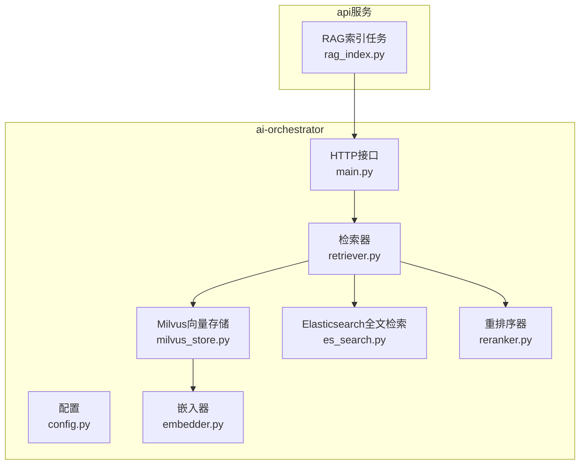
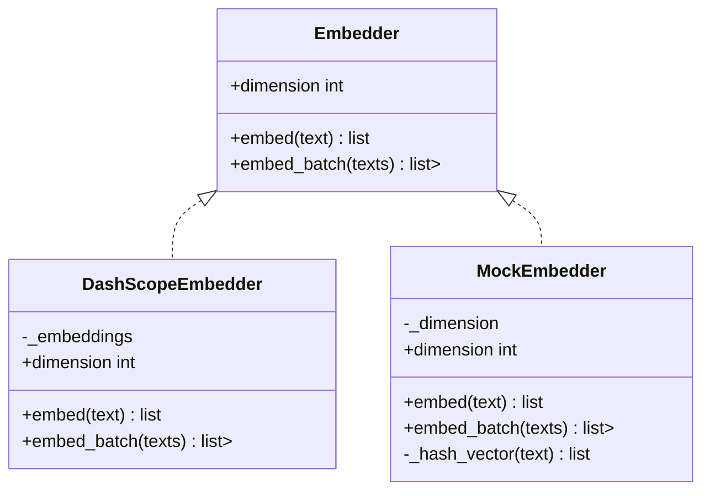
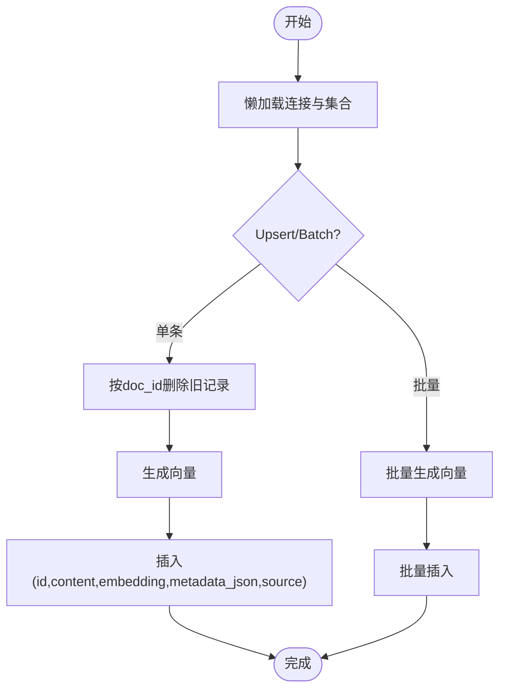
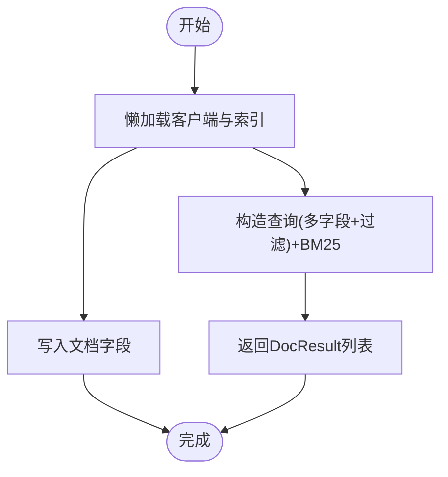
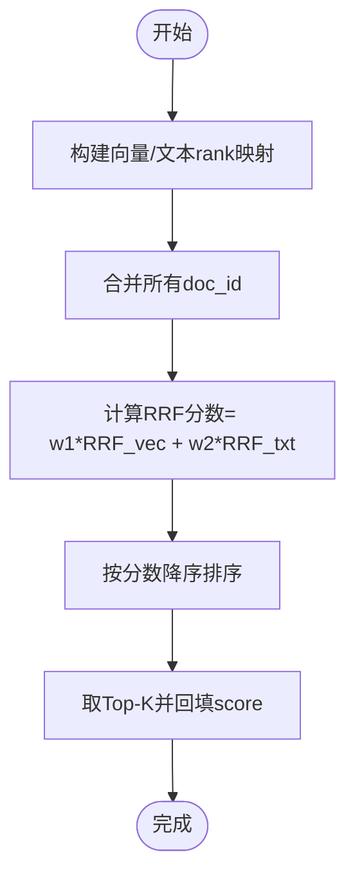
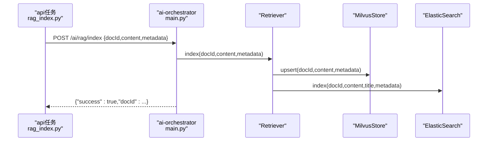
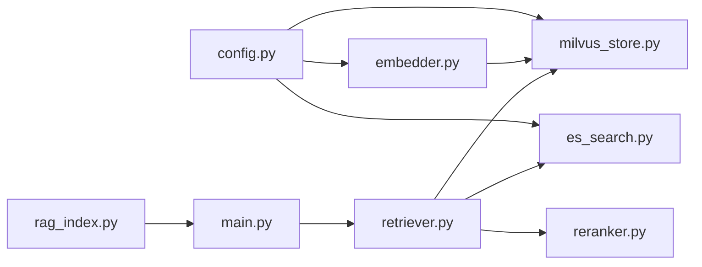

# RAG检索系统

<cite>
**本文引用的文件**
- [embedder.py](file://workspace/ai-orchestrator/app/rag/embedder.py)
- [milvus_store.py](file://workspace/ai-orchestrator/app/rag/milvus_store.py)
- [es_search.py](file://workspace/ai-orchestrator/app/rag/es_search.py)
- [reranker.py](file://workspace/ai-orchestrator/app/rag/reranker.py)
- [retriever.py](file://workspace/ai-orchestrator/app/rag/retriever.py)
- [config.py](file://workspace/ai-orchestrator/app/config.py)
- [main.py](file://workspace/ai-orchestrator/app/main.py)
- [rag_index.py](file://workspace/api/app/tasks/rag_index.py)
- [pyproject.toml](file://workspace/ai-orchestrator/pyproject.toml)
- [test_integration.py](file://workspace/ai-orchestrator/tests/test_integration.py)
</cite>

## 目录
1. [简介](#简介)
2. [项目结构](#项目结构)
3. [核心组件](#核心组件)
4. [架构总览](#架构总览)
5. [详细组件分析](#详细组件分析)
6. [依赖分析](#依赖分析)
7. [性能考虑](#性能考虑)
8. [故障排查指南](#故障排查指南)
9. [结论](#结论)
10. [附录：最佳实践示例](#附录最佳实践示例)

## 简介
本文件面向FDE工作台的RAG（检索增强生成）检索系统，聚焦混合检索架构的设计与实现，涵盖以下关键主题：
- 混合检索：Elasticsearch全文检索与Milvus向量检索的协同工作
- 文档嵌入器Embedder：文本预处理、向量生成与维度管理
- 检索器Retriever：查询处理、多源检索与结果合并
- 重排序器Reranker：融合评分与重排策略
- 实现示例：文档索引、查询检索与性能优化的最佳实践

该系统通过统一的检索器在异步并发中并行调用向量与全文检索，并在可选阶段进行重排，最终输出可用于LLM提示注入的上下文。

## 项目结构
RAG相关代码位于ai-orchestrator服务的app/rag目录，配合配置、API端点与业务侧的任务调度共同构成完整的RAG链路。



图表来源
- [config.py:1-32](file://workspace/ai-orchestrator/app/config.py#L1-L32)
- [embedder.py:1-85](file://workspace/ai-orchestrator/app/rag/embedder.py#L1-L85)
- [milvus_store.py:1-158](file://workspace/ai-orchestrator/app/rag/milvus_store.py#L1-L158)
- [es_search.py:1-128](file://workspace/ai-orchestrator/app/rag/es_search.py#L1-L128)
- [reranker.py:1-129](file://workspace/ai-orchestrator/app/rag/reranker.py#L1-L129)
- [retriever.py:1-127](file://workspace/ai-orchestrator/app/rag/retriever.py#L1-L127)
- [main.py:223-307](file://workspace/ai-orchestrator/app/main.py#L223-L307)
- [rag_index.py:1-114](file://workspace/api/app/tasks/rag_index.py#L1-L114)

章节来源
- [config.py:1-32](file://workspace/ai-orchestrator/app/config.py#L1-L32)
- [pyproject.toml:1-29](file://workspace/ai-orchestrator/pyproject.toml#L1-L29)

## 核心组件
- 嵌入器Embedder：抽象接口与具体实现（DashScope与Mock），负责文本到向量的映射与批量处理，暴露维度信息用于向量索引字段定义。
- Milvus向量存储MilvusStore：封装连接、集合初始化、插入/更新、批量插入、搜索与删除；使用Cosine距离进行相似度检索。
- Elasticsearch全文检索ElasticSearch：懒加载客户端、索引映射（中文分词）、BM25检索、按source与用户过滤、删除。
- 重排序器Reranker：提供Reciprocal Rank Fusion（RRF）与简单分数融合两种策略，支持权重配置与去重合并。
- 检索器Retriever：统一入口，协调向量与全文检索的并行执行、异常降级、结果选择与上下文构建；同时提供索引与删除能力。
- HTTP接口与任务：/ai/rag/search、/ai/rag/index、/ai/rag/{doc_id}等端点；业务侧Celery任务转发至ai-orchestrator完成实际索引/删除。

章节来源
- [embedder.py:9-85](file://workspace/ai-orchestrator/app/rag/embedder.py#L9-L85)
- [milvus_store.py:21-158](file://workspace/ai-orchestrator/app/rag/milvus_store.py#L21-L158)
- [es_search.py:14-128](file://workspace/ai-orchestrator/app/rag/es_search.py#L14-L128)
- [reranker.py:10-129](file://workspace/ai-orchestrator/app/rag/reranker.py#L10-L129)
- [retriever.py:32-127](file://workspace/ai-orchestrator/app/rag/retriever.py#L32-L127)
- [main.py:223-307](file://workspace/ai-orchestrator/app/main.py#L223-L307)
- [rag_index.py:1-114](file://workspace/api/app/tasks/rag_index.py#L1-L114)

## 架构总览
混合检索的整体流程如下：

```mermaid
sequenceDiagram
participant 客户端 as "客户端"
participant API as "HTTP接口<br/>main.py"
participant 检索器 as "检索器<br/>retriever.py"
participant 向量 as "MilvusStore<br/>milvus_store.py"
participant 全文 as "ElasticSearch<br/>es_search.py"
participant 重排 as "HybridReranker<br/>reranker.py"
客户端->>API : GET /ai/rag/search?query&top_k
API->>检索器 : retrieve(query, top_k)
检索器->>向量 : search(query, top_k*2, 过滤条件)
检索器->>全文 : search(query, top_k*2, 过滤条件)
并行等待返回或超时
alt 向量与全文均有结果
检索器->>重排 : rerank(向量结果, 全文结果, top_k)
重排-->>检索器 : 合并后的Top-K
else 仅向量或仅全文
检索器-->>检索器 : 直接取Top-K
end
检索器-->>API : 结果列表 + 来源标记
API-->>客户端 : 返回JSON
```

图表来源
- [main.py:223-248](file://workspace/ai-orchestrator/app/main.py#L223-L248)
- [retriever.py:49-102](file://workspace/ai-orchestrator/app/rag/retriever.py#L49-L102)
- [milvus_store.py:101-133](file://workspace/ai-orchestrator/app/rag/milvus_store.py#L101-L133)
- [es_search.py:81-116](file://workspace/ai-orchestrator/app/rag/es_search.py#L81-L116)
- [reranker.py:27-71](file://workspace/ai-orchestrator/app/rag/reranker.py#L27-L71)

## 详细组件分析

### 嵌入器Embedder
- 抽象接口：定义单条与批量向量生成方法以及维度属性。
- DashScope实现：基于OpenAI兼容接口，使用配置中的模型与密钥；适合生产环境。
- Mock实现：开发/测试用，返回确定性伪随机向量，便于本地验证与回归测试。
- 维度管理：Milvus集合的向量字段维度由嵌入器维度决定，确保向量化一致。



图表来源
- [embedder.py:9-85](file://workspace/ai-orchestrator/app/rag/embedder.py#L9-L85)

章节来源
- [embedder.py:9-85](file://workspace/ai-orchestrator/app/rag/embedder.py#L9-L85)
- [milvus_store.py:47](file://workspace/ai-orchestrator/app/rag/milvus_store.py#L47)

### Milvus向量存储MilvusStore
- 连接与懒加载：首次使用时建立连接、检查集合存在性、不存在则按嵌入器维度创建集合并加载。
- 插入/更新：先按doc_id删除旧记录，再插入新内容与向量；批量插入支持多条文档。
- 搜索：对查询文本与问题文本分别生成向量，使用Cosine距离与nprobe参数进行检索，支持表达式过滤。
- 删除：按doc_id或source删除，返回布尔或计数。



图表来源
- [milvus_store.py:31-81](file://workspace/ai-orchestrator/app/rag/milvus_store.py#L31-L81)
- [milvus_store.py:83-99](file://workspace/ai-orchestrator/app/rag/milvus_store.py#L83-L99)
- [milvus_store.py:101-133](file://workspace/ai-orchestrator/app/rag/milvus_store.py#L101-L133)

章节来源
- [milvus_store.py:21-158](file://workspace/ai-orchestrator/app/rag/milvus_store.py#L21-L158)

### Elasticsearch全文检索ElasticSearch
- 懒加载客户端：首次使用时创建AsyncElasticsearch实例，必要时创建索引并定义中文分词映射。
- 索引：写入content、title、source、doc_type、metadata与时间戳。
- 检索：BM25 best_fields匹配，支持按source与用户过滤，返回DocResult列表。
- 删除：按doc_id删除。



图表来源
- [es_search.py:23-57](file://workspace/ai-orchestrator/app/rag/es_search.py#L23-L57)
- [es_search.py:58-79](file://workspace/ai-orchestrator/app/rag/es_search.py#L58-L79)
- [es_search.py:81-116](file://workspace/ai-orchestrator/app/rag/es_search.py#L81-L116)

章节来源
- [es_search.py:14-128](file://workspace/ai-orchestrator/app/rag/es_search.py#L14-L128)

### 重排序器Reranker
- HybridReranker（RRF）：计算每个文档在向量与全文中的倒数排名分数，加权求和作为最终得分；保留最高质量的DocResult副本。
- ScoreFusionReranker：对两来源的分数做归一化线性融合，适合不同评分尺度的场景。
- 参数：k控制rank衰减速度，向量/文本权重用于平衡语义与关键词匹配。



图表来源
- [reranker.py:27-71](file://workspace/ai-orchestrator/app/rag/reranker.py#L27-L71)

章节来源
- [reranker.py:10-129](file://workspace/ai-orchestrator/app/rag/reranker.py#L10-L129)

### 检索器Retriever
- 并行检索：对Milvus与Elasticsearch发起任务，设置超时并并发等待，异常优雅降级为空结果。
- 结果选择：若两者均有结果，走HybridReranker；仅向量或仅全文则直接截取Top-K；均无则返回空。
- 上下文构建：将文档内容编号拼接为LLM可用的上下文字符串。
- 索引/删除：统一在Milvus与ES中同步upsert/delete，保证一致性。

```mermaid
sequenceDiagram
participant 调用方 as "调用方"
participant 检索器 as "Retriever"
participant 向量 as "MilvusStore"
participant 全文 as "ElasticSearch"
participant 重排 as "HybridReranker"
调用方->>检索器 : retrieve(query, top_k, 过滤条件)
检索器->>向量 : search(query, top_k*2)
检索器->>全文 : search(query, top_k*2)
并发等待返回或超时
alt 向量与全文均有
检索器->>重排 : rerank(向量, 全文, top_k)
重排-->>检索器 : 排序后的Top-K
else 仅向量
检索器-->>检索器 : 取向量Top-K
else 仅全文
检索器-->>检索器 : 取全文Top-K
else 均无
检索器-->>检索器 : 空结果
end
检索器-->>调用方 : 构建上下文后的结果
```

图表来源
- [retriever.py:49-102](file://workspace/ai-orchestrator/app/rag/retriever.py#L49-L102)
- [reranker.py:27-71](file://workspace/ai-orchestrator/app/rag/reranker.py#L27-L71)

章节来源
- [retriever.py:32-127](file://workspace/ai-orchestrator/app/rag/retriever.py#L32-L127)

### HTTP接口与任务调度
- /ai/rag/search：校验参数，调用检索器，返回结果与来源标记。
- /ai/rag/index：接收docId、content与metadata，委托检索器完成双写索引。
- /ai/rag/{doc_id}：删除指定文档。
- 业务侧Celery任务：将文件解析后的文本转发给ai-orchestrator完成索引/删除，具备自动重试与退避。



图表来源
- [main.py:253-281](file://workspace/ai-orchestrator/app/main.py#L253-L281)
- [retriever.py:104-114](file://workspace/ai-orchestrator/app/rag/retriever.py#L104-L114)
- [rag_index.py:23-81](file://workspace/api/app/tasks/rag_index.py#L23-L81)

章节来源
- [main.py:223-307](file://workspace/ai-orchestrator/app/main.py#L223-L307)
- [rag_index.py:1-114](file://workspace/api/app/tasks/rag_index.py#L1-L114)

## 依赖分析
- 配置层：settings集中管理Milvus与ES主机、端口、嵌入模型与密钥等。
- 语言模型与嵌入：langchain与langchain-openai用于DashScope兼容模式的Embedding调用。
- 异步客户端：Elasticsearch使用AsyncElasticsearch，Milvus使用pymilvus的同步API但通过异步封装使用。
- 测试覆盖：集成测试验证RAG搜索端点、重排序器行为与Mock嵌入器稳定性。



图表来源
- [config.py:1-32](file://workspace/ai-orchestrator/app/config.py#L1-L32)
- [embedder.py:26-49](file://workspace/ai-orchestrator/app/rag/embedder.py#L26-L49)
- [milvus_store.py:36-54](file://workspace/ai-orchestrator/app/rag/milvus_store.py#L36-L54)
- [es_search.py:28-53](file://workspace/ai-orchestrator/app/rag/es_search.py#L28-L53)
- [retriever.py:38-47](file://workspace/ai-orchestrator/app/rag/retriever.py#L38-L47)
- [main.py:223-281](file://workspace/ai-orchestrator/app/main.py#L223-L281)
- [rag_index.py:19-31](file://workspace/api/app/tasks/rag_index.py#L19-L31)

章节来源
- [pyproject.toml:8-24](file://workspace/ai-orchestrator/pyproject.toml#L8-L24)
- [test_integration.py:58-70](file://workspace/ai-orchestrator/tests/test_integration.py#L58-L70)
- [test_integration.py:255-290](file://workspace/ai-orchestrator/tests/test_integration.py#L255-L290)
- [test_integration.py:291-325](file://workspace/ai-orchestrator/tests/test_integration.py#L291-L325)

## 性能考虑
- 并行检索与超时：检索器对向量与全文检索并行执行并设置超时，避免单源阻塞影响整体响应。
- Top-K放大：两路检索均扩大到top_k*2，结合重排得到更稳健的Top-K，降低漏检概率。
- Milvus参数：Cosine距离与nprobe参数影响召回与延迟的平衡，可根据数据规模与QPS调优。
- 批量插入：MilvusStore提供批量upsert接口，减少网络往返与事务开销。
- 分词与映射：ES使用中文分词器，建议根据业务术语调整analyzer与字段权重。
- 降级策略：任一组件异常时返回空结果或部分结果，保障服务可用性。

## 故障排查指南
- Milvus不可用：集合未创建或连接失败时，MilvusStore与MilvusStore会标记为未连接，后续操作返回False；检查主机、端口与嵌入维度是否匹配。
- ES不可用：Elasticsearch懒加载失败时返回空结果；检查ES地址、网络连通与索引映射。
- 重排异常：重排器对空列表有健壮处理；如出现排序异常，检查DocResult的score来源与类型。
- 端点错误：/ai/rag/search对query长度与top_k范围进行校验；/ai/rag/index与/ai/rag/{doc_id}对doc_id长度限制；异常会被转换为领域异常。
- 任务失败：业务侧Celery任务对HTTP错误进行自动重试与退避，4xx错误不再重试；关注日志中的状态码与原因。

章节来源
- [milvus_store.py:56-58](file://workspace/ai-orchestrator/app/rag/milvus_store.py#L56-L58)
- [es_search.py:55-56](file://workspace/ai-orchestrator/app/rag/es_search.py#L55-L56)
- [retriever.py:74-83](file://workspace/ai-orchestrator/app/rag/retriever.py#L74-L83)
- [main.py:226-229](file://workspace/ai-orchestrator/app/main.py#L226-L229)
- [main.py:287-288](file://workspace/ai-orchestrator/app/main.py#L287-L288)
- [rag_index.py:34-41](file://workspace/api/app/tasks/rag_index.py#L34-L41)
- [rag_index.py:70-81](file://workspace/api/app/tasks/rag_index.py#L70-L81)

## 结论
该RAG检索系统通过“向量语义+全文关键词”的混合策略，在异步并行与重排机制的加持下，实现了高召回与高相关性的检索效果。嵌入器、Milvus与ES的职责清晰，检索器作为编排中心承担了多源融合与容错降级的关键角色。配合业务侧的任务调度与严格的参数校验，系统在功能完整性与运行稳定性方面具备良好基础。

## 附录：最佳实践示例
- 文档索引
  - 使用业务侧Celery任务触发ai-orchestrator的/ai/rag/index端点，传入docId、content与metadata；确保content非空，避免跳过。
  - 若需要批量索引，可在上游解析完成后批量调用端点或在ai-orchestrator内部使用MilvusStore的批量upsert接口。
  - 索引成功后，Milvus与ES均会保存对应文档，支持后续混合检索。
- 查询检索
  - 调用/ai/rag/search时，合理设置top_k（建议1-50），query长度控制在合理范围内。
  - 如需限定来源或用户，可通过source_filter与用户ID参数在检索器内部传递至ES与Milvus过滤表达式。
  - 检索结果包含source标记（hybrid/vector/text/none），便于上层逻辑与审计追踪。
- 性能优化
  - 向量检索：根据数据规模与QPS调整nprobe；定期统计召回率与P95延迟，动态优化。
  - 全文检索：针对高频关键词提升字段权重，优化analyzer与映射；必要时引入过滤器减少候选集。
  - 并行与超时：保持检索器的并行策略与超时设置，避免长尾阻塞。
  - 缓存与批处理：对热点查询可引入缓存；对大量文档索引采用批量插入。
- 错误处理
  - 对于Milvus/ES异常，系统会降级为空结果；建议在上层增加重试与告警。
  - 对于端点参数错误，提前在调用侧校验，减少无效请求。

章节来源
- [rag_index.py:42-81](file://workspace/api/app/tasks/rag_index.py#L42-L81)
- [main.py:223-248](file://workspace/ai-orchestrator/app/main.py#L223-L248)
- [retriever.py:49-102](file://workspace/ai-orchestrator/app/rag/retriever.py#L49-L102)
- [milvus_store.py:83-99](file://workspace/ai-orchestrator/app/rag/milvus_store.py#L83-L99)