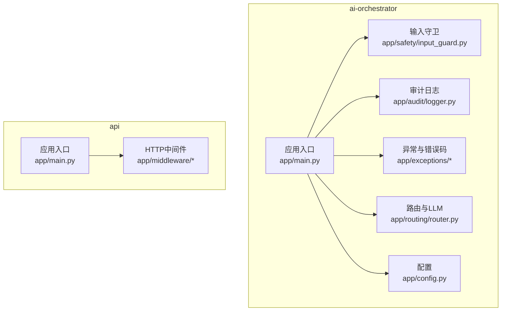
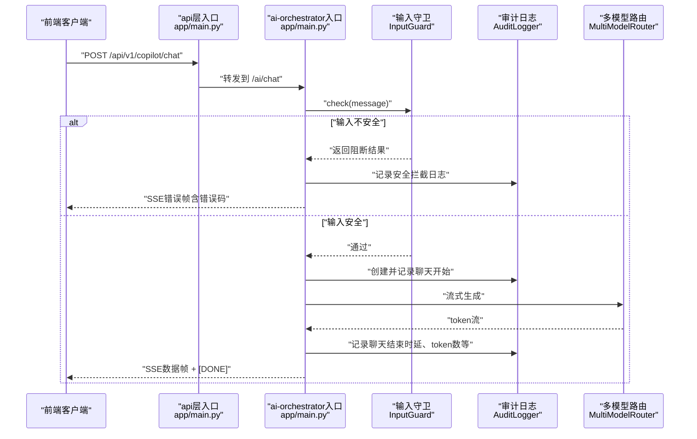
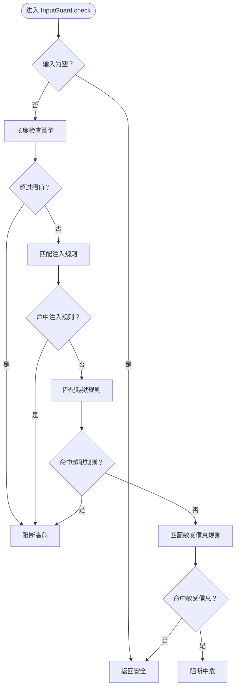
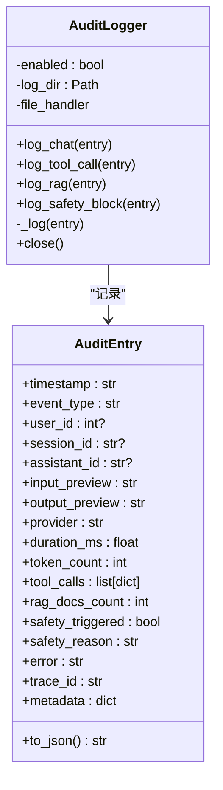
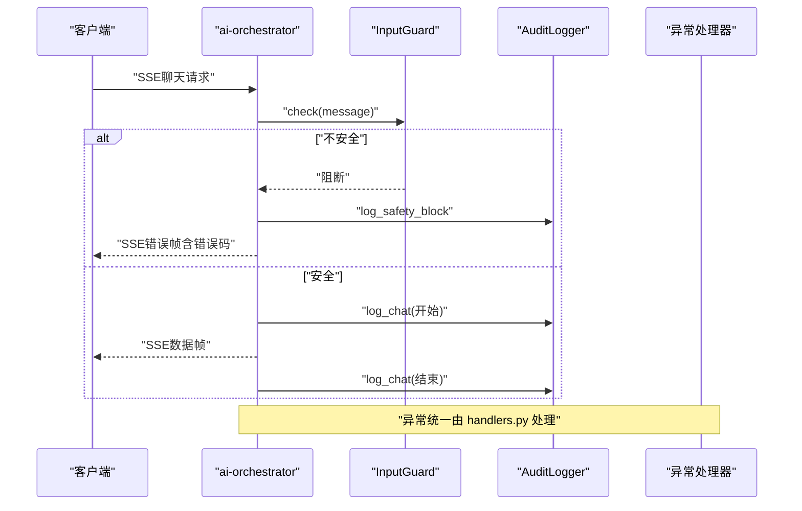
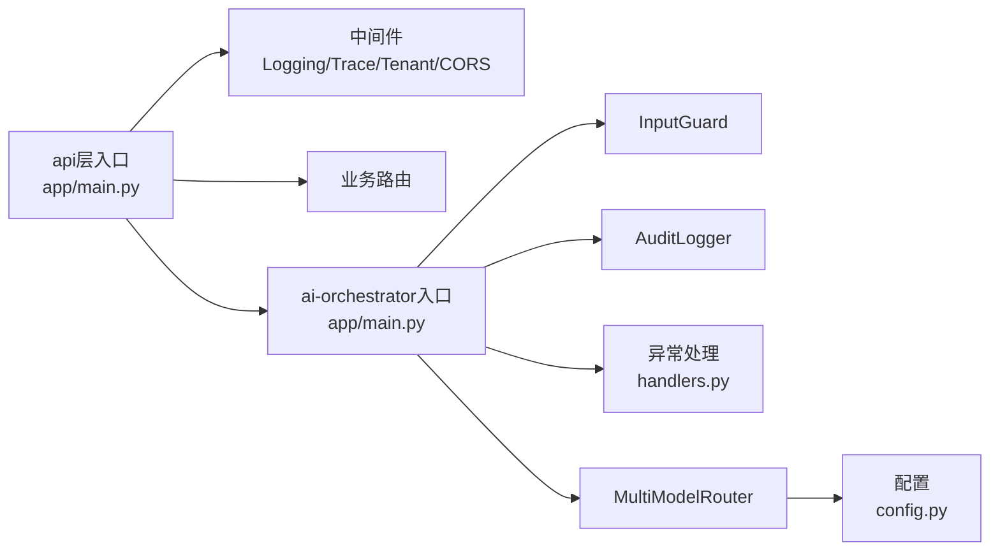

# 安全系统

<cite>
**本文引用的文件**
- [input_guard.py](file://workspace/ai-orchestrator/app/safety/input_guard.py)
- [logger.py](file://workspace/ai-orchestrator/app/audit/logger.py)
- [main.py](file://workspace/ai-orchestrator/app/main.py)
- [biz.py（ai-orchestrator）](file://workspace/ai-orchestrator/app/exceptions/biz.py)
- [codes.py（ai-orchestrator）](file://workspace/ai-orchestrator/app/exceptions/codes.py)
- [handlers.py（异常处理）](file://workspace/ai-orchestrator/app/exceptions/handlers.py)
- [main.py（api层）](file://workspace/api/app/main.py)
- [logging.py（api中间件）](file://workspace/api/app/middleware/logging.py)
- [cors.py（api中间件）](file://workspace/api/app/middleware/cors.py)
- [tenant.py（api中间件）](file://workspace/api/app/middleware/tenant.py)
- [trace.py（api中间件）](file://workspace/api/app/middleware/trace.py)
- [config.py](file://workspace/ai-orchestrator/app/config.py)
- [router.py](file://workspace/ai-orchestrator/app/routing/router.py)
</cite>

## 目录
1. [简介](#简介)
2. [项目结构](#项目结构)
3. [核心组件](#核心组件)
4. [架构总览](#架构总览)
5. [详细组件分析](#详细组件分析)
6. [依赖分析](#依赖分析)
7. [性能考虑](#性能考虑)
8. [故障排查指南](#故障排查指南)
9. [结论](#结论)
10. [附录：配置与使用示例](#附录配置与使用示例)

## 简介
本文件面向FDE工作台的安全系统，聚焦以下目标：
- 输入防护机制InputGuard的设计与实现：恶意输入检测、威胁识别与阻断策略
- 审计日志系统：审计条目的创建、字段定义与日志记录流程
- 安全防护实现细节：Prompt注入防护、输出净化、访问控制
- 安全事件处理流程与告警机制
- 提供可操作的配置与使用示例，帮助快速落地安全策略

## 项目结构
安全系统主要分布在两个服务中：
- ai-orchestrator（AI编排服务）：负责输入/输出安全守卫、审计日志、异常统一处理、路由与LLM调用
- api（业务API服务）：负责HTTP中间件（CORS、日志、追踪、多租户）、异常处理与路由

图表来源
- [main.py:1-307](file://workspace/ai-orchestrator/app/main.py#L1-L307)
- [input_guard.py:1-183](file://workspace/ai-orchestrator/app/safety/input_guard.py#L1-L183)
- [logger.py:1-136](file://workspace/ai-orchestrator/app/audit/logger.py#L1-L136)
- [handlers.py（异常处理）:1-138](file://workspace/ai-orchestrator/app/exceptions/handlers.py#L1-L138)
- [router.py:1-124](file://workspace/ai-orchestrator/app/routing/router.py#L1-L124)
- [config.py:1-32](file://workspace/ai-orchestrator/app/config.py#L1-L32)
- [main.py（api层）:1-73](file://workspace/api/app/main.py#L1-L73)

章节来源
- [main.py:1-307](file://workspace/ai-orchestrator/app/main.py#L1-L307)
- [main.py（api层）:1-73](file://workspace/api/app/main.py#L1-L73)

## 核心组件
- 输入守卫 InputGuard：检测并阻断提示注入、越狱尝试、超长输入与敏感信息泄露等风险
- 输出守卫 OutputGuard：检测并阻断有害内容、响应中的敏感信息与幻觉信息
- 审计日志 AuditLogger：记录聊天、工具调用、RAG检索、安全拦截等事件，支持JSONL文件落盘
- 异常与错误码：统一业务与系统异常，确保前后端一致的错误语义
- 中间件与访问控制：CORS、日志、追踪、多租户上下文绑定，保障接口安全与可观测性

章节来源
- [input_guard.py:1-183](file://workspace/ai-orchestrator/app/safety/input_guard.py#L1-L183)
- [logger.py:1-136](file://workspace/ai-orchestrator/app/audit/logger.py#L1-L136)
- [biz.py（ai-orchestrator）:1-106](file://workspace/ai-orchestrator/app/exceptions/biz.py#L1-L106)
- [codes.py（ai-orchestrator）:1-41](file://workspace/ai-orchestrator/app/exceptions/codes.py#L1-L41)
- [handlers.py（异常处理）:1-138](file://workspace/ai-orchestrator/app/exceptions/handlers.py#L1-L138)
- [cors.py（api中间件）:1-19](file://workspace/api/app/middleware/cors.py#L1-L19)
- [logging.py（api中间件）:1-36](file://workspace/api/app/middleware/logging.py#L1-L36)
- [trace.py（api中间件）:1-30](file://workspace/api/app/middleware/trace.py#L1-L30)
- [tenant.py（api中间件）:1-23](file://workspace/api/app/middleware/tenant.py#L1-L23)

## 架构总览
下图展示了“输入安全 → 审计日志 → 业务处理 → 输出安全”的闭环流程，并体现异常与中间件的作用。

图表来源
- [main.py:89-172](file://workspace/ai-orchestrator/app/main.py#L89-L172)
- [input_guard.py:96-133](file://workspace/ai-orchestrator/app/safety/input_guard.py#L96-L133)
- [logger.py:46-109](file://workspace/ai-orchestrator/app/audit/logger.py#L46-L109)
- [router.py:54-96](file://workspace/ai-orchestrator/app/routing/router.py#L54-L96)

## 详细组件分析

### 输入防护机制 InputGuard
- 设计目标
  - 检测并阻断提示注入、越狱尝试、超长输入与敏感信息泄露
  - 通过正则规则库与阈值控制，形成“基础注入模式 + 越狱模式 + 敏感信息模式”的三段式防护
- 关键实现
  - SafetyResult：统一返回结构，包含是否安全、原因与严重等级
  - INJECTION_PATTERNS/JAILBREAK_PATTERNS/SENSITIVE_DATA_PATTERNS：规则集合
  - InputGuard.check：按序执行长度检查、注入/越狱模式匹配、敏感信息匹配
  - 单例工厂函数：延迟初始化，避免重复实例化
- 威胁识别与阻断策略
  - 忽视先前指令、角色替换、系统标签注入、禁用安全、编码绕过、假设场景、强制服从等注入特征
  - 越狱模式：开发者模式、God模式、禁用/绕过安全
  - 敏感信息：信用卡号、邮箱地址等
  - 阻断策略：一旦触发，立即中断后续处理，记录审计日志并通过SSE返回错误帧

图表来源
- [input_guard.py:96-133](file://workspace/ai-orchestrator/app/safety/input_guard.py#L96-L133)

章节来源
- [input_guard.py:1-183](file://workspace/ai-orchestrator/app/safety/input_guard.py#L1-L183)

### 审计日志系统
- 审计条目定义
  - 字段覆盖时间戳、事件类型、用户/会话/助手标识、输入/输出预览、提供商、耗时、Token数、工具调用列表、RAG文档数量、安全触发标记与原因、错误、追踪ID、元数据等
  - 支持序列化为JSON字符串，便于持久化与检索
- 日志记录流程
  - 文件落盘：按UTC日期命名的JSONL文件，自动创建目录；若路径不可用，降级至stderr并禁用审计
  - 事件类型：聊天、工具调用、RAG检索、安全拦截
  - 写入策略：捕获写入异常，保证不影响主流程
- 使用方式
  - 在输入被阻断或聊天结束后创建并记录审计条目
  - 通过单例工厂函数获取审计器，避免重复初始化

图表来源
- [logger.py:21-109](file://workspace/ai-orchestrator/app/audit/logger.py#L21-L109)

章节来源
- [logger.py:1-136](file://workspace/ai-orchestrator/app/audit/logger.py#L1-L136)

### 安全防护实现细节
- Prompt注入防护
  - 在聊天入口对用户消息进行InputGuard.check，若不安全则记录安全拦截日志并通过SSE返回稳定错误码
  - 错误码与消息由统一异常处理层返回给前端
- 输出净化
  - 当前代码未在编排层实现输出净化逻辑；建议在Agent执行完成后对最终响应进行OutputGuard.check，并结合业务策略决定是否截断或提示
- 访问控制
  - api层通过CORS中间件限制来源与头部，结合Trace/Tenant中间件传递追踪ID与多租户上下文
  - ai-orchestrator层通过统一异常处理与SSE错误帧，向客户端暴露一致的错误语义

章节来源
- [main.py:89-172](file://workspace/ai-orchestrator/app/main.py#L89-L172)
- [handlers.py（异常处理）:60-137](file://workspace/ai-orchestrator/app/exceptions/handlers.py#L60-L137)
- [cors.py（api中间件）:7-19](file://workspace/api/app/middleware/cors.py#L7-L19)
- [trace.py（api中间件）:12-30](file://workspace/api/app/middleware/trace.py#L12-L30)
- [tenant.py（api中间件）:11-23](file://workspace/api/app/middleware/tenant.py#L11-L23)

### 安全事件处理流程与告警机制
- 流程
  - 输入阶段：InputGuard.check → 不安全则记录安全拦截日志 → 返回SSE错误帧（携带稳定错误码）
  - 运行阶段：正常聊天时记录开始/结束审计条目（时延、Token数、错误等）
  - 异常阶段：统一异常处理器根据错误码构造响应体，包含traceId，便于前端与后端关联定位
- 告警机制
  - 审计日志以JSONL形式落盘，可对接外部日志平台进行聚合与告警
  - 建议在日志采集侧基于事件类型与安全触发标记建立告警规则

图表来源
- [main.py:89-172](file://workspace/ai-orchestrator/app/main.py#L89-L172)
- [input_guard.py:96-133](file://workspace/ai-orchestrator/app/safety/input_guard.py#L96-L133)
- [logger.py:90-109](file://workspace/ai-orchestrator/app/audit/logger.py#L90-L109)
- [handlers.py（异常处理）:60-137](file://workspace/ai-orchestrator/app/exceptions/handlers.py#L60-L137)

## 依赖分析
- ai-orchestrator内部依赖
  - 应用入口依赖输入守卫、审计日志、异常处理与路由模块
  - 路由模块依赖配置与电路开关，实现多模型提供商的健康探测与降级
- 服务边界
  - api层负责HTTP中间件与路由，ai-orchestrator负责AI编排与安全
  - 两层通过REST接口通信，异常与错误码保持一致，便于前端统一展示

图表来源
- [main.py（api层）:28-73](file://workspace/api/app/main.py#L28-L73)
- [main.py:1-307](file://workspace/ai-orchestrator/app/main.py#L1-L307)
- [router.py:1-124](file://workspace/ai-orchestrator/app/routing/router.py#L1-L124)
- [config.py:1-32](file://workspace/ai-orchestrator/app/config.py#L1-L32)
- [handlers.py（异常处理）:1-138](file://workspace/ai-orchestrator/app/exceptions/handlers.py#L1-L138)

章节来源
- [main.py（api层）:1-73](file://workspace/api/app/main.py#L1-L73)
- [main.py:1-307](file://workspace/ai-orchestrator/app/main.py#L1-L307)
- [router.py:1-124](file://workspace/ai-orchestrator/app/routing/router.py#L1-L124)
- [config.py:1-32](file://workspace/ai-orchestrator/app/config.py#L1-L32)
- [handlers.py（异常处理）:1-138](file://workspace/ai-orchestrator/app/exceptions/handlers.py#L1-L138)

## 性能考虑
- 输入守卫采用正则匹配与阈值判断，复杂度近似O(n)（n为输入长度），开销极低
- 审计日志采用异步写入（文件句柄）与异常兜底，避免阻塞主流程
- SSE流式响应在客户端断开时及时终止，减少资源占用
- 路由层引入电路开关，避免对故障提供商反复重试

## 故障排查指南
- 输入被阻断
  - 现象：SSE返回错误帧，错误码指向提示注入
  - 排查：查看审计日志中安全拦截事件，核对触发原因与输入预览
  - 参考路径：[main.py:97-121](file://workspace/ai-orchestrator/app/main.py#L97-L121)、[input_guard.py:102-133](file://workspace/ai-orchestrator/app/safety/input_guard.py#L102-L133)、[logger.py:90-95](file://workspace/ai-orchestrator/app/audit/logger.py#L90-L95)
- 审计日志未落盘
  - 现象：未见JSONL文件或出现stderr警告
  - 排查：确认日志目录权限与可用空间，检查初始化异常
  - 参考路径：[logger.py:49-68](file://workspace/ai-orchestrator/app/audit/logger.py#L49-L68)
- 统一异常未生效
  - 现象：错误未按预期格式返回
  - 排查：确认异常处理器已注册，检查traceId生成与响应体结构
  - 参考路径：[handlers.py（异常处理）:60-137](file://workspace/ai-orchestrator/app/exceptions/handlers.py#L60-L137)
- CORS/追踪/多租户问题
  - 现象：跨域失败或缺少追踪ID
  - 排查：核对允许来源与头部，确认中间件顺序与绑定上下文
  - 参考路径：[cors.py（api中间件）:7-19](file://workspace/api/app/middleware/cors.py#L7-L19)、[trace.py（api中间件）:12-30](file://workspace/api/app/middleware/trace.py#L12-L30)、[tenant.py（api中间件）:11-23](file://workspace/api/app/middleware/tenant.py#L11-L23)

章节来源
- [main.py:89-172](file://workspace/ai-orchestrator/app/main.py#L89-L172)
- [input_guard.py:96-133](file://workspace/ai-orchestrator/app/safety/input_guard.py#L96-L133)
- [logger.py:49-68](file://workspace/ai-orchestrator/app/audit/logger.py#L49-L68)
- [handlers.py（异常处理）:60-137](file://workspace/ai-orchestrator/app/exceptions/handlers.py#L60-L137)
- [cors.py（api中间件）:7-19](file://workspace/api/app/middleware/cors.py#L7-L19)
- [trace.py（api中间件）:12-30](file://workspace/api/app/middleware/trace.py#L12-L30)
- [tenant.py（api中间件）:11-23](file://workspace/api/app/middleware/tenant.py#L11-L23)

## 结论
本安全系统以“输入守卫 + 审计日志 + 统一异常处理”为核心，实现了对提示注入与越狱行为的有效阻断，并通过SSE错误帧与稳定错误码保障前端体验一致性。建议在Agent执行完成后增加输出净化环节，并完善日志采集与告警体系，持续提升整体安全性与可观测性。

## 附录：配置与使用示例
- 配置输入守卫阈值
  - 修改最大输入长度参数，平衡安全与可用性
  - 参考路径：[input_guard.py:99-101](file://workspace/ai-orchestrator/app/safety/input_guard.py#L99-L101)
- 启用/调整审计日志
  - 设置日志目录与启用状态，确保路径存在且可写
  - 参考路径：[logger.py:49-68](file://workspace/ai-orchestrator/app/audit/logger.py#L49-L68)
- 统一错误码与消息
  - 在异常处理器中维护错误码映射，确保前后端一致
  - 参考路径：[handlers.py（异常处理）:42-58](file://workspace/ai-orchestrator/app/exceptions/handlers.py#L42-L58)、[codes.py（ai-orchestrator）:21-35](file://workspace/ai-orchestrator/app/exceptions/codes.py#L21-L35)
- 跨域与追踪
  - 配置允许来源与头部，确保TraceMiddleware正确绑定traceId
  - 参考路径：[cors.py（api中间件）:7-19](file://workspace/api/app/middleware/cors.py#L7-L19)、[trace.py（api中间件）:12-30](file://workspace/api/app/middleware/trace.py#L12-L30)
- 多租户上下文
  - 通过TenantMiddleware从请求头提取租户ID并绑定到structlog上下文
  - 参考路径：[tenant.py（api中间件）:11-23](file://workspace/api/app/middleware/tenant.py#L11-L23)