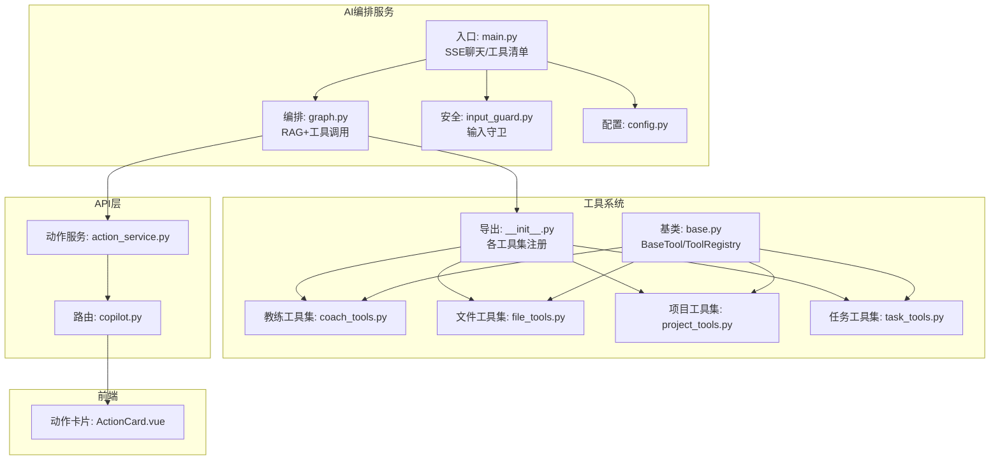
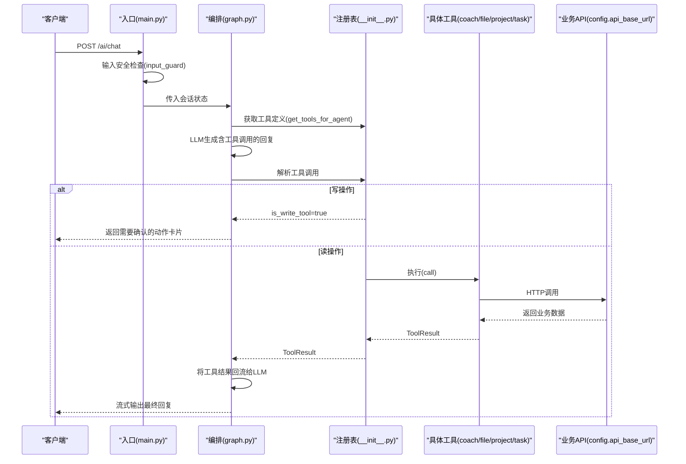
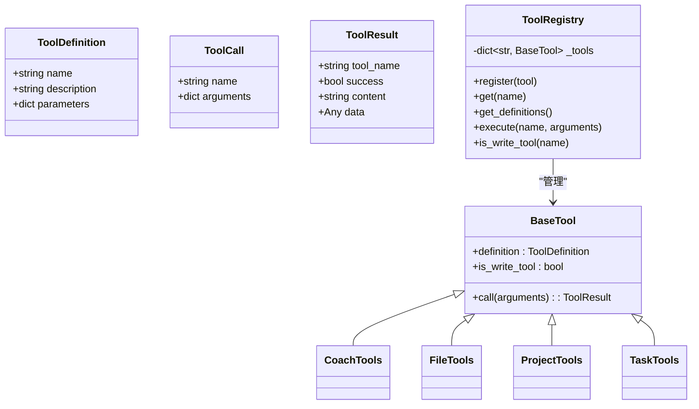
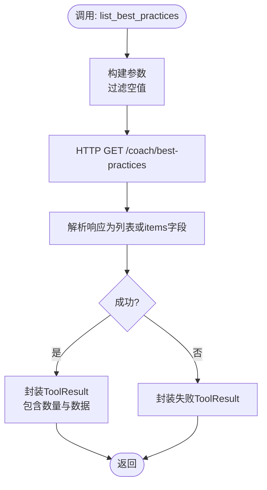
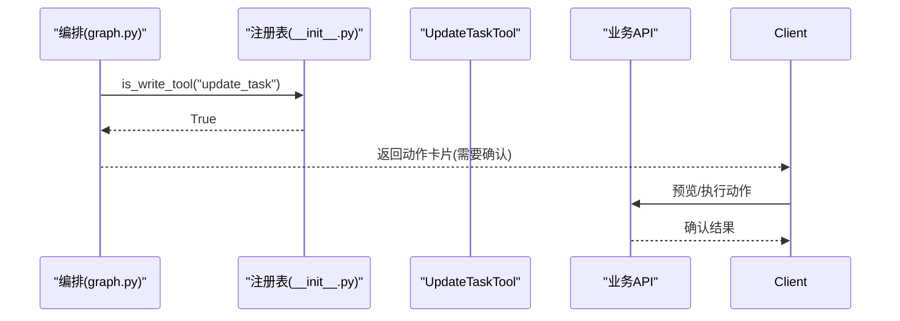
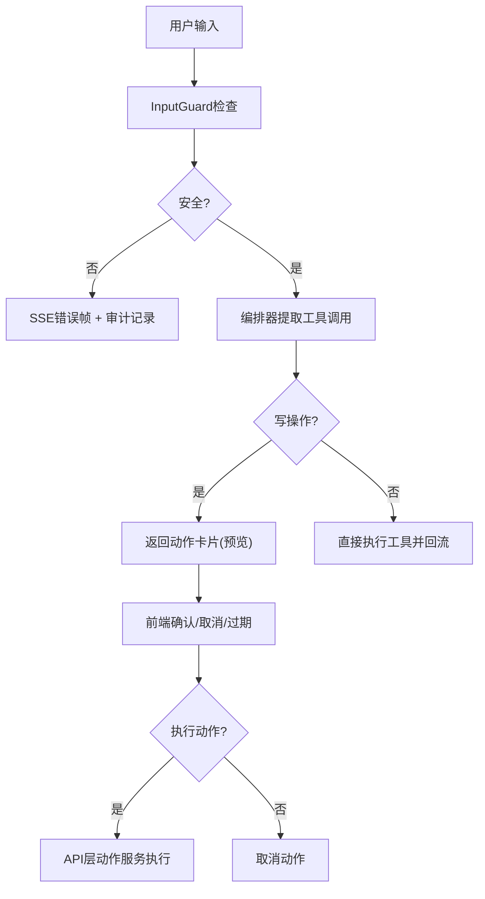
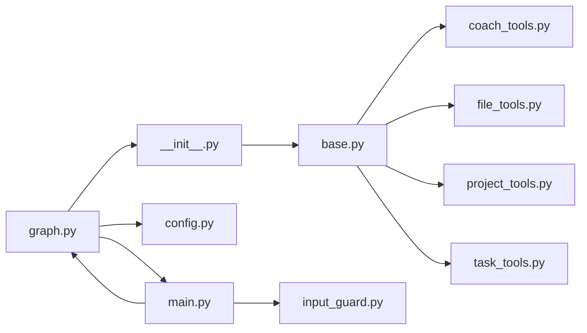

# 工具系统

<cite>
**本文引用的文件**
- [base.py](file://workspace/ai-orchestrator/app/tools/base.py)
- [__init__.py](file://workspace/ai-orchestrator/app/tools/__init__.py)
- [coach_tools.py](file://workspace/ai-orchestrator/app/tools/coach_tools.py)
- [file_tools.py](file://workspace/ai-orchestrator/app/tools/file_tools.py)
- [project_tools.py](file://workspace/ai-orchestrator/app/tools/project_tools.py)
- [task_tools.py](file://workspace/ai-orchestrator/app/tools/task_tools.py)
- [graph.py](file://workspace/ai-orchestrator/app/orchestrator/graph.py)
- [main.py](file://workspace/ai-orchestrator/app/main.py)
- [input_guard.py](file://workspace/ai-orchestrator/app/safety/input_guard.py)
- [config.py](file://workspace/ai-orchestrator/app/config.py)
- [action_service.py](file://workspace/api/app/services/action_service.py)
- [copilot.py](file://workspace/api/app/routers/copilot.py)
- [ActionCard.vue](file://workspace/web/src/components/copilot/cards/ActionCard.vue)
- [test_integration.py](file://workspace/ai-orchestrator/tests/test_integration.py)
</cite>

## 目录
1. [简介](#简介)
2. [项目结构](#项目结构)
3. [核心组件](#核心组件)
4. [架构总览](#架构总览)
5. [详细组件分析](#详细组件分析)
6. [依赖关系分析](#依赖关系分析)
7. [性能考量](#性能考量)
8. [故障排查指南](#故障排查指南)
9. [结论](#结论)
10. [附录](#附录)

## 简介
本文件面向FDE工作台的AI编排服务中的“工具系统”，系统性阐述工具注册表的设计、工具生命周期管理、工具基类BaseTool的实现、各类工具集（教练工具集、文件工具集、项目工具集、任务工具集）的设计与职责边界、工具调用的安全机制与权限控制，并提供扩展与自定义工具的实践指引。目标是帮助开发者快速理解并正确使用与扩展工具系统。

## 项目结构
工具系统位于AI编排服务的Python子工程中，核心文件分布如下：
- 工具基类与注册表：app/tools/base.py
- 工具集导出与注册：app/tools/__init__.py
- 各类工具集实现：app/tools/coach_tools.py、app/tools/file_tools.py、app/tools/project_tools.py、app/tools/task_tools.py
- 调用链路与编排：app/orchestrator/graph.py
- 入口与安全：app/main.py、app/safety/input_guard.py
- 配置：app/config.py
- 两步写操作（预览/执行）在API层：api/app/services/action_service.py、api/app/routers/copilot.py
- 前端动作卡片UI：web/src/components/copilot/cards/ActionCard.vue
- 测试：workspace/ai-orchestrator/tests/test_integration.py

图表来源
- [main.py:1-307](file://workspace/ai-orchestrator/app/main.py#L1-L307)
- [graph.py:1-211](file://workspace/ai-orchestrator/app/orchestrator/graph.py#L1-L211)
- [base.py:1-89](file://workspace/ai-orchestrator/app/tools/base.py#L1-L89)
- [__init__.py:1-86](file://workspace/ai-orchestrator/app/tools/__init__.py#L1-L86)
- [coach_tools.py:1-178](file://workspace/ai-orchestrator/app/tools/coach_tools.py#L1-L178)
- [file_tools.py:1-149](file://workspace/ai-orchestrator/app/tools/file_tools.py#L1-L149)
- [project_tools.py:1-188](file://workspace/ai-orchestrator/app/tools/project_tools.py#L1-L188)
- [task_tools.py:1-221](file://workspace/ai-orchestrator/app/tools/task_tools.py#L1-L221)
- [input_guard.py:1-183](file://workspace/ai-orchestrator/app/safety/input_guard.py#L1-L183)
- [action_service.py:70-103](file://workspace/api/app/services/action_service.py#L70-L103)
- [copilot.py:119-136](file://workspace/api/app/routers/copilot.py#L119-L136)
- [ActionCard.vue:1-206](file://workspace/web/src/components/copilot/cards/ActionCard.vue#L1-L206)

章节来源
- [main.py:1-307](file://workspace/ai-orchestrator/app/main.py#L1-L307)
- [graph.py:1-211](file://workspace/ai-orchestrator/app/orchestrator/graph.py#L1-L211)
- [base.py:1-89](file://workspace/ai-orchestrator/app/tools/base.py#L1-L89)
- [__init__.py:1-86](file://workspace/ai-orchestrator/app/tools/__init__.py#L1-L86)

## 核心组件
- 工具基类与数据模型
  - ToolDefinition：用于函数调用的工具定义，兼容OpenAI格式（名称、描述、JSON Schema参数）
  - ToolCall：一次工具调用请求（名称+参数）
  - ToolResult：一次工具调用结果（工具名、是否成功、文本摘要、业务数据）
  - BaseTool：抽象基类，要求实现definition属性与call方法；提供is_write_tool属性标识写操作
- 工具注册表
  - ToolRegistry：维护工具名到实例的映射，提供注册、获取定义、执行、判断写操作能力
- 工具集导出
  - 提供按助手类型（task/project/coach/file）生成独立注册表的方法，并建立全局映射

章节来源
- [base.py:9-89](file://workspace/ai-orchestrator/app/tools/base.py#L9-L89)
- [__init__.py:9-86](file://workspace/ai-orchestrator/app/tools/__init__.py#L9-L86)

## 架构总览
工具系统通过“编排器-注册表-具体工具”的分层设计实现：
- 编排器（graph.py）负责从用户消息提取查询、检索上下文、构建系统提示、调用LLM、解析工具调用、执行工具并将结果回流给LLM
- 注册表（__init__.py）按助手类型聚合工具，暴露统一的工具定义清单
- 工具集（coach/file/project/task）封装业务API调用与结果封装
- 安全层（input_guard.py）在入口处进行输入安全检查
- 写操作采用两步式（预览/执行），由API层的动作服务与前端动作卡片协同完成

图表来源
- [main.py:89-172](file://workspace/ai-orchestrator/app/main.py#L89-L172)
- [graph.py:113-183](file://workspace/ai-orchestrator/app/orchestrator/graph.py#L113-L183)
- [__init__.py:67-86](file://workspace/ai-orchestrator/app/tools/__init__.py#L67-L86)
- [task_tools.py:77-114](file://workspace/ai-orchestrator/app/tools/task_tools.py#L77-L114)
- [config.py:25-26](file://workspace/ai-orchestrator/app/config.py#L25-L26)

## 详细组件分析

### 工具基类与注册表（BaseTool/ToolRegistry）
- 设计要点
  - 使用数据类定义工具定义、调用与结果，便于序列化与跨层传递
  - BaseTool通过抽象方法约束工具实现，通过is_write_tool标记写操作
  - ToolRegistry提供注册、定义导出、执行与写操作判定
- 生命周期
  - 注册阶段：工具实例在工厂方法中注册到对应Agent的注册表
  - 运行阶段：编排器根据助手类型获取注册表，解析LLM返回的工具调用，执行并回流
  - 错误处理：未知工具名返回失败结果；工具内部异常记录日志并返回错误内容
- 参数验证
  - 工具定义中包含JSON Schema参数，编排器在解析时可据此校验工具调用参数
  - 写操作通过is_write_tool触发前端动作卡片二次确认

图表来源
- [base.py:9-89](file://workspace/ai-orchestrator/app/tools/base.py#L9-L89)

章节来源
- [base.py:9-89](file://workspace/ai-orchestrator/app/tools/base.py#L9-L89)

### 教练工具集（coach_tools）
- 职责边界
  - 查询最佳实践、SOP、学习路径
  - 获取实践详情与个性化推荐
- 实现特点
  - 统一的HTTP会话池复用（aiohttp.ClientSession）
  - 参数Schema严格定义，支持筛选与分页
  - 结果封装为ToolResult，包含条目数量或详情内容
- 典型流程
  - 定义ToolDefinition（名称、描述、参数Schema）
  - call中构造查询参数，调用/settings/api_base_url拼接的业务接口
  - 捕获异常并返回失败结果

图表来源
- [coach_tools.py:44-56](file://workspace/ai-orchestrator/app/tools/coach_tools.py#L44-L56)

章节来源
- [coach_tools.py:1-178](file://workspace/ai-orchestrator/app/tools/coach_tools.py#L1-L178)

### 文件工具集（file_tools）
- 职责边界
  - 文件搜索、目录树获取、详情查询、配额查询
- 实现特点
  - 支持按名称、类型、标签筛选
  - 目录树与详情分别调用不同业务接口
  - 统一的会话池与参数Schema

章节来源
- [file_tools.py:1-149](file://workspace/ai-orchestrator/app/tools/file_tools.py#L1-L149)

### 项目工具集（project_tools）
- 职责边界
  - 项目列表、摘要/健康度、周报、风险清单、工作台摘要
- 实现特点
  - 多次HTTP调用组合（项目信息、健康度、成员、周报等）
  - 参数Schema包含枚举值（状态、优先级等）

章节来源
- [project_tools.py:1-188](file://workspace/ai-orchestrator/app/tools/project_tools.py#L1-L188)

### 任务工具集（task_tools）
- 职责边界
  - 任务列表、详情、创建、更新、批量更新
- 实现特点
  - is_write_tool=True的工具均需前端二次确认
  - 更新与批量更新使用HTTP PUT/POST
  - 参数Schema严格限定字段与取值范围

图表来源
- [graph.py:76-110](file://workspace/ai-orchestrator/app/orchestrator/graph.py#L76-L110)
- [task_tools.py:77-114](file://workspace/ai-orchestrator/app/tools/task_tools.py#L77-L114)

章节来源
- [task_tools.py:1-221](file://workspace/ai-orchestrator/app/tools/task_tools.py#L1-L221)

### 工具调用的安全机制与权限控制
- 输入安全
  - 入口处使用InputGuard进行长度、注入模式、越狱尝试等检测
  - 不安全输入直接返回SSE错误帧并记录审计
- 写操作二次确认
  - 编排器在检测到写操作时，不直接执行，而是返回需要确认的动作卡片
  - 动作卡片由前端展示，用户确认后由API层动作服务执行
- 用户身份与动作绑定
  - 动作服务在执行前校验动作ID存在、状态、用户匹配、工具名非空
  - 前端动作卡片显示严重级别与倒计时，超时自动过期

图表来源
- [main.py:97-120](file://workspace/ai-orchestrator/app/main.py#L97-L120)
- [graph.py:76-110](file://workspace/ai-orchestrator/app/orchestrator/graph.py#L76-L110)
- [input_guard.py:96-132](file://workspace/ai-orchestrator/app/safety/input_guard.py#L96-L132)
- [action_service.py:70-103](file://workspace/api/app/services/action_service.py#L70-L103)
- [copilot.py:119-136](file://workspace/api/app/routers/copilot.py#L119-L136)
- [ActionCard.vue:45-85](file://workspace/web/src/components/copilot/cards/ActionCard.vue#L45-L85)

章节来源
- [main.py:97-120](file://workspace/ai-orchestrator/app/main.py#L97-L120)
- [input_guard.py:96-132](file://workspace/ai-orchestrator/app/safety/input_guard.py#L96-L132)
- [action_service.py:70-103](file://workspace/api/app/services/action_service.py#L70-L103)
- [copilot.py:119-136](file://workspace/api/app/routers/copilot.py#L119-L136)
- [ActionCard.vue:45-85](file://workspace/web/src/components/copilot/cards/ActionCard.vue#L45-L85)

### 工具生命周期管理
- 注册阶段
  - 在工厂方法中导入工具类并逐一注册到注册表
  - 通过全局映射（AGENT_TOOLS_MAP）按助手名获取对应注册表
- 运行阶段
  - 编排器根据assistant_id映射到agent_name，获取工具定义
  - LLM生成包含工具调用的消息，编排器解析并执行
  - 对于写操作，返回动作卡片，等待前端确认后由API层执行
- 错误处理
  - 未知工具名：返回失败结果
  - 工具执行异常：记录日志并返回错误内容
  - 输入不安全：直接阻断并返回错误帧

章节来源
- [__init__.py:9-86](file://workspace/ai-orchestrator/app/tools/__init__.py#L9-L86)
- [graph.py:76-110](file://workspace/ai-orchestrator/app/orchestrator/graph.py#L76-L110)
- [base.py:76-89](file://workspace/ai-orchestrator/app/tools/base.py#L76-L89)

## 依赖关系分析
- 组件耦合
  - 编排器依赖注册表与工具定义；工具依赖业务API
  - 注册表与工具集解耦，通过工厂方法注入
  - 写操作与前端动作卡片强耦合，但逻辑在API层实现
- 外部依赖
  - aiohttp用于异步HTTP调用
  - LLM提供者（DashScope/OpenAI/Mock）通过配置切换
  - RAG检索器用于上下文增强

图表来源
- [graph.py:1-211](file://workspace/ai-orchestrator/app/orchestrator/graph.py#L1-L211)
- [__init__.py:1-86](file://workspace/ai-orchestrator/app/tools/__init__.py#L1-L86)
- [base.py:1-89](file://workspace/ai-orchestrator/app/tools/base.py#L1-L89)
- [main.py:1-307](file://workspace/ai-orchestrator/app/main.py#L1-L307)
- [input_guard.py:1-183](file://workspace/ai-orchestrator/app/safety/input_guard.py#L1-L183)
- [config.py:1-32](file://workspace/ai-orchestrator/app/config.py#L1-L32)

章节来源
- [graph.py:1-211](file://workspace/ai-orchestrator/app/orchestrator/graph.py#L1-L211)
- [__init__.py:1-86](file://workspace/ai-orchestrator/app/tools/__init__.py#L1-L86)
- [base.py:1-89](file://workspace/ai-orchestrator/app/tools/base.py#L1-L89)
- [main.py:1-307](file://workspace/ai-orchestrator/app/main.py#L1-L307)
- [input_guard.py:1-183](file://workspace/ai-orchestrator/app/safety/input_guard.py#L1-L183)
- [config.py:1-32](file://workspace/ai-orchestrator/app/config.py#L1-L32)

## 性能考量
- 异步HTTP调用
  - 工具集中统一使用aiohttp.ClientSession，避免重复创建连接，降低延迟
- 工具定义导出
  - 注册表一次性导出OpenAI兼容的工具定义，减少运行时反射开销
- 写操作短路
  - 写操作直接返回动作卡片，避免不必要的后端调用
- RAG与LLM
  - 上下文检索与LLM流式输出在编排器内串行，注意网络抖动与超时控制

[本节为通用指导，无需特定文件引用]

## 故障排查指南
- 工具未生效
  - 检查工厂方法是否注册了工具类
  - 确认AGENT_TOOLS_MAP中是否存在对应助手名
- 工具调用失败
  - 查看ToolRegistry.execute返回的失败结果
  - 检查业务API连通性与返回格式
- 写操作未执行
  - 确认编排器is_write_tool判定逻辑
  - 检查前端动作卡片是否被确认或过期
- 输入被拦截
  - 查看InputGuard的检测规则与严重级别
  - 检查审计日志中safety_triggered与reason

章节来源
- [test_integration.py:185-223](file://workspace/ai-orchestrator/tests/test_integration.py#L185-L223)
- [graph.py:76-110](file://workspace/ai-orchestrator/app/orchestrator/graph.py#L76-L110)
- [input_guard.py:96-132](file://workspace/ai-orchestrator/app/safety/input_guard.py#L96-L132)

## 结论
工具系统通过清晰的基类与注册表设计、严格的参数Schema与错误处理、以及写操作的二次确认机制，实现了安全、可扩展、可维护的AI工具调用框架。结合RAG与编排器，系统能够在多助手场景下高效地完成信息检索与业务操作。

[本节为总结性内容，无需特定文件引用]

## 附录

### 如何定义一个新工具
- 步骤
  - 新建类继承BaseTool，实现definition属性（包含名称、描述、参数Schema）
  - 实现call方法，进行参数校验、调用业务API、封装ToolResult
  - 若为写操作，覆写is_write_tool为True
  - 在对应工具集模块中导入并在工厂方法中注册
- 参考路径
  - 工具基类与注册表：[base.py:33-89](file://workspace/ai-orchestrator/app/tools/base.py#L33-L89)
  - 工具集导出与注册：[__init__.py:9-55](file://workspace/ai-orchestrator/app/tools/__init__.py#L9-L55)
  - 示例工具实现：[task_tools.py:117-154](file://workspace/ai-orchestrator/app/tools/task_tools.py#L117-L154)

章节来源
- [base.py:33-89](file://workspace/ai-orchestrator/app/tools/base.py#L33-L89)
- [__init__.py:9-55](file://workspace/ai-orchestrator/app/tools/__init__.py#L9-L55)
- [task_tools.py:117-154](file://workspace/ai-orchestrator/app/tools/task_tools.py#L117-L154)

### 如何扩展现有工具集
- 在对应工具集文件中添加新工具类
- 在工厂方法中导入并注册
- 如需新增助手类型，扩展AGENT_TOOLS_MAP映射
- 若涉及写操作，确保is_write_tool为True并在前端动作卡片中处理

章节来源
- [__init__.py:58-86](file://workspace/ai-orchestrator/app/tools/__init__.py#L58-L86)
- [task_tools.py:77-114](file://workspace/ai-orchestrator/app/tools/task_tools.py#L77-L114)