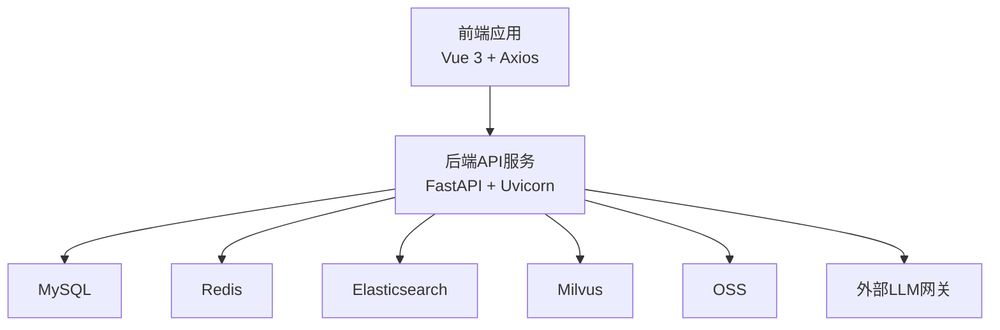
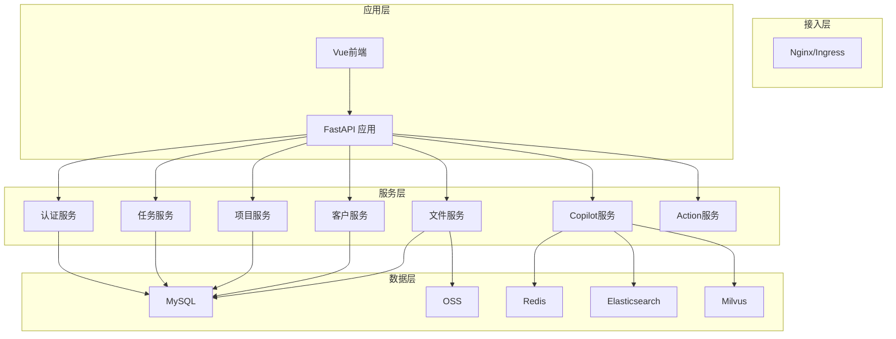
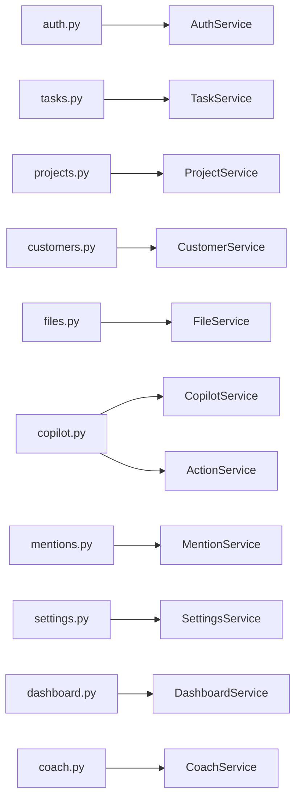

# API参考文档

<cite>
**本文档引用的文件**
- [FDE工作台技术方案.md](file://docs/FDE工作台技术方案.md)
- [FDE工作台产品需求文档.md](file://docs/FDE工作台产品需求文档.md)
- [export_openapi.py](file://workspace/scripts/export_openapi.py)
- [auth.py](file://workspace/api/app/routers/auth.py)
- [tasks.py](file://workspace/api/app/routers/tasks.py)
- [projects.py](file://workspace/api/app/routers/projects.py)
- [customers.py](file://workspace/api/app/routers/customers.py)
- [files.py](file://workspace/api/app/routers/files.py)
- [copilot.py](file://workspace/api/app/routers/copilot.py)
- [mentions.py](file://workspace/api/app/routers/mentions.py)
- [settings.py](file://workspace/api/app/routers/settings.py)
- [dashboard.py](file://workspace/api/app/routers/dashboard.py)
- [coach.py](file://workspace/api/app/routers/coach.py)
- [auth.py](file://workspace/api/app/schemas/auth.py)
- [task.py](file://workspace/api/app/schemas/task.py)
- [project.py](file://workspace/api/app/schemas/project.py)
</cite>

## 目录
1. [简介](#简介)
2. [项目结构](#项目结构)
3. [核心组件](#核心组件)
4. [架构总览](#架构总览)
5. [详细组件分析](#详细组件分析)
6. [依赖分析](#依赖分析)
7. [性能考虑](#性能考虑)
8. [故障排查指南](#故障排查指南)
9. [结论](#结论)
10. [附录](#附录)

## 简介
本API参考文档面向FDE工作台后端服务，覆盖认证、项目、任务、客户、文件、Copilot、通知与设置等模块的REST API端点。文档提供HTTP方法、URL模式、请求/响应模式、认证方法、错误码与状态码说明，并结合实际源码中的路由与Schema定义进行说明。同时，文档解释API版本控制、速率限制与安全考虑，提供客户端实现建议与性能优化提示，并给出协议特定的调试与监控方法。

## 项目结构
后端采用FastAPI + SQLAlchemy + 异步数据库访问，API统一前缀为 /api/v1。前端通过Axios调用后端API，支持Mock与真实API切换。OpenAPI规范由后端自动生成并通过脚本导出至共享协议目录，供前端类型生成与契约校验。

**图表来源**
- [FDE工作台技术方案.md:45-120](file://docs/FDE工作台技术方案.md#L45-L120)

**章节来源**
- [FDE工作台技术方案.md:45-120](file://docs/FDE工作台技术方案.md#L45-L120)
- [export_openapi.py:1-60](file://workspace/scripts/export_openapi.py#L1-L60)

## 核心组件
- 认证模块：登录、刷新、登出、当前用户信息
- 任务模块：CRUD、批量更新、历史记录
- 项目模块：CRUD、成员管理、风险、健康度、周报
- 客户模块：CRUD、联系人、商机
- 文件模块：列表、树形结构、配额、上传令牌、下载、删除、批量删除
- Copilot模块：SSE流式对话、会话管理、actionCard预览与执行、反馈
- @引用模块：统一搜索（项目/任务/客户/文件/案例）
- 设置模块：个人信息、密码、通知、AI模型偏好
- 仪表盘模块：汇总、最近任务/项目、关键事件
- 教练模块：最佳实践、SOP、学习路径、专家、推荐

**章节来源**
- [auth.py:1-43](file://workspace/api/app/routers/auth.py#L1-L43)
- [tasks.py:1-70](file://workspace/api/app/routers/tasks.py#L1-L70)
- [projects.py:1-82](file://workspace/api/app/routers/projects.py#L1-L82)
- [customers.py:1-62](file://workspace/api/app/routers/customers.py#L1-L62)
- [files.py:1-86](file://workspace/api/app/routers/files.py#L1-L86)
- [copilot.py:1-137](file://workspace/api/app/routers/copilot.py#L1-L137)
- [mentions.py:1-20](file://workspace/api/app/routers/mentions.py#L1-L20)
- [settings.py:1-82](file://workspace/api/app/routers/settings.py#L1-L82)
- [dashboard.py:1-95](file://workspace/api/app/routers/dashboard.py#L1-L95)
- [coach.py:1-103](file://workspace/api/app/routers/coach.py#L1-L103)

## 架构总览
后端采用分层架构：Router层负责路由与鉴权依赖注入，Service层编排业务，Repository层访问数据库，Schema层定义请求/响应模型。Copilot模块通过SSE流式返回消息，支持actionCard二次确认机制。

**图表来源**
- [FDE工作台技术方案.md:555-691](file://docs/FDE工作台技术方案.md#L555-L691)
- [copilot.py:1-137](file://workspace/api/app/routers/copilot.py#L1-L137)

## 详细组件分析

### 认证API
- 前缀：/api/v1/auth
- 认证方式：JWT（Authorization: Bearer <token>）
- 速率限制：未在路由中显式声明，建议结合网关或中间件统一配置
- 安全考虑：密码字段使用密文传输；刷新令牌用于续期；登出返回成功消息

端点定义
- POST /login
  - 请求体：用户名/邮箱、密码
  - 响应体：access_token、refresh_token、expires_in
- POST /refresh
  - 请求体：refreshToken
  - 响应体：新的token对
- POST /logout
  - 无请求体
  - 响应体：{"message": "登出成功"}
- GET /me
  - 请求头：Authorization
  - 响应体：用户信息（id、name、email、roles、level）

请求/响应示例（路径）
- [登录请求体定义:7-15](file://workspace/api/app/schemas/auth.py#L7-L15)
- [Token对定义:17-23](file://workspace/api/app/schemas/auth.py#L17-L23)
- [用户信息定义:25-32](file://workspace/api/app/schemas/auth.py#L25-L32)

**章节来源**
- [auth.py:1-43](file://workspace/api/app/routers/auth.py#L1-L43)
- [auth.py:1-32](file://workspace/api/app/schemas/auth.py#L1-L32)

### 任务API
- 前缀：/api/v1/tasks
- 支持筛选：status、priority、project_id、assignee
- 批量操作：批量更新状态、批量指派

端点定义
- GET /
  - 查询参数：keyword、status[]、assigneeId、projectId、priority[]
  - 响应体：任务列表（TaskDTO）
- GET /{id}
  - 响应体：任务详情（TaskDTO）
- POST /
  - 请求体：TaskCreate
  - 响应体：TaskDTO
- PUT /{id}
  - 请求体：TaskUpdate
  - 响应体：TaskDTO
- DELETE /{id}
  - 响应体：删除结果
- POST /batch-update-status
  - 请求体：BatchUpdateStatusRequest（ids、status、actionId）
  - 响应体：批量更新结果
- POST /batch-assign
  - 请求体：BatchAssignRequest（ids、assigneeId）
  - 响应体：批量指派结果
- GET /{id}/history
  - 响应体：任务历史列表（TaskHistoryDTO）

请求/响应示例（路径）
- [任务枚举与基础模型:12-38](file://workspace/api/app/schemas/task.py#L12-L38)
- [任务查询模型:65-73](file://workspace/api/app/schemas/task.py#L65-L73)
- [批量更新请求模型:75-81](file://workspace/api/app/schemas/task.py#L75-L81)
- [批量指派请求模型:83-88](file://workspace/api/app/schemas/task.py#L83-L88)
- [任务历史模型:105-116](file://workspace/api/app/schemas/task.py#L105-L116)

**章节来源**
- [tasks.py:1-70](file://workspace/api/app/routers/tasks.py#L1-L70)
- [task.py:1-116](file://workspace/api/app/schemas/task.py#L1-L116)

### 项目API
- 前缀：/api/v1/projects
- 支持成员管理、风险、健康度、里程碑、周报生成

端点定义
- GET /
  - 查询参数：keyword、phase[]、ownerId
  - 响应体：项目列表（ProjectDTO）
- GET /{id}
  - 响应体：项目详情（含成员、里程碑、风险）
- POST /
  - 请求体：ProjectCreate
  - 响应体：ProjectDTO
- PUT /{id}
  - 请求体：ProjectUpdate
  - 响应体：ProjectDTO
- DELETE /{id}
  - 响应体：删除结果
- GET /{id}/members
  - 响应体：成员列表（ProjectMemberDTO）
- POST /{id}/members
  - 请求体：MemberAdd
  - 响应体：成员（ProjectMemberDTO）
- DELETE /{id}/members/{user_id}
  - 响应体：移除结果
- GET /{id}/health
  - 响应体：健康度详情
- POST /{id}/risks
  - 请求体：RiskCreate
  - 响应体：RiskDTO
- GET /{id}/weekly-reports
  - 响应体：周报列表
- POST /{id}/weekly-reports
  - 响应体：触发生成结果

请求/响应示例（路径）
- [项目枚举与模型:12-30](file://workspace/api/app/schemas/project.py#L12-L30)
- [项目查询模型:119-124](file://workspace/api/app/schemas/project.py#L119-L124)
- [成员与风险模型:32-69](file://workspace/api/app/schemas/project.py#L32-L69)
- [项目DTO:100-117](file://workspace/api/app/schemas/project.py#L100-L117)

**章节来源**
- [projects.py:1-82](file://workspace/api/app/routers/projects.py#L1-L82)
- [project.py:1-135](file://workspace/api/app/schemas/project.py#L1-L135)

### 客户API
- 前缀：/api/v1/customers
- 支持联系人、商机查询

端点定义
- GET /
  - 查询参数：keyword、level
  - 响应体：客户列表
- GET /{id}
  - 响应体：客户详情（含概览、联系人、商机、项目）
- POST /
  - 请求体：CustomerCreate
  - 响应体：CustomerDTO
- PUT /{id}
  - 请求体：CustomerUpdate
  - 响应体：CustomerDTO
- DELETE /{id}
  - 响应体：删除结果
- GET /{id}/contacts
  - 响应体：联系人列表（ContactDTO）
- POST /{id}/contacts
  - 请求体：ContactCreate
  - 响应体：ContactDTO
- GET /{id}/opportunities
  - 响应体：商机列表（OpportunityDTO）

**章节来源**
- [customers.py:1-62](file://workspace/api/app/routers/customers.py#L1-L62)

### 文件API
- 前缀：/api/v1/files
- 上传大小限制：50MB
- 支持树形结构、配额查询、下载、批量删除

端点定义
- GET /
  - 查询参数：路径相关参数（由FileQuery定义）
  - 响应体：{"items": [...], "total": number}
- GET /tree
  - 响应体：文件树节点列表（FileTreeNode）
- GET /quota
  - 响应体：QuotaDTO
- GET /{id}
  - 响应体：文件元数据（FileMetaDTO）
- GET /{id}/download
  - 响应体：{"url": string}
- POST /upload-token
  - 请求体：UploadTokenRequest（含file_size校验）
  - 响应体：UploadTokenResponse
- POST /finalize-upload
  - 请求体：FinalizeUploadRequest
  - 响应体：FileMetaDTO
- DELETE /{id}
  - 响应体：删除结果
- POST /batch-delete
  - 请求体：{"ids": [number]}
  - 响应体：批量删除结果

错误码
- 413：文件大小超过限制（示例：50MB）

**章节来源**
- [files.py:1-86](file://workspace/api/app/routers/files.py#L1-L86)

### Copilot API（SSE流式）
- 前缀：/api/v1/copilot
- SSE流式返回消息，支持actionCard二次确认
- 会话管理：列出、获取、删除会话
- 反馈：提交用户反馈

端点定义
- POST /chat
  - 请求体：ChatRequest（assistant_id、ctx、msg）
  - 响应：SSE流，逐块返回消息，包含traceId
- POST /query
  - 请求体：ChatRequest（单轮问答）
  - 响应：SSE流，逐块返回消息，包含traceId
- GET /sessions
  - 响应体：会话列表
- GET /sessions/{session_id}
  - 响应体：会话详情
- DELETE /sessions/{session_id}
  - 响应体：删除结果
- POST /preview-action
  - 请求体：PreviewActionRequest（tool_name、args）
  - 响应体：actionCard预览
- POST /execute-action
  - 请求体：ExecuteActionRequest（action_id）
  - 响应体：执行结果
- POST /cancel-action
  - 请求体：ExecuteActionRequest（action_id）
  - 响应体：取消结果
- POST /feedback
  - 请求体：{"thumbs": "up|down", "comment": string}
  - 响应体：{"submitted": true, "userId": number}

SSE头部
- Cache-Control: no-cache
- Connection: keep-alive
- X-Accel-Buffering: no
- X-Trace-Id: trace_id
- X-Heartbeat-Interval: 15（chat/query）

**章节来源**
- [copilot.py:1-137](file://workspace/api/app/routers/copilot.py#L1-L137)

### @引用API
- 前缀：/api/v1/mentions
- 统一搜索：支持项目、任务、客户、文件、案例

端点定义
- GET /search
  - 查询参数：q（关键字）、type（MentionType）、limit
  - 响应体：搜索结果列表

**章节来源**
- [mentions.py:1-20](file://workspace/api/app/routers/mentions.py#L1-L20)

### 设置API
- 前缀：/api/v1/settings
- 支持个人信息、密码、通知、AI模型偏好

端点定义
- GET /profile
  - 响应体：用户基本信息
- PUT /profile
  - 请求体：ProfileUpdate（name、email、avatar）
  - 响应体：{"updated": true, "userId": number}
- PUT /password
  - 请求体：PasswordChange（old_password、new_password）
  - 响应体：{"updated": true, "userId": number}
- GET /notifications
  - 响应体：通知开关状态
- PUT /notifications
  - 请求体：NotificationSettings（dingtalk_enabled、email_enabled、in_app_enabled）
  - 响应体：{"updated": true, "userId": number}
- GET /ai-models
  - 响应体：模型列表与首选模型
- PUT /ai-models
  - 请求体：AIModelSettings（preferred）
  - 响应体：{"updated": true, "preferred": string}

**章节来源**
- [settings.py:1-82](file://workspace/api/app/routers/settings.py#L1-L82)

### 仪表盘API
- 前缀：/api/v1/dashboard
- 聚合统计与近期事件

端点定义
- GET /summary
  - 响应体：{"task_count": number, "project_count": number, "customer_count": number, "pending_tasks": number}
- GET /recent-tasks
  - 查询参数：limit（默认10）
  - 响应体：最近任务列表
- GET /recent-projects
  - 查询参数：limit（默认5）
  - 响应体：最近项目列表
- GET /notifications
  - 响应体：空通知列表占位
- GET /key-events
  - 查询参数：days（1-365，默认7）
  - 响应体：关键事件列表

**章节来源**
- [dashboard.py:1-95](file://workspace/api/app/routers/dashboard.py#L1-L95)

### 教练API
- 前缀：/api/v1/coach
- 最佳实践、SOP、学习路径、专家、推荐

端点定义
- GET /best-practices
  - 查询参数：分页与筛选
  - 响应体：最佳实践列表
- GET /best-practices/{id}
  - 响应体：最佳实践详情
- POST /best-practices/{id}/rating
  - 请求体：RatePracticeRequest（score、comment）
  - 响应体：评分结果
- GET /sops
  - 响应体：SOP列表
- GET /sops/{id}
  - 响应体：SOP详情
- GET /sops/{id}/download
  - 响应体：下载链接
- GET /learning-paths
  - 查询参数：page、size
  - 响应体：学习路径列表
- GET /learning-paths/{id}
  - 响应体：学习路径详情
- POST /learning-paths/{id}/progress
  - 请求体：ChapterProgressUpdate
  - 响应体：进度更新
- GET /recommendations
  - 响应体：个性化推荐
- GET /categories
  - 响应体：教练分类列表（Mock）
- GET /experts
  - 响应体：专家列表（Mock）

**章节来源**
- [coach.py:1-103](file://workspace/api/app/routers/coach.py#L1-L103)

## 依赖分析
- 路由到服务：各Router通过Depends注入Service，Service再委托Repository访问数据库
- SSE依赖：Copilot模块使用StreamingResponse返回SSE流
- 上传限制：文件模块对上传大小进行显式校验
- OpenAPI导出：通过脚本导出后端自动生成的OpenAPI规范，供前端类型生成与契约校验

**图表来源**
- [tasks.py:23-29](file://workspace/api/app/routers/tasks.py#L23-L29)
- [projects.py:19-21](file://workspace/api/app/routers/projects.py#L19-L21)
- [customers.py:19-21](file://workspace/api/app/routers/customers.py#L19-L21)
- [files.py:23-25](file://workspace/api/app/routers/files.py#L23-L25)
- [copilot.py:21-26](file://workspace/api/app/routers/copilot.py#L21-L26)
- [mentions.py:13-14](file://workspace/api/app/routers/mentions.py#L13-L14)
- [settings.py:1-82](file://workspace/api/app/routers/settings.py#L1-L82)
- [dashboard.py:1-95](file://workspace/api/app/routers/dashboard.py#L1-L95)
- [coach.py:21-23](file://workspace/api/app/routers/coach.py#L21-L23)

**章节来源**
- [tasks.py:1-70](file://workspace/api/app/routers/tasks.py#L1-L70)
- [projects.py:1-82](file://workspace/api/app/routers/projects.py#L1-L82)
- [customers.py:1-62](file://workspace/api/app/routers/customers.py#L1-L62)
- [files.py:1-86](file://workspace/api/app/routers/files.py#L1-L86)
- [copilot.py:1-137](file://workspace/api/app/routers/copilot.py#L1-L137)
- [mentions.py:1-20](file://workspace/api/app/routers/mentions.py#L1-L20)
- [settings.py:1-82](file://workspace/api/app/routers/settings.py#L1-L82)
- [dashboard.py:1-95](file://workspace/api/app/routers/dashboard.py#L1-L95)
- [coach.py:1-103](file://workspace/api/app/routers/coach.py#L1-L103)

## 性能考虑
- 首屏与页面切换：前端通过路由懒加载与keep-alive缓存优化，目标<200ms
- Copilot切换：同一壳组件按pageId隔离会话，切换<200ms
- @引用响应：本地缓存+防抖300ms
- SSE首token：后端流式+前端逐token追加，目标<1s
- 缓存策略：Dashboard等聚合接口可利用Redis缓存（TTL 5分钟）
- 数据库访问：Repository层统一注入Session，避免在Router中直接执行SQL

**章节来源**
- [FDE工作台技术方案.md:543-552](file://docs/FDE工作台技术方案.md#L543-L552)

## 故障排查指南
- SSE连接中断
  - 现象：客户端接收不到后续data块
  - 排查：检查Nginx/Ingress是否正确透传SSE；确认X-Accel-Buffering=no；关注心跳间隔
  - 参考：[SSE响应头设置:54-65](file://workspace/api/app/routers/copilot.py#L54-L65)
- 413 Payload Too Large（文件上传）
  - 现象：上传超过50MB被拒绝
  - 排查：确认前端上传令牌与大小校验逻辑；后端已显式限制
  - 参考：[文件大小限制与错误码:19-70](file://workspace/api/app/routers/files.py#L19-L70)
- 认证失败
  - 现象：401未授权
  - 排查：确认Authorization头格式为Bearer <token>；检查refreshToken是否过期
  - 参考：[认证路由与头处理:37-42](file://workspace/api/app/routers/auth.py#L37-L42)
- OpenAPI类型不一致
  - 现象：前端类型与后端Schema不匹配
  - 排查：运行导出脚本更新共享协议；前端重新生成类型
  - 参考：[OpenAPI导出脚本:1-60](file://workspace/scripts/export_openapi.py#L1-L60)

**章节来源**
- [copilot.py:54-65](file://workspace/api/app/routers/copilot.py#L54-L65)
- [files.py:19-70](file://workspace/api/app/routers/files.py#L19-L70)
- [auth.py:37-42](file://workspace/api/app/routers/auth.py#L37-L42)
- [export_openapi.py:1-60](file://workspace/scripts/export_openapi.py#L1-L60)

## 结论
本文档基于仓库中的路由与Schema定义，系统梳理了FDE工作台后端API的端点、请求/响应模式、认证与安全要点，并结合技术方案中的性能与架构设计给出实现建议与排障指引。建议在生产环境中结合网关进行统一的速率限制与审计，前端按OpenAPI契约生成类型并进行契约校验。

## 附录

### API版本控制
- 版本前缀：/api/v1
- 说明：当前版本为v1，后续演进遵循向后兼容或明确迁移指引

**章节来源**
- [FDE工作台技术方案.md:693-786](file://docs/FDE工作台技术方案.md#L693-L786)

### 速率限制与安全
- 速率限制：未在路由中显式声明，建议通过网关或中间件统一配置
- 安全措施：JWT认证、密码密文传输、写操作二次确认、审计日志
- 数据隔离：个人/项目/客户空间权限隔离

**章节来源**
- [FDE工作台技术方案.md:393-401](file://docs/FDE工作台技术方案.md#L393-L401)

### 客户端实现建议
- 使用Axios拦截器统一注入JWT与错误处理
- SSE客户端使用支持POST+流式的数据源（如@ms/fetch-event-source）
- Mock与真实API切换：通过环境变量VITE_API_MODE控制
- OpenAPI契约同步：定期导出后端OpenAPI并生成前端类型

**章节来源**
- [FDE工作台技术方案.md:512-542](file://docs/FDE工作台技术方案.md#L512-L542)
- [export_openapi.py:1-60](file://workspace/scripts/export_openapi.py#L1-L60)

### 协议特定调试与监控
- SSE调试：关注traceId与心跳间隔；Nginx需禁用缓冲
- 监控：后端使用OpenTelemetry与Prometheus指标
- 日志：结构化JSON日志输出至SLS

**章节来源**
- [FDE工作台技术方案.md:581-582](file://docs/FDE工作台技术方案.md#L581-L582)
- [copilot.py:54-65](file://workspace/api/app/routers/copilot.py#L54-L65)