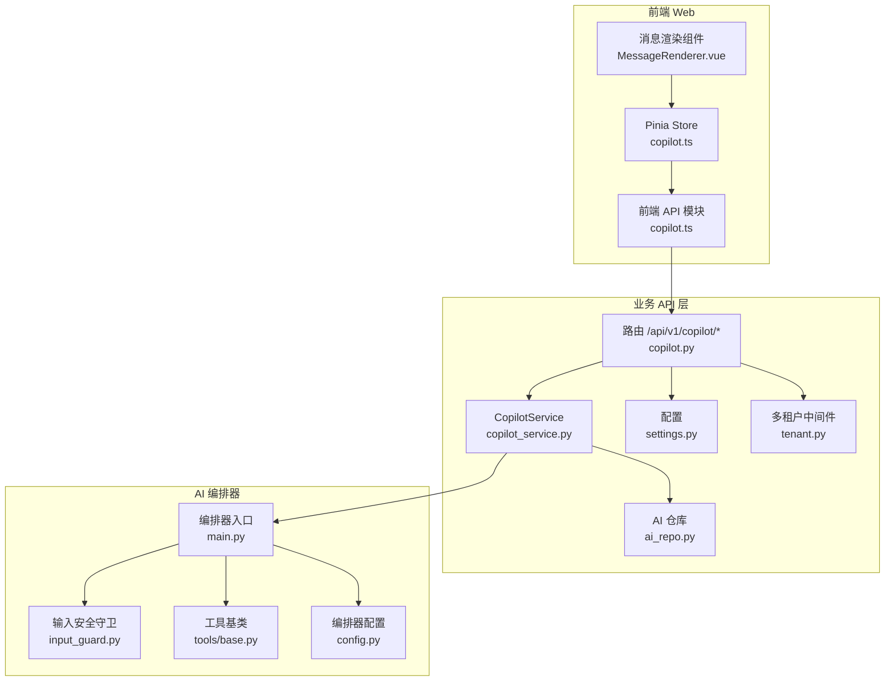
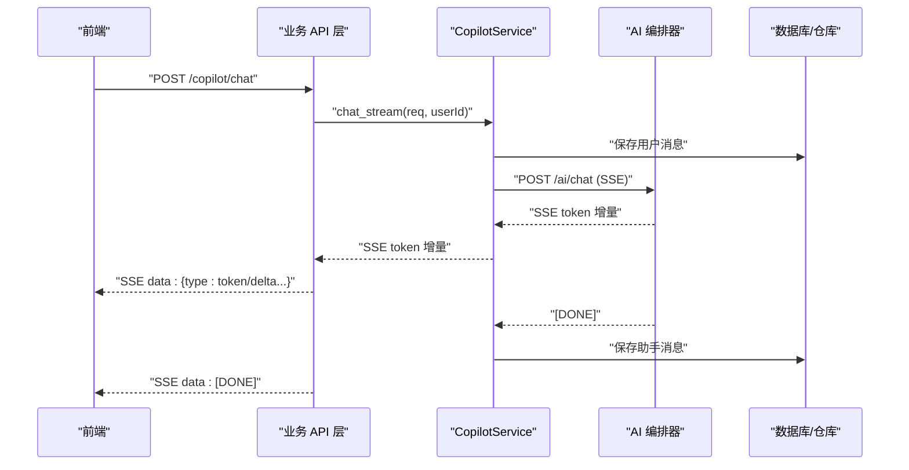
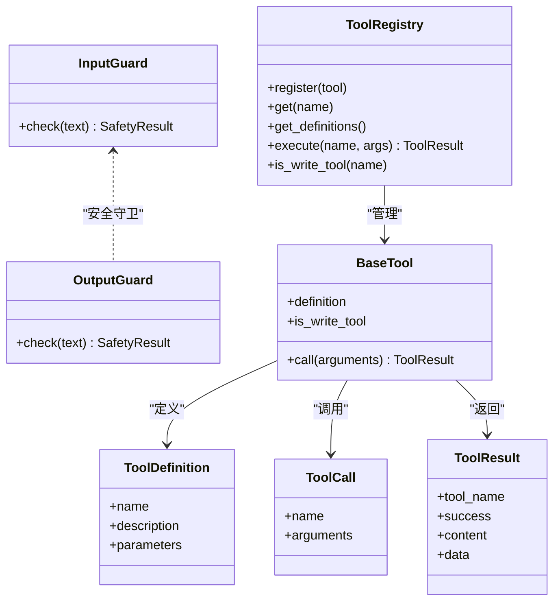
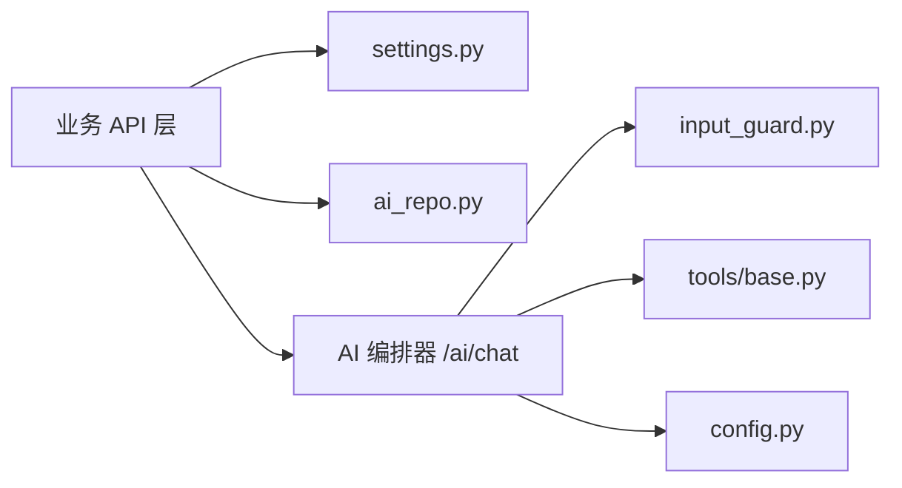

# Copilot API

<cite>
**本文引用的文件**
- [workspace/api/app/routers/copilot.py](file://workspace/api/app/routers/copilot.py)
- [workspace/api/app/schemas/copilot.py](file://workspace/api/app/schemas/copilot.py)
- [workspace/api/app/services/copilot_service.py](file://workspace/api/app/services/copilot_service.py)
- [workspace/api/app/repositories/ai_repo.py](file://workspace/api/app/repositories/ai_repo.py)
- [workspace/api/app/config/settings.py](file://workspace/api/app/config/settings.py)
- [workspace/api/app/middleware/tenant.py](file://workspace/api/app/middleware/tenant.py)
- [workspace/ai-orchestrator/app/main.py](file://workspace/ai-orchestrator/app/main.py)
- [workspace/ai-orchestrator/app/config.py](file://workspace/ai-orchestrator/app/config.py)
- [workspace/ai-orchestrator/app/safety/input_guard.py](file://workspace/ai-orchestrator/app/safety/input_guard.py)
- [workspace/ai-orchestrator/app/tools/base.py](file://workspace/ai-orchestrator/app/tools/base.py)
- [workspace/web/src/apis/modules/copilot.ts](file://workspace/web/src/apis/modules/copilot.ts)
- [workspace/web/src/stores/copilot.ts](file://workspace/web/src/stores/copilot.ts)
- [workspace/web/src/components/copilot/MessageRenderer.vue](file://workspace/web/src/components/copilot/MessageRenderer.vue)
- [workspace/web/src/types/copilot.d.ts](file://workspace/web/src/types/copilot.d.ts)
</cite>

## 目录
1. [简介](#简介)
2. [项目结构](#项目结构)
3. [核心组件](#核心组件)
4. [架构总览](#架构总览)
5. [详细组件分析](#详细组件分析)
6. [依赖分析](#依赖分析)
7. [性能考虑](#性能考虑)
8. [故障排查指南](#故障排查指南)
9. [结论](#结论)
10. [附录：API定义与示例](#附录api定义与示例)

## 简介
本文件为 FDE 工作台 Copilot AI 助手的 API 文档，覆盖聊天、会话管理、工具预览/执行、SSE 流式响应、实时交互与历史记录等能力。文档同时解释 Copilot 架构、LLM 集成与安全机制，并提供 AI 交互模式、性能优化与错误处理的使用指南。

## 项目结构
- 后端分为两层：
  - 业务 API 层（FastAPI）：负责认证、会话持久化、动作预览/执行、SSE 转发至 AI 编排器。
  - AI 编排器（FastAPI）：负责安全守卫、LLM 调用、工具函数调用、RAG 检索与索引。
- 前端通过 SSE 订阅 AI 流式输出，支持多种消息类型（文本、动作卡片、报告、下一步、搜索结果）。



图表来源
- [workspace/api/app/routers/copilot.py:1-137](file://workspace/api/app/routers/copilot.py#L1-L137)
- [workspace/api/app/services/copilot_service.py:1-111](file://workspace/api/app/services/copilot_service.py#L1-L111)
- [workspace/api/app/repositories/ai_repo.py:1-78](file://workspace/api/app/repositories/ai_repo.py#L1-L78)
- [workspace/api/app/config/settings.py:1-81](file://workspace/api/app/config/settings.py#L1-L81)
- [workspace/api/app/middleware/tenant.py:1-23](file://workspace/api/app/middleware/tenant.py#L1-L23)
- [workspace/ai-orchestrator/app/main.py:1-307](file://workspace/ai-orchestrator/app/main.py#L1-L307)
- [workspace/ai-orchestrator/app/safety/input_guard.py:1-183](file://workspace/ai-orchestrator/app/safety/input_guard.py#L1-L183)
- [workspace/ai-orchestrator/app/tools/base.py:1-89](file://workspace/ai-orchestrator/app/tools/base.py#L1-L89)
- [workspace/ai-orchestrator/app/config.py:1-32](file://workspace/ai-orchestrator/app/config.py#L1-L32)

章节来源
- [workspace/api/app/routers/copilot.py:1-137](file://workspace/api/app/routers/copilot.py#L1-L137)
- [workspace/ai-orchestrator/app/main.py:1-307](file://workspace/ai-orchestrator/app/main.py#L1-L307)

## 核心组件
- 路由与端点
  - /api/v1/copilot/chat：SSE 聊天流，支持流式增量返回与错误帧。
  - /api/v1/copilot/query：单轮问答（复用 chat 的 SSE 实现）。
  - /api/v1/copilot/sessions：会话列表、获取、删除。
  - /api/v1/copilot/preview-action：工具调用预览（生成 actionId）。
  - /api/v1/copilot/execute-action：执行已确认的动作。
  - /api/v1/copilot/cancel-action：取消待确认动作。
  - /api/v1/copilot/feedback：提交反馈。
- 服务层
  - CopilotService：保存用户消息、转发到 AI 编排器、聚合流式响应并保存助手回复；提供会话 CRUD。
- 仓库层
  - AiSessionRepository / AiMessageRepository：封装会话与消息的数据库访问。
- 前端
  - copilot.ts：封装 SSE 与 REST 请求。
  - copilot store：维护消息、会话、动作状态。
  - MessageRenderer：按消息类型渲染内容。

章节来源
- [workspace/api/app/routers/copilot.py:29-137](file://workspace/api/app/routers/copilot.py#L29-L137)
- [workspace/api/app/services/copilot_service.py:15-111](file://workspace/api/app/services/copilot_service.py#L15-L111)
- [workspace/api/app/repositories/ai_repo.py:11-78](file://workspace/api/app/repositories/ai_repo.py#L11-L78)
- [workspace/web/src/apis/modules/copilot.ts:1-40](file://workspace/web/src/apis/modules/copilot.ts#L1-L40)
- [workspace/web/src/stores/copilot.ts:1-184](file://workspace/web/src/stores/copilot.ts#L1-L184)
- [workspace/web/src/components/copilot/MessageRenderer.vue:1-192](file://workspace/web/src/components/copilot/MessageRenderer.vue#L1-L192)

## 架构总览
Copilot 采用“业务 API 层 + AI 编排器”的双层架构：
- 业务 API 层负责用户鉴权、会话持久化、SSE 转发与动作生命周期管理。
- AI 编排器负责安全守卫、LLM 调用、工具函数调用、RAG 检索与索引。
- 前端通过 SSE 接收增量 token，动态渲染不同消息类型卡片。



图表来源
- [workspace/api/app/routers/copilot.py:29-65](file://workspace/api/app/routers/copilot.py#L29-L65)
- [workspace/api/app/services/copilot_service.py:21-56](file://workspace/api/app/services/copilot_service.py#L21-L56)
- [workspace/ai-orchestrator/app/main.py:89-172](file://workspace/ai-orchestrator/app/main.py#L89-L172)

## 详细组件分析

### 路由与端点
- /api/v1/copilot/chat
  - 方法：POST
  - 输入：ChatRequest（assistantId、sessionId、message、context、mode、mentions）
  - 输出：SSE 流，逐行以 data: 开头，结束时发送 [DONE]
  - 错误：异常转为 SSE 错误帧（含稳定 code 字段）
- /api/v1/copilot/query
  - 单轮问答，行为与 chat 类似，便于前端区分“单轮”场景
- /api/v1/copilot/sessions
  - GET /{id}：获取会话详情（含消息列表）
  - DELETE /{id}：删除会话
- /api/v1/copilot/preview-action
  - 输入：PreviewActionRequest（toolName、args、sessionId）
  - 输出：PreviewActionResponse（actionId、title、severity、preview、affectedItems、expiresAt）
- /api/v1/copilot/execute-action
  - 输入：ExecuteActionRequest（actionId）
  - 输出：ExecuteActionResponse（success、result）
- /api/v1/copilot/cancel-action
  - 取消待确认动作
- /api/v1/copilot/feedback
  - 提交反馈（messageId、rating）

章节来源
- [workspace/api/app/routers/copilot.py:29-137](file://workspace/api/app/routers/copilot.py#L29-L137)
- [workspace/api/app/schemas/copilot.py:13-71](file://workspace/api/app/schemas/copilot.py#L13-L71)

### 服务层：CopilotService
- 职责
  - 将 ChatRequest 转发给 AI 编排器 /ai/chat 并透传 userId
  - 从上游 SSE 读取增量 token，原样回推给前端
  - 在首次调用时自动创建会话并保存用户消息；在流结束后保存助手消息
  - 提供 list/get/delete 会话方法
- 容错
  - 当无法连接编排器时，返回 mock 文本作为回退
- 会话管理
  - 若请求未提供 sessionId，则创建新会话并写入标题为首条消息前 50 字

```mermaid
flowchart TD
Start(["进入 chat_stream"]) --> SaveUser["保存用户消息"]
SaveUser --> Forward["POST /ai/chat (SSE)"]
Forward --> ReadLine{"读取一行 SSE"}
ReadLine --> |非 data 行| ReadLine
ReadLine --> |data: [DONE]| Done["保存助手消息"]
ReadLine --> |data: token| Yield["yield 增量 token"] --> ReadLine
ReadLine --> |异常| Fallback["mock 回退文本"] --> Done
Done --> End(["结束"])
```

图表来源
- [workspace/api/app/services/copilot_service.py:21-56](file://workspace/api/app/services/copilot_service.py#L21-L56)

章节来源
- [workspace/api/app/services/copilot_service.py:15-111](file://workspace/api/app/services/copilot_service.py#L15-L111)

### 仓库层：AiSessionRepository / AiMessageRepository
- 会话
  - 列表：按最后修改时间倒序
  - 获取：校验用户归属
  - 创建：写入 assistant_key、mode、title
  - 删除：校验用户归属后删除
- 消息
  - 按时间顺序列出
  - 追加消息（role、content）

章节来源
- [workspace/api/app/repositories/ai_repo.py:11-78](file://workspace/api/app/repositories/ai_repo.py#L11-L78)

### 前端：SSE 与状态管理
- copilot.ts
  - chat：封装 openSse，订阅 /copilot/chat
  - sessions：REST 列表/获取/删除
  - preview-action / execute-action / cancel-action / feedback：REST 调用
- store/copilot.ts
  - 维护各助手的消息数组与会话 ID 映射
  - 发送消息时先插入占位 assistant 消息，再接收增量 token 更新
  - 支持 action/report/nextSteps/searchResults 等消息类型的渲染切换
- MessageRenderer.vue
  - 用户消息直接显示；助手消息根据 type 渲染文本或卡片组件
  - 使用 DOMPurify 对内容进行安全净化

章节来源
- [workspace/web/src/apis/modules/copilot.ts:1-40](file://workspace/web/src/apis/modules/copilot.ts#L1-L40)
- [workspace/web/src/stores/copilot.ts:1-184](file://workspace/web/src/stores/copilot.ts#L1-L184)
- [workspace/web/src/components/copilot/MessageRenderer.vue:1-192](file://workspace/web/src/components/copilot/MessageRenderer.vue#L1-L192)
- [workspace/web/src/types/copilot.d.ts:1-42](file://workspace/web/src/types/copilot.d.ts#L1-L42)

### AI 编排器与安全机制
- /ai/chat
  - 输入安全守卫：检测注入、越狱、敏感数据、超长输入等，触发即返回带稳定 code 的 SSE 错误帧
  - 审计日志：记录输入预览、输出预览、耗时、token 数、错误原因
  - 流式输出：逐 token 返回，支持客户端断开检测
- 工具调用
  - 工具注册与定义：统一的 ToolDefinition/ToolCall/ToolResult 结构
  - 写操作工具标识：is_write_tool 用于触发二次确认流程
- 配置
  - LLM 提供商与模型、RAG 存储地址、API 回调基址等



图表来源
- [workspace/ai-orchestrator/app/safety/input_guard.py:1-183](file://workspace/ai-orchestrator/app/safety/input_guard.py#L1-L183)
- [workspace/ai-orchestrator/app/tools/base.py:1-89](file://workspace/ai-orchestrator/app/tools/base.py#L1-L89)

章节来源
- [workspace/ai-orchestrator/app/main.py:89-172](file://workspace/ai-orchestrator/app/main.py#L89-L172)
- [workspace/ai-orchestrator/app/safety/input_guard.py:1-183](file://workspace/ai-orchestrator/app/safety/input_guard.py#L1-L183)
- [workspace/ai-orchestrator/app/tools/base.py:1-89](file://workspace/ai-orchestrator/app/tools/base.py#L1-L89)
- [workspace/ai-orchestrator/app/config.py:1-32](file://workspace/ai-orchestrator/app/config.py#L1-L32)

## 依赖分析
- 业务 API 层依赖
  - 数据库：AiSession/AiMessage 持久化
  - Redis：动作执行（ActionService 依赖，当前由前端直连 API 层）
  - 配置：ai_orchestrator_url、timeout
  - 中间件：多租户上下文绑定
- AI 编排器依赖
  - LLM 提供商配置（DashScope/OpenAI/Mock）
  - RAG 存储（Milvus + Elasticsearch）
  - 工具注册中心
  - 安全守卫



图表来源
- [workspace/api/app/config/settings.py:36-38](file://workspace/api/app/config/settings.py#L36-L38)
- [workspace/api/app/repositories/ai_repo.py:1-78](file://workspace/api/app/repositories/ai_repo.py#L1-L78)
- [workspace/ai-orchestrator/app/main.py:89-172](file://workspace/ai-orchestrator/app/main.py#L89-L172)
- [workspace/ai-orchestrator/app/safety/input_guard.py:1-183](file://workspace/ai-orchestrator/app/safety/input_guard.py#L1-L183)
- [workspace/ai-orchestrator/app/tools/base.py:1-89](file://workspace/ai-orchestrator/app/tools/base.py#L1-L89)
- [workspace/ai-orchestrator/app/config.py:1-32](file://workspace/ai-orchestrator/app/config.py#L1-L32)

章节来源
- [workspace/api/app/config/settings.py:1-81](file://workspace/api/app/config/settings.py#L1-L81)
- [workspace/api/app/middleware/tenant.py:1-23](file://workspace/api/app/middleware/tenant.py#L1-L23)
- [workspace/ai-orchestrator/app/config.py:1-32](file://workspace/ai-orchestrator/app/config.py#L1-L32)

## 性能考虑
- SSE 心跳与缓冲
  - 业务 API 层在 SSE 响应头中设置心跳提示与 X-Accel-Buffering=no，避免代理层缓存导致延迟
- 超时控制
  - CopilotService 使用 settings.ai_orchestrator_timeout 控制上游请求超时
- 回退策略
  - 当编排器不可达时，返回 mock 文本，保证可用性
- 前端渲染
  - 使用 DOMPurify 净化 HTML，避免 XSS；Markdown 渲染仅在检测到代码块时启用

章节来源
- [workspace/api/app/routers/copilot.py:54-65](file://workspace/api/app/routers/copilot.py#L54-L65)
- [workspace/api/app/services/copilot_service.py:26-52](file://workspace/api/app/services/copilot_service.py#L26-L52)
- [workspace/api/app/config/settings.py:37-38](file://workspace/api/app/config/settings.py#L37-L38)
- [workspace/web/src/components/copilot/MessageRenderer.vue:20-39](file://workspace/web/src/components/copilot/MessageRenderer.vue#L20-L39)

## 故障排查指南
- SSE 未收到数据
  - 检查 /api/v1/copilot/chat 是否正确传递 assistantId、message、sessionId
  - 确认编排器 /ai/chat 可用且未触发安全拦截
- 安全拦截
  - 编排器会在检测到注入/越狱/敏感信息时返回带 code 的错误帧；前端可据此提示用户
- 动作执行失败
  - 确认 actionId 有效且未过期；检查工具是否为写操作（需二次确认）
- 会话缺失
  - 若未提供 sessionId，服务层会在首次调用时创建；若后续仍找不到会话，检查用户上下文与权限

章节来源
- [workspace/ai-orchestrator/app/main.py:97-120](file://workspace/ai-orchestrator/app/main.py#L97-L120)
- [workspace/api/app/services/copilot_service.py:90-110](file://workspace/api/app/services/copilot_service.py#L90-L110)
- [workspace/api/app/routers/copilot.py:119-131](file://workspace/api/app/routers/copilot.py#L119-L131)

## 结论
Copilot API 通过清晰的分层设计实现了“业务 API + AI 编排器”的解耦：前端通过 SSE 实时接收 AI 增量输出，后端负责会话持久化与动作生命周期管理；编排器侧强化了安全守卫与工具函数调用能力。该架构既满足多助手场景下的上下文保持与工具调用，又提供了良好的可扩展性与可观测性。

## 附录：API定义与示例

### 端点一览
- POST /api/v1/copilot/chat
  - 请求体：ChatRequest
  - 响应：SSE 流，逐行 data: {type: token, delta: "..."}，结束 [DONE]
- POST /api/v1/copilot/query
  - 请求体：ChatRequest
  - 响应：SSE 流（单轮问答）
- GET /api/v1/copilot/sessions
  - 响应：会话列表
- GET /api/v1/copilot/sessions/{id}
  - 响应：会话详情（含消息列表）
- DELETE /api/v1/copilot/sessions/{id}
  - 响应：{deleted: true/false}
- POST /api/v1/copilot/preview-action
  - 请求体：PreviewActionRequest
  - 响应：PreviewActionResponse
- POST /api/v1/copilot/execute-action
  - 请求体：ExecuteActionRequest
  - 响应：ExecuteActionResponse
- POST /api/v1/copilot/cancel-action
  - 请求体：ExecuteActionRequest
  - 响应：{cancelled: true}
- POST /api/v1/copilot/feedback
  - 请求体：{messageId, rating}
  - 响应：{submitted: true, userId}

章节来源
- [workspace/api/app/routers/copilot.py:29-137](file://workspace/api/app/routers/copilot.py#L29-L137)
- [workspace/api/app/schemas/copilot.py:13-71](file://workspace/api/app/schemas/copilot.py#L13-L71)

### 数据模型
- ChatRequest
  - 字段：assistantId、sessionId、message、context、mode、mentions
- PreviewActionRequest
  - 字段：toolName、args、sessionId
- PreviewActionResponse
  - 字段：actionId、title、severity、preview、affectedItems、expiresAt
- ExecuteActionRequest
  - 字段：actionId
- ExecuteActionResponse
  - 字段：success、result
- CopilotSessionDTO
  - 字段：id、assistant_key、mode、title、message_count、gmtCreate、gmtModified
- CopilotFeedbackRequest
  - 字段：messageId、rating

章节来源
- [workspace/api/app/schemas/copilot.py:13-71](file://workspace/api/app/schemas/copilot.py#L13-L71)

### 前端调用示例（路径）
- 发送消息并订阅流
  - 路径：workspace/web/src/stores/copilot.ts
  - 关键调用：sendMessage(...) -> copilotApi.chat(...)
- 获取会话列表/详情/删除
  - 路径：workspace/web/src/apis/modules/copilot.ts
  - 关键调用：listSessions()/getSession()/deleteSession()
- 预览/执行动作
  - 路径：workspace/web/src/apis/modules/copilot.ts
  - 关键调用：previewAction()/executeAction()/cancelAction()

章节来源
- [workspace/web/src/stores/copilot.ts:48-137](file://workspace/web/src/stores/copilot.ts#L48-L137)
- [workspace/web/src/apis/modules/copilot.ts:12-39](file://workspace/web/src/apis/modules/copilot.ts#L12-L39)