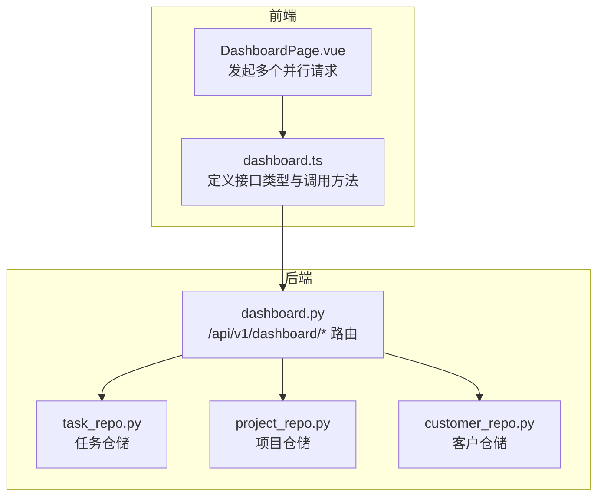
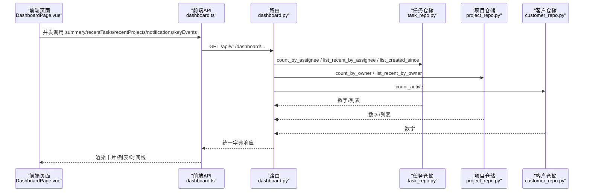
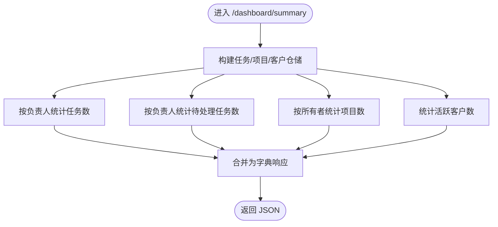
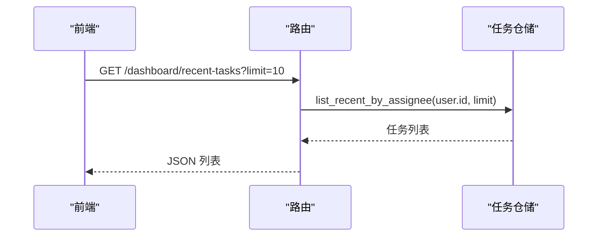
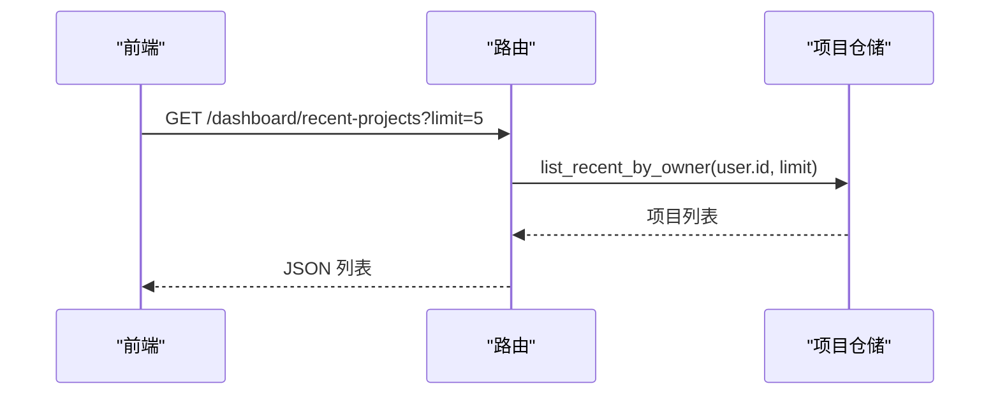
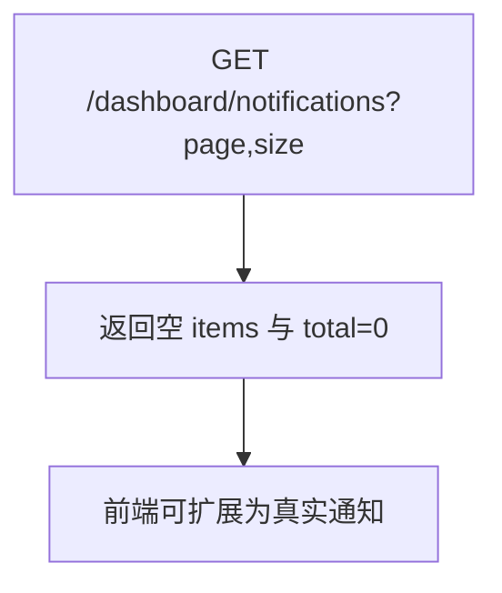
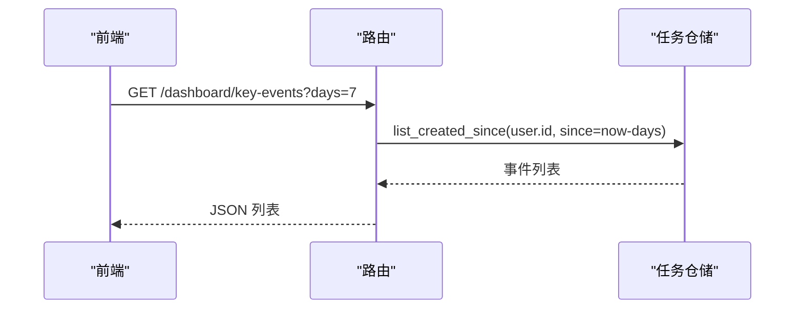
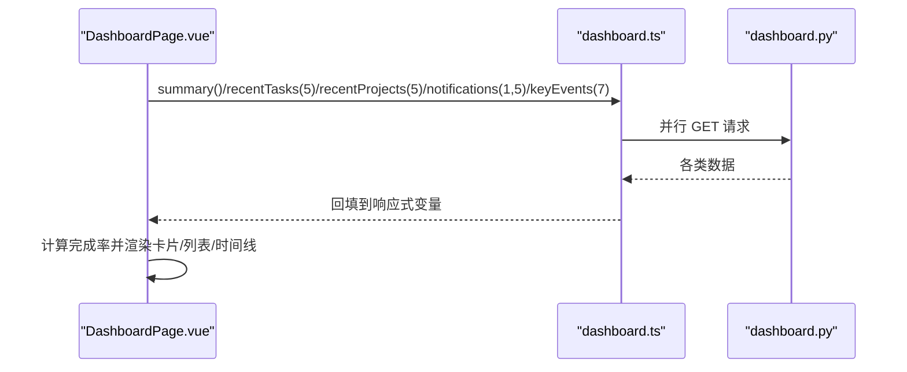
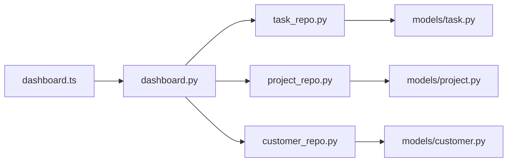

# 仪表盘API

<cite>
**本文引用的文件**
- [workspace/api/app/routers/dashboard.py](file://workspace/api/app/routers/dashboard.py)
- [workspace/api/app/repositories/task_repo.py](file://workspace/api/app/repositories/task_repo.py)
- [workspace/api/app/repositories/project_repo.py](file://workspace/api/app/repositories/project_repo.py)
- [workspace/api/app/repositories/customer_repo.py](file://workspace/api/app/repositories/customer_repo.py)
- [workspace/web/src/apis/modules/dashboard.ts](file://workspace/web/src/apis/modules/dashboard.ts)
- [workspace/web/src/pages/dashboard/DashboardPage.vue](file://workspace/web/src/pages/dashboard/DashboardPage.vue)
- [workspace/api/tests/integration/test_api_endpoints.py](file://workspace/api/tests/integration/test_api_endpoints.py)
- [workspace/ai-orchestrator/app/tools/project_tools.py](file://workspace/ai-orchestrator/app/tools/project_tools.py)
- [workspace/api/app/models/task.py](file://workspace/api/app/models/task.py)
- [workspace/api/app/models/project.py](file://workspace/api/app/models/project.py)
- [workspace/api/app/schemas/task.py](file://workspace/api/app/schemas/task.py)
- [workspace/api/app/schemas/project.py](file://workspace/api/app/schemas/project.py)
- [workspace/api/scripts/seed_test_data.py](file://workspace/api/scripts/seed_test_data.py)
</cite>

## 目录
1. [简介](#简介)
2. [项目结构](#项目结构)
3. [核心组件](#核心组件)
4. [架构总览](#架构总览)
5. [详细组件分析](#详细组件分析)
6. [依赖关系分析](#依赖关系分析)
7. [性能考虑](#性能考虑)
8. [故障排查指南](#故障排查指南)
9. [结论](#结论)
10. [附录](#附录)

## 简介
本文件为 FDE 工作台仪表盘 API 的权威文档，覆盖统计数据、图表数据、概览信息等仪表盘相关端点。重点说明以下能力：
- 项目进度、任务分布、资源使用等可视化数据 API
- 数据聚合、筛选条件、时间范围的功能 API
- 项目统计、任务分析、趋势预测等具体请求示例
- 数据计算逻辑、缓存策略与性能优化建议
- 自定义报表、数据导出和实时更新的 API 使用指南

## 项目结构
仪表盘 API 位于后端 FastAPI 路由层，采用“路由-仓储”分层，路由仅负责参数解析与调用仓储，不直接执行 SQL。

**图表来源**
- [workspace/web/src/pages/dashboard/DashboardPage.vue:28-48](file://workspace/web/src/pages/dashboard/DashboardPage.vue#L28-L48)
- [workspace/web/src/apis/modules/dashboard.ts:17-23](file://workspace/web/src/apis/modules/dashboard.ts#L17-L23)
- [workspace/api/app/routers/dashboard.py:21-95](file://workspace/api/app/routers/dashboard.py#L21-L95)
- [workspace/api/app/repositories/task_repo.py:103-143](file://workspace/api/app/repositories/task_repo.py#L103-L143)
- [workspace/api/app/repositories/project_repo.py:81-98](file://workspace/api/app/repositories/project_repo.py#L81-L98)
- [workspace/api/app/repositories/customer_repo.py:54-60](file://workspace/api/app/repositories/customer_repo.py#L54-L60)

**章节来源**
- [workspace/api/app/routers/dashboard.py:1-95](file://workspace/api/app/routers/dashboard.py#L1-L95)
- [workspace/web/src/pages/dashboard/DashboardPage.vue:1-286](file://workspace/web/src/pages/dashboard/DashboardPage.vue#L1-L286)
- [workspace/web/src/apis/modules/dashboard.ts:1-24](file://workspace/web/src/apis/modules/dashboard.ts#L1-L24)

## 核心组件
- 路由器：提供 /api/v1/dashboard/* 下的仪表盘端点，统一鉴权与会话注入。
- 仓储层：
  - 任务仓储：提供按负责人统计、最近任务列表、指定时间范围内的创建事件等辅助方法。
  - 项目仓储：提供按所有者统计、最近项目列表等辅助方法。
  - 客户仓储：提供活跃客户计数等辅助方法。
- 前端模块：定义 TypeScript 接口与调用方法，页面组件并发拉取多类数据。

关键职责与边界：
- M6-API-07 规范：所有数据库访问委托给仓储，路由不直接执行 SQL。
- 路由仅做参数校验与调用仓储，返回标准化字典。

**章节来源**
- [workspace/api/app/routers/dashboard.py:1-18](file://workspace/api/app/routers/dashboard.py#L1-L18)
- [workspace/api/app/repositories/task_repo.py:103-143](file://workspace/api/app/repositories/task_repo.py#L103-L143)
- [workspace/api/app/repositories/project_repo.py:81-98](file://workspace/api/app/repositories/project_repo.py#L81-L98)
- [workspace/api/app/repositories/customer_repo.py:54-60](file://workspace/api/app/repositories/customer_repo.py#L54-L60)

## 架构总览
仪表盘数据流从前端并发请求开始，经路由层解析与鉴权，调用对应仓储，仓储通过 SQLAlchemy 异步查询数据库，最终返回给前端渲染。

**图表来源**
- [workspace/web/src/pages/dashboard/DashboardPage.vue:28-48](file://workspace/web/src/pages/dashboard/DashboardPage.vue#L28-L48)
- [workspace/web/src/apis/modules/dashboard.ts:17-23](file://workspace/web/src/apis/modules/dashboard.ts#L17-L23)
- [workspace/api/app/routers/dashboard.py:21-95](file://workspace/api/app/routers/dashboard.py#L21-L95)
- [workspace/api/app/repositories/task_repo.py:103-143](file://workspace/api/app/repositories/task_repo.py#L103-L143)
- [workspace/api/app/repositories/project_repo.py:81-98](file://workspace/api/app/repositories/project_repo.py#L81-L98)
- [workspace/api/app/repositories/customer_repo.py:54-60](file://workspace/api/app/repositories/customer_repo.py#L54-L60)

## 详细组件分析

### 概览统计 /api/v1/dashboard/summary
- 功能：返回当前用户的任务总数、项目数、客户数、待处理任务数。
- 计算逻辑：
  - 任务总数：按负责人计数
  - 待处理任务数：状态为 todo/in_progress/blocked 的计数
  - 项目数：按所有者计数
  - 客户数：活跃客户计数
- 参数：无
- 响应字段：
  - task_count: number
  - project_count: number
  - customer_count: number
  - pending_tasks: number

**图表来源**
- [workspace/api/app/routers/dashboard.py:21-35](file://workspace/api/app/routers/dashboard.py#L21-L35)
- [workspace/api/app/repositories/task_repo.py:105-120](file://workspace/api/app/repositories/task_repo.py#L105-L120)
- [workspace/api/app/repositories/project_repo.py:83-88](file://workspace/api/app/repositories/project_repo.py#L83-L88)
- [workspace/api/app/repositories/customer_repo.py:56-59](file://workspace/api/app/repositories/customer_repo.py#L56-L59)

**章节来源**
- [workspace/api/app/routers/dashboard.py:21-35](file://workspace/api/app/routers/dashboard.py#L21-L35)
- [workspace/web/src/apis/modules/dashboard.ts:3-8](file://workspace/web/src/apis/modules/dashboard.ts#L3-L8)
- [workspace/web/src/pages/dashboard/DashboardPage.vue:22-26](file://workspace/web/src/pages/dashboard/DashboardPage.vue#L22-L26)

### 最近任务 /api/v1/dashboard/recent-tasks
- 功能：返回当前用户最近创建的任务列表（默认前 10 条）。
- 参数：
  - limit: number（默认 10）
- 响应字段：
  - id: number
  - title: string
  - status: string
  - priority: string
  - gmt_create: string（ISO 8601）

**图表来源**
- [workspace/api/app/routers/dashboard.py:38-55](file://workspace/api/app/routers/dashboard.py#L38-L55)
- [workspace/api/app/repositories/task_repo.py:122-129](file://workspace/api/app/repositories/task_repo.py#L122-L129)

**章节来源**
- [workspace/api/app/routers/dashboard.py:38-55](file://workspace/api/app/routers/dashboard.py#L38-L55)
- [workspace/web/src/apis/modules/dashboard.ts](file://workspace/web/src/apis/modules/dashboard.ts#L19)

### 最近项目 /api/v1/dashboard/recent-projects
- 功能：返回当前用户最近创建的项目列表（默认前 5 个）。
- 参数：
  - limit: number（默认 5）
- 响应字段：
  - id: number
  - name: string
  - phase: string
  - health: number

**图表来源**
- [workspace/api/app/routers/dashboard.py:58-69](file://workspace/api/app/routers/dashboard.py#L58-L69)
- [workspace/api/app/repositories/project_repo.py:90-97](file://workspace/api/app/repositories/project_repo.py#L90-L97)

**章节来源**
- [workspace/api/app/routers/dashboard.py:58-69](file://workspace/api/app/routers/dashboard.py#L58-L69)
- [workspace/web/src/apis/modules/dashboard.ts](file://workspace/web/src/apis/modules/dashboard.ts#L20)

### 通知中心 /api/v1/dashboard/notifications
- 功能：占位接口，当前返回空列表与总数 0。
- 参数：
  - page: number（默认 1）
  - size: number（默认 10）
- 响应字段：
  - items: array
  - total: number

**图表来源**
- [workspace/api/app/routers/dashboard.py:72-74](file://workspace/api/app/routers/dashboard.py#L72-L74)
- [workspace/web/src/apis/modules/dashboard.ts](file://workspace/web/src/apis/modules/dashboard.ts#L21)

**章节来源**
- [workspace/api/app/routers/dashboard.py:72-74](file://workspace/api/app/routers/dashboard.py#L72-L74)
- [workspace/web/src/pages/dashboard/DashboardPage.vue:164-180](file://workspace/web/src/pages/dashboard/DashboardPage.vue#L164-L180)

### 关键事件 /api/v1/dashboard/key-events
- 功能：返回当前用户在指定天数范围内创建的任务事件列表。
- 参数：
  - days: number（默认 7，范围 1-365）
- 响应字段：
  - id: number
  - type: string（如 "task_created"）
  - title: string
  - gmt_create: string（ISO 8601）

**图表来源**
- [workspace/api/app/routers/dashboard.py:77-94](file://workspace/api/app/routers/dashboard.py#L77-L94)
- [workspace/api/app/repositories/task_repo.py:131-142](file://workspace/api/app/repositories/task_repo.py#L131-L142)

**章节来源**
- [workspace/api/app/routers/dashboard.py:77-94](file://workspace/api/app/routers/dashboard.py#L77-L94)
- [workspace/web/src/apis/modules/dashboard.ts](file://workspace/web/src/apis/modules/dashboard.ts#L22)

### 前端调用与页面渲染
- 并发请求：页面在挂载时并发调用 summary、recentTasks、recentProjects、notifications、keyEvents。
- 计算指标：基于 summary 中的 task_count 与 pending_tasks 计算完成率。
- 渲染组件：使用 Ant Design Vue 的 Card、Statistic、List、Timeline 等组件展示。

**图表来源**
- [workspace/web/src/pages/dashboard/DashboardPage.vue:28-48](file://workspace/web/src/pages/dashboard/DashboardPage.vue#L28-L48)
- [workspace/web/src/apis/modules/dashboard.ts:17-23](file://workspace/web/src/apis/modules/dashboard.ts#L17-L23)

**章节来源**
- [workspace/web/src/pages/dashboard/DashboardPage.vue:1-286](file://workspace/web/src/pages/dashboard/DashboardPage.vue#L1-L286)
- [workspace/web/src/apis/modules/dashboard.ts:1-24](file://workspace/web/src/apis/modules/dashboard.ts#L1-L24)

## 依赖关系分析
- 路由依赖：
  - 用户上下文：current_user
  - 异步数据库会话：get_async_session
  - 三个仓储：TaskRepository、ProjectRepository、CustomerRepository
- 仓储依赖：
  - SQLAlchemy 异步查询
  - 模型：Task、Project、Customer 及其关联实体
- 前端依赖：
  - http 封装
  - TypeScript 类型定义
  - Vue 组件与 Ant Design Vue

**图表来源**
- [workspace/web/src/apis/modules/dashboard.ts](file://workspace/web/src/apis/modules/dashboard.ts#L1)
- [workspace/api/app/routers/dashboard.py:12-16](file://workspace/api/app/routers/dashboard.py#L12-L16)
- [workspace/api/app/repositories/task_repo.py:1-6](file://workspace/api/app/repositories/task_repo.py#L1-L6)
- [workspace/api/app/repositories/project_repo.py:4-6](file://workspace/api/app/repositories/project_repo.py#L4-L6)
- [workspace/api/app/repositories/customer_repo.py:4-6](file://workspace/api/app/repositories/customer_repo.py#L4-L6)
- [workspace/api/app/models/task.py:9-26](file://workspace/api/app/models/task.py#L9-L26)
- [workspace/api/app/models/project.py:9-25](file://workspace/api/app/models/project.py#L9-L25)

**章节来源**
- [workspace/api/app/routers/dashboard.py:12-16](file://workspace/api/app/routers/dashboard.py#L12-L16)
- [workspace/api/app/repositories/task_repo.py:1-6](file://workspace/api/app/repositories/task_repo.py#L1-L6)
- [workspace/api/app/repositories/project_repo.py:4-6](file://workspace/api/app/repositories/project_repo.py#L4-L6)
- [workspace/api/app/repositories/customer_repo.py:4-6](file://workspace/api/app/repositories/customer_repo.py#L4-L6)
- [workspace/api/app/models/task.py:9-26](file://workspace/api/app/models/task.py#L9-L26)
- [workspace/api/app/models/project.py:9-25](file://workspace/api/app/models/project.py#L9-L25)

## 性能考虑
- 并发请求：前端已采用 Promise.all 并行拉取多个端点，减少首屏等待时间。
- 分页与限制：recent-* 端点支持 limit 控制返回条数，避免一次性返回大量数据。
- 时间范围：key-events 支持 days 参数，建议前端按需传入合理范围（如 7/30/90 天）。
- 缓存策略（建议）：
  - 对 summary 进行短期缓存（如 1-5 分钟），结合 ETag 或 Last-Modified 实现条件请求。
  - 对 recent-* 列表增加客户端内存缓存，配合定时刷新或用户手动刷新。
  - 对 key-events 在 days 较大时启用服务端分页或游标分页，避免超大数据集。
- 数据库优化（建议）：
  - 为任务与项目表的 gmt_create、assignee_id、owner_id 添加索引。
  - 对 list_created_since 使用复合索引（assignee_id, gmt_create）提升查询效率。
- 传输优化（建议）：
  - 前端对 gmt_create 使用 ISO 字符串，后端可考虑统一时区与时戳格式。
  - 对于高频端点，可启用 gzip 压缩与 HTTP/2 多路复用。

[本节为通用性能建议，无需特定文件引用]

## 故障排查指南
- 未登录访问返回 401
  - 现象：不带 Authorization Header 访问 /api/v1/dashboard/summary 返回 401。
  - 处理：确保携带有效 JWT Token。
- days 参数边界
  - 现象：days=0 返回空数组；days<0 返回参数错误；days>365 返回参数错误。
  - 处理：前端传参需满足 1-365 的范围。
- 响应字段缺失
  - 现象：summary 返回缺少某些字段。
  - 处理：确认路由返回字典包含 task_count、project_count、customer_count、pending_tasks。
- 通知为空
  - 现象：notifications 返回空列表。
  - 处理：该接口为占位实现，后续可扩展真实通知数据源。

**章节来源**
- [workspace/api/tests/integration/test_api_endpoints.py:116-131](file://workspace/api/tests/integration/test_api_endpoints.py#L116-L131)
- [workspace/api/app/routers/dashboard.py:77-94](file://workspace/api/app/routers/dashboard.py#L77-L94)
- [workspace/web/src/apis/modules/dashboard.ts:3-8](file://workspace/web/src/apis/modules/dashboard.ts#L3-L8)

## 结论
仪表盘 API 已具备基础概览统计、最近任务/项目、关键事件与通知占位等能力，前端通过并发请求实现快速首屏渲染。建议在生产环境中引入缓存、索引与分页等优化措施，并逐步完善通知与报表导出能力，以满足更复杂的可视化与分析需求。

[本节为总结性内容，无需特定文件引用]

## 附录

### API 定义与示例

- 概览统计
  - 方法：GET
  - 路径：/api/v1/dashboard/summary
  - 示例：curl -H "Authorization: Bearer <token>" https://host/api/v1/dashboard/summary
  - 响应字段：task_count, project_count, customer_count, pending_tasks

- 最近任务
  - 方法：GET
  - 路径：/api/v1/dashboard/recent-tasks
  - 参数：limit（默认 10）
  - 示例：curl -H "Authorization: Bearer <token>" "https://host/api/v1/dashboard/recent-tasks?limit=10"

- 最近项目
  - 方法：GET
  - 路径：/api/v1/dashboard/recent-projects
  - 参数：limit（默认 5）
  - 示例：curl -H "Authorization: Bearer <token>" "https://host/api/v1/dashboard/recent-projects?limit=5"

- 通知中心
  - 方法：GET
  - 路径：/api/v1/dashboard/notifications
  - 参数：page（默认 1）、size（默认 10）
  - 示例：curl -H "Authorization: Bearer <token>" "https://host/api/v1/dashboard/notifications?page=1&size=10"

- 关键事件
  - 方法：GET
  - 路径：/api/v1/dashboard/key-events
  - 参数：days（默认 7，范围 1-365）
  - 示例：curl -H "Authorization: Bearer <token>" "https://host/api/v1/dashboard/key-events?days=7"

**章节来源**
- [workspace/api/app/routers/dashboard.py:21-94](file://workspace/api/app/routers/dashboard.py#L21-L94)
- [workspace/web/src/apis/modules/dashboard.ts:17-23](file://workspace/web/src/apis/modules/dashboard.ts#L17-L23)

### 数据模型与枚举参考
- 任务状态与优先级
  - 状态：todo、in_progress、review、done、blocked
  - 优先级：p0、p1、p2、p3
- 项目阶段
  - init、discovery、delivery、review、closed

**章节来源**
- [workspace/api/app/schemas/task.py:12-25](file://workspace/api/app/schemas/task.py#L12-L25)
- [workspace/api/app/schemas/project.py:12-18](file://workspace/api/app/schemas/project.py#L12-L18)

### AI 工具集成
- 项目助手工具可调用 /dashboard/summary 获取工作台摘要，便于在 AI 场景中提供上下文信息。

**章节来源**
- [workspace/ai-orchestrator/app/tools/project_tools.py:163-187](file://workspace/ai-orchestrator/app/tools/project_tools.py#L163-L187)

### 测试用例参考
- 集成测试覆盖了 /api/v1/dashboard/summary 的基本行为与鉴权要求。

**章节来源**
- [workspace/api/tests/integration/test_api_endpoints.py:116-131](file://workspace/api/tests/integration/test_api_endpoints.py#L116-L131)