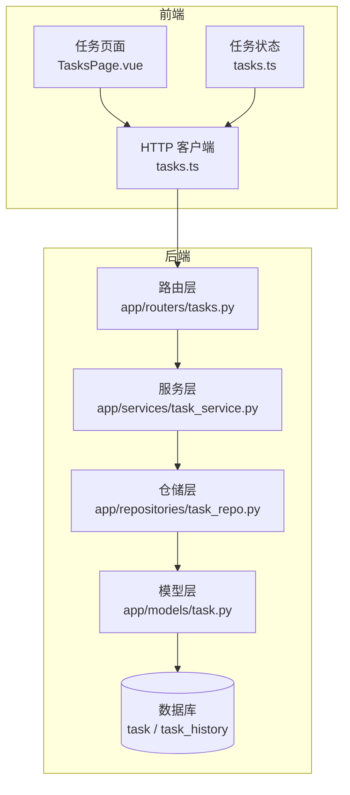
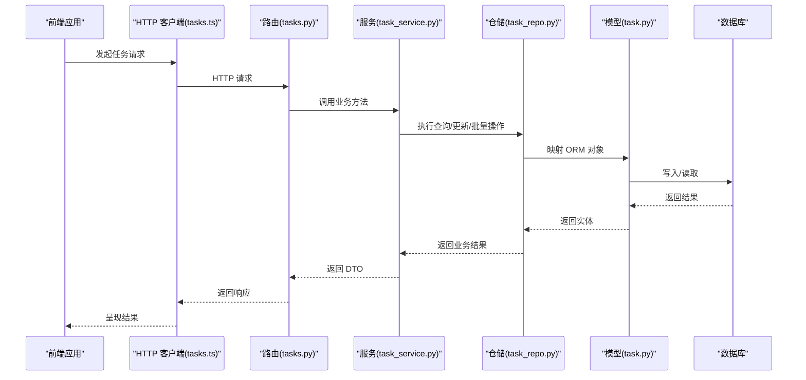
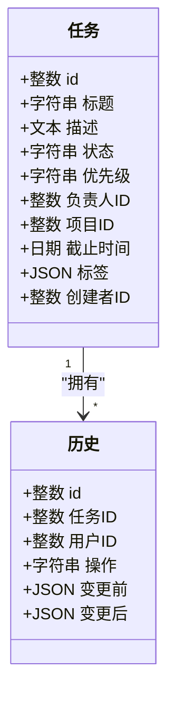
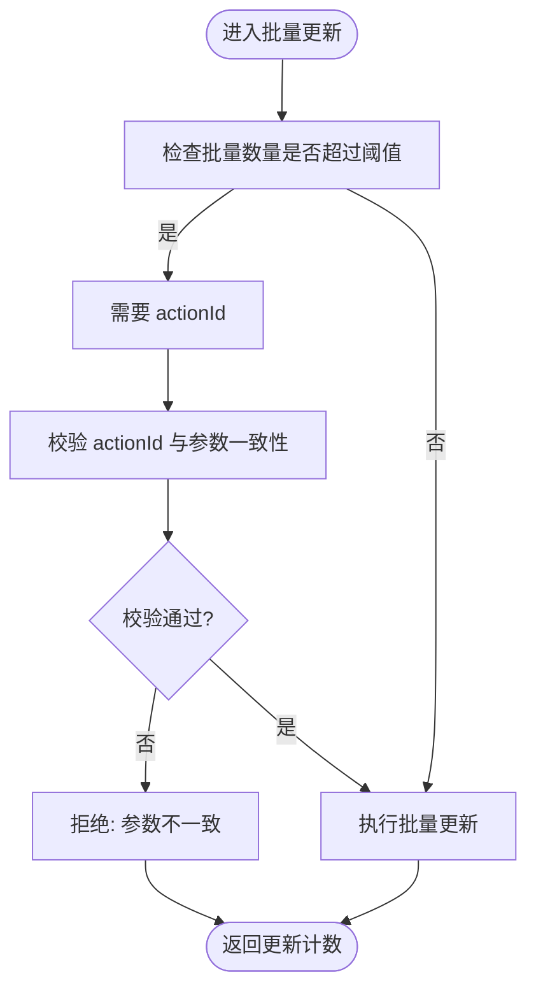
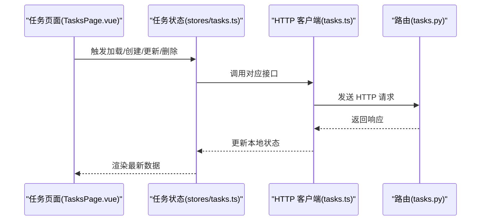
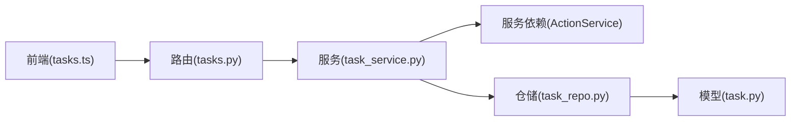

# 任务API

<cite>
**本文引用的文件**
- [tasks.py](file://workspace/api/app/routers/tasks.py)
- [task.py](file://workspace/api/app/models/task.py)
- [task.py](file://workspace/api/app/schemas/task.py)
- [task_service.py](file://workspace/api/app/services/task_service.py)
- [task_repo.py](file://workspace/api/app/repositories/task_repo.py)
- [project.py](file://workspace/api/app/models/project.py)
- [user.py](file://workspace/api/app/models/user.py)
- [tasks.ts](file://workspace/web/src/apis/modules/tasks.ts)
- [TasksPage.vue](file://workspace/web/src/pages/tasks/TasksPage.vue)
- [tasks.ts](file://workspace/web/src/stores/tasks.ts)
- [001_initial.py](file://workspace/api/alembic/versions/001_initial.py)
</cite>

## 目录
1. [简介](#简介)
2. [项目结构](#项目结构)
3. [核心组件](#核心组件)
4. [架构总览](#架构总览)
5. [详细组件分析](#详细组件分析)
6. [依赖分析](#依赖分析)
7. [性能考虑](#性能考虑)
8. [故障排查指南](#故障排查指南)
9. [结论](#结论)
10. [附录](#附录)

## 简介
本文件为 FDE 工作台任务管理 API 的权威文档，覆盖任务全生命周期：创建、查询、更新、删除、批量状态更新、批量指派、历史轨迹查询等。同时说明任务状态流转、优先级管理、时间线跟踪、权限控制与搜索过滤能力，并给出常见业务场景的请求示例路径与最佳实践。

## 项目结构
后端采用 FastAPI + SQLAlchemy 异步 ORM 架构，前端基于 Vue + Pinia 状态管理与 HTTP 适配层对接后端 API。数据库迁移脚本定义了任务与历史表结构。

图表来源
- [tasks.py:1-70](file://workspace/api/app/routers/tasks.py#L1-L70)
- [task_service.py:1-127](file://workspace/api/app/services/task_service.py#L1-L127)
- [task_repo.py:1-143](file://workspace/api/app/repositories/task_repo.py#L1-L143)
- [task.py:1-41](file://workspace/api/app/models/task.py#L1-L41)

章节来源
- [tasks.py:1-70](file://workspace/api/app/routers/tasks.py#L1-L70)
- [task_service.py:1-127](file://workspace/api/app/services/task_service.py#L1-L127)
- [task_repo.py:1-143](file://workspace/api/app/repositories/task_repo.py#L1-L143)
- [task.py:1-41](file://workspace/api/app/models/task.py#L1-L41)
- [001_initial.py:32-48](file://workspace/api/alembic/versions/001_initial.py#L32-L48)

## 核心组件
- 路由层：定义任务相关 HTTP 接口，注入依赖并调用服务层。
- 服务层：封装业务逻辑，执行权限校验、批量操作校验与历史记录写入。
- 仓储层：负责 SQL 查询、分页、批量更新/指派、历史读取与项目成员/拥有者判定。
- 模型层：定义任务与历史表结构及关系。
- 前端：提供任务列表、看板视图、创建/更新/删除、批量操作与历史查看的交互入口。

章节来源
- [tasks.py:20-70](file://workspace/api/app/routers/tasks.py#L20-L70)
- [task_service.py:19-127](file://workspace/api/app/services/task_service.py#L19-L127)
- [task_repo.py:9-143](file://workspace/api/app/repositories/task_repo.py#L9-L143)
- [task.py:9-41](file://workspace/api/app/models/task.py#L9-L41)

## 架构总览
下图展示从前端到后端的关键调用链路与职责边界。

图表来源
- [tasks.py:32-70](file://workspace/api/app/routers/tasks.py#L32-L70)
- [task_service.py:25-112](file://workspace/api/app/services/task_service.py#L25-L112)
- [task_repo.py:12-86](file://workspace/api/app/repositories/task_repo.py#L12-L86)
- [task.py:9-41](file://workspace/api/app/models/task.py#L9-L41)

## 详细组件分析

### 数据模型与枚举
- 任务实体包含标题、描述、状态、优先级、负责人、项目、截止时间、标签、创建者等字段；支持软删除与时间戳。
- 历史实体记录每次变更的操作类型与前后值，便于审计与回溯。
- 状态枚举：todo、in_progress、review、done、blocked
- 优先级枚举：p0、p1、p2、p3

图表来源
- [task.py:9-41](file://workspace/api/app/models/task.py#L9-L41)

章节来源
- [task.py:9-41](file://workspace/api/app/models/task.py#L9-L41)
- [task.py:12-25](file://workspace/api/app/schemas/task.py#L12-L25)
- [001_initial.py:32-48](file://workspace/api/alembic/versions/001_initial.py#L32-L48)

### 权限与可见性
- 读权限：任务创建者、负责人、或项目成员可读。
- 写权限：任务创建者、负责人、或项目拥有者可写。
- 批量状态更新：当批量条目数大于阈值时，需先获取一次性 actionId 并在请求中携带，且 action 参数中的 ID 集合必须与请求一致。

图表来源
- [task_service.py:82-93](file://workspace/api/app/services/task_service.py#L82-L93)

章节来源
- [task_service.py:114-126](file://workspace/api/app/services/task_service.py#L114-L126)
- [task_repo.py:54-76](file://workspace/api/app/repositories/task_repo.py#L54-L76)

### API 列表与行为

- 获取任务列表
  - 方法与路径：GET /api/v1/tasks
  - 查询参数：keyword、status[]、assigneeId、projectId、priority[]、page、size
  - 返回：分页结果，包含 items、total、page、size
  - 示例路径：[tasks.ts:25-26](file://workspace/web/src/apis/modules/tasks.ts#L25-L26)

- 获取单个任务
  - 方法与路径：GET /api/v1/tasks/{task_id}
  - 返回：任务详情 DTO
  - 示例路径：[tasks.ts:28-28](file://workspace/web/src/apis/modules/tasks.ts#L28-L28)

- 创建任务
  - 方法与路径：POST /api/v1/tasks
  - 请求体：任务创建模型（标题、描述、状态、优先级、负责人、项目、截止时间、标签）
  - 返回：任务详情 DTO
  - 示例路径：[tasks.ts:30-30](file://workspace/web/src/apis/modules/tasks.ts#L30-L30)

- 更新任务
  - 方法与路径：PUT /api/v1/tasks/{task_id}
  - 请求体：任务更新模型（可选字段）
  - 返回：任务详情 DTO
  - 示例路径：[tasks.ts:32-32](file://workspace/web/src/apis/modules/tasks.ts#L32-L32)

- 删除任务
  - 方法与路径：DELETE /api/v1/tasks/{task_id}
  - 返回：删除结果对象
  - 示例路径：[tasks.ts:34-34](file://workspace/web/src/apis/modules/tasks.ts#L34-L34)

- 批量更新状态
  - 方法与路径：POST /api/v1/tasks/batch-update-status
  - 请求体：ids[]、status、actionId（超过阈值时必填）
  - 返回：更新计数
  - 示例路径：[tasks.ts:36-37](file://workspace/web/src/apis/modules/tasks.ts#L36-L37)

- 批量指派
  - 方法与路径：POST /api/v1/tasks/batch-assign
  - 请求体：ids[]、assigneeId
  - 返回：更新计数
  - 示例路径：[tasks.ts:39-40](file://workspace/web/src/apis/modules/tasks.ts#L39-L40)

- 查看任务历史
  - 方法与路径：GET /api/v1/tasks/{task_id}/history
  - 返回：历史记录数组（含操作、变更前后值、操作人）
  - 示例路径：[tasks.ts:42-42](file://workspace/web/src/apis/modules/tasks.ts#L42-L42)

章节来源
- [tasks.py:32-70](file://workspace/api/app/routers/tasks.py#L32-L70)
- [task.py:40-116](file://workspace/api/app/schemas/task.py#L40-L116)
- [tasks.ts:24-43](file://workspace/web/src/apis/modules/tasks.ts#L24-L43)

### 前端集成要点
- 列表与看板：前端通过 tasksApi.list 加载任务，按状态分组渲染看板视图。
- 过滤与搜索：支持关键词、状态、优先级多维过滤，分页参数随请求传递。
- 交互流程：创建/更新/删除均通过对应 API 调用，完成后刷新本地状态。

图表来源
- [TasksPage.vue:189-202](file://workspace/web/src/pages/tasks/TasksPage.vue#L189-L202)
- [tasks.ts:18-49](file://workspace/web/src/stores/tasks.ts#L18-L49)
- [tasks.ts:24-43](file://workspace/web/src/apis/modules/tasks.ts#L24-L43)

章节来源
- [TasksPage.vue:189-202](file://workspace/web/src/pages/tasks/TasksPage.vue#L189-L202)
- [tasks.ts:18-84](file://workspace/web/src/stores/tasks.ts#L18-L84)
- [tasks.ts:24-43](file://workspace/web/src/apis/modules/tasks.ts#L24-L43)

## 依赖分析
- 路由依赖服务：路由层通过依赖注入获取服务实例，确保事务与缓存/动作服务可用。
- 服务依赖仓储：服务层统一编排业务规则与权限校验，委托仓储执行数据访问。
- 仓储依赖模型：仓储基于 SQLAlchemy ORM 操作任务与历史表。
- 前端依赖后端契约：前端 API 客户端严格遵循后端 DTO 字段命名（如 dueAt、assigneeId、gmtCreate 等）。

图表来源
- [tasks.py:23-29](file://workspace/api/app/routers/tasks.py#L23-L29)
- [task_service.py:19-23](file://workspace/api/app/services/task_service.py#L19-L23)
- [task_repo.py:9-10](file://workspace/api/app/repositories/task_repo.py#L9-L10)
- [task.py:9-26](file://workspace/api/app/models/task.py#L9-L26)
- [tasks.ts:1-44](file://workspace/web/src/apis/modules/tasks.ts#L1-L44)

章节来源
- [tasks.py:23-29](file://workspace/api/app/routers/tasks.py#L23-L29)
- [task_service.py:19-23](file://workspace/api/app/services/task_service.py#L19-L23)
- [task_repo.py:9-10](file://workspace/api/app/repositories/task_repo.py#L9-L10)
- [tasks.ts:1-44](file://workspace/web/src/apis/modules/tasks.ts#L1-L44)

## 性能考虑
- 分页与过滤：后端提供 keyword、status、assigneeId、projectId、priority 等过滤条件，建议前端结合分页参数避免一次性拉取过多数据。
- 批量操作阈值：批量更新状态超过阈值需先申请一次性 actionId，避免滥用与提升安全性。
- 历史记录：每次变更写入历史表，建议仅在必要时查询历史接口，避免频繁读取。
- 项目成员判断：读写权限会查询项目成员/拥有者，建议前端尽量减少不必要的跨项目访问。

## 故障排查指南
- 未找到任务：当任务不存在或已被软删除时，将抛出“任务不存在”异常。
- 权限不足：非任务创建者/负责人且非项目成员/拥有者将被拒绝访问。
- 批量操作参数不一致：当 actionId 绑定的 ID 集合与请求不一致时，将抛出“AI 动作参数不匹配”异常。
- 批量更新超阈值未提供 actionId：将提示需先获取一次性确认标识。

章节来源
- [task_service.py:41-46](file://workspace/api/app/services/task_service.py#L41-L46)
- [task_service.py:74-80](file://workspace/api/app/services/task_service.py#L74-L80)
- [task_service.py:82-93](file://workspace/api/app/services/task_service.py#L82-L93)
- [task_service.py:114-126](file://workspace/api/app/services/task_service.py#L114-L126)

## 结论
该任务 API 提供了从创建到完成的完整生命周期管理，具备完善的权限控制、批量操作与历史审计能力。前端通过统一的 HTTP 客户端与状态管理实现高效的数据展示与交互。建议在生产环境中配合前端分页与过滤策略，合理使用批量操作与一次性 actionId 机制，确保安全与性能。

## 附录

### 常见请求示例（路径指引）
- 创建任务
  - 请求：POST /api/v1/tasks
  - 示例路径：[tasks.ts:30-30](file://workspace/web/src/apis/modules/tasks.ts#L30-L30)
- 更新任务状态
  - 请求：PUT /api/v1/tasks/{task_id}
  - 示例路径：[tasks.ts:32-32](file://workspace/web/src/apis/modules/tasks.ts#L32-L32)
- 删除任务
  - 请求：DELETE /api/v1/tasks/{task_id}
  - 示例路径：[tasks.ts:34-34](file://workspace/web/src/apis/modules/tasks.ts#L34-L34)
- 批量更新状态（含 actionId）
  - 请求：POST /api/v1/tasks/batch-update-status
  - 示例路径：[tasks.ts:36-37](file://workspace/web/src/apis/modules/tasks.ts#L36-L37)
- 批量指派
  - 请求：POST /api/v1/tasks/batch-assign
  - 示例路径：[tasks.ts:39-40](file://workspace/web/src/apis/modules/tasks.ts#L39-L40)
- 获取任务历史
  - 请求：GET /api/v1/tasks/{task_id}/history
  - 示例路径：[tasks.ts:42-42](file://workspace/web/src/apis/modules/tasks.ts#L42-L42)

### 任务数据模型字段说明
- 任务基础字段：标题、描述、状态、优先级、负责人、项目、截止时间、标签、创建者
- 历史字段：操作类型、变更前、变更后、操作人、时间戳
- 项目与用户模型：用于权限判断与关联显示

章节来源
- [task.py:12-26](file://workspace/api/app/models/task.py#L12-L26)
- [task.py:32-39](file://workspace/api/app/models/task.py#L32-L39)
- [project.py:9-26](file://workspace/api/app/models/project.py#L9-L26)
- [user.py:8-22](file://workspace/api/app/models/user.py#L8-L22)