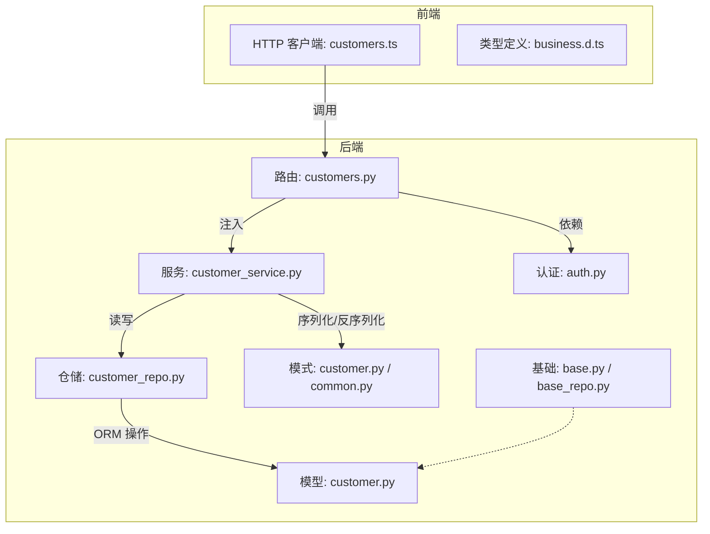
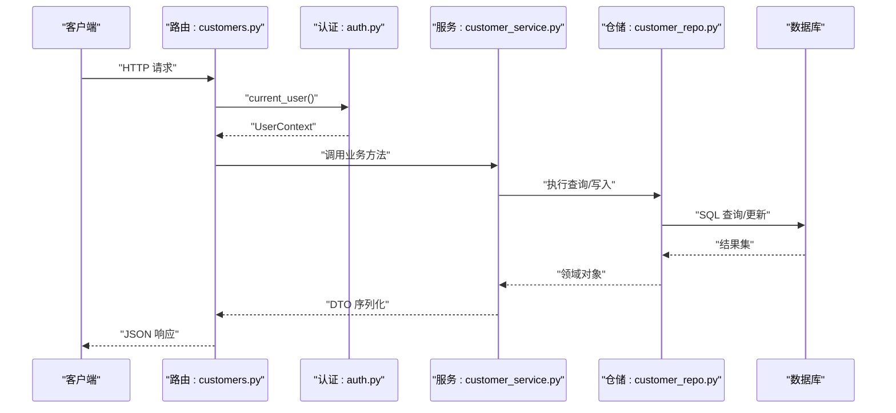
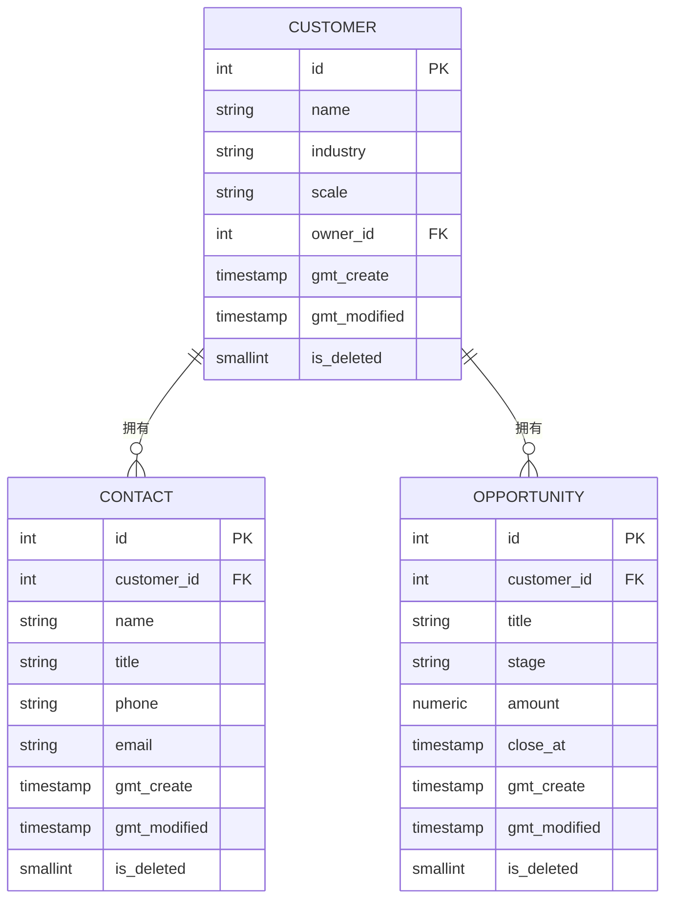
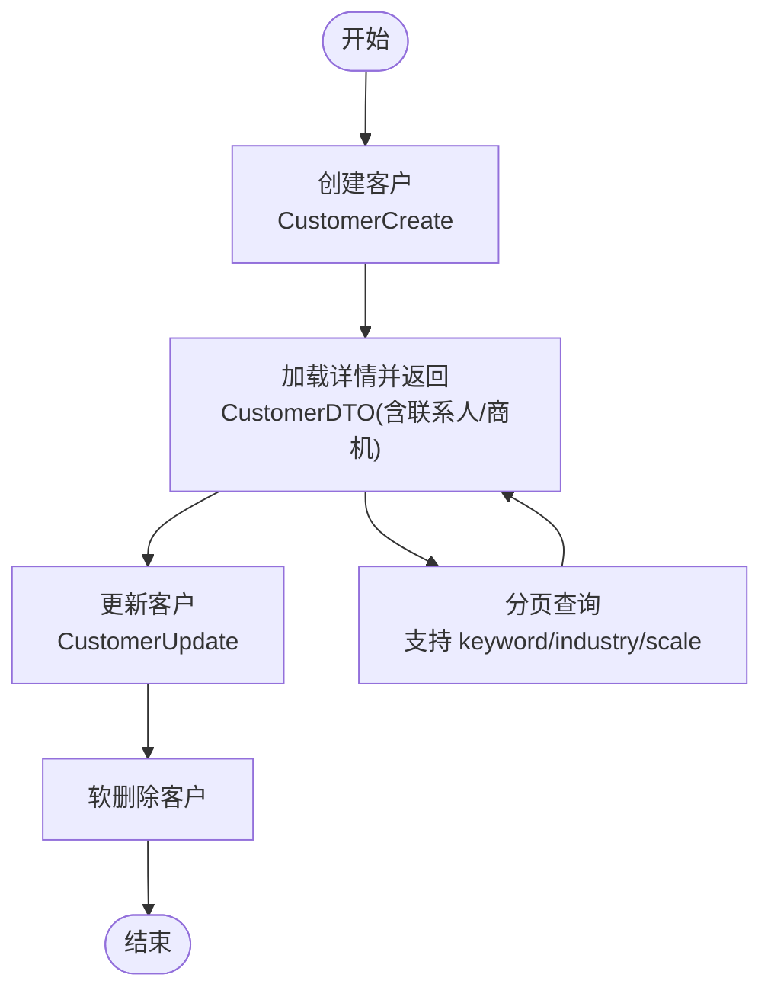
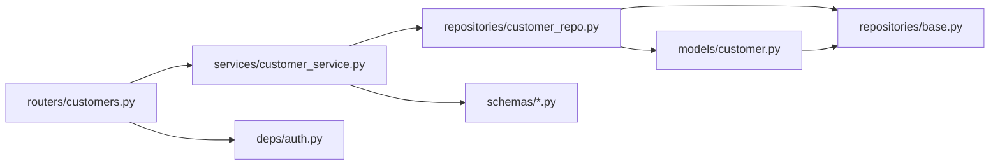
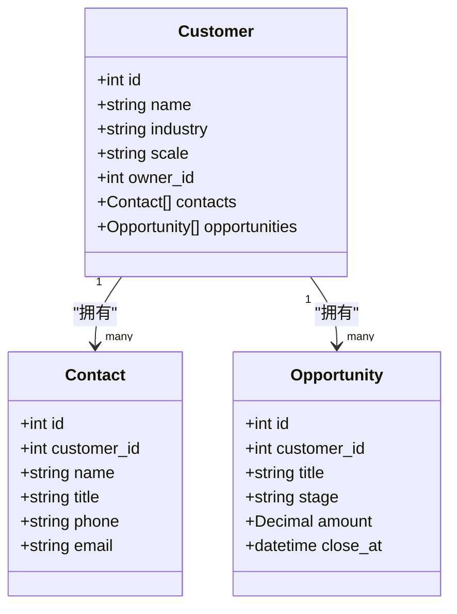

# 客户API

<cite>
**本文引用的文件**
- [workspace/api/app/routers/customers.py](file://workspace/api/app/routers/customers.py)
- [workspace/api/app/schemas/customer.py](file://workspace/api/app/schemas/customer.py)
- [workspace/api/app/schemas/common.py](file://workspace/api/app/schemas/common.py)
- [workspace/api/app/models/customer.py](file://workspace/api/app/models/customer.py)
- [workspace/api/app/models/base.py](file://workspace/api/app/models/base.py)
- [workspace/api/app/repositories/customer_repo.py](file://workspace/api/app/repositories/customer_repo.py)
- [workspace/api/app/repositories/base.py](file://workspace/api/app/repositories/base.py)
- [workspace/api/app/services/customer_service.py](file://workspace/api/app/services/customer_service.py)
- [workspace/api/app/deps/auth.py](file://workspace/api/app/deps/auth.py)
- [workspace/api/app/main.py](file://workspace/api/app/main.py)
- [workspace/web/src/apis/modules/customers.ts](file://workspace/web/src/apis/modules/customers.ts)
- [workspace/web/src/types/business.d.ts](file://workspace/web/src/types/business.d.ts)
- [workspace/api/tests/services/test_customer_service.py](file://workspace/api/tests/services/test_customer_service.py)
</cite>

## 目录
1. [简介](#简介)
2. [项目结构](#项目结构)
3. [核心组件](#核心组件)
4. [架构总览](#架构总览)
5. [详细组件分析](#详细组件分析)
6. [依赖分析](#依赖分析)
7. [性能考虑](#性能考虑)
8. [故障排查指南](#故障排查指南)
9. [结论](#结论)
10. [附录](#附录)

## 简介
本文件为 FDE 工作台客户关系管理（CRM）API 的权威文档，覆盖客户信息管理、联系人维护、商机跟踪等核心能力，并补充客户分类、等级管理、历史记录、沟通记录、合同管理、服务记录等扩展能力的接口定义与使用说明。文档同时提供数据模型、业务流程、权限控制策略以及搜索、统计与报表导出的实践指南。

## 项目结构
- 后端采用 FastAPI + SQLAlchemy 异步 ORM 架构，按职责分层：路由层（routers）、服务层（services）、仓储层（repositories）、模型层（models）、模式层（schemas）、认证依赖（deps）。
- 前端通过统一 HTTP 客户端封装调用后端 /api/v1/customers 接口，类型定义位于前端 types/business.d.ts。

图表来源
- [workspace/api/app/routers/customers.py:1-62](file://workspace/api/app/routers/customers.py#L1-L62)
- [workspace/api/app/services/customer_service.py:1-116](file://workspace/api/app/services/customer_service.py#L1-L116)
- [workspace/api/app/repositories/customer_repo.py:1-60](file://workspace/api/app/repositories/customer_repo.py#L1-L60)
- [workspace/api/app/models/customer.py:1-47](file://workspace/api/app/models/customer.py#L1-L47)
- [workspace/api/app/schemas/customer.py:1-75](file://workspace/api/app/schemas/customer.py#L1-L75)
- [workspace/api/app/schemas/common.py:1-30](file://workspace/api/app/schemas/common.py#L1-L30)
- [workspace/api/app/deps/auth.py:1-81](file://workspace/api/app/deps/auth.py#L1-L81)
- [workspace/api/app/models/base.py:1-24](file://workspace/api/app/models/base.py#L1-L24)
- [workspace/api/app/repositories/base.py:1-42](file://workspace/api/app/repositories/base.py#L1-L42)
- [workspace/web/src/apis/modules/customers.ts:1-34](file://workspace/web/src/apis/modules/customers.ts#L1-L34)
- [workspace/web/src/types/business.d.ts:66-96](file://workspace/web/src/types/business.d.ts#L66-L96)

章节来源
- [workspace/api/app/main.py:58-67](file://workspace/api/app/main.py#L58-L67)
- [workspace/api/app/routers/customers.py:1-62](file://workspace/api/app/routers/customers.py#L1-L62)

## 核心组件
- 路由层（customers.py）
  - 提供客户列表、详情、创建、更新、删除；客户联系人查询与新增；客户商机查询等端点。
- 服务层（customer_service.py）
  - 封装业务逻辑：分页检索、详情加载、增删改、联系人与商机读取、DTO 转换。
- 仓储层（customer_repo.py）
  - 实现关键词/行业/规模过滤、分页、软删除、关联加载、联系人与商机查询。
- 模型层（customer.py）
  - 定义客户、联系人、商机三张表及外键关系；继承时间戳与软删除混入。
- 模式层（customer.py, common.py）
  - 定义请求/响应 DTO、分页请求/响应模型。
- 认证依赖（auth.py）
  - JWT 解析、用户上下文注入、角色校验。

章节来源
- [workspace/api/app/routers/customers.py:19-61](file://workspace/api/app/routers/customers.py#L19-L61)
- [workspace/api/app/services/customer_service.py:15-116](file://workspace/api/app/services/customer_service.py#L15-L116)
- [workspace/api/app/repositories/customer_repo.py:9-60](file://workspace/api/app/repositories/customer_repo.py#L9-L60)
- [workspace/api/app/models/customer.py:9-47](file://workspace/api/app/models/customer.py#L9-L47)
- [workspace/api/app/schemas/customer.py:12-75](file://workspace/api/app/schemas/customer.py#L12-L75)
- [workspace/api/app/schemas/common.py:20-30](file://workspace/api/app/schemas/common.py#L20-L30)
- [workspace/api/app/deps/auth.py:19-81](file://workspace/api/app/deps/auth.py#L19-L81)

## 架构总览
下图展示从客户端到数据库的完整调用链路与各层职责：

图表来源
- [workspace/api/app/routers/customers.py:24-61](file://workspace/api/app/routers/customers.py#L24-L61)
- [workspace/api/app/deps/auth.py:28-58](file://workspace/api/app/deps/auth.py#L28-L58)
- [workspace/api/app/services/customer_service.py:20-80](file://workspace/api/app/services/customer_service.py#L20-L80)
- [workspace/api/app/repositories/customer_repo.py:12-52](file://workspace/api/app/repositories/customer_repo.py#L12-L52)

## 详细组件分析

### 数据模型与关系
- 客户（Customer）：包含名称、行业、规模、负责人等字段，支持软删除与时间戳。
- 联系人（Contact）：一对一关联客户，存储姓名、职位、电话、邮箱等。
- 商机（Opportunity）：一对一关联客户，存储标题、阶段、金额、预计成交时间等。
- 关系：客户与联系人、商机为一对多关系，均支持级联删除。

图表来源
- [workspace/api/app/models/customer.py:9-47](file://workspace/api/app/models/customer.py#L9-L47)
- [workspace/api/app/models/base.py:15-24](file://workspace/api/app/models/base.py#L15-L24)

章节来源
- [workspace/api/app/models/customer.py:9-47](file://workspace/api/app/models/customer.py#L9-L47)
- [workspace/api/app/models/base.py:15-24](file://workspace/api/app/models/base.py#L15-L24)

### API 端点定义与使用指南

- 基础路径
  - 所有 CRM 相关端点位于 /api/v1/customers 前缀下。

- 认证与权限
  - 所有端点均依赖 JWT 认证，通过 Authorization: Bearer <token> 传递。
  - 当前路由未显式声明角色限制，但可基于 UserContext 中的角色进行扩展校验。

- 分页与通用响应
  - 使用 PageRequest(page, size) 进行分页；返回 PageResponse(items, total, page, size)。
  - 统一响应体 ApiResponse(code, message, data, traceId)。

- 客户相关端点
  - GET /api/v1/customers
    - 功能：分页查询客户，支持关键字、行业、规模过滤。
    - 请求参数：PageRequest + keyword、industry、scale。
    - 响应：PageResponse<CustomerDTO>。
  - GET /api/v1/customers/{customer_id}
    - 功能：获取客户详情（含联系人与商机）。
    - 响应：CustomerDTO。
  - POST /api/v1/customers
    - 功能：创建客户，默认 owner_id 来自当前用户。
    - 请求体：CustomerCreate。
    - 响应：CustomerDTO。
  - PUT /api/v1/customers/{customer_id}
    - 功能：更新客户信息。
    - 请求体：CustomerUpdate。
    - 响应：CustomerDTO。
  - DELETE /api/v1/customers/{customer_id}
    - 功能：软删除客户。
    - 响应：{"deleted": true}。
  - GET /api/v1/customers/{customer_id}/contacts
    - 功能：查询客户联系人列表。
    - 响应：ContactDTO[]。
  - POST /api/v1/customers/{customer_id}/contacts
    - 功能：为客户新增联系人。
    - 请求体：ContactCreate。
    - 响应：ContactDTO。
  - GET /api/v1/customers/{customer_id}/opportunities
    - 功能：查询客户商机列表。
    - 响应：OpportunityDTO[]。

- 请求示例（以路径代替代码片段）
  - 创建客户
    - 方法与路径：POST /api/v1/customers
    - 请求体参考：[workspace/api/app/schemas/customer.py:57-62](file://workspace/api/app/schemas/customer.py#L57-L62)
    - 响应体参考：[workspace/api/app/schemas/customer.py:43-54](file://workspace/api/app/schemas/customer.py#L43-L54)
  - 添加联系人
    - 方法与路径：POST /api/v1/customers/{customer_id}/contacts
    - 请求体参考：[workspace/api/app/schemas/customer.py:24-29](file://workspace/api/app/schemas/customer.py#L24-L29)
    - 响应体参考：[workspace/api/app/schemas/customer.py:12-22](file://workspace/api/app/schemas/customer.py#L12-L22)
  - 更新客户
    - 方法与路径：PUT /api/v1/customers/{customer_id}
    - 请求体参考：[workspace/api/app/schemas/customer.py:64-69](file://workspace/api/app/schemas/customer.py#L64-L69)
    - 响应体参考：[workspace/api/app/schemas/customer.py:43-54](file://workspace/api/app/schemas/customer.py#L43-L54)

- 前端调用参考
  - 列表、详情、创建、更新、删除、联系人查询、新增联系人、商机查询
  - 参考：[workspace/web/src/apis/modules/customers.ts:24-33](file://workspace/web/src/apis/modules/customers.ts#L24-L33)

章节来源
- [workspace/api/app/routers/customers.py:24-61](file://workspace/api/app/routers/customers.py#L24-L61)
- [workspace/api/app/schemas/customer.py:12-75](file://workspace/api/app/schemas/customer.py#L12-L75)
- [workspace/api/app/schemas/common.py:20-30](file://workspace/api/app/schemas/common.py#L20-L30)
- [workspace/web/src/apis/modules/customers.ts:24-33](file://workspace/web/src/apis/modules/customers.ts#L24-L33)

### 业务流程与权限控制

- 客户生命周期
  - 创建：提交 CustomerCreate，owner_id 默认为当前用户。
  - 查询：支持关键词、行业、规模过滤与分页。
  - 更新：仅允许更新指定字段，空值将被忽略。
  - 删除：软删除，保留历史数据。
  - 关联：详情返回时自动加载联系人与商机。

- 权限控制
  - 当前路由未内置角色校验，建议在需要时通过 require_role(...) 或在服务层增加 owner_id 校验。
  - 用户上下文包含 id、name、email、roles、level，可用于后续权限增强。

图表来源
- [workspace/api/app/services/customer_service.py:39-65](file://workspace/api/app/services/customer_service.py#L39-L65)
- [workspace/api/app/repositories/customer_repo.py:12-28](file://workspace/api/app/repositories/customer_repo.py#L12-L28)

章节来源
- [workspace/api/app/services/customer_service.py:20-80](file://workspace/api/app/services/customer_service.py#L20-L80)
- [workspace/api/app/deps/auth.py:61-67](file://workspace/api/app/deps/auth.py#L61-L67)

### 扩展能力：客户分类、等级管理、历史记录
- 客户分类与等级
  - 模型已具备 industry 与 scale 字段，可直接用于分类与等级管理。
  - 建议在前端或服务层增加枚举约束与校验，确保数据一致性。
- 历史记录
  - 建议引入审计日志表（如 customer_audit），记录每次变更的字段、旧值、新值、操作人与时间，便于追溯。

章节来源
- [workspace/api/app/models/customer.py:13-16](file://workspace/api/app/models/customer.py#L13-L16)
- [workspace/api/app/schemas/customer.py:46-48](file://workspace/api/app/schemas/customer.py#L46-L48)

### 扩展能力：客户沟通记录、合同管理、服务记录
- 沟通记录
  - 建议新增 Communication 表，关联客户，字段包括沟通主题、内容、时间、方式、参与人等。
- 合同管理
  - 建议新增 Contract 表，关联客户，字段包括合同编号、签署日期、金额、有效期、状态等。
- 服务记录
  - 建议新增 ServiceRecord 表，关联客户，字段包括服务类型、执行时间、执行人、结果摘要等。

章节来源
- [workspace/api/app/models/customer.py:9-21](file://workspace/api/app/models/customer.py#L9-L21)

### 搜索、统计与报表导出
- 搜索
  - 使用 GET /api/v1/customers 并传入 keyword、industry、scale 实现多维过滤。
- 统计
  - 仓储提供 count_active 辅助方法，可用于统计活跃客户数量。
- 报表导出
  - 建议在服务层聚合客户、联系人、商机数据，结合分页批量拉取后导出为 CSV/Excel。

章节来源
- [workspace/api/app/repositories/customer_repo.py:54-60](file://workspace/api/app/repositories/customer_repo.py#L54-L60)

## 依赖分析

图表来源
- [workspace/api/app/routers/customers.py:1-62](file://workspace/api/app/routers/customers.py#L1-L62)
- [workspace/api/app/services/customer_service.py:1-19](file://workspace/api/app/services/customer_service.py#L1-L19)
- [workspace/api/app/repositories/customer_repo.py:1-11](file://workspace/api/app/repositories/customer_repo.py#L1-L11)
- [workspace/api/app/models/customer.py:1-10](file://workspace/api/app/models/customer.py#L1-L10)
- [workspace/api/app/schemas/customer.py:1-11](file://workspace/api/app/schemas/customer.py#L1-L11)
- [workspace/api/app/deps/auth.py:1-16](file://workspace/api/app/deps/auth.py#L1-L16)
- [workspace/api/app/repositories/base.py:1-19](file://workspace/api/app/repositories/base.py#L1-L19)
- [workspace/api/app/models/base.py:1-12](file://workspace/api/app/models/base.py#L1-L12)

章节来源
- [workspace/api/app/main.py:58-67](file://workspace/api/app/main.py#L58-L67)

## 性能考虑
- 分页与过滤
  - 使用 keyword、industry、scale 过滤时建议在数据库侧建立索引以提升查询效率。
- N+1 查询
  - 详情加载会刷新关联集合，注意避免在高频场景中重复刷新。
- 缓存
  - 对热点客户详情可引入缓存层，降低数据库压力。
- 导出与统计
  - 大量数据导出建议异步处理并提供下载链接。

## 故障排查指南
- 常见错误与定位
  - 未携带有效 JWT：认证失败，检查 Authorization 头部。
  - 客户不存在：更新/删除/详情查询可能抛出异常，检查 customer_id。
  - 参数校验失败：请求体字段长度、类型不合法，参考 DTO 字段约束。
- 单元测试参考
  - 测试覆盖了创建、列表、更新、删除等关键路径，可作为行为验证依据。

章节来源
- [workspace/api/tests/services/test_customer_service.py:10-117](file://workspace/api/tests/services/test_customer_service.py#L10-L117)

## 结论
本文档系统性梳理了 FDE 工作台 CRM 的核心 API，明确了数据模型、端点定义、业务流程与权限控制，并给出了扩展能力与性能优化建议。建议在后续版本中完善角色校验、审计日志与报表导出能力，以满足更复杂的业务场景。

## 附录

### 类图（代码级）

图表来源
- [workspace/api/app/models/customer.py:9-47](file://workspace/api/app/models/customer.py#L9-L47)