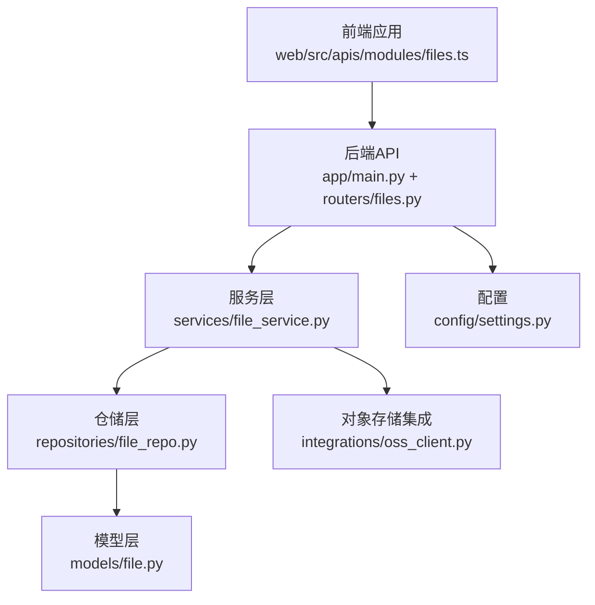
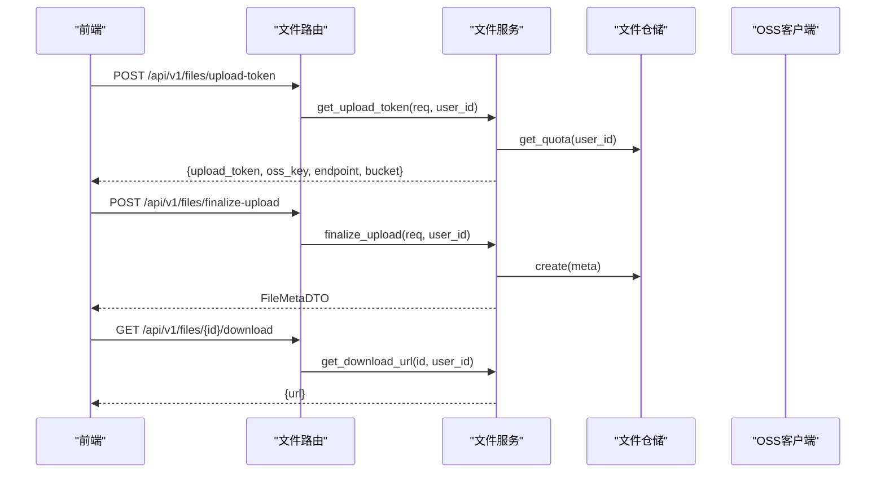
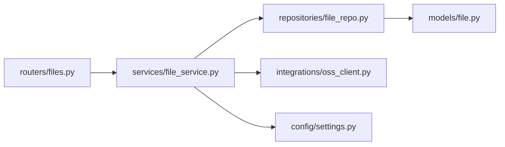
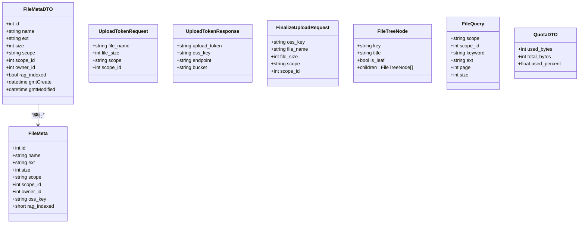

# 文件API

<cite>
**本文引用的文件**
- [workspace/api/app/routers/files.py](file://workspace/api/app/routers/files.py)
- [workspace/api/app/schemas/file.py](file://workspace/api/app/schemas/file.py)
- [workspace/api/app/schemas/common.py](file://workspace/api/app/schemas/common.py)
- [workspace/api/app/services/file_service.py](file://workspace/api/app/services/file_service.py)
- [workspace/api/app/repositories/file_repo.py](file://workspace/api/app/repositories/file_repo.py)
- [workspace/api/app/models/file.py](file://workspace/api/app/models/file.py)
- [workspace/api/app/integrations/oss_client.py](file://workspace/api/app/integrations/oss_client.py)
- [workspace/api/app/main.py](file://workspace/api/app/main.py)
- [workspace/api/app/config/settings.py](file://workspace/api/app/config/settings.py)
- [workspace/web/src/apis/modules/files.ts](file://workspace/web/src/apis/modules/files.ts)
- [docs/FDE工作台技术方案.md](file://docs/FDE工作台技术方案.md)
- [.changes/新增-FDE工作台-20260428/spec.md](file://.changes/新增-FDE工作台-20260428/spec.md)
</cite>

## 目录
1. [简介](#简介)
2. [项目结构](#项目结构)
3. [核心组件](#核心组件)
4. [架构概览](#架构概览)
5. [详细组件分析](#详细组件分析)
6. [依赖分析](#依赖分析)
7. [性能考虑](#性能考虑)
8. [故障排查指南](#故障排查指南)
9. [结论](#结论)
10. [附录](#附录)

## 简介
本文件API文档面向FDE工作台的文件管理能力，覆盖文件上传、下载、删除、批量删除、树形目录、配额查询、以及与对象存储（OSS）的集成流程。同时结合前端调用与后端服务实现，给出端点定义、数据模型、权限与安全机制、存储策略说明，并提供典型请求示例与最佳实践。

## 项目结构
- 后端采用FastAPI分层架构：路由层（routers）、服务层（services）、仓储层（repositories）、模型层（models）、集成层（integrations）。
- 前端通过HTTP模块封装调用后端文件API，形成统一的文件操作接口。

**图表来源**
- [workspace/api/app/main.py:1-73](file://workspace/api/app/main.py#L1-L73)
- [workspace/api/app/routers/files.py:1-86](file://workspace/api/app/routers/files.py#L1-L86)
- [workspace/api/app/services/file_service.py:1-127](file://workspace/api/app/services/file_service.py#L1-L127)
- [workspace/api/app/repositories/file_repo.py:1-47](file://workspace/api/app/repositories/file_repo.py#L1-L47)
- [workspace/api/app/models/file.py:1-23](file://workspace/api/app/models/file.py#L1-L23)
- [workspace/api/app/integrations/oss_client.py:1-34](file://workspace/api/app/integrations/oss_client.py#L1-L34)
- [workspace/api/app/config/settings.py:1-81](file://workspace/api/app/config/settings.py#L1-L81)

**章节来源**
- [workspace/api/app/main.py:1-73](file://workspace/api/app/main.py#L1-L73)
- [workspace/api/app/routers/files.py:1-86](file://workspace/api/app/routers/files.py#L1-L86)

## 核心组件
- 路由层：定义文件API端点，如列表、树形、配额、详情、上传令牌、完成上传、删除、批量删除、下载URL。
- 服务层：实现业务逻辑，包括配额校验、上传令牌生成、文件元数据落库、树形组装、下载URL生成。
- 仓储层：封装数据库查询与聚合，支持分页、关键词/扩展名过滤、树形查询、配额统计。
- 模型层：定义文件元数据实体及软删除字段。
- 集成层：OSS客户端（当前为模拟实现，生产需替换为真实SDK）。
- 前端模块：封装HTTP调用，暴露文件操作方法。

**章节来源**
- [workspace/api/app/routers/files.py:1-86](file://workspace/api/app/routers/files.py#L1-L86)
- [workspace/api/app/services/file_service.py:1-127](file://workspace/api/app/services/file_service.py#L1-L127)
- [workspace/api/app/repositories/file_repo.py:1-47](file://workspace/api/app/repositories/file_repo.py#L1-L47)
- [workspace/api/app/models/file.py:1-23](file://workspace/api/app/models/file.py#L1-L23)
- [workspace/api/app/integrations/oss_client.py:1-34](file://workspace/api/app/integrations/oss_client.py#L1-L34)
- [workspace/web/src/apis/modules/files.ts:1-37](file://workspace/web/src/apis/modules/files.ts#L1-L37)

## 架构概览
文件API遵循REST风格，统一前缀为/api/v1/files。后端通过服务层协调仓储与外部集成，前端以模块化方式调用。

**图表来源**
- [workspace/api/app/routers/files.py:59-86](file://workspace/api/app/routers/files.py#L59-L86)
- [workspace/api/app/services/file_service.py:64-127](file://workspace/api/app/services/file_service.py#L64-L127)
- [workspace/api/app/repositories/file_repo.py:12-47](file://workspace/api/app/repositories/file_repo.py#L12-L47)
- [workspace/api/app/integrations/oss_client.py:18-34](file://workspace/api/app/integrations/oss_client.py#L18-L34)

## 详细组件分析

### 端点定义与行为
- 列表查询
  - 方法与路径：GET /api/v1/files
  - 查询参数：scope、scope_id、keyword、ext、page、size
  - 响应：items（FileMetaDTO数组）、total（总数）
- 树形目录
  - 方法与路径：GET /api/v1/files/tree
  - 响应：FileTreeNode数组，按作用域分组
- 配额查询
  - 方法与路径：GET /api/v1/files/quota
  - 响应：used_bytes、total_bytes、used_percent
- 文件详情
  - 方法与路径：GET /api/v1/files/{file_id}
  - 响应：FileMetaDTO
- 获取下载URL
  - 方法与路径：GET /api/v1/files/{file_id}/download
  - 响应：{url}
- 上传令牌
  - 方法与路径：POST /api/v1/files/upload-token
  - 请求：UploadTokenRequest（file_name、file_size、scope、scope_id）
  - 响应：UploadTokenResponse（upload_token、oss_key、endpoint、bucket）
  - 限制：单文件最大100MB；配额不超过10GB
- 完成上传
  - 方法与路径：POST /api/v1/files/finalize-upload
  - 请求：FinalizeUploadRequest（oss_key、file_name、file_size、scope、scope_id）
  - 响应：FileMetaDTO
- 删除文件
  - 方法与路径：DELETE /api/v1/files/{file_id}
  - 响应：{"deleted": true}
- 批量删除
  - 方法与路径：POST /api/v1/files/batch-delete
  - 请求：{ids: [int]}
  - 响应：{"deleted": rowcount}

**章节来源**
- [workspace/api/app/routers/files.py:32-86](file://workspace/api/app/routers/files.py#L32-L86)
- [workspace/api/app/schemas/file.py:9-68](file://workspace/api/app/schemas/file.py#L9-L68)

### 数据模型与复杂度
- FileMetaDTO
  - 字段：id、name、ext、size、scope、scope_id、owner_id、rag_indexed、gmtCreate、gmtModified
  - 用途：对外传输的文件元数据
- UploadTokenRequest/Response
  - 用途：上传前申请直传凭证与目标key
- FinalizeUploadRequest
  - 用途：上传完成后登记文件元数据
- FileTreeNode
  - 用途：树形目录节点
- FileQuery
  - 用途：列表查询条件
- QuotaDTO
  - 用途：配额统计

仓储查询复杂度
- search：支持多条件过滤与分页，排序按创建时间倒序，时间复杂度近似O(n log n)，空间复杂度O(n)
- get_tree：按所有者与未删除状态排序，时间复杂度O(n log n)
- get_quota：聚合求和，时间复杂度O(n)

**章节来源**
- [workspace/api/app/schemas/file.py:9-68](file://workspace/api/app/schemas/file.py#L9-L68)
- [workspace/api/app/repositories/file_repo.py:12-47](file://workspace/api/app/repositories/file_repo.py#L12-L47)
- [workspace/api/app/models/file.py:9-23](file://workspace/api/app/models/file.py#L9-L23)

### 权限与安全机制
- 访问控制
  - 读取/删除均校验文件是否存在且未删除，且仅文件所有者可操作，否则抛出权限异常
- 上传限制
  - 单文件大小上限100MB；配额上限10GB；超出则拒绝
- 下载URL
  - 当前为模拟URL（含过期参数），生产需对接OSS签名URL
- 配置
  - OSS endpoint、bucket、AK/SK通过配置注入

**章节来源**
- [workspace/api/app/services/file_service.py:37-52](file://workspace/api/app/services/file_service.py#L37-L52)
- [workspace/api/app/services/file_service.py:64-82](file://workspace/api/app/services/file_service.py#L64-L82)
- [workspace/api/app/services/file_service.py:119-127](file://workspace/api/app/services/file_service.py#L119-L127)
- [workspace/api/app/config/settings.py:49-58](file://workspace/api/app/config/settings.py#L49-L58)

### 存储策略与对象存储集成
- 上传流程
  - 申请上传令牌与目标key → 前端直传OSS → 后端登记元数据
- OSS客户端
  - 当前为模拟实现，包含STS令牌生成、对象删除、下载URL拼装
  - 生产需替换为真实SDK并启用STS签名
- 文件命名
  - 采用“uploads/{user_id}/{uuid}.{ext}”的结构，便于清理与溯源

**章节来源**
- [workspace/api/app/services/file_service.py:64-82](file://workspace/api/app/services/file_service.py#L64-L82)
- [workspace/api/app/integrations/oss_client.py:18-34](file://workspace/api/app/integrations/oss_client.py#L18-L34)

### 前端调用示例
- 列表查询
  - 路径：/files
  - 参数：支持分页与过滤
- 获取树形
  - 路径：/files/tree
- 获取配额
  - 路径：/files/quota
- 获取上传令牌
  - 路径：/files/upload-token
  - 请求体：{file_name, file_size, scope?, scope_id?}
- 完成上传
  - 路径：/files/finalize-upload
  - 请求体：{oss_key, file_name, file_size, scope?, scope_id?}
- 删除与批量删除
  - 路径：/files/{id}、/files/batch-delete
- 获取下载URL
  - 路径：/files/{id}/download

**章节来源**
- [workspace/web/src/apis/modules/files.ts:24-36](file://workspace/web/src/apis/modules/files.ts#L24-L36)

### 典型请求示例（路径引用）
- 申请上传令牌
  - [POST /api/v1/files/upload-token:59-70](file://workspace/api/app/routers/files.py#L59-L70)
  - 请求体字段参考：[UploadTokenRequest:24-29](file://workspace/api/app/schemas/file.py#L24-L29)
- 完成上传登记
  - [POST /api/v1/files/finalize-upload:73-75](file://workspace/api/app/routers/files.py#L73-L75)
  - 请求体字段参考：[FinalizeUploadRequest:40-46](file://workspace/api/app/schemas/file.py#L40-L46)
- 获取下载URL
  - [GET /api/v1/files/{file_id}/download:53-56](file://workspace/api/app/routers/files.py#L53-L56)
  - 服务实现参考：[get_download_url:119-127](file://workspace/api/app/services/file_service.py#L119-L127)
- 删除文件
  - [DELETE /api/v1/files/{file_id}:78-80](file://workspace/api/app/routers/files.py#L78-L80)
  - 服务实现参考：[delete_file:45-52](file://workspace/api/app/services/file_service.py#L45-L52)

**章节来源**
- [workspace/api/app/routers/files.py:53-86](file://workspace/api/app/routers/files.py#L53-L86)
- [workspace/api/app/schemas/file.py:24-46](file://workspace/api/app/schemas/file.py#L24-L46)
- [workspace/api/app/services/file_service.py:45-52](file://workspace/api/app/services/file_service.py#L45-L52)
- [workspace/api/app/services/file_service.py:119-127](file://workspace/api/app/services/file_service.py#L119-L127)

### 版本控制、权限管理、元数据管理
- 版本控制
  - 仓库未实现版本表与回滚逻辑，产品说明中提及“同名文件覆盖时自动生成版本，最多保留10个历史版本”
  - 建议：在模型与仓储中增加版本号字段与历史表，提供版本列表与回滚接口
- 权限管理
  - 文件所有者校验贯穿读取、删除、下载URL生成
  - scope与scope_id用于标识文件归属（个人/项目/客户/共享）
- 元数据管理
  - FileMetaDTO包含基础字段与创建/修改时间
  - 服务层在finalize时写入scope、scope_id、owner_id、oss_key等

**章节来源**
- [workspace/api/app/services/file_service.py:84-96](file://workspace/api/app/services/file_service.py#L84-L96)
- [workspace/api/app/models/file.py:9-23](file://workspace/api/app/models/file.py#L9-L23)
- [.changes/新增-FDE工作台-20260428/spec.md:417-421](file://.changes/新增-FDE工作台-20260428/spec.md#L417-L421)

### 文件夹管理、批量操作、预览
- 文件夹管理
  - 路由层未提供专门的目录创建/移动接口；树形目录按scope分组展示
- 批量操作
  - 支持批量删除（POST /files/batch-delete）
- 预览
  - 产品说明支持多种格式在线预览，但当前后端未提供专门的预览接口
  - 建议：在前端通过下载URL或OSS直链进行预览，或新增预览接口

**章节来源**
- [workspace/api/app/routers/files.py:38-40](file://workspace/api/app/routers/files.py#L38-L40)
- [workspace/api/app/routers/files.py:83-86](file://workspace/api/app/routers/files.py#L83-L86)
- [.changes/新增-FDE工作台-20260428/spec.md:391-410](file://.changes/新增-FDE工作台-20260428/spec.md#L391-L410)

### 搜索、标签管理、批量处理
- 搜索
  - 列表查询支持keyword与ext过滤
- 标签管理
  - 仓储未发现标签字段或标签接口，建议扩展模型与接口
- 批量处理
  - 已提供批量删除；可扩展批量归档、批量移动等

**章节来源**
- [workspace/api/app/repositories/file_repo.py:12-34](file://workspace/api/app/repositories/file_repo.py#L12-L34)
- [workspace/api/app/routers/files.py:83-86](file://workspace/api/app/routers/files.py#L83-L86)

## 依赖分析
- 路由依赖服务：files.py依赖file_service.py提供的业务方法
- 服务依赖仓储：file_service.py依赖file_repo.py进行数据访问
- 仓储依赖模型：file_repo.py操作models/file.py定义的实体
- 服务依赖OSS：通过oss_client.py生成STS与下载URL
- 配置依赖：settings.py提供OSS endpoint/bucket等配置

**图表来源**
- [workspace/api/app/routers/files.py:23-25](file://workspace/api/app/routers/files.py#L23-L25)
- [workspace/api/app/services/file_service.py:20-24](file://workspace/api/app/services/file_service.py#L20-L24)
- [workspace/api/app/repositories/file_repo.py:9-10](file://workspace/api/app/repositories/file_repo.py#L9-L10)
- [workspace/api/app/models/file.py:9-23](file://workspace/api/app/models/file.py#L9-L23)
- [workspace/api/app/integrations/oss_client.py:12-16](file://workspace/api/app/integrations/oss_client.py#L12-L16)
- [workspace/api/app/config/settings.py:54-57](file://workspace/api/app/config/settings.py#L54-L57)

**章节来源**
- [workspace/api/app/routers/files.py:23-25](file://workspace/api/app/routers/files.py#L23-L25)
- [workspace/api/app/services/file_service.py:20-24](file://workspace/api/app/services/file_service.py#L20-L24)
- [workspace/api/app/repositories/file_repo.py:9-10](file://workspace/api/app/repositories/file_repo.py#L9-L10)
- [workspace/api/app/models/file.py:9-23](file://workspace/api/app/models/file.py#L9-L23)
- [workspace/api/app/integrations/oss_client.py:12-16](file://workspace/api/app/integrations/oss_client.py#L12-L16)
- [workspace/api/app/config/settings.py:54-57](file://workspace/api/app/config/settings.py#L54-L57)

## 性能考虑
- 列表查询
  - 使用分页与关键词/扩展名过滤，避免全表扫描
  - 排序按创建时间倒序，有利于新文件优先展示
- 配额统计
  - 使用聚合函数sum，复杂度O(n)，建议在高并发场景下缓存配额结果
- OSS直传
  - 建议开启CDN与对象版本控制，提升下载性能与可靠性

[本节为通用指导，不直接分析具体文件]

## 故障排查指南
- 413/文件过大
  - 现象：上传令牌申请被拒
  - 原因：file_size超过100MB限制
  - 处理：前端提示用户选择更小文件或分卷压缩
- 403/配额不足
  - 现象：上传令牌申请被拒
  - 原因：已用空间+本次文件大小超过10GB
  - 处理：引导用户清理或升级配额
- 404/文件不存在
  - 现象：获取详情/下载URL时报错
  - 原因：文件不存在或已被软删除
  - 处理：刷新列表或检查scope与owner_id
- 403/权限不足
  - 现象：非文件所有者尝试读取/删除
  - 处理：检查当前登录用户与文件归属

**章节来源**
- [workspace/api/app/routers/files.py:60-70](file://workspace/api/app/routers/files.py#L60-L70)
- [workspace/api/app/services/file_service.py:64-70](file://workspace/api/app/services/file_service.py#L64-L70)
- [workspace/api/app/services/file_service.py:37-52](file://workspace/api/app/services/file_service.py#L37-L52)

## 结论
当前文件API实现了上传令牌申请、直传登记、列表/树形/配额查询、下载URL生成与删除等核心能力。建议后续完善版本控制、标签管理、目录管理、批量归档与预览接口，以满足产品需求与用户体验。

[本节为总结性内容，不直接分析具体文件]

## 附录

### API一览（端点、方法、说明）
- GET /api/v1/files：文件列表（支持scope/scope_id/keyword/ext/page/size）
- GET /api/v1/files/tree：树形目录（按scope分组）
- GET /api/v1/files/quota：配额统计
- GET /api/v1/files/{file_id}：文件详情
- GET /api/v1/files/{file_id}/download：下载URL
- POST /api/v1/files/upload-token：申请上传令牌
- POST /api/v1/files/finalize-upload：完成上传登记
- DELETE /api/v1/files/{file_id}：删除文件
- POST /api/v1/files/batch-delete：批量删除

**章节来源**
- [workspace/api/app/routers/files.py:32-86](file://workspace/api/app/routers/files.py#L32-L86)

### 数据模型类图

**图表来源**
- [workspace/api/app/schemas/file.py:9-68](file://workspace/api/app/schemas/file.py#L9-L68)
- [workspace/api/app/models/file.py:9-23](file://workspace/api/app/models/file.py#L9-L23)