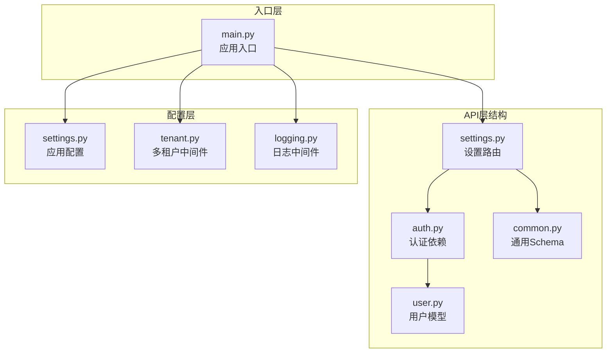
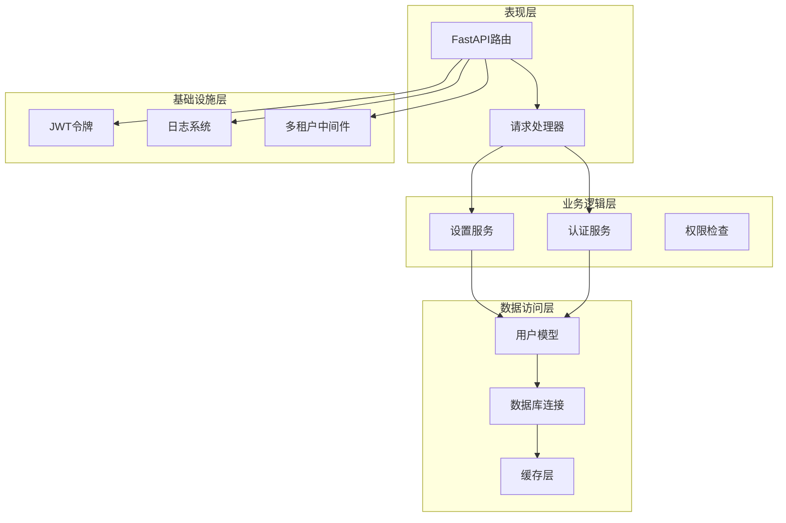
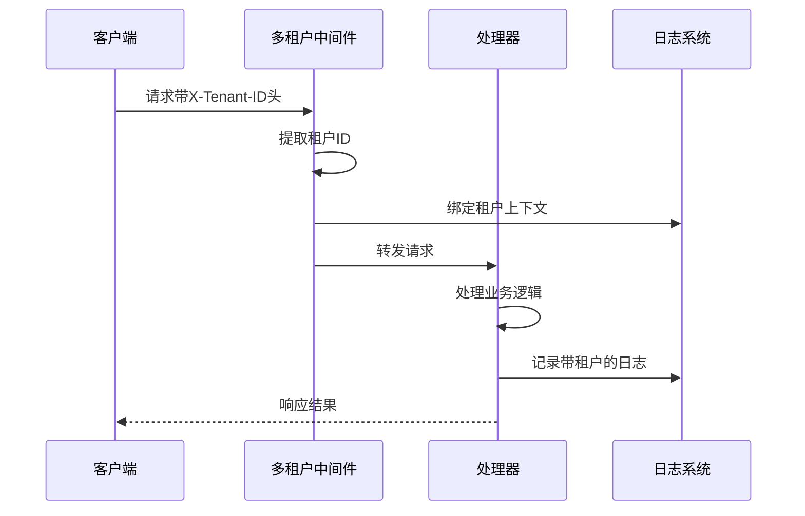
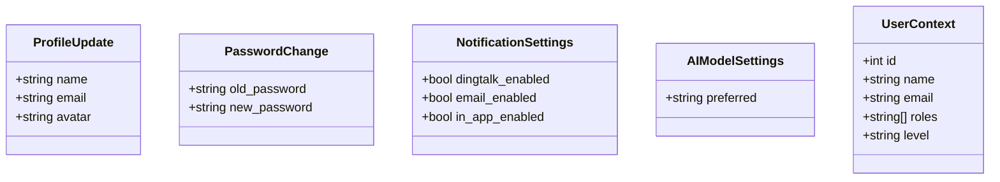
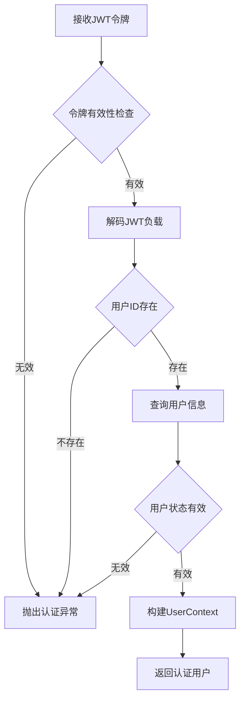
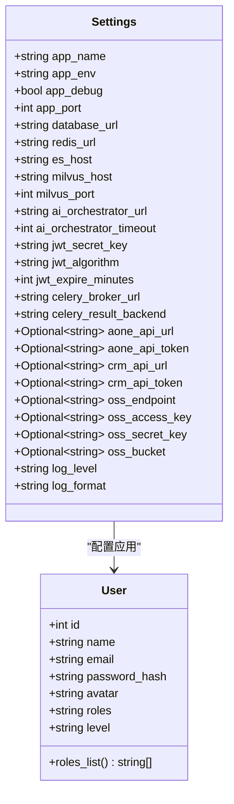
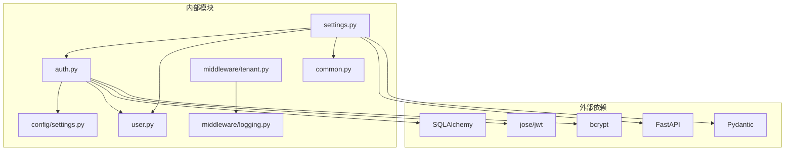

# 系统设置API

<cite>
**本文档引用的文件**
- [settings.py](file://workspace/api/app/routers/settings.py)
- [auth.py](file://workspace/api/app/deps/auth.py)
- [user.py](file://workspace/api/app/models/user.py)
- [settings.py](file://workspace/api/app/config/settings.py)
- [tenant.py](file://workspace/api/app/middleware/tenant.py)
- [logging.py](file://workspace/api/app/middleware/logging.py)
- [common.py](file://workspace/api/app/schemas/common.py)
- [main.py](file://workspace/api/app/main.py)
- [FDE工作台技术方案.md](file://docs/FDE工作台技术方案.md)
- [部署文档.md](file://docs/部署文档.md)
</cite>

## 目录
1. [简介](#简介)
2. [项目结构](#项目结构)
3. [核心组件](#核心组件)
4. [架构概览](#架构概览)
5. [详细组件分析](#详细组件分析)
6. [依赖分析](#依赖分析)
7. [性能考虑](#性能考虑)
8. [故障排除指南](#故障排除指南)
9. [结论](#结论)

## 简介

系统设置API是FDE工作台系统的核心管理接口，负责处理用户个人资料管理、密码修改、通知设置、AI模型配置等系统管理相关功能。该API采用RESTful设计原则，基于FastAPI框架构建，提供了完整的多租户支持和细粒度的权限控制机制。

系统设置API主要服务于以下场景：
- 用户个人信息维护（姓名、邮箱、头像）
- 安全密码变更管理
- 通知渠道配置（钉钉、邮件、站内信）
- AI模型偏好设置
- 系统参数配置管理

## 项目结构

系统设置API位于后端服务的API层中，采用模块化的组织方式：

**图表来源**
- [settings.py:1-82](file://workspace/api/app/routers/settings.py#L1-L82)
- [auth.py:1-81](file://workspace/api/app/deps/auth.py#L1-L81)
- [main.py:1-73](file://workspace/api/app/main.py#L1-L73)

**章节来源**
- [settings.py:1-82](file://workspace/api/app/routers/settings.py#L1-L82)
- [main.py:1-73](file://workspace/api/app/main.py#L1-L73)

## 核心组件

### 设置路由模块

设置路由模块提供了完整的用户设置管理接口，包括个人资料、密码管理、通知配置和AI模型设置等功能。

### 认证依赖系统

认证依赖系统实现了基于JWT的用户身份验证机制，提供了用户上下文管理和角色权限检查功能。

### 配置管理系统

配置管理系统基于pydantic-settings实现了灵活的应用程序配置管理，支持环境变量和配置文件的组合使用。

**章节来源**
- [settings.py:12-82](file://workspace/api/app/routers/settings.py#L12-L82)
- [auth.py:19-81](file://workspace/api/app/deps/auth.py#L19-L81)
- [settings.py:12-81](file://workspace/api/app/config/settings.py#L12-L81)

## 架构概览

系统设置API采用了分层架构设计，确保了良好的可维护性和扩展性：

**图表来源**
- [settings.py:1-82](file://workspace/api/app/routers/settings.py#L1-L82)
- [auth.py:1-81](file://workspace/api/app/deps/auth.py#L1-L81)
- [tenant.py:1-23](file://workspace/api/app/middleware/tenant.py#L1-L23)

### 多租户架构

系统支持多租户架构，通过中间件提取租户标识并将其绑定到日志上下文中：

**图表来源**
- [tenant.py:14-23](file://workspace/api/app/middleware/tenant.py#L14-L23)

**章节来源**
- [tenant.py:1-23](file://workspace/api/app/middleware/tenant.py#L1-L23)

## 详细组件分析

### 设置路由组件

设置路由组件提供了完整的用户设置管理功能，采用Pydantic模型进行数据验证和序列化。

#### 数据模型设计

**图表来源**
- [settings.py:12-31](file://workspace/api/app/routers/settings.py#L12-L31)

#### API端点设计

系统设置API包含以下主要端点：

| 端点 | 方法 | 描述 | 权限要求 |
|------|------|------|----------|
| `/api/v1/settings/profile` | GET/PUT | 获取和更新用户个人资料 | 需要认证 |
| `/api/v1/settings/password` | PUT | 修改用户密码 | 需要认证 |
| `/api/v1/settings/notifications` | GET/PUT | 获取和更新通知设置 | 需要认证 |
| `/api/v1/settings/ai-models` | GET/PUT | 获取和设置AI模型偏好 | 需要认证 |

**章节来源**
- [settings.py:33-82](file://workspace/api/app/routers/settings.py#L33-L82)

### 认证依赖组件

认证依赖组件实现了完整的用户身份验证和授权机制：

**图表来源**
- [auth.py:28-58](file://workspace/api/app/deps/auth.py#L28-L58)

#### 用户上下文管理

用户上下文类提供了统一的用户信息表示，包含了用户的基本信息、角色权限和级别信息：

**章节来源**
- [auth.py:19-58](file://workspace/api/app/deps/auth.py#L19-L58)
- [user.py:8-22](file://workspace/api/app/models/user.py#L8-L22)

### 配置管理系统

配置管理系统基于pydantic-settings实现了类型安全的配置管理：

**图表来源**
- [settings.py:12-81](file://workspace/api/app/config/settings.py#L12-L81)
- [user.py:8-22](file://workspace/api/app/models/user.py#L8-L22)

**章节来源**
- [settings.py:12-81](file://workspace/api/app/config/settings.py#L12-L81)

## 依赖分析

系统设置API的依赖关系体现了清晰的分层架构：

**图表来源**
- [settings.py:1-82](file://workspace/api/app/routers/settings.py#L1-L82)
- [auth.py:1-81](file://workspace/api/app/deps/auth.py#L1-L81)
- [settings.py:1-81](file://workspace/api/app/config/settings.py#L1-L81)

### 关键依赖关系

1. **路由到依赖注入**: 设置路由依赖于认证依赖和用户模型
2. **认证到配置**: 认证系统依赖于应用配置中的JWT设置
3. **中间件到日志**: 多租户中间件与日志系统协同工作
4. **模型到数据库**: 用户模型通过SQLAlchemy与数据库交互

**章节来源**
- [settings.py:4-8](file://workspace/api/app/routers/settings.py#L4-L8)
- [auth.py:11-14](file://workspace/api/app/deps/auth.py#L11-L14)

## 性能考虑

系统设置API在设计时充分考虑了性能优化：

### 缓存策略
- 用户信息缓存：通过JWT令牌减少数据库查询
- 配置信息缓存：使用LRU缓存机制避免重复读取配置文件

### 并发处理
- 异步数据库连接：使用SQLAlchemy异步会话提高并发性能
- 无阻塞操作：所有数据库操作都是异步非阻塞的

### 内存管理
- 对象池：复用Pydantic模型实例减少内存分配
- 及时清理：确保认证令牌和临时数据及时释放

## 故障排除指南

### 常见问题及解决方案

#### 认证失败
**问题**: 用户无法登录或令牌验证失败
**原因**: JWT密钥配置错误或令牌格式不正确
**解决方案**: 
1. 检查JWT_SECRET_KEY配置长度（至少16字符）
2. 验证令牌算法配置一致性
3. 确认令牌未过期

#### 数据库连接问题
**问题**: 设置更新操作失败
**原因**: 数据库连接超时或用户记录不存在
**解决方案**:
1. 检查DATABASE_URL配置
2. 验证用户记录的软删除状态
3. 确认数据库服务正常运行

#### 多租户问题
**问题**: 租户数据隔离失效
**原因**: X-Tenant-ID头部缺失或中间件配置错误
**解决方案**:
1. 确保请求包含正确的租户标识头
2. 检查多租户中间件注册顺序
3. 验证日志上下文绑定功能

**章节来源**
- [settings.py:63-72](file://workspace/api/app/config/settings.py#L63-L72)
- [tenant.py:14-23](file://workspace/api/app/middleware/tenant.py#L14-L23)

## 结论

系统设置API为FDE工作台提供了完整而灵活的系统管理能力。通过RESTful设计、JWT认证、多租户支持和完善的错误处理机制，该API确保了系统的安全性、可扩展性和易用性。

### 主要特性总结

1. **完整的用户管理**: 支持个人资料、密码、通知和AI模型的全面配置
2. **安全的认证机制**: 基于JWT的强认证和授权系统
3. **多租户支持**: 灵活的租户隔离和上下文管理
4. **类型安全**: 基于Pydantic的完整数据验证和序列化
5. **可观测性**: 结构化日志和链路追踪支持

### 未来发展方向

1. **配置热更新**: 实现配置的动态更新而无需重启服务
2. **审计日志**: 增强设置变更的审计和追踪能力
3. **批量操作**: 支持批量设置和配置管理
4. **API版本控制**: 实现向后兼容的API版本管理