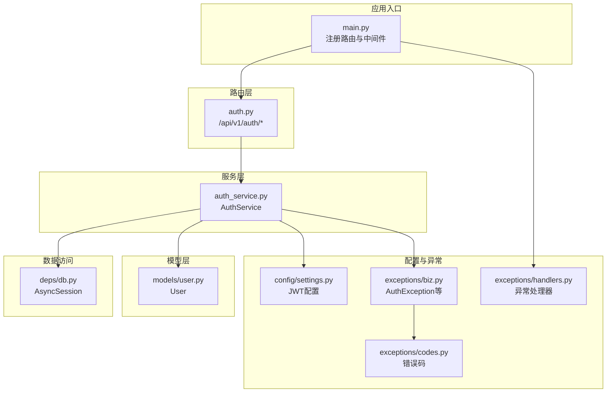
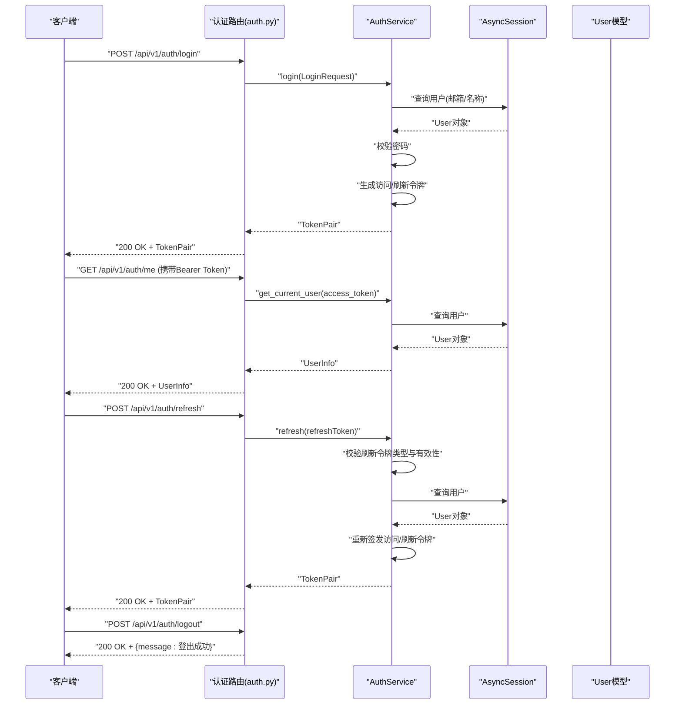
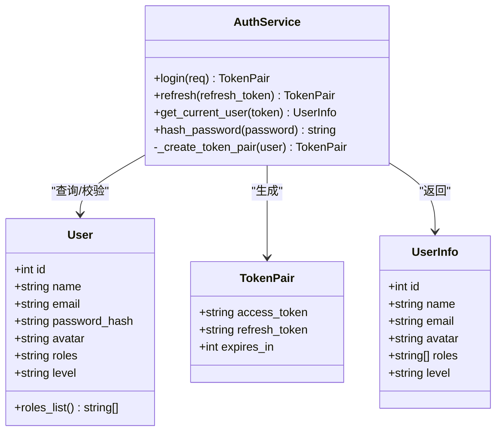
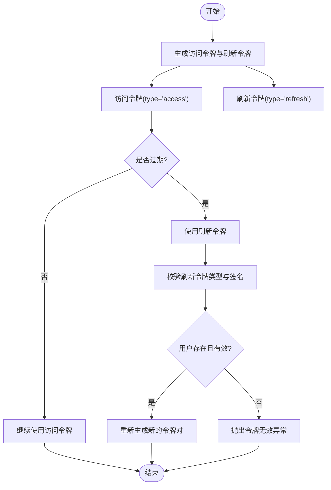
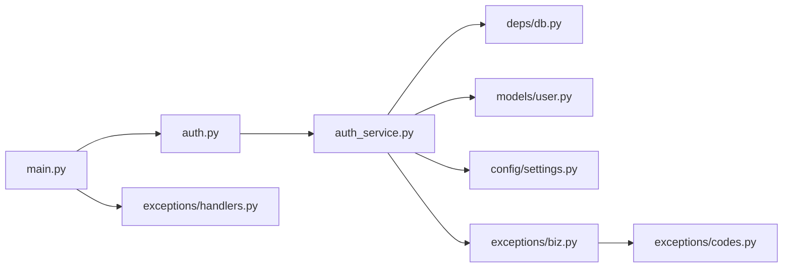

# 认证API

<cite>
**本文引用的文件**
- [workspace/api/app/routers/auth.py](file://workspace/api/app/routers/auth.py)
- [workspace/api/app/schemas/auth.py](file://workspace/api/app/schemas/auth.py)
- [workspace/api/app/services/auth_service.py](file://workspace/api/app/services/auth_service.py)
- [workspace/api/app/middleware/tenant.py](file://workspace/api/app/middleware/tenant.py)
- [workspace/api/app/models/user.py](file://workspace/api/app/models/user.py)
- [workspace/api/app/config/settings.py](file://workspace/api/app/config/settings.py)
- [workspace/api/app/exceptions/biz.py](file://workspace/api/app/exceptions/biz.py)
- [workspace/api/app/exceptions/codes.py](file://workspace/api/app/exceptions/codes.py)
- [workspace/api/app/exceptions/handlers.py](file://workspace/api/app/exceptions/handlers.py)
- [workspace/api/app/main.py](file://workspace/api/app/main.py)
- [workspace/api/app/deps/db.py](file://workspace/api/app/deps/db.py)
- [workspace/api/tests/services/test_auth_service.py](file://workspace/api/tests/services/test_auth_service.py)
- [workspace/api/tests/conftest.py](file://workspace/api/tests/conftest.py)
</cite>

## 目录
1. [简介](#简介)
2. [项目结构](#项目结构)
3. [核心组件](#核心组件)
4. [架构总览](#架构总览)
5. [详细组件分析](#详细组件分析)
6. [依赖关系分析](#依赖关系分析)
7. [性能考量](#性能考量)
8. [故障排查指南](#故障排查指南)
9. [结论](#结论)
10. [附录](#附录)

## 简介
本文件为 FDE 工作台认证子系统的 API 文档，覆盖登录、令牌刷新、登出、获取当前用户等认证相关接口；详细说明 JWT 令牌生成、刷新机制与有效期管理；给出请求参数、响应格式、错误码与状态码；并解释认证中间件与多租户上下文绑定的工作原理。同时提供安全建议、会话管理与令牌验证最佳实践。

## 项目结构
认证相关代码主要分布在以下模块：
- 路由层：定义 /api/v1/auth/* 的端点
- 模型层：用户模型与软删除、角色解析
- 服务层：认证业务逻辑（登录、刷新、获取当前用户）
- 数据访问：异步数据库依赖
- 配置：JWT 密钥、算法、过期时间等
- 异常与错误码：统一业务异常与 HTTP 映射
- 中间件：多租户上下文绑定

图表来源
- [workspace/api/app/main.py:57-67](file://workspace/api/app/main.py#L57-L67)
- [workspace/api/app/routers/auth.py:1-43](file://workspace/api/app/routers/auth.py#L1-L43)
- [workspace/api/app/services/auth_service.py:1-110](file://workspace/api/app/services/auth_service.py#L1-L110)
- [workspace/api/app/deps/db.py:44-64](file://workspace/api/app/deps/db.py#L44-L64)
- [workspace/api/app/models/user.py:8-22](file://workspace/api/app/models/user.py#L8-L22)
- [workspace/api/app/config/settings.py:40-44](file://workspace/api/app/config/settings.py#L40-L44)
- [workspace/api/app/exceptions/biz.py:37-56](file://workspace/api/app/exceptions/biz.py#L37-L56)
- [workspace/api/app/exceptions/codes.py:23-30](file://workspace/api/app/exceptions/codes.py#L23-L30)
- [workspace/api/app/exceptions/handlers.py:31-99](file://workspace/api/app/exceptions/handlers.py#L31-L99)

章节来源
- [workspace/api/app/main.py:57-67](file://workspace/api/app/main.py#L57-L67)
- [workspace/api/app/routers/auth.py:1-43](file://workspace/api/app/routers/auth.py#L1-L43)

## 核心组件
- 路由器：定义认证相关端点，包括登录、刷新、登出、获取当前用户
- 服务：实现登录校验、令牌签发、刷新校验、当前用户解析
- 模型：用户实体，含软删除、角色列表解析
- 配置：JWT 密钥、算法、过期分钟数
- 异常：认证失败、令牌无效、令牌过期等业务异常
- 异常处理器：将业务异常映射为统一 JSON 响应与 HTTP 状态码
- 多租户中间件：从请求头提取租户 ID 并绑定到日志上下文

章节来源
- [workspace/api/app/routers/auth.py:19-42](file://workspace/api/app/routers/auth.py#L19-L42)
- [workspace/api/app/services/auth_service.py:22-105](file://workspace/api/app/services/auth_service.py#L22-L105)
- [workspace/api/app/models/user.py:19-22](file://workspace/api/app/models/user.py#L19-L22)
- [workspace/api/app/config/settings.py:40-44](file://workspace/api/app/config/settings.py#L40-L44)
- [workspace/api/app/exceptions/biz.py:37-56](file://workspace/api/app/exceptions/biz.py#L37-L56)
- [workspace/api/app/exceptions/handlers.py:31-99](file://workspace/api/app/exceptions/handlers.py#L31-L99)
- [workspace/api/app/middleware/tenant.py:11-23](file://workspace/api/app/middleware/tenant.py#L11-L23)

## 架构总览
认证端到端流程如下：
- 客户端调用登录接口，服务端根据用户名或邮箱查找用户并校验密码
- 成功则签发访问令牌与刷新令牌，并返回给客户端
- 客户端使用访问令牌访问受保护资源；访问令牌过期时使用刷新令牌换取新令牌
- 获取当前用户时，服务端解码访问令牌，查询用户并返回用户信息
- 登出接口目前返回固定成功消息（可扩展为撤销令牌）

图表来源
- [workspace/api/app/routers/auth.py:19-42](file://workspace/api/app/routers/auth.py#L19-L42)
- [workspace/api/app/services/auth_service.py:22-105](file://workspace/api/app/services/auth_service.py#L22-L105)
- [workspace/api/app/deps/db.py:44-64](file://workspace/api/app/deps/db.py#L44-L64)
- [workspace/api/app/models/user.py:8-22](file://workspace/api/app/models/user.py#L8-L22)

## 详细组件分析

### 认证路由与端点
- 登录
  - 方法与路径：POST /api/v1/auth/login
  - 请求体：LoginRequest（用户名或邮箱必填其一，密码必填）
  - 响应体：TokenPair（包含 accessToken、refreshToken、expiresIn）
- 刷新
  - 方法与路径：POST /api/v1/auth/refresh
  - 请求体：RefreshRequest（refreshToken 字段）
  - 响应体：TokenPair
- 登出
  - 方法与路径：POST /api/v1/auth/logout
  - 响应体：固定消息
- 获取当前用户
  - 方法与路径：GET /api/v1/auth/me
  - 请求头：Authorization: Bearer <access_token>
  - 响应体：UserInfo

章节来源
- [workspace/api/app/routers/auth.py:19-42](file://workspace/api/app/routers/auth.py#L19-L42)
- [workspace/api/app/schemas/auth.py:7-31](file://workspace/api/app/schemas/auth.py#L7-L31)

### 服务层：AuthService
- 登录流程
  - 解析登录标识（用户名或邮箱），若均为空则抛出认证异常
  - 查询用户并校验密码哈希
  - 生成访问令牌与刷新令牌，设置过期时间
- 刷新流程
  - 校验刷新令牌类型是否为 refresh
  - 解析用户 ID 并查询用户是否存在且未软删除
  - 重新签发新的令牌对
- 当前用户流程
  - 校验访问令牌类型是否为 access
  - 解析用户 ID 并查询用户，返回用户信息
- 密码哈希
  - 使用 bcrypt 进行哈希存储

图表来源
- [workspace/api/app/services/auth_service.py:18-105](file://workspace/api/app/services/auth_service.py#L18-L105)
- [workspace/api/app/models/user.py:8-22](file://workspace/api/app/models/user.py#L8-L22)
- [workspace/api/app/schemas/auth.py:17-31](file://workspace/api/app/schemas/auth.py#L17-L31)

章节来源
- [workspace/api/app/services/auth_service.py:22-105](file://workspace/api/app/services/auth_service.py#L22-L105)
- [workspace/api/app/models/user.py:19-22](file://workspace/api/app/models/user.py#L19-L22)

### 数据模型：User
- 关键字段：id、name、email、password_hash、avatar、roles、level
- 角色解析：roles 为逗号分隔字符串，提供 roles_list 属性用于解析为列表

章节来源
- [workspace/api/app/models/user.py:8-22](file://workspace/api/app/models/user.py#L8-L22)

### 配置：JWT 与应用设置
- JWT 参数
  - jwt_secret_key：必须至少 16 位，否则启动时报错
  - jwt_algorithm：默认 HS256
  - jwt_expire_minutes：访问令牌过期分钟数
- 应用其他关键配置：数据库连接、Redis、Elasticsearch、Milvus、AI Orchestrator、Celery、日志级别与格式等

章节来源
- [workspace/api/app/config/settings.py:40-44](file://workspace/api/app/config/settings.py#L40-L44)
- [workspace/api/app/config/settings.py:63-72](file://workspace/api/app/config/settings.py#L63-L72)

### 异常与错误码
- 业务异常基类 BizException，支持将 code 映射为 HTTP 状态码
- 认证相关异常
  - AuthException：认证失败
  - TokenExpiredException：令牌过期
  - TokenInvalidException：令牌无效
- 错误码范围
  - 认证/权限：2000-2999
  - 典型码：BIZ_AUTH_FAILED、BIZ_TOKEN_EXPIRED、BIZ_TOKEN_INVALID、BIZ_PERMISSION_DENIED 等

章节来源
- [workspace/api/app/exceptions/biz.py:37-62](file://workspace/api/app/exceptions/biz.py#L37-L62)
- [workspace/api/app/exceptions/codes.py:23-30](file://workspace/api/app/exceptions/codes.py#L23-L30)

### 异常处理器
- 将 BizException、SystemException、StarletteHTTPException、RequestValidationError 统一转换为 JSON 响应
- 响应结构包含 code、message、data、traceId、details（可选）
- BizException 的 HTTP 状态码依据 code 自动映射

章节来源
- [workspace/api/app/exceptions/handlers.py:31-99](file://workspace/api/app/exceptions/handlers.py#L31-L99)

### 多租户中间件
- 从请求头 X-Tenant-ID 提取租户 ID，默认值为 default
- 绑定到 structlog 上下文，便于日志追踪

章节来源
- [workspace/api/app/middleware/tenant.py:11-23](file://workspace/api/app/middleware/tenant.py#L11-L23)

### 数据库依赖
- 异步 SQLAlchemy 引擎与会话工厂缓存
- 支持 mysql+aiomysql 与 sqlite+aiosqlite
- 会话在提交或回滚后释放

章节来源
- [workspace/api/app/deps/db.py:12-64](file://workspace/api/app/deps/db.py#L12-L64)

### API 定义与示例

- 登录
  - 请求
    - 方法：POST
    - 路径：/api/v1/auth/login
    - 请求体：LoginRequest
      - username 或 email 必填其一
      - password 必填
    - 示例请求体（仅展示字段名与含义）：
      - {"username": "string 或 null", "email": "string 或 null", "password": "string"}
  - 响应
    - 200 OK
    - 响应体：TokenPair
      - {"accessToken": "string", "refreshToken": "string", "expiresIn": integer（秒）}

- 刷新
  - 请求
    - 方法：POST
    - 路径：/api/v1/auth/refresh
    - 请求体：{"refreshToken": "string"}
  - 响应
    - 200 OK
    - 响应体：TokenPair

- 登出
  - 请求
    - 方法：POST
    - 路径：/api/v1/auth/logout
  - 响应
    - 200 OK
    - 响应体：{"message": "登出成功"}

- 获取当前用户
  - 请求
    - 方法：GET
    - 路径：/api/v1/auth/me
    - 请求头：Authorization: Bearer <access_token>
  - 响应
    - 200 OK
    - 响应体：UserInfo
      - {"id": integer, "name": "string", "email": "string", "avatar": "string 或 null", "roles": ["string"], "level": "string"}

- 错误响应
  - 统一结构：{"code": integer, "message": "string", "data": null 或 object, "traceId": "string", "details": any（可选）"}
  - 典型错误码
    - 认证失败：2001
    - 令牌无效：2003
    - 令牌过期：2002
    - 权限不足：2004

章节来源
- [workspace/api/app/routers/auth.py:19-42](file://workspace/api/app/routers/auth.py#L19-L42)
- [workspace/api/app/schemas/auth.py:7-31](file://workspace/api/app/schemas/auth.py#L7-L31)
- [workspace/api/app/exceptions/biz.py:37-62](file://workspace/api/app/exceptions/biz.py#L37-L62)
- [workspace/api/app/exceptions/codes.py:23-30](file://workspace/api/app/exceptions/codes.py#L23-L30)
- [workspace/api/app/exceptions/handlers.py:21-28](file://workspace/api/app/exceptions/handlers.py#L21-L28)

### JWT 令牌生成、刷新机制与有效期
- 令牌类型
  - 访问令牌（access）：用于访问受保护资源
  - 刷新令牌（refresh）：用于换取新的访问令牌
- 有效期
  - 访问令牌：由配置 jwt_expire_minutes 决定（单位分钟）
  - 刷新令牌：固定 7 天
- 生成策略
  - 登录成功后生成新的访问令牌与刷新令牌对
  - 刷新接口仅接受类型为 refresh 的令牌
- 令牌验证
  - 访问令牌：type=access，解码后读取 sub（用户ID）并查询用户
  - 刷新令牌：type=refresh，解码后读取 sub 并查询用户

图表来源
- [workspace/api/app/services/auth_service.py:81-105](file://workspace/api/app/services/auth_service.py#L81-L105)
- [workspace/api/app/services/auth_service.py:41-54](file://workspace/api/app/services/auth_service.py#L41-L54)
- [workspace/api/app/services/auth_service.py:56-76](file://workspace/api/app/services/auth_service.py#L56-L76)

章节来源
- [workspace/api/app/services/auth_service.py:81-105](file://workspace/api/app/services/auth_service.py#L81-L105)
- [workspace/api/app/config/settings.py:42-44](file://workspace/api/app/config/settings.py#L42-L44)

### 认证中间件与多租户机制
- 认证中间件
  - 通过 Authorization 头中的 Bearer 令牌进行访问令牌解析
  - 服务内部直接从头中提取令牌并调用 get_current_user
- 多租户中间件
  - 从请求头 X-Tenant-ID 提取租户 ID
  - 绑定到 structlog 上下文，便于日志追踪

章节来源
- [workspace/api/app/routers/auth.py:37-42](file://workspace/api/app/routers/auth.py#L37-L42)
- [workspace/api/app/middleware/tenant.py:14-23](file://workspace/api/app/middleware/tenant.py#L14-L23)

### 安全考虑、会话管理与令牌验证最佳实践
- 传输安全
  - 使用 HTTPS 传输，避免明文泄露
- 令牌安全
  - 刷新令牌仅在服务端保存，不下发至前端
  - 建议在登出时撤销刷新令牌（当前实现为占位）
- 存储安全
  - 密码使用 bcrypt 哈希存储
- 令牌验证
  - 严格区分 access 与 refresh 类型
  - 对 access 令牌过期时间进行合理设置
- 日志与审计
  - 多租户中间件将租户 ID 绑定到日志上下文
  - 异常处理器统一输出 traceId，便于问题定位

章节来源
- [workspace/api/app/services/auth_service.py:78-79](file://workspace/api/app/services/auth_service.py#L78-L79)
- [workspace/api/app/middleware/tenant.py:14-23](file://workspace/api/app/middleware/tenant.py#L14-L23)
- [workspace/api/app/exceptions/handlers.py:17-28](file://workspace/api/app/exceptions/handlers.py#L17-L28)

## 依赖关系分析
- 路由依赖服务层，服务层依赖数据库会话与配置
- 异常处理器统一处理业务异常，映射为标准 JSON 响应
- 应用入口注册路由与中间件，形成完整的认证链路

图表来源
- [workspace/api/app/routers/auth.py:1-43](file://workspace/api/app/routers/auth.py#L1-L43)
- [workspace/api/app/services/auth_service.py:1-110](file://workspace/api/app/services/auth_service.py#L1-L110)
- [workspace/api/app/deps/db.py:44-64](file://workspace/api/app/deps/db.py#L44-L64)
- [workspace/api/app/models/user.py:8-22](file://workspace/api/app/models/user.py#L8-L22)
- [workspace/api/app/config/settings.py:40-44](file://workspace/api/app/config/settings.py#L40-L44)
- [workspace/api/app/exceptions/biz.py:37-62](file://workspace/api/app/exceptions/biz.py#L37-L62)
- [workspace/api/app/exceptions/codes.py:23-30](file://workspace/api/app/exceptions/codes.py#L23-L30)
- [workspace/api/app/exceptions/handlers.py:31-99](file://workspace/api/app/exceptions/handlers.py#L31-L99)
- [workspace/api/app/main.py:57-67](file://workspace/api/app/main.py#L57-L67)

章节来源
- [workspace/api/app/main.py:57-67](file://workspace/api/app/main.py#L57-L67)
- [workspace/api/app/routers/auth.py:1-43](file://workspace/api/app/routers/auth.py#L1-L43)
- [workspace/api/app/services/auth_service.py:1-110](file://workspace/api/app/services/auth_service.py#L1-L110)

## 性能考量
- 异步数据库访问：使用 SQLAlchemy 异步引擎与会话，减少阻塞
- 缓存配置：数据库引擎与会话工厂采用 LRU 缓存，降低重复初始化开销
- 令牌生成：JWT 无状态，避免额外存储；但需注意密钥长度与算法选择
- 日志与追踪：中间件与异常处理器统一输出 traceId，便于性能与问题定位

章节来源
- [workspace/api/app/deps/db.py:12-41](file://workspace/api/app/deps/db.py#L12-L41)
- [workspace/api/app/config/settings.py:63-72](file://workspace/api/app/config/settings.py#L63-L72)
- [workspace/api/app/exceptions/handlers.py:17-28](file://workspace/api/app/exceptions/handlers.py#L17-L28)

## 故障排查指南
- 启动报错：JWT_SECRET_KEY 长度不足
  - 现象：启动时报错提示密钥长度至少 16 位
  - 处理：设置环境变量或 .env 文件中的 JWT_SECRET_KEY 至少 16 位
- 认证失败
  - 现象：登录返回认证失败
  - 排查：检查用户名/邮箱与密码是否正确；确认用户未被软删除
- 令牌无效/过期
  - 现象：访问受保护资源返回令牌无效或过期
  - 排查：确认使用的是 access 令牌；如已过期，使用 refresh 令牌换取新令牌
- 异常统一响应
  - 现象：错误响应包含 code、message、traceId
  - 处理：根据 code 与 traceId 定位问题；必要时查看服务端日志

章节来源
- [workspace/api/app/config/settings.py:63-72](file://workspace/api/app/config/settings.py#L63-L72)
- [workspace/api/app/exceptions/biz.py:37-62](file://workspace/api/app/exceptions/biz.py#L37-L62)
- [workspace/api/app/exceptions/handlers.py:34-99](file://workspace/api/app/exceptions/handlers.py#L34-L99)

## 结论
本认证子系统基于 FastAPI 与 SQLAlchemy 异步 ORM 实现，采用 JWT 双令牌模型（访问令牌与刷新令牌），提供登录、刷新、登出、获取当前用户等核心能力。配合统一异常处理与多租户上下文绑定，具备良好的安全性与可观测性。建议后续完善登出撤销令牌、密码重置等功能，并持续优化令牌与会话策略。

## 附录
- 测试参考
  - 登录、注册、刷新等服务层测试用例可作为行为参考
  - 测试夹具提供了模拟数据库会话与用户对象

章节来源
- [workspace/api/tests/services/test_auth_service.py:10-129](file://workspace/api/tests/services/test_auth_service.py#L10-L129)
- [workspace/api/tests/conftest.py:8-19](file://workspace/api/tests/conftest.py#L8-L19)
- [workspace/api/tests/conftest.py:23-31](file://workspace/api/tests/conftest.py#L23-L31)