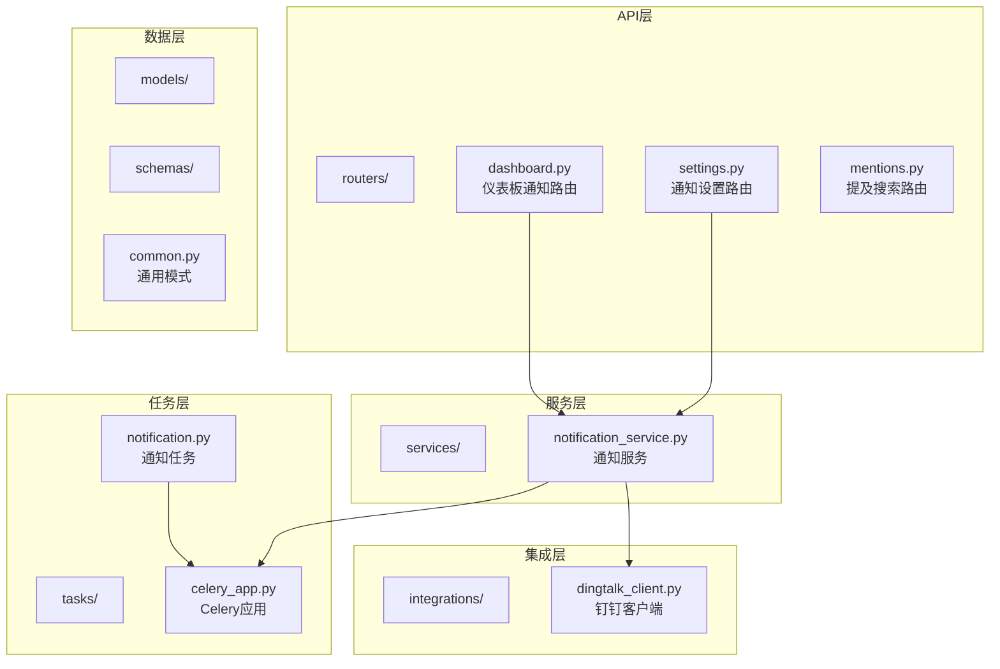
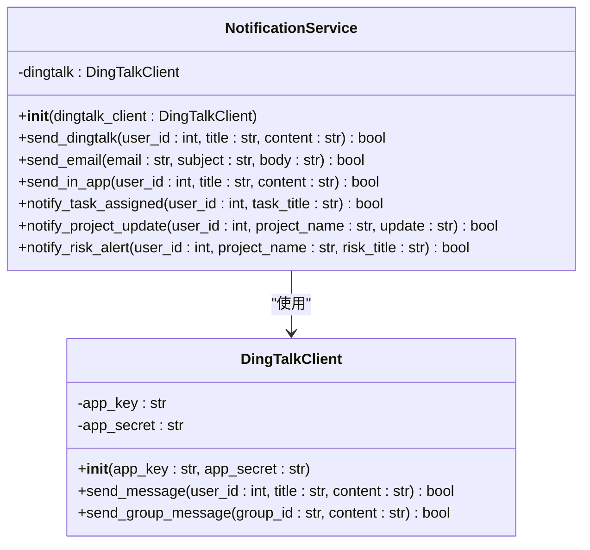
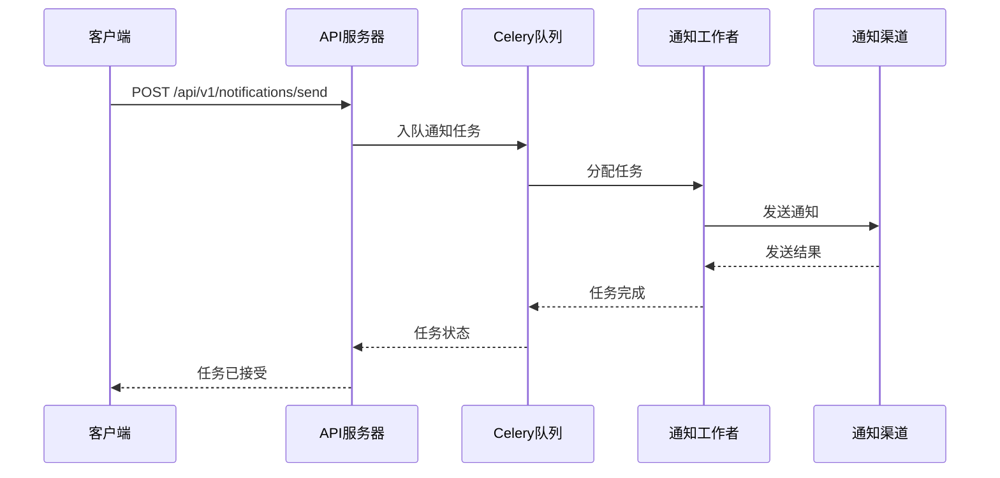
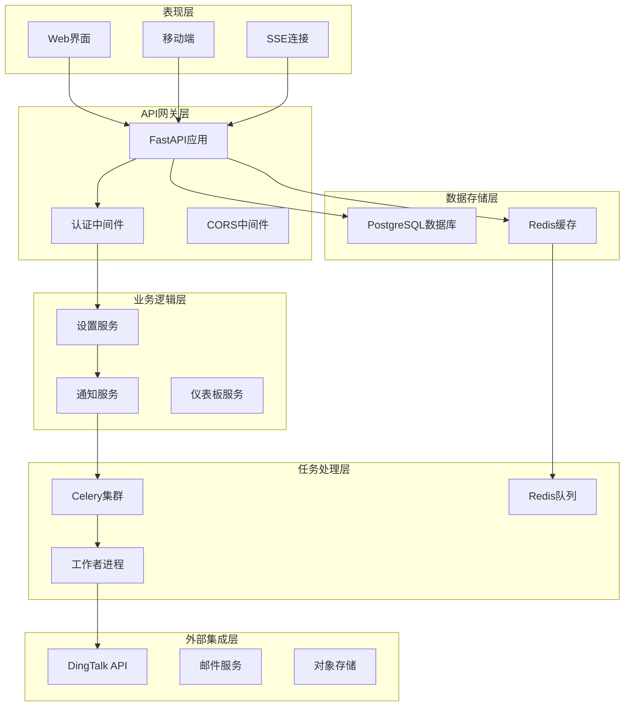
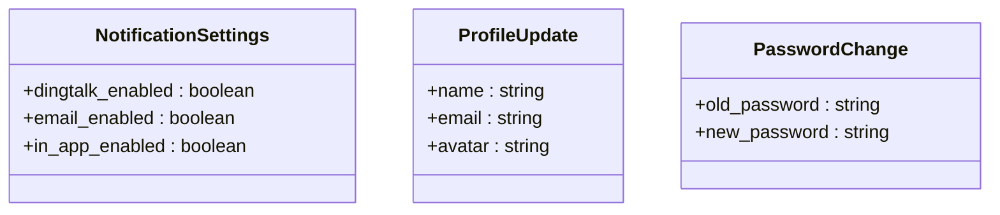
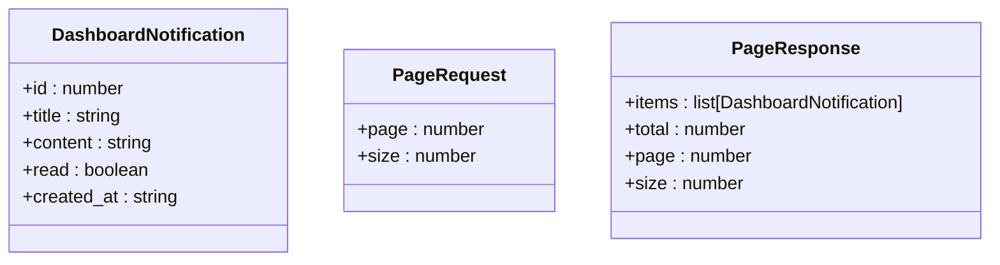
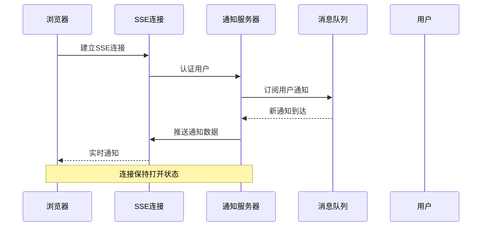
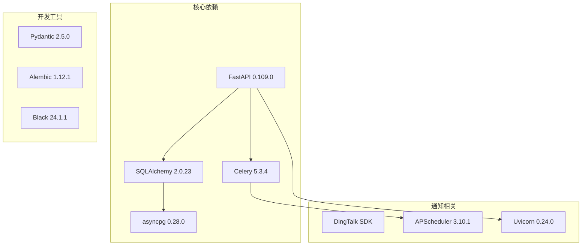
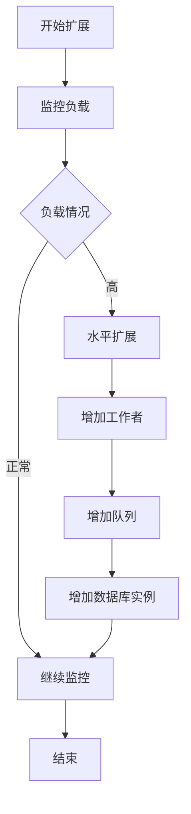

# 通知API

<cite>
**本文档引用的文件**
- [notification_service.py](file://workspace/api/app/services/notification_service.py)
- [notification.py](file://workspace/api/app/tasks/notification.py)
- [settings.py](file://workspace/api/app/routers/settings.py)
- [dashboard.py](file://workspace/api/app/routers/dashboard.py)
- [mentions.py](file://workspace/api/app/routers/mentions.py)
- [dingtalk_client.py](file://workspace/api/app/integrations/dingtalk_client.py)
- [common.py](file://workspace/api/app/schemas/common.py)
- [02-后端详细设计.md](file://docs/detail-design/02-后端详细设计.md)
- [01-前端详细设计.md](file://docs/detail-design/01-前端详细设计.md)
</cite>

## 目录
1. [简介](#简介)
2. [项目结构](#项目结构)
3. [核心组件](#核心组件)
4. [架构概览](#架构概览)
5. [详细组件分析](#详细组件分析)
6. [依赖关系分析](#依赖关系分析)
7. [性能考虑](#性能考虑)
8. [故障排除指南](#故障排除指南)
9. [结论](#结论)
10. [附录](#附录)

## 简介

FDE工作台通知系统API提供了完整的通知管理功能，包括实时通知、邮件通知、站内信等多种通知渠道。该系统基于FastAPI构建，采用异步处理机制，支持消息推送、提醒设置、通知管理等核心功能。

通知系统主要包含以下特性：
- 多渠道通知支持：钉钉、邮件、站内信
- 异步任务处理：基于Celery的消息队列
- 实时通知：通过Server-Sent Events (SSE) 实现实时推送
- 个性化设置：用户通知偏好配置
- 批量操作：支持批量通知发送和管理

## 项目结构

通知系统在项目中的组织结构如下：



**图表来源**
- [settings.py:1-81](file://workspace/api/app/routers/settings.py#L1-L81)
- [notification_service.py:1-43](file://workspace/api/app/services/notification_service.py#L1-L43)
- [notification.py:1-17](file://workspace/api/app/tasks/notification.py#L1-L17)
- [dingtalk_client.py:1-23](file://workspace/api/app/integrations/dingtalk_client.py#L1-L23)

**章节来源**
- [settings.py:1-81](file://workspace/api/app/routers/settings.py#L1-L81)
- [notification_service.py:1-43](file://workspace/api/app/services/notification_service.py#L1-L43)
- [notification.py:1-17](file://workspace/api/app/tasks/notification.py#L1-L17)

## 核心组件

### 通知服务 (NotificationService)

通知服务是通知系统的核心组件，负责协调各种通知渠道的发送和管理。



**图表来源**
- [notification_service.py:11-43](file://workspace/api/app/services/notification_service.py#L11-L43)
- [dingtalk_client.py:9-23](file://workspace/api/app/integrations/dingtalk_client.py#L9-L23)

### 通知任务 (NotificationTask)

通知任务基于Celery实现异步通知处理，确保系统性能和可靠性。



**图表来源**
- [notification.py:7-16](file://workspace/api/app/tasks/notification.py#L7-L16)

**章节来源**
- [notification_service.py:11-43](file://workspace/api/app/services/notification_service.py#L11-L43)
- [notification.py:7-16](file://workspace/api/app/tasks/notification.py#L7-L16)

## 架构概览

通知系统采用分层架构设计，确保各组件职责清晰、耦合度低：



**图表来源**
- [notification_service.py:1-43](file://workspace/api/app/services/notification_service.py#L1-L43)
- [settings.py:1-81](file://workspace/api/app/routers/settings.py#L1-L81)

## 详细组件分析

### 通知设置API

通知设置API允许用户配置个人通知偏好，支持多种通知渠道的启用/禁用。

#### 端点定义

| 方法 | 路径 | 描述 | 请求体 | 响应体 |
|------|------|------|--------|--------|
| GET | `/api/v1/settings/notifications` | 获取用户通知设置 | - | `NotificationSettings` |
| PUT | `/api/v1/settings/notifications` | 更新用户通知设置 | `NotificationSettings` | `{ updated: boolean, userId: number }` |

#### 数据模型



**图表来源**
- [settings.py:23-26](file://workspace/api/app/routers/settings.py#L23-L26)

#### 请求示例

**获取通知设置**
```bash
GET /api/v1/settings/notifications
Authorization: Bearer {token}
```

**更新通知设置**
```bash
PUT /api/v1/settings/notifications
Authorization: Bearer {token}
Content-Type: application/json

{
  "dingtalk_enabled": true,
  "email_enabled": false,
  "in_app_enabled": true
}
```

**章节来源**
- [settings.py:54-65](file://workspace/api/app/routers/settings.py#L54-L65)

### 仪表板通知API

仪表板通知API提供工作台概览中的通知展示功能。

#### 端点定义

| 方法 | 路径 | 描述 | 参数 | 响应体 |
|------|------|------|------|--------|
| GET | `/api/v1/dashboard/notifications` | 获取用户通知列表 | `page: number, size: number` | `PageResponse<Notification>` |

#### 数据模型



**图表来源**
- [dashboard.py:72-74](file://workspace/api/app/routers/dashboard.py#L72-L74)
- [common.py:20-30](file://workspace/api/app/schemas/common.py#L20-L30)

#### 请求示例

**获取通知列表**
```bash
GET /api/v1/dashboard/notifications?page=1&size=10
Authorization: Bearer {token}
```

**章节来源**
- [dashboard.py:72-74](file://workspace/api/app/routers/dashboard.py#L72-L74)

### 实时通知API

实时通知通过Server-Sent Events (SSE) 实现，提供即时的通知推送体验。

#### SSE连接流程



**图表来源**
- [01-前端详细设计.md:877-914](file://docs/detail-design/01-前端详细设计.md#L877-L914)

#### SSE数据格式

实时通知的数据格式遵循JSON标准，包含通知的基本信息和元数据。

**章节来源**
- [01-前端详细设计.md:877-914](file://docs/detail-design/01-前端详细设计.md#L877-L914)

### 提及搜索API

提及搜索API支持在通知中提及其他用户的功能。

#### 端点定义

| 方法 | 路径 | 描述 | 参数 | 响应体 |
|------|------|------|------|--------|
| GET | `/api/v1/mentions/search` | 搜索提及用户 | `query: string, type: MentionType, limit: number` | `MentionSearchResult` |

#### 请求示例

**搜索提及用户**
```bash
GET /api/v1/mentions/search?q=张三&type=user&limit=10
Authorization: Bearer {token}
```

**章节来源**
- [mentions.py:17-19](file://workspace/api/app/routers/mentions.py#L17-L19)

## 依赖关系分析

通知系统的关键依赖关系如下：



**图表来源**
- [notification_service.py:6](file://workspace/api/app/services/notification_service.py#L6)
- [notification.py:4](file://workspace/api/app/tasks/notification.py#L4)

### 组件耦合度分析

通知系统的组件设计遵循高内聚、低耦合的原则：

- **通知服务**与**钉钉客户端**通过接口解耦
- **API路由**与**业务逻辑**分离
- **同步处理**与**异步任务**分离
- **数据访问**与**业务逻辑**分离

**章节来源**
- [notification_service.py:11-13](file://workspace/api/app/services/notification_service.py#L11-L13)

## 性能考虑

### 异步处理优化

通知系统采用异步架构确保高性能处理：

1. **非阻塞I/O**：所有数据库操作和外部API调用都使用异步方式
2. **连接池管理**：数据库连接和HTTP连接使用连接池复用
3. **任务队列**：耗时的通知发送通过Celery异步处理
4. **缓存策略**：常用配置和用户信息使用Redis缓存

### 扩展性设计



## 故障排除指南

### 常见问题诊断

#### 通知发送失败

**症状**：通知无法发送到指定渠道

**排查步骤**：
1. 检查外部服务连接状态
2. 验证认证凭据有效性
3. 查看任务队列状态
4. 检查日志错误信息

#### SSE连接中断

**症状**：实时通知连接频繁断开

**排查步骤**：
1. 检查网络连接稳定性
2. 验证WebSocket代理配置
3. 查看服务器资源使用情况
4. 检查浏览器控制台错误

#### 性能问题

**症状**：通知延迟或处理缓慢

**排查步骤**：
1. 监控数据库查询性能
2. 检查Celery工作者状态
3. 分析内存使用情况
4. 优化索引和查询语句

**章节来源**
- [notification_service.py:15-23](file://workspace/api/app/services/notification_service.py#L15-L23)

## 结论

FDE工作台通知系统API提供了一个完整、可扩展的通知解决方案。系统采用现代化的技术栈和架构设计，支持多种通知渠道和实时推送功能。

主要优势包括：
- **多渠道支持**：钉钉、邮件、站内信等通知渠道
- **异步处理**：基于Celery的任务队列确保系统性能
- **实时推送**：通过SSE实现即时通知体验
- **个性化配置**：灵活的用户通知偏好设置
- **可扩展架构**：模块化设计便于功能扩展

未来可以考虑的改进方向：
- 增加更多通知渠道支持
- 优化通知模板系统
- 增强通知统计和分析功能
- 改进通知去重和聚合机制

## 附录

### API使用最佳实践

1. **错误处理**：始终检查API响应状态码和错误信息
2. **认证安全**：使用Bearer Token进行API认证
3. **参数验证**：确保请求参数符合API规范
4. **重试机制**：对于临时性错误实现指数退避重试
5. **监控告警**：建立API使用情况和错误率监控

### 开发环境配置

通知系统需要以下环境变量：
- `DATABASE_URL`: 数据库连接字符串
- `REDIS_URL`: Redis缓存连接地址
- `DINGTALK_APP_KEY`: 钉钉应用密钥
- `DINGTALK_APP_SECRET`: 钉钉应用密钥
- `CELERY_BROKER_URL`: Celery消息代理URL