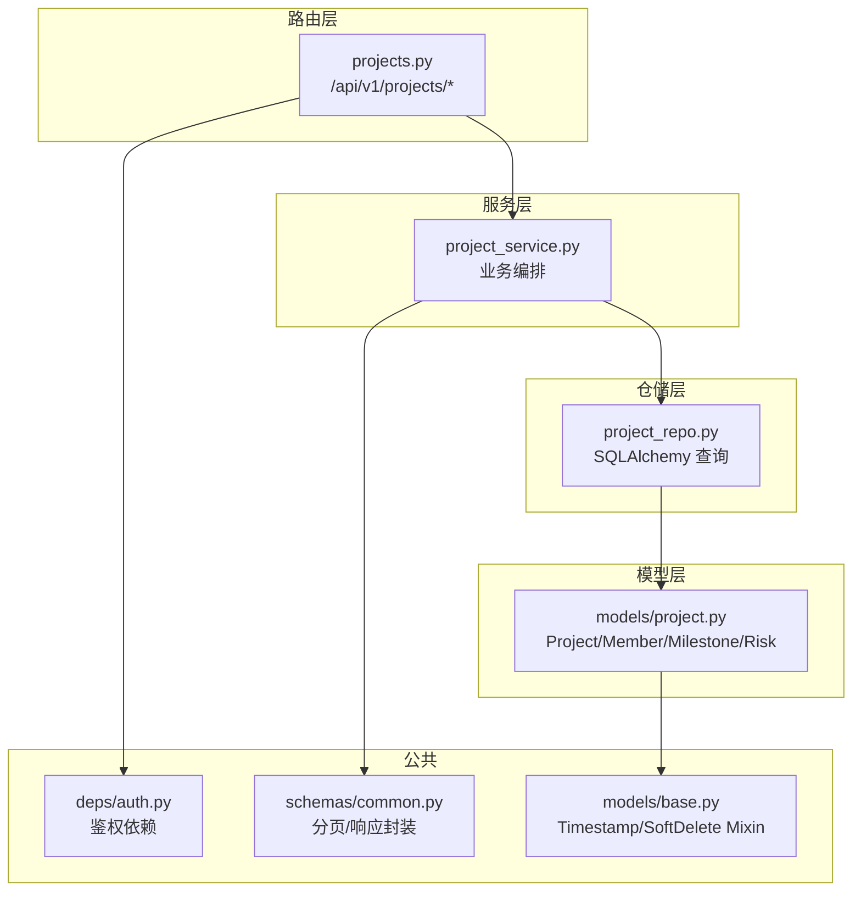
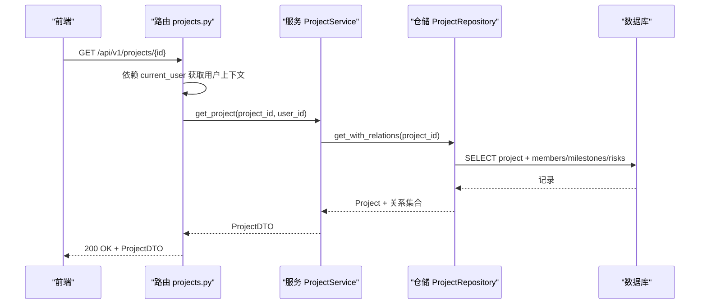
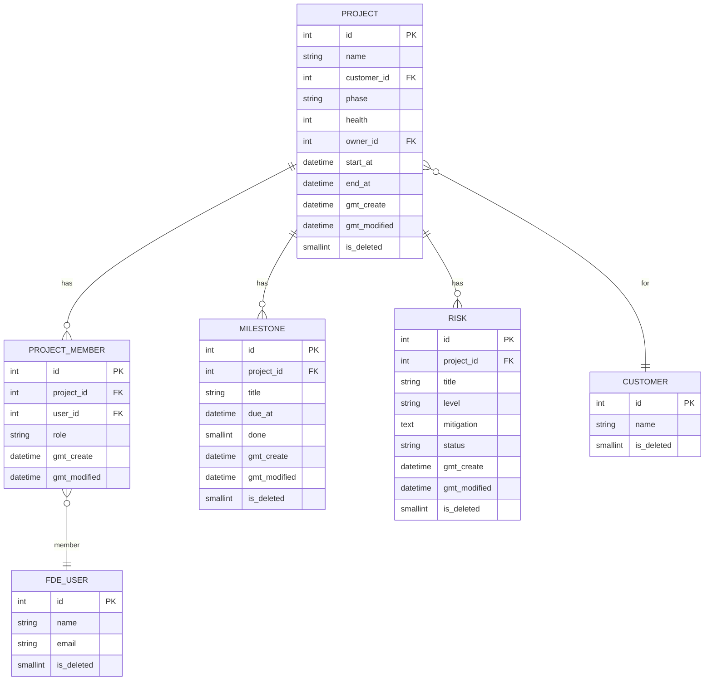
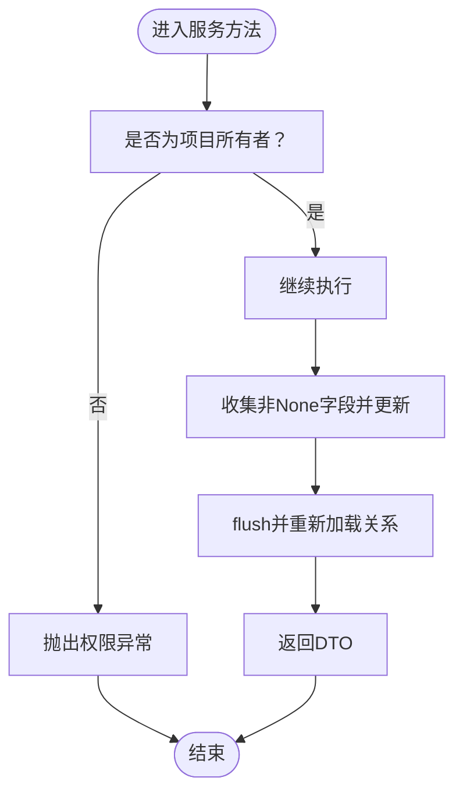
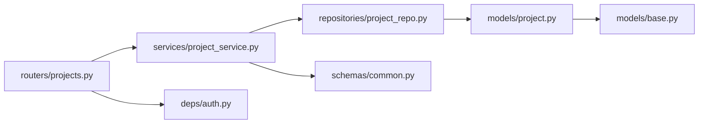

# 项目API

<cite>
**本文引用的文件**
- [workspace/api/app/routers/projects.py](file://workspace/api/app/routers/projects.py)
- [workspace/api/app/schemas/project.py](file://workspace/api/app/schemas/project.py)
- [workspace/api/app/models/project.py](file://workspace/api/app/models/project.py)
- [workspace/api/app/services/project_service.py](file://workspace/api/app/services/project_service.py)
- [workspace/api/app/repositories/project_repo.py](file://workspace/api/app/repositories/project_repo.py)
- [workspace/api/app/schemas/common.py](file://workspace/api/app/schemas/common.py)
- [workspace/api/app/models/base.py](file://workspace/api/app/models/base.py)
- [workspace/api/app/deps/auth.py](file://workspace/api/app/deps/auth.py)
- [workspace/api/app/main.py](file://workspace/api/app/main.py)
- [workspace/api/tests/services/test_project_service.py](file://workspace/api/tests/services/test_project_service.py)
- [workspace/web/src/apis/modules/projects.ts](file://workspace/web/src/apis/modules/projects.ts)
- [workspace/web/src/types/business.d.ts](file://workspace/web/src/types/business.d.ts)
- [docs/FDE工作台技术方案.md](file://docs/FDE工作台技术方案.md)
</cite>

## 目录
1. [简介](#简介)
2. [项目结构](#项目结构)
3. [核心组件](#核心组件)
4. [架构总览](#架构总览)
5. [详细组件分析](#详细组件分析)
6. [依赖分析](#依赖分析)
7. [性能考虑](#性能考虑)
8. [故障排查指南](#故障排查指南)
9. [结论](#结论)
10. [附录](#附录)

## 简介
本文件为 FDE 工作台“项目管理”API的权威文档，覆盖项目CRUD、成员管理、里程碑、风险评估、健康度计算、周报生成等能力，并给出权限控制、协作与搜索筛选的使用指南。文档同时提供请求示例路径与数据模型关系说明，帮助前后端协同开发与集成。

## 项目结构
后端采用 FastAPI + SQLAlchemy 2.0 + Pydantic v2 的分层架构，项目API位于路由层，通过服务层编排业务，仓储层访问数据库，模型层定义实体关系。

**图表来源**
- [workspace/api/app/routers/projects.py:1-82](file://workspace/api/app/routers/projects.py#L1-L82)
- [workspace/api/app/services/project_service.py:1-168](file://workspace/api/app/services/project_service.py#L1-L168)
- [workspace/api/app/repositories/project_repo.py:1-98](file://workspace/api/app/repositories/project_repo.py#L1-L98)
- [workspace/api/app/models/project.py:1-63](file://workspace/api/app/models/project.py#L1-L63)
- [workspace/api/app/schemas/common.py:1-30](file://workspace/api/app/schemas/common.py#L1-L30)
- [workspace/api/app/models/base.py:1-24](file://workspace/api/app/models/base.py#L1-L24)
- [workspace/api/app/deps/auth.py:1-81](file://workspace/api/app/deps/auth.py#L1-L81)

**章节来源**
- [workspace/api/app/main.py:58-67](file://workspace/api/app/main.py#L58-L67)
- [docs/FDE工作台技术方案.md:693-786](file://docs/FDE工作台技术方案.md#L693-L786)

## 核心组件
- 路由层：定义 /api/v1/projects 的全部端点，包括 CRUD、成员管理、健康度、风险、周报等。
- 服务层：实现权限校验、业务规则（如仅项目所有者可修改/删除）、DTO转换与聚合数据。
- 仓储层：封装 SQL 查询、分页、软删除、成员/风险/里程碑的增删改查。
- 模型层：定义 Project、ProjectMember、Milestone、Risk 及其关系。
- 鉴权依赖：JWT 解码、用户上下文注入、角色校验。
- 公共模型：分页请求/响应、统一响应封装。

**章节来源**
- [workspace/api/app/routers/projects.py:1-82](file://workspace/api/app/routers/projects.py#L1-L82)
- [workspace/api/app/services/project_service.py:1-168](file://workspace/api/app/services/project_service.py#L1-L168)
- [workspace/api/app/repositories/project_repo.py:1-98](file://workspace/api/app/repositories/project_repo.py#L1-L98)
- [workspace/api/app/models/project.py:1-63](file://workspace/api/app/models/project.py#L1-L63)
- [workspace/api/app/deps/auth.py:1-81](file://workspace/api/app/deps/auth.py#L1-L81)
- [workspace/api/app/schemas/common.py:1-30](file://workspace/api/app/schemas/common.py#L1-L30)

## 架构总览
项目API的典型调用链：前端 → 路由 → 依赖注入鉴权 → 服务层 → 仓储层 → 数据库；返回时服务层将 ORM 转为 DTO 并聚合成员/里程碑/风险。

**图表来源**
- [workspace/api/app/routers/projects.py:24-31](file://workspace/api/app/routers/projects.py#L24-L31)
- [workspace/api/app/services/project_service.py:37-45](file://workspace/api/app/services/project_service.py#L37-L45)
- [workspace/api/app/repositories/project_repo.py:38-42](file://workspace/api/app/repositories/project_repo.py#L38-L42)

## 详细组件分析

### 1) 项目CRUD端点
- 列表查询
  - 方法与路径：GET /api/v1/projects
  - 查询参数：分页（page、size）、关键词（keyword）、阶段（phase）、负责人（owner_id）
  - 权限：仅项目成员或项目所有者可见
  - 响应：分页包装的项目列表
- 单个项目详情
  - 方法与路径：GET /api/v1/projects/{project_id}
  - 权限：项目成员或项目所有者
  - 响应：包含成员、里程碑、风险的完整项目DTO
- 创建项目
  - 方法与路径：POST /api/v1/projects
  - 权限：需具备创建权限（当前路由未显式限制，服务层按业务规则处理）
  - 响应：创建后的项目DTO（自动添加创建者为 owner）
- 更新项目
  - 方法与路径：PUT /api/v1/projects/{project_id}
  - 权限：仅项目所有者
  - 响应：更新后的项目DTO
- 删除项目
  - 方法与路径：DELETE /api/v1/projects/{project_id}
  - 权限：仅项目所有者
  - 响应：删除成功标记

请求示例路径（不含代码内容）：
- [创建项目示例](file://workspace/web/src/apis/modules/projects.ts#L8)
- [更新项目示例](file://workspace/web/src/apis/modules/projects.ts#L9)
- [删除项目示例](file://workspace/web/src/apis/modules/projects.ts#L10)

**章节来源**
- [workspace/api/app/routers/projects.py:24-46](file://workspace/api/app/routers/projects.py#L24-L46)
- [workspace/api/app/services/project_service.py:23-82](file://workspace/api/app/services/project_service.py#L23-L82)
- [workspace/api/app/repositories/project_repo.py:12-36](file://workspace/api/app/repositories/project_repo.py#L12-L36)

### 2) 项目成员管理
- 获取成员列表
  - 方法与路径：GET /api/v1/projects/{project_id}/members
  - 响应：成员DTO列表（含用户ID、姓名、角色）
- 添加成员
  - 方法与路径：POST /api/v1/projects/{project_id}/members
  - 权限：仅项目所有者
  - 请求体：用户ID与角色
  - 响应：新增成员DTO
- 移除成员
  - 方法与路径：DELETE /api/v1/projects/{project_id}/members/{user_id}
  - 权限：仅项目所有者
  - 响应：移除成功标记

请求示例路径（不含代码内容）：
- [获取成员列表示例](file://workspace/web/src/apis/modules/projects.ts#L11)
- [添加成员示例](file://workspace/web/src/apis/modules/projects.ts#L12)
- [移除成员示例](file://workspace/web/src/apis/modules/projects.ts#L13)

**章节来源**
- [workspace/api/app/routers/projects.py:49-61](file://workspace/api/app/routers/projects.py#L49-L61)
- [workspace/api/app/services/project_service.py:84-100](file://workspace/api/app/services/project_service.py#L84-L100)
- [workspace/api/app/repositories/project_repo.py:63-67](file://workspace/api/app/repositories/project_repo.py#L63-L67)

### 3) 项目健康度与风险评估
- 健康度查询
  - 方法与路径：GET /api/v1/projects/{project_id}/health
  - 响应：健康度数值、风险数量、逾期里程碑数量
- 新增风险
  - 方法与路径：POST /api/v1/projects/{project_id}/risks
  - 请求体：标题、等级（低/中/高）、缓解措施（可选）
  - 响应：风险DTO
- 风险列表（服务端预留）
  - 方法与路径：GET /api/v1/projects/{project_id}/risks
  - 响应：风险DTO数组

请求示例路径（不含代码内容）：
- [健康度查询示例](file://workspace/web/src/apis/modules/projects.ts#L14)
- [新增风险示例](file://workspace/web/src/apis/modules/projects.ts#L15)
- [风险列表示例](file://workspace/web/src/apis/modules/projects.ts#L16)

**章节来源**
- [workspace/api/app/routers/projects.py:64-71](file://workspace/api/app/routers/projects.py#L64-L71)
- [workspace/api/app/services/project_service.py:106-125](file://workspace/api/app/services/project_service.py#L106-L125)
- [workspace/api/app/repositories/project_repo.py:75-79](file://workspace/api/app/repositories/project_repo.py#L75-L79)

### 4) 里程碑与周报
- 里程碑（服务端预留）
  - 新增里程碑：POST /api/v1/projects/{project_id}/milestones
  - 列表：GET /api/v1/projects/{project_id}/milestones
- 周报
  - 获取周报：GET /api/v1/projects/{project_id}/weekly-reports
  - 触发生成：POST /api/v1/projects/{project_id}/weekly-reports（异步任务）

请求示例路径（不含代码内容）：
- [周报获取示例](file://workspace/web/src/apis/modules/projects.ts#L17)
- [触发周报示例](file://workspace/web/src/apis/modules/projects.ts#L18)

**章节来源**
- [workspace/api/app/routers/projects.py:74-81](file://workspace/api/app/routers/projects.py#L74-L81)
- [workspace/api/app/services/project_service.py:127-132](file://workspace/api/app/services/project_service.py#L127-L132)
- [workspace/api/app/repositories/project_repo.py:69-73](file://workspace/api/app/repositories/project_repo.py#L69-L73)

### 5) 权限控制与鉴权
- 鉴权依赖：JWT Bearer，解码后查询用户是否存在且未软删除
- 用户上下文：包含用户ID、姓名、邮箱、角色列表、级别
- 项目权限：
  - 查看：项目成员或项目所有者
  - 修改/删除：仅项目所有者
  - 成员管理：仅项目所有者
- 角色校验：可通过 require_role 工厂函数在路由层使用

请求示例路径（不含代码内容）：
- [前端调用鉴权头示例](file://workspace/web/src/apis/modules/projects.ts#L1)

**章节来源**
- [workspace/api/app/deps/auth.py:28-58](file://workspace/api/app/deps/auth.py#L28-L58)
- [workspace/api/app/services/project_service.py:41-44](file://workspace/api/app/services/project_service.py#L41-L44)
- [workspace/api/app/routers/projects.py:24-31](file://workspace/api/app/routers/projects.py#L24-L31)

### 6) 搜索、筛选与分页
- 支持字段：
  - keyword：项目名称模糊匹配
  - phase：阶段过滤（init/discovery/delivery/review/closed）
  - owner_id：负责人过滤
  - 分页：page、size（最小1，最大100）
- 访问控制：viewer_id 会将结果限定为“项目成员或项目所有者”的范围

请求示例路径（不含代码内容）：
- [列表查询示例](file://workspace/web/src/apis/modules/projects.ts#L6)

**章节来源**
- [workspace/api/app/schemas/project.py:119-123](file://workspace/api/app/schemas/project.py#L119-L123)
- [workspace/api/app/repositories/project_repo.py:12-36](file://workspace/api/app/repositories/project_repo.py#L12-L36)

### 7) 数据模型与关系映射

**图表来源**
- [workspace/api/app/models/project.py:9-62](file://workspace/api/app/models/project.py#L9-L62)
- [workspace/api/app/models/base.py:10-23](file://workspace/api/app/models/base.py#L10-L23)

### 8) 业务规则与流程
- 项目创建：自动将创建者加入为 owner，并返回完整DTO
- 项目更新：仅允许所有者修改；非None字段会被更新
- 项目删除：软删除
- 健康度计算：基础健康度，若风险数大于3则扣20，每逾期一个里程碑再扣10×数量
- 成员管理：仅所有者可增删成员

**图表来源**
- [workspace/api/app/services/project_service.py:62-73](file://workspace/api/app/services/project_service.py#L62-L73)

**章节来源**
- [workspace/api/app/services/project_service.py:47-82](file://workspace/api/app/services/project_service.py#L47-L82)
- [workspace/api/app/services/project_service.py:113-125](file://workspace/api/app/services/project_service.py#L113-L125)

## 依赖分析
- 路由依赖服务层，服务层依赖仓储层，仓储层依赖模型层
- 鉴权依赖注入贯穿路由与服务层
- 公共分页模型被项目查询复用

**图表来源**
- [workspace/api/app/routers/projects.py:1-82](file://workspace/api/app/routers/projects.py#L1-L82)
- [workspace/api/app/services/project_service.py:1-168](file://workspace/api/app/services/project_service.py#L1-L168)
- [workspace/api/app/repositories/project_repo.py:1-98](file://workspace/api/app/repositories/project_repo.py#L1-L98)
- [workspace/api/app/models/project.py:1-63](file://workspace/api/app/models/project.py#L1-L63)
- [workspace/api/app/deps/auth.py:1-81](file://workspace/api/app/deps/auth.py#L1-L81)
- [workspace/api/app/schemas/common.py:1-30](file://workspace/api/app/schemas/common.py#L1-L30)
- [workspace/api/app/models/base.py:1-24](file://workspace/api/app/models/base.py#L1-L24)

**章节来源**
- [workspace/api/app/main.py:58-67](file://workspace/api/app/main.py#L58-L67)

## 性能考虑
- 分页：服务端分页避免一次性拉取大量数据
- 关系刷新：在需要聚合成员/里程碑/风险时才刷新关系，减少不必要的查询
- 缓存：可在服务层或网关层增加缓存以降低热点项目查询压力
- 异步任务：周报生成通过异步任务执行，避免阻塞请求

[本节为通用指导，不直接分析具体文件]

## 故障排查指南
- 403 权限不足：确认当前用户是否为项目所有者或成员
- 404 项目不存在：确认项目ID是否正确或已被软删除
- 401 未认证：确认请求头携带有效的JWT Bearer Token
- 参数校验失败：检查请求体字段长度、枚举值、时间格式等

**章节来源**
- [workspace/api/app/services/project_service.py:37-44](file://workspace/api/app/services/project_service.py#L37-L44)
- [workspace/api/app/services/project_service.py:75-82](file://workspace/api/app/services/project_service.py#L75-L82)
- [workspace/api/app/deps/auth.py:33-50](file://workspace/api/app/deps/auth.py#L33-L50)

## 结论
项目API提供了完整的项目生命周期管理能力，结合成员管理、健康度、风险与周报等协作功能，满足FDE工作台的项目空间需求。通过清晰的权限控制与分页查询，既保证了安全性也兼顾了性能。建议在前端按本文提供的示例路径进行集成，并在服务层扩展风险列表与里程碑端点以完善功能闭环。

[本节为总结性内容，不直接分析具体文件]

## 附录

### A. API端点一览
- 项目列表：GET /api/v1/projects
- 项目详情：GET /api/v1/projects/{id}
- 创建项目：POST /api/v1/projects
- 更新项目：PUT /api/v1/projects/{id}
- 删除项目：DELETE /api/v1/projects/{id}
- 成员列表：GET /api/v1/projects/{id}/members
- 添加成员：POST /api/v1/projects/{id}/members
- 移除成员：DELETE /api/v1/projects/{id}/members/{user_id}
- 健康度：GET /api/v1/projects/{id}/health
- 新增风险：POST /api/v1/projects/{id}/risks
- 风险列表：GET /api/v1/projects/{id}/risks（预留）
- 里程碑（预留）：POST /api/v1/projects/{id}/milestones；GET /api/v1/projects/{id}/milestones
- 周报：GET /api/v1/projects/{id}/weekly-reports；POST /api/v1/projects/{id}/weekly-reports

**章节来源**
- [workspace/api/app/routers/projects.py:24-81](file://workspace/api/app/routers/projects.py#L24-L81)
- [docs/FDE工作台技术方案.md:718-730](file://docs/FDE工作台技术方案.md#L718-L730)

### B. 请求示例路径（不含代码内容）
- [创建项目示例](file://workspace/web/src/apis/modules/projects.ts#L8)
- [更新项目示例](file://workspace/web/src/apis/modules/projects.ts#L9)
- [删除项目示例](file://workspace/web/src/apis/modules/projects.ts#L10)
- [获取成员列表示例](file://workspace/web/src/apis/modules/projects.ts#L11)
- [添加成员示例](file://workspace/web/src/apis/modules/projects.ts#L12)
- [移除成员示例](file://workspace/web/src/apis/modules/projects.ts#L13)
- [健康度查询示例](file://workspace/web/src/apis/modules/projects.ts#L14)
- [新增风险示例](file://workspace/web/src/apis/modules/projects.ts#L15)
- [风险列表示例](file://workspace/web/src/apis/modules/projects.ts#L16)
- [周报获取示例](file://workspace/web/src/apis/modules/projects.ts#L17)
- [触发周报示例](file://workspace/web/src/apis/modules/projects.ts#L18)

**章节来源**
- [workspace/web/src/apis/modules/projects.ts:1-19](file://workspace/web/src/apis/modules/projects.ts#L1-L19)

### C. 数据模型与DTO对照
- ProjectDTO 字段：id、name、customer_id、phase、health、owner_id、owner_name、start_at、end_at、members、milestones、risks、gmtCreate、gmtModified
- MemberAdd 字段：user_id、role
- RiskCreate 字段：title、level、mitigation
- ProjectQuery 字段：keyword、phase、owner_id、page、size

**章节来源**
- [workspace/api/app/schemas/project.py:100-135](file://workspace/api/app/schemas/project.py#L100-L135)
- [workspace/api/app/schemas/project.py:71-98](file://workspace/api/app/schemas/project.py#L71-L98)
- [workspace/api/app/schemas/project.py:119-123](file://workspace/api/app/schemas/project.py#L119-L123)