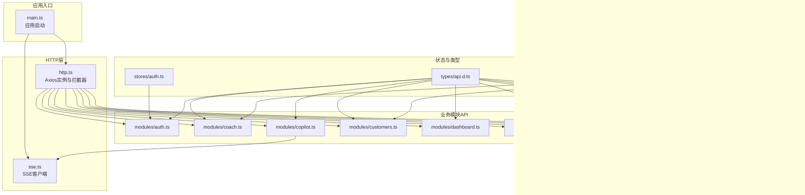
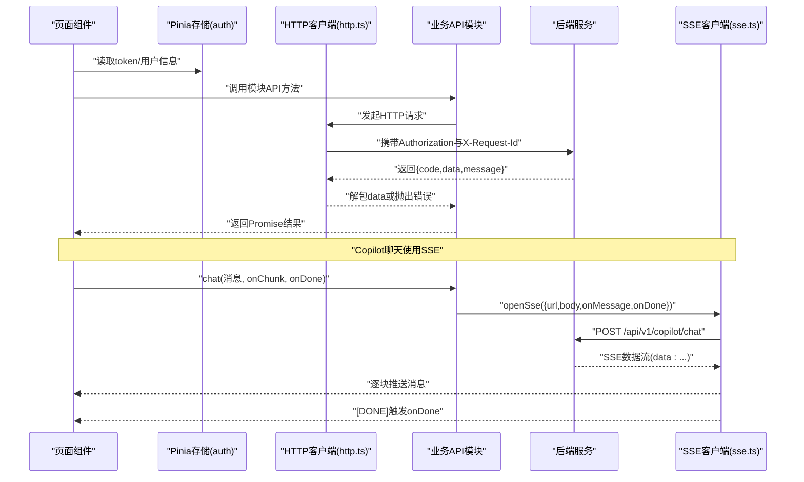
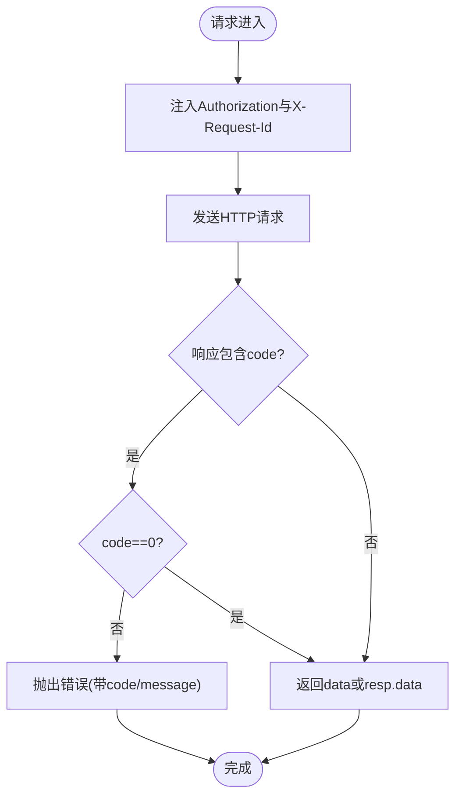
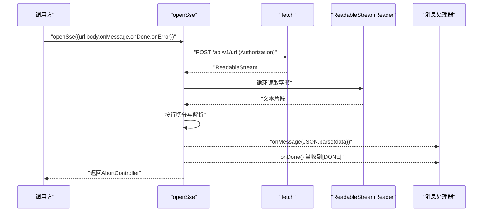
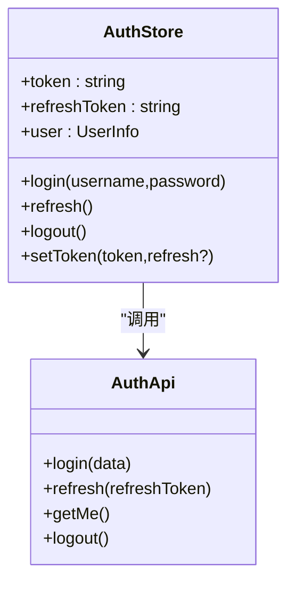
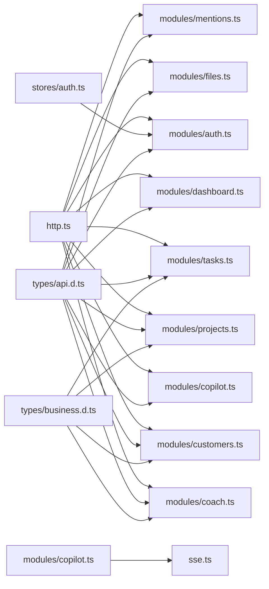

# API集成

<cite>
**本文引用的文件**
- [workspace/web/src/main.ts](file://workspace/web/src/main.ts)
- [workspace/web/src/apis/http.ts](file://workspace/web/src/apis/http.ts)
- [workspace/web/src/apis/sse.ts](file://workspace/web/src/apis/sse.ts)
- [workspace/web/src/apis/modules/auth.ts](file://workspace/web/src/apis/modules/auth.ts)
- [workspace/web/src/apis/modules/coach.ts](file://workspace/web/src/apis/modules/coach.ts)
- [workspace/web/src/apis/modules/copilot.ts](file://workspace/web/src/apis/modules/copilot.ts)
- [workspace/web/src/apis/modules/customers.ts](file://workspace/web/src/apis/modules/customers.ts)
- [workspace/web/src/apis/modules/dashboard.ts](file://workspace/web/src/apis/modules/dashboard.ts)
- [workspace/web/src/apis/modules/files.ts](file://workspace/web/src/apis/modules/files.ts)
- [workspace/web/src/apis/modules/mentions.ts](file://workspace/web/src/apis/modules/mentions.ts)
- [workspace/web/src/apis/modules/projects.ts](file://workspace/web/src/apis/modules/projects.ts)
- [workspace/web/src/apis/modules/tasks.ts](file://workspace/web/src/apis/modules/tasks.ts)
- [workspace/web/src/stores/auth.ts](file://workspace/web/src/stores/auth.ts)
- [workspace/web/src/types/api.d.ts](file://workspace/web/src/types/api.d.ts)
- [workspace/web/src/types/business.d.ts](file://workspace/web/src/types/business.d.ts)
</cite>

## 目录
1. [简介](#简介)
2. [项目结构](#项目结构)
3. [核心组件](#核心组件)
4. [架构总览](#架构总览)
5. [详细组件分析](#详细组件分析)
6. [依赖关系分析](#依赖关系分析)
7. [性能考量](#性能考量)
8. [故障排查指南](#故障排查指南)
9. [结论](#结论)
10. [附录](#附录)

## 简介
本文件面向FDE工作台前端的API集成，围绕HTTP客户端设计（基于axios）、拦截器与统一响应处理、各业务模块API（认证、教练、Copilot、客户、仪表盘、文件、提及、项目、任务）、SSE流式连接管理（含断线与取消控制）、错误处理策略、加载状态管理与缓存机制进行系统化说明，并提供最佳实践与性能优化建议。文档同时给出关键流程的时序图与类图，帮助读者快速理解与落地。

## 项目结构
前端API层采用“模块化API + 统一HTTP客户端 + SSE工具”的分层组织方式：
- 入口初始化：在应用启动时注册axios拦截器，确保全局请求具备鉴权头与请求ID。
- HTTP客户端：集中配置基础URL、超时、默认头；统一响应包装与错误处理；内置401自动刷新与队列等待。
- 模块API：按领域划分（auth/coach/copilot/customers/dashboard/files/mentions/projects/tasks），每个模块导出函数式API，返回Promise或SSE控制器。
- SSE工具：封装fetch+ReadableStream的POST型SSE客户端，支持消息解析、完成回调与异常处理。
- 类型定义：在类型文件中统一声明请求/响应、业务实体与分页模型，便于IDE提示与TS约束。

图表来源
- [workspace/web/src/main.ts:13-24](file://workspace/web/src/main.ts#L13-L24)
- [workspace/web/src/apis/http.ts:6-10](file://workspace/web/src/apis/http.ts#L6-L10)
- [workspace/web/src/apis/sse.ts:18-79](file://workspace/web/src/apis/sse.ts#L18-L79)
- [workspace/web/src/apis/modules/auth.ts:1-14](file://workspace/web/src/apis/modules/auth.ts#L1-L14)
- [workspace/web/src/apis/modules/coach.ts:1-15](file://workspace/web/src/apis/modules/coach.ts#L1-L15)
- [workspace/web/src/apis/modules/copilot.ts:1-40](file://workspace/web/src/apis/modules/copilot.ts#L1-L40)
- [workspace/web/src/apis/modules/customers.ts:1-34](file://workspace/web/src/apis/modules/customers.ts#L1-L34)
- [workspace/web/src/apis/modules/dashboard.ts:1-24](file://workspace/web/src/apis/modules/dashboard.ts#L1-L24)
- [workspace/web/src/apis/modules/files.ts:1-37](file://workspace/web/src/apis/modules/files.ts#L1-L37)
- [workspace/web/src/apis/modules/mentions.ts:1-7](file://workspace/web/src/apis/modules/mentions.ts#L1-L7)
- [workspace/web/src/apis/modules/projects.ts:1-20](file://workspace/web/src/apis/modules/projects.ts#L1-L20)
- [workspace/web/src/apis/modules/tasks.ts:1-44](file://workspace/web/src/apis/modules/tasks.ts#L1-L44)
- [workspace/web/src/stores/auth.ts:1-56](file://workspace/web/src/stores/auth.ts#L1-L56)
- [workspace/web/src/types/api.d.ts:1-183](file://workspace/web/src/types/api.d.ts#L1-L183)
- [workspace/web/src/types/business.d.ts:1-156](file://workspace/web/src/types/business.d.ts#L1-L156)

章节来源
- [workspace/web/src/main.ts:13-24](file://workspace/web/src/main.ts#L13-L24)
- [workspace/web/src/apis/http.ts:6-10](file://workspace/web/src/apis/http.ts#L6-L10)

## 核心组件
- HTTP客户端与拦截器
  - 基础配置：基础URL、超时、默认Content-Type。
  - 请求拦截：注入Authorization头与X-Request-Id。
  - 响应拦截：统一解包{code,data,message}响应；非0即错误；401自动刷新令牌并重试；兜底错误提示。
  - 并发刷新：使用isRefreshing与pendingQueue避免重复刷新与并发请求堆积。
- SSE客户端
  - 使用fetch+ReadableStream实现POST型SSE，支持Authorization头、消息解析、[DONE]结束信号、AbortController取消。
- 类型系统
  - 在api.d.ts中定义请求/响应、分页、Copilot请求体、提及搜索结果等；在business.d.ts中定义Task/Project/Customer/File等实体。
- 状态管理
  - Pinia存储auth，持久化access_token/refresh_token，提供login/refresh/logout与setToken。

章节来源
- [workspace/web/src/apis/http.ts:6-73](file://workspace/web/src/apis/http.ts#L6-L73)
- [workspace/web/src/apis/sse.ts:18-79](file://workspace/web/src/apis/sse.ts#L18-L79)
- [workspace/web/src/stores/auth.ts:1-56](file://workspace/web/src/stores/auth.ts#L1-L56)
- [workspace/web/src/types/api.d.ts:172-183](file://workspace/web/src/types/api.d.ts#L172-L183)
- [workspace/web/src/types/business.d.ts:12-156](file://workspace/web/src/types/business.d.ts#L12-L156)

## 架构总览
下图展示从页面到API的典型调用链路，以及Copilot聊天的SSE流式过程。

图表来源
- [workspace/web/src/apis/http.ts:15-72](file://workspace/web/src/apis/http.ts#L15-L72)
- [workspace/web/src/apis/modules/copilot.ts:13-20](file://workspace/web/src/apis/modules/copilot.ts#L13-L20)
- [workspace/web/src/apis/sse.ts:18-79](file://workspace/web/src/apis/sse.ts#L18-L79)

## 详细组件分析

### HTTP客户端与拦截器
- 设计要点
  - 统一baseURL与超时，减少重复配置。
  - 请求头注入Authorization与X-Request-Id，便于追踪。
  - 响应统一封装：若存在code且非0则视为错误；否则返回data或原始data。
  - 401处理：若无本地token直接跳转登录；若有则进入刷新流程；避免并发刷新，使用pendingQueue排队重试；刷新超时30秒。
  - 错误兜底：显示服务端message或默认“网络错误”，并reject。
- 性能与可靠性
  - 合理timeout避免长时间挂起。
  - pendingQueue与超时保护防止死锁。
  - X-Request-Id便于后端定位问题。

图表来源
- [workspace/web/src/apis/http.ts:16-31](file://workspace/web/src/apis/http.ts#L16-L31)

章节来源
- [workspace/web/src/apis/http.ts:6-73](file://workspace/web/src/apis/http.ts#L6-L73)

### SSE客户端与Copilot流式交互
- 设计要点
  - 使用fetch+ReadableStream实现POST型SSE，支持Authorization头。
  - 逐行解析以“data: ”开头的数据，遇到[DONE]结束。
  - 支持onMessage/onDone/onError回调；通过AbortController可取消连接。
- 使用场景
  - Copilot聊天：将消息体传入，逐块接收AI回复，完成后回调onDone。
- 取消与错误
  - 返回AbortController，调用者可在组件卸载或用户取消时调用abort。
  - 非AbortError才触发onError，避免误报。

图表来源
- [workspace/web/src/apis/sse.ts:18-79](file://workspace/web/src/apis/sse.ts#L18-L79)
- [workspace/web/src/apis/modules/copilot.ts:13-20](file://workspace/web/src/apis/modules/copilot.ts#L13-L20)

章节来源
- [workspace/web/src/apis/sse.ts:18-79](file://workspace/web/src/apis/sse.ts#L18-L79)
- [workspace/web/src/apis/modules/copilot.ts:1-40](file://workspace/web/src/apis/modules/copilot.ts#L1-L40)

### 认证API（auth）
- 功能概览
  - 登录：提交用户名密码，返回accessToken/refreshToken/expiresIn。
  - 刷新：使用refreshToken换取新token。
  - 获取当前用户：/auth/me。
  - 注销：/auth/logout。
- 与状态管理配合
  - 登录成功写入localStorage并更新store中的token。
  - 刷新失败或401时清空token并跳转登录。

图表来源
- [workspace/web/src/stores/auth.ts:1-56](file://workspace/web/src/stores/auth.ts#L1-L56)
- [workspace/web/src/apis/modules/auth.ts:1-14](file://workspace/web/src/apis/modules/auth.ts#L1-L14)

章节来源
- [workspace/web/src/apis/modules/auth.ts:1-14](file://workspace/web/src/apis/modules/auth.ts#L1-L14)
- [workspace/web/src/stores/auth.ts:1-56](file://workspace/web/src/stores/auth.ts#L1-L56)

### 教练API（coach）
- 功能概览
  - 最佳实践：列表、详情、分页。
  - SOP：列表、详情、分页。
  - 学习路径：列表、详情、更新进度。
  - 推荐内容：无参数查询。
- 类型支撑
  - BestPracticeDTO/SopDTO/LearningPathDTO来自business.d.ts。

章节来源
- [workspace/web/src/apis/modules/coach.ts:1-15](file://workspace/web/src/apis/modules/coach.ts#L1-L15)
- [workspace/web/src/types/business.d.ts:112-146](file://workspace/web/src/types/business.d.ts#L112-L146)

### Copilot API（copilot）
- 功能概览
  - 聊天：基于SSE流式输出，支持取消。
  - 会话：列出/获取/删除会话。
  - 预览与执行动作：预览动作、执行动作、取消动作。
  - 反馈：提交消息评分。
- 与SSE协作
  - chat内部调用openSse，将消息块推送到UI。

章节来源
- [workspace/web/src/apis/modules/copilot.ts:1-40](file://workspace/web/src/apis/modules/copilot.ts#L1-L40)
- [workspace/web/src/apis/sse.ts:18-79](file://workspace/web/src/apis/sse.ts#L18-L79)

### 客户API（customers）
- 功能概览
  - 客户：列表、详情、创建、更新、删除。
  - 联系人：按客户查询联系人、新增联系人。
  - 商机：按客户查询商机列表。
- 类型支撑
  - CustomerDTO/ContactDTO/OpportunityDTO来自business.d.ts。

章节来源
- [workspace/web/src/apis/modules/customers.ts:1-34](file://workspace/web/src/apis/modules/customers.ts#L1-L34)
- [workspace/web/src/types/business.d.ts:66-96](file://workspace/web/src/types/business.d.ts#L66-L96)

### 仪表盘API（dashboard）
- 功能概览
  - 摘要统计：任务数、项目数、客户数、待办任务。
  - 最近任务/项目：支持limit。
  - 通知：分页列表。
  - 关键事件：按天数查询。

章节来源
- [workspace/web/src/apis/modules/dashboard.ts:1-24](file://workspace/web/src/apis/modules/dashboard.ts#L1-L24)

### 文件API（files）
- 功能概览
  - 文件：列表、详情、树形结构、配额。
  - 上传：获取上传凭证、完成上传、批量删除。
  - 下载：获取下载链接。
- 类型支撑
  - FileMetaDTO/FileTreeNode来自files模块定义。

章节来源
- [workspace/web/src/apis/modules/files.ts:1-37](file://workspace/web/src/apis/modules/files.ts#L1-L37)

### 提及API（mentions）
- 功能概览
  - 搜索：支持查询词与类型过滤（逗号分隔）。
- 结果类型
  - MentionSearchResult包含任务、项目、客户、文件、用户集合。

章节来源
- [workspace/web/src/apis/modules/mentions.ts:1-7](file://workspace/web/src/apis/modules/mentions.ts#L1-L7)
- [workspace/web/src/types/api.d.ts:164-170](file://workspace/web/src/types/api.d.ts#L164-L170)

### 项目API（projects）
- 功能概览
  - 项目：列表、详情、创建、更新、删除。
  - 成员：查询、添加、移除。
  - 健康度：查询健康分数与风险统计。
  - 风险：新增、列表。
  - 周报：查询与生成。
- 类型支撑
  - ProjectDTO/ProjectMemberDTO/WeeklyReportDTO来自business.d.ts。

章节来源
- [workspace/web/src/apis/modules/projects.ts:1-20](file://workspace/web/src/apis/modules/projects.ts#L1-L20)
- [workspace/web/src/types/business.d.ts:27-42](file://workspace/web/src/types/business.d.ts#L27-L42)
- [workspace/web/src/types/business.d.ts:44-49](file://workspace/web/src/types/business.d.ts#L44-L49)
- [workspace/web/src/types/business.d.ts:148-156](file://workspace/web/src/types/business.d.ts#L148-L156)

### 任务API（tasks）
- 功能概览
  - 任务：列表、详情、创建、更新、删除。
  - 批量操作：批量更新状态、批量指派。
  - 历史：查询任务变更历史。
- 类型支撑
  - TaskDTO/TaskHistoryEntry来自business.d.ts与api.d.ts。

章节来源
- [workspace/web/src/apis/modules/tasks.ts:1-44](file://workspace/web/src/apis/modules/tasks.ts#L1-L44)
- [workspace/web/src/types/business.d.ts:12-25](file://workspace/web/src/types/business.d.ts#L12-L25)
- [workspace/web/src/types/api.d.ts:14-16](file://workspace/web/src/types/api.d.ts#L14-L16)

## 依赖关系分析
- 模块间耦合
  - 所有模块API均依赖http.ts提供的Axios实例与拦截器。
  - Copilot模块依赖sse.ts实现流式交互。
  - store/auth.ts为认证域提供token与刷新能力。
  - 类型文件被所有模块与store引用，保证一致性。
- 外部依赖
  - axios用于HTTP请求。
  - fetch+ReadableStream用于SSE。
  - localStorage用于token持久化。
  - ant-design-vue message用于错误提示。

图表来源
- [workspace/web/src/apis/http.ts:1-10](file://workspace/web/src/apis/http.ts#L1-L10)
- [workspace/web/src/apis/modules/*.ts:1-14](file://workspace/web/src/apis/modules/auth.ts#L1-L14)
- [workspace/web/src/apis/modules/copilot.ts:1-40](file://workspace/web/src/apis/modules/copilot.ts#L1-L40)
- [workspace/web/src/apis/sse.ts:18-79](file://workspace/web/src/apis/sse.ts#L18-L79)
- [workspace/web/src/stores/auth.ts:1-56](file://workspace/web/src/stores/auth.ts#L1-L56)
- [workspace/web/src/types/api.d.ts:1-183](file://workspace/web/src/types/api.d.ts#L1-L183)
- [workspace/web/src/types/business.d.ts:1-156](file://workspace/web/src/types/business.d.ts#L1-L156)

章节来源
- [workspace/web/src/apis/http.ts:1-10](file://workspace/web/src/apis/http.ts#L1-L10)
- [workspace/web/src/apis/modules/*.ts:1-14](file://workspace/web/src/apis/modules/auth.ts#L1-L14)

## 性能考量
- 请求层面
  - 设置合理timeout，避免阻塞UI。
  - 使用X-Request-Id便于后端定位与日志关联。
  - 对高频接口启用缓存（如静态列表/字典类数据）。
- SSE层面
  - 使用AbortController及时取消不再需要的流。
  - 将消息解析与渲染解耦，避免主线程阻塞。
  - 对大段消息分片处理，减少单次渲染压力。
- 状态与缓存
  - Pinia store中缓存轻量用户信息与最近查询结果。
  - 对分页数据采用“页码+参数”作为key，避免重复请求。
- 错误与重试
  - 401自动刷新与排队重试，避免并发风暴。
  - 对网络错误提供明确提示与重试入口。

## 故障排查指南
- 常见问题与定位
  - 401未登录：检查localStorage中access_token是否存在；确认store是否正确写入；查看拦截器是否注入Authorization。
  - 刷新失败：确认refreshToken有效；检查刷新接口是否可达；观察pendingQueue是否阻塞。
  - 网络错误：查看message提示；检查baseURL与代理；确认CORS配置。
  - SSE无法接收：确认后端SSE路由与Authorization头；检查[DONE]信号；验证AbortController是否提前取消。
- 建议步骤
  - 打开浏览器Network面板，观察请求头与响应体。
  - 在控制台打印X-Request-Id，后端据此检索日志。
  - 对Copilot聊天，记录onError与onDone调用时机，定位服务端异常。

章节来源
- [workspace/web/src/apis/http.ts:32-71](file://workspace/web/src/apis/http.ts#L32-L71)
- [workspace/web/src/apis/sse.ts:72-79](file://workspace/web/src/apis/sse.ts#L72-L79)

## 结论
本API集成方案通过统一HTTP客户端与拦截器、模块化业务API、SSE流式处理与完善的类型体系，实现了高内聚、低耦合的前端数据层。配合Pinia状态管理与合理的错误处理策略，能够稳定支撑认证、教练、Copilot、客户、仪表盘、文件、提及、项目与任务等全量业务场景。建议在实际开发中遵循本文最佳实践，持续优化性能与用户体验。

## 附录
- 最佳实践清单
  - 所有请求必须携带Authorization与X-Request-Id。
  - 对401错误统一走刷新流程，避免重复刷新。
  - SSE使用AbortController管理生命周期，组件卸载时务必取消。
  - 分页接口使用参数+页码作为缓存Key，避免脏数据。
  - 错误提示统一通过message组件展示，必要时提供重试按钮。
- 性能优化建议
  - 对静态数据与不常变数据做本地缓存。
  - 合理拆分Copilot消息渲染，避免长列表卡顿。
  - 使用防抖/节流处理频繁输入（如搜索、筛选）。
  - 对批量操作（如批量更新状态）合并请求，减少往返。