# 业务组件

<cite>
**本文引用的文件**
- [BestPracticeCard.vue](file://workspace/web/src/components/business/BestPracticeCard.vue)
- [CustomerCard.vue](file://workspace/web/src/components/business/CustomerCard.vue)
- [FileThumb.vue](file://workspace/web/src/components/business/FileThumb.vue)
- [FileTree.vue](file://workspace/web/src/components/business/FileTree.vue)
- [KanbanBoard.vue](file://workspace/web/src/components/business/KanbanBoard.vue)
- [KanbanCard.vue](file://workspace/web/src/components/business/KanbanCard.vue)
- [ProjectHeader.vue](file://workspace/web/src/components/business/ProjectHeader.vue)
- [SopCard.vue](file://workspace/web/src/components/business/SopCard.vue)
- [TaskRow.vue](file://workspace/web/src/components/business/TaskRow.vue)
- [EmptyState.vue](file://workspace/web/src/components/common/EmptyState.vue)
- [HealthRing.vue](file://workspace/web/src/components/common/HealthRing.vue)
- [LoadingShimmer.vue](file://workspace/web/src/components/common/LoadingShimmer.vue)
- [StatusDot.vue](file://workspace/web/src/components/common/StatusDot.vue)
- [business.d.ts](file://workspace/web/src/types/business.d.ts)
- [api.d.ts](file://workspace/web/src/types/api.d.ts)
</cite>

## 目录
1. [简介](#简介)
2. [项目结构](#项目结构)
3. [核心组件](#核心组件)
4. [架构概览](#架构概览)
5. [详细组件分析](#详细组件分析)
6. [依赖分析](#依赖分析)
7. [性能考虑](#性能考虑)
8. [故障排查指南](#故障排查指南)
9. [结论](#结论)
10. [附录](#附录)

## 简介
本文件面向 FDE 工作台的业务组件，系统性梳理并解释以下组件的设计理念与实现细节：业务组件（BestPracticeCard、CustomerCard、FileThumb、FileTree、KanbanBoard、KanbanCard、ProjectHeader、SopCard、TaskRow）与通用组件（EmptyState、HealthRing、LoadingShimmer、StatusDot）。文档从 props 接口、事件处理、样式定制、组件间组合与复用策略等维度展开，帮助开发者快速理解与高效使用这些组件。

## 项目结构
业务组件与通用组件位于前端工程的组件目录中，分别位于 business 与 common 子目录；配套的类型定义位于 types 目录，涵盖业务实体与 API 请求/响应类型。

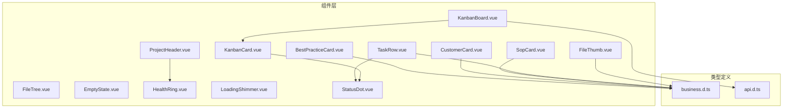

图表来源
- [KanbanBoard.vue:1-120](file://workspace/web/src/components/business/KanbanBoard.vue#L1-L120)
- [KanbanCard.vue:1-100](file://workspace/web/src/components/business/KanbanCard.vue#L1-L100)
- [TaskRow.vue:1-109](file://workspace/web/src/components/business/TaskRow.vue#L1-L109)
- [StatusDot.vue:1-50](file://workspace/web/src/components/common/StatusDot.vue#L1-L50)
- [ProjectHeader.vue:1-89](file://workspace/web/src/components/business/ProjectHeader.vue#L1-L89)
- [HealthRing.vue:1-113](file://workspace/web/src/components/common/HealthRing.vue#L1-L113)
- [business.d.ts:1-156](file://workspace/web/src/types/business.d.ts#L1-L156)
- [api.d.ts:1-183](file://workspace/web/src/types/api.d.ts#L1-L183)

章节来源
- [business.d.ts:1-156](file://workspace/web/src/types/business.d.ts#L1-L156)
- [api.d.ts:1-183](file://workspace/web/src/types/api.d.ts#L1-L183)

## 核心组件
本节概述各组件职责与关键特性，便于快速定位与使用。

- BestPracticeCard：展示最佳实践卡片，包含标题、分类标签、摘要与元信息。
- CustomerCard：展示客户卡片，支持选中态样式，显示名称与行业/规模等基本信息。
- FileThumb：文件缩略图，根据类型或缩略图渲染图标或图片，并格式化显示文件大小。
- FileTree：文件树，基于 Ant Design Tree 组件封装，提供展开/选择状态管理。
- KanbanBoard：看板容器，按固定列布局展示任务，支持拖拽切换任务状态并通过事件向上抛出。
- KanbanCard：看板卡片，展示任务标题、优先级标签与截止日期，结合状态点显示任务状态。
- ProjectHeader：项目头部信息，展示项目名、阶段标签、负责人与健康度数值。
- SopCard：SOP 卡片，展示标题、状态标签、描述与版本/更新时间。
- TaskRow：任务行，支持多选与点击事件，展示任务标题、优先级与截止日期。

章节来源
- [BestPracticeCard.vue:1-67](file://workspace/web/src/components/business/BestPracticeCard.vue#L1-L67)
- [CustomerCard.vue:1-67](file://workspace/web/src/components/business/CustomerCard.vue#L1-L67)
- [FileThumb.vue:1-97](file://workspace/web/src/components/business/FileThumb.vue#L1-L97)
- [FileTree.vue:1-49](file://workspace/web/src/components/business/FileTree.vue#L1-L49)
- [KanbanBoard.vue:1-120](file://workspace/web/src/components/business/KanbanBoard.vue#L1-L120)
- [KanbanCard.vue:1-100](file://workspace/web/src/components/business/KanbanCard.vue#L1-L100)
- [ProjectHeader.vue:1-89](file://workspace/web/src/components/business/ProjectHeader.vue#L1-L89)
- [SopCard.vue:1-77](file://workspace/web/src/components/business/SopCard.vue#L1-L77)
- [TaskRow.vue:1-109](file://workspace/web/src/components/business/TaskRow.vue#L1-L109)

## 架构概览
业务组件围绕“数据驱动 + 事件上抛”的模式组织，通用组件提供状态可视化与占位能力，形成高内聚、低耦合的组件体系。

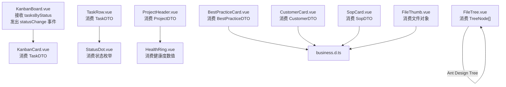

图表来源
- [KanbanBoard.vue:1-120](file://workspace/web/src/components/business/KanbanBoard.vue#L1-L120)
- [KanbanCard.vue:1-100](file://workspace/web/src/components/business/KanbanCard.vue#L1-L100)
- [TaskRow.vue:1-109](file://workspace/web/src/components/business/TaskRow.vue#L1-L109)
- [StatusDot.vue:1-50](file://workspace/web/src/components/common/StatusDot.vue#L1-L50)
- [ProjectHeader.vue:1-89](file://workspace/web/src/components/business/ProjectHeader.vue#L1-L89)
- [HealthRing.vue:1-113](file://workspace/web/src/components/common/HealthRing.vue#L1-L113)
- [business.d.ts:1-156](file://workspace/web/src/types/business.d.ts#L1-L156)

## 详细组件分析

### BestPracticeCard 组件
- 设计理念：以卡片形式承载最佳实践内容，强调可读性与可点击交互。
- 关键 props
  - practice: BestPracticeDTO
- 事件：无
- 样式定制：通过 CSS 类名与主题变量控制阴影、字体与间距。
- 复用策略：作为列表项或网格中的条目复用，适配不同数据源。

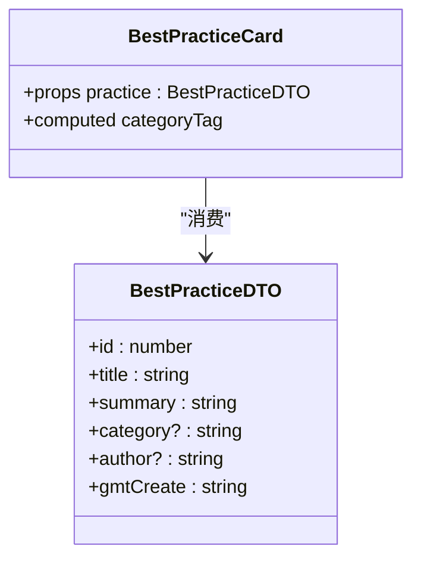

图表来源
- [BestPracticeCard.vue:1-67](file://workspace/web/src/components/business/BestPracticeCard.vue#L1-L67)
- [business.d.ts:112-122](file://workspace/web/src/types/business.d.ts#L112-L122)

章节来源
- [BestPracticeCard.vue:1-67](file://workspace/web/src/components/business/BestPracticeCard.vue#L1-L67)
- [business.d.ts:112-122](file://workspace/web/src/types/business.d.ts#L112-L122)

### CustomerCard 组件
- 设计理念：简洁展示客户基础信息，支持选中态视觉反馈。
- 关键 props
  - customer: CustomerDTO
  - selected?: boolean（默认 false）
- 事件：无
- 样式定制：hover 效果与选中态类名切换。

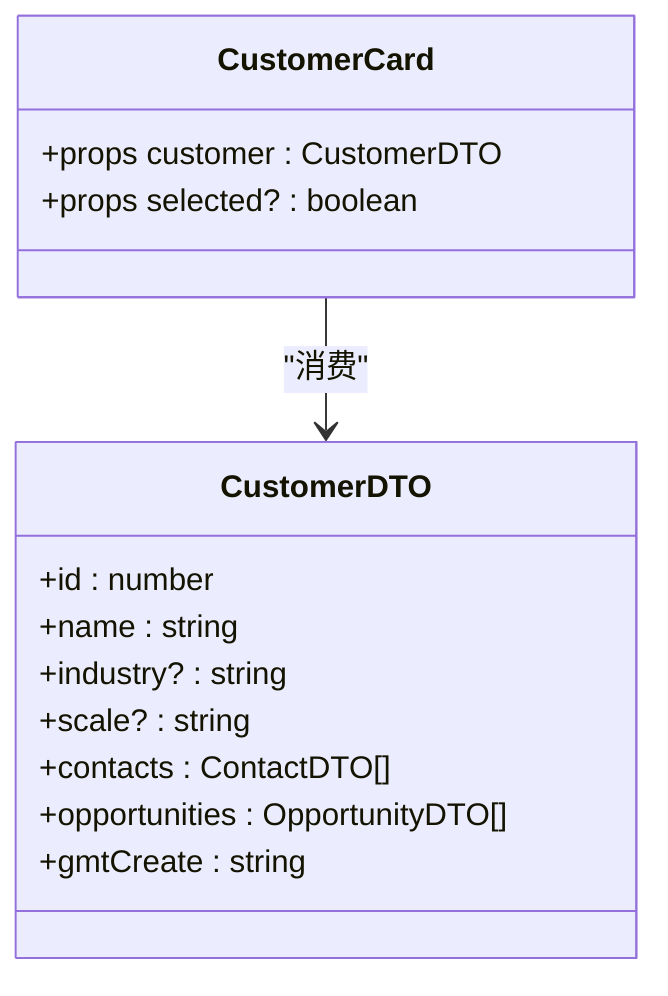

图表来源
- [CustomerCard.vue:1-67](file://workspace/web/src/components/business/CustomerCard.vue#L1-L67)
- [business.d.ts:66-96](file://workspace/web/src/types/business.d.ts#L66-L96)

章节来源
- [CustomerCard.vue:1-67](file://workspace/web/src/components/business/CustomerCard.vue#L1-L67)
- [business.d.ts:66-96](file://workspace/web/src/types/business.d.ts#L66-L96)

### FileThumb 组件
- 设计理念：统一文件缩略图展示，支持缩略图优先与类型图标回退。
- 关键 props
  - file: 包含 id、name、type、size、thumbnail 的对象
- 事件：无
- 样式定制：图标区域尺寸、边框与圆角；信息区字体与颜色。
- 复用策略：在文件列表、附件面板等场景复用。

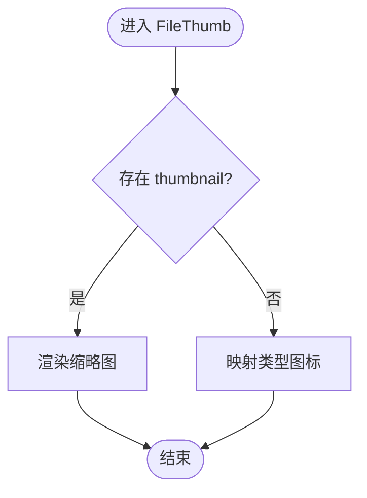

图表来源
- [FileThumb.vue:1-97](file://workspace/web/src/components/business/FileThumb.vue#L1-L97)

章节来源
- [FileThumb.vue:1-97](file://workspace/web/src/components/business/FileThumb.vue#L1-L97)

### FileTree 组件
- 设计理念：基于 Ant Design Tree 的轻量封装，集中管理展开与选中状态。
- 关键 props
  - data: TreeNode[]（包含 key、title、children、isLeaf）
- 事件：无（仅内部状态管理）
- 样式定制：容器背景、边框与圆角，树组件透明背景。

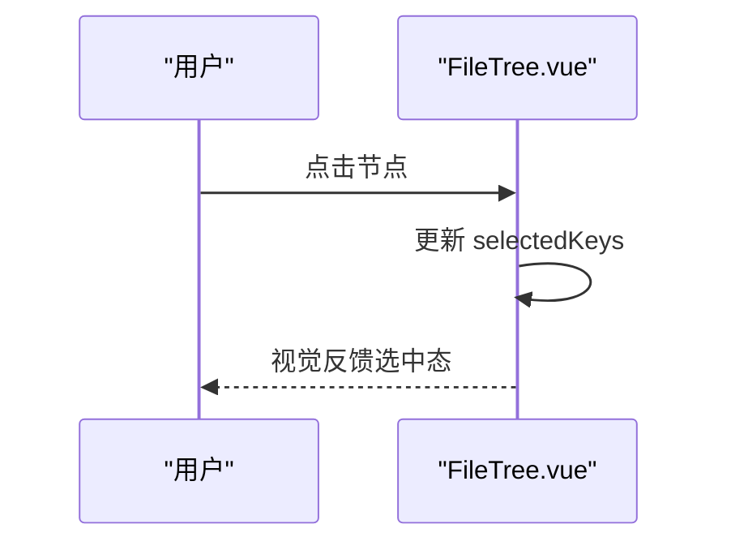

图表来源
- [FileTree.vue:1-49](file://workspace/web/src/components/business/FileTree.vue#L1-L49)

章节来源
- [FileTree.vue:1-49](file://workspace/web/src/components/business/FileTree.vue#L1-L49)

### KanbanBoard 组件
- 设计理念：看板容器，按固定列布局展示任务，支持拖拽切换状态并通过事件向外通知。
- 关键 props
  - tasksByStatus: Record<string, TaskDTO[]>（按状态分组的任务数组）
- 事件
  - statusChange: (taskId: number, newStatus: string)
- 样式定制：列间距、列宽、列体最小高度与空状态提示。

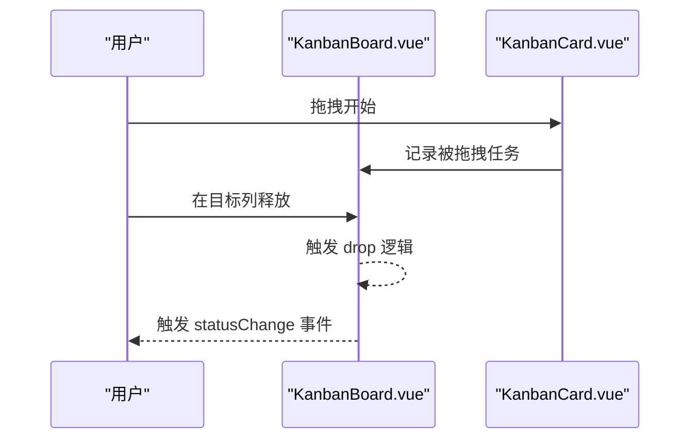

图表来源
- [KanbanBoard.vue:1-120](file://workspace/web/src/components/business/KanbanBoard.vue#L1-L120)
- [KanbanCard.vue:1-100](file://workspace/web/src/components/business/KanbanCard.vue#L1-L100)

章节来源
- [KanbanBoard.vue:1-120](file://workspace/web/src/components/business/KanbanBoard.vue#L1-L120)
- [KanbanCard.vue:1-100](file://workspace/web/src/components/business/KanbanCard.vue#L1-L100)

### KanbanCard 组件
- 设计理念：看板卡片，聚合任务状态、优先级与截止日期，配合状态点提升可读性。
- 关键 props
  - task: TaskDTO
- 事件：无
- 样式定制：边框、圆角、悬停高亮与截止日期强调色。

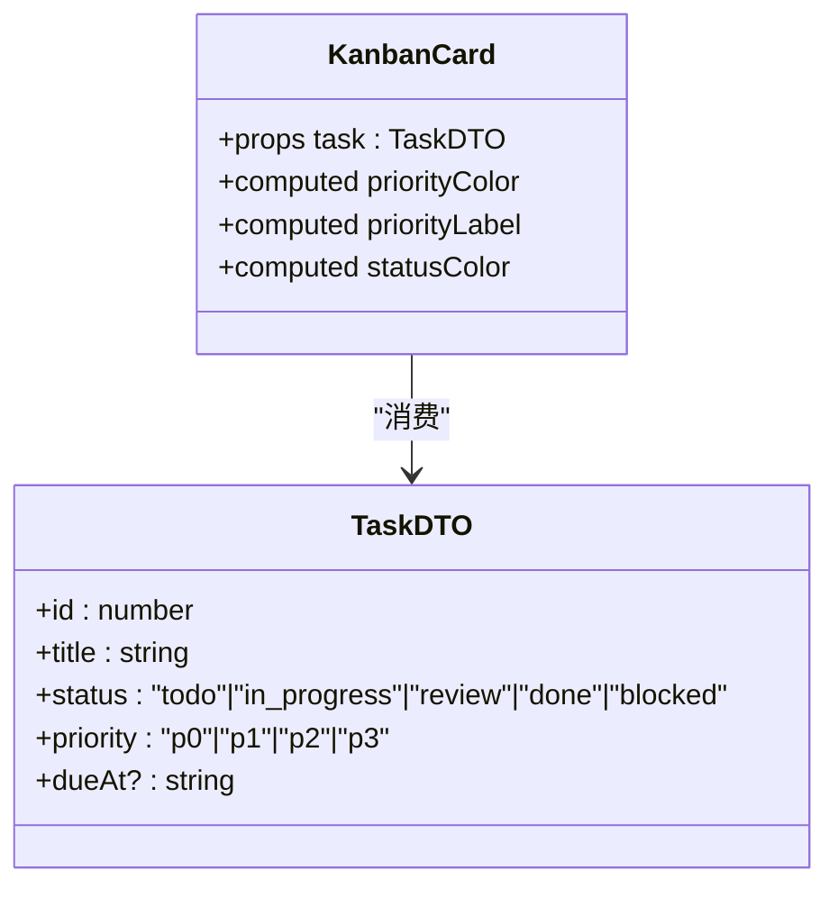

图表来源
- [KanbanCard.vue:1-100](file://workspace/web/src/components/business/KanbanCard.vue#L1-L100)
- [business.d.ts:12-25](file://workspace/web/src/types/business.d.ts#L12-L25)

章节来源
- [KanbanCard.vue:1-100](file://workspace/web/src/components/business/KanbanCard.vue#L1-L100)
- [business.d.ts:12-25](file://workspace/web/src/types/business.d.ts#L12-L25)

### ProjectHeader 组件
- 设计理念：项目头部信息聚合，突出项目名、阶段与健康度。
- 关键 props
  - project: ProjectDTO
- 事件：无
- 样式定制：主副区布局、健康度数值颜色随阈值变化。

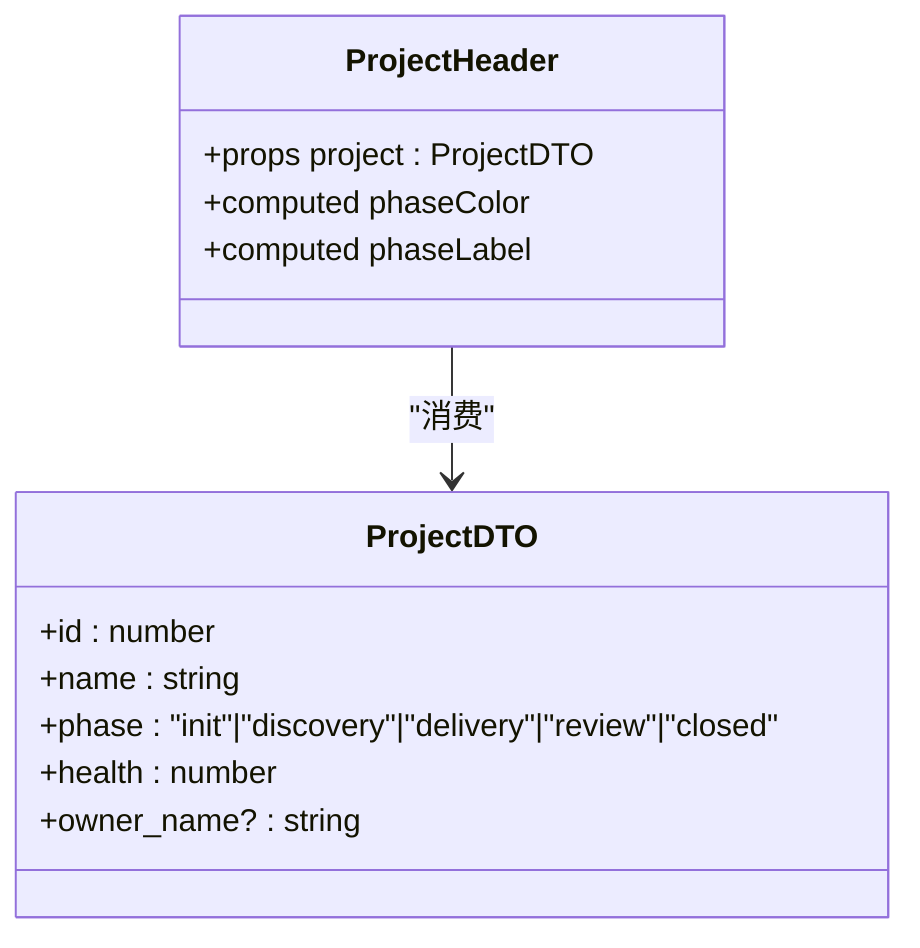

图表来源
- [ProjectHeader.vue:1-89](file://workspace/web/src/components/business/ProjectHeader.vue#L1-L89)
- [business.d.ts:27-42](file://workspace/web/src/types/business.d.ts#L27-L42)

章节来源
- [ProjectHeader.vue:1-89](file://workspace/web/src/components/business/ProjectHeader.vue#L1-L89)
- [business.d.ts:27-42](file://workspace/web/src/types/business.d.ts#L27-L42)

### SopCard 组件
- 设计理念：SOP 卡片，强调状态与版本信息，辅助检索与导航。
- 关键 props
  - sop: SopDTO
- 事件：无
- 样式定制：标题、描述与页脚信息的排版与颜色。

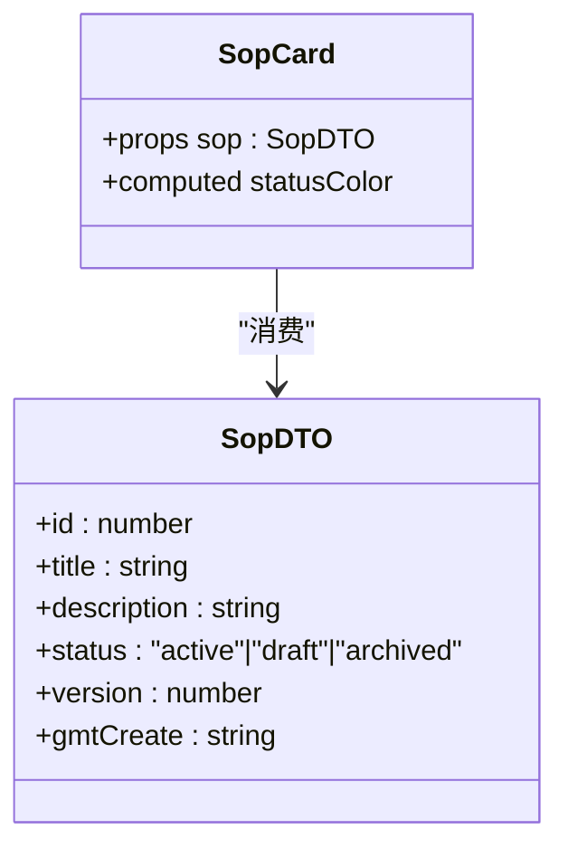

图表来源
- [SopCard.vue:1-77](file://workspace/web/src/components/business/SopCard.vue#L1-L77)
- [business.d.ts:124-133](file://workspace/web/src/types/business.d.ts#L124-L133)

章节来源
- [SopCard.vue:1-77](file://workspace/web/src/components/business/SopCard.vue#L1-L77)
- [business.d.ts:124-133](file://workspace/web/src/types/business.d.ts#L124-L133)

### TaskRow 组件
- 设计理念：任务行，支持多选与点击事件，聚合任务状态、优先级与截止日期。
- 关键 props
  - task: TaskDTO
  - selected?: boolean（默认 false）
- 事件
  - select: (id: number)
  - click: (id: number)
- 样式定制：选中态背景与边框、悬停高亮与 deadline 强调色。

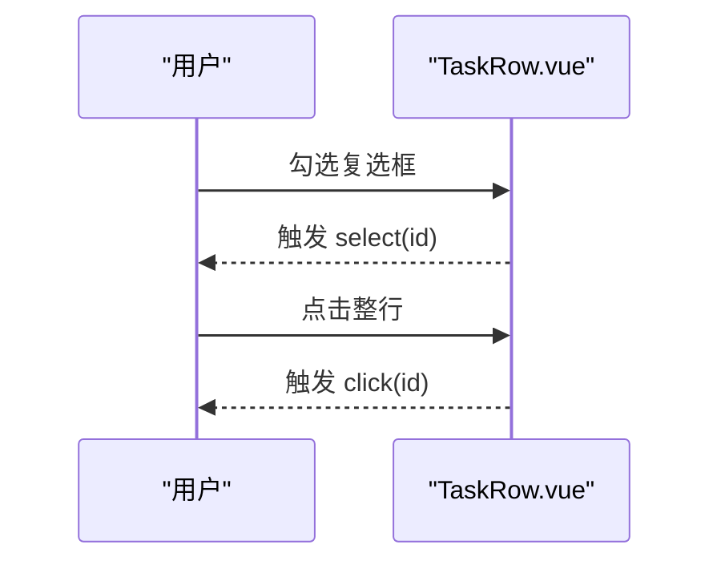

图表来源
- [TaskRow.vue:1-109](file://workspace/web/src/components/business/TaskRow.vue#L1-L109)
- [StatusDot.vue:1-50](file://workspace/web/src/components/common/StatusDot.vue#L1-L50)

章节来源
- [TaskRow.vue:1-109](file://workspace/web/src/components/business/TaskRow.vue#L1-L109)
- [StatusDot.vue:1-50](file://workspace/web/src/components/common/StatusDot.vue#L1-L50)

### EmptyState 组件
- 设计理念：空状态占位，支持自定义图标、标题与操作区插槽。
- 关键 props
  - title?: string（默认“暂无数据”）
  - description?: string
  - icon?: string（默认“inbox”）
- 插槽
  - icon：自定义图标区域
  - action：操作按钮区
- 样式定制：居中布局、图标尺寸与颜色、标题与描述字号。

章节来源
- [EmptyState.vue:1-59](file://workspace/web/src/components/common/EmptyState.vue#L1-L59)

### HealthRing 组件
- 设计理念：健康环形图，支持尺寸与颜色配置，基于 SVG 实现进度绘制。
- 关键 props
  - value: number（0-100）
  - size?: 'small' | 'medium' | 'large'
  - color?: 'green' | 'yellow' | 'red' | 'blue'
- 样式定制：不同尺寸下的半径、描边宽度与数值字号；颜色类名映射到主题色。

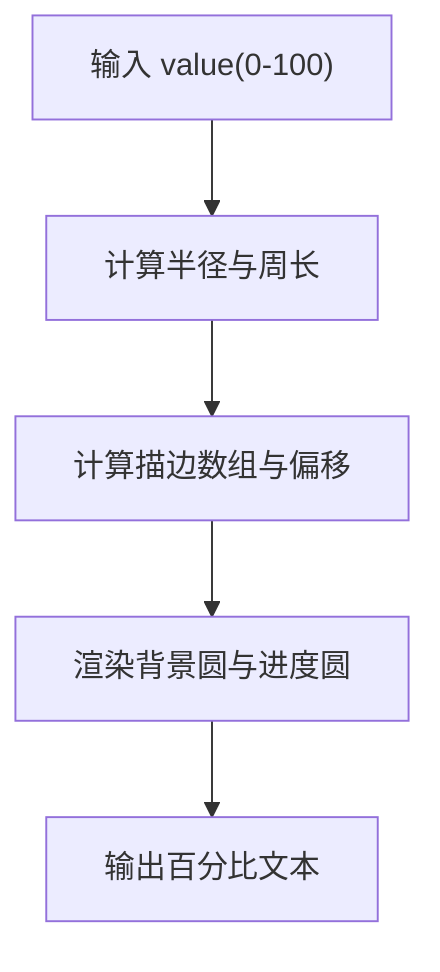

图表来源
- [HealthRing.vue:1-113](file://workspace/web/src/components/common/HealthRing.vue#L1-L113)

章节来源
- [HealthRing.vue:1-113](file://workspace/web/src/components/common/HealthRing.vue#L1-L113)

### LoadingShimmer 组件
- 设计理念：骨架屏加载动画，支持行数与宽度配置。
- 关键 props
  - rows?: number（默认 1）
  - width?: string | number（默认“100%”）
- 样式定制：渐变动画、行间距与圆角。

章节来源
- [LoadingShimmer.vue:1-52](file://workspace/web/src/components/common/LoadingShimmer.vue#L1-L52)

### StatusDot 组件
- 设计理念：状态点，支持尺寸与状态枚举配置。
- 关键 props
  - status: 'success' | 'warning' | 'error' | 'info' | 'default'
  - size?: 'small' | 'medium' | 'large'
- 样式定制：根据状态映射主题色，根据尺寸映射点直径。

章节来源
- [StatusDot.vue:1-50](file://workspace/web/src/components/common/StatusDot.vue#L1-L50)

## 依赖分析
- 组件内聚性：业务组件均以 DTO 为单一数据源，内聚度高；通用组件以原子能力为主，复用性强。
- 组件耦合性：KanbanBoard 与 KanbanCard 存在父子耦合（KanbanBoard 传入 tasksByStatus 并在 drop 时上抛事件），但通过事件解耦了业务逻辑；TaskRow 与 StatusDot 通过状态枚举耦合，职责清晰。
- 外部依赖：Ant Design Vue 的 Card、Tag、Tree、Progress、Button、Avatar、Checkbox 等组件作为 UI 基础层。
- 类型依赖：所有业务组件均依赖 types/business.d.ts 中的 DTO 定义，确保数据契约一致。

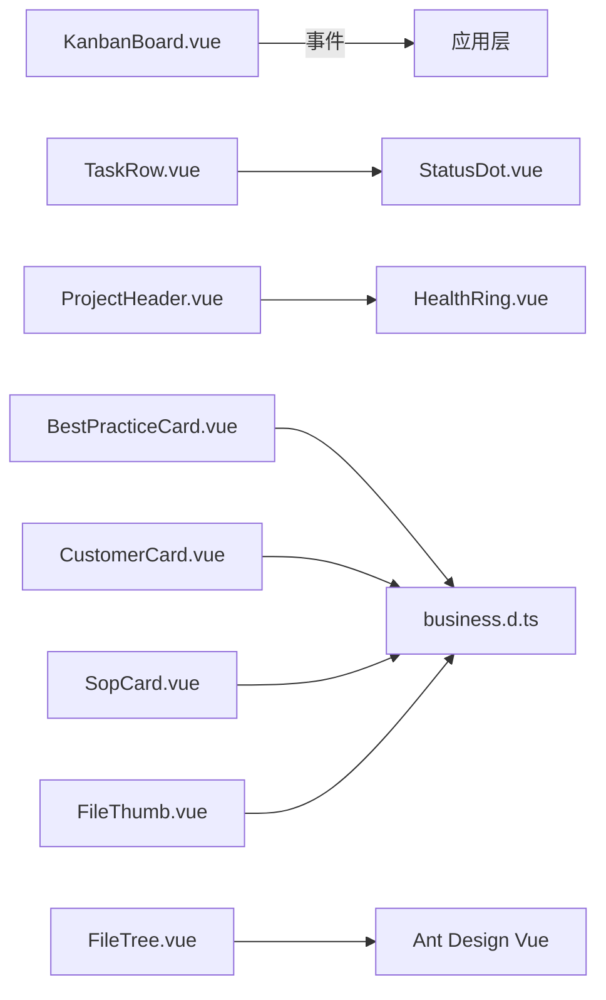

图表来源
- [KanbanBoard.vue:1-120](file://workspace/web/src/components/business/KanbanBoard.vue#L1-L120)
- [TaskRow.vue:1-109](file://workspace/web/src/components/business/TaskRow.vue#L1-L109)
- [StatusDot.vue:1-50](file://workspace/web/src/components/common/StatusDot.vue#L1-L50)
- [ProjectHeader.vue:1-89](file://workspace/web/src/components/business/ProjectHeader.vue#L1-L89)
- [HealthRing.vue:1-113](file://workspace/web/src/components/common/HealthRing.vue#L1-L113)
- [business.d.ts:1-156](file://workspace/web/src/types/business.d.ts#L1-L156)

章节来源
- [business.d.ts:1-156](file://workspace/web/src/types/business.d.ts#L1-L156)
- [api.d.ts:1-183](file://workspace/web/src/types/api.d.ts#L1-L183)

## 性能考虑
- 渲染优化
  - 列表渲染：KanbanBoard 对每个状态列渲染对应任务，建议在父层按需传递 tasksByStatus，避免全量重渲染。
  - 图标与缩略图：FileThumb 优先使用 thumbnail，减少大图渲染成本；未命中时使用类型图标，避免额外请求。
- 事件与状态
  - KanbanBoard 使用 dragover/drop 与本地状态记录被拖拽任务，避免频繁触发外部副作用。
  - TaskRow 的选中态通过类名切换，避免复杂计算。
- 动画与视觉
  - HealthRing 与 LoadingShimmer 使用 CSS 动画，尽量避免 JS 动画带来的卡顿。
- 可访问性
  - 所有交互元素具备明确的焦点与悬停反馈，符合通用可访问性要求。

## 故障排查指南
- 看板拖拽无效
  - 检查父层是否正确传递 tasksByStatus 且列键与状态枚举一致。
  - 确认 drop 事件是否被正确监听并上抛 statusChange。
- 任务行点击/选中无响应
  - 确认父层是否监听 select/click 事件并处理 id。
  - 检查 selected 属性是否正确传递至 TaskRow。
- 健康度显示异常
  - 确认传入 value 在 0-100 范围内，size 与 color 为允许值。
- 文件缩略图不显示
  - 若未提供 thumbnail，检查 type 是否映射到默认图标；若提供 thumbnail，请确认资源可访问。
- 空状态不显示
  - 检查是否正确传入 title、description 或使用默认值；确认是否提供了 action 插槽内容。

章节来源
- [KanbanBoard.vue:1-120](file://workspace/web/src/components/business/KanbanBoard.vue#L1-L120)
- [TaskRow.vue:1-109](file://workspace/web/src/components/business/TaskRow.vue#L1-L109)
- [HealthRing.vue:1-113](file://workspace/web/src/components/common/HealthRing.vue#L1-L113)
- [FileThumb.vue:1-97](file://workspace/web/src/components/business/FileThumb.vue#L1-L97)
- [EmptyState.vue:1-59](file://workspace/web/src/components/common/EmptyState.vue#L1-L59)

## 结论
FDE 工作台业务组件以清晰的 props 接口、稳定的事件模型与可定制的样式体系，构建了高可用的业务视图。通过将通用组件（如 StatusDot、HealthRing、LoadingShimmer、EmptyState）与业务组件解耦组合，实现了良好的复用性与扩展性。建议在实际使用中遵循类型契约、保持事件上抛与状态下沉的原则，以获得更佳的开发体验与维护性。

## 附录
- 组件属性与事件速查
  - BestPracticeCard：props.practice: BestPracticeDTO
  - CustomerCard：props.customer: CustomerDTO, props.selected?: boolean
  - FileThumb：props.file: 对象（id/name/type/size/thumbnail）
  - FileTree：props.data: TreeNode[]
  - KanbanBoard：props.tasksByStatus: Record<string, TaskDTO[]>, emits.statusChange
  - KanbanCard：props.task: TaskDTO
  - ProjectHeader：props.project: ProjectDTO
  - SopCard：props.sop: SopDTO
  - TaskRow：props.task: TaskDTO, props.selected?: boolean, emits.select/click
  - EmptyState：props.title/description/icon, 插槽 icon/action
  - HealthRing：props.value/size/color
  - LoadingShimmer：props.rows/width
  - StatusDot：props.status/size
- 类型参考
  - business.d.ts：TaskDTO、ProjectDTO、CustomerDTO、BestPracticeDTO、SopDTO 等
  - api.d.ts：API 请求/响应类型与分页包装