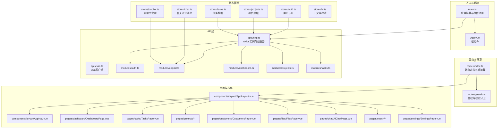
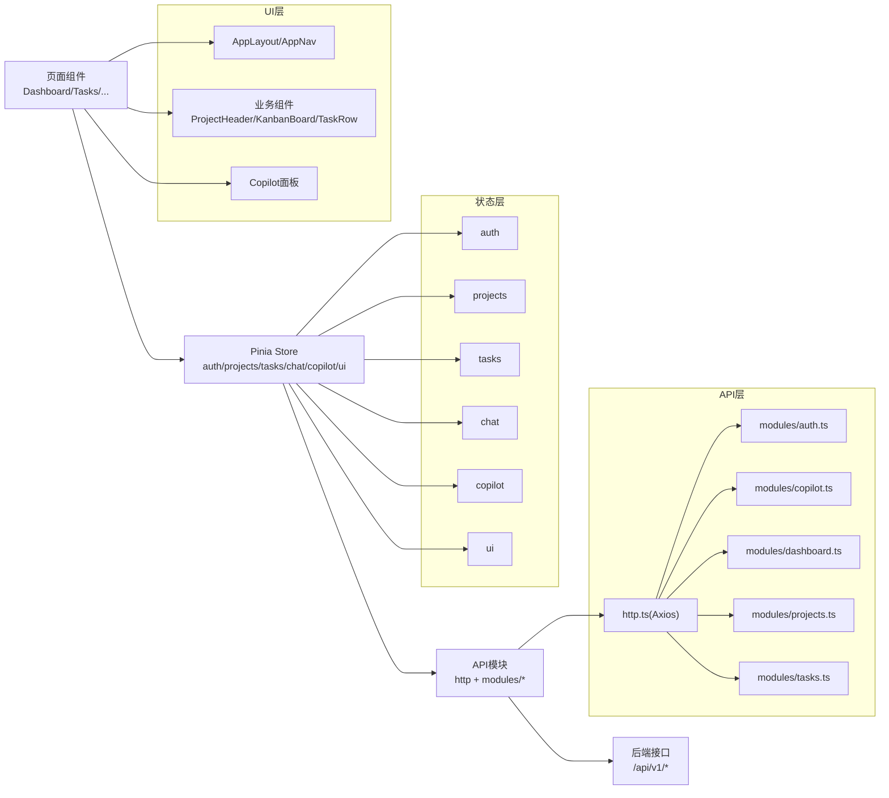
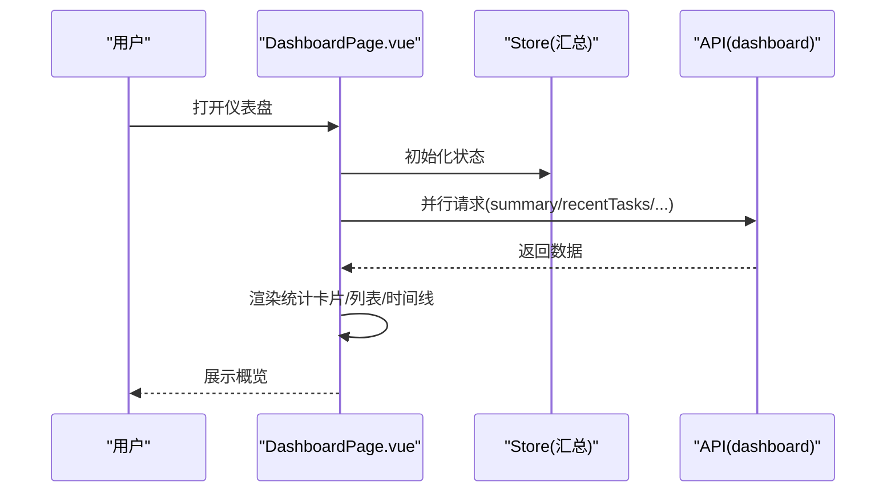
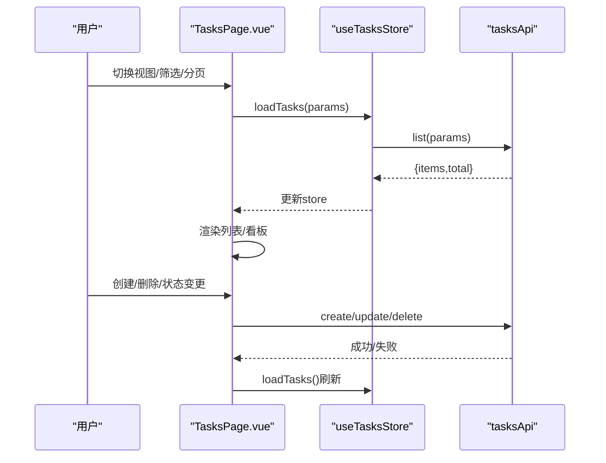
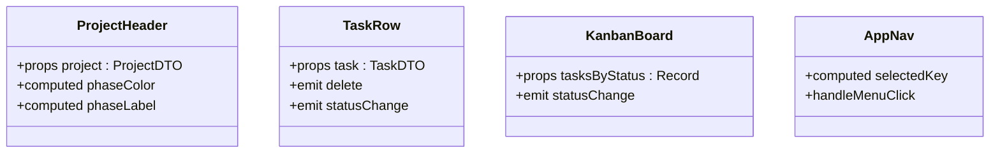
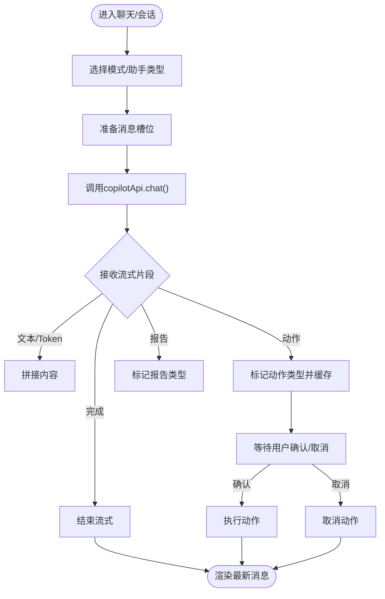
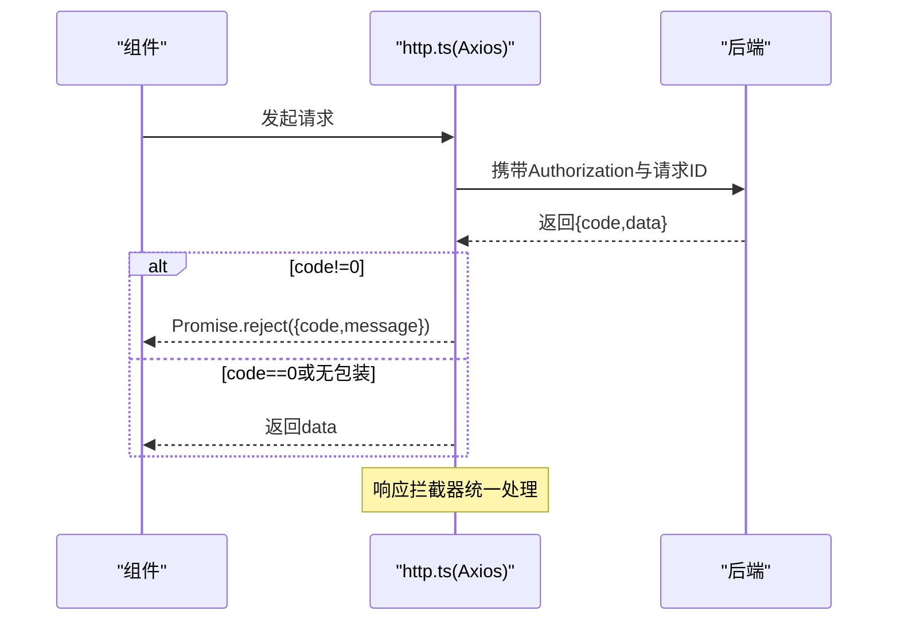
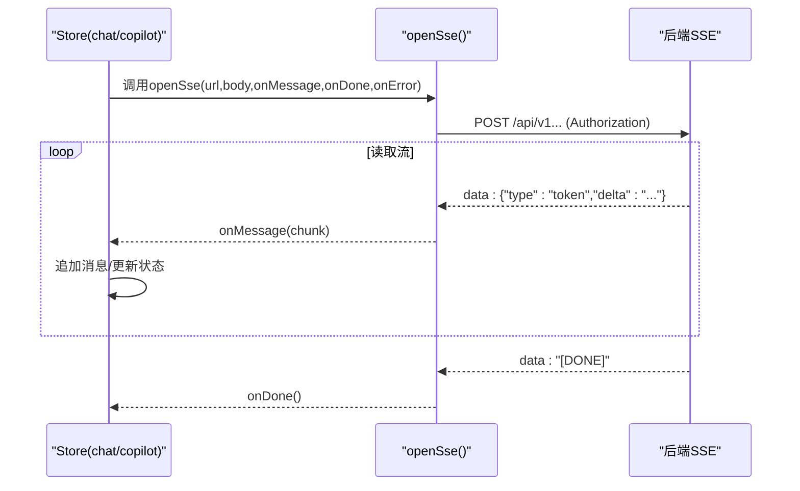
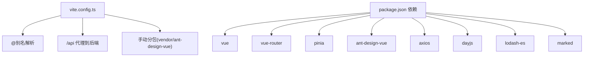

# 前端应用

<cite>
**本文引用的文件**
- [main.ts](file://workspace/web/src/main.ts)
- [App.vue](file://workspace/web/src/App.vue)
- [package.json](file://workspace/web/package.json)
- [vite.config.ts](file://workspace/web/vite.config.ts)
- [router/index.ts](file://workspace/web/src/router/index.ts)
- [router/guards.ts](file://workspace/web/src/router/guards.ts)
- [stores/auth.ts](file://workspace/web/src/stores/auth.ts)
- [stores/chat.ts](file://workspace/web/src/stores/chat.ts)
- [stores/copilot.ts](file://workspace/web/src/stores/copilot.ts)
- [stores/projects.ts](file://workspace/web/src/stores/projects.ts)
- [stores/tasks.ts](file://workspace/web/src/stores/tasks.ts)
- [stores/ui.ts](file://workspace/web/src/stores/ui.ts)
- [apis/http.ts](file://workspace/web/src/apis/http.ts)
- [apis/sse.ts](file://workspace/web/src/apis/sse.ts)
- [apis/modules/auth.ts](file://workspace/web/src/apis/modules/auth.ts)
- [apis/modules/copilot.ts](file://workspace/web/src/apis/modules/copilot.ts)
- [apis/modules/dashboard.ts](file://workspace/web/src/apis/modules/dashboard.ts)
- [apis/modules/projects.ts](file://workspace/web/src/apis/modules/projects.ts)
- [apis/modules/tasks.ts](file://workspace/web/src/apis/modules/tasks.ts)
- [components/layout/AppLayout.vue](file://workspace/web/src/components/layout/AppLayout.vue)
- [components/layout/AppHeader.vue](file://workspace/web/src/components/layout/AppHeader.vue)
- [components/layout/AppNav.vue](file://workspace/web/src/components/layout/AppNav.vue)
- [components/business/ProjectHeader.vue](file://workspace/web/src/components/business/ProjectHeader.vue)
- [components/business/KanbanBoard.vue](file://workspace/web/src/components/business/KanbanBoard.vue)
- [components/business/TaskRow.vue](file://workspace/web/src/components/business/TaskRow.vue)
- [components/copilot/CopilotPanel.vue](file://workspace/web/src/components/copilot/CopilotPanel.vue)
- [components/copilot/MessageList.vue](file://workspace/web/src/components/copilot/MessageList.vue)
- [components/copilot/ChatInput.vue](file://workspace/web/src/components/copilot/ChatInput.vue)
- [pages/dashboard/DashboardPage.vue](file://workspace/web/src/pages/dashboard/DashboardPage.vue)
- [pages/tasks/TasksPage.vue](file://workspace/web/src/pages/tasks/TasksPage.vue)
- [pages/projects/ProjectsListPage.vue](file://workspace/web/src/pages/projects/ProjectsListPage.vue)
- [pages/projects/ProjectDetailPage.vue](file://workspace/web/src/pages/projects/ProjectDetailPage.vue)
- [pages/customers/CustomersPage.vue](file://workspace/web/src/pages/customers/CustomersPage.vue)
- [pages/files/FilesPage.vue](file://workspace/web/src/pages/files/FilesPage.vue)
- [pages/chat/AiChatPage.vue](file://workspace/web/src/pages/chat/AiChatPage.vue)
- [pages/coach/CoachIndexPage.vue](file://workspace/web/src/pages/coach/CoachIndexPage.vue)
- [pages/coach/BestPracticesPage.vue](file://workspace/web/src/pages/coach/BestPracticesPage.vue)
- [pages/coach/SopsPage.vue](file://workspace/web/src/pages/coach/SopsPage.vue)
- [pages/coach/LearningPathPage.vue](file://workspace/web/src/pages/coach/LearningPathPage.vue)
- [pages/settings/SettingsPage.vue](file://workspace/web/src/pages/settings/SettingsPage.vue)
- [pages/error/NotFoundPage.vue](file://workspace/web/src/pages/error/NotFoundPage.vue)
- [composables/useMention.ts](file://workspace/web/src/composables/useMention.ts)
- [composables/useTheme.ts](file://workspace/web/src/composables/useTheme.ts)
- [config/assistants.ts](file://workspace/web/src/config/assistants.ts)
- [types/api.d.ts](file://workspace/web/src/types/api.d.ts)
- [types/business.d.ts](file://workspace/web/src/types/business.d.ts)
- [types/copilot.d.ts](file://workspace/web/src/types/copilot.d.ts)
- [types/env.d.ts](file://workspace/web/src/types/env.d.ts)
- [styles/theme.css](file://workspace/web/src/styles/theme.css)
- [styles/layout.css](file://workspace/web/src/styles/layout.css)
- [styles/pages.css](file://workspace/web/src/styles/pages.css)
- [styles/copilot.css](file://workspace/web/src/styles/copilot.css)
- [styles/reset.css](file://workspace/web/src/styles/reset.css)
</cite>

## 目录
1. [简介](#简介)
2. [项目结构](#项目结构)
3. [核心组件](#核心组件)
4. [架构总览](#架构总览)
5. [详细组件分析](#详细组件分析)
6. [依赖关系分析](#依赖关系分析)
7. [性能考量](#性能考量)
8. [故障排查指南](#故障排查指南)
9. [结论](#结论)
10. [附录](#附录)

## 简介
本文件面向FDE工作台前端应用，系统性阐述基于Vue 3 + Pinia + Ant Design Vue的前端架构设计、组件设计原则、状态管理模式以及API集成策略。文档覆盖页面组件（仪表盘、项目管理、任务管理、客户管理、文件管理、Copilot聊天页面）与业务组件（卡片、表格、表单、导航）的设计理念，并深入解析用户态、项目态、任务态、聊天态等状态管理，以及HTTP客户端、SSE流式连接与错误处理机制。

## 项目结构
前端采用按功能域划分的目录组织方式：页面pages、业务组件components、API封装apis、状态管理stores、路由router、样式styles、类型定义types、工具composables等。构建工具使用Vite，提供开发代理、别名解析与代码分割优化。

图表来源
- [main.ts:1-24](file://workspace/web/src/main.ts#L1-L24)
- [App.vue:1-17](file://workspace/web/src/App.vue#L1-L17)
- [router/index.ts:1-34](file://workspace/web/src/router/index.ts#L1-L34)
- [router/guards.ts](file://workspace/web/src/router/guards.ts)
- [components/layout/AppLayout.vue:1-47](file://workspace/web/src/components/layout/AppLayout.vue#L1-L47)
- [components/layout/AppNav.vue:1-70](file://workspace/web/src/components/layout/AppNav.vue#L1-L70)
- [pages/dashboard/DashboardPage.vue:1-286](file://workspace/web/src/pages/dashboard/DashboardPage.vue#L1-L286)
- [pages/tasks/TasksPage.vue:1-384](file://workspace/web/src/pages/tasks/TasksPage.vue#L1-L384)
- [pages/chat/AiChatPage.vue](file://workspace/web/src/pages/chat/AiChatPage.vue)
- [pages/coach/CoachIndexPage.vue](file://workspace/web/src/pages/coach/CoachIndexPage.vue)
- [pages/settings/SettingsPage.vue](file://workspace/web/src/pages/settings/SettingsPage.vue)
- [apis/http.ts:1-73](file://workspace/web/src/apis/http.ts#L1-L73)
- [apis/sse.ts:1-79](file://workspace/web/src/apis/sse.ts#L1-L79)
- [apis/modules/auth.ts](file://workspace/web/src/apis/modules/auth.ts)
- [apis/modules/copilot.ts](file://workspace/web/src/apis/modules/copilot.ts)
- [apis/modules/dashboard.ts](file://workspace/web/src/apis/modules/dashboard.ts)
- [apis/modules/projects.ts](file://workspace/web/src/apis/modules/projects.ts)
- [apis/modules/tasks.ts](file://workspace/web/src/apis/modules/tasks.ts)
- [stores/auth.ts:1-56](file://workspace/web/src/stores/auth.ts#L1-L56)
- [stores/projects.ts:1-102](file://workspace/web/src/stores/projects.ts#L1-L102)
- [stores/tasks.ts:1-85](file://workspace/web/src/stores/tasks.ts#L1-L85)
- [stores/chat.ts:1-147](file://workspace/web/src/stores/chat.ts#L1-L147)
- [stores/copilot.ts:1-184](file://workspace/web/src/stores/copilot.ts#L1-L184)
- [stores/ui.ts](file://workspace/web/src/stores/ui.ts)

章节来源
- [main.ts:1-24](file://workspace/web/src/main.ts#L1-L24)
- [package.json:1-59](file://workspace/web/package.json#L1-L59)
- [vite.config.ts:1-36](file://workspace/web/vite.config.ts#L1-L36)
- [router/index.ts:1-34](file://workspace/web/src/router/index.ts#L1-L34)

## 核心组件
- 应用入口与启动：在入口文件中创建Vue应用、注册Pinia与路由、安装Ant Design Vue插件、设置HTTP拦截器并挂载根组件。
- 路由与守卫：定义页面路由与懒加载，通过守卫控制登录态与权限访问。
- 状态管理：以Pinia Store为核心，分别管理用户认证、项目、任务、聊天与UI状态；提供统一的数据加载、更新与错误处理。
- API层：统一Axios实例与拦截器，封装鉴权头、响应解包、401自动刷新与全局错误提示；提供SSE客户端用于流式AI响应。
- 页面与布局：AppLayout负责头部、侧边导航与主内容区布局，支持右侧Copilot面板；各页面聚焦具体业务场景。

章节来源
- [main.ts:1-24](file://workspace/web/src/main.ts#L1-L24)
- [router/index.ts:1-34](file://workspace/web/src/router/index.ts#L1-L34)
- [stores/auth.ts:1-56](file://workspace/web/src/stores/auth.ts#L1-L56)
- [stores/projects.ts:1-102](file://workspace/web/src/stores/projects.ts#L1-L102)
- [stores/tasks.ts:1-85](file://workspace/web/src/stores/tasks.ts#L1-L85)
- [stores/chat.ts:1-147](file://workspace/web/src/stores/chat.ts#L1-L147)
- [stores/copilot.ts:1-184](file://workspace/web/src/stores/copilot.ts#L1-L184)
- [apis/http.ts:1-73](file://workspace/web/src/apis/http.ts#L1-L73)
- [apis/sse.ts:1-79](file://workspace/web/src/apis/sse.ts#L1-L79)
- [components/layout/AppLayout.vue:1-47](file://workspace/web/src/components/layout/AppLayout.vue#L1-L47)

## 架构总览
前端采用“页面-组件-状态-API”四层架构：
- 页面层：负责业务编排与用户交互，调用Store与API模块。
- 组件层：可复用的业务组件与通用组件，遵循单一职责与属性驱动。
- 状态层：Pinia Store集中管理业务状态与副作用，提供计算属性与派生状态。
- API层：Axios封装统一请求与响应处理，SSE封装流式连接。

图表来源
- [components/layout/AppLayout.vue:1-47](file://workspace/web/src/components/layout/AppLayout.vue#L1-L47)
- [components/business/ProjectHeader.vue:1-89](file://workspace/web/src/components/business/ProjectHeader.vue#L1-L89)
- [components/business/KanbanBoard.vue:1-120](file://workspace/web/src/components/business/KanbanBoard.vue#L1-L120)
- [stores/auth.ts:1-56](file://workspace/web/src/stores/auth.ts#L1-L56)
- [stores/projects.ts:1-102](file://workspace/web/src/stores/projects.ts#L1-L102)
- [stores/tasks.ts:1-85](file://workspace/web/src/stores/tasks.ts#L1-L85)
- [stores/chat.ts:1-147](file://workspace/web/src/stores/chat.ts#L1-L147)
- [stores/copilot.ts:1-184](file://workspace/web/src/stores/copilot.ts#L1-L184)
- [apis/http.ts:1-73](file://workspace/web/src/apis/http.ts#L1-L73)
- [apis/modules/copilot.ts](file://workspace/web/src/apis/modules/copilot.ts)

## 详细组件分析

### 页面组件设计
- 仪表盘页面：聚合任务统计、最近任务、通知与关键事件，使用Ant Design的统计卡片、列表与时间线组件，支持并发加载与空态展示。
- 任务管理页面：支持列表与看板双视图，提供搜索、筛选、分页、创建、删除与状态变更；看板列拖拽更新任务状态。
- 项目管理页面：包含项目列表与项目详情，展示项目阶段、负责人与健康度等信息。
- 客户管理页面：客户空间展示与交互。
- 文件管理页面：文件中心展示与交互。
- Copilot聊天页面：AI对话中心，支持自由模式与上下文模式切换。
- 教练页面：最佳实践库、方法论SOP、学习路径等。
- 设置页面：系统设置入口。

图表来源
- [pages/dashboard/DashboardPage.vue:1-286](file://workspace/web/src/pages/dashboard/DashboardPage.vue#L1-L286)
- [apis/modules/dashboard.ts](file://workspace/web/src/apis/modules/dashboard.ts)

图表来源
- [pages/tasks/TasksPage.vue:1-384](file://workspace/web/src/pages/tasks/TasksPage.vue#L1-L384)
- [stores/tasks.ts:1-85](file://workspace/web/src/stores/tasks.ts#L1-L85)
- [apis/modules/tasks.ts](file://workspace/web/src/apis/modules/tasks.ts)

章节来源
- [pages/dashboard/DashboardPage.vue:1-286](file://workspace/web/src/pages/dashboard/DashboardPage.vue#L1-L286)
- [pages/tasks/TasksPage.vue:1-384](file://workspace/web/src/pages/tasks/TasksPage.vue#L1-L384)
- [pages/projects/ProjectsListPage.vue](file://workspace/web/src/pages/projects/ProjectsListPage.vue)
- [pages/projects/ProjectDetailPage.vue](file://workspace/web/src/pages/projects/ProjectDetailPage.vue)
- [pages/customers/CustomersPage.vue](file://workspace/web/src/pages/customers/CustomersPage.vue)
- [pages/files/FilesPage.vue](file://workspace/web/src/pages/files/FilesPage.vue)
- [pages/chat/AiChatPage.vue](file://workspace/web/src/pages/chat/AiChatPage.vue)
- [pages/coach/CoachIndexPage.vue](file://workspace/web/src/pages/coach/CoachIndexPage.vue)
- [pages/coach/BestPracticesPage.vue](file://workspace/web/src/pages/coach/BestPracticesPage.vue)
- [pages/coach/SopsPage.vue](file://workspace/web/src/pages/coach/SopsPage.vue)
- [pages/coach/LearningPathPage.vue](file://workspace/web/src/pages/coach/LearningPathPage.vue)
- [pages/settings/SettingsPage.vue](file://workspace/web/src/pages/settings/SettingsPage.vue)

### 业务组件设计理念
- 卡片组件：如项目头部卡片，根据阶段映射标签颜色与文案，展示健康度与操作按钮，强调语义化与可读性。
- 表格组件：以任务行组件为例，提供状态标签、优先级标签与操作入口，支持删除与状态变更回调。
- 导航组件：侧边导航根据当前路由高亮选中项，点击跳转对应页面，保持一致的交互体验。
- 看板组件：支持拖拽列与任务，通过事件向上抛出状态变更，便于Store统一更新。

图表来源
- [components/business/ProjectHeader.vue:1-89](file://workspace/web/src/components/business/ProjectHeader.vue#L1-L89)
- [components/business/TaskRow.vue](file://workspace/web/src/components/business/TaskRow.vue)
- [components/business/KanbanBoard.vue:1-120](file://workspace/web/src/components/business/KanbanBoard.vue#L1-L120)
- [components/layout/AppNav.vue:1-70](file://workspace/web/src/components/layout/AppNav.vue#L1-L70)

章节来源
- [components/business/ProjectHeader.vue:1-89](file://workspace/web/src/components/business/ProjectHeader.vue#L1-L89)
- [components/business/KanbanBoard.vue:1-120](file://workspace/web/src/components/business/KanbanBoard.vue#L1-L120)
- [components/layout/AppNav.vue:1-70](file://workspace/web/src/components/layout/AppNav.vue#L1-L70)

### 状态管理模式
- 用户状态：存储访问令牌、刷新令牌与用户信息，提供登录、刷新、登出与认证态计算属性。
- 项目状态：维护项目列表、当前项目、成员与里程碑，提供加载、创建、更新、删除与过滤。
- 任务状态：维护任务列表、看板分组、总数与完成数，提供加载、看板分组、创建、更新、删除。
- 聊天状态：维护消息流、会话ID、引用、上下文与流式状态，支持发送消息与SSE回调处理。
- Copilot状态：多助手会话独立管理消息与会话ID，支持动作执行与二次确认。

图表来源
- [stores/chat.ts:1-147](file://workspace/web/src/stores/chat.ts#L1-L147)
- [stores/copilot.ts:1-184](file://workspace/web/src/stores/copilot.ts#L1-L184)
- [apis/modules/copilot.ts](file://workspace/web/src/apis/modules/copilot.ts)

章节来源
- [stores/auth.ts:1-56](file://workspace/web/src/stores/auth.ts#L1-L56)
- [stores/projects.ts:1-102](file://workspace/web/src/stores/projects.ts#L1-L102)
- [stores/tasks.ts:1-85](file://workspace/web/src/stores/tasks.ts#L1-L85)
- [stores/chat.ts:1-147](file://workspace/web/src/stores/chat.ts#L1-L147)
- [stores/copilot.ts:1-184](file://workspace/web/src/stores/copilot.ts#L1-L184)

### API集成策略
- HTTP客户端设计：创建Axios实例，设置基础URL、超时与默认头；请求拦截器注入Authorization与请求ID；响应拦截器统一解包与错误处理。
- Token刷新机制：401时触发刷新流程，避免并发刷新，队列化等待中的请求，超时保护与登出兜底。
- SSE连接管理：基于fetch与ReadableStream实现POST型SSE客户端，支持断流恢复、JSON解析与DONE信号。
- 错误处理机制：统一错误提示与错误上抛，结合Store层的error字段与loading状态反馈给UI。

图表来源
- [apis/http.ts:1-73](file://workspace/web/src/apis/http.ts#L1-L73)

图表来源
- [apis/sse.ts:1-79](file://workspace/web/src/apis/sse.ts#L1-L79)
- [stores/chat.ts:1-147](file://workspace/web/src/stores/chat.ts#L1-L147)
- [stores/copilot.ts:1-184](file://workspace/web/src/stores/copilot.ts#L1-L184)

章节来源
- [apis/http.ts:1-73](file://workspace/web/src/apis/http.ts#L1-L73)
- [apis/sse.ts:1-79](file://workspace/web/src/apis/sse.ts#L1-L79)

## 依赖关系分析
- 构建与运行：Vite提供开发服务器、代理与代码分割；依赖Ant Design Vue、Day.js、Lodash-es、Marked等。
- 路由与守卫：路由按需加载页面组件，守卫控制登录态与页面元信息。
- 状态与API：Store通过API模块发起请求，API模块基于Axios封装；SSE用于实时流式响应。

图表来源
- [vite.config.ts:1-36](file://workspace/web/vite.config.ts#L1-L36)
- [package.json:1-59](file://workspace/web/package.json#L1-L59)

章节来源
- [vite.config.ts:1-36](file://workspace/web/vite.config.ts#L1-L36)
- [package.json:1-59](file://workspace/web/package.json#L1-L59)

## 性能考量
- 代码分割：通过Vite的manualChunks将Vue生态与Ant Design Vue独立打包，减少重复依赖与首屏体积。
- 懒加载路由：路由组件按需加载，降低初始包体。
- Store缓存与去抖：在Store层对列表与看板数据进行本地缓存，避免重复请求；必要时结合防抖与节流。
- 图标与样式：使用Ant Design Vue图标与主题变量，减少自定义样式的开销。
- SSE流控：在Store中对流式消息进行增量拼接，避免频繁重渲染；在组件层使用浅层响应式与计算属性。

## 故障排查指南
- 登录态异常：检查localStorage中的access_token与refresh_token是否存在；确认401拦截器是否正确触发刷新与队列处理。
- 请求失败：查看响应拦截器返回的code/message，确认后端返回格式；检查请求ID便于定位问题。
- SSE断流：确认Authorization头是否正确传递；检查后端SSE是否正常推送；在组件层监听onError回调并提示用户重试。
- 路由跳转失效：检查路由元信息layout与requiresAuth，确认守卫逻辑与登录状态匹配。

章节来源
- [apis/http.ts:1-73](file://workspace/web/src/apis/http.ts#L1-L73)
- [router/guards.ts](file://workspace/web/src/router/guards.ts)
- [apis/sse.ts:1-79](file://workspace/web/src/apis/sse.ts#L1-L79)

## 结论
该前端应用以Vue 3与Pinia为核心，结合Ant Design Vue与Vite，构建了清晰的页面-组件-状态-API分层架构。通过统一的HTTP与SSE封装、完善的Store状态管理与路由守卫，实现了从仪表盘到任务管理、项目管理、客户管理、文件管理与Copilot聊天的完整业务闭环。建议持续完善类型定义、测试覆盖率与性能监控，以提升可维护性与用户体验。

## 附录
- 类型定义：通过OpenAPI生成的API类型、业务模型与Copilot类型，确保前后端契约一致。
- 主题与样式：主题变量、布局与页面样式分离，便于定制与维护。
- 组合式工具：提及的useMention与useTheme等组合式函数，提供可复用的业务能力。