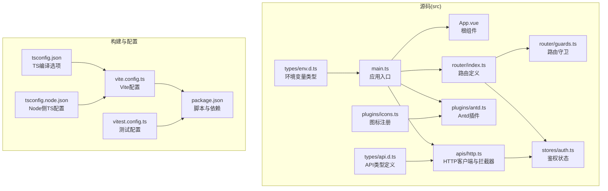
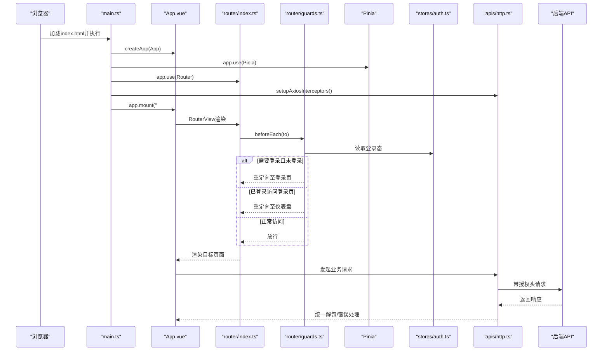
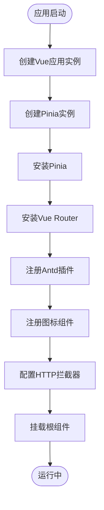
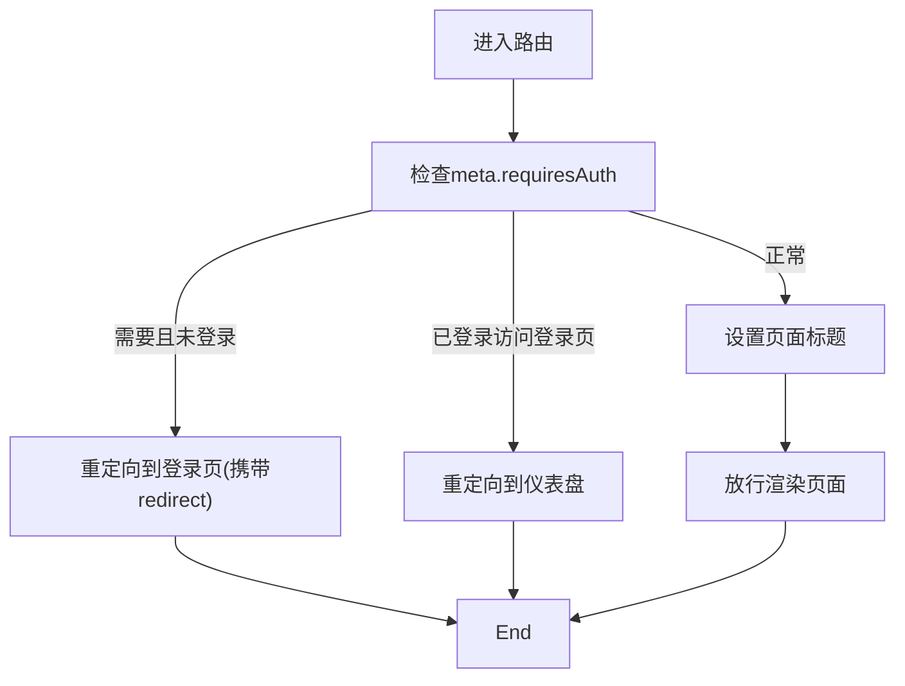
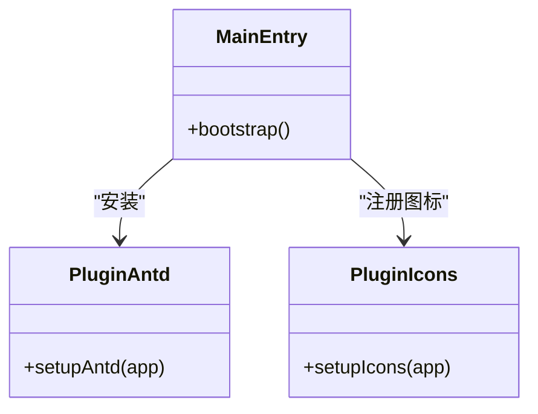
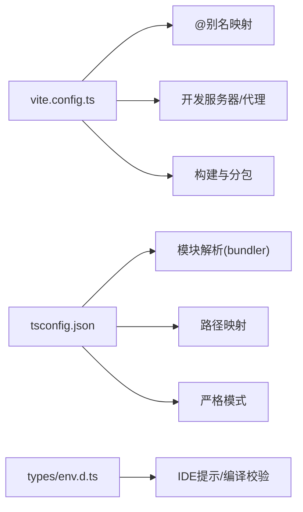
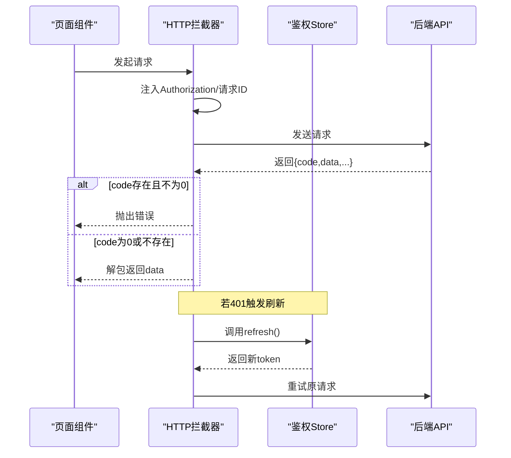
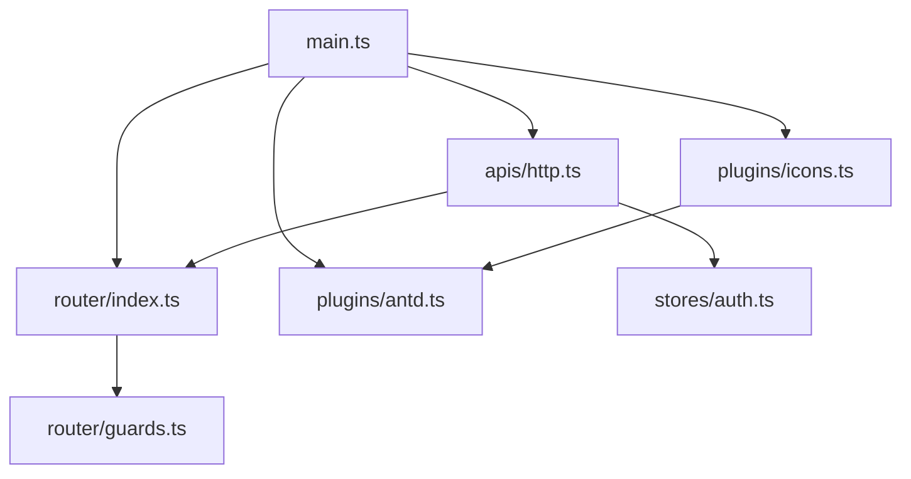

# 应用架构

<cite>
**本文引用的文件**
- [main.ts](file://workspace/web/src/main.ts)
- [App.vue](file://workspace/web/src/App.vue)
- [vite.config.ts](file://workspace/web/vite.config.ts)
- [package.json](file://workspace/web/package.json)
- [tsconfig.json](file://workspace/web/tsconfig.json)
- [tsconfig.node.json](file://workspace/web/tsconfig.node.json)
- [router/index.ts](file://workspace/web/src/router/index.ts)
- [router/guards.ts](file://workspace/web/src/router/guards.ts)
- [plugins/antd.ts](file://workspace/web/src/plugins/antd.ts)
- [plugins/icons.ts](file://workspace/web/src/plugins/icons.ts)
- [apis/http.ts](file://workspace/web/src/apis/http.ts)
- [stores/auth.ts](file://workspace/web/src/stores/auth.ts)
- [types/env.d.ts](file://workspace/web/src/types/env.d.ts)
- [types/api.d.ts](file://workspace/web/src/types/api.d.ts)
- [vitest.config.ts](file://workspace/web/vitest.config.ts)
</cite>

## 目录
1. [引言](#引言)
2. [项目结构](#项目结构)
3. [核心组件](#核心组件)
4. [架构总览](#架构总览)
5. [详细组件分析](#详细组件分析)
6. [依赖关系分析](#依赖关系分析)
7. [性能考量](#性能考量)
8. [故障排查指南](#故障排查指南)
9. [结论](#结论)
10. [附录](#附录)

## 引言
本文件面向FDE工作台前端应用，系统化阐述基于Vue 3 + TypeScript + Vite的单页应用（SPA）整体架构与实现细节。内容覆盖应用初始化流程、插件系统与配置管理、Vite构建与开发服务器配置、TypeScript类型系统与模块声明、路由与鉴权守卫、状态管理、HTTP拦截器与错误处理、以及代码分割与性能优化策略。目标是帮助开发者快速理解并高效扩展该前端工作台。

## 项目结构
前端工程位于 workspace/web，采用“功能域+层次”混合组织方式：
- 源码根目录 src 下按功能域划分：apis（接口层）、components（组件）、composables（组合式逻辑）、pages（页面）、plugins（插件）、router（路由）、stores（状态）、styles（样式）、types（类型）、utils（工具）
- 构建与开发工具：vite.config.ts、tsconfig.json、tsconfig.node.json、vitest.config.ts
- 包管理与脚本：package.json

图表来源
- [main.ts:1-24](file://workspace/web/src/main.ts#L1-L24)
- [App.vue:1-17](file://workspace/web/src/App.vue#L1-L17)
- [router/index.ts:1-34](file://workspace/web/src/router/index.ts#L1-L34)
- [router/guards.ts:1-22](file://workspace/web/src/router/guards.ts#L1-L22)
- [plugins/antd.ts:1-10](file://workspace/web/src/plugins/antd.ts#L1-L10)
- [plugins/icons.ts:1-44](file://workspace/web/src/plugins/icons.ts#L1-L44)
- [apis/http.ts:1-73](file://workspace/web/src/apis/http.ts#L1-L73)
- [stores/auth.ts:1-56](file://workspace/web/src/stores/auth.ts#L1-L56)
- [types/env.d.ts:1-20](file://workspace/web/src/types/env.d.ts#L1-L20)
- [types/api.d.ts:1-183](file://workspace/web/src/types/api.d.ts#L1-L183)
- [vite.config.ts:1-36](file://workspace/web/vite.config.ts#L1-L36)
- [package.json:1-59](file://workspace/web/package.json#L1-L59)
- [tsconfig.json:1-35](file://workspace/web/tsconfig.json#L1-L35)
- [tsconfig.node.json:1-11](file://workspace/web/tsconfig.node.json#L1-L11)
- [vitest.config.ts:1-26](file://workspace/web/vitest.config.ts#L1-L26)

章节来源
- [main.ts:1-24](file://workspace/web/src/main.ts#L1-L24)
- [router/index.ts:1-34](file://workspace/web/src/router/index.ts#L1-L34)
- [vite.config.ts:1-36](file://workspace/web/vite.config.ts#L1-L36)
- [package.json:1-59](file://workspace/web/package.json#L1-L59)
- [tsconfig.json:1-35](file://workspace/web/tsconfig.json#L1-L35)
- [tsconfig.node.json:1-11](file://workspace/web/tsconfig.node.json#L1-L11)
- [vitest.config.ts:1-26](file://workspace/web/vitest.config.ts#L1-L26)

## 核心组件
- 应用入口与初始化：在入口文件中创建Vue应用实例、挂载Pinia与Vue Router、安装Ant Design Vue插件、配置HTTP拦截器，并挂载根组件。
- 根组件：使用RouterView承载页面级路由视图。
- 路由系统：基于history模式的动态导入页面组件，支持嵌套路由与元信息（如标题、布局、权限要求）。
- 插件体系：Ant Design Vue全局安装；图标组件批量注册；可扩展其他UI或工具类插件。
- 状态管理：Pinia Store集中管理用户会话、令牌等状态。
- HTTP层：Axios实例封装、请求头注入、统一响应解包、401自动刷新与登出、错误提示。
- 类型系统：环境变量与API响应/请求的强类型定义，配合TS编译配置确保类型安全。

章节来源
- [main.ts:1-24](file://workspace/web/src/main.ts#L1-L24)
- [App.vue:1-17](file://workspace/web/src/App.vue#L1-L17)
- [router/index.ts:1-34](file://workspace/web/src/router/index.ts#L1-L34)
- [plugins/antd.ts:1-10](file://workspace/web/src/plugins/antd.ts#L1-L10)
- [plugins/icons.ts:1-44](file://workspace/web/src/plugins/icons.ts#L1-L44)
- [stores/auth.ts:1-56](file://workspace/web/src/stores/auth.ts#L1-L56)
- [apis/http.ts:1-73](file://workspace/web/src/apis/http.ts#L1-L73)
- [types/env.d.ts:1-20](file://workspace/web/src/types/env.d.ts#L1-L20)
- [types/api.d.ts:1-183](file://workspace/web/src/types/api.d.ts#L1-L183)

## 架构总览
下图展示从入口到页面渲染的关键调用链路，以及与状态、路由、HTTP层的交互：

图表来源
- [main.ts:13-21](file://workspace/web/src/main.ts#L13-L21)
- [router/index.ts:29-33](file://workspace/web/src/router/index.ts#L29-L33)
- [router/guards.ts:4-21](file://workspace/web/src/router/guards.ts#L4-L21)
- [stores/auth.ts:6-56](file://workspace/web/src/stores/auth.ts#L6-L56)
- [apis/http.ts:15-72](file://workspace/web/src/apis/http.ts#L15-L72)

## 详细组件分析

### 应用初始化与生命周期
- 初始化步骤
  - 创建Vue应用实例与Pinia实例
  - 安装路由与状态管理
  - 注册Ant Design Vue与图标组件
  - 配置HTTP拦截器（请求头注入、响应统一封装、401自动刷新）
  - 挂载根组件
- 生命周期
  - 入口执行后，应用进入运行态，RouterView根据URL切换页面
  - 页面组件通过组合式API或Store进行数据与状态管理

图表来源
- [main.ts:13-21](file://workspace/web/src/main.ts#L13-L21)
- [plugins/antd.ts:8-10](file://workspace/web/src/plugins/antd.ts#L8-L10)
- [plugins/icons.ts:25-44](file://workspace/web/src/plugins/icons.ts#L25-L44)
- [apis/http.ts:15-21](file://workspace/web/src/apis/http.ts#L15-L21)

章节来源
- [main.ts:1-24](file://workspace/web/src/main.ts#L1-L24)
- [App.vue:1-17](file://workspace/web/src/App.vue#L1-L17)

### 路由与导航守卫
- 路由定义
  - 使用history模式
  - 动态导入页面组件，实现按需加载与代码分割
  - 嵌套路由承载主布局与子页面
  - 元信息用于控制布局、标题、权限等
- 导航守卫
  - 校验是否需要登录
  - 登录状态下禁止重复进入登录页
  - 设置页面标题
  - 未匹配路由跳转至404页面

图表来源
- [router/index.ts:4-27](file://workspace/web/src/router/index.ts#L4-L27)
- [router/guards.ts:4-21](file://workspace/web/src/router/guards.ts#L4-L21)

章节来源
- [router/index.ts:1-34](file://workspace/web/src/router/index.ts#L1-L34)
- [router/guards.ts:1-22](file://workspace/web/src/router/guards.ts#L1-L22)

### 插件系统设计
- Ant Design Vue插件
  - 在入口统一安装，提供全局UI能力
- 图标组件注册
  - 将常用图标批量注册为全局组件，减少重复引入
- 可扩展点
  - 可在入口处继续安装其他插件（如国际化、主题、工具库）

图表来源
- [plugins/antd.ts:8-10](file://workspace/web/src/plugins/antd.ts#L8-L10)
- [plugins/icons.ts:25-44](file://workspace/web/src/plugins/icons.ts#L25-L44)
- [main.ts:18-19](file://workspace/web/src/main.ts#L18-L19)

章节来源
- [plugins/antd.ts:1-10](file://workspace/web/src/plugins/antd.ts#L1-L10)
- [plugins/icons.ts:1-44](file://workspace/web/src/plugins/icons.ts#L1-L44)
- [main.ts:1-24](file://workspace/web/src/main.ts#L1-L24)

### 配置管理
- Vite配置
  - 别名映射：@、@apis、@components、@stores、@types
  - 本地开发服务器：端口与代理（将/api前缀转发至后端）
  - 构建优化：Rollup手动分包，分离ant-design-vue与核心三方库
- TypeScript配置
  - 编译目标与模块解析：bundler模式，启用TS扩展与JSON模块
  - 路径映射与严格模式：提升类型安全与IDE体验
  - Node侧配置：仅参与Vite/Vitest类型检查
- 环境变量类型
  - 明确定义VITE_*变量，便于IDE智能提示与编译期校验

图表来源
- [vite.config.ts:6-36](file://workspace/web/vite.config.ts#L6-L36)
- [tsconfig.json:9-31](file://workspace/web/tsconfig.json#L9-L31)
- [tsconfig.node.json:2-10](file://workspace/web/tsconfig.node.json#L2-L10)
- [types/env.d.ts:3-14](file://workspace/web/src/types/env.d.ts#L3-L14)

章节来源
- [vite.config.ts:1-36](file://workspace/web/vite.config.ts#L1-L36)
- [tsconfig.json:1-35](file://workspace/web/tsconfig.json#L1-L35)
- [tsconfig.node.json:1-11](file://workspace/web/tsconfig.node.json#L1-L11)
- [types/env.d.ts:1-20](file://workspace/web/src/types/env.d.ts#L1-L20)

### HTTP拦截器与鉴权流程
- 请求拦截
  - 自动注入Authorization头
  - 生成唯一请求ID便于追踪
- 响应拦截
  - 统一解包：若返回体包含code/data则返回data，否则返回原数据
  - 错误处理：401触发令牌刷新；刷新失败则登出并跳转登录
  - 提示与拒绝：统一错误消息提示并抛出异常
- 鉴权状态
  - 存储access_token/refresh_token于localStorage
  - 提供login/refresh/logout与计算属性isLoggedIn/isAuthenticated

图表来源
- [apis/http.ts:15-72](file://workspace/web/src/apis/http.ts#L15-L72)
- [stores/auth.ts:23-42](file://workspace/web/src/stores/auth.ts#L23-L42)

章节来源
- [apis/http.ts:1-73](file://workspace/web/src/apis/http.ts#L1-L73)
- [stores/auth.ts:1-56](file://workspace/web/src/stores/auth.ts#L1-L56)

### 类型系统与模块声明
- 全局类型
  - 环境变量类型：VITE_API_BASE_URL、VITE_USE_MOCK、VITE_AI_URL、VITE_APP_TITLE、VITE_DEBUG
  - Vue模块声明：允许在*.vue文件中默认导出组件类型
- API类型
  - 统一响应包装：ApiResponse与错误响应
  - 分页模型：PageRequest/PageResponse
  - 业务模型：用户、任务、项目、客户、文件、教练、Copilot等DTO与请求/响应接口

章节来源
- [types/env.d.ts:1-20](file://workspace/web/src/types/env.d.ts#L1-L20)
- [types/api.d.ts:1-183](file://workspace/web/src/types/api.d.ts#L1-L183)

### 测试配置与工具链
- Vitest配置
  - 启用globals与jsdom环境
  - 覆盖率报告格式：text、json、html
  - 路径别名与测试入口文件
- 包脚本
  - dev/dev:real/build/preview/test/coverage/lint/format/gen:types/prepare等

章节来源
- [vitest.config.ts:1-26](file://workspace/web/vitest.config.ts#L1-L26)
- [package.json:6-16](file://workspace/web/package.json#L6-L16)

## 依赖关系分析
- 组件耦合
  - 入口文件对各子系统有直接依赖（路由、状态、插件、HTTP）
  - 路由守卫依赖鉴权Store
  - HTTP拦截器依赖鉴权Store与路由
- 外部依赖
  - Vue 3、Vue Router、Pinia、Ant Design Vue、Axios、Day.js、Lodash-es、Marked等
- 构建与类型
  - Vite、TypeScript、Vue Test Utils、ESLint、Prettier、OpenAPI TypeScript等

图表来源
- [main.ts:1-24](file://workspace/web/src/main.ts#L1-L24)
- [router/index.ts:1-34](file://workspace/web/src/router/index.ts#L1-L34)
- [router/guards.ts:1-22](file://workspace/web/src/router/guards.ts#L1-L22)
- [plugins/antd.ts:1-10](file://workspace/web/src/plugins/antd.ts#L1-L10)
- [plugins/icons.ts:1-44](file://workspace/web/src/plugins/icons.ts#L1-L44)
- [apis/http.ts:1-73](file://workspace/web/src/apis/http.ts#L1-L73)
- [stores/auth.ts:1-56](file://workspace/web/src/stores/auth.ts#L1-L56)

章节来源
- [package.json:18-52](file://workspace/web/package.json#L18-L52)

## 性能考量
- 代码分割与懒加载
  - 路由级动态导入页面组件，实现按需加载
  - Vite与Rollup自动进行模块拆分
- 手动分包
  - 将ant-design-vue与核心库(vue、vue-router、pinia)分别打包，提升缓存命中率
- 构建优化建议
  - 启用压缩与Tree Shaking（Vite默认开启）
  - 静态资源优化与CDN策略（结合后端部署）
  - 避免在首屏强制加载大体积依赖
- 运行时优化
  - 合理使用keep-alive缓存页面
  - 图标组件按需引入，避免全量注册
  - 避免不必要的全局状态更新

章节来源
- [router/index.ts:5-26](file://workspace/web/src/router/index.ts#L5-L26)
- [vite.config.ts:26-35](file://workspace/web/vite.config.ts#L26-L35)

## 故障排查指南
- 401未授权
  - 现象：接口报401，自动触发令牌刷新
  - 排查：确认refreshToken是否存在、刷新接口可用、localStorage中token是否被清理
  - 处理：刷新失败将清空本地token并跳转登录页
- 请求无响应或超时
  - 现象：请求长时间无响应
  - 排查：检查代理配置、后端服务连通性、网络状况
- 页面标题未更新
  - 现象：路由切换后页面标题未变化
  - 排查：确认路由meta.title是否正确设置
- 图标不显示
  - 现象：Ant Design图标组件无效
  - 排查：确认图标已在入口注册或局部按需引入

章节来源
- [apis/http.ts:32-71](file://workspace/web/src/apis/http.ts#L32-L71)
- [router/guards.ts:16-17](file://workspace/web/src/router/guards.ts#L16-L17)
- [plugins/icons.ts:25-44](file://workspace/web/src/plugins/icons.ts#L25-L44)

## 结论
本前端工作台以Vue 3为核心，结合Pinia、Vue Router、Ant Design Vue与Axios，构建了清晰的分层架构与可扩展的插件体系。通过路由级懒加载与手动分包策略，兼顾了开发体验与运行性能。完善的类型系统与拦截器机制提升了开发效率与运行稳定性。后续可在以下方向持续演进：组件库按需加载、图片与静态资源优化、服务端渲染（SSR）迁移、更细粒度的模块拆分与缓存策略。

## 附录
- 关键文件清单
  - 入口与根组件：[main.ts:1-24](file://workspace/web/src/main.ts#L1-L24)、[App.vue:1-17](file://workspace/web/src/App.vue#L1-L17)
  - 路由与守卫：[router/index.ts:1-34](file://workspace/web/src/router/index.ts#L1-L34)、[router/guards.ts:1-22](file://workspace/web/src/router/guards.ts#L1-L22)
  - 插件：[plugins/antd.ts:1-10](file://workspace/web/src/plugins/antd.ts#L1-L10)、[plugins/icons.ts:1-44](file://workspace/web/src/plugins/icons.ts#L1-L44)
  - HTTP与状态：[apis/http.ts:1-73](file://workspace/web/src/apis/http.ts#L1-L73)、[stores/auth.ts:1-56](file://workspace/web/src/stores/auth.ts#L1-L56)
  - 类型与配置：[types/env.d.ts:1-20](file://workspace/web/src/types/env.d.ts#L1-L20)、[types/api.d.ts:1-183](file://workspace/web/src/types/api.d.ts#L1-L183)、[vite.config.ts:1-36](file://workspace/web/vite.config.ts#L1-L36)、[tsconfig.json:1-35](file://workspace/web/tsconfig.json#L1-L35)、[tsconfig.node.json:1-11](file://workspace/web/tsconfig.node.json#L1-L11)、[vitest.config.ts:1-26](file://workspace/web/vitest.config.ts#L1-L26)
- 包脚本参考：[package.json:6-16](file://workspace/web/package.json#L6-L16)