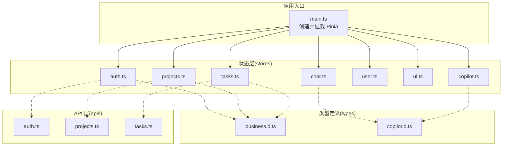
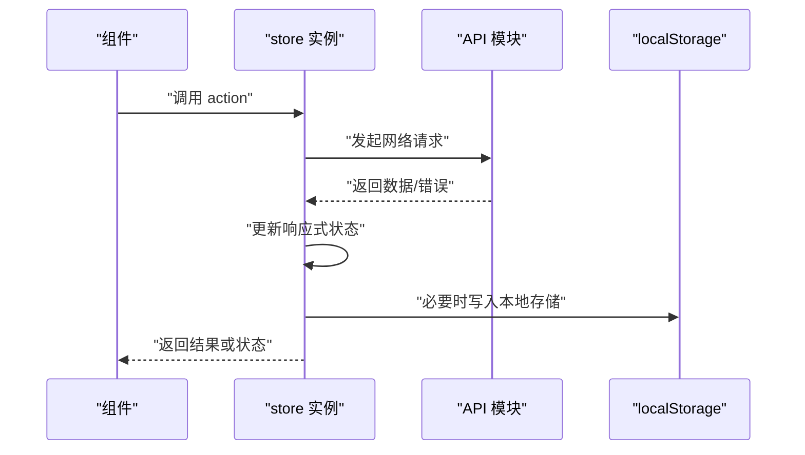
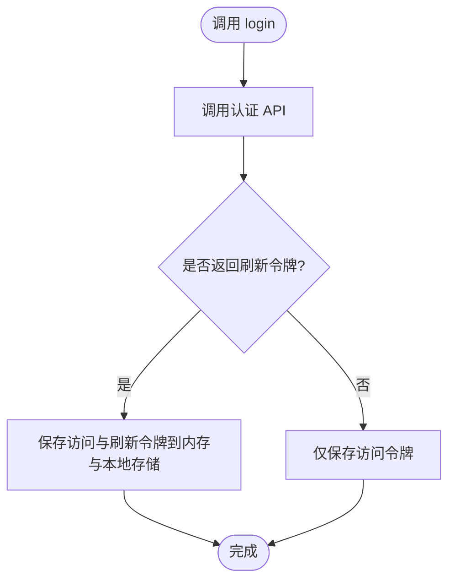
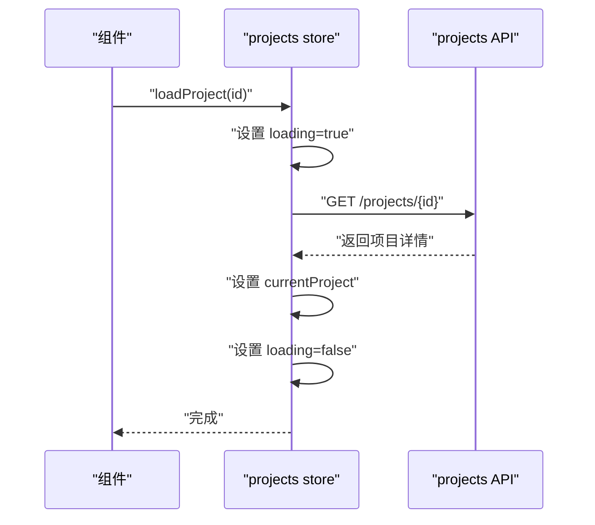
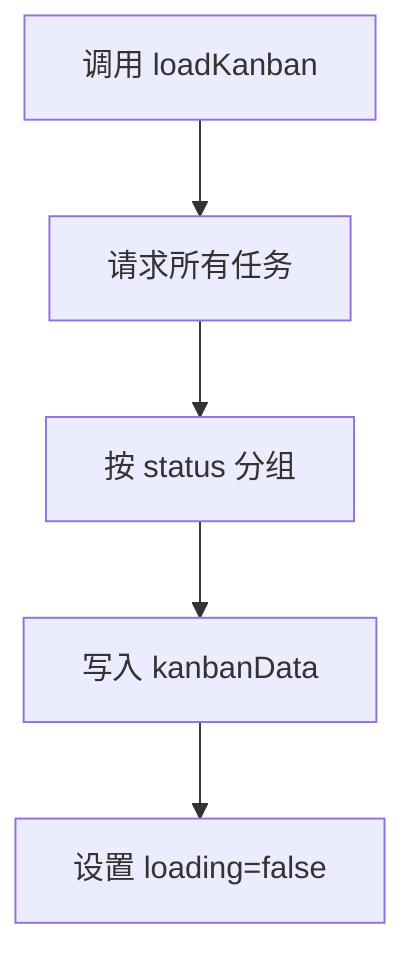
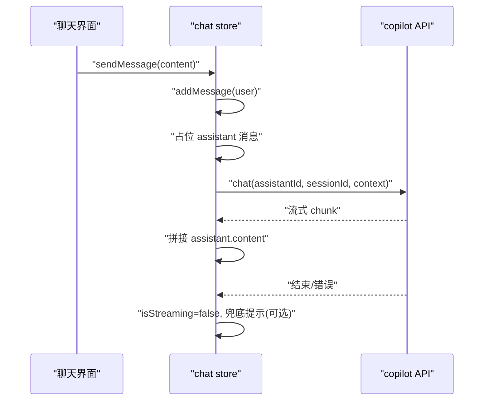
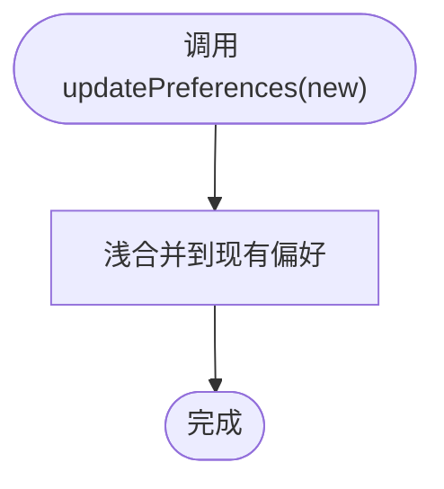
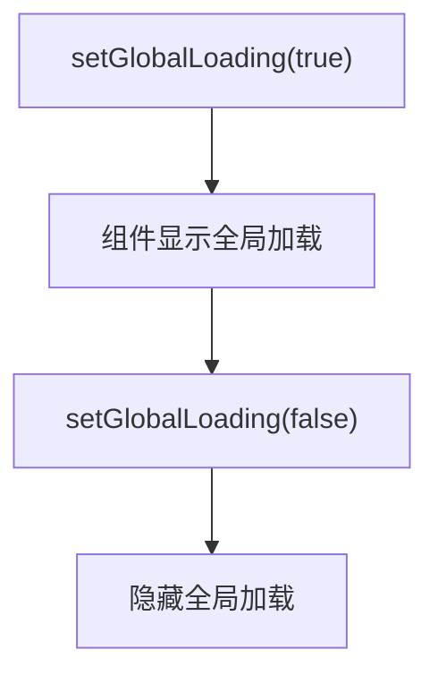
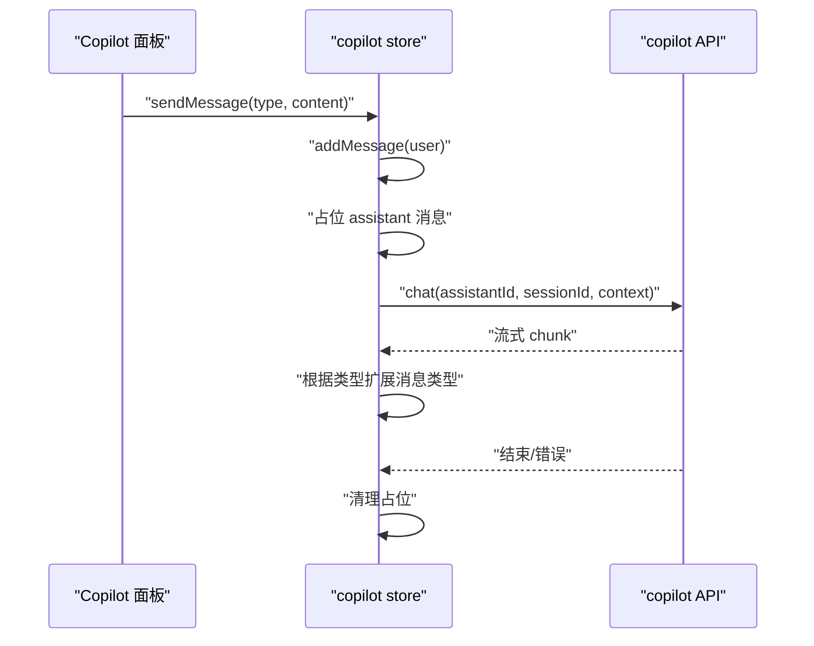
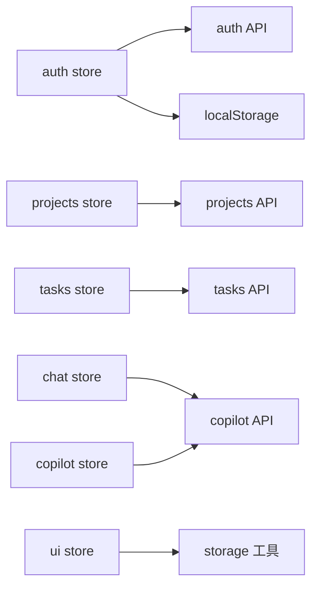

# 状态管理

<cite>
**本文引用的文件**
- [main.ts](file://workspace/web/src/main.ts)
- [auth.ts](file://workspace/web/src/stores/auth.ts)
- [projects.ts](file://workspace/web/src/stores/projects.ts)
- [tasks.ts](file://workspace/web/src/stores/tasks.ts)
- [chat.ts](file://workspace/web/src/stores/chat.ts)
- [user.ts](file://workspace/web/src/stores/user.ts)
- [ui.ts](file://workspace/web/src/stores/ui.ts)
- [copilot.ts](file://workspace/web/src/stores/copilot.ts)
- [business.d.ts](file://workspace/web/src/types/business.d.ts)
- [copilot.d.ts](file://workspace/web/src/types/copilot.d.ts)
- [auth.ts](file://workspace/web/src/apis/modules/auth.ts)
- [projects.ts](file://workspace/web/src/apis/modules/projects.ts)
- [tasks.ts](file://workspace/web/src/apis/modules/tasks.ts)
- [storage.ts](file://workspace/web/src/utils/storage.ts)
- [useMention.ts](file://workspace/web/src/composables/useMention.ts)
</cite>

## 目录
1. [简介](#简介)
2. [项目结构](#项目结构)
3. [核心组件](#核心组件)
4. [架构总览](#架构总览)
5. [详细组件分析](#详细组件分析)
6. [依赖分析](#依赖分析)
7. [性能考虑](#性能考虑)
8. [故障排查指南](#故障排查指南)
9. [结论](#结论)
10. [附录](#附录)

## 简介
本文件面向FDE工作台的前端状态管理，系统性梳理基于 Pinia 的状态设计与实现，覆盖 store 的组织结构与模块化管理、各 store 的功能职责、状态定义与 actions/getters 使用方式、状态持久化策略、状态同步机制与跨组件共享实践，并提供调试技巧与性能优化建议。目标是帮助开发者快速理解并高效维护状态层。

## 项目结构
- 状态层位于 workspace/web/src/stores，采用“按领域划分”的模块化组织：认证(auth)、项目(projects)、任务(tasks)、聊天(chat)、用户(user)、UI(ui)、Copilot(copilot)。
- 应用在入口处统一注册 Pinia，随后通过组件内组合式 API 调用对应 store。
- 类型定义集中在 workspace/web/src/types 下，确保业务实体与消息体的强类型约束。

图表来源
- [main.ts:13-24](file://workspace/web/src/main.ts#L13-L24)
- [auth.ts:1-56](file://workspace/web/src/stores/auth.ts#L1-L56)
- [projects.ts:1-102](file://workspace/web/src/stores/projects.ts#L1-L102)
- [tasks.ts:1-85](file://workspace/web/src/stores/tasks.ts#L1-L85)
- [chat.ts:1-147](file://workspace/web/src/stores/chat.ts#L1-L147)
- [user.ts:1-36](file://workspace/web/src/stores/user.ts#L1-L36)
- [ui.ts:1-86](file://workspace/web/src/stores/ui.ts#L1-L86)
- [copilot.ts:1-184](file://workspace/web/src/stores/copilot.ts#L1-L184)
- [business.d.ts:1-156](file://workspace/web/src/types/business.d.ts#L1-L156)
- [copilot.d.ts:1-42](file://workspace/web/src/types/copilot.d.ts#L1-L42)
- [auth.ts:1-14](file://workspace/web/src/apis/modules/auth.ts#L1-L14)
- [projects.ts:1-20](file://workspace/web/src/apis/modules/projects.ts#L1-L20)
- [tasks.ts:1-44](file://workspace/web/src/apis/modules/tasks.ts#L1-L44)

章节来源
- [main.ts:13-24](file://workspace/web/src/main.ts#L13-L24)
- [business.d.ts:1-156](file://workspace/web/src/types/business.d.ts#L1-L156)
- [copilot.d.ts:1-42](file://workspace/web/src/types/copilot.d.ts#L1-L42)

## 核心组件
- 认证状态(auth store)
  - 职责：登录、登出、令牌刷新、用户信息缓存；提供认证态计算属性。
  - 关键点：本地存储令牌与用户信息；封装登录/刷新/登出流程。
- 项目状态(projects store)
  - 职责：项目列表、当前项目详情、成员、里程碑、加载与错误状态管理；提供活跃项目过滤器。
  - 关键点：围绕项目 CRUD 与查询接口封装；更新时同步当前项目。
- 任务状态(tasks store)
  - 职责：任务列表、看板数据分组、加载与错误状态、统计指标；提供总数与完成数。
  - 关键点：看板视图的数据聚合；批量更新与删除。
- 聊天状态(chat store)
  - 职责：自由/任务/报告三种模式；消息流式接收；上下文与引用管理；会话清理。
  - 关键点：与 Copilot API 的流式交互；根据模式映射到不同助手。
- 用户状态(user store)
  - 职责：偏好设置与系统设置；提供更新方法。
  - 关键点：默认值与可选字段；浅合并更新。
- UI状态(ui store)
  - 职责：主题、侧边栏、Copilot 面板可见性、全局加载、通知；提供计算属性。
  - 关键点：通知去重与时间戳；全局加载开关。
- Copilot状态(copilot store)
  - 职责：多助手会话隔离的消息管理；待确认动作；会话清理；执行/取消动作。
  - 关键点：按助手类型维护独立消息与会话 ID；流式消息拼接与类型扩展。

章节来源
- [auth.ts:6-56](file://workspace/web/src/stores/auth.ts#L6-L56)
- [projects.ts:6-102](file://workspace/web/src/stores/projects.ts#L6-L102)
- [tasks.ts:6-85](file://workspace/web/src/stores/tasks.ts#L6-L85)
- [chat.ts:13-147](file://workspace/web/src/stores/chat.ts#L13-L147)
- [user.ts:4-36](file://workspace/web/src/stores/user.ts#L4-L36)
- [ui.ts:4-86](file://workspace/web/src/stores/ui.ts#L4-L86)
- [copilot.ts:15-184](file://workspace/web/src/stores/copilot.ts#L15-L184)

## 架构总览
- 状态持久化：auth store 将访问令牌与刷新令牌写入 localStorage；ui store 提供统一的本地存储工具（带前缀）用于更细粒度的键空间隔离。
- 状态同步：各 store 在加载/变更时更新本地响应式状态；组件通过组合式 API 访问 store 实例，实现跨组件共享。
- 数据流：组件触发 actions -> store 调用 API -> 更新本地状态 -> 视图响应。

图表来源
- [auth.ts:14-42](file://workspace/web/src/stores/auth.ts#L14-L42)
- [storage.ts:10-37](file://workspace/web/src/utils/storage.ts#L10-L37)

## 详细组件分析

### 认证状态(auth store)
- 状态定义
  - 令牌与刷新令牌：字符串或空，初始从 localStorage 读取。
  - 用户信息：用户对象或空。
  - 认证态：基于令牌存在性的计算属性。
- Actions
  - 登录(login)：调用认证 API，成功后写入访问与刷新令牌。
  - 刷新(refresh)：使用刷新令牌换取新令牌，失败抛错。
  - 登出(logout)：清空令牌与用户信息，移除本地存储项。
  - 设置令牌(setToken)：同时更新内存与本地存储。
  - 设置用户(setUser)：仅更新内存中的用户信息。
- Getters
  - 认证态(isAuthenticated/isLoggedIn)：基于令牌存在性。
- 持久化策略
  - 令牌持久化：localStorage；退出登录时清除。
- 同步机制
  - 组件通过组合式 API 获取 store 实例，直接读取令牌与用户信息，实现跨页面共享。

图表来源
- [auth.ts:23-34](file://workspace/web/src/stores/auth.ts#L23-L34)
- [auth.ts:14-21](file://workspace/web/src/stores/auth.ts#L14-L21)

章节来源
- [auth.ts:6-56](file://workspace/web/src/stores/auth.ts#L6-L56)
- [auth.ts:1-14](file://workspace/web/src/apis/modules/auth.ts#L1-L14)

### 项目状态(projects store)
- 状态定义
  - 项目列表、当前项目、成员列表、里程碑列表、加载与错误标志。
  - 过滤器：活跃项目（交付/发现阶段）。
- Actions
  - 加载列表(loadProjects)：发起请求，填充列表，处理异常，收尾关闭加载。
  - 加载详情(loadProject)：获取单个项目详情。
  - 加载成员(loadMembers)：获取项目成员。
  - 加载里程碑(loadMilestones)：从项目详情中提取里程碑。
  - 创建/更新/删除(create/update/delete)：与后端交互，同步内存状态。
- 同步机制
  - 更新当前项目时，若命中当前项目则同步更新；删除时如为目标项目则清空当前项目。

图表来源
- [projects.ts:31-40](file://workspace/web/src/stores/projects.ts#L31-L40)
- [projects.ts:18-29](file://workspace/web/src/stores/projects.ts#L18-L29)

章节来源
- [projects.ts:6-102](file://workspace/web/src/stores/projects.ts#L6-L102)
- [projects.ts:1-20](file://workspace/web/src/apis/modules/projects.ts#L1-L20)

### 任务状态(tasks store)
- 状态定义
  - 任务列表、看板分组数据、加载与错误、总数。
  - Getters：任务总数、已完成数量。
- Actions
  - 加载列表(loadTasks)：请求任务列表，更新 items 与 total。
  - 看板加载(loadKanban)：拉取全部任务并按状态分组。
  - 创建/更新/删除(create/update/delete)：与后端交互并同步内存。
- 同步机制
  - 批量更新状态与批量指派均通过后端批量接口提升效率。

图表来源
- [tasks.ts:32-49](file://workspace/web/src/stores/tasks.ts#L32-L49)

章节来源
- [tasks.ts:6-85](file://workspace/web/src/stores/tasks.ts#L6-L85)
- [tasks.ts:1-44](file://workspace/web/src/apis/modules/tasks.ts#L1-L44)

### 聊天状态(chat store)
- 状态定义
  - 消息数组、模式(free/task/report)、会话 ID、引用列表、上下文、流式状态。
- Actions
  - 发送消息(sendMessage)：添加用户消息与占位助理消息，映射模式到助手 ID，流式更新内容，结束时补全空内容提示。
  - 模式切换(setMode)、上下文(setContext)、引用管理(add/remove/clearReferences)、会话清理(clearMessages)。
- 同步机制
  - 流式回调中定位当前占位消息并增量拼接；错误回调兜底提示。

图表来源
- [chat.ts:55-128](file://workspace/web/src/stores/chat.ts#L55-L128)

章节来源
- [chat.ts:13-147](file://workspace/web/src/stores/chat.ts#L13-L147)

### 用户状态(user store)
- 状态定义
  - 偏好设置：语言、时区、日期格式、通知开关。
  - 系统设置：主题、侧边栏折叠、Copilot 可见性。
- Actions
  - 更新偏好(updatePreferences)、更新设置(updateSettings)：浅合并新值。
- 同步机制
  - 组件读取响应式偏好与设置，自动响应变更。

图表来源
- [user.ts:22-28](file://workspace/web/src/stores/user.ts#L22-L28)

章节来源
- [user.ts:4-36](file://workspace/web/src/stores/user.ts#L4-L36)

### UI状态(ui store)
- 状态定义
  - 主题(light/dark)、侧边栏折叠、Copilot 面板可见性、全局加载、通知队列。
  - 计算属性：copilotOpen。
- Actions
  - 主题切换、侧边栏折叠控制、Copilot 可见性切换、全局加载开关、通知增删清空。
- 同步机制
  - 通知去重与时间戳生成；全局加载用于骨架屏与遮罩控制。

图表来源
- [ui.ts:48-50](file://workspace/web/src/stores/ui.ts#L48-L50)

章节来源
- [ui.ts:4-86](file://workspace/web/src/stores/ui.ts#L4-L86)

### Copilot状态(copilot store)
- 状态定义
  - 多助手消息字典、会话 ID 字典、待确认动作。
- Actions
  - 获取消息(getMessages)、获取会话(getSessionId)、添加消息(addMessage)。
  - 发送消息(sendMessage)：按助手类型映射到后端助手 ID，流式更新消息，支持 action/report/searchResults/nextSteps 等消息类型扩展。
  - 执行动作(executeAction)：调用后端动作执行接口，成功后向相关助手注入成功消息。
  - 取消动作(cancelAction)：清空待确认动作。
  - 清理会话(clearSession)：清空指定助手消息并重置会话 ID。
- 同步机制
  - 按助手类型隔离消息与会话，避免跨助手污染；流式回调中定位当前占位消息并增量拼接。

图表来源
- [copilot.ts:48-137](file://workspace/web/src/stores/copilot.ts#L48-L137)

章节来源
- [copilot.ts:15-184](file://workspace/web/src/stores/copilot.ts#L15-L184)

## 依赖分析
- store 与 API 的耦合
  - 各 store 通过对应的 API 模块发起请求，保持清晰的边界。
- store 与类型定义
  - business.d.ts 与 copilot.d.ts 为 store 提供强类型支撑，降低运行期风险。
- store 与本地存储
  - auth store 直接使用 localStorage；ui store 提供带前缀的本地存储工具，便于扩展其他持久化场景。
- 组件与 store
  - 组件通过组合式 API 获取 store 实例，实现跨组件共享与解耦。

图表来源
- [auth.ts:14-42](file://workspace/web/src/stores/auth.ts#L14-L42)
- [storage.ts:10-37](file://workspace/web/src/utils/storage.ts#L10-L37)
- [business.d.ts:1-156](file://workspace/web/src/types/business.d.ts#L1-L156)
- [copilot.d.ts:1-42](file://workspace/web/src/types/copilot.d.ts#L1-L42)

章节来源
- [auth.ts:1-14](file://workspace/web/src/apis/modules/auth.ts#L1-L14)
- [projects.ts:1-20](file://workspace/web/src/apis/modules/projects.ts#L1-L20)
- [tasks.ts:1-44](file://workspace/web/src/apis/modules/tasks.ts#L1-L44)
- [storage.ts:1-57](file://workspace/web/src/utils/storage.ts#L1-L57)

## 性能考虑
- 网络请求与状态更新
  - 在加载开始时设置 loading，在 finally 中统一关闭，避免重复渲染与闪烁。
- 数据聚合与计算
  - 看板视图在 store 内部聚合，减少组件重复计算；注意大数据量时的分页与节流。
- 流式渲染
  - chat 与 copilot store 的流式回调中仅更新当前占位消息，避免全量重绘。
- 本地存储
  - auth store 使用 localStorage 存储令牌；ui store 的 storage 工具提供统一序列化与前缀隔离，适合扩展更多持久化键。
- 通知与全局加载
  - ui store 的通知队列与全局加载开关应避免频繁触发，必要时进行节流/防抖。

## 故障排查指南
- 登录/刷新失败
  - 检查 refresh token 是否存在；确认后端返回的令牌是否正确写入本地存储。
- 任务看板无数据
  - 确认 loadKanban 是否被调用；检查 status 字段是否符合预期。
- Copilot 动作未执行
  - 确认 pendingAction 是否存在；executeAction 的调用是否成功；执行后是否向相关助手注入了成功消息。
- 聊天消息不更新
  - 检查流式回调中的消息定位逻辑；确认 assistant 占位消息 ID 是否正确。
- 通知不消失
  - 检查通知 id 与移除逻辑；确认是否重复添加相同 id 的通知。

章节来源
- [auth.ts:29-34](file://workspace/web/src/stores/auth.ts#L29-L34)
- [tasks.ts:32-49](file://workspace/web/src/stores/tasks.ts#L32-L49)
- [copilot.ts:139-161](file://workspace/web/src/stores/copilot.ts#L139-L161)
- [chat.ts:94-127](file://workspace/web/src/stores/chat.ts#L94-L127)
- [ui.ts:52-65](file://workspace/web/src/stores/ui.ts#L52-L65)

## 结论
本状态管理方案以 Pinia 为核心，采用模块化 store 设计，围绕业务域划分职责，结合强类型定义与本地存储策略，实现了认证、项目、任务、聊天、用户、UI 与 Copilot 的完整状态闭环。通过清晰的 actions/getters 与流式更新机制，保证了跨组件共享与高性能渲染。建议在后续迭代中进一步完善分页与缓存策略，并持续优化流式渲染与通知体验。

## 附录
- 状态持久化最佳实践
  - 令牌类敏感数据优先使用安全存储或短期内存存储；非敏感配置可使用带前缀的本地存储工具。
- 调试技巧
  - 使用浏览器开发工具观察 store 响应式状态变化；在关键 action 入口打印日志；利用 getters 快速验证过滤/聚合结果。
- 性能优化建议
  - 对高频更新的列表进行分页与虚拟滚动；对流式渲染进行节流；对通知与全局加载进行去抖；对大对象序列化进行压缩或懒加载。