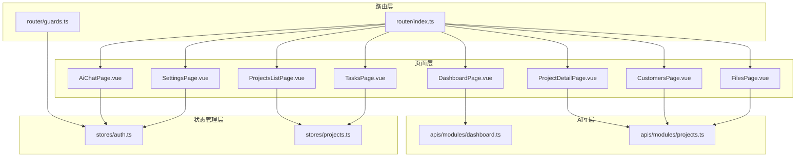
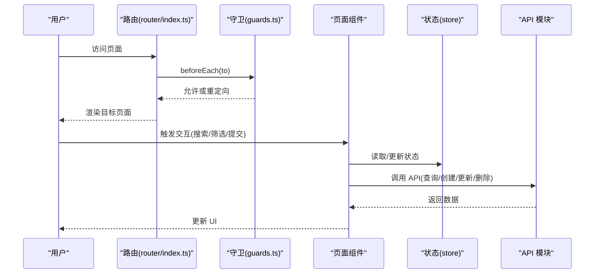
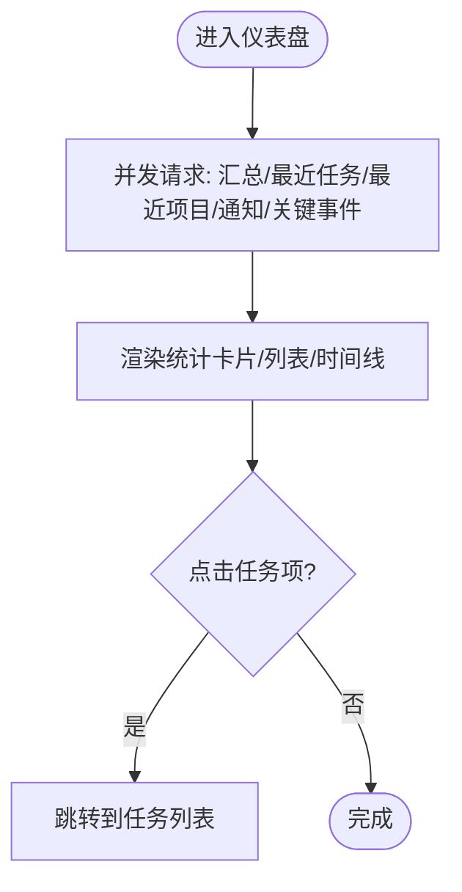
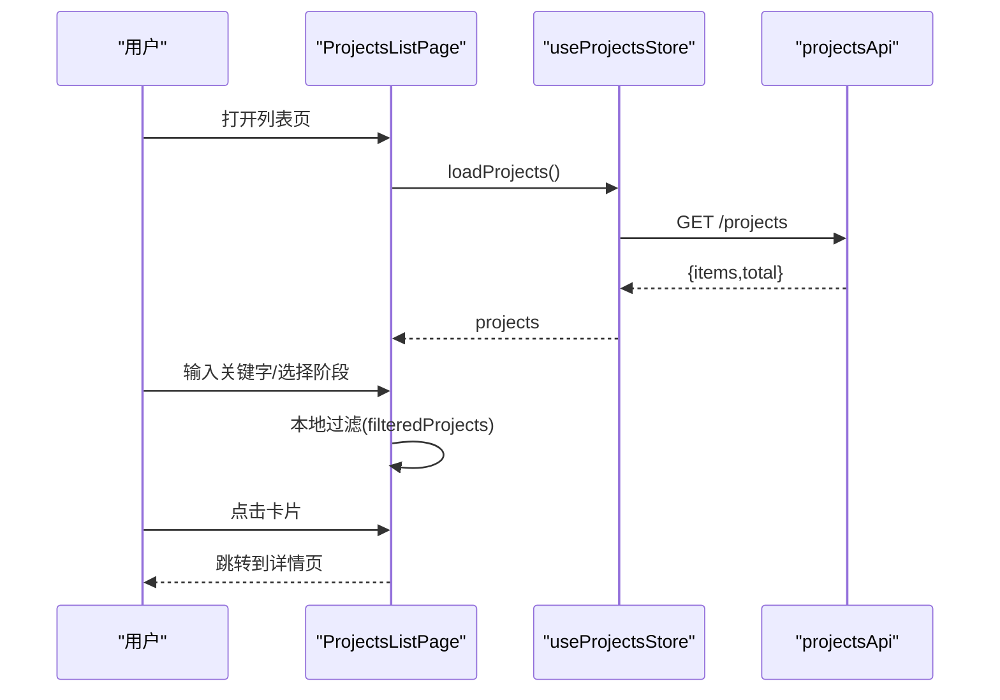
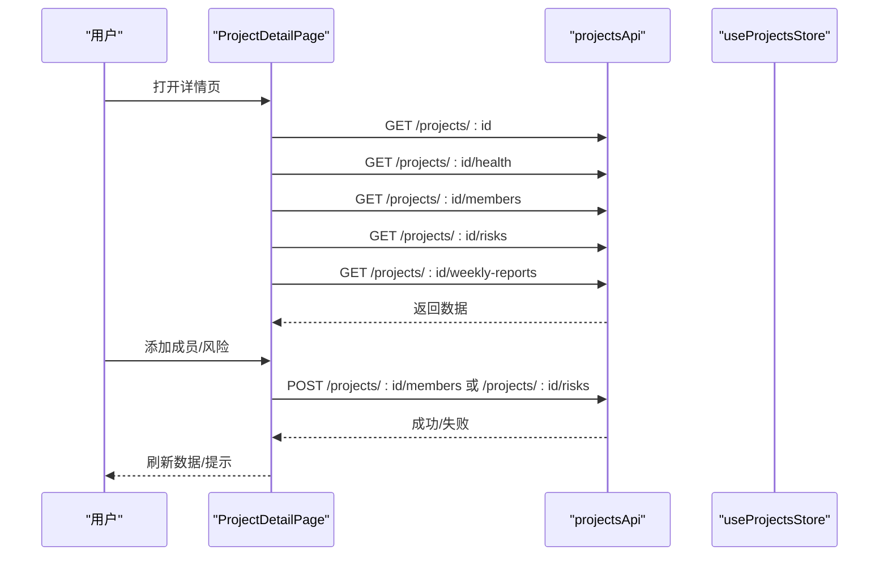
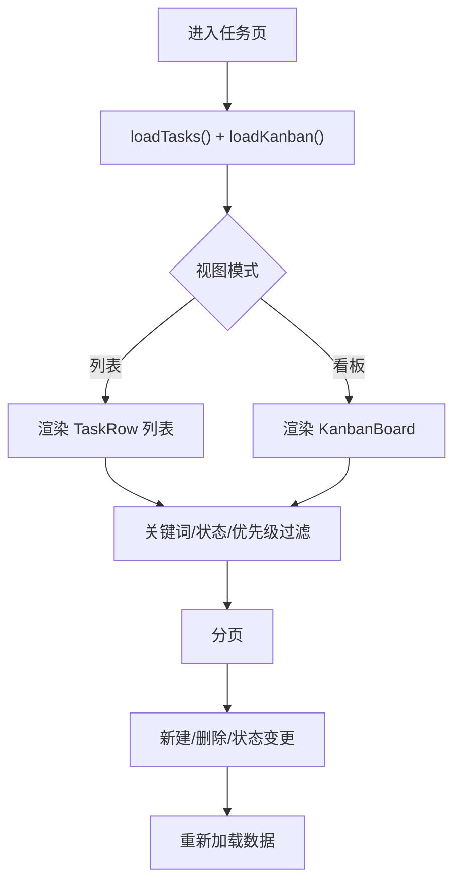
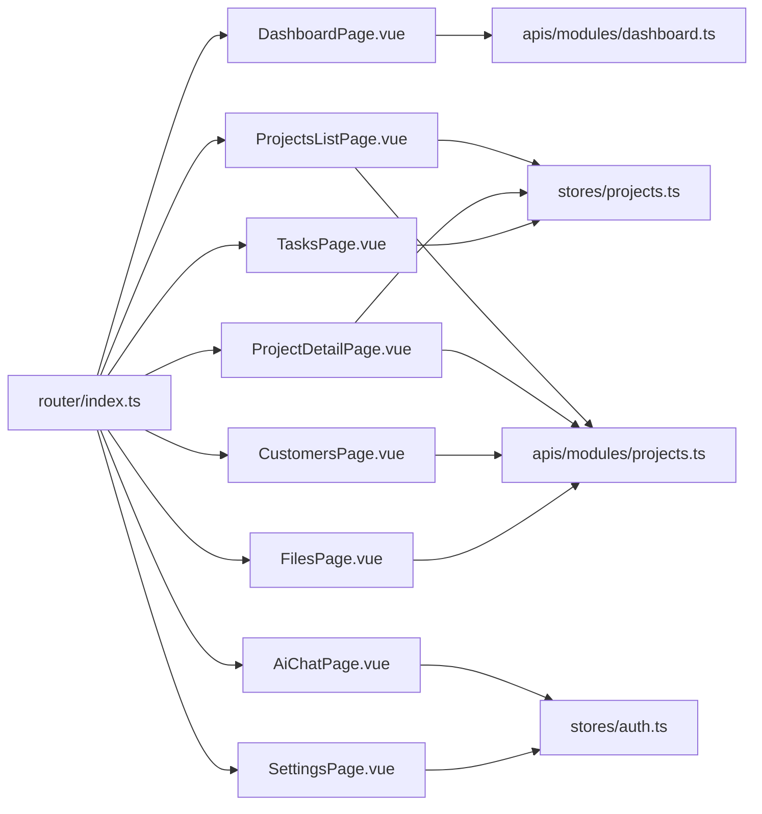

# 页面组件

<cite>
**本文引用的文件**
- [DashboardPage.vue](file://workspace/web/src/pages/dashboard/DashboardPage.vue)
- [ProjectsListPage.vue](file://workspace/web/src/pages/projects/ProjectsListPage.vue)
- [ProjectDetailPage.vue](file://workspace/web/src/pages/projects/ProjectDetailPage.vue)
- [TasksPage.vue](file://workspace/web/src/pages/tasks/TasksPage.vue)
- [CustomersPage.vue](file://workspace/web/src/pages/customers/CustomersPage.vue)
- [FilesPage.vue](file://workspace/web/src/pages/files/FilesPage.vue)
- [AiChatPage.vue](file://workspace/web/src/pages/chat/AiChatPage.vue)
- [SettingsPage.vue](file://workspace/web/src/pages/settings/SettingsPage.vue)
- [router/index.ts](file://workspace/web/src/router/index.ts)
- [router/guards.ts](file://workspace/web/src/router/guards.ts)
- [stores/auth.ts](file://workspace/web/src/stores/auth.ts)
- [stores/projects.ts](file://workspace/web/src/stores/projects.ts)
- [types/business.d.ts](file://workspace/web/src/types/business.d.ts)
- [apis/modules/dashboard.ts](file://workspace/web/src/apis/modules/dashboard.ts)
- [apis/modules/projects.ts](file://workspace/web/src/apis/modules/projects.ts)
</cite>

## 目录
1. [简介](#简介)
2. [项目结构](#项目结构)
3. [核心组件](#核心组件)
4. [架构总览](#架构总览)
5. [详细组件分析](#详细组件分析)
6. [依赖关系分析](#依赖关系分析)
7. [性能考量](#性能考量)
8. [故障排查指南](#故障排查指南)
9. [结论](#结论)
10. [附录](#附录)

## 简介
本文件面向 FDE 工作台的页面组件，系统性梳理并解释以下业务页面的设计与实现：仪表盘页面（DashboardPage）、项目管理页面（ProjectDetailPage、ProjectsListPage）、任务管理页面（TasksPage）、客户管理页面（CustomersPage）、文件管理页面（FilesPage）、Copilot 聊天页面（AiChatPage）以及设置页面（SettingsPage）。内容涵盖各页面的功能特性、数据流设计、用户交互模式、路由配置与导航守卫、页面级状态管理与数据获取策略，并辅以可视化图表帮助理解。

## 项目结构
工作台前端采用 Vue 3 + TypeScript + Ant Design Vue 技术栈，页面位于 workspace/web/src/pages 下，按业务域划分；路由集中于 workspace/web/src/router，页面级状态管理使用 Pinia Store；API 层通过统一 http 客户端封装，按模块化组织。

**图表来源**
- [router/index.ts:1-34](file://workspace/web/src/router/index.ts#L1-L34)
- [router/guards.ts:1-22](file://workspace/web/src/router/guards.ts#L1-L22)
- [DashboardPage.vue:1-286](file://workspace/web/src/pages/dashboard/DashboardPage.vue#L1-L286)
- [ProjectsListPage.vue:1-330](file://workspace/web/src/pages/projects/ProjectsListPage.vue#L1-L330)
- [ProjectDetailPage.vue:1-459](file://workspace/web/src/pages/projects/ProjectDetailPage.vue#L1-L459)
- [TasksPage.vue:1-384](file://workspace/web/src/pages/tasks/TasksPage.vue#L1-L384)
- [CustomersPage.vue:1-345](file://workspace/web/src/pages/customers/CustomersPage.vue#L1-L345)
- [FilesPage.vue:1-316](file://workspace/web/src/pages/files/FilesPage.vue#L1-L316)
- [AiChatPage.vue:1-301](file://workspace/web/src/pages/chat/AiChatPage.vue#L1-L301)
- [SettingsPage.vue:1-66](file://workspace/web/src/pages/settings/SettingsPage.vue#L1-L66)
- [stores/auth.ts:1-56](file://workspace/web/src/stores/auth.ts#L1-L56)
- [stores/projects.ts:1-102](file://workspace/web/src/stores/projects.ts#L1-L102)
- [apis/modules/dashboard.ts:1-24](file://workspace/web/src/apis/modules/dashboard.ts#L1-L24)
- [apis/modules/projects.ts:1-20](file://workspace/web/src/apis/modules/projects.ts#L1-L20)

**章节来源**
- [router/index.ts:1-34](file://workspace/web/src/router/index.ts#L1-L34)
- [router/guards.ts:1-22](file://workspace/web/src/router/guards.ts#L1-L22)

## 核心组件
- 仪表盘页面（DashboardPage）
  - 功能：聚合任务、项目、通知与关键事件，提供概览卡片与时间线展示。
  - 数据流：并行请求汇总统计、最近任务、最近项目、通知列表、关键事件，计算任务完成率并渲染。
  - 交互：点击任务项跳转到任务列表；加载态与空态处理。
- 项目管理页面
  - 列表页（ProjectsListPage）：支持搜索、多选阶段过滤、创建/删除项目；网格卡片展示健康度与阶段标签。
  - 详情页（ProjectDetailPage）：概览、成员、里程碑、风险、关联任务、周报与文件等 Tab；支持添加成员、添加风险、生成周报、健康度评分与颜色分级。
- 任务管理页面（TasksPage）
  - 功能：任务列表与看板双视图；支持关键词搜索、状态/优先级筛选、分页；支持新建/删除任务与状态变更。
  - 组件：KanbanBoard、TaskRow。
- 客户管理页面（CustomersPage）
  - 功能：客户列表与详情双栏布局；支持搜索与行业筛选；查看联系人与商机。
- 文件管理页面（FilesPage）
  - 功能：文件列表、树形目录、配额展示；支持搜索、单文件/批量删除、上传流程（含令牌申请与最终化）。
- Copilot 聊天页面（AiChatPage）
  - 功能：自由对话、任务对话、报告生成三模式；自动滚动、流式渲染提示。
- 设置页面（SettingsPage）
  - 功能：语言、主题、通知偏好设置；写入用户偏好与设置。

**章节来源**
- [DashboardPage.vue:1-286](file://workspace/web/src/pages/dashboard/DashboardPage.vue#L1-L286)
- [ProjectsListPage.vue:1-330](file://workspace/web/src/pages/projects/ProjectsListPage.vue#L1-L330)
- [ProjectDetailPage.vue:1-459](file://workspace/web/src/pages/projects/ProjectDetailPage.vue#L1-L459)
- [TasksPage.vue:1-384](file://workspace/web/src/pages/tasks/TasksPage.vue#L1-L384)
- [CustomersPage.vue:1-345](file://workspace/web/src/pages/customers/CustomersPage.vue#L1-L345)
- [FilesPage.vue:1-316](file://workspace/web/src/pages/files/FilesPage.vue#L1-L316)
- [AiChatPage.vue:1-301](file://workspace/web/src/pages/chat/AiChatPage.vue#L1-L301)
- [SettingsPage.vue:1-66](file://workspace/web/src/pages/settings/SettingsPage.vue#L1-L66)

## 架构总览
工作台页面遵循“路由驱动 + 页面级状态 + API 模块化”的架构模式：
- 路由层负责页面入口、嵌套布局与导航守卫；
- 页面层负责 UI 渲染、用户交互与本地状态；
- 状态管理层（Pinia）提供认证、项目等全局状态；
- API 层按模块封装 HTTP 请求，统一错误处理与响应格式。

**图表来源**
- [router/index.ts:1-34](file://workspace/web/src/router/index.ts#L1-L34)
- [router/guards.ts:1-22](file://workspace/web/src/router/guards.ts#L1-L22)
- [stores/auth.ts:1-56](file://workspace/web/src/stores/auth.ts#L1-L56)
- [stores/projects.ts:1-102](file://workspace/web/src/stores/projects.ts#L1-L102)
- [apis/modules/dashboard.ts:1-24](file://workspace/web/src/apis/modules/dashboard.ts#L1-L24)
- [apis/modules/projects.ts:1-20](file://workspace/web/src/apis/modules/projects.ts#L1-L20)

## 详细组件分析

### 仪表盘页面（DashboardPage）
- 设计要点
  - 使用统计卡片展示任务总数、已完成数量、活跃项目与任务完成率。
  - 最近任务列表与通知列表采用 Ant Design 的 List 组件，支持点击跳转。
  - 关键事件使用 Timeline 展示类型与时间。
- 数据流
  - 进入页面时并发拉取汇总、最近任务、最近项目、通知与关键事件，计算完成率并渲染。
- 用户交互
  - 点击任务项触发路由跳转至任务列表；加载态与空态友好提示。
- 性能与可用性
  - 并行请求减少首屏等待；空数据时显示占位文本。

**图表来源**
- [DashboardPage.vue:28-48](file://workspace/web/src/pages/dashboard/DashboardPage.vue#L28-L48)

**章节来源**
- [DashboardPage.vue:1-286](file://workspace/web/src/pages/dashboard/DashboardPage.vue#L1-L286)
- [apis/modules/dashboard.ts:17-23](file://workspace/web/src/apis/modules/dashboard.ts#L17-L23)

### 项目管理页面（ProjectsListPage 与 ProjectDetailPage）

#### 列表页（ProjectsListPage）
- 功能特性
  - 支持关键字搜索与阶段多选过滤；网格卡片展示项目名称、负责人、健康度与阶段标签。
  - 提供创建项目弹窗，包含名称与描述字段。
- 数据流
  - 使用项目仓库（useProjectsStore）加载项目列表，本地过滤后渲染。
- 交互细节
  - 卡片点击跳转详情；删除前二次确认；加载态覆盖列表区域。

**图表来源**
- [ProjectsListPage.vue:53-71](file://workspace/web/src/pages/projects/ProjectsListPage.vue#L53-L71)
- [stores/projects.ts:18-29](file://workspace/web/src/stores/projects.ts#L18-L29)
- [apis/modules/projects.ts:6](file://workspace/web/src/apis/modules/projects.ts#L6)

**章节来源**
- [ProjectsListPage.vue:1-330](file://workspace/web/src/pages/projects/ProjectsListPage.vue#L1-L330)
- [stores/projects.ts:1-102](file://workspace/web/src/stores/projects.ts#L1-L102)
- [apis/modules/projects.ts:1-20](file://workspace/web/src/apis/modules/projects.ts#L1-L20)

#### 详情页（ProjectDetailPage）
- 功能特性
  - 多 Tab 结构：概览、成员、里程碑、风险、关联任务、周报、文件。
  - 成员管理：添加/移除成员；风险添加；周报生成与时间线展示。
  - 健康度评分分级与颜色标注。
- 数据流
  - 并行请求项目详情、健康度、成员、风险、周报；里程碑从项目对象中提取。
- 交互细节
  - 添加成员/风险弹窗；生成周报后刷新数据；返回按钮跳转列表。

**图表来源**
- [ProjectDetailPage.vue:93-115](file://workspace/web/src/pages/projects/ProjectDetailPage.vue#L93-L115)
- [ProjectDetailPage.vue:117-172](file://workspace/web/src/pages/projects/ProjectDetailPage.vue#L117-L172)
- [apis/modules/projects.ts:7-18](file://workspace/web/src/apis/modules/projects.ts#L7-L18)

**章节来源**
- [ProjectDetailPage.vue:1-459](file://workspace/web/src/pages/projects/ProjectDetailPage.vue#L1-L459)
- [apis/modules/projects.ts:1-20](file://workspace/web/src/apis/modules/projects.ts#L1-L20)

### 任务管理页面（TasksPage）
- 功能特性
  - 双视图：列表与看板；支持关键词、状态、优先级筛选；分页加载。
  - 新建/删除任务；拖拽或下拉切换任务状态。
- 数据流
  - 使用任务仓库加载任务与看板数据；本地过滤与分页控制。
- 交互细节
  - 筛选器与重置；分页按钮；状态变更后刷新数据。

**图表来源**
- [TasksPage.vue:189-202](file://workspace/web/src/pages/tasks/TasksPage.vue#L189-L202)
- [TasksPage.vue:37-54](file://workspace/web/src/pages/tasks/TasksPage.vue#L37-L54)

**章节来源**
- [TasksPage.vue:1-384](file://workspace/web/src/pages/tasks/TasksPage.vue#L1-L384)

### 客户管理页面（CustomersPage）
- 功能特性
  - 左右双栏：客户列表与详情；支持搜索与行业筛选。
  - 详情包含基本信息、联系人、商机。
- 数据流
  - 列表一次性加载；选择客户后并行加载详情、联系人与商机。
- 交互细节
  - 删除前二次确认；详情面板粘性定位。

**章节来源**
- [CustomersPage.vue:1-345](file://workspace/web/src/pages/customers/CustomersPage.vue#L1-L345)

### 文件管理页面（FilesPage）
- 功能特性
  - 文件列表、树形目录、存储配额；支持搜索、单文件/批量删除、自定义上传流程。
- 数据流
  - 并行加载文件列表、树与配额；列渲染包含图标、标签与操作按钮。
- 交互细节
  - 上传流程：申请令牌 -> 上传 -> 最终化；删除后刷新。

**章节来源**
- [FilesPage.vue:1-316](file://workspace/web/src/pages/files/FilesPage.vue#L1-L316)

### Copilot 聊天页面（AiChatPage）
- 功能特性
  - 自由对话、任务对话、报告生成三种模式；消息自动滚动；流式渲染。
- 数据流
  - 通过聊天 Store 管理消息与发送状态；根据 Tab 切换模式。
- 交互细节
  - 输入框支持多行与回车发送；清空对话；欢迎语与建议按钮。

**章节来源**
- [AiChatPage.vue:1-301](file://workspace/web/src/pages/chat/AiChatPage.vue#L1-L301)

### 设置页面（SettingsPage）
- 功能特性
  - 语言、主题、通知开关；写入用户偏好与设置。
- 数据流
  - 从用户 Store 读取当前设置，提交后调用更新接口并提示保存成功。

**章节来源**
- [SettingsPage.vue:1-66](file://workspace/web/src/pages/settings/SettingsPage.vue#L1-L66)

## 依赖关系分析
- 路由与页面
  - 路由配置在 router/index.ts 中声明，children 定义嵌套页面；meta 字段用于标题与 Copilot 标识；导航守卫在 guards.ts 中实现。
- 页面与状态
  - 项目列表/详情依赖 useProjectsStore；认证状态来自 useAuthStore。
- 页面与 API
  - 各页面通过对应模块 API（如 projectsApi、dashboardApi）访问后端接口；类型定义集中在 types/business.d.ts。

**图表来源**
- [router/index.ts:4-27](file://workspace/web/src/router/index.ts#L4-L27)
- [stores/projects.ts:1-102](file://workspace/web/src/stores/projects.ts#L1-L102)
- [stores/auth.ts:1-56](file://workspace/web/src/stores/auth.ts#L1-L56)
- [apis/modules/dashboard.ts:17-23](file://workspace/web/src/apis/modules/dashboard.ts#L17-L23)
- [apis/modules/projects.ts:5-18](file://workspace/web/src/apis/modules/projects.ts#L5-L18)

**章节来源**
- [router/index.ts:1-34](file://workspace/web/src/router/index.ts#L1-L34)
- [router/guards.ts:1-22](file://workspace/web/src/router/guards.ts#L1-L22)
- [stores/projects.ts:1-102](file://workspace/web/src/stores/projects.ts#L1-L102)
- [stores/auth.ts:1-56](file://workspace/web/src/stores/auth.ts#L1-L56)
- [types/business.d.ts:1-156](file://workspace/web/src/types/business.d.ts#L1-L156)

## 性能考量
- 并行请求优化
  - 仪表盘与项目详情均采用 Promise.all 并行拉取多个数据源，缩短首屏等待。
- 本地过滤与分页
  - 列表页在客户端进行搜索与筛选，减少无效网络请求；任务页支持分页加载。
- 加载态与空态
  - 使用 Spin 包裹关键区域，避免闪烁；空数据时提供友好文案。
- 上传流程
  - 文件上传采用令牌申请与最终化两步，确保安全与一致性。

[本节为通用指导，无需特定文件引用]

## 故障排查指南
- 登录与权限
  - 导航守卫会拦截未登录用户的受保护页面并重定向至登录页；已登录用户访问登录页则重定向至工作台。
- 错误提示
  - 创建/删除/更新等操作失败时，页面通过消息提示反馈；必要时可检查网络面板与后端日志。
- 数据不刷新
  - 操作成功后需主动刷新数据（如生成周报后重新加载），或依赖仓库更新逻辑。
- 上传失败
  - 检查上传令牌申请与最终化流程是否成功；确认 OSS 配置与鉴权。

**章节来源**
- [router/guards.ts:4-21](file://workspace/web/src/router/guards.ts#L4-L21)
- [ProjectDetailPage.vue:331-334](file://workspace/web/src/pages/projects/ProjectDetailPage.vue#L331-L334)
- [FilesPage.vue:162-190](file://workspace/web/src/pages/files/FilesPage.vue#L162-L190)

## 结论
FDE 工作台页面组件围绕“路由驱动 + 页面级状态 + 模块化 API”构建，具备清晰的数据流与良好的用户体验：并行加载提升首屏性能、本地过滤降低后端压力、统一守卫保障访问安全。后续可在以下方面持续优化：统一错误边界与重试机制、引入缓存策略、增强可访问性与国际化支持。

[本节为总结性内容，无需特定文件引用]

## 附录
- 类型定义参考
  - 业务实体类型集中在 types/business.d.ts，涵盖用户、任务、项目、客户、文件、最佳实践、SOP、学习路径与周报等。
- API 接口参考
  - dashboardApi 提供仪表盘汇总、最近任务、最近项目、通知与关键事件接口。
  - projectsApi 提供项目 CRUD、成员管理、健康度、风险、周报与生成等接口。

**章节来源**
- [types/business.d.ts:1-156](file://workspace/web/src/types/business.d.ts#L1-L156)
- [apis/modules/dashboard.ts:17-23](file://workspace/web/src/apis/modules/dashboard.ts#L17-L23)
- [apis/modules/projects.ts:5-18](file://workspace/web/src/apis/modules/projects.ts#L5-L18)