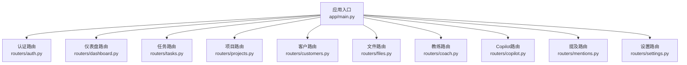
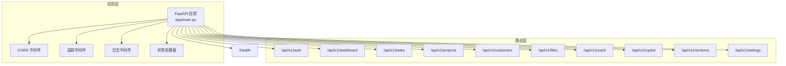
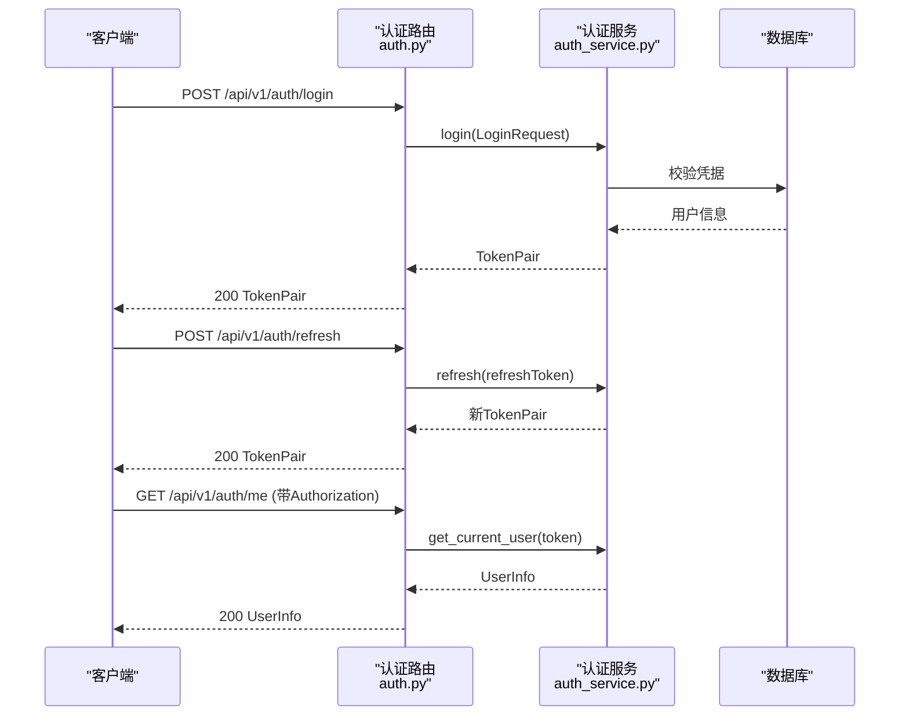
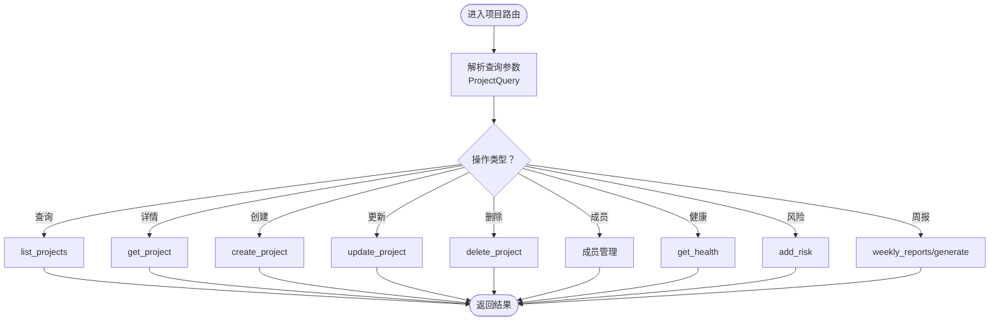
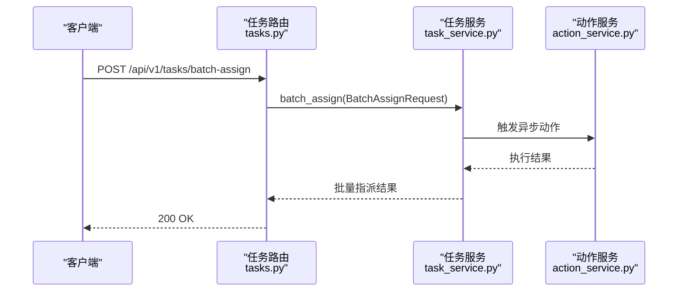
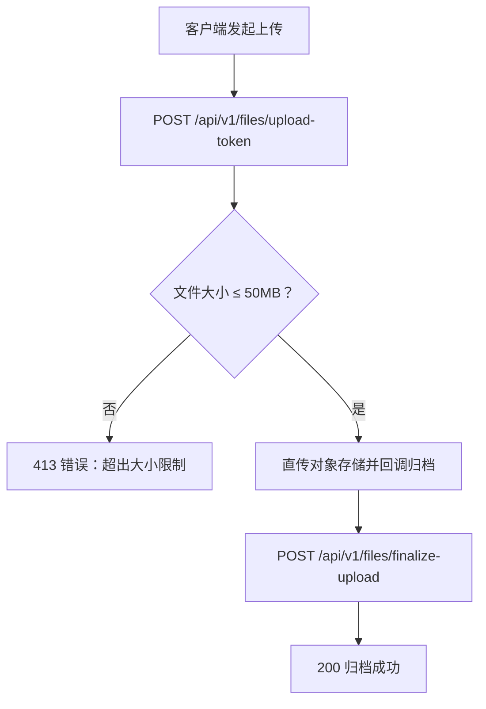
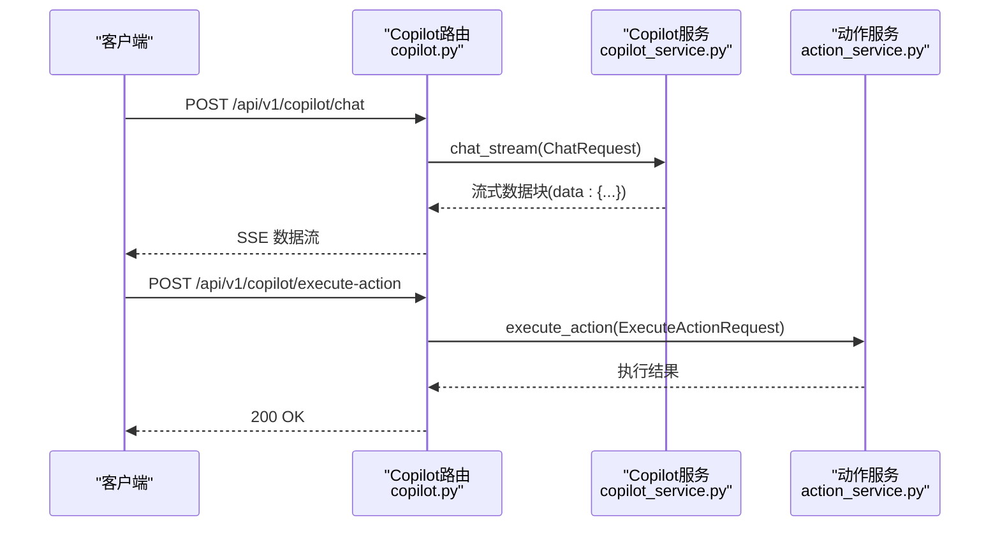
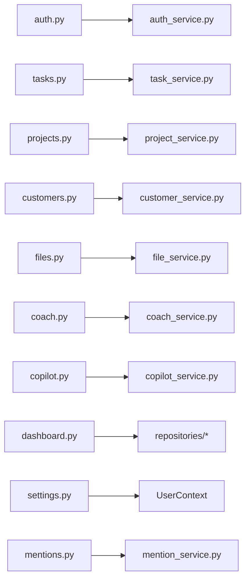

# API路由设计

<cite>
**本文引用的文件**
- [workspace/api/app/main.py](file://workspace/api/app/main.py)
- [workspace/api/app/routers/auth.py](file://workspace/api/app/routers/auth.py)
- [workspace/api/app/routers/projects.py](file://workspace/api/app/routers/projects.py)
- [workspace/api/app/routers/tasks.py](file://workspace/api/app/routers/tasks.py)
- [workspace/api/app/routers/customers.py](file://workspace/api/app/routers/customers.py)
- [workspace/api/app/routers/files.py](file://workspace/api/app/routers/files.py)
- [workspace/api/app/routers/coach.py](file://workspace/api/app/routers/coach.py)
- [workspace/api/app/routers/copilot.py](file://workspace/api/app/routers/copilot.py)
- [workspace/api/app/routers/dashboard.py](file://workspace/api/app/routers/dashboard.py)
- [workspace/api/app/routers/settings.py](file://workspace/api/app/routers/settings.py)
- [workspace/api/app/routers/mentions.py](file://workspace/api/app/routers/mentions.py)
</cite>

## 目录
1. [简介](#简介)
2. [项目结构](#项目结构)
3. [核心组件](#核心组件)
4. [架构总览](#架构总览)
5. [详细组件分析](#详细组件分析)
6. [依赖分析](#依赖分析)
7. [性能考虑](#性能考虑)
8. [故障排查指南](#故障排查指南)
9. [结论](#结论)
10. [附录](#附录)

## 简介
本文件面向FDE工作台的API路由设计，系统化阐述RESTful API设计原则与路由组织方式，覆盖URL命名规范、HTTP方法使用、状态码标准、参数处理、查询解析、请求体校验、版本控制策略与向后兼容性保障，并提供各功能模块（认证、项目、任务、客户、文件、教练、Copilot、仪表盘、设置、提及搜索）的路由实现说明、调用序列与时序图、常见错误响应格式与API文档生成与测试策略。

## 项目结构
后端采用FastAPI应用入口集中注册路由前缀与标签，统一中间件与异常处理，按功能域划分路由器模块，每个模块负责对应业务域的资源操作与数据模型绑定。

图表来源
- [workspace/api/app/main.py:57-67](file://workspace/api/app/main.py#L57-L67)
- [workspace/api/app/routers/auth.py:1-43](file://workspace/api/app/routers/auth.py#L1-L43)
- [workspace/api/app/routers/dashboard.py:1-95](file://workspace/api/app/routers/dashboard.py#L1-L95)
- [workspace/api/app/routers/tasks.py:1-70](file://workspace/api/app/routers/tasks.py#L1-L70)
- [workspace/api/app/routers/projects.py:1-82](file://workspace/api/app/routers/projects.py#L1-L82)
- [workspace/api/app/routers/customers.py:1-62](file://workspace/api/app/routers/customers.py#L1-L62)
- [workspace/api/app/routers/files.py:1-86](file://workspace/api/app/routers/files.py#L1-L86)
- [workspace/api/app/routers/coach.py:1-103](file://workspace/api/app/routers/coach.py#L1-L103)
- [workspace/api/app/routers/copilot.py:1-137](file://workspace/api/app/routers/copilot.py#L1-L137)
- [workspace/api/app/routers/mentions.py:1-20](file://workspace/api/app/routers/mentions.py#L1-L20)
- [workspace/api/app/routers/settings.py:1-82](file://workspace/api/app/routers/settings.py#L1-L82)

章节来源
- [workspace/api/app/main.py:36-67](file://workspace/api/app/main.py#L36-L67)

## 核心组件
- 应用入口与生命周期：定义应用元信息、CORS、追踪与日志中间件、全局异常处理器，并注册所有业务路由前缀与标签。
- 路由器模块：按领域拆分，每个模块定义资源路径、HTTP方法、请求体/查询参数、响应模型与鉴权上下文注入。
- 中间件与异常：统一追踪ID注入、日志记录、CORS配置；异常处理器集中处理业务与通用错误。
- 版本控制：统一前缀/api/v1，便于未来升级时保留旧版本并逐步迁移。

章节来源
- [workspace/api/app/main.py:1-73](file://workspace/api/app/main.py#L1-L73)

## 架构总览
下图展示API版本前缀、路由模块与核心中间件的关系，以及健康检查端点。

图表来源
- [workspace/api/app/main.py:36-67](file://workspace/api/app/main.py#L36-L67)

## 详细组件分析

### 认证模块（/api/v1/auth）
- 设计要点
  - 使用Bearer Token鉴权，从请求头中提取令牌。
  - 支持登录、刷新、登出、获取当前用户信息。
  - 响应模型严格绑定Schema，确保输出一致性。
- 关键路由
  - POST /api/v1/auth/login：登录换取短期与长期令牌对。
  - POST /api/v1/auth/refresh：使用refreshToken刷新令牌。
  - POST /api/v1/auth/logout：登出清理会话。
  - GET /api/v1/auth/me：携带Authorization头获取当前用户信息。
- 参数与校验
  - 登录请求体：LoginRequest（用户名/密码等）。
  - 刷新请求体：RefreshRequest（refreshToken）。
  - 当前用户：从Authorization头解析Bearer Token。
- 错误与状态码
  - 登录失败/令牌无效：返回统一错误结构（包含业务码与消息）。
  - 成功：200 OK；登出：200 OK；获取用户：200 OK。
- 安全与合规
  - 登录与刷新接口不直接暴露敏感字段。
  - 刷新令牌仅在服务端校验，避免泄露。

图表来源
- [workspace/api/app/routers/auth.py:19-42](file://workspace/api/app/routers/auth.py#L19-L42)

章节来源
- [workspace/api/app/routers/auth.py:1-43](file://workspace/api/app/routers/auth.py#L1-L43)

### 项目模块（/api/v1/projects）
- 设计要点
  - 资源路径：/api/v1/projects，支持分页查询、详情、创建、更新、删除。
  - 成员管理：支持成员列表、添加、移除。
  - 健康度与风险：提供健康度查询、风险登记。
  - 周报：支持查询与生成。
- 关键路由
  - GET /api/v1/projects：分页查询项目（Query参数）。
  - GET /api/v1/projects/{project_id}：获取项目详情。
  - POST /api/v1/projects：创建项目。
  - PUT /api/v1/projects/{project_id}：更新项目。
  - DELETE /api/v1/projects/{project_id}：删除项目。
  - GET /api/v1/projects/{project_id}/members：列出成员。
  - POST /api/v1/projects/{project_id}/members：添加成员。
  - DELETE /api/v1/projects/{project_id}/members/{user_id}：移除成员。
  - GET /api/v1/projects/{project_id}/health：项目健康度。
  - POST /api/v1/projects/{project_id}/risks：登记风险。
  - GET /api/v1/projects/{project_id}/weekly-reports：周报列表。
  - POST /api/v1/projects/{project_id}/weekly-reports：生成周报。
- 参数与校验
  - 查询参数：ProjectQuery（过滤/排序/分页）。
  - 请求体：ProjectCreate/ProjectUpdate/RiskCreate等。
  - 路径参数：project_id、user_id。
- 错误与状态码
  - 资源不存在：404。
  - 权限不足：403。
  - 参数非法：422。
  - 成功：200；删除：204。

图表来源
- [workspace/api/app/routers/projects.py:24-82](file://workspace/api/app/routers/projects.py#L24-L82)

章节来源
- [workspace/api/app/routers/projects.py:1-82](file://workspace/api/app/routers/projects.py#L1-L82)

### 任务模块（/api/v1/tasks）
- 设计要点
  - 支持批量状态更新与批量指派。
  - 历史记录查询，便于审计与回溯。
- 关键路由
  - GET /api/v1/tasks：分页查询任务。
  - GET /api/v1/tasks/{task_id}：获取任务详情。
  - POST /api/v1/tasks：创建任务。
  - PUT /api/v1/tasks/{task_id}：更新任务。
  - DELETE /api/v1/tasks/{task_id}：删除任务。
  - POST /api/v1/tasks/batch-update-status：批量更新状态。
  - POST /api/v1/tasks/batch-assign：批量指派。
  - GET /api/v1/tasks/{task_id}/history：任务历史。
- 参数与校验
  - 查询参数：TaskQuery。
  - 请求体：TaskCreate/TaskUpdate/BatchUpdateStatusRequest/BatchAssignRequest。
  - 路径参数：task_id。
- 错误与状态码
  - 成功：200；批量操作：200；删除：204。

图表来源
- [workspace/api/app/routers/tasks.py:57-69](file://workspace/api/app/routers/tasks.py#L57-L69)

章节来源
- [workspace/api/app/routers/tasks.py:1-70](file://workspace/api/app/routers/tasks.py#L1-L70)

### 客户模块（/api/v1/customers）
- 设计要点
  - 客户主数据管理，支持联系人与商机关联。
- 关键路由
  - GET /api/v1/customers：分页查询客户。
  - GET /api/v1/customers/{customer_id}：获取客户详情。
  - POST /api/v1/customers：创建客户。
  - PUT /api/v1/customers/{customer_id}：更新客户。
  - DELETE /api/v1/customers/{customer_id}：删除客户。
  - GET /api/v1/customers/{customer_id}/contacts：联系人列表。
  - POST /api/v1/customers/{customer_id}/contacts：添加联系人。
  - GET /api/v1/customers/{customer_id}/opportunities：商机列表。
- 参数与校验
  - 查询参数：CustomerQuery。
  - 请求体：CustomerCreate/Update等。
  - 路径参数：customer_id。
- 错误与状态码
  - 成功：200；删除：204。

章节来源
- [workspace/api/app/routers/customers.py:1-62](file://workspace/api/app/routers/customers.py#L1-L62)

### 文件模块（/api/v1/files）
- 设计要点
  - 分布式上传流程：获取上传令牌、直传对象存储、服务端归档。
  - 文件树与配额查询。
  - 批量删除。
- 关键路由
  - GET /api/v1/files：分页查询文件。
  - GET /api/v1/files/tree：文件树。
  - GET /api/v1/files/quota：配额信息。
  - GET /api/v1/files/{file_id}：文件元信息。
  - GET /api/v1/files/{file_id}/download：下载地址。
  - POST /api/v1/files/upload-token：获取上传令牌（含大小校验）。
  - POST /api/v1/files/finalize-upload：完成上传归档。
  - DELETE /api/v1/files/{file_id}：删除文件。
  - POST /api/v1/files/batch-delete：批量删除。
- 参数与校验
  - 查询参数：FileQuery。
  - 请求体：UploadTokenRequest/FinalizeUploadRequest/BatchDeleteRequest。
  - 路径参数：file_id。
  - 上传大小限制：50MB，超限返回413与统一错误结构。
- 错误与状态码
  - 上传超限：413 Payload Too Large。
  - 成功：200；删除：204。

图表来源
- [workspace/api/app/routers/files.py:59-85](file://workspace/api/app/routers/files.py#L59-L85)

章节来源
- [workspace/api/app/routers/files.py:1-86](file://workspace/api/app/routers/files.py#L1-L86)

### 教练模块（/api/v1/coach）
- 设计要点
  - 最佳实践、SOP、学习路径、专家推荐与进度管理。
  - 评分与下载能力。
- 关键路由
  - GET /api/v1/coach/best-practices：最佳实践列表。
  - GET /api/v1/coach/best-practices/{practice_id}：最佳实践详情。
  - POST /api/v1/coach/best-practices/{practice_id}/rating：评分。
  - GET /api/v1/coach/sops：SOP列表。
  - GET /api/v1/coach/sops/{sop_id}：SOP详情。
  - GET /api/v1/coach/sops/{sop_id}/download：SOP下载。
  - GET /api/v1/coach/learning-paths：学习路径列表。
  - GET /api/v1/coach/learning-paths/{path_id}：学习路径详情。
  - POST /api/v1/coach/learning-paths/{path_id}/progress：更新章节进度。
  - GET /api/v1/coach/recommendations：个性化推荐。
  - GET /api/v1/coach/categories：分类列表（Mock）。
  - GET /api/v1/coach/experts：专家列表（Mock）。
- 参数与校验
  - 路径参数：practice_id/sop_id/path_id。
  - 请求体：RatePracticeRequest。
- 错误与状态码
  - 成功：200；下载：200；Mock数据：200。

章节来源
- [workspace/api/app/routers/coach.py:1-103](file://workspace/api/app/routers/coach.py#L1-L103)

### Copilot模块（/api/v1/copilot）
- 设计要点
  - SSE流式对话：/api/v1/copilot/chat 与 /api/v1/copilot/query。
  - 会话管理：列出、查询、删除会话。
  - 动作预览/执行/取消：预览工具调用结果、执行动作、取消进行中的动作。
  - 反馈提交：通用反馈接口。
- 关键路由
  - POST /api/v1/copilot/chat：SSE流式聊天。
  - POST /api/v1/copilot/query：单轮问答SSE。
  - GET /api/v1/copilot/sessions：会话列表。
  - GET /api/v1/copilot/sessions/{session_id}：会话详情。
  - DELETE /api/v1/copilot/sessions/{session_id}：删除会话。
  - POST /api/v1/copilot/preview-action：预览动作。
  - POST /api/v1/copilot/execute-action：执行动作。
  - POST /api/v1/copilot/cancel-action：取消动作。
  - POST /api/v1/copilot/feedback：提交反馈。
- 参数与校验
  - 请求体：ChatRequest/PreviewActionRequest/ExecuteActionRequest。
  - 路径参数：session_id。
- 错误与状态码
  - 成功：200；SSE：200；异常：SSE中返回错误事件。

图表来源
- [workspace/api/app/routers/copilot.py:29-136](file://workspace/api/app/routers/copilot.py#L29-L136)

章节来源
- [workspace/api/app/routers/copilot.py:1-137](file://workspace/api/app/routers/copilot.py#L1-L137)

### 仪表盘模块（/api/v1/dashboard）
- 设计要点
  - 汇总统计：任务数、项目数、客户数、待办任务。
  - 近期任务、近期项目、通知占位、关键事件（按天数窗口）。
- 关键路由
  - GET /api/v1/dashboard/summary：汇总统计。
  - GET /api/v1/dashboard/recent-tasks：近期任务。
  - GET /api/v1/dashboard/recent-projects：近期项目。
  - GET /api/v1/dashboard/notifications：通知（占位）。
  - GET /api/v1/dashboard/key-events：关键事件（可选days参数）。
- 参数与校验
  - days：Query参数，范围1-365，默认7。
  - limit：Query参数，用于近期列表。
- 错误与状态码
  - 成功：200。

章节来源
- [workspace/api/app/routers/dashboard.py:1-95](file://workspace/api/app/routers/dashboard.py#L1-L95)

### 设置模块（/api/v1/settings）
- 设计要点
  - 个人信息、密码、通知偏好、AI模型偏好。
- 关键路由
  - GET /api/v1/settings/profile：获取个人资料。
  - PUT /api/v1/settings/profile：更新个人资料。
  - PUT /api/v1/settings/password：修改密码。
  - GET /api/v1/settings/notifications：获取通知偏好。
  - PUT /api/v1/settings/notifications：更新通知偏好。
  - GET /api/v1/settings/ai-models：获取AI模型列表与首选项。
  - PUT /api/v1/settings/ai-models：设置首选AI模型。
- 参数与校验
  - 请求体：ProfileUpdate/PasswordChange/NotificationSettings/AIModelSettings。
- 错误与状态码
  - 成功：200。

章节来源
- [workspace/api/app/routers/settings.py:1-82](file://workspace/api/app/routers/settings.py#L1-L82)

### 提及搜索模块（/api/v1/mentions）
- 设计要点
  - 全局提及搜索，支持类型过滤与数量限制。
- 关键路由
  - GET /api/v1/mentions/search：q（关键字）、type（类型枚举）、limit（默认10）。
- 参数与校验
  - q：必须；type：可选；limit：默认10。
- 错误与状态码
  - 成功：200。

章节来源
- [workspace/api/app/routers/mentions.py:1-20](file://workspace/api/app/routers/mentions.py#L1-L20)

## 依赖分析
- 组件耦合
  - 路由器仅负责参数解析与调用服务层，仓库层与服务层解耦良好。
  - 服务层通过依赖注入获取数据库会话与Redis客户端，职责清晰。
- 外部依赖
  - 对象存储客户端、企业集成（如钉钉、CRM、语雀）在服务层或工具层抽象，路由层透明。
- 版本与兼容
  - 所有路由统一前缀/api/v1，未来升级可在保持旧版本的同时新增/api/v2。

图表来源
- [workspace/api/app/routers/auth.py:1-43](file://workspace/api/app/routers/auth.py#L1-L43)
- [workspace/api/app/routers/tasks.py:1-70](file://workspace/api/app/routers/tasks.py#L1-L70)
- [workspace/api/app/routers/projects.py:1-82](file://workspace/api/app/routers/projects.py#L1-L82)
- [workspace/api/app/routers/customers.py:1-62](file://workspace/api/app/routers/customers.py#L1-L62)
- [workspace/api/app/routers/files.py:1-86](file://workspace/api/app/routers/files.py#L1-L86)
- [workspace/api/app/routers/coach.py:1-103](file://workspace/api/app/routers/coach.py#L1-L103)
- [workspace/api/app/routers/copilot.py:1-137](file://workspace/api/app/routers/copilot.py#L1-L137)
- [workspace/api/app/routers/dashboard.py:1-95](file://workspace/api/app/routers/dashboard.py#L1-L95)
- [workspace/api/app/routers/settings.py:1-82](file://workspace/api/app/routers/settings.py#L1-L82)
- [workspace/api/app/routers/mentions.py:1-20](file://workspace/api/app/routers/mentions.py#L1-L20)

## 性能考虑
- SSE长连接
  - Copilot聊天与查询使用SSE，需注意Nginx/反向代理的心跳与缓冲配置，确保实时性。
- 缓存与异步
  - 任务模块引入Redis动作服务，适合高并发的动作预览与执行。
- 分页与查询
  - 项目、任务、客户、文件均支持分页查询，建议结合索引优化数据库查询。
- 上传优化
  - 文件上传采用直传对象存储+服务端归档，降低服务端IO压力。

## 故障排查指南
- 常见错误响应格式
  - 上传超限：413，包含业务码与提示信息。
  - 参数校验失败：422，返回字段级错误摘要。
  - 未授权/令牌无效：401，需重新登录或刷新令牌。
  - 权限不足：403，检查用户角色与资源归属。
  - 资源不存在：404，检查ID是否正确。
- 排查步骤
  - 查看追踪ID（Trace ID）定位请求链路。
  - 检查CORS配置与跨域问题。
  - 确认鉴权头格式（Authorization: Bearer ...）。
  - 验证查询参数范围与必填字段。
  - 检查对象存储上传令牌有效期与签名。

章节来源
- [workspace/api/app/routers/files.py:62-69](file://workspace/api/app/routers/files.py#L62-L69)
- [workspace/api/app/main.py:54-55](file://workspace/api/app/main.py#L54-L55)

## 结论
本API路由设计遵循RESTful原则，采用统一版本前缀与清晰的资源路径命名，结合FastAPI的依赖注入与Pydantic校验，实现了高内聚、低耦合的服务层架构。通过SSE、分页查询、直传归档等手段兼顾了实时性与性能。建议后续完善OpenAPI文档生成与自动化测试，持续提升可观测性与质量保障。

## 附录
- API版本控制与兼容
  - 当前版本：/api/v1，未来新增功能可沿用相同前缀，或引入/api/v2并保留旧版本接口。
  - 升级策略：先发布新版本，标注废弃旧版本，提供迁移指引与过渡期。
- API文档生成与测试
  - 文档生成：利用FastAPI自动生成OpenAPI JSON/Swagger/Redoc，结合共享Protobuf/OpenAPI规范。
  - 测试策略：单元测试覆盖路由参数与Schema校验；集成测试覆盖端到端流程（登录、上传、Copilot对话、批量操作）；压测关注SSE与批量接口的吞吐与延迟。