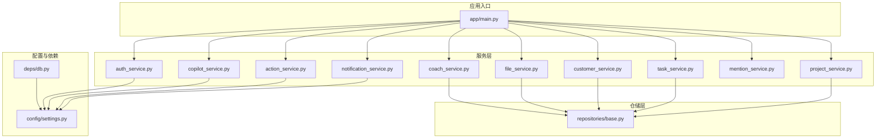
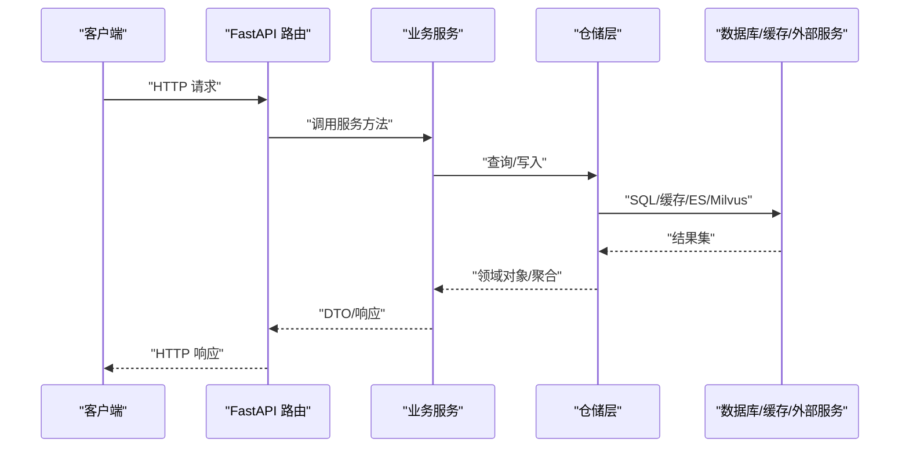
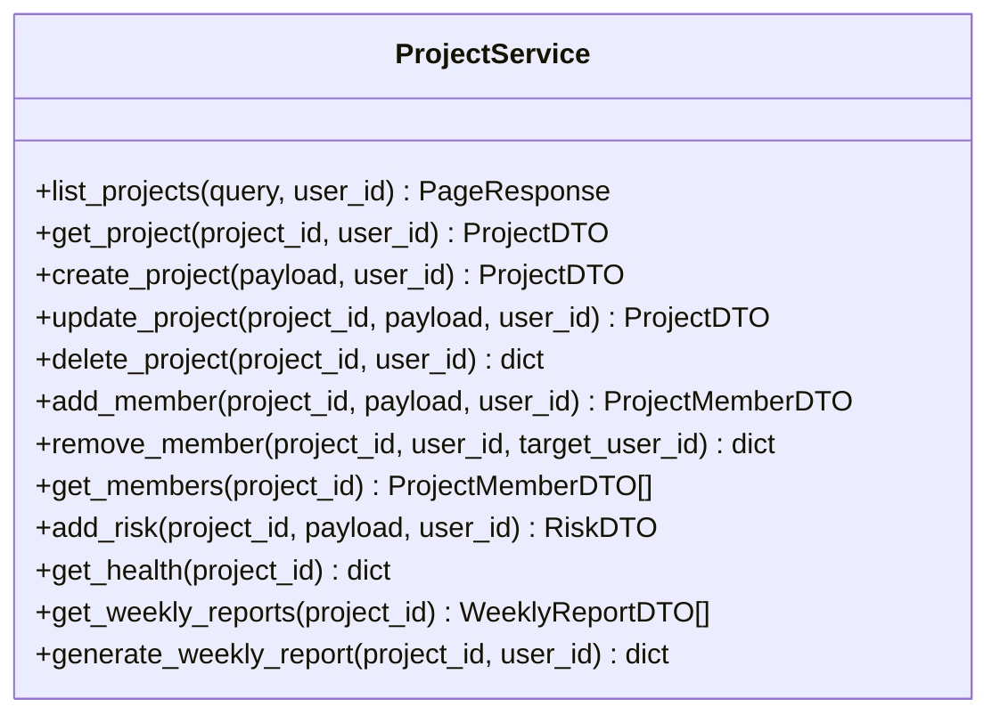
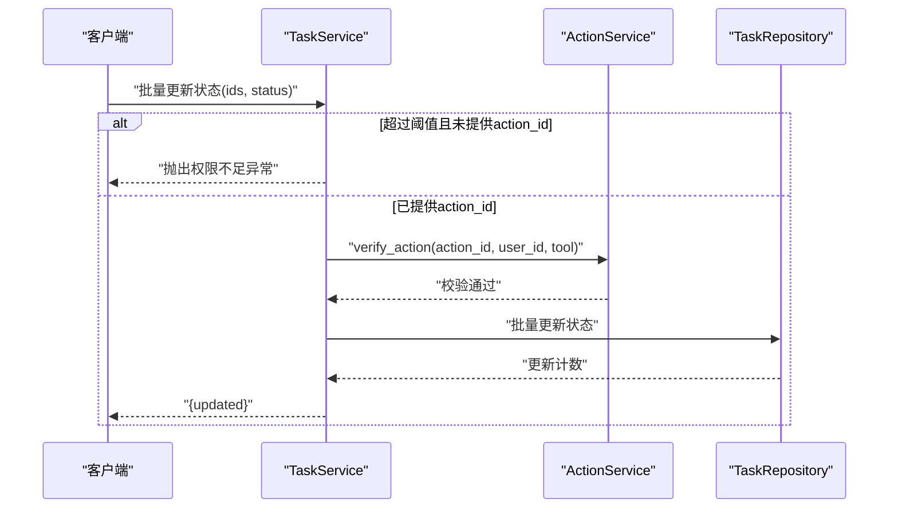
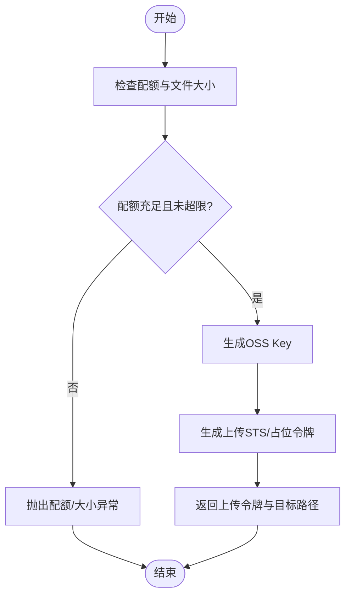
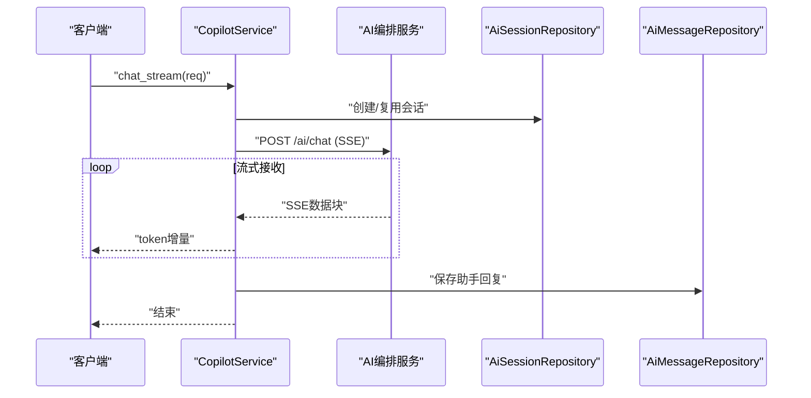
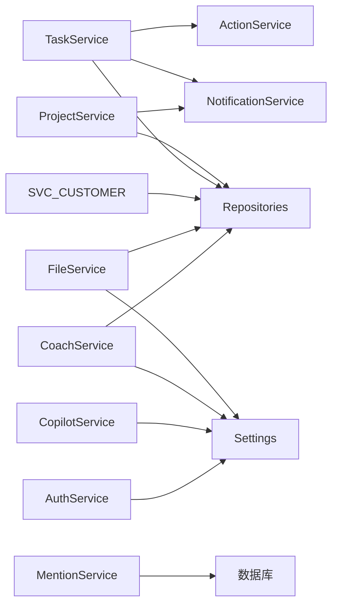

# 业务服务层

<cite>
**本文引用的文件**
- [workspace/api/app/services/project_service.py](file://workspace/api/app/services/project_service.py)
- [workspace/api/app/services/task_service.py](file://workspace/api/app/services/task_service.py)
- [workspace/api/app/services/customer_service.py](file://workspace/api/app/services/customer_service.py)
- [workspace/api/app/services/file_service.py](file://workspace/api/app/services/file_service.py)
- [workspace/api/app/services/coach_service.py](file://workspace/api/app/services/coach_service.py)
- [workspace/api/app/services/notification_service.py](file://workspace/api/app/services/notification_service.py)
- [workspace/api/app/services/action_service.py](file://workspace/api/app/services/action_service.py)
- [workspace/api/app/services/copilot_service.py](file://workspace/api/app/services/copilot_service.py)
- [workspace/api/app/services/mention_service.py](file://workspace/api/app/services/mention_service.py)
- [workspace/api/app/services/auth_service.py](file://workspace/api/app/services/auth_service.py)
- [workspace/api/app/repositories/base.py](file://workspace/api/app/repositories/base.py)
- [workspace/api/app/main.py](file://workspace/api/app/main.py)
- [workspace/api/app/deps/db.py](file://workspace/api/app/deps/db.py)
- [workspace/api/app/config/settings.py](file://workspace/api/app/config/settings.py)
</cite>

## 目录
1. [引言](#引言)
2. [项目结构](#项目结构)
3. [核心组件](#核心组件)
4. [架构总览](#架构总览)
5. [详细组件分析](#详细组件分析)
6. [依赖分析](#依赖分析)
7. [性能考虑](#性能考虑)
8. [故障排查指南](#故障排查指南)
9. [结论](#结论)
10. [附录](#附录)

## 引言
本文面向FDE工作台的业务服务层，系统化梳理服务层的设计模式与职责边界，覆盖业务逻辑封装、权限校验、事务管理、数据转换与DTO映射、以及服务间协作与调用链路。重点围绕以下核心服务展开：项目管理服务、任务管理服务、客户管理服务、文件管理服务、教练服务、通知服务，并补充动作确认（二次确认）服务、AI助理（Copilot）服务、提及检索服务与鉴权服务。文档同时提供扩展指南、性能优化建议与错误处理策略，帮助开发者在保持一致性的同时进行演进式开发。

## 项目结构
后端采用FastAPI + SQLAlchemy异步ORM + Pydantic模型的典型分层架构：
- 应用入口与路由注册：在应用入口集中注册各模块路由与中间件，统一异常处理。
- 服务层：按领域划分的服务类，负责业务编排、权限校验、事务控制与DTO转换。
- 仓储层：通用基类与具体实体仓储，提供通用CRUD与领域查询能力。
- 模型与Schema：SQLAlchemy模型与Pydantic输入输出模型，确保数据契约清晰。
- 配置与依赖：集中配置加载、数据库会话工厂与生命周期管理。

图表来源
- [workspace/api/app/main.py:1-73](file://workspace/api/app/main.py#L1-L73)
- [workspace/api/app/services/project_service.py:1-168](file://workspace/api/app/services/project_service.py#L1-L168)
- [workspace/api/app/services/task_service.py:1-127](file://workspace/api/app/services/task_service.py#L1-L127)
- [workspace/api/app/services/customer_service.py:1-116](file://workspace/api/app/services/customer_service.py#L1-L116)
- [workspace/api/app/services/file_service.py:1-127](file://workspace/api/app/services/file_service.py#L1-L127)
- [workspace/api/app/services/coach_service.py:1-102](file://workspace/api/app/services/coach_service.py#L1-L102)
- [workspace/api/app/services/notification_service.py:1-43](file://workspace/api/app/services/notification_service.py#L1-L43)
- [workspace/api/app/services/action_service.py:1-122](file://workspace/api/app/services/action_service.py#L1-L122)
- [workspace/api/app/services/copilot_service.py:1-111](file://workspace/api/app/services/copilot_service.py#L1-L111)
- [workspace/api/app/services/mention_service.py:1-68](file://workspace/api/app/services/mention_service.py#L1-L68)
- [workspace/api/app/services/auth_service.py:1-110](file://workspace/api/app/services/auth_service.py#L1-L110)
- [workspace/api/app/repositories/base.py:1-42](file://workspace/api/app/repositories/base.py#L1-L42)
- [workspace/api/app/config/settings.py:1-81](file://workspace/api/app/config/settings.py#L1-L81)
- [workspace/api/app/deps/db.py:1-64](file://workspace/api/app/deps/db.py#L1-L64)

章节来源
- [workspace/api/app/main.py:1-73](file://workspace/api/app/main.py#L1-L73)
- [workspace/api/app/config/settings.py:1-81](file://workspace/api/app/config/settings.py#L1-L81)
- [workspace/api/app/deps/db.py:1-64](file://workspace/api/app/deps/db.py#L1-L64)

## 核心组件
- 通用仓储基类：提供通用的获取、列表、创建与软删除等基础能力，降低重复代码。
- 业务服务类：以领域服务为中心，封装业务规则、权限校验、事务边界与DTO转换。
- 配置与依赖注入：集中管理数据库连接、Redis、外部集成等配置；通过依赖工厂提供会话与客户端实例。
- 异常与错误码：统一业务异常类型与错误码，便于前端与监控系统识别。

章节来源
- [workspace/api/app/repositories/base.py:1-42](file://workspace/api/app/repositories/base.py#L1-L42)
- [workspace/api/app/config/settings.py:1-81](file://workspace/api/app/config/settings.py#L1-L81)
- [workspace/api/app/deps/db.py:1-64](file://workspace/api/app/deps/db.py#L1-L64)

## 架构总览
服务层遵循“领域服务 + 仓储 + DTO”的分层模式，结合FastAPI路由与中间件，形成清晰的请求-服务-仓储-数据访问链路。下图展示服务层与外部依赖的关键交互：

图表来源
- [workspace/api/app/main.py:1-73](file://workspace/api/app/main.py#L1-L73)
- [workspace/api/app/services/project_service.py:1-168](file://workspace/api/app/services/project_service.py#L1-L168)
- [workspace/api/app/services/task_service.py:1-127](file://workspace/api/app/services/task_service.py#L1-L127)
- [workspace/api/app/services/customer_service.py:1-116](file://workspace/api/app/services/customer_service.py#L1-L116)
- [workspace/api/app/services/file_service.py:1-127](file://workspace/api/app/services/file_service.py#L1-L127)
- [workspace/api/app/services/coach_service.py:1-102](file://workspace/api/app/services/coach_service.py#L1-L102)
- [workspace/api/app/services/notification_service.py:1-43](file://workspace/api/app/services/notification_service.py#L1-L43)
- [workspace/api/app/services/action_service.py:1-122](file://workspace/api/app/services/action_service.py#L1-L122)
- [workspace/api/app/services/copilot_service.py:1-111](file://workspace/api/app/services/copilot_service.py#L1-L111)
- [workspace/api/app/services/mention_service.py:1-68](file://workspace/api/app/services/mention_service.py#L1-L68)
- [workspace/api/app/services/auth_service.py:1-110](file://workspace/api/app/services/auth_service.py#L1-L110)
- [workspace/api/app/repositories/base.py:1-42](file://workspace/api/app/repositories/base.py#L1-L42)
- [workspace/api/app/config/settings.py:1-81](file://workspace/api/app/config/settings.py#L1-L81)
- [workspace/api/app/deps/db.py:1-64](file://workspace/api/app/deps/db.py#L1-L64)

## 详细组件分析

### 项目管理服务（ProjectService）
职责与设计要点
- 查询与分页：支持关键字、阶段、所有者、查看者等多维过滤，返回分页DTO。
- 权限校验：仅项目成员或所有者可读取；仅所有者可写/删。
- 创建与成员管理：创建时自动添加所有者为成员；支持添加/移除成员。
- 风险与里程碑：支持新增风险与统计健康度（基于风险数量与逾期里程碑）。
- 周报：预留接口，当前占位。

事务与数据转换
- 使用嵌套事务保存创建与成员初始化，保证原子性。
- 统一使用DTO转换器，避免模型与接口耦合。

图表来源
- [workspace/api/app/services/project_service.py:18-168](file://workspace/api/app/services/project_service.py#L18-L168)

章节来源
- [workspace/api/app/services/project_service.py:1-168](file://workspace/api/app/services/project_service.py#L1-L168)

### 任务管理服务（TaskService）
职责与设计要点
- 查询与分页：支持关键字、状态、负责人、项目、优先级与查看者过滤。
- 权限校验：读权限包含创建者、负责人或项目成员；写权限包含创建者、负责人或项目所有者。
- 批量操作：批量更新状态需二次确认（ActionService），参数一致性校验防止越权。
- 历史记录：每次变更持久化历史，便于审计与回溯。

图表来源
- [workspace/api/app/services/task_service.py:82-94](file://workspace/api/app/services/task_service.py#L82-L94)
- [workspace/api/app/services/action_service.py:58-68](file://workspace/api/app/services/action_service.py#L58-L68)

章节来源
- [workspace/api/app/services/task_service.py:1-127](file://workspace/api/app/services/task_service.py#L1-L127)
- [workspace/api/app/services/action_service.py:1-122](file://workspace/api/app/services/action_service.py#L1-L122)

### 客户管理服务（CustomerService）
职责与设计要点
- 客户CRUD：名称、行业、规模等字段维护。
- 关联管理：支持新增联系人、列出联系人与商机。
- 数据转换：统一DTO映射，保证对外接口稳定。

章节来源
- [workspace/api/app/services/customer_service.py:1-116](file://workspace/api/app/services/customer_service.py#L1-L116)

### 文件管理服务（FileService）
职责与设计要点
- 列表与查询：支持作用域、关键词、扩展名、所有者等过滤。
- 权限校验：仅文件所有者可读写。
- 上传令牌：生成OSS直传凭证（占位），并校验配额与单文件大小。
- 下载链接：生成带有效期的下载地址（占位）。
- 配额与树形结构：统计使用量与配额，按作用域聚合文件树。

图表来源
- [workspace/api/app/services/file_service.py:64-82](file://workspace/api/app/services/file_service.py#L64-L82)

章节来源
- [workspace/api/app/services/file_service.py:1-127](file://workspace/api/app/services/file_service.py#L1-L127)

### 教练服务（CoachService）
职责与设计要点
- 最佳实践、SOP与学习路径的查询与详情。
- 访问计数：浏览最佳实践与SOP时增加计数。
- 学习路径进度：用户章节进度更新。
- 推荐：按用户维度推荐最佳实践、SOP与学习路径。

章节来源
- [workspace/api/app/services/coach_service.py:1-102](file://workspace/api/app/services/coach_service.py#L1-L102)

### 通知服务（NotificationService）
职责与设计要点
- 多通道通知：钉钉、邮件、站内信（占位）。
- 场景化通知：任务指派、项目更新、风险预警等。
- 错误降级：发送失败时记录日志并返回False，避免阻塞主流程。

章节来源
- [workspace/api/app/services/notification_service.py:1-43](file://workspace/api/app/services/notification_service.py#L1-L43)

### 动作确认服务（ActionService）
职责与设计要点
- 二次确认：stage/verify/execute/cancel四阶段，支持内存与Redis两种存储。
- TTL与安全：默认60秒过期，严格校验用户与工具名匹配。
- 参数一致性：执行前校验action参数与请求参数一致。

章节来源
- [workspace/api/app/services/action_service.py:1-122](file://workspace/api/app/services/action_service.py#L1-L122)

### Copilot服务（CopilotService）
职责与设计要点
- 流式对话：转发到AI编排服务，透传SSE流，同时保存会话与消息。
- 会话管理：创建、查询、删除会话；列出消息。
- 降级策略：当编排服务不可达时，返回模拟响应，保障可用性。

图表来源
- [workspace/api/app/services/copilot_service.py:21-56](file://workspace/api/app/services/copilot_service.py#L21-L56)
- [workspace/api/app/services/copilot_service.py:90-111](file://workspace/api/app/services/copilot_service.py#L90-L111)

章节来源
- [workspace/api/app/services/copilot_service.py:1-111](file://workspace/api/app/services/copilot_service.py#L1-L111)

### 提及服务（MentionService）
职责与设计要点
- 多类型搜索：任务、项目、客户、文件、案例五类对象的标题模糊匹配。
- 组合返回：按类型分别查询并合并，限制每类上限。

章节来源
- [workspace/api/app/services/mention_service.py:1-68](file://workspace/api/app/services/mention_service.py#L1-L68)

### 鉴权服务（AuthService）
职责与设计要点
- 登录：支持用户名或邮箱登录，密码校验后签发访问与刷新令牌。
- 刷新：校验JWT并重新签发新的令牌对。
- 当前用户：解析访问令牌获取用户信息。
- 密码哈希：使用bcrypt进行安全存储。

章节来源
- [workspace/api/app/services/auth_service.py:1-110](file://workspace/api/app/services/auth_service.py#L1-L110)

## 依赖分析
服务层内部依赖关系与耦合
- 服务与仓储：各服务均依赖对应仓储，实现领域查询与写入。
- 服务与配置：通知、动作确认、Copilot等服务依赖配置中心（Redis、外部服务URL、超时等）。
- 服务间调用：任务服务依赖动作确认服务进行批量操作的二次确认；通知服务作为横切关注点被其他服务调用。

图表来源
- [workspace/api/app/services/task_service.py:16](file://workspace/api/app/services/task_service.py#L16)
- [workspace/api/app/services/notification_service.py:12](file://workspace/api/app/services/notification_service.py#L12)
- [workspace/api/app/services/action_service.py:21](file://workspace/api/app/services/action_service.py#L21)
- [workspace/api/app/services/copilot_service.py:16](file://workspace/api/app/services/copilot_service.py#L16)
- [workspace/api/app/services/file_service.py:21](file://workspace/api/app/services/file_service.py#L21)
- [workspace/api/app/services/coach_service.py:15](file://workspace/api/app/services/coach_service.py#L15)
- [workspace/api/app/services/auth_service.py:19](file://workspace/api/app/services/auth_service.py#L19)
- [workspace/api/app/services/mention_service.py:18](file://workspace/api/app/services/mention_service.py#L18)
- [workspace/api/app/repositories/base.py:14](file://workspace/api/app/repositories/base.py#L14)
- [workspace/api/app/config/settings.py:1-81](file://workspace/api/app/config/settings.py#L1-L81)
- [workspace/api/app/deps/db.py:1-64](file://workspace/api/app/deps/db.py#L1-L64)

章节来源
- [workspace/api/app/services/task_service.py:16](file://workspace/api/app/services/task_service.py#L16)
- [workspace/api/app/services/notification_service.py:12](file://workspace/api/app/services/notification_service.py#L12)
- [workspace/api/app/services/action_service.py:21](file://workspace/api/app/services/action_service.py#L21)
- [workspace/api/app/services/copilot_service.py:16](file://workspace/api/app/services/copilot_service.py#L16)
- [workspace/api/app/services/file_service.py:21](file://workspace/api/app/services/file_service.py#L21)
- [workspace/api/app/services/coach_service.py:15](file://workspace/api/app/services/coach_service.py#L15)
- [workspace/api/app/services/auth_service.py:19](file://workspace/api/app/services/auth_service.py#L19)
- [workspace/api/app/services/mention_service.py:18](file://workspace/api/app/services/mention_service.py#L18)
- [workspace/api/app/repositories/base.py:14](file://workspace/api/app/repositories/base.py#L14)
- [workspace/api/app/config/settings.py:1-81](file://workspace/api/app/config/settings.py#L1-L81)
- [workspace/api/app/deps/db.py:1-64](file://workspace/api/app/deps/db.py#L1-L64)

## 性能考虑
- 事务与批量写入
  - 项目创建使用嵌套事务保存成员，减少多次提交开销。
  - 文件批量删除使用原生UPDATE语句，避免逐条flush。
- 查询与分页
  - 服务层统一使用分页DTO，避免一次性加载大量数据。
  - 任务与项目查询支持多维过滤，建议在数据库层面建立索引（如状态、项目ID、负责人等）。
- 缓存与降级
  - 动作确认使用Redis（或内存回退）存储，降低数据库压力。
  - Copilot在编排服务不可用时返回模拟响应，保障用户体验。
- IO与网络
  - 文件上传令牌与下载URL为占位实现，生产环境建议使用云服务SDK与CDN加速。
  - 通知服务发送失败记录日志并返回False，避免阻塞主流程。

[本节为通用指导，无需特定文件来源]

## 故障排查指南
- 业务异常
  - 项目/任务/客户/文件不存在：抛出相应业务异常，前端应提示“资源不存在”。
  - 权限不足：读写权限校验失败时抛出权限异常，检查用户与资源归属关系。
  - 批量操作参数不一致：二次确认参数与请求不一致时抛出异常，核对action参数。
- 令牌与鉴权
  - 登录失败：用户名或密码错误；刷新令牌无效：JWT解码失败或类型不符。
- 通知发送失败
  - 钉钉发送异常：捕获异常并记录日志，返回False；检查钉钉客户端配置。
- Copilot流式转发
  - 连接编排服务失败：返回模拟响应；检查编排服务URL与超时配置。
- 文件配额与大小
  - 超出配额或文件过大：抛出相应异常；前端提示“配额不足/文件过大”。

章节来源
- [workspace/api/app/services/project_service.py:37-45](file://workspace/api/app/services/project_service.py#L37-L45)
- [workspace/api/app/services/task_service.py:63-78](file://workspace/api/app/services/task_service.py#L63-L78)
- [workspace/api/app/services/customer_service.py:50-64](file://workspace/api/app/services/customer_service.py#L50-L64)
- [workspace/api/app/services/file_service.py:37-52](file://workspace/api/app/services/file_service.py#L37-L52)
- [workspace/api/app/services/action_service.py:58-68](file://workspace/api/app/services/action_service.py#L58-L68)
- [workspace/api/app/services/notification_service.py:15-23](file://workspace/api/app/services/notification_service.py#L15-L23)
- [workspace/api/app/services/copilot_service.py:48-52](file://workspace/api/app/services/copilot_service.py#L48-L52)
- [workspace/api/app/services/auth_service.py:22-39](file://workspace/api/app/services/auth_service.py#L22-L39)

## 结论
FDE工作台业务服务层以“领域服务 + 仓储 + DTO”为核心，结合统一异常体系与配置中心，实现了清晰的职责边界与可扩展的架构。通过二次确认、通知与Copilot等横切能力，提升了安全性与智能化体验。建议在生产环境中完善数据库索引、引入缓存与队列、增强监控与告警，并持续优化DTO与异常处理的一致性。

[本节为总结，无需特定文件来源]

## 附录
- 服务扩展指南
  - 新增领域服务：遵循现有服务模式，定义查询/更新/删除方法，注入对应仓储与配置。
  - 权限校验：在服务层统一校验读写权限，避免在路由或仓储中分散逻辑。
  - 事务边界：明确事务范围，尽量将相关写操作放入同一事务，减少并发问题。
  - DTO转换：统一使用Pydantic模型进行序列化，确保对外接口稳定。
- 性能优化建议
  - 索引优化：为高频查询字段建立索引，如任务状态、项目ID、文件作用域等。
  - 分页与限制：默认限制单次批量操作数量，必要时引入队列异步处理。
  - 缓存策略：对热点数据（如配置、静态内容）引入缓存，降低数据库压力。
  - 监控与追踪：完善日志与指标埋点，定位慢查询与异常。

[本节为通用指导，无需特定文件来源]