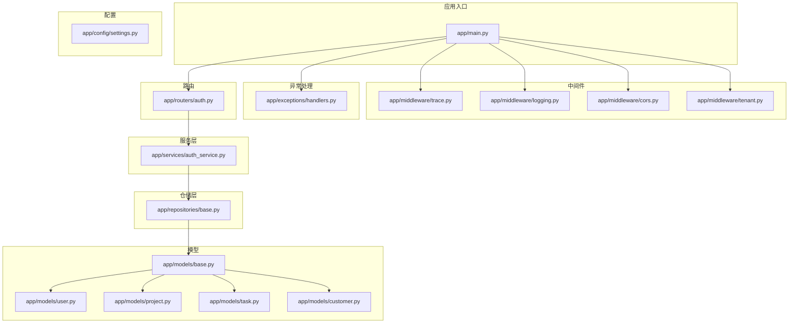
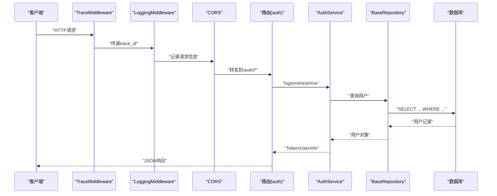
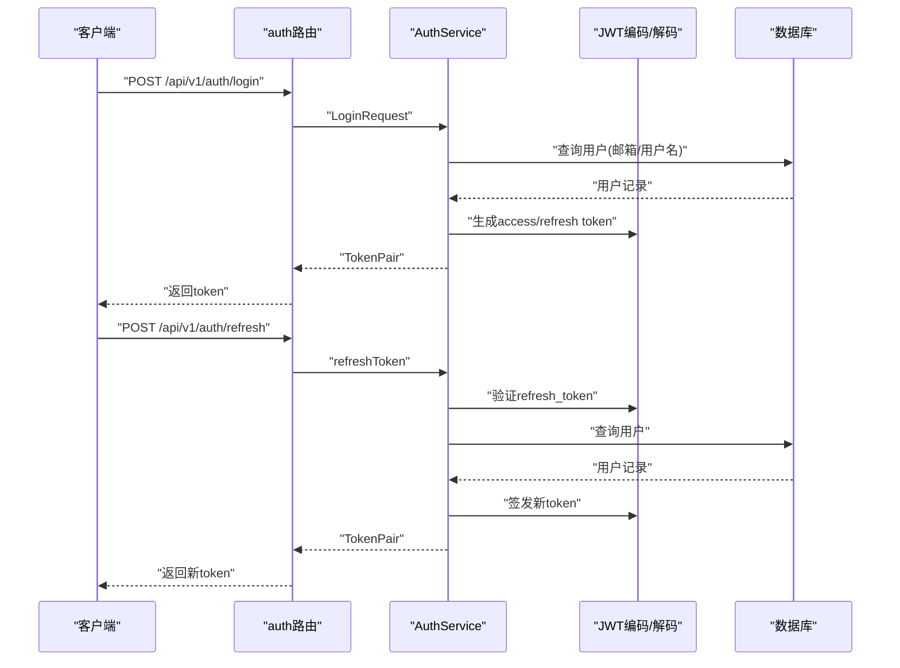
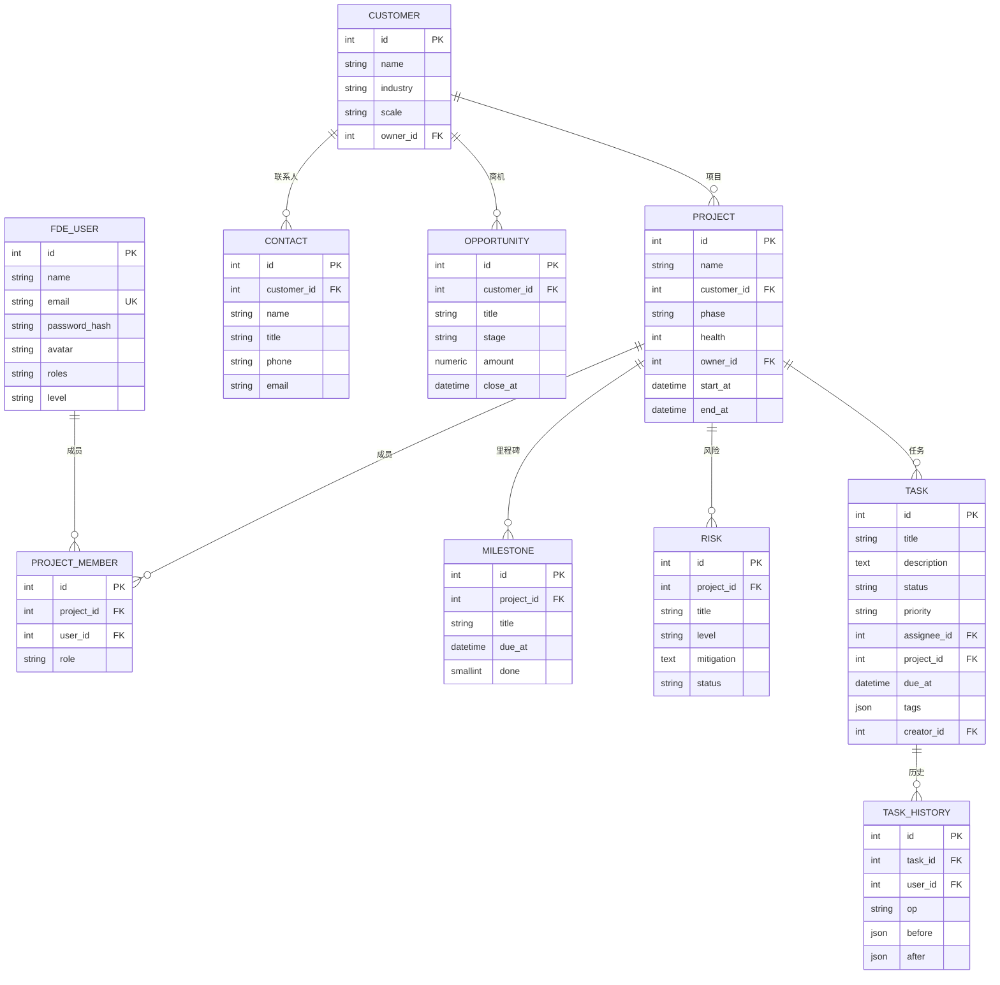
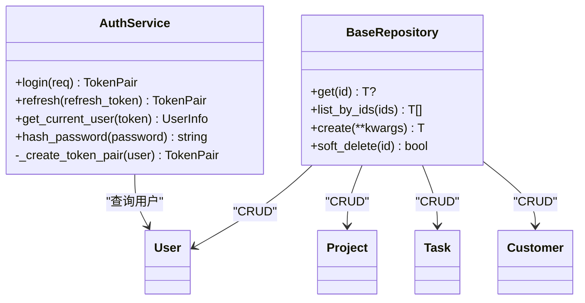
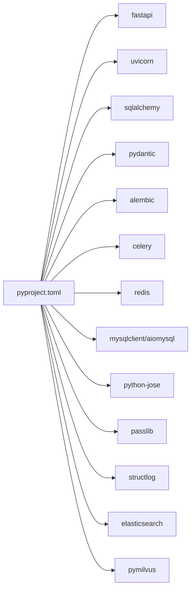

# 后端API服务

<cite>
**本文引用的文件**
- [workspace/api/app/main.py](file://workspace/api/app/main.py)
- [workspace/api/app/__init__.py](file://workspace/api/app/__init__.py)
- [workspace/api/pyproject.toml](file://workspace/api/pyproject.toml)
- [workspace/api/README.md](file://workspace/api/README.md)
- [workspace/api/app/config/settings.py](file://workspace/api/app/config/settings.py)
- [workspace/api/app/middleware/trace.py](file://workspace/api/app/middleware/trace.py)
- [workspace/api/app/middleware/logging.py](file://workspace/api/app/middleware/logging.py)
- [workspace/api/app/middleware/cors.py](file://workspace/api/app/middleware/cors.py)
- [workspace/api/app/middleware/tenant.py](file://workspace/api/app/middleware/tenant.py)
- [workspace/api/app/exceptions/handlers.py](file://workspace/api/app/exceptions/handlers.py)
- [workspace/api/app/models/base.py](file://workspace/api/app/models/base.py)
- [workspace/api/app/models/user.py](file://workspace/api/app/models/user.py)
- [workspace/api/app/models/project.py](file://workspace/api/app/models/project.py)
- [workspace/api/app/models/task.py](file://workspace/api/app/models/task.py)
- [workspace/api/app/models/customer.py](file://workspace/api/app/models/customer.py)
- [workspace/api/app/repositories/base.py](file://workspace/api/app/repositories/base.py)
- [workspace/api/app/services/auth_service.py](file://workspace/api/app/services/auth_service.py)
- [workspace/api/app/routers/auth.py](file://workspace/api/app/routers/auth.py)
- [workspace/api/app/schemas/auth.py](file://workspace/api/app/schemas/auth.py)
</cite>

## 目录
1. [引言](#引言)
2. [项目结构](#项目结构)
3. [核心组件](#核心组件)
4. [架构总览](#架构总览)
5. [详细组件分析](#详细组件分析)
6. [依赖分析](#依赖分析)
7. [性能考虑](#性能考虑)
8. [故障排查指南](#故障排查指南)
9. [结论](#结论)
10. [附录](#附录)

## 引言
本文件面向FDE工作台后端API服务，系统性梳理FastAPI应用的结构设计、中间件与异常处理机制；详解认证与授权体系（JWT认证、多租户上下文、角色与权限模型）；阐述数据模型设计（用户、项目、任务、文件、客户等）；说明业务服务层（项目管理、任务管理、客户管理、文件管理、通知服务）；明确API路由与REST规范；并给出数据访问层仓储模式与数据库连接管理的实现要点。

## 项目结构
后端API服务采用“按业务域划分”的模块化组织方式，核心目录与职责如下：
- app/main.py：应用入口，注册中间件、异常处理器与路由
- app/config/settings.py：集中式配置（环境变量驱动）
- app/middleware/*：请求级中间件（追踪、日志、CORS、多租户）
- app/exceptions/handlers.py：统一异常处理
- app/models/*：SQLAlchemy ORM模型与通用混入
- app/repositories/*：仓储层（泛型CRUD）
- app/services/*：业务服务层（领域逻辑编排）
- app/routers/*：API路由（按模块划分）
- app/schemas/*：Pydantic输入输出模型
- app/tasks/*：Celery异步任务
- app/integrations/*：外部系统集成客户端
- app/ai_client/*：AI编排服务客户端
- alembic：数据库迁移
- tests：单元与集成测试

图表来源
- [workspace/api/app/main.py:36-67](file://workspace/api/app/main.py#L36-L67)
- [workspace/api/app/middleware/trace.py:12-30](file://workspace/api/app/middleware/trace.py#L12-L30)
- [workspace/api/app/middleware/logging.py:13-36](file://workspace/api/app/middleware/logging.py#L13-L36)
- [workspace/api/app/middleware/cors.py:7-19](file://workspace/api/app/middleware/cors.py#L7-L19)
- [workspace/api/app/middleware/tenant.py:11-23](file://workspace/api/app/middleware/tenant.py#L11-L23)
- [workspace/api/app/exceptions/handlers.py:31-99](file://workspace/api/app/exceptions/handlers.py#L31-L99)
- [workspace/api/app/routers/auth.py:12-43](file://workspace/api/app/routers/auth.py#L12-L43)
- [workspace/api/app/services/auth_service.py:18-110](file://workspace/api/app/services/auth_service.py#L18-L110)
- [workspace/api/app/repositories/base.py:14-42](file://workspace/api/app/repositories/base.py#L14-L42)
- [workspace/api/app/models/base.py:10-24](file://workspace/api/app/models/base.py#L10-L24)
- [workspace/api/app/models/user.py:8-22](file://workspace/api/app/models/user.py#L8-L22)
- [workspace/api/app/models/project.py:9-63](file://workspace/api/app/models/project.py#L9-L63)
- [workspace/api/app/models/task.py:9-41](file://workspace/api/app/models/task.py#L9-L41)
- [workspace/api/app/models/customer.py:9-47](file://workspace/api/app/models/customer.py#L9-L47)

章节来源
- [workspace/api/README.md:35-49](file://workspace/api/README.md#L35-L49)
- [workspace/api/app/main.py:1-73](file://workspace/api/app/main.py#L1-L73)

## 核心组件
- 应用入口与生命周期：使用FastAPI构造应用实例，注册CORS、追踪与日志中间件，挂载统一异常处理器，并按模块注册路由。提供健康检查端点。
- 配置中心：基于pydantic-settings加载环境变量，集中管理数据库、Redis、ES/Milvus、AI编排器、JWT、Celery、外部集成等配置项。
- 中间件体系：TraceMiddleware注入并透传追踪ID；LoggingMiddleware记录请求/响应；CORSMiddleware在主程序中配置；TenantMiddleware从请求头提取租户上下文并绑定到日志上下文。
- 异常处理：BizException/SystemException自定义业务与系统异常；统一返回结构含错误码、消息、可选详情与traceId；覆盖StarletteHTTPException、RequestValidationError与通用异常。
- 数据模型：Base提供时间戳与软删除通用字段；User/Project/Task/Customer等模型定义核心业务实体及关系；外键与级联删除策略清晰。
- 仓储层：BaseRepository提供泛型CRUD能力（get/list_by_ids/create/soft_delete），支持异步会话。
- 服务层：AuthService实现登录、刷新令牌与当前用户解析，使用JWT与bcrypt；后续模块可复用该模式扩展项目、任务、客户等服务。
- 路由层：按模块划分路由（如auth），使用Pydantic模型进行请求/响应校验与序列化。

章节来源
- [workspace/api/app/main.py:28-73](file://workspace/api/app/main.py#L28-L73)
- [workspace/api/app/config/settings.py:12-81](file://workspace/api/app/config/settings.py#L12-L81)
- [workspace/api/app/middleware/trace.py:12-30](file://workspace/api/app/middleware/trace.py#L12-L30)
- [workspace/api/app/middleware/logging.py:13-36](file://workspace/api/app/middleware/logging.py#L13-L36)
- [workspace/api/app/middleware/cors.py:7-19](file://workspace/api/app/middleware/cors.py#L7-L19)
- [workspace/api/app/middleware/tenant.py:11-23](file://workspace/api/app/middleware/tenant.py#L11-L23)
- [workspace/api/app/exceptions/handlers.py:31-99](file://workspace/api/app/exceptions/handlers.py#L31-L99)
- [workspace/api/app/models/base.py:10-24](file://workspace/api/app/models/base.py#L10-L24)
- [workspace/api/app/models/user.py:8-22](file://workspace/api/app/models/user.py#L8-L22)
- [workspace/api/app/models/project.py:9-63](file://workspace/api/app/models/project.py#L9-L63)
- [workspace/api/app/models/task.py:9-41](file://workspace/api/app/models/task.py#L9-L41)
- [workspace/api/app/models/customer.py:9-47](file://workspace/api/app/models/customer.py#L9-L47)
- [workspace/api/app/repositories/base.py:14-42](file://workspace/api/app/repositories/base.py#L14-L42)
- [workspace/api/app/services/auth_service.py:18-110](file://workspace/api/app/services/auth_service.py#L18-L110)
- [workspace/api/app/routers/auth.py:12-43](file://workspace/api/app/routers/auth.py#L12-L43)
- [workspace/api/app/schemas/auth.py:7-32](file://workspace/api/app/schemas/auth.py#L7-L32)

## 架构总览
下图展示从客户端到服务端的关键交互路径，涵盖中间件链路、路由分发、服务编排与数据持久化。

图表来源
- [workspace/api/app/main.py:44-67](file://workspace/api/app/main.py#L44-L67)
- [workspace/api/app/middleware/trace.py:15-29](file://workspace/api/app/middleware/trace.py#L15-L29)
- [workspace/api/app/middleware/logging.py:16-34](file://workspace/api/app/middleware/logging.py#L16-L34)
- [workspace/api/app/routers/auth.py:19-43](file://workspace/api/app/routers/auth.py#L19-L43)
- [workspace/api/app/services/auth_service.py:22-76](file://workspace/api/app/services/auth_service.py#L22-L76)
- [workspace/api/app/repositories/base.py:20-27](file://workspace/api/app/repositories/base.py#L20-L27)

## 详细组件分析

### 认证与授权系统
- JWT认证流程
  - 登录：根据用户名或邮箱查找用户，校验密码哈希，生成access_token与refresh_token，设置过期时间。
  - 刷新：校验refresh_token类型与签名，解析用户ID，重新签发新的token对。
  - 当前用户：校验access_token类型与签名，解析用户ID，返回用户信息（含角色列表）。
- 多租户上下文
  - 通过TenantMiddleware从请求头读取X-Tenant-ID，绑定到structlog上下文，便于日志与审计追踪。
- 权限模型
  - 用户模型roles字段存储逗号分隔的角色字符串，服务层可据此进行权限判断（示例：角色列表解析）。
  - RBAC建议：结合角色与资源操作定义细粒度权限矩阵，路由层或服务层增加鉴权装饰器/中间件以实现基于角色的访问控制。

图表来源
- [workspace/api/app/routers/auth.py:19-29](file://workspace/api/app/routers/auth.py#L19-L29)
- [workspace/api/app/services/auth_service.py:22-105](file://workspace/api/app/services/auth_service.py#L22-L105)
- [workspace/api/app/schemas/auth.py:7-22](file://workspace/api/app/schemas/auth.py#L7-L22)

章节来源
- [workspace/api/app/services/auth_service.py:18-110](file://workspace/api/app/services/auth_service.py#L18-L110)
- [workspace/api/app/routers/auth.py:12-43](file://workspace/api/app/routers/auth.py#L12-L43)
- [workspace/api/app/schemas/auth.py:7-32](file://workspace/api/app/schemas/auth.py#L7-L32)
- [workspace/api/app/middleware/tenant.py:11-23](file://workspace/api/app/middleware/tenant.py#L11-L23)
- [workspace/api/app/models/user.py:19-22](file://workspace/api/app/models/user.py#L19-L22)

### 数据模型设计
- 基础模型
  - Base：ORM基类
  - TimestampMixin：自动维护创建/修改时间
  - SoftDeleteMixin：软删除标记
- 用户模型
  - 字段：id、name、email、password_hash、avatar、roles、level
  - 角色解析：roles_list属性将逗号分隔字符串转为列表
- 项目模型
  - 项目：名称、客户、阶段、健康度、负责人、起止时间
  - 成员：项目成员与角色(owner/core/support)
  - 里程碑：标题、截止时间、完成状态
  - 风险：标题、等级、缓解措施、状态
- 任务模型
  - 标题、描述、状态、优先级、负责人、所属项目、截止时间、标签、创建人
  - 任务历史：记录变更前后快照与操作者
- 客户模型
  - 客户：名称、行业、规模、负责人
  - 联系人：姓名、职位、电话、邮箱
  - 商机：标题、阶段、金额、预计成交时间

图表来源
- [workspace/api/app/models/base.py:10-24](file://workspace/api/app/models/base.py#L10-L24)
- [workspace/api/app/models/user.py:8-22](file://workspace/api/app/models/user.py#L8-L22)
- [workspace/api/app/models/customer.py:9-47](file://workspace/api/app/models/customer.py#L9-L47)
- [workspace/api/app/models/project.py:9-63](file://workspace/api/app/models/project.py#L9-L63)
- [workspace/api/app/models/task.py:9-41](file://workspace/api/app/models/task.py#L9-L41)

章节来源
- [workspace/api/app/models/base.py:10-24](file://workspace/api/app/models/base.py#L10-L24)
- [workspace/api/app/models/user.py:8-22](file://workspace/api/app/models/user.py#L8-L22)
- [workspace/api/app/models/project.py:9-63](file://workspace/api/app/models/project.py#L9-L63)
- [workspace/api/app/models/task.py:9-41](file://workspace/api/app/models/task.py#L9-L41)
- [workspace/api/app/models/customer.py:9-47](file://workspace/api/app/models/customer.py#L9-L47)

### 业务服务层实现
- 认证服务（AuthService）
  - 提供登录、刷新令牌与当前用户解析
  - 使用bcrypt进行密码哈希比对
  - 使用jose的jwt进行编码/解码
- 仓储层（BaseRepository）
  - 泛型CRUD：按ID获取、批量按ID查询、创建、软删除
  - 依赖异步会话，便于与SQLAlchemy 2配合
- 服务层扩展建议
  - 项目管理：基于Project/ProjectMember/Risk/Milestone模型，实现增删改查与成员管理
  - 任务管理：基于Task/TaskHistory模型，实现状态流转与历史记录
  - 客户管理：基于Customer/Contact/Opportunity模型，实现客户全生命周期管理
  - 文件管理：结合OSS客户端与File模型，实现上传、索引与检索
  - 通知服务：基于Redis/Celery实现异步通知与事件分发

图表来源
- [workspace/api/app/services/auth_service.py:18-110](file://workspace/api/app/services/auth_service.py#L18-L110)
- [workspace/api/app/repositories/base.py:14-42](file://workspace/api/app/repositories/base.py#L14-L42)
- [workspace/api/app/models/user.py:8-22](file://workspace/api/app/models/user.py#L8-L22)
- [workspace/api/app/models/project.py:9-63](file://workspace/api/app/models/project.py#L9-L63)
- [workspace/api/app/models/task.py:9-41](file://workspace/api/app/models/task.py#L9-L41)
- [workspace/api/app/models/customer.py:9-47](file://workspace/api/app/models/customer.py#L9-L47)

章节来源
- [workspace/api/app/services/auth_service.py:18-110](file://workspace/api/app/services/auth_service.py#L18-L110)
- [workspace/api/app/repositories/base.py:14-42](file://workspace/api/app/repositories/base.py#L14-L42)

### API路由设计与REST规范
- 路由命名与前缀
  - 认证：/api/v1/auth（登录、刷新、登出、当前用户）
  - 仪表盘：/api/v1/dashboard
  - 任务：/api/v1/tasks
  - 项目：/api/v1/projects
  - 客户：/api/v1/customers
  - 文件：/api/v1/files
  - 教练：/api/v1/coach
  - Copilot：/api/v1/copilot
  - 提及：/api/v1/mentions
  - 设置：/api/v1/settings
- 请求/响应规范
  - 使用Pydantic模型进行参数校验与序列化
  - 统一返回结构（错误码、消息、traceId、可选details/data）
- 安全与跨域
  - CORS在主程序中配置，允许本地开发与API服务器源
  - 认证使用Bearer Token，建议在生产环境启用HTTPS与安全头

章节来源
- [workspace/api/app/main.py:58-67](file://workspace/api/app/main.py#L58-L67)
- [workspace/api/app/routers/auth.py:12-43](file://workspace/api/app/routers/auth.py#L12-L43)
- [workspace/api/app/schemas/auth.py:7-32](file://workspace/api/app/schemas/auth.py#L7-L32)
- [workspace/api/app/middleware/cors.py:7-19](file://workspace/api/app/middleware/cors.py#L7-L19)

### 数据访问层与数据库连接管理
- 连接与会话
  - 通过依赖注入获取异步会话（AsyncSession），确保每个请求独立事务
- 仓储模式
  - BaseRepository提供泛型CRUD，子类仅需声明model类型
  - 支持软删除（is_deleted标记），避免物理删除带来的数据丢失
- 模型关系
  - 明确外键与级联删除策略，保证数据一致性
- 迁移与初始化
  - 使用Alembic进行数据库版本管理，启动时执行升级至最新版本

章节来源
- [workspace/api/app/repositories/base.py:14-42](file://workspace/api/app/repositories/base.py#L14-L42)
- [workspace/api/app/models/project.py:23-25](file://workspace/api/app/models/project.py#L23-L25)
- [workspace/api/app/models/task.py:26-26](file://workspace/api/app/models/task.py#L26-L26)
- [workspace/api/README.md:10-18](file://workspace/api/README.md#L10-L18)

## 依赖分析
- 运行时依赖
  - FastAPI、Uvicorn、SQLAlchemy 2、Pydantic v2、Alembic、Celery、Redis、MySQL驱动、httpx、structlog、Elasticsearch、Milvus等
- 开发依赖
  - pytest、ruff、mypy等工具链
- 项目内模块耦合
  - 路由依赖服务层；服务层依赖仓储层；仓储层依赖模型与异步会话
  - 中间件与异常处理器作为横切关注点被应用入口统一注册

图表来源
- [workspace/api/pyproject.toml:9-28](file://workspace/api/pyproject.toml#L9-L28)

章节来源
- [workspace/api/pyproject.toml:1-61](file://workspace/api/pyproject.toml#L1-L61)

## 性能考虑
- 异步化：使用SQLAlchemy 2异步会话与FastAPI异步路由，提升并发处理能力
- 缓存与队列：Redis用于缓存与Celery队列，适合热点数据与长耗时任务
- 日志与追踪：TraceMiddleware与structlog上下文变量，便于定位性能瓶颈
- 数据库优化：合理索引（如用户唯一索引email）、软删除字段、批量查询（list_by_ids）

## 故障排查指南
- 统一异常处理
  - BizException/SystemException：业务错误，返回具体错误码与消息
  - StarletteHTTPException：HTTP错误，映射状态码与详情
  - RequestValidationError：参数校验失败，返回结构化错误数组
  - 通用异常：捕获未处理异常，返回内部错误并附带traceId
- 日志与追踪
  - TraceMiddleware在请求头与响应头注入X-Trace-ID，便于端到端追踪
  - LoggingMiddleware记录请求开始与完成的日志条目
- 常见问题定位
  - 认证失败：检查JWT密钥长度与算法配置、用户是否存在且未软删除
  - 参数错误：查看validation_error日志中的errors字段
  - 数据库连接：确认database_url与驱动可用性

章节来源
- [workspace/api/app/exceptions/handlers.py:31-99](file://workspace/api/app/exceptions/handlers.py#L31-L99)
- [workspace/api/app/middleware/trace.py:15-29](file://workspace/api/app/middleware/trace.py#L15-L29)
- [workspace/api/app/middleware/logging.py:16-34](file://workspace/api/app/middleware/logging.py#L16-L34)
- [workspace/api/app/config/settings.py:41-43](file://workspace/api/app/config/settings.py#L41-L43)

## 结论
本后端API服务以FastAPI为核心，采用清晰的分层架构与模块化组织，具备完善的中间件与异常处理体系；认证与授权以JWT为基础，结合多租户上下文与角色模型；数据模型围绕用户、项目、任务、客户展开，具备良好的扩展性；仓储层提供通用CRUD能力，服务层承载业务编排，路由层遵循REST规范。整体设计兼顾可维护性、可扩展性与可观测性，满足FDE工作台的业务需求。

## 附录
- 启动与运行
  - 安装依赖、复制.env示例、执行数据库迁移、启动服务与Celery
- 目录速览
  - routers、schemas、services、repositories、models、tasks、integrations、ai_client等

章节来源
- [workspace/api/README.md:7-18](file://workspace/api/README.md#L7-L18)
- [workspace/api/README.md:35-49](file://workspace/api/README.md#L35-L49)