# 数据模型设计

<cite>
**本文引用的文件**
- [workspace/api/app/models/base.py](file://workspace/api/app/models/base.py)
- [workspace/api/app/models/user.py](file://workspace/api/app/models/user.py)
- [workspace/api/app/models/project.py](file://workspace/api/app/models/project.py)
- [workspace/api/app/models/task.py](file://workspace/api/app/models/task.py)
- [workspace/api/app/models/file.py](file://workspace/api/app/models/file.py)
- [workspace/api/app/models/customer.py](file://workspace/api/app/models/customer.py)
- [workspace/api/app/models/coach.py](file://workspace/api/app/models/coach.py)
- [workspace/api/app/models/ai.py](file://workspace/api/app/models/ai.py)
- [workspace/api/alembic/versions/001_initial.py](file://workspace/api/alembic/versions/001_initial.py)
- [workspace/api/alembic/env.py](file://workspace/api/alembic/env.py)
- [workspace/api/app/repositories/base.py](file://workspace/api/app/repositories/base.py)
- [workspace/api/app/config/settings.py](file://workspace/api/app/config/settings.py)
- [workspace/api/app/utils/time.py](file://workspace/api/app/utils/time.py)
- [workspace/api/app/utils/crypto.py](file://workspace/api/app/utils/crypto.py)
</cite>

## 目录
1. [简介](#简介)
2. [项目结构](#项目结构)
3. [核心组件](#核心组件)
4. [架构总览](#架构总览)
5. [详细组件分析](#详细组件分析)
6. [依赖分析](#依赖分析)
7. [性能考量](#性能考量)
8. [故障排查指南](#故障排查指南)
9. [结论](#结论)
10. [附录](#附录)

## 简介
本文件系统化梳理 FDE 工作台的数据模型设计，覆盖 ORM 基类与混入（TimestampMixin、SoftDeleteMixin）、核心实体模型（User、Project、Task、File、Customer、Coach、AI）的设计理念、字段与关系映射、外键与索引策略、软删除机制、时间戳管理与数据完整性保障，并提供模型使用示例与查询优化建议，以及数据库迁移管理与版本兼容性考虑。

## 项目结构
数据模型位于后端 API 工程中，采用 SQLAlchemy Declarative 模式，通过统一的 Base 类与混入类实现一致的时间戳与软删除能力；迁移脚本由 Alembic 管理，环境配置通过 Pydantic Settings 提供。

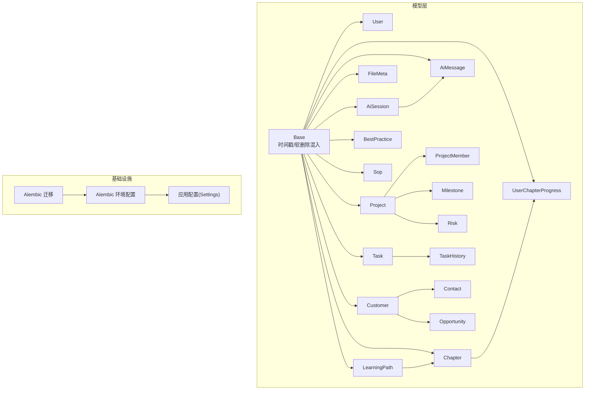

图表来源
- [workspace/api/app/models/base.py:1-24](file://workspace/api/app/models/base.py#L1-L24)
- [workspace/api/app/models/user.py:1-22](file://workspace/api/app/models/user.py#L1-L22)
- [workspace/api/app/models/project.py:1-63](file://workspace/api/app/models/project.py#L1-L63)
- [workspace/api/app/models/task.py:1-41](file://workspace/api/app/models/task.py#L1-L41)
- [workspace/api/app/models/file.py:1-23](file://workspace/api/app/models/file.py#L1-L23)
- [workspace/api/app/models/customer.py:1-47](file://workspace/api/app/models/customer.py#L1-L47)
- [workspace/api/app/models/coach.py:1-73](file://workspace/api/app/models/coach.py#L1-L73)
- [workspace/api/app/models/ai.py:1-32](file://workspace/api/app/models/ai.py#L1-L32)
- [workspace/api/alembic/versions/001_initial.py:1-290](file://workspace/api/alembic/versions/001_initial.py#L1-L290)
- [workspace/api/alembic/env.py:1-72](file://workspace/api/alembic/env.py#L1-L72)

章节来源
- [workspace/api/app/models/base.py:1-24](file://workspace/api/app/models/base.py#L1-L24)
- [workspace/api/alembic/versions/001_initial.py:1-290](file://workspace/api/alembic/versions/001_initial.py#L1-L290)
- [workspace/api/alembic/env.py:1-72](file://workspace/api/alembic/env.py#L1-L72)

## 核心组件
- 基类与混入
  - Base：所有 ORM 模型的基类，用于注册与元数据管理。
  - TimestampMixin：统一提供创建/更新时间字段，支持自动填充与更新。
  - SoftDeleteMixin：统一提供软删除标记字段，配合仓库层软删除操作。
- 仓储基类
  - BaseRepository：提供通用 CRUD 能力，含软删除方法，便于在服务层复用。

章节来源
- [workspace/api/app/models/base.py:10-24](file://workspace/api/app/models/base.py#L10-L24)
- [workspace/api/app/repositories/base.py:14-42](file://workspace/api/app/repositories/base.py#L14-L42)

## 架构总览
下图展示模型层与迁移层的关系，以及 Alembic 如何读取模型注册并生成/回滚迁移脚本。

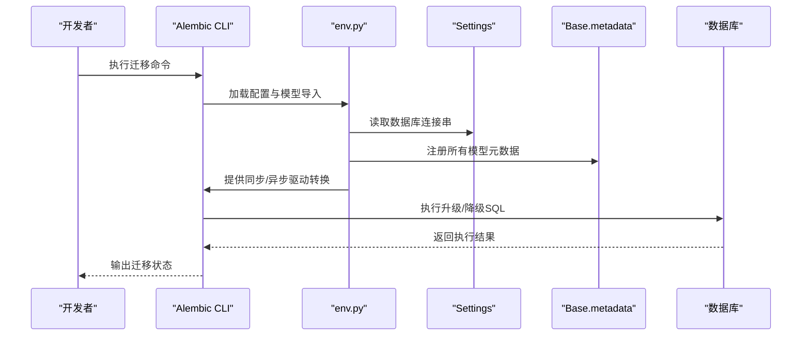

图表来源
- [workspace/api/alembic/env.py:11-37](file://workspace/api/alembic/env.py#L11-L37)
- [workspace/api/app/config/settings.py:23-24](file://workspace/api/app/config/settings.py#L23-L24)

章节来源
- [workspace/api/alembic/env.py:1-72](file://workspace/api/alembic/env.py#L1-L72)
- [workspace/api/app/config/settings.py:1-81](file://workspace/api/app/config/settings.py#L1-L81)

## 详细组件分析

### 基类与混入设计
- 设计要点
  - 统一继承自 DeclarativeBase，确保模型注册到全局元数据。
  - 时间戳字段默认值与更新行为在 ORM 层面控制，减少业务层重复逻辑。
  - 软删除以数值标志位表示，便于后续扩展“硬删除”或“归档”策略。
- 复杂度与性能
  - 字段访问为 O(1)，时间戳更新由数据库触发器或 ORM 默认值处理，开销可忽略。
  - 软删除查询需显式过滤 is_deleted，避免误读已删除记录。

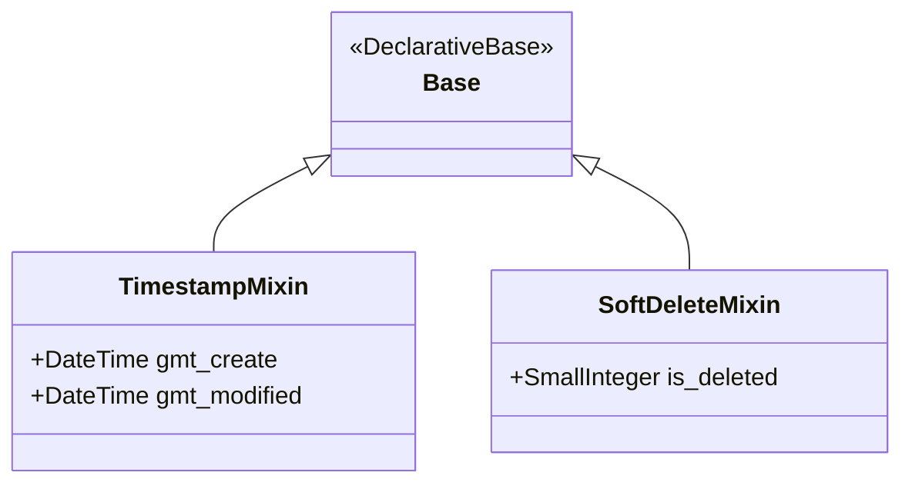

图表来源
- [workspace/api/app/models/base.py:10-24](file://workspace/api/app/models/base.py#L10-L24)

章节来源
- [workspace/api/app/models/base.py:1-24](file://workspace/api/app/models/base.py#L1-L24)

### 用户模型 User
- 设计思路
  - 标识字段为主键自增，邮箱唯一，便于登录与关联。
  - 角色字段采用逗号分隔字符串存储，提供多角色支持与便捷解析。
  - 密码以哈希形式存储，安全合规。
- 关系映射
  - 作为项目/任务/文件/教练进度等实体的外键来源。
- 索引与约束
  - 邮箱唯一约束，提升查询稳定性与一致性。
- 使用示例
  - 创建用户时传入必要字段，读取 roles_list 获取角色列表。
- 查询优化
  - 对邮箱字段建立唯一索引（迁移脚本已包含），避免重复与冲突。

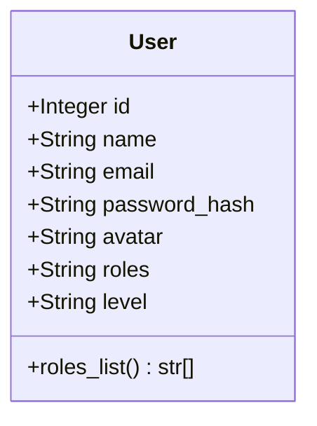

图表来源
- [workspace/api/app/models/user.py:8-22](file://workspace/api/app/models/user.py#L8-L22)

章节来源
- [workspace/api/app/models/user.py:1-22](file://workspace/api/app/models/user.py#L1-L22)
- [workspace/api/alembic/versions/001_initial.py:17-30](file://workspace/api/alembic/versions/001_initial.py#L17-L30)

### 项目模型 Project 及其子实体
- 设计思路
  - 项目主表包含阶段、健康度、起止时间等关键指标。
  - 成员、里程碑、风险作为一对多聚合，使用级联删除保持数据整洁。
- 关系映射
  - 项目与客户、所有者之间为多对一。
  - 项目与成员、里程碑、风险之间为一对多。
- 索引与约束
  - 外键约束确保引用完整性；成员组合唯一性可按需添加。
- 使用示例
  - 新建项目时指定 owner_id 与 customer_id；批量读取成员与里程碑。
- 查询优化
  - 对 owner_id、customer_id 建立索引；对里程碑/风险的项目外键建立索引。

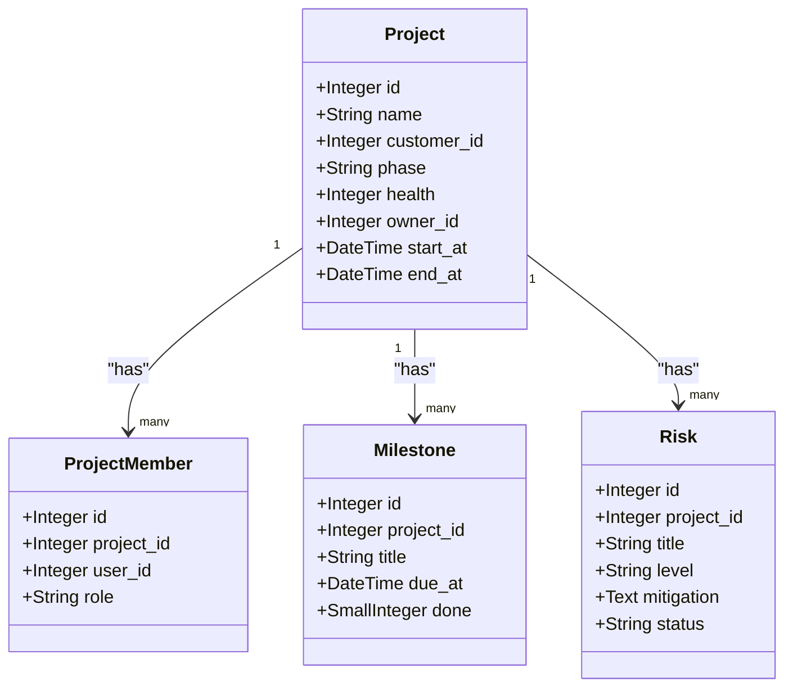

图表来源
- [workspace/api/app/models/project.py:9-63](file://workspace/api/app/models/project.py#L9-L63)

章节来源
- [workspace/api/app/models/project.py:1-63](file://workspace/api/app/models/project.py#L1-L63)
- [workspace/api/alembic/versions/001_initial.py:104-159](file://workspace/api/alembic/versions/001_initial.py#L104-L159)

### 任务模型 Task 及历史 TaskHistory
- 设计思路
  - 任务状态与优先级采用枚举化字符串，便于前端展示与筛选。
  - 历史表记录变更轨迹，支持审计与回溯。
- 关系映射
  - 任务与指派人、创建人、项目之间为多对一。
  - 任务与历史之间为一对多，按时间倒序排列。
- 索引与约束
  - 外键约束确保引用完整性；JSON 字段用于标签与变更内容。
- 使用示例
  - 创建任务时写入 creator_id 与 assignee_id；更新状态时写入历史。
- 查询优化
  - 对 assignee_id、project_id、status、due_at 建立复合索引以提升筛选效率。

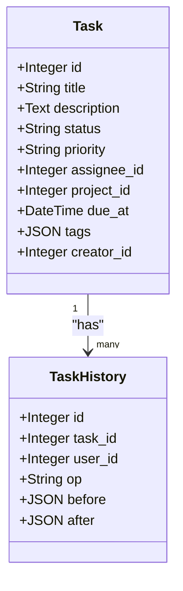

图表来源
- [workspace/api/app/models/task.py:9-41](file://workspace/api/app/models/task.py#L9-L41)

章节来源
- [workspace/api/app/models/task.py:1-41](file://workspace/api/app/models/task.py#L1-L41)
- [workspace/api/alembic/versions/001_initial.py:32-61](file://workspace/api/alembic/versions/001_initial.py#L32-L61)

### 文件模型 FileMeta
- 设计思路
  - 支持个人/项目/客户/共享等多作用域，通过 scope 与 scope_id 组合标识。
  - 引入 RAG 索引标记，便于检索服务集成。
- 关系映射
  - 文件与所有者之间为多对一。
- 索引与约束
  - 外键约束确保归属关系；大小字段使用大整型以适配大文件。
- 使用示例
  - 上传文件后写入 OSS Key 与大小；更新 RAG 索引状态。
- 查询优化
  - 对 owner_id、scope、scope_id 建立复合索引以提升范围查询效率。

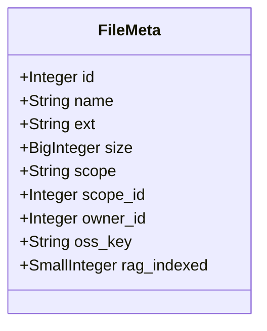

图表来源
- [workspace/api/app/models/file.py:9-23](file://workspace/api/app/models/file.py#L9-L23)

章节来源
- [workspace/api/app/models/file.py:1-23](file://workspace/api/app/models/file.py#L1-L23)
- [workspace/api/alembic/versions/001_initial.py:161-176](file://workspace/api/alembic/versions/001_initial.py#L161-L176)

### 客户模型 Customer 及其子实体
- 设计思路
  - 客户主表包含行业、规模等维度，便于画像与报表。
  - 联系人与商机作为一对多聚合，支持销售流程管理。
- 关系映射
  - 客户与所有者之间为多对一。
  - 客户与联系人、商机之间为一对多。
- 索引与约束
  - 外键约束确保引用完整性；金额字段使用高精度数值类型。
- 使用示例
  - 新建客户时指定 owner_id；关联联系人与商机。
- 查询优化
  - 对 owner_id、行业、规模建立索引；对商机金额与关闭日期建立索引。

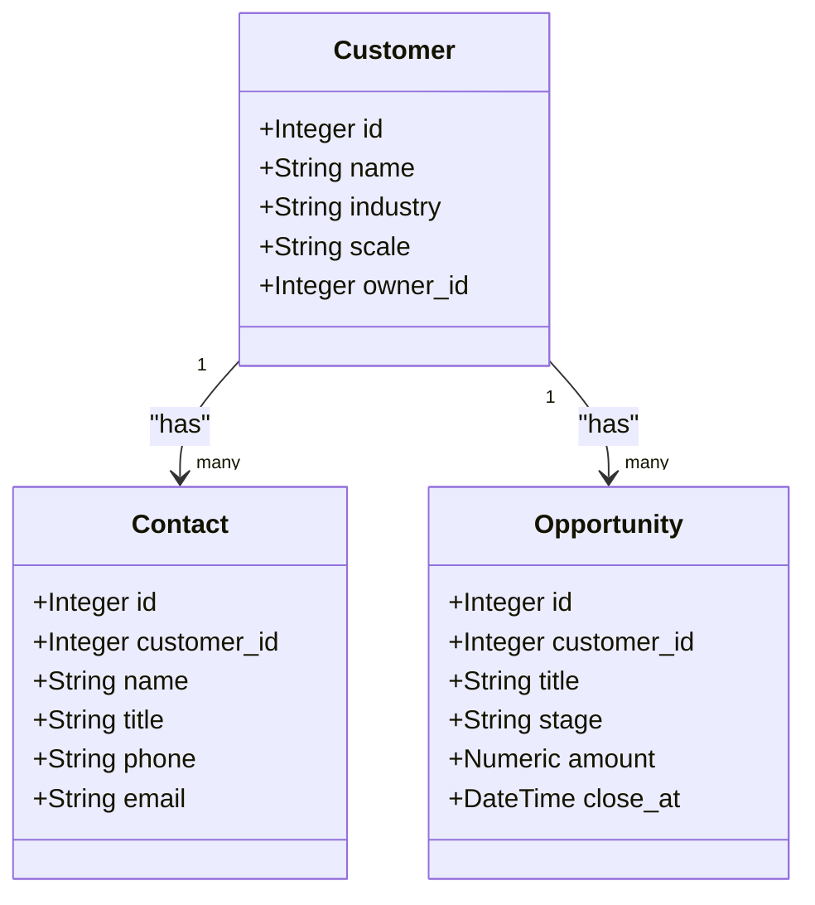

图表来源
- [workspace/api/app/models/customer.py:9-47](file://workspace/api/app/models/customer.py#L9-L47)

章节来源
- [workspace/api/app/models/customer.py:1-47](file://workspace/api/app/models/customer.py#L1-L47)
- [workspace/api/alembic/versions/001_initial.py:63-102](file://workspace/api/alembic/versions/001_initial.py#L63-L102)

### 教练模型 Coach
- 设计思路
  - 最佳实践与 SOP 提供知识库能力；学习路径与章节构成课程体系。
  - 用户章节进度记录学习完成度，支持学习闭环。
- 关系映射
  - 学习路径与章节之间为一对多；章节可有先修章节形成依赖链。
  - 用户进度与用户、章节之间为多对多。
- 索引与约束
  - 外键约束确保层级关系；进度字段采用百分比整数存储。
- 使用示例
  - 新建学习路径并设置章节顺序；记录用户进度。
- 查询优化
  - 对学习路径的排序字段与章节的先修字段建立索引。

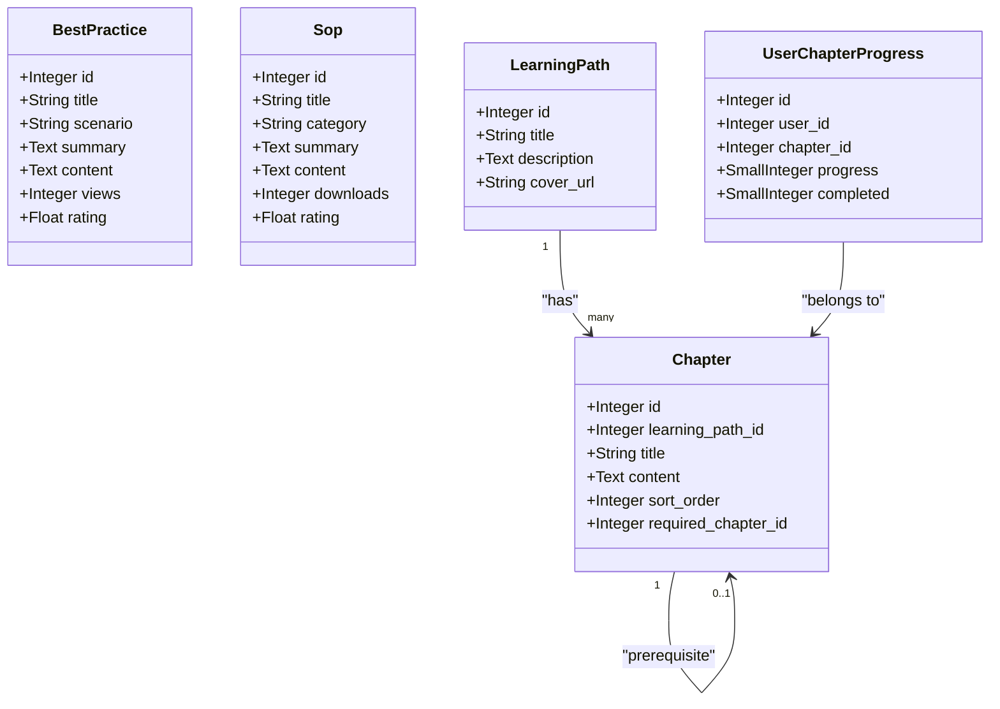

图表来源
- [workspace/api/app/models/coach.py:9-73](file://workspace/api/app/models/coach.py#L9-L73)

章节来源
- [workspace/api/app/models/coach.py:1-73](file://workspace/api/app/models/coach.py#L1-L73)
- [workspace/api/alembic/versions/001_initial.py:178-243](file://workspace/api/alembic/versions/001_initial.py#L178-L243)

### AI 模型 AiSession 与 AiMessage
- 设计思路
  - 会话与消息分离，支持不同助手与模式（智能/创意/严谨）。
  - 卡片数据以字符串存储，便于与前端卡片组件对接。
- 关系映射
  - 会话与消息之间为一对多；消息与会话之间为多对一。
- 索引与约束
  - 外键约束确保会话归属；消息按时间顺序排列。
- 使用示例
  - 新建会话并设置助手键与模式；追加消息并附带卡片数据。
- 查询优化
  - 对 user_id、assistant_key、会话创建时间建立索引以提升检索效率。

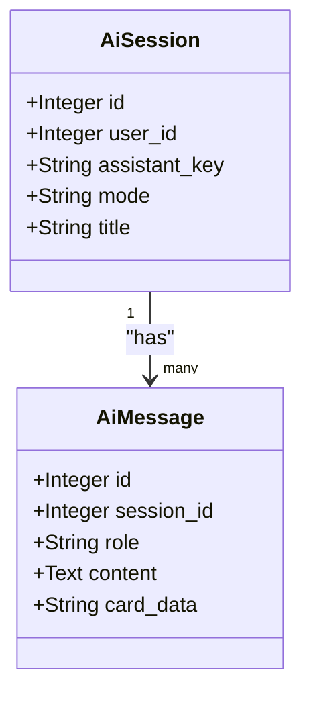

图表来源
- [workspace/api/app/models/ai.py:9-32](file://workspace/api/app/models/ai.py#L9-L32)

章节来源
- [workspace/api/app/models/ai.py:1-32](file://workspace/api/app/models/ai.py#L1-L32)
- [workspace/api/alembic/versions/001_initial.py:245-267](file://workspace/api/alembic/versions/001_initial.py#L245-L267)

### 软删除机制与时间戳管理
- 软删除
  - 模型统一继承 SoftDeleteMixin，使用 is_deleted 数值字段标识删除状态。
  - 仓储层提供 soft_delete 方法，调用方无需关心具体实现。
- 时间戳
  - TimestampMixin 提供 gmt_create 与 gmt_modified，默认值与更新行为在 ORM 层控制。
  - 工具函数提供 UTC 时间与格式化/解析能力，便于日志与审计。
- 数据完整性
  - 外键约束在迁移脚本中明确声明，确保引用完整性。
  - 唯一约束（如邮箱）在迁移脚本中声明，避免重复。

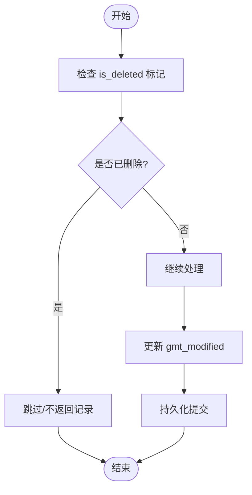

图表来源
- [workspace/api/app/models/base.py:15-24](file://workspace/api/app/models/base.py#L15-L24)
- [workspace/api/app/repositories/base.py:35-41](file://workspace/api/app/repositories/base.py#L35-L41)

章节来源
- [workspace/api/app/models/base.py:1-24](file://workspace/api/app/models/base.py#L1-L24)
- [workspace/api/app/repositories/base.py:1-42](file://workspace/api/app/repositories/base.py#L1-L42)
- [workspace/api/app/utils/time.py:1-20](file://workspace/api/app/utils/time.py#L1-L20)

### 数据库迁移管理与版本兼容
- 迁移入口
  - env.py 中导入所有模型，确保 Alembic 能扫描到元数据。
  - 将异步驱动转换为同步驱动以适配 Alembic。
- 初始版本
  - 001_initial.py 定义了所有表的创建与外键补充（如 task.project_id 的延迟外键）。
- 版本兼容
  - 升级/降级脚本严格遵循依赖顺序，先创建被依赖表再添加外键。
  - 降级时按反向顺序删除表，确保外键约束不会阻断删除。

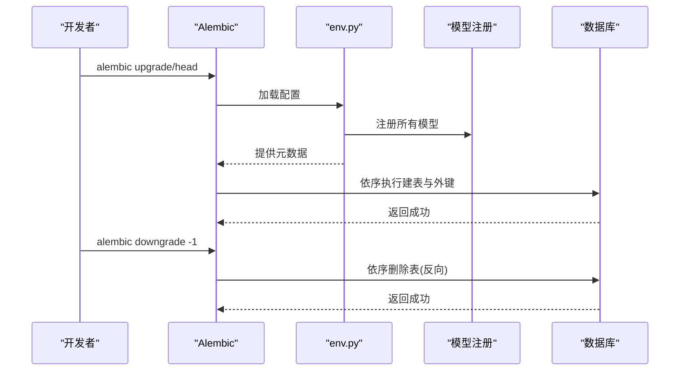

图表来源
- [workspace/api/alembic/env.py:11-37](file://workspace/api/alembic/env.py#L11-L37)
- [workspace/api/alembic/versions/001_initial.py:16-121](file://workspace/api/alembic/versions/001_initial.py#L16-L121)

章节来源
- [workspace/api/alembic/versions/001_initial.py:1-290](file://workspace/api/alembic/versions/001_initial.py#L1-L290)
- [workspace/api/alembic/env.py:1-72](file://workspace/api/alembic/env.py#L1-L72)

## 依赖分析
- 组件耦合
  - 模型层仅依赖 SQLAlchemy 与混入类，低耦合、高内聚。
  - 仓储层通过泛型约束模型类型，复用性强。
- 外部依赖
  - Alembic 依赖应用配置中的数据库连接串，驱动名转换确保兼容性。
- 循环依赖
  - 模型间通过外键引用，未见循环依赖迹象。

图表来源
- [workspace/api/app/config/settings.py:23-24](file://workspace/api/app/config/settings.py#L23-L24)
- [workspace/api/alembic/env.py:24-37](file://workspace/api/alembic/env.py#L24-L37)

章节来源
- [workspace/api/app/config/settings.py:1-81](file://workspace/api/app/config/settings.py#L1-L81)
- [workspace/api/alembic/env.py:1-72](file://workspace/api/alembic/env.py#L1-L72)

## 性能考量
- 索引策略
  - 在高频查询字段上建立单列或复合索引，如 owner_id、customer_id、project_id、assignee_id、status、due_at、scope/scope_id 组合。
- 查询优化
  - 使用 select().where().options(joinedload(...)) 避免 N+1 查询。
  - 对历史表按时间排序时，确保索引命中。
- 写入优化
  - 批量插入/更新时使用 flush/commit 合理切分事务，降低锁竞争。
- 时间戳与软删除
  - 通过 ORM 默认值减少业务层计算，提高写入吞吐。

## 故障排查指南
- 软删除未生效
  - 检查是否正确调用仓储层 soft_delete 方法，确认 is_deleted 字段更新。
- 外键约束报错
  - 确认被引用记录存在且未被软删除；检查迁移脚本是否完整执行。
- 迁移失败
  - 检查数据库驱动转换是否正确（异步驱动转同步），确认连接参数 charset 设置。
- 时间戳异常
  - 确认 gmt_modified 是否被正确更新；必要时使用工具函数获取 UTC 时间进行校验。

章节来源
- [workspace/api/app/repositories/base.py:35-41](file://workspace/api/app/repositories/base.py#L35-L41)
- [workspace/api/alembic/env.py:24-37](file://workspace/api/alembic/env.py#L24-L37)
- [workspace/api/app/utils/time.py:7-19](file://workspace/api/app/utils/time.py#L7-L19)

## 结论
本数据模型以统一的基类与混入为基础，围绕业务实体构建清晰的一对多/多对一关系，结合 Alembic 迁移实现版本化演进。软删除与时间戳机制提升了数据安全性与可追溯性。通过合理的索引与查询策略，可在保证数据完整性的同时满足性能要求。建议在后续迭代中持续完善索引覆盖与查询计划分析，确保系统长期稳定运行。

## 附录
- 模型使用示例（步骤）
  - 创建用户：传入名称、邮箱、密码哈希等字段。
  - 新建项目：指定名称、所有者、客户与起止时间。
  - 创建任务：指定标题、描述、优先级、截止时间与指派人。
  - 上传文件：写入文件名、扩展名、大小、OSS Key 与作用域。
  - 记录教练进度：为用户与章节创建进度记录。
  - 新建 AI 会话：选择助手键与模式，追加消息。
- 密钥与哈希
  - 使用加密工具生成随机令牌与 SHA-256 哈希，确保安全存储与验证。

章节来源
- [workspace/api/app/utils/crypto.py:8-21](file://workspace/api/app/utils/crypto.py#L8-L21)