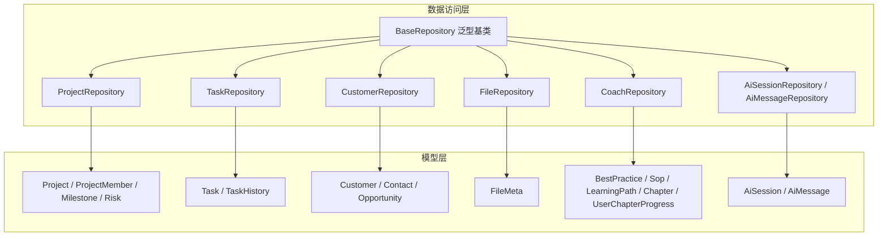
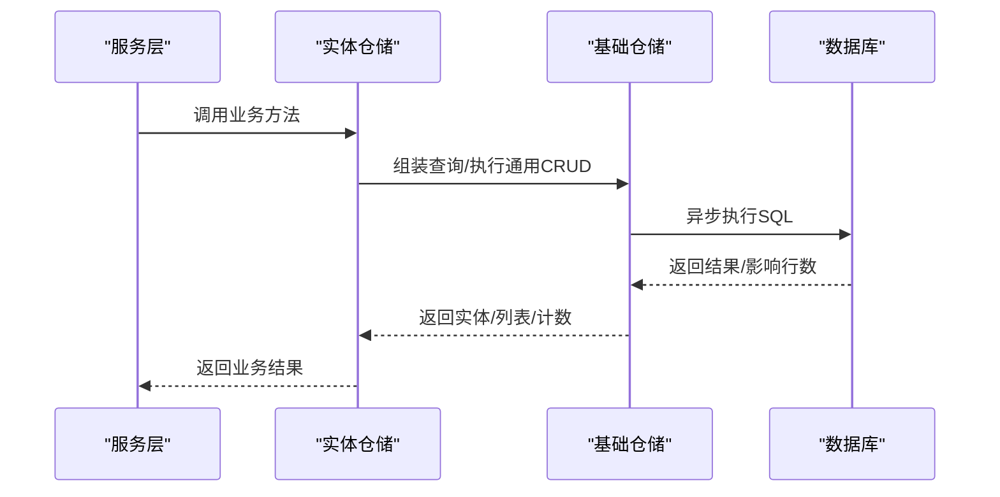
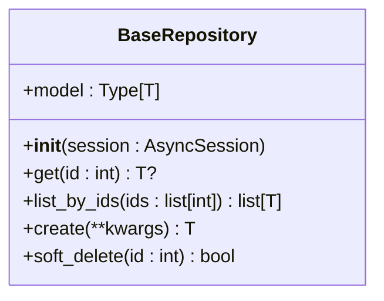
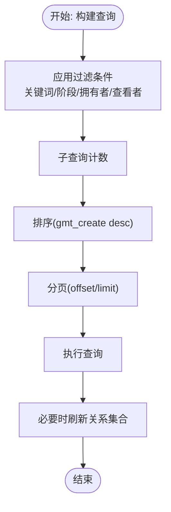
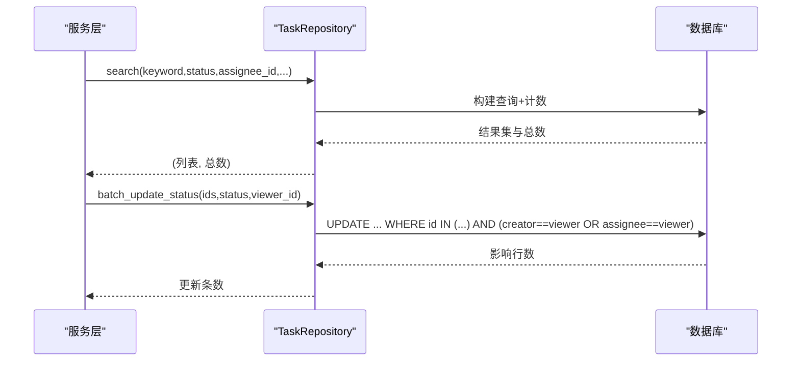
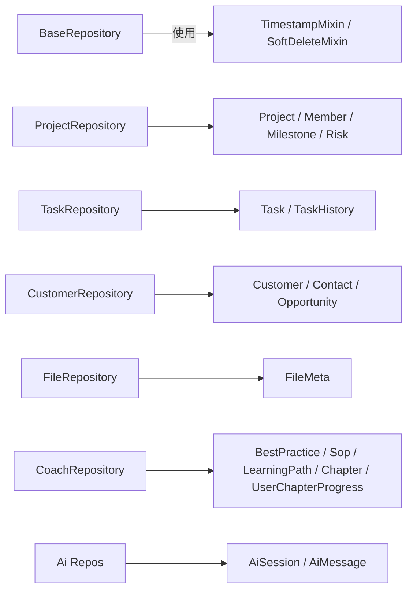

# 数据访问层

<cite>
**本文引用的文件**
- [workspace/api/app/repositories/base.py](file://workspace/api/app/repositories/base.py)
- [workspace/api/app/repositories/project_repo.py](file://workspace/api/app/repositories/project_repo.py)
- [workspace/api/app/repositories/task_repo.py](file://workspace/api/app/repositories/task_repo.py)
- [workspace/api/app/repositories/customer_repo.py](file://workspace/api/app/repositories/customer_repo.py)
- [workspace/api/app/repositories/file_repo.py](file://workspace/api/app/repositories/file_repo.py)
- [workspace/api/app/repositories/coach_repo.py](file://workspace/api/app/repositories/coach_repo.py)
- [workspace/api/app/repositories/ai_repo.py](file://workspace/api/app/repositories/ai_repo.py)
- [workspace/api/app/models/base.py](file://workspace/api/app/models/base.py)
- [workspace/api/app/models/project.py](file://workspace/api/app/models/project.py)
- [workspace/api/app/models/task.py](file://workspace/api/app/models/task.py)
- [workspace/api/app/models/customer.py](file://workspace/api/app/models/customer.py)
- [workspace/api/app/models/file.py](file://workspace/api/app/models/file.py)
- [workspace/api/app/models/coach.py](file://workspace/api/app/models/coach.py)
- [workspace/api/app/models/ai.py](file://workspace/api/app/models/ai.py)
- [workspace/api/alembic/env.py](file://workspace/api/alembic/env.py)
- [workspace/api/tests/integration/conftest.py](file://workspace/api/tests/integration/conftest.py)
- [workspace/api/docs/code-review/02-后端CR规范.md](file://workspace/api/docs/code-review/02-后端CR规范.md)
</cite>

## 目录
1. [简介](#简介)
2. [项目结构](#项目结构)
3. [核心组件](#核心组件)
4. [架构总览](#架构总览)
5. [详细组件分析](#详细组件分析)
6. [依赖分析](#依赖分析)
7. [性能考虑](#性能考虑)
8. [故障排查指南](#故障排查指南)
9. [结论](#结论)
10. [附录](#附录)

## 简介
本文件面向FDE工作台的数据访问层，系统化阐述仓储模式的设计理念与实现方式，覆盖数据访问抽象、查询封装、软删除、批量更新、历史审计、关系加载与查询优化策略，并给出最佳实践与性能优化建议。文档同时梳理了基础仓储类与各实体仓储类（项目、任务、客户、文件、教练、AI会话/消息）的职责边界与实现要点，帮助开发者在保持一致性的同时提升可维护性与性能。

## 项目结构
数据访问层位于后端API工程的“repositories”包，采用泛型基础仓储类统一提供通用CRUD能力，再由各实体仓储类扩展专属查询与业务方法。模型定义位于“models”包，统一继承基础ORM基类并混入时间戳与软删除能力；迁移脚本通过Alembic注册所有模型元数据，确保数据库Schema与代码一致。

**图表来源**
- [workspace/api/app/repositories/base.py:14-41](file://workspace/api/app/repositories/base.py#L14-L41)
- [workspace/api/app/repositories/project_repo.py:9-97](file://workspace/api/app/repositories/project_repo.py#L9-L97)
- [workspace/api/app/repositories/task_repo.py:9-142](file://workspace/api/app/repositories/task_repo.py#L9-L142)
- [workspace/api/app/repositories/customer_repo.py:9-59](file://workspace/api/app/repositories/customer_repo.py#L9-L59)
- [workspace/api/app/repositories/file_repo.py:9-46](file://workspace/api/app/repositories/file_repo.py#L9-L46)
- [workspace/api/app/repositories/coach_repo.py:9-79](file://workspace/api/app/repositories/coach_repo.py#L9-L79)
- [workspace/api/app/repositories/ai_repo.py:11-77](file://workspace/api/app/repositories/ai_repo.py#L11-L77)
- [workspace/api/app/models/project.py:9-62](file://workspace/api/app/models/project.py#L9-L62)
- [workspace/api/app/models/task.py:9-40](file://workspace/api/app/models/task.py#L9-L40)
- [workspace/api/app/models/customer.py:9-46](file://workspace/api/app/models/customer.py#L9-L46)
- [workspace/api/app/models/file.py:9-22](file://workspace/api/app/models/file.py#L9-L22)
- [workspace/api/app/models/coach.py:9-72](file://workspace/api/app/models/coach.py#L9-L72)
- [workspace/api/app/models/ai.py:9-31](file://workspace/api/app/models/ai.py#L9-L31)

**章节来源**
- [workspace/api/app/repositories/base.py:1-42](file://workspace/api/app/repositories/base.py#L1-L42)
- [workspace/api/app/repositories/project_repo.py:1-98](file://workspace/api/app/repositories/project_repo.py#L1-L98)
- [workspace/api/app/repositories/task_repo.py:1-143](file://workspace/api/app/repositories/task_repo.py#L1-L143)
- [workspace/api/app/repositories/customer_repo.py:1-60](file://workspace/api/app/repositories/customer_repo.py#L1-L60)
- [workspace/api/app/repositories/file_repo.py:1-47](file://workspace/api/app/repositories/file_repo.py#L1-L47)
- [workspace/api/app/repositories/coach_repo.py:1-80](file://workspace/api/app/repositories/coach_repo.py#L1-L80)
- [workspace/api/app/repositories/ai_repo.py:1-78](file://workspace/api/app/repositories/ai_repo.py#L1-L78)
- [workspace/api/app/models/base.py:10-24](file://workspace/api/app/models/base.py#L10-L24)
- [workspace/api/app/models/project.py:9-62](file://workspace/api/app/models/project.py#L9-L62)
- [workspace/api/app/models/task.py:9-40](file://workspace/api/app/models/task.py#L9-L40)
- [workspace/api/app/models/customer.py:9-46](file://workspace/api/app/models/customer.py#L9-L46)
- [workspace/api/app/models/file.py:9-22](file://workspace/api/app/models/file.py#L9-L22)
- [workspace/api/app/models/coach.py:9-72](file://workspace/api/app/models/coach.py#L9-L72)
- [workspace/api/app/models/ai.py:9-31](file://workspace/api/app/models/ai.py#L9-L31)

## 核心组件
- 基础仓储类：提供泛型化的通用CRUD能力，包括按主键获取、按ID列表批量查询、创建实例、软删除等。该类将“如何访问数据库”的细节抽象出来，供各实体仓储复用。
- 实体仓储类：在基础类之上，封装实体特有的查询条件、排序、分页、关联加载、批量更新、历史记录等业务方法，保证服务层只依赖仓储接口，不直接操作底层会话与SQL。
- 模型层：统一继承基础ORM基类并混入时间戳与软删除字段，确保所有实体具备一致的生命周期管理能力。

关键特性
- 软删除：通过统一的软删除字段与方法，避免物理删除带来的数据不可恢复风险。
- 关系刷新：支持在读取实体后按需刷新关联集合，确保数据一致性。
- 分页与计数：查询均配套子查询计数，返回结果集与总数，便于前端分页展示。
- 批量更新：针对任务状态与负责人批量更新提供高效SQL更新路径。
- 历史审计：任务变更记录独立表，支持变更前后快照与操作类型追踪。

**章节来源**
- [workspace/api/app/repositories/base.py:14-41](file://workspace/api/app/repositories/base.py#L14-L41)
- [workspace/api/app/models/base.py:10-24](file://workspace/api/app/models/base.py#L10-L24)
- [workspace/api/app/repositories/task_repo.py:78-86](file://workspace/api/app/repositories/task_repo.py#L78-L86)
- [workspace/api/app/repositories/project_repo.py:38-42](file://workspace/api/app/repositories/project_repo.py#L38-L42)
- [workspace/api/app/repositories/customer_repo.py:30-34](file://workspace/api/app/repositories/customer_repo.py#L30-L34)

## 架构总览
数据访问层遵循“仓储模式 + 泛型基类 + 显式会话注入”的架构，服务层通过依赖注入获得仓储实例，仓储内部持有异步会话对象，所有数据库操作在仓储内完成。迁移工具注册所有模型，确保Schema与代码同步。

**图表来源**
- [workspace/api/app/repositories/base.py:20-33](file://workspace/api/app/repositories/base.py#L20-L33)
- [workspace/api/app/repositories/task_repo.py:12-39](file://workspace/api/app/repositories/task_repo.py#L12-L39)
- [workspace/api/app/repositories/project_repo.py:12-36](file://workspace/api/app/repositories/project_repo.py#L12-L36)

**章节来源**
- [workspace/api/alembic/env.py:11-19](file://workspace/api/alembic/env.py#L11-L19)
- [workspace/api/app/repositories/base.py:17-18](file://workspace/api/app/repositories/base.py#L17-L18)

## 详细组件分析

### 基础仓储类（BaseRepository）
- 角色定位：提供泛型CRUD能力，屏蔽具体实体差异，统一会话管理。
- 关键方法
  - 获取单个实体：按主键异步获取。
  - 批量查询：按ID列表一次性查询多个实体。
  - 创建实体：构造实体并flush，返回完整实例。
  - 软删除：将is_deleted置位并flush，返回布尔结果。
- 设计要点
  - 使用TypeVar约束实体类型，确保类型安全。
  - 通过AsyncSession统一执行SQL，避免在服务层直接操作会话。
  - flush用于立即获取持久化后的状态，适合需要立即可见的场景。

**图表来源**
- [workspace/api/app/repositories/base.py:14-41](file://workspace/api/app/repositories/base.py#L14-L41)

**章节来源**
- [workspace/api/app/repositories/base.py:14-41](file://workspace/api/app/repositories/base.py#L14-L41)

### 项目仓储（ProjectRepository）
- 查询封装
  - 支持关键词、阶段、拥有者、查看者权限过滤，分页与计数。
  - 查看者权限通过子查询限制仅返回其可见项目。
- 关系加载
  - 提供按需刷新成员、里程碑、风险集合的能力。
- 成员与里程碑/风险管理
  - 新增/移除成员、查询成员列表。
  - 新增里程碑与风险。
- 仪表盘辅助
  - 按拥有者统计项目数与最近项目列表。

**图表来源**
- [workspace/api/app/repositories/project_repo.py:12-36](file://workspace/api/app/repositories/project_repo.py#L12-L36)
- [workspace/api/app/repositories/project_repo.py:38-42](file://workspace/api/app/repositories/project_repo.py#L38-L42)

**章节来源**
- [workspace/api/app/repositories/project_repo.py:9-97](file://workspace/api/app/repositories/project_repo.py#L9-L97)

### 任务仓储（TaskRepository）
- 查询封装
  - 支持关键词、状态、负责人、项目、优先级、查看者过滤，分页与计数。
  - 查看者权限：仅返回创建者或负责人的任务。
- 任务变更
  - 创建与更新任务，支持批量更新状态与负责人。
- 历史审计
  - 记录任务变更历史，支持按任务查询历史列表。
- 权限判断
  - 判断用户是否为项目成员或项目拥有者。
- 仪表盘辅助
  - 按负责人统计任务数、待处理任务数、最近任务列表、指定时间范围内的创建任务列表。

**图表来源**
- [workspace/api/app/repositories/task_repo.py:12-39](file://workspace/api/app/repositories/task_repo.py#L12-L39)
- [workspace/api/app/repositories/task_repo.py:54-76](file://workspace/api/app/repositories/task_repo.py#L54-L76)

**章节来源**
- [workspace/api/app/repositories/task_repo.py:9-142](file://workspace/api/app/repositories/task_repo.py#L9-L142)

### 客户仓储（CustomerRepository）
- 查询封装
  - 支持关键词、行业、规模过滤，分页与计数。
- 关系加载
  - 按需刷新联系人与商机集合。
- 联系人与商机管理
  - 新增联系人、查询联系人列表、查询商机列表。
- 仪表盘辅助
  - 统计活跃客户数量。

**章节来源**
- [workspace/api/app/repositories/customer_repo.py:9-59](file://workspace/api/app/repositories/customer_repo.py#L9-L59)

### 文件仓储（FileRepository）
- 查询封装
  - 支持作用域、作用域ID、关键词、扩展名、拥有者过滤，分页与计数。
- 目录树与配额
  - 按拥有者列出文件树，计算文件总大小（配额）。

**章节来源**
- [workspace/api/app/repositories/file_repo.py:9-46](file://workspace/api/app/repositories/file_repo.py#L9-L46)

### 教练仓储（CoachRepository）
- 查询封装
  - 最佳实践与SOP分别支持关键词与场景/分类过滤，分页与计数。
  - 学习路径列表查询与分页。
- 进度管理
  - 用户章节进度查询与更新（存在则更新，否则新建）。

**章节来源**
- [workspace/api/app/repositories/coach_repo.py:9-79](file://workspace/api/app/repositories/coach_repo.py#L9-L79)

### AI仓储（AiSessionRepository / AiMessageRepository）
- 会话管理
  - 按用户列出会话、按用户获取会话、创建会话、删除会话。
- 消息管理
  - 按会话列出消息、追加消息。

**章节来源**
- [workspace/api/app/repositories/ai_repo.py:11-77](file://workspace/api/app/repositories/ai_repo.py#L11-L77)

## 依赖分析
- 仓储与模型
  - 各实体仓储均依赖对应模型定义，使用关系属性进行关联加载与刷新。
- 会话注入
  - 基础仓储接收AsyncSession，确保所有数据库操作在仓储内完成，服务层无需感知会话生命周期。
- 迁移注册
  - Alembic环境文件导入所有模型，确保迁移时元数据完整。

**图表来源**
- [workspace/api/app/repositories/base.py:9-11](file://workspace/api/app/repositories/base.py#L9-L11)
- [workspace/api/app/models/base.py:15-23](file://workspace/api/app/models/base.py#L15-L23)
- [workspace/api/app/repositories/project_repo.py:4-6](file://workspace/api/app/repositories/project_repo.py#L4-L6)
- [workspace/api/app/repositories/task_repo.py:4-6](file://workspace/api/app/repositories/task_repo.py#L4-L6)
- [workspace/api/app/repositories/customer_repo.py:4-6](file://workspace/api/app/repositories/customer_repo.py#L4-L6)
- [workspace/api/app/repositories/file_repo.py:4-6](file://workspace/api/app/repositories/file_repo.py#L4-L6)
- [workspace/api/app/repositories/coach_repo.py:4-6](file://workspace/api/app/repositories/coach_repo.py#L4-L6)
- [workspace/api/app/repositories/ai_repo.py:7-8](file://workspace/api/app/repositories/ai_repo.py#L7-L8)

**章节来源**
- [workspace/api/alembic/env.py:11-19](file://workspace/api/alembic/env.py#L11-L19)

## 性能考虑
- 查询优化
  - 分页与计数：所有列表查询均配合子查询计数，避免重复扫描全表。
  - 过滤下推：尽量将过滤条件下推到SQL层，减少Python侧过滤。
  - 关系加载：按需刷新关联集合，避免N+1查询。
- 批量操作
  - 批量更新：任务状态与负责人批量更新采用UPDATE语句，减少多次往返。
  - 批量查询：list_by_ids一次性查询多条记录，降低网络开销。
- 缓存机制
  - 当前仓储未内置缓存层；可在服务层基于Redis等实现热点数据缓存（如最近项目/任务列表、用户进度等），注意缓存失效策略与一致性。
- 索引与Schema
  - 新增索引需在迁移中明确声明，确保查询性能与回滚兼容。
- 事务与资源
  - 事务需显式开启；会话在请求结束时自动释放，避免长生命周期会话导致资源泄漏。

**章节来源**
- [workspace/api/docs/code-review/02-后端CR规范.md:473-528](file://workspace/api/docs/code-review/02-后端CR规范.md#L473-L528)
- [workspace/api/app/repositories/task_repo.py:54-76](file://workspace/api/app/repositories/task_repo.py#L54-L76)
- [workspace/api/app/repositories/base.py:23-27](file://workspace/api/app/repositories/base.py#L23-L27)

## 故障排查指南
- 事务未开启导致部分写入成功
  - 症状：转账等跨表写入出现“扣款成功但入账失败”的不一致。
  - 处理：在服务层显式开启事务块，确保原子性。
- 查询无结果或权限不足
  - 症状：搜索不到数据或返回空列表。
  - 排查：检查过滤条件与权限逻辑（如项目/任务的viewer_id过滤）。
- 软删除与关联数据
  - 症状：删除后仍能看到关联集合。
  - 处理：确认查询是否包含软删除过滤条件，必要时刷新关系集合。
- 批量更新无效
  - 症状：批量更新返回0影响行数。
  - 排查：核对IDs、权限条件与目标状态值是否匹配。

**章节来源**
- [workspace/api/docs/code-review/02-后端CR规范.md:473-528](file://workspace/api/docs/code-review/02-后端CR规范.md#L473-L528)
- [workspace/api/app/repositories/project_repo.py:17-21](file://workspace/api/app/repositories/project_repo.py#L17-L21)
- [workspace/api/app/repositories/task_repo.py:54-76](file://workspace/api/app/repositories/task_repo.py#L54-L76)
- [workspace/api/app/repositories/base.py:35-41](file://workspace/api/app/repositories/base.py#L35-L41)

## 结论
本数据访问层通过泛型基础仓储统一了CRUD与软删除等通用能力，结合各实体仓储的专属查询与批量更新，实现了清晰的职责分离与良好的可扩展性。配合分页计数、关系按需刷新与批量查询等优化手段，能够在保证功能完整性的同时兼顾性能。建议在服务层引入缓存与索引治理，并严格遵循事务与资源管理规范，持续提升系统的稳定性与可维护性。

## 附录
- 测试会话模拟
  - 集成测试中通过Mock注入AsyncSession，验证仓储方法行为与异常路径。
- 迁移工具
  - Alembic环境文件统一注册模型元数据，确保Schema与代码一致。

**章节来源**
- [workspace/api/tests/integration/conftest.py:21-42](file://workspace/api/tests/integration/conftest.py#L21-L42)
- [workspace/api/alembic/env.py:11-19](file://workspace/api/alembic/env.py#L11-L19)