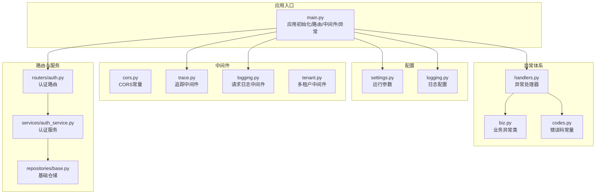
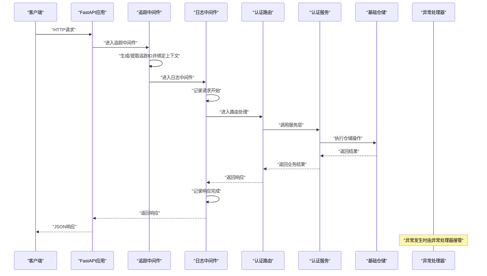
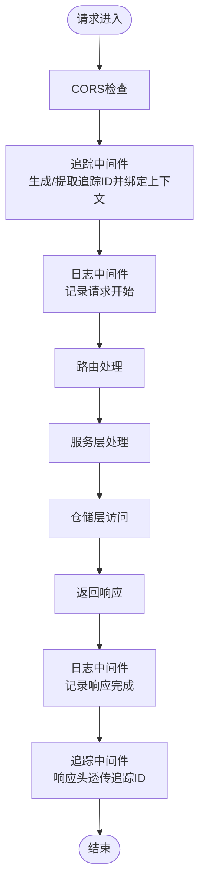
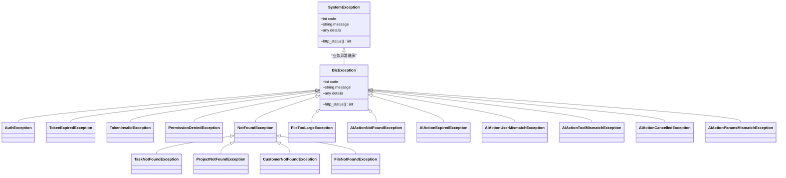
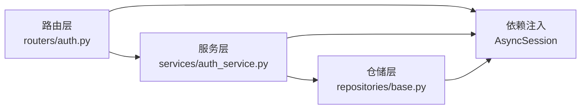
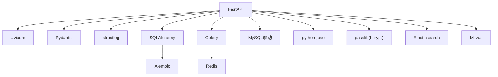

# 核心架构设计

<cite>
**本文引用的文件**
- [main.py](file://workspace/api/app/main.py)
- [settings.py](file://workspace/api/app/config/settings.py)
- [logging.py](file://workspace/api/app/config/logging.py)
- [cors.py](file://workspace/api/app/middleware/cors.py)
- [logging.py](file://workspace/api/app/middleware/logging.py)
- [trace.py](file://workspace/api/app/middleware/trace.py)
- [tenant.py](file://workspace/api/app/middleware/tenant.py)
- [handlers.py](file://workspace/api/app/exceptions/handlers.py)
- [biz.py](file://workspace/api/app/exceptions/biz.py)
- [codes.py](file://workspace/api/app/exceptions/codes.py)
- [auth.py](file://workspace/api/app/routers/auth.py)
- [auth_service.py](file://workspace/api/app/services/auth_service.py)
- [base.py](file://workspace/api/app/repositories/base.py)
- [pyproject.toml](file://workspace/api/pyproject.toml)
</cite>

## 目录
1. [简介](#简介)
2. [项目结构](#项目结构)
3. [核心组件](#核心组件)
4. [架构总览](#架构总览)
5. [详细组件分析](#详细组件分析)
6. [依赖分析](#依赖分析)
7. [性能考虑](#性能考虑)
8. [故障排查指南](#故障排查指南)
9. [结论](#结论)
10. [附录](#附录)

## 简介
本文件聚焦于FDE工作台后端API的核心架构设计，围绕FastAPI应用的初始化流程、生命周期管理、中间件体系（CORS、日志、追踪、多租户）、异常处理机制、分层架构与依赖注入、模块化组织以及可扩展性进行系统化阐述。同时提供中间件扩展与定制的实践路径，结合性能优化建议与最佳实践，帮助开发者在保证一致性的同时快速迭代。

## 项目结构
后端采用“包内模块化+分层架构”的组织方式：入口文件负责应用装配与路由注册；配置模块提供统一的运行时参数与日志策略；中间件层提供横切能力；异常体系定义清晰的业务与系统错误模型；路由层承接API契约，服务层承载业务逻辑，仓储层抽象数据访问。

**图表来源**
- [main.py:1-73](file://workspace/api/app/main.py#L1-L73)
- [settings.py:1-81](file://workspace/api/app/config/settings.py#L1-L81)
- [logging.py:1-35](file://workspace/api/app/config/logging.py#L1-L35)
- [cors.py:1-19](file://workspace/api/app/middleware/cors.py#L1-L19)
- [trace.py:1-30](file://workspace/api/app/middleware/trace.py#L1-L30)
- [logging.py:1-36](file://workspace/api/app/middleware/logging.py#L1-L36)
- [tenant.py:1-23](file://workspace/api/app/middleware/tenant.py#L1-L23)
- [handlers.py:1-99](file://workspace/api/app/exceptions/handlers.py#L1-L99)
- [biz.py:1-170](file://workspace/api/app/exceptions/biz.py#L1-L170)
- [codes.py:1-76](file://workspace/api/app/exceptions/codes.py#L1-L76)
- [auth.py:1-43](file://workspace/api/app/routers/auth.py#L1-L43)
- [auth_service.py:1-110](file://workspace/api/app/services/auth_service.py#L1-L110)
- [base.py:1-42](file://workspace/api/app/repositories/base.py#L1-L42)

**章节来源**
- [main.py:1-73](file://workspace/api/app/main.py#L1-L73)
- [pyproject.toml:1-61](file://workspace/api/pyproject.toml#L1-L61)

## 核心组件
- 应用入口与生命周期
  - 使用异步生命周期上下文管理启动与关闭阶段，当前实现为空操作，便于后续挂载数据库连接、缓存、定时任务等资源。
  - 通过构造函数传入标题、描述、版本号，统一对外暴露API元信息。
- 中间件体系
  - CORS：使用FastAPI内置中间件，白名单与方法头在入口处集中配置。
  - 追踪：为每个请求生成或复用追踪ID，绑定到structlog上下文，响应头透传，确保链路可追踪。
  - 日志：记录请求开始与完成，包含方法、路径、状态码等关键信息。
  - 多租户：从请求头提取租户ID并绑定到structlog上下文，便于审计与隔离。
- 异常处理
  - 统一响应格式，包含错误码、消息、可选详情、追踪ID；按业务异常与系统异常分别映射HTTP状态。
  - 对未捕获异常兜底返回内部错误，保障接口稳定性。
- 分层与依赖注入
  - 路由层：定义API契约与参数校验模型。
  - 服务层：封装业务规则与调用链。
  - 仓储层：提供通用CRUD与软删除能力。
  - 依赖注入：通过FastAPI依赖与SQLAlchemy会话注入，实现解耦与可测试性。

**章节来源**
- [main.py:28-67](file://workspace/api/app/main.py#L28-L67)
- [trace.py:12-30](file://workspace/api/app/middleware/trace.py#L12-L30)
- [logging.py:13-36](file://workspace/api/app/middleware/logging.py#L13-L36)
- [tenant.py:11-23](file://workspace/api/app/middleware/tenant.py#L11-L23)
- [handlers.py:31-99](file://workspace/api/app/exceptions/handlers.py#L31-L99)
- [auth.py:1-43](file://workspace/api/app/routers/auth.py#L1-L43)
- [auth_service.py:18-110](file://workspace/api/app/services/auth_service.py#L18-L110)
- [base.py:14-42](file://workspace/api/app/repositories/base.py#L14-L42)

## 架构总览
下图展示了从客户端到服务层的典型调用链路，以及中间件与异常处理在请求生命周期中的位置。

**图表来源**
- [main.py:44-67](file://workspace/api/app/main.py#L44-L67)
- [trace.py:15-30](file://workspace/api/app/middleware/trace.py#L15-L30)
- [logging.py:16-36](file://workspace/api/app/middleware/logging.py#L16-L36)
- [auth.py:19-43](file://workspace/api/app/routers/auth.py#L19-L43)
- [auth_service.py:22-76](file://workspace/api/app/services/auth_service.py#L22-L76)
- [base.py:20-41](file://workspace/api/app/repositories/base.py#L20-L41)
- [handlers.py:34-99](file://workspace/api/app/exceptions/handlers.py#L34-L99)

## 详细组件分析

### 应用初始化与生命周期
- 初始化要点
  - 日志初始化：在应用启动前完成结构化日志配置，确保中间件与业务日志一致。
  - 生命周期：通过异步上下文管理器定义启动与关闭钩子，当前为空实现，便于后续扩展。
  - 应用元信息：标题、描述、版本号统一管理，利于API文档与监控。
- 路由注册：按模块注册多个业务路由，统一前缀与标签，提升API组织性。
- 健康检查：提供轻量级健康端点，便于容器编排与负载均衡探测。

**章节来源**
- [main.py:25-73](file://workspace/api/app/main.py#L25-L73)

### 中间件系统
- CORS配置
  - 使用FastAPI内置CORSMiddleware，允许本地开发与API服务器访问，支持通配方法与头。
  - 可通过环境变量或配置文件进一步细化白名单与安全策略。
- 日志中间件
  - 记录请求开始与完成的关键指标，便于问题定位与性能分析。
- 追踪中间件
  - 生成UUID作为追踪ID，绑定到structlog上下文，响应头透传，确保跨服务链路可追踪。
- 多租户中间件
  - 从请求头读取租户ID并绑定到上下文，便于审计与数据隔离。

**图表来源**
- [main.py:44-52](file://workspace/api/app/main.py#L44-L52)
- [trace.py:15-30](file://workspace/api/app/middleware/trace.py#L15-L30)
- [logging.py:16-36](file://workspace/api/app/middleware/logging.py#L16-L36)
- [tenant.py:14-23](file://workspace/api/app/middleware/tenant.py#L14-L23)

**章节来源**
- [main.py:44-52](file://workspace/api/app/main.py#L44-L52)
- [cors.py:7-19](file://workspace/api/app/middleware/cors.py#L7-L19)
- [logging.py:13-36](file://workspace/api/app/middleware/logging.py#L13-L36)
- [trace.py:12-30](file://workspace/api/app/middleware/trace.py#L12-L30)
- [tenant.py:11-23](file://workspace/api/app/middleware/tenant.py#L11-L23)

### 异常处理机制
- 设计理念
  - 统一响应体结构，包含错误码、消息、可选详情与追踪ID，便于前端与监控系统消费。
  - 区分业务异常与系统异常，业务异常按错误码映射HTTP状态，系统异常统一返回500。
  - 对未捕获异常进行兜底处理，避免服务崩溃并保留追踪线索。
- 实现方式
  - 定义业务异常基类与常用异常类型，覆盖认证、权限、资源不存在、文件大小限制等场景。
  - 错误码常量化，按领域划分命名空间，便于维护与扩展。
  - 在异常处理器中记录结构化日志，结合追踪ID与错误详情，支撑问题排查。

**图表来源**
- [biz.py:9-170](file://workspace/api/app/exceptions/biz.py#L9-L170)
- [codes.py:17-76](file://workspace/api/app/exceptions/codes.py#L17-L76)

**章节来源**
- [handlers.py:31-99](file://workspace/api/app/exceptions/handlers.py#L31-L99)
- [biz.py:9-170](file://workspace/api/app/exceptions/biz.py#L9-L170)
- [codes.py:1-76](file://workspace/api/app/exceptions/codes.py#L1-L76)

### 分层架构与依赖注入
- 分层职责
  - 路由层：定义API契约、参数模型与鉴权策略。
  - 服务层：封装业务规则、事务边界与跨域调用。
  - 仓储层：提供通用CRUD与软删除，屏蔽具体ORM细节。
- 依赖注入
  - 通过FastAPI依赖与SQLAlchemy异步会话注入，实现路由到服务、服务到仓储的解耦。
  - 认证服务示例展示了如何在路由中注入会话并组合业务逻辑。

**图表来源**
- [auth.py:19-43](file://workspace/api/app/routers/auth.py#L19-L43)
- [auth_service.py:18-110](file://workspace/api/app/services/auth_service.py#L18-L110)
- [base.py:14-42](file://workspace/api/app/repositories/base.py#L14-L42)

**章节来源**
- [auth.py:1-43](file://workspace/api/app/routers/auth.py#L1-L43)
- [auth_service.py:18-110](file://workspace/api/app/services/auth_service.py#L18-L110)
- [base.py:14-42](file://workspace/api/app/repositories/base.py#L14-L42)

### 配置与日志
- 配置管理
  - 使用Pydantic Settings加载环境变量，提供应用名称、环境、端口、数据库、Redis、ES、Milvus、AI编排器、JWT、Celery、外部集成等参数。
  - 提供字段校验器，如JWT密钥长度校验，确保运行安全。
- 日志配置
  - 使用structlog配置结构化输出，结合上下文变量与过滤器，输出JSON格式日志，便于集中采集与检索。

**章节来源**
- [settings.py:12-81](file://workspace/api/app/config/settings.py#L12-L81)
- [logging.py:10-35](file://workspace/api/app/config/logging.py#L10-L35)

### 扩展与定制中间件
- 新增中间件步骤
  - 在中间件目录新增模块，实现BaseHTTPMiddleware的dispatch方法，处理请求前后逻辑。
  - 在应用入口导入并注册中间件，注意顺序：CORS通常在最外层，追踪与日志居中，业务中间件在内侧。
- 示例路径
  - 追踪中间件实现参考：[trace.py:12-30](file://workspace/api/app/middleware/trace.py#L12-L30)
  - 请求日志中间件实现参考：[logging.py:13-36](file://workspace/api/app/middleware/logging.py#L13-L36)
  - 多租户中间件实现参考：[tenant.py:11-23](file://workspace/api/app/middleware/tenant.py#L11-L23)
  - CORS常量与策略参考：[cors.py:7-19](file://workspace/api/app/middleware/cors.py#L7-L19)

**章节来源**
- [main.py:44-52](file://workspace/api/app/main.py#L44-L52)
- [trace.py:12-30](file://workspace/api/app/middleware/trace.py#L12-L30)
- [logging.py:13-36](file://workspace/api/app/middleware/logging.py#L13-L36)
- [tenant.py:11-23](file://workspace/api/app/middleware/tenant.py#L11-L23)
- [cors.py:7-19](file://workspace/api/app/middleware/cors.py#L7-L19)

## 依赖分析
- 框架与库
  - FastAPI、Uvicorn、Pydantic、Pydantic Settings、SQLAlchemy、Alembic、Celery、Redis、MySQL驱动、structlog、Elasticsearch、Milvus、JWE、bcrypt等。
- 开发工具
  - pytest、ruff、mypy等，保障代码质量与一致性。
- 依赖关系可视化

**图表来源**
- [pyproject.toml:9-28](file://workspace/api/pyproject.toml#L9-L28)

**章节来源**
- [pyproject.toml:1-61](file://workspace/api/pyproject.toml#L1-L61)

## 性能考虑
- 中间件顺序优化
  - 将CORS置于最外层，减少不必要的后续处理开销；追踪与日志中间件应尽量轻量，避免阻塞主链路。
- 日志与追踪
  - 结构化日志与上下文绑定有助于快速定位问题，但需控制日志级别与字段数量，避免IO瓶颈。
- 数据访问
  - 使用异步ORM与批量查询，避免N+1问题；合理使用索引与分页。
- 缓存与队列
  - 利用Redis缓存热点数据；对耗时任务使用Celery异步执行，降低请求延迟。
- 并发与超时
  - 合理设置请求超时与连接池大小，避免资源争用导致的抖动。

## 故障排查指南
- 常见问题定位
  - 业务异常：查看异常处理器的日志条目，结合追踪ID与错误详情定位根因。
  - 参数校验失败：关注验证异常处理器输出的错误明细，修正请求参数。
  - 未捕获异常：检查通用异常处理器日志，确认堆栈与追踪ID，必要时补充特定异常类型。
- 关键日志字段
  - 追踪ID：用于跨服务串联日志。
  - 请求方法/路径/状态码：快速判断请求是否正常。
  - 错误码与消息：区分业务与系统错误。
- 排查步骤
  - 通过健康端点确认服务可用性。
  - 检查中间件注册顺序与配置项。
  - 校验配置文件与环境变量，特别是JWT密钥与数据库连接串。

**章节来源**
- [handlers.py:17-99](file://workspace/api/app/exceptions/handlers.py#L17-L99)
- [main.py:70-73](file://workspace/api/app/main.py#L70-L73)

## 结论
该架构以FastAPI为核心，通过清晰的分层与中间件体系实现了高内聚、低耦合的服务设计。统一的异常处理与结构化日志提升了可观测性与可维护性。依托Pydantic Settings与依赖注入，系统具备良好的可配置性与可测试性。建议在现有基础上逐步完善生命周期资源管理、缓存与队列策略，并持续优化中间件与日志策略以满足生产环境的性能与可靠性要求。

## 附录
- 快速启动与运行
  - 使用Poetry安装依赖与运行服务，参考项目根目录的构建与运行脚本。
- API路由一览
  - 认证、仪表盘、任务、项目、客户、文件、教练、Copilot、提及、设置等模块路由均已注册，前缀与标签明确，便于统一管理与文档生成。