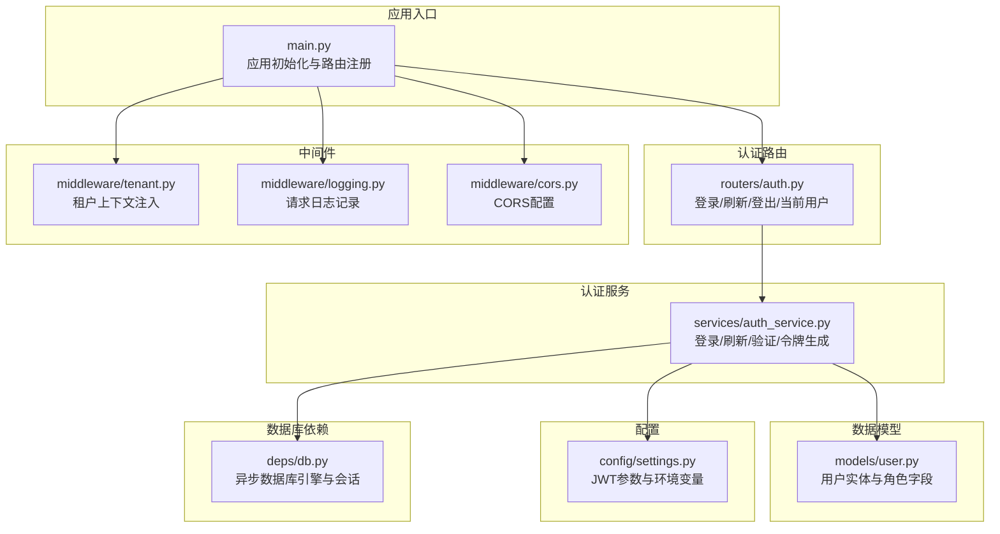
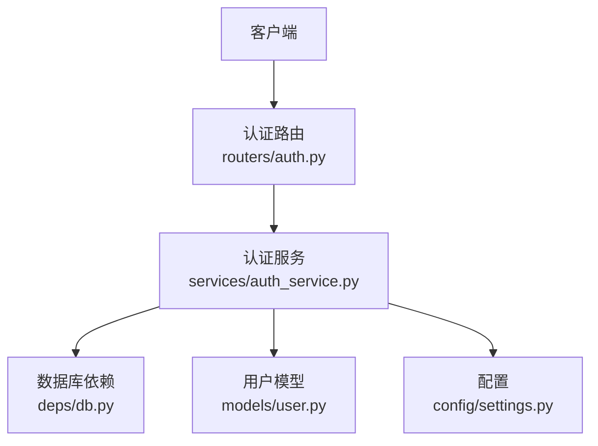
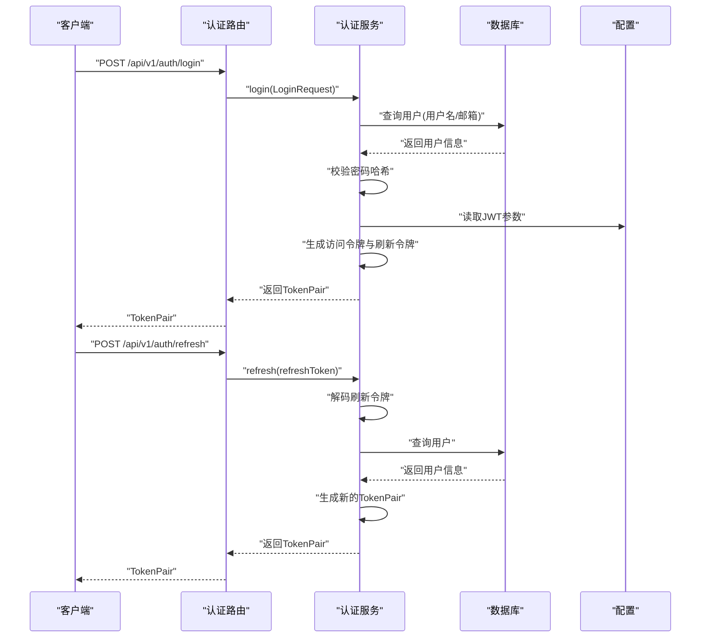
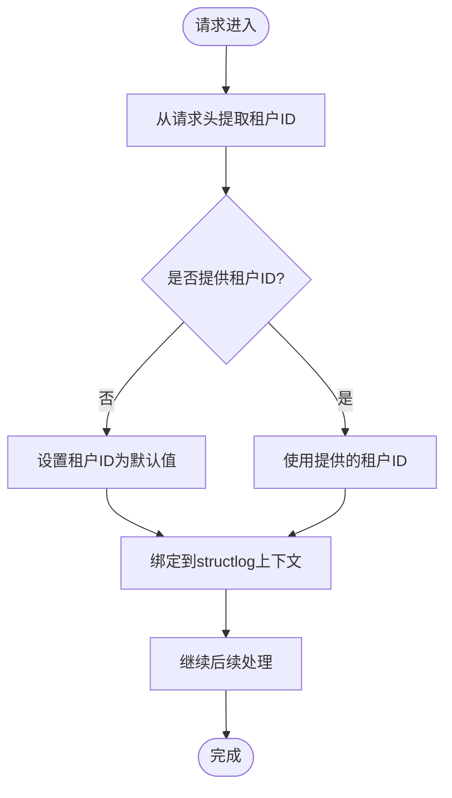
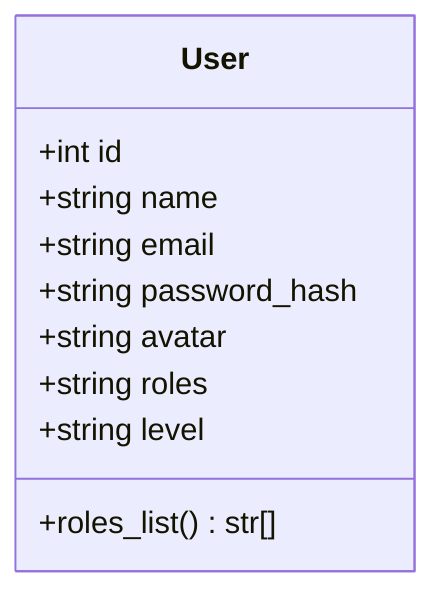
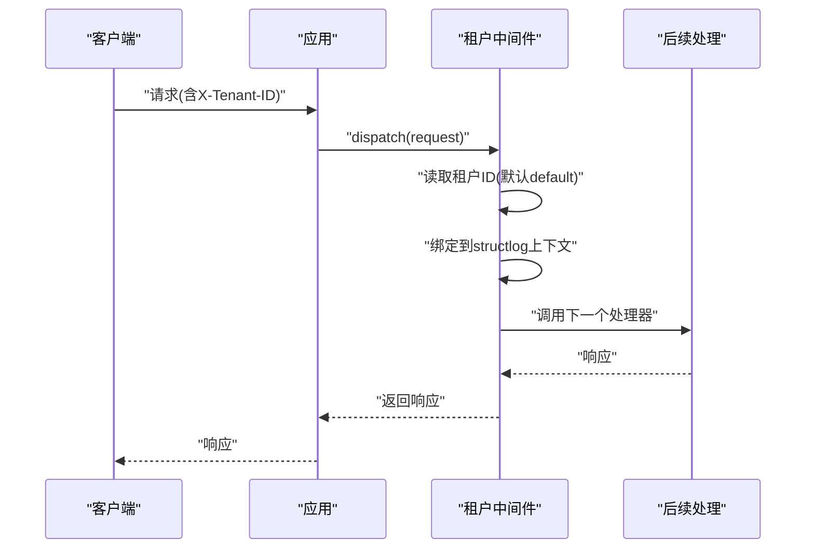
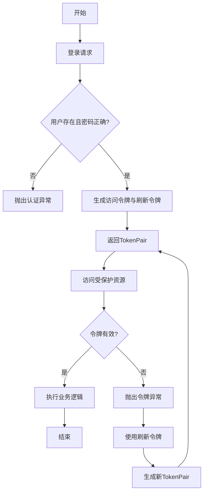
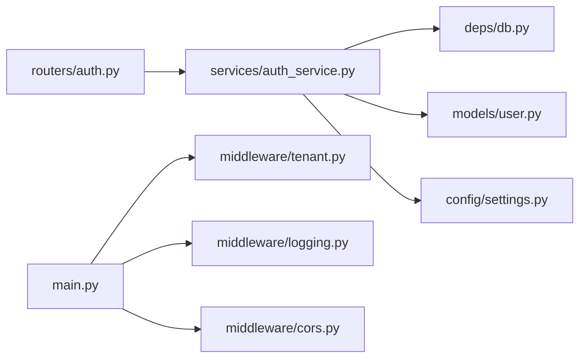

# 认证与授权系统

<cite>
**本文档引用的文件**
- [workspace/api/app/routers/auth.py](file://workspace/api/app/routers/auth.py)
- [workspace/api/app/services/auth_service.py](file://workspace/api/app/services/auth_service.py)
- [workspace/api/app/schemas/auth.py](file://workspace/api/app/schemas/auth.py)
- [workspace/api/app/middleware/tenant.py](file://workspace/api/app/middleware/tenant.py)
- [workspace/api/app/models/user.py](file://workspace/api/app/models/user.py)
- [workspace/api/app/config/settings.py](file://workspace/api/app/config/settings.py)
- [workspace/api/app/main.py](file://workspace/api/app/main.py)
- [workspace/api/app/deps/db.py](file://workspace/api/app/deps/db.py)
- [workspace/api/app/exceptions/biz.py](file://workspace/api/app/exceptions/biz.py)
- [workspace/api/app/middleware/logging.py](file://workspace/api/app/middleware/logging.py)
- [workspace/api/app/middleware/cors.py](file://workspace/api/app/middleware/cors.py)
</cite>

## 目录
1. [简介](#简介)
2. [项目结构](#项目结构)
3. [核心组件](#核心组件)
4. [架构概览](#架构概览)
5. [详细组件分析](#详细组件分析)
6. [依赖分析](#依赖分析)
7. [性能考虑](#性能考虑)
8. [故障排除指南](#故障排除指南)
9. [结论](#结论)
10. [附录](#附录)

## 简介
本文件为FDE工作台认证与授权系统的全面技术文档。内容涵盖JWT认证机制（登录、令牌生成、验证与刷新）、多租户权限系统（租户隔离、用户归属与数据安全）、RBAC权限模型（角色定义、权限分配与访问控制）、租户中间件的工作原理与配置方法，以及完整的认证流程示例与错误处理机制。同时提供安全最佳实践与常见安全问题的解决方案。

## 项目结构
后端采用FastAPI框架，认证与授权相关代码主要分布在以下模块：
- 路由层：认证接口定义与请求处理
- 服务层：认证业务逻辑（登录、令牌生成、验证、刷新）
- 模型层：用户实体与软删除、时间戳等基础能力
- 中间件层：租户上下文注入、日志记录、CORS配置
- 配置层：JWT密钥、算法、过期时间等全局参数
- 异常层：统一业务异常与HTTP状态码映射

**图表来源**
- [workspace/api/app/main.py:1-73](file://workspace/api/app/main.py#L1-L73)
- [workspace/api/app/routers/auth.py:1-43](file://workspace/api/app/routers/auth.py#L1-L43)
- [workspace/api/app/services/auth_service.py:1-110](file://workspace/api/app/services/auth_service.py#L1-L110)
- [workspace/api/app/models/user.py:1-22](file://workspace/api/app/models/user.py#L1-L22)
- [workspace/api/app/middleware/tenant.py:1-23](file://workspace/api/app/middleware/tenant.py#L1-L23)
- [workspace/api/app/middleware/logging.py:1-36](file://workspace/api/app/middleware/logging.py#L1-L36)
- [workspace/api/app/middleware/cors.py:1-19](file://workspace/api/app/middleware/cors.py#L1-L19)
- [workspace/api/app/config/settings.py:1-81](file://workspace/api/app/config/settings.py#L1-L81)
- [workspace/api/app/deps/db.py:1-64](file://workspace/api/app/deps/db.py#L1-L64)

**章节来源**
- [workspace/api/app/main.py:1-73](file://workspace/api/app/main.py#L1-L73)
- [workspace/api/app/routers/auth.py:1-43](file://workspace/api/app/routers/auth.py#L1-L43)
- [workspace/api/app/services/auth_service.py:1-110](file://workspace/api/app/services/auth_service.py#L1-L110)
- [workspace/api/app/models/user.py:1-22](file://workspace/api/app/models/user.py#L1-L22)
- [workspace/api/app/middleware/tenant.py:1-23](file://workspace/api/app/middleware/tenant.py#L1-L23)
- [workspace/api/app/middleware/logging.py:1-36](file://workspace/api/app/middleware/logging.py#L1-L36)
- [workspace/api/app/middleware/cors.py:1-19](file://workspace/api/app/middleware/cors.py#L1-L19)
- [workspace/api/app/config/settings.py:1-81](file://workspace/api/app/config/settings.py#L1-L81)
- [workspace/api/app/deps/db.py:1-64](file://workspace/api/app/deps/db.py#L1-L64)

## 核心组件
- 认证路由层：提供登录、刷新、登出、获取当前用户信息等接口，使用Pydantic模型进行请求/响应校验。
- 认证服务层：实现JWT令牌生成、验证与刷新；集成bcrypt进行密码哈希比对；通过SQLAlchemy异步查询用户信息。
- 用户模型：包含用户标识、邮箱、密码哈希、头像、角色列表与级别字段，支持软删除与时间戳。
- 租户中间件：从请求头提取租户ID并绑定到structlog上下文，便于审计与日志追踪。
- 配置管理：集中管理JWT密钥、算法、过期时间等参数，并对密钥长度进行强制校验。
- 数据库依赖：提供异步SQLAlchemy引擎与会话工厂，确保连接池与事务一致性。

**章节来源**
- [workspace/api/app/routers/auth.py:1-43](file://workspace/api/app/routers/auth.py#L1-L43)
- [workspace/api/app/services/auth_service.py:1-110](file://workspace/api/app/services/auth_service.py#L1-L110)
- [workspace/api/app/models/user.py:1-22](file://workspace/api/app/models/user.py#L1-L22)
- [workspace/api/app/middleware/tenant.py:1-23](file://workspace/api/app/middleware/tenant.py#L1-L23)
- [workspace/api/app/config/settings.py:1-81](file://workspace/api/app/config/settings.py#L1-L81)
- [workspace/api/app/deps/db.py:1-64](file://workspace/api/app/deps/db.py#L1-L64)

## 架构概览
下图展示了认证与授权系统的整体交互流程，包括客户端、路由层、服务层、数据库与配置模块之间的关系。

**图表来源**
- [workspace/api/app/routers/auth.py:1-43](file://workspace/api/app/routers/auth.py#L1-L43)
- [workspace/api/app/services/auth_service.py:1-110](file://workspace/api/app/services/auth_service.py#L1-L110)
- [workspace/api/app/models/user.py:1-22](file://workspace/api/app/models/user.py#L1-L22)
- [workspace/api/app/deps/db.py:1-64](file://workspace/api/app/deps/db.py#L1-L64)
- [workspace/api/app/config/settings.py:1-81](file://workspace/api/app/config/settings.py#L1-L81)

## 详细组件分析

### JWT认证机制
- 登录流程
  - 客户端提交用户名或邮箱与密码
  - 服务层根据标识查询用户并校验密码哈希
  - 成功后生成访问令牌与刷新令牌，设置过期时间
- 令牌验证
  - 使用JWT解码密钥与算法验证令牌有效性
  - 区分访问令牌与刷新令牌类型，防止误用
- 刷新流程
  - 使用刷新令牌解码获取用户ID
  - 查询用户是否存在且未删除，重新生成新的令牌对

**图表来源**
- [workspace/api/app/routers/auth.py:19-29](file://workspace/api/app/routers/auth.py#L19-L29)
- [workspace/api/app/services/auth_service.py:22-54](file://workspace/api/app/services/auth_service.py#L22-L54)
- [workspace/api/app/config/settings.py:40-44](file://workspace/api/app/config/settings.py#L40-L44)

**章节来源**
- [workspace/api/app/routers/auth.py:19-29](file://workspace/api/app/routers/auth.py#L19-L29)
- [workspace/api/app/services/auth_service.py:22-105](file://workspace/api/app/services/auth_service.py#L22-L105)
- [workspace/api/app/schemas/auth.py:7-22](file://workspace/api/app/schemas/auth.py#L7-L22)
- [workspace/api/app/config/settings.py:40-72](file://workspace/api/app/config/settings.py#L40-L72)

### 多租户权限系统
- 租户隔离
  - 通过请求头中的租户ID进行上下文绑定
  - 日志中间件将租户ID写入structlog上下文，便于审计
- 用户归属与数据安全
  - 用户模型包含角色字段，支持逗号分隔的角色列表
  - 建议在后续路由中结合租户ID与用户角色进行数据过滤与访问控制
- 配置与使用
  - 租户ID默认值为"default"，可通过请求头覆盖
  - CORS允许携带"X-Tenant-ID"头部

**图表来源**
- [workspace/api/app/middleware/tenant.py:14-22](file://workspace/api/app/middleware/tenant.py#L14-L22)
- [workspace/api/app/middleware/cors.py:17-18](file://workspace/api/app/middleware/cors.py#L17-L18)

**章节来源**
- [workspace/api/app/middleware/tenant.py:1-23](file://workspace/api/app/middleware/tenant.py#L1-L23)
- [workspace/api/app/middleware/logging.py:1-36](file://workspace/api/app/middleware/logging.py#L1-L36)
- [workspace/api/app/middleware/cors.py:1-19](file://workspace/api/app/middleware/cors.py#L1-L19)

### RBAC权限模型
- 角色定义
  - 用户模型的角色字段为逗号分隔字符串，如"fde,tl,pm,admin"
  - 提供角色列表属性用于便捷访问
- 权限分配与访问控制
  - 当前实现中，令牌载荷包含角色数组，可在后续路由中基于角色进行权限判断
  - 建议在路由装饰器或中间件中实现基于角色的访问控制策略
- 数据安全
  - 结合多租户上下文与角色，确保用户仅能访问其所属租户与具备权限的数据

**图表来源**
- [workspace/api/app/models/user.py:8-22](file://workspace/api/app/models/user.py#L8-L22)

**章节来源**
- [workspace/api/app/models/user.py:1-22](file://workspace/api/app/models/user.py#L1-L22)

### 租户中间件工作原理与配置
- 工作原理
  - 继承BaseHTTPMiddleware，拦截请求与响应
  - 从请求头读取"X-Tenant-ID"，默认值为"default"
  - 将租户ID绑定到structlog上下文，便于日志与审计
- 配置方法
  - 在应用入口注册中间件
  - CORS允许"X-Tenant-ID"头部，确保前端可正确传递租户信息

**图表来源**
- [workspace/api/app/middleware/tenant.py:14-22](file://workspace/api/app/middleware/tenant.py#L14-L22)
- [workspace/api/app/middleware/logging.py:1-36](file://workspace/api/app/middleware/logging.py#L1-L36)
- [workspace/api/app/middleware/cors.py:17-18](file://workspace/api/app/middleware/cors.py#L17-L18)

**章节来源**
- [workspace/api/app/middleware/tenant.py:1-23](file://workspace/api/app/middleware/tenant.py#L1-L23)
- [workspace/api/app/middleware/cors.py:1-19](file://workspace/api/app/middleware/cors.py#L1-L19)

### 认证流程示例与错误处理
- 完整认证流程
  - 客户端调用登录接口，接收令牌对
  - 后续请求携带访问令牌访问受保护资源
  - 访问令牌过期时，使用刷新令牌换取新令牌对
- 错误处理
  - 认证失败：用户名或密码错误
  - 令牌无效/过期：统一抛出业务异常并映射HTTP状态码
  - 权限不足：返回403状态码

**图表来源**
- [workspace/api/app/services/auth_service.py:22-76](file://workspace/api/app/services/auth_service.py#L22-L76)
- [workspace/api/app/exceptions/biz.py:37-62](file://workspace/api/app/exceptions/biz.py#L37-L62)

**章节来源**
- [workspace/api/app/services/auth_service.py:1-110](file://workspace/api/app/services/auth_service.py#L1-L110)
- [workspace/api/app/exceptions/biz.py:1-170](file://workspace/api/app/exceptions/biz.py#L1-L170)

## 依赖分析
- 组件耦合
  - 路由层依赖认证服务；认证服务依赖数据库会话、用户模型与配置
  - 中间件独立于业务逻辑，仅负责横切关注点（日志、租户上下文、CORS）
- 外部依赖
  - JWT加密库用于令牌生成与解析
  - bcrypt用于密码哈希
  - SQLAlchemy异步引擎与会话管理
- 潜在风险
  - JWT密钥必须足够强度，建议使用长随机密钥
  - 刷新令牌应严格校验类型与用户状态

**图表来源**
- [workspace/api/app/routers/auth.py:1-43](file://workspace/api/app/routers/auth.py#L1-L43)
- [workspace/api/app/services/auth_service.py:1-110](file://workspace/api/app/services/auth_service.py#L1-L110)
- [workspace/api/app/deps/db.py:1-64](file://workspace/api/app/deps/db.py#L1-L64)
- [workspace/api/app/models/user.py:1-22](file://workspace/api/app/models/user.py#L1-L22)
- [workspace/api/app/config/settings.py:1-81](file://workspace/api/app/config/settings.py#L1-L81)
- [workspace/api/app/main.py:1-73](file://workspace/api/app/main.py#L1-L73)
- [workspace/api/app/middleware/tenant.py:1-23](file://workspace/api/app/middleware/tenant.py#L1-L23)
- [workspace/api/app/middleware/logging.py:1-36](file://workspace/api/app/middleware/logging.py#L1-L36)
- [workspace/api/app/middleware/cors.py:1-19](file://workspace/api/app/middleware/cors.py#L1-L19)

**章节来源**
- [workspace/api/app/main.py:1-73](file://workspace/api/app/main.py#L1-L73)
- [workspace/api/app/routers/auth.py:1-43](file://workspace/api/app/routers/auth.py#L1-L43)
- [workspace/api/app/services/auth_service.py:1-110](file://workspace/api/app/services/auth_service.py#L1-L110)
- [workspace/api/app/deps/db.py:1-64](file://workspace/api/app/deps/db.py#L1-L64)
- [workspace/api/app/models/user.py:1-22](file://workspace/api/app/models/user.py#L1-L22)
- [workspace/api/app/config/settings.py:1-81](file://workspace/api/app/config/settings.py#L1-L81)
- [workspace/api/app/middleware/tenant.py:1-23](file://workspace/api/app/middleware/tenant.py#L1-L23)
- [workspace/api/app/middleware/logging.py:1-36](file://workspace/api/app/middleware/logging.py#L1-L36)
- [workspace/api/app/middleware/cors.py:1-19](file://workspace/api/app/middleware/cors.py#L1-L19)

## 性能考虑
- 令牌过期时间
  - 访问令牌过期时间较短，提升安全性；刷新令牌长期有效但需严格校验
- 密钥与算法
  - 使用强随机密钥与标准算法，避免弱密钥导致的安全风险
- 数据库连接
  - 异步SQLAlchemy连接池配置合理，SQLite场景使用单连接以避免并发问题
- 日志与中间件
  - 请求日志与租户上下文注入开销较小，建议保留以便审计与问题定位

## 故障排除指南
- JWT密钥校验失败
  - 现象：启动时报错提示JWT密钥长度不足
  - 解决：设置环境变量或.env文件中的JWT_SECRET_KEY，长度至少16位
- 认证失败
  - 现象：登录返回用户名或密码错误
  - 排查：确认用户名/邮箱与密码输入正确，检查用户是否被软删除
- 令牌无效/过期
  - 现象：访问受保护资源返回令牌无效或过期
  - 排查：使用刷新令牌换取新令牌对；检查服务器时间与时钟同步
- 权限不足
  - 现象：返回403状态码
  - 排查：确认用户角色是否具备相应权限；检查多租户上下文是否正确

**章节来源**
- [workspace/api/app/config/settings.py:63-72](file://workspace/api/app/config/settings.py#L63-L72)
- [workspace/api/app/services/auth_service.py:22-76](file://workspace/api/app/services/auth_service.py#L22-L76)
- [workspace/api/app/exceptions/biz.py:37-62](file://workspace/api/app/exceptions/biz.py#L37-L62)

## 结论
FDE工作台的认证与授权系统以JWT为核心，结合多租户中间件与RBAC角色模型，提供了清晰的登录、验证与刷新流程。通过统一的异常处理与配置管理，系统在保证安全性的同时具备良好的可维护性。建议在后续开发中完善基于角色的路由保护与数据隔离策略，进一步强化多租户场景下的访问控制。

## 附录
- 安全最佳实践
  - 强制使用HTTPS传输，避免令牌在传输过程中泄露
  - 定期轮换JWT密钥，限制密钥暴露面
  - 对敏感操作增加二次确认与审计日志
  - 实施速率限制与账户锁定策略，防范暴力破解
- 常见安全问题与解决方案
  - 令牌泄露：缩短访问令牌有效期，启用刷新令牌轮换
  - 权限提升：严格校验用户角色与租户上下文，实施最小权限原则
  - 重放攻击：引入一次性令牌与时间戳校验