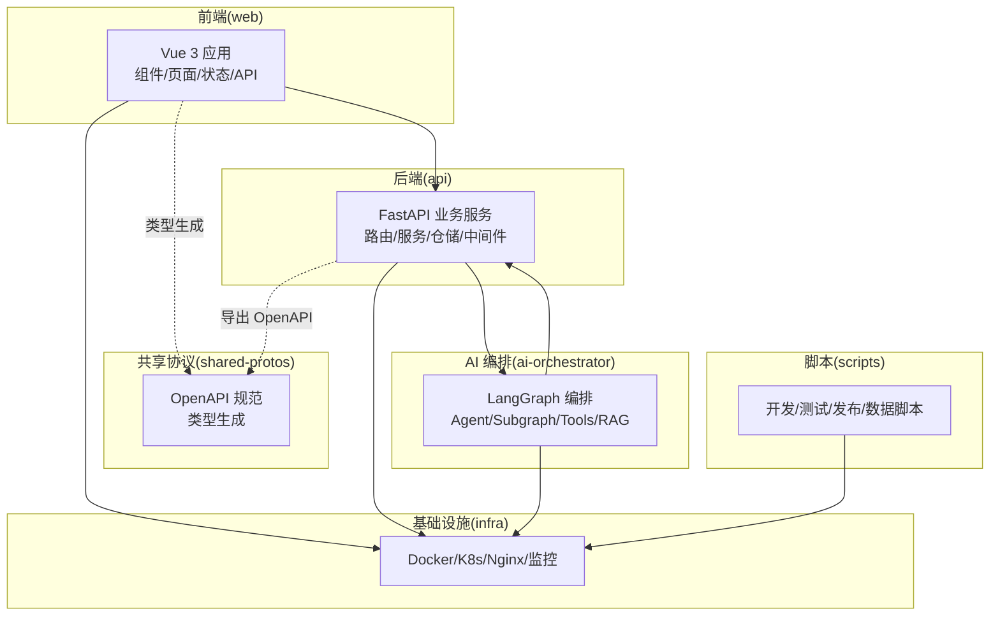
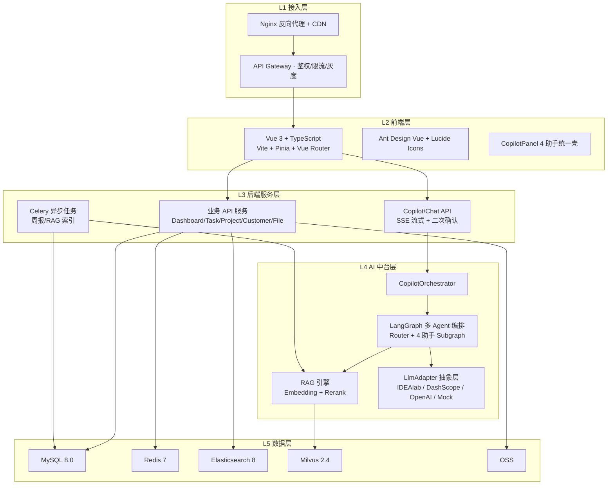
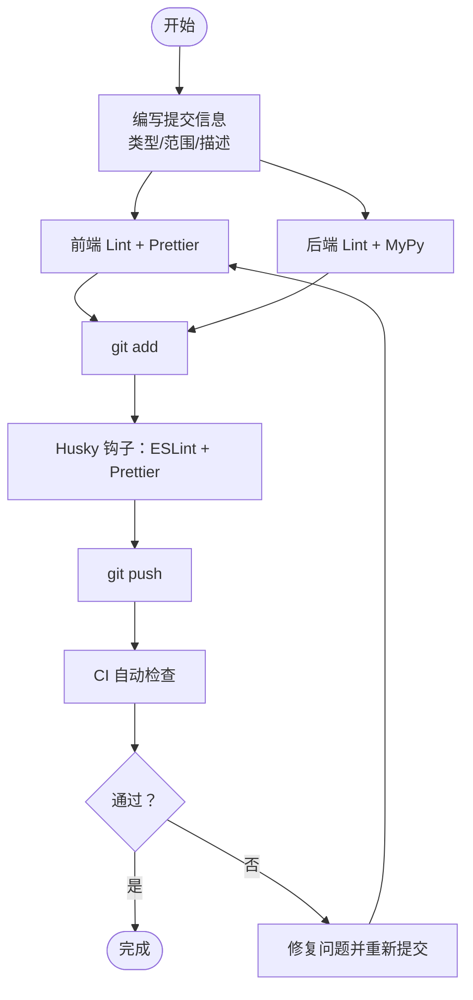
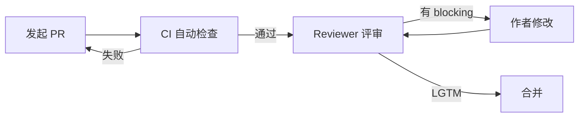
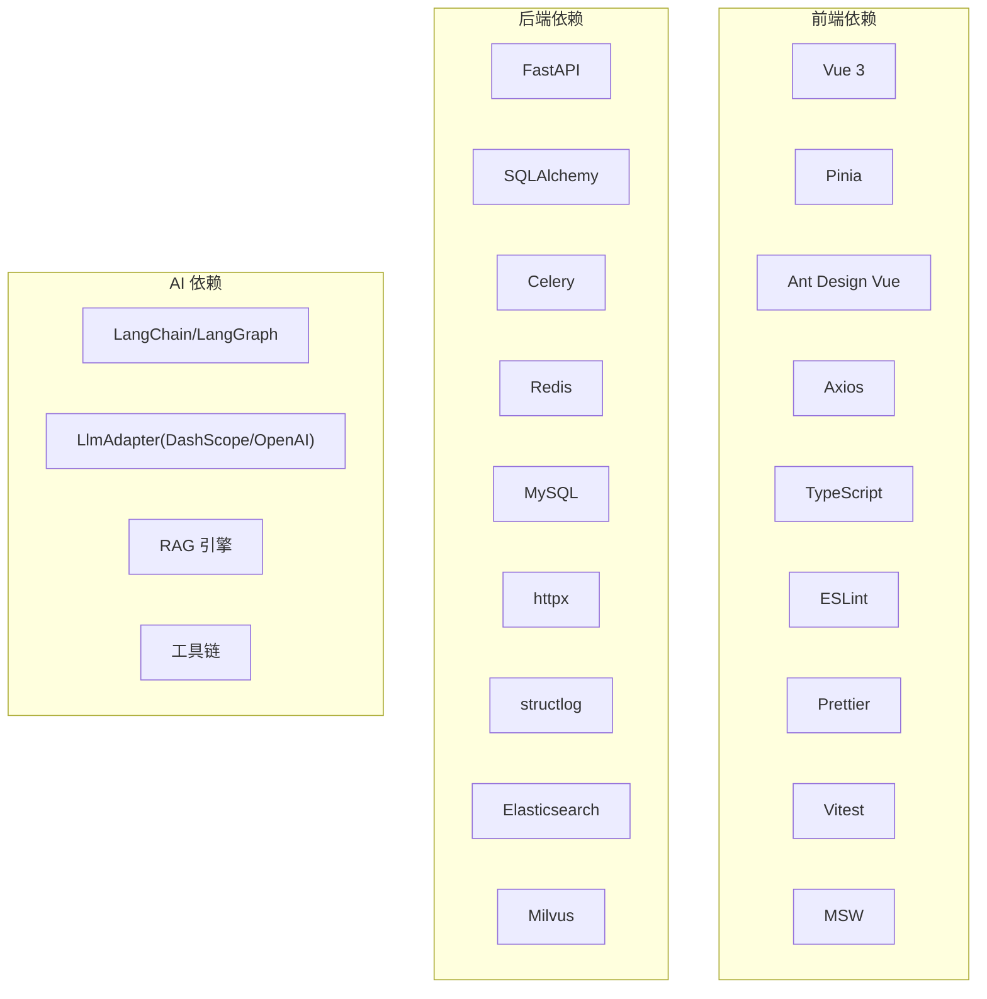

# 开发指南

<cite>
**本文引用的文件**
- [commit-msg.txt](file://commit-msg.txt)
- [package.json](file://package.json)
- [workspace/web/package.json](file://workspace/web/package.json)
- [workspace/api/pyproject.toml](file://workspace/api/pyproject.toml)
- [workspace/ai-orchestrator/pyproject.toml](file://workspace/ai-orchestrator/pyproject.toml)
- [workspace/web/.eslintrc.cjs](file://workspace/web/.eslintrc.cjs)
- [workspace/web/.prettierrc](file://workspace/web/.prettierrc)
- [workspace/web/.lintstagedrc.json](file://workspace/web/.lintstagedrc.json)
- [workspace/api/app/config/settings.py](file://workspace/api/app/config/settings.py)
- [workspace/web/vite.config.ts](file://workspace/web/vite.config.ts)
- [workspace/scripts/dev/start-dev.sh](file://workspace/scripts/dev/start-dev.sh)
- [docs/code-review/README.md](file://docs/code-review/README.md)
- [docs/code-review/00-通用规范.md](file://docs/code-review/00-通用规范.md)
- [docs/code-review/01-前端CR规范.md](file://docs/code-review/01-前端CR规范.md)
- [docs/code-review/02-后端CR规范.md](file://docs/code-review/02-后端CR规范.md)
- [docs/detail-design/00-目录结构设计.md](file://docs/detail-design/00-目录结构设计.md)
- [docs/FDE工作台技术方案.md](file://docs/FDE工作台技术方案.md)
- [docs/detail-design/01-前端详细设计.md](file://docs/detail-design/01-前端详细设计.md)
- [docs/部署文档.md](file://docs/部署文档.md)
- [workspace/scripts/dev/README.md](file://workspace/scripts/dev/README.md)
- [workspace/README.md](file://workspace/README.md)
</cite>

## 更新摘要
**变更内容**
- 更新了开发环境配置部分，反映Vite开发服务器端口从5174改回标准的5173端口
- 修正了开发环境访问地址和端口配置的一致性
- 更新了相关章节中的端口信息和访问说明

## 目录
1. [简介](#简介)
2. [项目结构](#项目结构)
3. [核心组件](#核心组件)
4. [架构总览](#架构总览)
5. [详细组件分析](#详细组件分析)
6. [依赖分析](#依赖分析)
7. [性能考量](#性能考量)
8. [故障排查指南](#故障排查指南)
9. [结论](#结论)
10. [附录](#附录)

## 简介
本开发指南面向 FDE 工作台的研发团队，覆盖开发规范、调试技巧、扩展开发、开发环境配置与常见问题处理。内容基于仓库中的代码与文档，结合统一的代码风格、Git 工作流、提交消息规范、代码审查流程以及前后端与 AI 编排服务的实现细节，帮助新老成员高效协作与高质量交付。

## 项目结构
FDE 工作台采用 monorepo 结构，核心目录与职责如下：
- workspace/web：Vue 3 + TypeScript 前端应用，包含组件、页面、状态管理、API 客户端与样式。
- workspace/api：Python FastAPI 后端服务，包含路由、服务层、仓储层、模型、中间件、异常处理、Celery 任务与集成客户端。
- workspace/ai-orchestrator：Python LangGraph 多 Agent 编排服务，包含编排图、提示词模板、工具、RAG 引擎、路由与安全审计。
- workspace/shared-protos：跨服务共享协议，包含 OpenAPI 规范与类型生成脚本。
- workspace/infra：基础设施与部署配置，包含 Docker Compose、Kubernetes/Kustomize/Helm、Nginx、监控与告警。
- workspace/scripts：开发、测试、发布与数据导入脚本。
- docs：文档库，包含技术方案、详细设计、原型、测试用例与代码审查规范。

**图示来源**
- [docs/detail-design/00-目录结构设计.md:52-86](file://docs/detail-design/00-目录结构设计.md#L52-L86)
- [docs/FDE工作台技术方案.md:45-120](file://docs/FDE工作台技术方案.md#L45-L120)

**章节来源**
- [docs/detail-design/00-目录结构设计.md:52-86](file://docs/detail-design/00-目录结构设计.md#L52-L86)
- [docs/FDE工作台技术方案.md:45-120](file://docs/FDE工作台技术方案.md#L45-L120)

## 核心组件
- 前端组件与状态管理
  - 组件分层：common/layout/copilot/business，页面按业务域划分，路由守卫负责鉴权与 Copilot 模式切换。
  - 状态管理：Pinia stores 按业务域拆分，支持会话隔离与持久化白名单。
  - API 客户端：统一 Axios 实例与 SSE 客户端封装，Mock 切换策略。
- 后端服务与数据层
  - 分层架构：Router → Service → Repository → ORM，依赖注入与异常处理统一。
  - 配置与中间件：环境变量配置、日志结构化、链路追踪、CORS、多租户与安全中间件。
  - 异步任务：Celery 任务队列，支持周报、RAG 索引与数据同步。
- AI 编排服务
  - LangGraph 多 Agent 编排，包含任务/项目/教练/文件/聊天 Agent，工具注册与 Function Calling，RAG 引擎与多模型路由。
  - 安全与审计：Prompt 注入检测、输出脱敏与操作审计。
- 共享协议与类型生成
  - 后端启动时导出 OpenAPI，前端通过脚本生成类型定义，CI 校验同步。

**章节来源**
- [docs/detail-design/00-目录结构设计.md:112-247](file://docs/detail-design/00-目录结构设计.md#L112-L247)
- [docs/detail-design/00-目录结构设计.md:258-375](file://docs/detail-design/00-目录结构设计.md#L258-L375)
- [docs/detail-design/00-目录结构设计.md:379-474](file://docs/detail-design/00-目录结构设计.md#L379-L474)
- [docs/detail-design/00-目录结构设计.md:484-503](file://docs/detail-design/00-目录结构设计.md#L484-L503)
- [workspace/web/vite.config.ts:1-36](file://workspace/web/vite.config.ts#L1-L36)
- [workspace/api/app/config/settings.py:1-81](file://workspace/api/app/config/settings.py#L1-L81)
- [workspace/web/package.json:1-59](file://workspace/web/package.json#L1-L59)

## 架构总览
整体采用 5 层架构：接入层（Nginx/Gateway）、前端层（Vue SPA）、后端服务层（FastAPI）、AI 中台层（LangGraph/RAG/Adapter）、数据层（MySQL/Redis/ES/Milvus/OSS）。核心数据流包括页面加载、Copilot 对话（SSE）、AI 写操作（actionCard 二次确认）与文件 RAG 索引与检索。

**图示来源**
- [docs/FDE工作台技术方案.md:45-120](file://docs/FDE工作台技术方案.md#L45-L120)

**章节来源**
- [docs/FDE工作台技术方案.md:45-120](file://docs/FDE工作台技术方案.md#L45-L120)

## 详细组件分析

### 代码风格与提交规范
- 提交消息规范
  - 提交信息包含类型、范围与简要描述，Bug 修复示例展示了如何描述问题、变更与 Co-Authored-By。
- 前端代码风格
  - ESLint + Prettier + Husky，提交前自动格式化与修复；规则涵盖 Vue 组件、TS 类型、未使用变量与显式 any 等。
  - Prettier 配置统一分号、单引号、缩进宽度与 printWidth。
- 后端代码风格
  - Python 使用 ruff 进行 lint，mypy 进行类型检查；pytest 与覆盖率配置统一测试入口与报告。

**图示来源**
- [commit-msg.txt:1-22](file://commit-msg.txt#L1-L22)
- [workspace/web/.eslintrc.cjs:1-21](file://workspace/web/.eslintrc.cjs#L1-L21)
- [workspace/web/.prettierrc:1-8](file://workspace/web/.prettierrc#L1-L8)
- [workspace/web/.lintstagedrc.json:1-3](file://workspace/web/.lintstagedrc.json#L1-L3)
- [workspace/api/pyproject.toml:39-57](file://workspace/api/pyproject.toml#L39-L57)
- [workspace/ai-orchestrator/pyproject.toml:21-25](file://workspace/ai-orchestrator/pyproject.toml#L21-L25)

**章节来源**
- [commit-msg.txt:1-22](file://commit-msg.txt#L1-L22)
- [workspace/web/.eslintrc.cjs:1-21](file://workspace/web/.eslintrc.cjs#L1-L21)
- [workspace/web/.prettierrc:1-8](file://workspace/web/.prettierrc#L1-L8)
- [workspace/web/.lintstagedrc.json:1-3](file://workspace/web/.lintstagedrc.json#L1-L3)
- [workspace/api/pyproject.toml:39-57](file://workspace/api/pyproject.toml#L39-L57)
- [workspace/ai-orchestrator/pyproject.toml:21-25](file://workspace/ai-orchestrator/pyproject.toml#L21-L25)

### Git 工作流与分支/提交规范
- 分支命名：feat/{Task-ID}-{kebab-desc}
- 提交类型：Conventional Commits
- 提交前检查：ESLint、Prettier、pytest、mypy、ruff
- CI：自动检查 OpenAPI 与前端类型同步、覆盖率门槛

**章节来源**
- [docs/detail-design/00-目录结构设计.md:604-605](file://docs/detail-design/00-目录结构设计.md#L604-L605)
- [workspace/web/package.json:6-16](file://workspace/web/package.json#L6-L16)
- [workspace/api/pyproject.toml:54-57](file://workspace/api/pyproject.toml#L54-L57)

### 代码审查流程与规范
- CR 哲学：协作演进、小步快跑、及时响应、Approve 即背书。
- 评论分级：blocking、nit、question、suggestion、praise。
- 工作流：发起 PR → CI 自动检查 → Reviewer 评审 → 修改后再次评审 → LGTM 合并。
- 通用 Checklist：功能正确性、可读性、性能、安全、测试、文档。
- 分栈细则：前端、后端、AI 专项规则，覆盖组件、类型、状态管理、API 设计、分层、数据库、异常处理、安全、性能、测试与文档。

**图示来源**
- [docs/code-review/README.md:70-82](file://docs/code-review/README.md#L70-L82)

**章节来源**
- [docs/code-review/README.md:1-126](file://docs/code-review/README.md#L1-L126)
- [docs/code-review/00-通用规范.md:15-96](file://docs/code-review/00-通用规范.md#L15-L96)
- [docs/code-review/01-前端CR规范.md:1-100](file://docs/code-review/01-前端CR规范.md#L1-L100)
- [docs/code-review/02-后端CR规范.md:1-120](file://docs/code-review/02-后端CR规范.md#L1-L120)

### 调试技巧与工具
- 前端调试
  - Vite 热重载、代理到后端 API（/api），SSE 客户端封装，Mock 切换（VITE_USE_MOCK）。
  - ESLint 与 Prettier 提交前修复，Vitest 单元测试。
- 后端调试
  - uvicorn 开发服务器，结构化日志（structlog），链路追踪中间件，异常处理器统一响应格式。
  - 数据库迁移（Alembic），Redis/ES/Milvus 依赖健康检查。
- AI 编排调试
  - LangGraph 状态图可视化与日志，工具调用与 RAG 检索链路跟踪，熔断与降级策略。
- 性能分析
  - 前端：路由懒加载、虚拟滚动、keep-alive 缓存、CDN 与代码分割。
  - 后端：批量查询、缓存 TTL、异步任务、数据库索引与 LIMIT。
  - AI：向量检索 Top-K、重排序、模型路由与熔断。

**章节来源**
- [workspace/web/vite.config.ts:1-36](file://workspace/web/vite.config.ts#L1-L36)
- [workspace/api/app/config/settings.py:1-81](file://workspace/api/app/config/settings.py#L1-L81)
- [docs/FDE工作台技术方案.md:543-552](file://docs/FDE工作台技术方案.md#L543-L552)

### 扩展开发指南
- 新功能开发流程
  - 设计先行：参考详细设计与任务总表，确定模块边界与接口。
  - 前端：按目录结构创建页面、组件、store 与 API 模块，类型生成与 Mock 切换。
  - 后端：新增路由、Schema、Service、Repository，迁移脚本与异常码。
  - AI：新增 Agent/Subgraph、Prompt 模板、工具与 RAG 配置。
  - 协议同步：后端导出 OpenAPI，前端生成类型，CI 校验。
- 工具扩展
  - 工具注册表与 args_schema/return_schema，确保类型安全与文档化。
- 插件开发
  - 前端插件：Ant Design Vue 与图标插件初始化。
- API 扩展
  - 统一版本前缀 /api/v1，Pydantic 校验，状态码语义化，OpenAPI 文档完整。

**章节来源**
- [docs/detail-design/00-目录结构设计.md:112-247](file://docs/detail-design/00-目录结构设计.md#L112-L247)
- [docs/detail-design/00-目录结构设计.md:258-375](file://docs/detail-design/00-目录结构设计.md#L258-L375)
- [docs/detail-design/00-目录结构设计.md:379-474](file://docs/detail-design/00-目录结构设计.md#L379-L474)
- [docs/detail-design/00-目录结构设计.md:484-503](file://docs/detail-design/00-目录结构设计.md#L484-L503)
- [docs/FDE工作台技术方案.md:693-786](file://docs/FDE工作台技术方案.md#L693-L786)

### 开发环境配置与 IDE 设置
- 依赖安装
  - 前端：npm install；后端：Poetry 安装；AI：Poetry 安装。
- 环境变量
  - 前端：.env.development/.env.production；后端：.env.example；AI：.env.example。
- 一键启动
  - start-dev.sh 支持 Docker 与原生启动，依赖健康检查、数据库迁移与日志查看。
- IDE 推荐
  - VS Code（保留 extensions.json），.editorconfig 全局配置。

**更新** 开发环境配置已更新，Vite 开发服务器端口从 5174 改回标准的 5173 端口，确保与部署文档保持一致。

**章节来源**
- [workspace/scripts/dev/start-dev.sh:1-269](file://workspace/scripts/dev/start-dev.sh#L1-L269)
- [workspace/web/package.json:1-59](file://workspace/web/package.json#L1-L59)
- [workspace/api/pyproject.toml:1-61](file://workspace/api/pyproject.toml#L1-L61)
- [workspace/ai-orchestrator/pyproject.toml:1-29](file://workspace/ai-orchestrator/pyproject.toml#L1-L29)
- [docs/detail-design/00-目录结构设计.md:611-677](file://docs/detail-design/00-目录结构设计.md#L611-L677)

## 依赖分析
- 前端依赖
  - Vue 3、Pinia、Ant Design Vue、Axios、dayjs、lodash-es、marked、dompurify。
  - 开发依赖：Vite、Vue Test Utils、TypeScript、ESLint、Prettier、vitest、msw、jsdom。
- 后端依赖
  - FastAPI、SQLAlchemy、Celery、Redis、MySQL、httpx、structlog、elasticsearch、pymilvus。
  - 开发依赖：pytest、pytest-asyncio、ruff、mypy。
- AI 依赖
  - LangChain/LangGraph、DashScope/OpenAI 适配器、RAG 与工具链。

**图示来源**
- [workspace/web/package.json:18-29](file://workspace/web/package.json#L18-L29)
- [workspace/web/package.json:30-52](file://workspace/web/package.json#L30-L52)
- [workspace/api/pyproject.toml:9-28](file://workspace/api/pyproject.toml#L9-L28)
- [workspace/api/pyproject.toml:29-38](file://workspace/api/pyproject.toml#L29-L38)
- [workspace/ai-orchestrator/pyproject.toml:8-20](file://workspace/ai-orchestrator/pyproject.toml#L8-L20)

**章节来源**
- [workspace/web/package.json:1-59](file://workspace/web/package.json#L1-L59)
- [workspace/api/pyproject.toml:1-61](file://workspace/api/pyproject.toml#L1-L61)
- [workspace/ai-orchestrator/pyproject.toml:1-29](file://workspace/ai-orchestrator/pyproject.toml#L1-L29)

## 性能考量
- 前端性能基线（PRD §7.1）
  - 首屏 FCP < 1.5s，路由切换 < 200ms，@ 引用弹窗响应 < 100ms，AI SSE 首 token < 1s。
  - 优化手段：路由懒加载、虚拟滚动、keep-alive、CDN、代码分割。
- 后端性能
  - 批量查询、selectinload/joinedload、LIMIT、事务边界、缓存 TTL、异步任务。
- AI 性能
  - 向量检索 Top-K、重排序、模型路由与熔断、工具调用幂等与缓存。

**章节来源**
- [docs/FDE工作台技术方案.md:543-552](file://docs/FDE工作台技术方案.md#L543-L552)
- [docs/code-review/01-前端CR规范.md:669-679](file://docs/code-review/01-前端CR规范.md#L669-L679)
- [docs/code-review/02-后端CR规范.md:383-540](file://docs/code-review/02-后端CR规范.md#L383-L540)

## 故障排查指南
- 启动与依赖
  - Docker 未运行：启动前检查 Docker；依赖健康检查失败：查看日志与等待时间。
  - 数据库迁移：启动后自动执行，失败时检查 Alembic 配置与权限。
- 前端问题
  - Mock 切换：确认 VITE_USE_MOCK 与 baseURL；SSE 无法连接：检查代理与 CORS。
  - 类型不一致：执行 npm run gen:types 同步 OpenAPI。
- 后端问题
  - 配置校验：JWT Secret 长度与格式；日志结构化与 traceId；异常链保留。
  - 数据库：N+1 查询、索引设计、软删除与事务边界。
- AI 问题
  - Agent 调用失败：检查工具注册与 args_schema；RAG 索引：确认解析器与向量入库。
  - 安全：Prompt 注入检测与输出脱敏。

**章节来源**
- [workspace/scripts/dev/start-dev.sh:68-149](file://workspace/scripts/dev/start-dev.sh#L68-L149)
- [workspace/api/app/config/settings.py:63-72](file://workspace/api/app/config/settings.py#L63-L72)
- [docs/code-review/02-后端CR规范.md:597-742](file://docs/code-review/02-后端CR规范.md#L597-L742)
- [docs/code-review/01-前端CR规范.md:519-547](file://docs/code-review/01-前端CR规范.md#L519-L547)

## 结论
本开发指南整合了代码风格、Git 工作流、提交消息规范、代码审查流程、调试技巧、扩展开发与环境配置，旨在帮助团队在统一规范下高效协作、持续交付高质量功能。建议在日常开发中严格遵循规范，并结合 CI 与测试用例保障质量。

## 附录
- 常用命令
  - 前端：npm run dev / dev:real、build、preview、test、lint、format、gen:types、prepare
  - 后端：poetry install、pytest、alembic upgrade head
  - AI：poetry install、uvicorn app.main:app --reload
  - 开发：./workspace/scripts/dev/start-dev.sh（支持 --native、--logs、--restart、--build）

**更新** 开发环境访问地址已更新为标准端口 5173，确保与部署文档一致。

**章节来源**
- [workspace/web/package.json:6-16](file://workspace/web/package.json#L6-L16)
- [workspace/api/pyproject.toml:54-57](file://workspace/api/pyproject.toml#L54-L57)
- [workspace/ai-orchestrator/pyproject.toml:21-25](file://workspace/ai-orchestrator/pyproject.toml#L21-L25)
- [workspace/scripts/dev/start-dev.sh:1-269](file://workspace/scripts/dev/start-dev.sh#L1-L269)