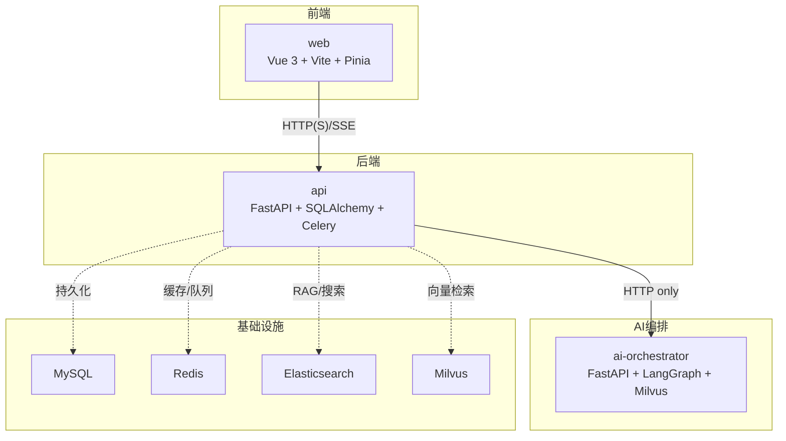
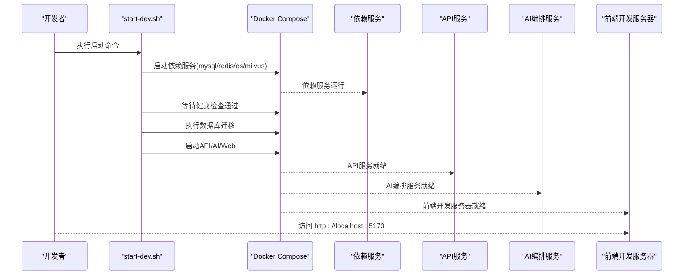
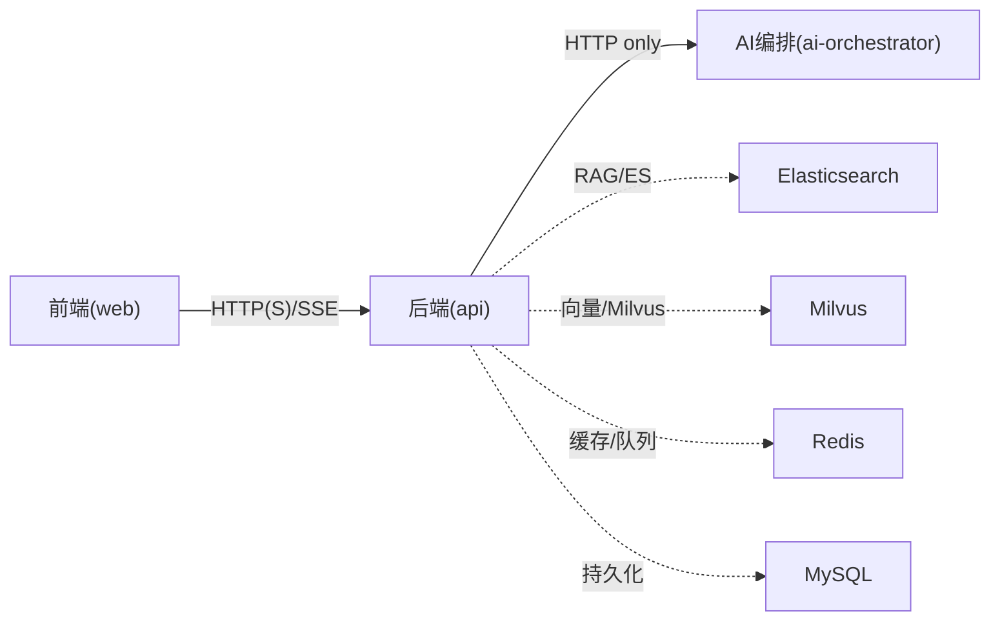

# 开发环境配置

<cite>
**本文引用的文件**
- [workspace/README.md](file://workspace/README.md)
- [package.json](file://package.json)
- [workspace/api/pyproject.toml](file://workspace/api/pyproject.toml)
- [workspace/web/package.json](file://workspace/web/package.json)
- [workspace/ai-orchestrator/pyproject.toml](file://workspace/ai-orchestrator/pyproject.toml)
- [docker-compose.yml](file://docker-compose.yml)
- [workspace/scripts/dev/start-all.sh](file://workspace/scripts/dev/start-all.sh)
- [workspace/scripts/dev/start-dev.sh](file://workspace/scripts/dev/start-dev.sh)
- [workspace/infra/docker-compose/docker-compose.deps.yml](file://workspace/infra/docker-compose/docker-compose.deps.yml)
- [workspace/infra/docker-compose/docker-compose.dev.yml](file://workspace/infra/docker-compose/docker-compose.dev.yml)
- [workspace/api/app/config/settings.py](file://workspace/api/app/config/settings.py)
- [workspace/web/vite.config.ts](file://workspace/web/vite.config.ts)
- [workspace/web/tsconfig.json](file://workspace/web/tsconfig.json)
- [workspace/api/alembic.ini](file://workspace/api/alembic.ini)
- [workspace/web/.eslintrc.cjs](file://workspace/web/.eslintrc.cjs)
- [workspace/web/.prettierrc](file://workspace/web/.prettierrc)
- [workspace/web/.lintstagedrc.json](file://workspace/web/.lintstagedrc.json)
</cite>

## 目录
1. [简介](#简介)
2. [项目结构](#项目结构)
3. [核心组件](#核心组件)
4. [架构概览](#架构概览)
5. [详细组件分析](#详细组件分析)
6. [依赖关系分析](#依赖关系分析)
7. [性能考虑](#性能考虑)
8. [故障排查指南](#故障排查指南)
9. [结论](#结论)
10. [附录](#附录)

## 简介
本文件面向FDE工作台项目的开发者，提供从零到一的开发环境配置指南。内容覆盖操作系统与硬件要求、软件版本与依赖、Docker容器与数据库初始化、AI服务与前端开发服务器的启动方式、IDE与代码质量工具的推荐配置，以及环境变量、网络与安全的最佳实践。

## 项目结构
FDE工作台采用Monorepo组织方式，包含以下主要模块：
- web：前端SPA（Vue 3 + TypeScript + Vite + Pinia），默认开发端口5173
- api：后端业务服务（Python + FastAPI + SQLAlchemy + Celery），默认端口8080
- ai-orchestrator：AI编排服务（Python + FastAPI + LangGraph + Milvus），默认端口8090
- shared-protos：共享协议（OpenAPI Spec）
- infra：基础设施（Docker Compose/Kubernetes/Helm/Nginx）
- scripts：一键启动脚本

图表来源
- [workspace/README.md:9-16](file://workspace/README.md#L9-L16)
- [workspace/README.md:47-56](file://workspace/README.md#L47-L56)
- [docker-compose.yml:5-46](file://docker-compose.yml#L5-L46)

章节来源
- [workspace/README.md:1-110](file://workspace/README.md#L1-L110)

## 核心组件
- 前端开发服务器：基于Vite，默认端口5173；支持代理到后端API（默认8080）
- 后端API服务：基于FastAPI，使用Uvicorn热重载开发模式，端口8080
- AI编排服务：基于FastAPI，使用Uvicorn热重载开发模式，端口8090
- 数据库与中间件：MySQL（8.0）、Redis（7-alpine）、Elasticsearch（8.12.0）、Milvus（v2.3.0）

章节来源
- [workspace/README.md:11-13](file://workspace/README.md#L11-L13)
- [workspace/web/package.json:7-8](file://workspace/web/package.json#L7-L8)
- [workspace/api/pyproject.toml:9-27](file://workspace/api/pyproject.toml#L9-L27)
- [workspace/ai-orchestrator/pyproject.toml:8-19](file://workspace/ai-orchestrator/pyproject.toml#L8-L19)

## 架构概览
开发环境通过Docker Compose统一编排，应用服务与依赖服务分离管理。应用服务通过健康检查确保依赖就绪后再启动；数据库迁移在容器内自动执行；前端通过Vite代理转发API请求。

图表来源
- [workspace/scripts/dev/start-dev.sh:76-149](file://workspace/scripts/dev/start-dev.sh#L76-L149)
- [workspace/infra/docker-compose/docker-compose.dev.yml:18-148](file://workspace/infra/docker-compose/docker-compose.dev.yml#L18-L148)

章节来源
- [workspace/scripts/dev/start-dev.sh:1-269](file://workspace/scripts/dev/start-dev.sh#L1-L269)
- [workspace/infra/docker-compose/docker-compose.dev.yml:1-281](file://workspace/infra/docker-compose/docker-compose.dev.yml#L1-L281)

## 详细组件分析

### 本地开发环境搭建

#### Docker容器配置
- 依赖服务（Elasticsearch、Milvus）独立compose文件，MySQL与Redis复用共享实例
- 开发compose文件提供热重载、持久化缓存与健康检查
- 应用服务通过卷挂载源码实现热重载，使用命名卷缓存node_modules与Python虚拟环境

章节来源
- [workspace/infra/docker-compose/docker-compose.deps.yml:1-44](file://workspace/infra/docker-compose/docker-compose.deps.yml#L1-L44)
- [workspace/infra/docker-compose/docker-compose.dev.yml:18-148](file://workspace/infra/docker-compose/docker-compose.dev.yml#L18-L148)

#### 数据库初始化
- 在开发compose中自动执行数据库迁移
- 迁移配置位于api模块，使用Alembic管理版本

章节来源
- [workspace/infra/docker-compose/docker-compose.dev.yml:43-47](file://workspace/infra/docker-compose/docker-compose.dev.yml#L43-L47)
- [workspace/api/alembic.ini:1-48](file://workspace/api/alembic.ini#L1-L48)

#### AI服务配置
- AI编排服务通过Dockerfile.dev构建，支持热重载
- 支持DashScope/OpenAI等LLM提供商配置（可通过环境变量注入）
- 与API服务通过HTTP通信，不进行跨服务直接导入

章节来源
- [workspace/ai-orchestrator/pyproject.toml:8-19](file://workspace/ai-orchestrator/pyproject.toml#L8-L19)
- [workspace/infra/docker-compose/docker-compose.dev.yml:68-111](file://workspace/infra/docker-compose/docker-compose.dev.yml#L68-L111)
- [workspace/README.md:47-56](file://workspace/README.md#L47-L56)

#### 前端开发服务器启动
- Vite默认端口5173，支持代理到后端API（默认8080）
- 提供真实数据模式与Mock模式切换脚本
- 通过Docker本地镜像（Dockerfile.local）或原生方式启动

章节来源
- [workspace/web/package.json:7-16](file://workspace/web/package.json#L7-L16)
- [workspace/web/vite.config.ts:17-25](file://workspace/web/vite.config.ts#L17-L25)
- [workspace/infra/docker-compose/docker-compose.dev.yml:113-148](file://workspace/infra/docker-compose/docker-compose.dev.yml#L113-L148)

### IDE设置推荐

#### VS Code配置
- 推荐插件：ESLint、Prettier、TypeScript Vue Plugin、EditorConfig、DotENV
- 设置要点：启用ESLint自动修复、Prettier格式化、TypeScript严格模式
- 调试配置：为后端服务配置Python调试（launch.json），为前端配置浏览器调试（Chrome/Firefox）

章节来源
- [workspace/web/.eslintrc.cjs:4-21](file://workspace/web/.eslintrc.cjs#L4-L21)
- [workspace/web/.prettierrc:1-8](file://workspace/web/.prettierrc#L1-L8)
- [workspace/web/tsconfig.json:18-21](file://workspace/web/tsconfig.json#L18-L21)

#### 代码格式化与静态检查
- 前端：ESLint + Prettier，支持lint-staged在提交时自动修复
- 后端：Ruff（Python）用于风格检查，Mypy用于类型检查

章节来源
- [workspace/web/.lintstagedrc.json:1-3](file://workspace/web/.lintstagedrc.json#L1-L3)
- [workspace/api/pyproject.toml:39-57](file://workspace/api/pyproject.toml#L39-L57)
- [workspace/ai-orchestrator/pyproject.toml:21-24](file://workspace/ai-orchestrator/pyproject.toml#L21-L24)

### 开发工具推荐
- Git工具：Git（含husky钩子）、lint-staged、commitlint（按需）
- 数据库客户端：DBeaver/Navicat（连接本地MySQL）
- API测试工具：Postman/Insomnia（访问http://localhost:8080/docs）
- 性能分析工具：Py-spy（Python）、Chrome DevTools/Vue DevTools（前端）

章节来源
- [workspace/web/package.json:16](file://workspace/web/package.json#L16)
- [workspace/README.md:51-56](file://workspace/README.md#L51-L56)

### 环境变量配置
- API服务关键变量：DATABASE_URL、REDIS_URL、JWT_SECRET_KEY、ES_URL、MILVUS_HOST、AI_ORCHESTRATOR_URL、LLM_PROVIDER等
- 前端关键变量：VITE_API_BASE_URL、VITE_USE_MOCK
- AI编排服务关键变量：DASHSCOPE_API_KEY、OPENAI_API_KEY、ES_HOST、MILVUS_HOST

章节来源
- [workspace/api/app/config/settings.py:12-72](file://workspace/api/app/config/settings.py#L12-L72)
- [workspace/infra/docker-compose/docker-compose.dev.yml:31-89](file://workspace/infra/docker-compose/docker-compose.dev.yml#L31-L89)
- [workspace/web/vite.config.ts:132-136](file://workspace/web/vite.config.ts#L132-L136)

### 网络配置
- 前端代理：Vite将/api前缀代理至后端API（默认8080）
- 服务间通信：API与AI编排服务通过HTTP通信，避免Python跨服务导入
- Docker网络：应用服务与依赖服务在同一bridge网络中，容器间通过服务名互访

章节来源
- [workspace/web/vite.config.ts:19-24](file://workspace/web/vite.config.ts#L19-L24)
- [workspace/README.md:47-56](file://workspace/README.md#L47-L56)
- [workspace/infra/docker-compose/docker-compose.dev.yml:49-148](file://workspace/infra/docker-compose/docker-compose.dev.yml#L49-L148)

### 安全配置最佳实践
- JWT密钥：必须设置至少16字符的安全密钥，建议使用随机值
- 环境隔离：开发与生产使用不同密钥与端点
- 依赖最小化：仅暴露必要端口，内部服务通过容器网络访问
- 健康检查：容器具备健康检查，确保服务可用性

章节来源
- [workspace/api/app/config/settings.py:63-72](file://workspace/api/app/config/settings.py#L63-L72)
- [workspace/infra/docker-compose/docker-compose.dev.yml:60-110](file://workspace/infra/docker-compose/docker-compose.dev.yml#L60-L110)

## 依赖关系分析

图表来源
- [workspace/README.md:47-56](file://workspace/README.md#L47-L56)
- [workspace/infra/docker-compose/docker-compose.dev.yml:18-281](file://workspace/infra/docker-compose/docker-compose.dev.yml#L18-L281)

章节来源
- [workspace/README.md:47-56](file://workspace/README.md#L47-L56)
- [workspace/infra/docker-compose/docker-compose.dev.yml:18-281](file://workspace/infra/docker-compose/docker-compose.dev.yml#L18-L281)

## 性能考虑
- 热重载：前端Vite与后端Uvicorn均支持热重载，提升迭代效率
- 持久化缓存：Python虚拟环境与node_modules使用命名卷缓存，减少重复安装时间
- 并行启动：依赖服务并行启动，缩短整体等待时间
- 资源限制：开发环境建议分配CPU≥4核、内存≥8GB，以保证多服务并发运行

章节来源
- [workspace/scripts/dev/start-dev.sh:102-118](file://workspace/scripts/dev/start-dev.sh#L102-L118)
- [workspace/infra/docker-compose/docker-compose.dev.yml:25-131](file://workspace/infra/docker-compose/docker-compose.dev.yml#L25-L131)

## 故障排查指南
- Docker未运行：执行脚本会检测Docker状态，若未运行请先启动Docker Desktop
- 依赖未就绪：脚本会等待依赖服务健康检查通过，超时则查看日志
- 数据库迁移失败：检查数据库连接字符串与权限，必要时手动执行迁移
- 前端无法访问API：确认Vite代理配置与后端端口一致
- AI服务不可用：检查AI编排服务健康检查与LLM提供商密钥

章节来源
- [workspace/scripts/dev/start-dev.sh:68-74](file://workspace/scripts/dev/start-dev.sh#L68-L74)
- [workspace/scripts/dev/start-dev.sh:102-118](file://workspace/scripts/dev/start-dev.sh#L102-L118)
- [workspace/infra/docker-compose/docker-compose.dev.yml:120-124](file://workspace/infra/docker-compose/docker-compose.dev.yml#L120-L124)

## 结论
通过Docker Compose与一键启动脚本，FDE工作台提供了高度一致且高效的本地开发体验。遵循本文档的环境配置、网络与安全最佳实践，可快速搭建稳定可靠的开发环境，并在多服务协同下高效迭代。

## 附录

### 快速启动命令
- 一键启动全部服务（推荐）：参考[workspace/README.md:24-28](file://workspace/README.md#L24-L28)
- 仅启动依赖并分别启动各服务：参考[workspace/README.md:32-41](file://workspace/README.md#L32-L41)
- 使用start-dev.sh脚本：参考[workspace/scripts/dev/start-dev.sh:229-268](file://workspace/scripts/dev/start-dev.sh#L229-L268)

### 端口与服务映射
- 前端：5173 → 5173
- API：8080 → 8080
- AI编排：8090 → 8090
- MySQL：3306 → 3306
- Redis：6379 → 6379
- Elasticsearch：9200 → 9200
- Milvus：19530 → 19530, 9091 → 9091

章节来源
- [workspace/README.md:11-13](file://workspace/README.md#L11-L13)
- [workspace/infra/docker-compose/docker-compose.dev.yml:23-264](file://workspace/infra/docker-compose/docker-compose.dev.yml#L23-L264)