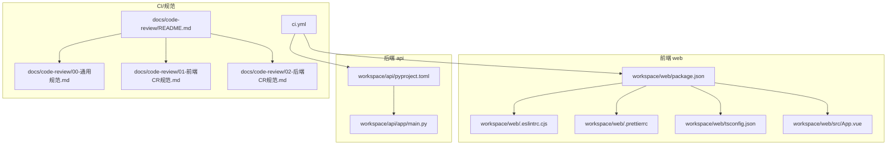
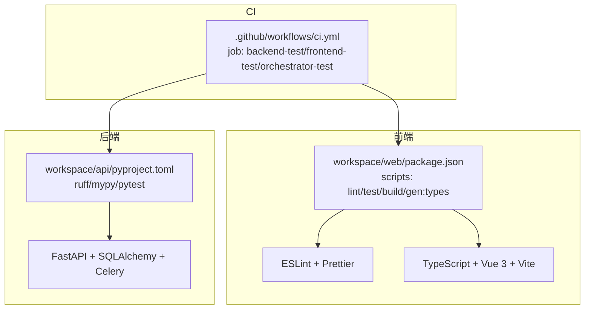
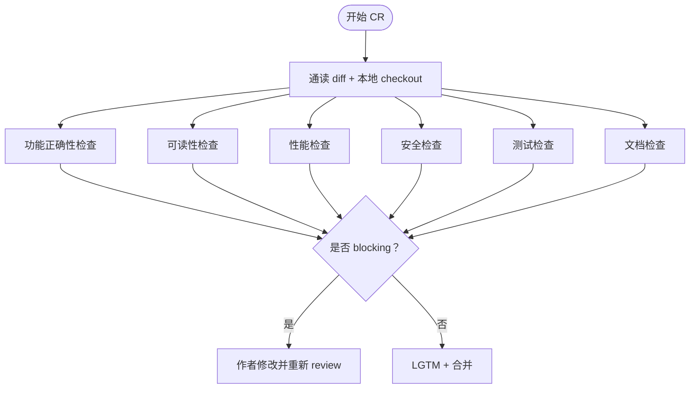
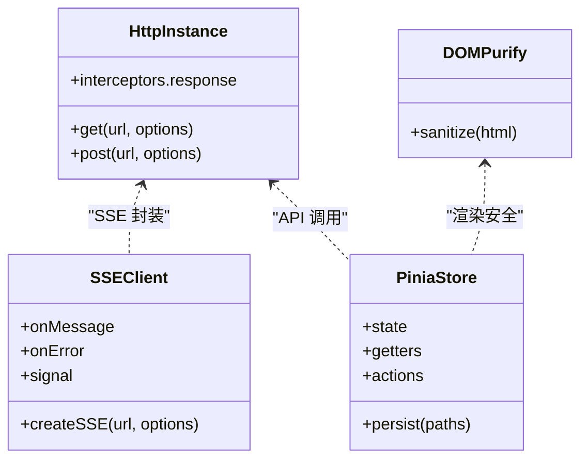
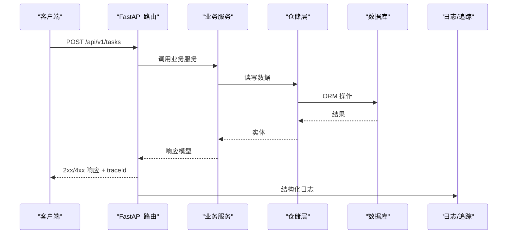
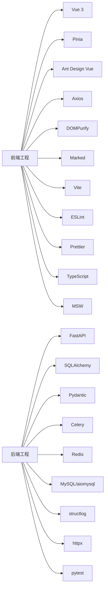

# 开发规范

<cite>
**本文引用的文件**
- [docs/code-review/README.md](file://docs/code-review/README.md)
- [docs/code-review/00-通用规范.md](file://docs/code-review/00-通用规范.md)
- [docs/code-review/01-前端CR规范.md](file://docs/code-review/01-前端CR规范.md)
- [docs/code-review/02-后端CR规范.md](file://docs/code-review/02-后端CR规范.md)
- [.github/workflows/ci.yml](file://.github/workflows/ci.yml)
- [package.json](file://package.json)
- [workspace/web/package.json](file://workspace/web/package.json)
- [workspace/api/pyproject.toml](file://workspace/api/pyproject.toml)
- [workspace/web/.eslintrc.cjs](file://workspace/web/.eslintrc.cjs)
- [workspace/web/.prettierrc](file://workspace/web/.prettierrc)
- [workspace/web/tsconfig.json](file://workspace/web/tsconfig.json)
- [workspace/api/app/main.py](file://workspace/api/app/main.py)
- [workspace/web/src/App.vue](file://workspace/web/src/App.vue)
</cite>

## 目录
1. [简介](#简介)
2. [项目结构](#项目结构)
3. [核心组件](#核心组件)
4. [架构总览](#架构总览)
5. [详细组件分析](#详细组件分析)
6. [依赖关系分析](#依赖关系分析)
7. [性能考量](#性能考量)
8. [故障排查指南](#故障排查指南)
9. [结论](#结论)
10. [附录](#附录)

## 简介
本规范面向 FDE 工作台 v1.0 的全栈研发团队，旨在统一代码风格、Git 工作流、代码审查（CR）流程与质量基线。规范库包含 4 份文档：通用规范 + 前端专项 + 后端专项 + AI 专项，覆盖功能正确性、可读性、性能、安全、测试、文档六大维度，并提供大量 good/bad 对照示例，帮助开发者高效落地。

## 项目结构
FDE 工作台采用“多工程”组织方式，分为前端 web、后端 api、AI 编排器 ai-orchestrator、基础设施与脚本等模块。CR 规范按“通用 + 分栈”的方式组织，确保全栈一致性与专业性。

**图表来源**
- [.github/workflows/ci.yml:1-106](file://.github/workflows/ci.yml#L1-L106)
- [workspace/web/package.json:1-59](file://workspace/web/package.json#L1-L59)
- [workspace/web/.eslintrc.cjs:1-21](file://workspace/web/.eslintrc.cjs#L1-L21)
- [workspace/web/.prettierrc:1-8](file://workspace/web/.prettierrc#L1-L8)
- [workspace/web/tsconfig.json:1-35](file://workspace/web/tsconfig.json#L1-L35)
- [workspace/web/src/App.vue:1-17](file://workspace/web/src/App.vue#L1-L17)
- [workspace/api/pyproject.toml:1-61](file://workspace/api/pyproject.toml#L1-L61)
- [workspace/api/app/main.py:1-73](file://workspace/api/app/main.py#L1-L73)
- [docs/code-review/README.md:1-126](file://docs/code-review/README.md#L1-L126)
- [docs/code-review/00-通用规范.md:1-1223](file://docs/code-review/00-通用规范.md#L1-L1223)
- [docs/code-review/01-前端CR规范.md:1-1085](file://docs/code-review/01-前端CR规范.md#L1-L1085)
- [docs/code-review/02-后端CR规范.md:1-1573](file://docs/code-review/02-后端CR规范.md#L1-L1573)

**章节来源**
- [docs/code-review/README.md:1-126](file://docs/code-review/README.md#L1-L126)
- [docs/code-review/00-通用规范.md:1-1223](file://docs/code-review/00-通用规范.md#L1-L1223)
- [docs/code-review/01-前端CR规范.md:1-1085](file://docs/code-review/01-前端CR规范.md#L1-L1085)
- [docs/code-review/02-后端CR规范.md:1-1573](file://docs/code-review/02-后端CR规范.md#L1-L1573)

## 核心组件
- 通用规范：定义 CR 哲学、六大类 Checklist、评论分级、决议机制与流程基线，是所有分栈规范的根基。
- 前端专项：聚焦 Vue 组件、TypeScript 类型、Pinia 状态、API/SSE 调用、性能与安全、测试与 Lint。
- 后端专项：聚焦 FastAPI 路由与 Schema、REST 状态码、Service/Repository 分层、数据库 ORM/索引/迁移、异常与日志、安全与幂等。
- AI 专项：聚焦 LangGraph Agent、Prompt 工程、Function Calling、RAG、LLM Adapter、AI 安全与测试。

**章节来源**
- [docs/code-review/README.md:19-26](file://docs/code-review/README.md#L19-L26)
- [docs/code-review/00-通用规范.md:15-96](file://docs/code-review/00-通用规范.md#L15-L96)
- [docs/code-review/01-前端CR规范.md:1-12](file://docs/code-review/01-前端CR规范.md#L1-L12)
- [docs/code-review/02-后端CR规范.md:1-12](file://docs/code-review/02-后端CR规范.md#L1-L12)

## 架构总览
FDE 工作台采用“前端 SPA + 后端 API + AI 编排器”的三层架构。CI 流水线分别对前端、后端、AI 编排器进行 lint、类型检查与测试，确保质量门槛。

**图表来源**
- [workspace/web/package.json:6-16](file://workspace/web/package.json#L6-L16)
- [workspace/web/.eslintrc.cjs:4-20](file://workspace/web/.eslintrc.cjs#L4-L20)
- [workspace/web/.prettierrc:1-8](file://workspace/web/.prettierrc#L1-L8)
- [workspace/web/tsconfig.json:18-21](file://workspace/web/tsconfig.json#L18-L21)
- [workspace/api/pyproject.toml:39-57](file://workspace/api/pyproject.toml#L39-L57)
- [.github/workflows/ci.yml:9-52](file://.github/workflows/ci.yml#L9-L52)

**章节来源**
- [.github/workflows/ci.yml:1-106](file://.github/workflows/ci.yml#L1-L106)
- [workspace/web/package.json:6-16](file://workspace/web/package.json#L6-L16)
- [workspace/api/pyproject.toml:39-57](file://workspace/api/pyproject.toml#L39-L57)

## 详细组件分析

### 通用规范（全栈基线）
- CR 哲学：协作演进、对事不对人、小步快跑、及时响应、Approve 即背书。
- 六大类 Checklist：功能正确性（边界/异常/事务/幂等/并发）、可读性（命名/函数长度/注释/魔法数字/重复/Dead Code）、性能（N+1/分页/基线/阻塞/缓存）、安全（输入校验/输出转义/SQL 参数化/敏感日志/越权/密钥）、测试（单测/回归/Mock/覆盖率/独立）、文档（docstring/JSDoc/OpenAPI）。
- 评论分级：blocking（阻塞合并）、nit（微改进）、question（提问）、suggestion（下期）、praise（称赞）。
- 决议机制：分歧时按严重性分级处理，必要时 Senior 仲裁。

**图表来源**
- [docs/code-review/00-通用规范.md:15-96](file://docs/code-review/00-通用规范.md#L15-L96)
- [docs/code-review/00-通用规范.md:100-765](file://docs/code-review/00-通用规范.md#L100-L765)

**章节来源**
- [docs/code-review/00-通用规范.md:15-96](file://docs/code-review/00-通用规范.md#L15-L96)
- [docs/code-review/00-通用规范.md:100-765](file://docs/code-review/00-通用规范.md#L100-L765)

### 前端规范（Vue 3 + TypeScript + Pinia）
- 组件规范：Composition API + `<script setup lang="ts>`，Props 显式类型与默认值，Emits 声明类型，单文件 ≤ 300 行，命名 PascalCase/use 前缀，避免解构 reactive 失去响应。
- TypeScript：禁用 any，API 类型来自 OpenAPI 自动生成，类型 import 用 import type，复杂泛型加注释，禁用未经检查的非空断言 `!`。
- 状态管理：按业务域拆分 Store，派生数据用 getters，Action 必处理异常，禁止循环依赖，持久化字段白名单。
- API/SSE：统一经 http.ts 实例与 sse.ts 封装，错误拦截 + 业务级 try/catch，Mock 走 MSW，请求取消防竞态。
- 性能：v-for 稳定 key，大列表虚拟滚动，路由/组件懒加载，模板内避免重复方法调用，图片懒加载，满足 PRD 性能基线。
- 安全：v-html 必经 DOMPurify，跳转 URL 白名单校验，localStorage 禁存敏感信息，表单输入前端校验，第三方依赖审计。
- 测试：组件单测用 @vue/test-utils + Vitest，业务组件必测交互行为。

**图表来源**
- [docs/code-review/01-前端CR规范.md:442-575](file://docs/code-review/01-前端CR规范.md#L442-L575)
- [docs/code-review/01-前端CR规范.md:691-793](file://docs/code-review/01-前端CR规范.md#L691-L793)
- [package.json:3-4](file://package.json#L3-L4)

**章节来源**
- [docs/code-review/01-前端CR规范.md:15-169](file://docs/code-review/01-前端CR规范.md#L15-L169)
- [docs/code-review/01-前端CR规范.md:172-297](file://docs/code-review/01-frontendCR规范.md#L172-L297)
- [docs/code-review/01-前端CR规范.md:299-439](file://docs/code-review/01-前端CR规范.md#L299-L439)
- [docs/code-review/01-前端CR规范.md:442-575](file://docs/code-review/01-前端CR规范.md#L442-L575)
- [docs/code-review/01-前端CR规范.md:578-688](file://docs/code-review/01-前端CR规范.md#L578-L688)
- [docs/code-review/01-前端CR规范.md:691-793](file://docs/code-review/01-前端CR规范.md#L691-L793)

### 后端规范（FastAPI + SQLAlchemy + Celery）
- API 设计：路由带版本号 /api/v1，Request/Response 用 Pydantic Schema，REST 状态码语义化，Query params 用 Pydantic 校验，写操作幂等，OpenAPI 文档完整。
- 分层：Router 只做参数 + 调 Service + 组装响应；Service 不直接写 SQL；Repository 只关心数据；跨模块调用走 Service；依赖注入用 Depends。
- 数据库：ORM 优先，N+1 用 selectinload/joinedload，大表查询带 LIMIT，事务显式 begin，Alembic 迁移有 downgrade，索引设计需 review，时间字段统一 UTC + created_at/updated_at，业务表软删除。
- 异常：业务异常用 BizException + ErrorCode 集中定义，禁止 silent catch，日志结构化 + traceId，统一错误响应格式，异常链 from 不丢。
- 安全：除 /auth 外所有路由依赖 current_user，行级权限显式校验，输入经 Pydantic 校验。
- 测试：pytest + pytest-asyncio，覆盖率门槛，Mock 仅对外部依赖。

**图表来源**
- [docs/code-review/02-后端CR规范.md:15-190](file://docs/code-review/02-后端CR规范.md#L15-L190)
- [docs/code-review/02-后端CR规范.md:193-381](file://docs/code-review/02-后端CR规范.md#L193-L381)
- [docs/code-review/02-后端CR规范.md:384-594](file://docs/code-review/02-后端CR规范.md#L384-L594)
- [docs/code-review/02-后端CR规范.md:597-742](file://docs/code-review/02-后端CR规范.md#L597-L742)
- [workspace/api/app/main.py:58-67](file://workspace/api/app/main.py#L58-L67)

**章节来源**
- [docs/code-review/02-后端CR规范.md:15-190](file://docs/code-review/02-后端CR规范.md#L15-L190)
- [docs/code-review/02-后端CR规范.md:193-381](file://docs/code-review/02-后端CR规范.md#L193-L381)
- [docs/code-review/02-后端CR规范.md:384-594](file://docs/code-review/02-后端CR规范.md#L384-L594)
- [docs/code-review/02-后端CR规范.md:597-742](file://docs/code-review/02-后端CR规范.md#L597-L742)
- [workspace/api/app/main.py:58-67](file://workspace/api/app/main.py#L58-L67)

### Git 工作流与提交规范
- 分支命名：建议采用 feature/issue/bug 前缀，结合故事编号与简述，例如 feature/WBS-123-add-login。
- 提交消息：采用约定式提交（可选），主体描述清晰、简洁，必要时引用 Issue 编号。
- PR 创建与合并：PR 描述需包含背景、方案、影响、测试与截图；CI 通过后由 Reviewer 评审；Blocking 问题必须修改后重审；Approve 即背书，需附 LGTM。
- 代码审查：遵循通用规范的六大类 Checklist 与评论分级；Hotfix/Blocker/常规/重构响应时效不同；分歧时 Senior 仲裁。

**章节来源**
- [docs/code-review/README.md:70-93](file://docs/code-review/README.md#L70-L93)

### 代码风格与工具链
- 前端
  - ESLint：继承 vue/vue3-essential、typescript、prettier 规则，关闭多词组件名强制，开启未使用变量警告。
  - Prettier：单引号、无分号、2 空格、尾逗号、宽度 100。
  - TypeScript：严格模式、无未使用局部变量/参数、switch 无贯穿。
  - 依赖：dompurify、marked 等，类型定义齐全。
- 后端
  - Ruff：行宽 120，规则集合包含 E/F/W/I/N/UP/B/C4/SIM，忽略 E501。
  - Mypy：严格类型检查，开启 pydantic 插件。
  - Pytest：自动协程模式，覆盖率统计。

**章节来源**
- [workspace/web/.eslintrc.cjs:4-20](file://workspace/web/.eslintrc.cjs#L4-L20)
- [workspace/web/.prettierrc:1-8](file://workspace/web/.prettierrc#L1-L8)
- [workspace/web/tsconfig.json:18-21](file://workspace/web/tsconfig.json#L18-L21)
- [workspace/web/package.json:30-52](file://workspace/web/package.json#L30-L52)
- [workspace/api/pyproject.toml:39-57](file://workspace/api/pyproject.toml#L39-L57)

### CI 与质量门禁
- CI 作业：后端测试（ruff + mypy + pytest）、前端测试（vue-tsc + eslint + vitest）、AI 编排器测试（ruff + pytest）。
- 构建镜像：在 master 推送时构建 API/Web/AI 三镜像，开启缓存加速。
- 门禁策略：Lint/类型检查/测试必须通过，覆盖率达标（核心业务 ≥ 80%，整体 ≥ 70%）。

**章节来源**
- [.github/workflows/ci.yml:9-52](file://.github/workflows/ci.yml#L9-L52)
- [.github/workflows/ci.yml:74-105](file://.github/workflows/ci.yml#L74-L105)

## 依赖关系分析
- 前端依赖：Vue 3、Pinia、Ant Design Vue、Axios、DOMPurify、Marked、Vite、ESLint、Prettier、TypeScript、Vitest、MSW 等。
- 后端依赖：FastAPI、SQLAlchemy、Pydantic、Celery、Redis、MySQL/aiomysql、structlog、httpx、pytest 等。
- 规范与工具：ESLint/Prettier/TSConfig/Ruff/Mypy/Pytest/CI YAML 构成质量基线。

**图表来源**
- [workspace/web/package.json:18-28](file://workspace/web/package.json#L18-L28)
- [workspace/web/package.json:30-52](file://workspace/web/package.json#L30-L52)
- [workspace/api/pyproject.toml:9-27](file://workspace/api/pyproject.toml#L9-L27)

**章节来源**
- [workspace/web/package.json:1-59](file://workspace/web/package.json#L1-L59)
- [workspace/api/pyproject.toml:1-61](file://workspace/api/pyproject.toml#L1-L61)

## 性能考量
- 前端
  - 首屏与路由切换：满足 PRD 基线（FCP < 1.5s、切换 < 200ms、AI SSE 首 token < 1s、@ 引用弹窗 < 100ms）。
  - 大列表：虚拟滚动或 Ant Design Vue 虚拟列表。
  - 懒加载：路由级与重型组件懒加载。
  - 避免模板内重复方法调用，使用 computed。
  - 图片懒加载（除首屏关键图外）。
- 后端
  - N+1 查询：selectinload/joinedload。
  - 分页与 LIMIT：列表接口默认分页，大表查询带 LIMIT。
  - 异步阻塞：CPU 密集任务使用线程池或 Celery。
  - 缓存：明确 TTL、失效策略与穿透保护。

**章节来源**
- [docs/code-review/01-前端CR规范.md:578-688](file://docs/code-review/01-前端CR规范.md#L578-L688)
- [docs/code-review/02-后端CR规范.md:384-594](file://docs/code-review/02-后端CR规范.md#L384-L594)

## 故障排查指南
- CR 争议处理：按 blocking/非 blocking 分级，分歧时 Senior 仲裁，2 小时内必须给出结论。
- 评论分级误用：必须使用强制前缀（blocking/nit/question/suggestion/praise），避免模糊不清。
- 本地验证：Reviewer 必须至少本地 checkout 一次，涉及关键流程时尤为必要。
- CI 失败：优先解决 lint/类型检查/测试失败，再进入 CR 流程。

**章节来源**
- [docs/code-review/00-通用规范.md:83-96](file://docs/code-review/00-通用规范.md#L83-L96)
- [docs/code-review/00-通用规范.md:48-53](file://docs/code-review/00-通用规范.md#L48-L53)

## 结论
本规范以通用基线为纲，以前后端专项为抓手，配合 CI 工具链与质量门禁，形成“可落地、可度量、可演进”的全栈开发规范体系。建议团队在日常开发中：
- PR 提交前完成自检（lint/unit test/描述/截图/自审）；
- 严格遵循六大类 Checklist 与评论分级；
- 前后端分栈差异明确，跨栈协作通过 OpenAPI 与类型生成对齐；
- 持续优化性能与安全，将 PRD 性能基线与安全基线纳入 CR 关键项。

## 附录
- 规范库导航与贡献指南：详见 docs/code-review/README.md。
- 前端入口组件示例：App.vue。
- 后端入口应用示例：main.py 路由注册与中间件。

**章节来源**
- [docs/code-review/README.md:108-122](file://docs/code-review/README.md#L108-L122)
- [workspace/web/src/App.vue:1-17](file://workspace/web/src/App.vue#L1-L17)
- [workspace/api/app/main.py:58-67](file://workspace/api/app/main.py#L58-L67)