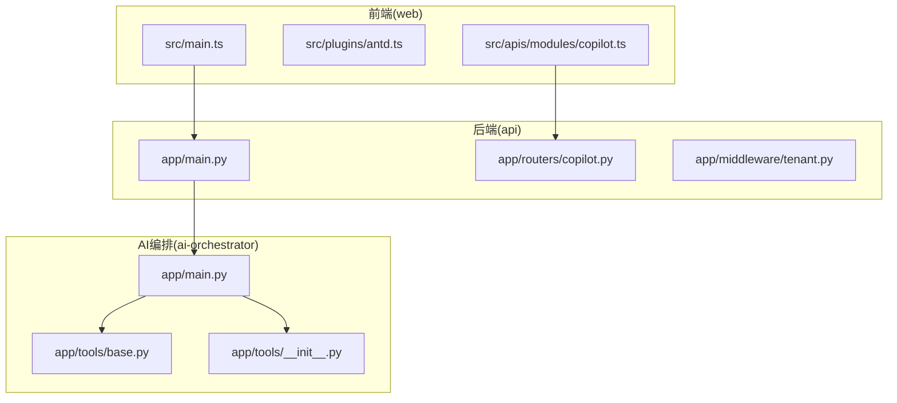
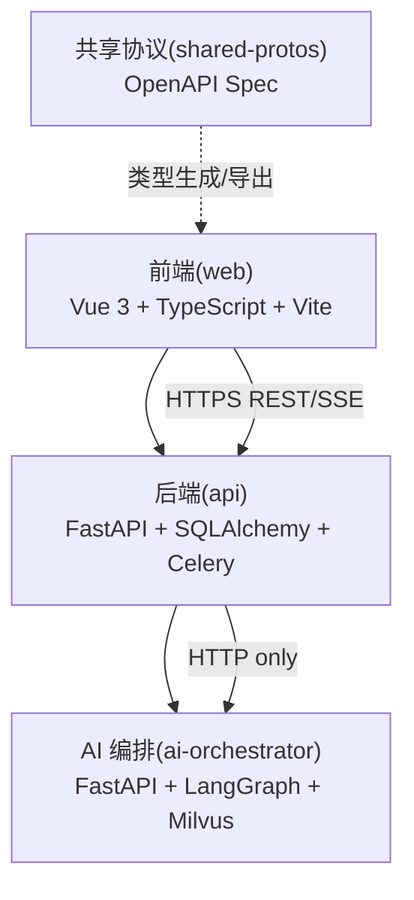
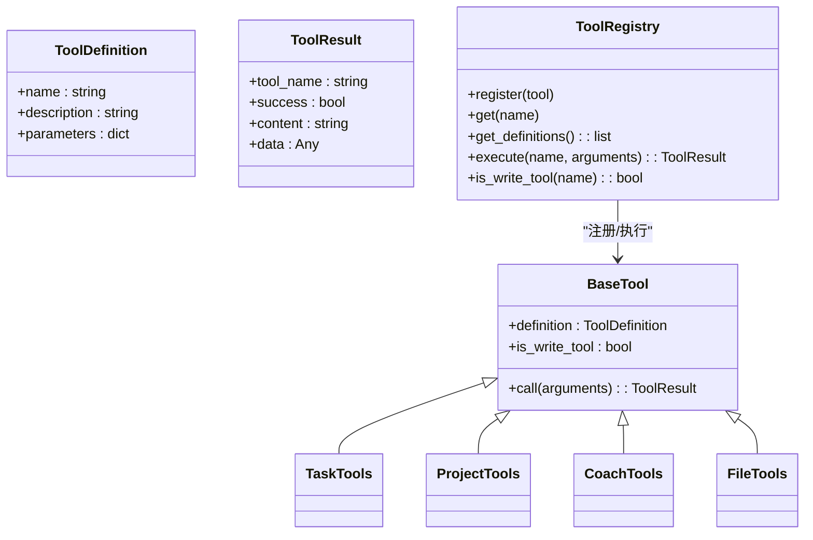
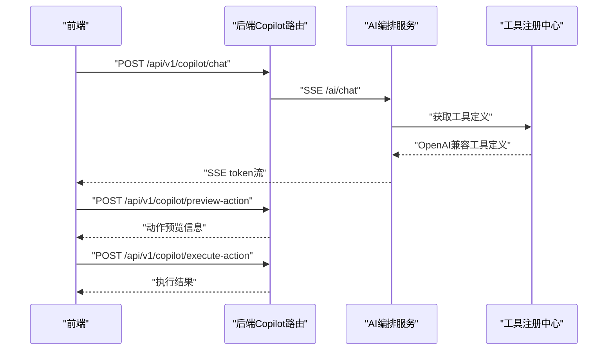
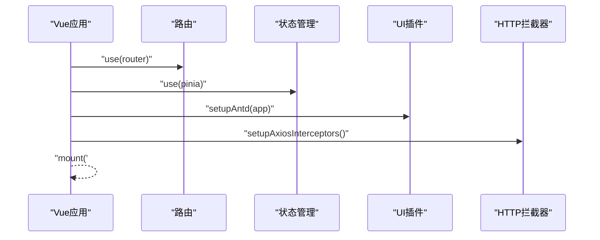
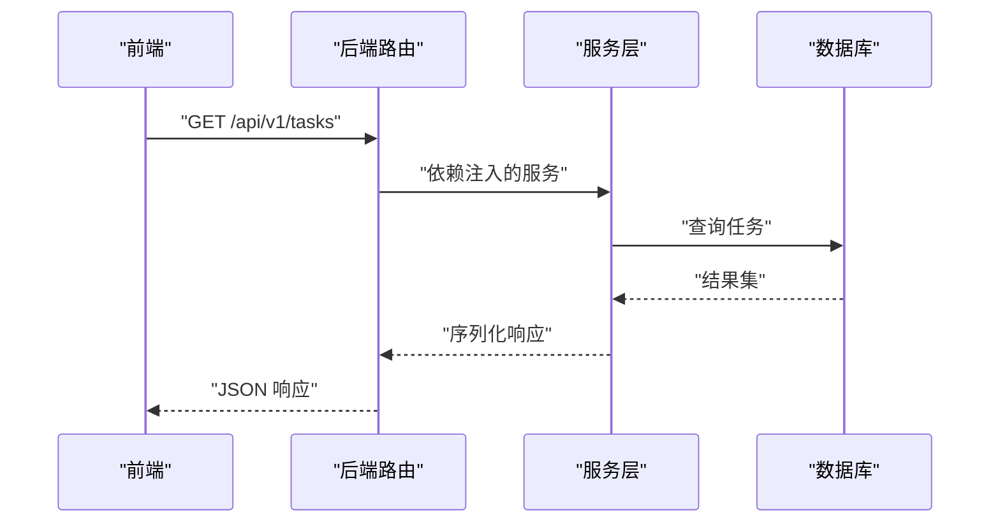
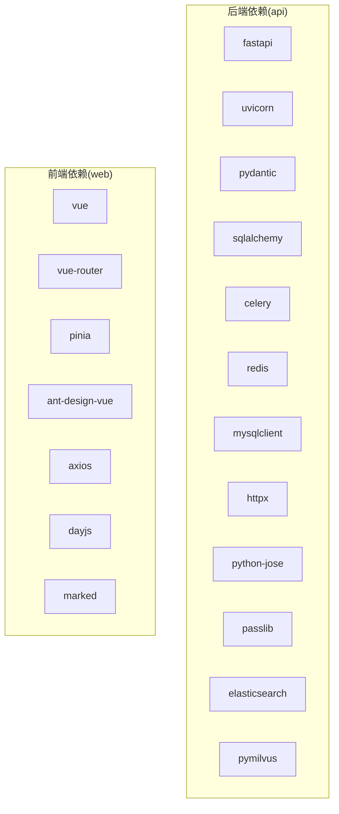

# 扩展开发

<cite>
**本文引用的文件**
- [workspace/README.md](file://workspace/README.md)
- [workspace/api/app/main.py](file://workspace/api/app/main.py)
- [workspace/api/app/routers/copilot.py](file://workspace/api/app/routers/copilot.py)
- [workspace/api/app/middleware/tenant.py](file://workspace/api/app/middleware/tenant.py)
- [workspace/api/pyproject.toml](file://workspace/api/pyproject.toml)
- [workspace/ai-orchestrator/app/main.py](file://workspace/ai-orchestrator/app/main.py)
- [workspace/ai-orchestrator/app/tools/base.py](file://workspace/ai-orchestrator/app/tools/base.py)
- [workspace/ai-orchestrator/app/tools/__init__.py](file://workspace/ai-orchestrator/app/tools/__init__.py)
- [workspace/web/src/main.ts](file://workspace/web/src/main.ts)
- [workspace/web/src/plugins/antd.ts](file://workspace/web/src/plugins/antd.ts)
- [workspace/web/src/apis/modules/copilot.ts](file://workspace/web/src/apis/modules/copilot.ts)
- [workspace/web/package.json](file://workspace/web/package.json)
</cite>

## 目录
1. [引言](#引言)
2. [项目结构](#项目结构)
3. [核心组件](#核心组件)
4. [架构总览](#架构总览)
5. [详细组件分析](#详细组件分析)
6. [依赖分析](#依赖分析)
7. [性能考虑](#性能考虑)
8. [故障排查指南](#故障排查指南)
9. [结论](#结论)
10. [附录](#附录)

## 引言
本指南面向希望为 FDE 工作台进行扩展开发的工程师，覆盖从需求到上线的全流程，并重点阐述以下扩展主题：
- 新功能开发流程：需求分析、设计评审、技术实现、测试验证、部署上线
- 工具扩展指南：AI 工具注册机制、Function Calling 工具开发、工具调用协议、工具安全验证
- 插件开发指南：Vue 组件插件化设计、API 插件架构、中间件扩展、配置系统扩展
- API 扩展指南：新的 REST API 设计、SSE 流式接口开发、WebSocket 通信实现、API 版本管理
- 扩展示例与最佳实践

## 项目结构
FDE 工作台采用多模块单仓（monorepo）组织方式，包含前端 SPA、后端业务服务、AI 编排服务、共享协议、基础设施与脚本等。模块间通过明确的边界与协议协作，确保可演进性与可维护性。

图表来源
- [workspace/web/src/main.ts:1-24](file://workspace/web/src/main.ts#L1-L24)
- [workspace/web/src/plugins/antd.ts:1-10](file://workspace/web/src/plugins/antd.ts#L1-L10)
- [workspace/web/src/apis/modules/copilot.ts:1-40](file://workspace/web/src/apis/modules/copilot.ts#L1-L40)
- [workspace/api/app/main.py:1-73](file://workspace/api/app/main.py#L1-L73)
- [workspace/api/app/routers/copilot.py:1-137](file://workspace/api/app/routers/copilot.py#L1-L137)
- [workspace/api/app/middleware/tenant.py:1-23](file://workspace/api/app/middleware/tenant.py#L1-L23)
- [workspace/ai-orchestrator/app/main.py:1-307](file://workspace/ai-orchestrator/app/main.py#L1-L307)
- [workspace/ai-orchestrator/app/tools/base.py:1-89](file://workspace/ai-orchestrator/app/tools/base.py#L1-L89)
- [workspace/ai-orchestrator/app/tools/__init__.py:1-86](file://workspace/ai-orchestrator/app/tools/__init__.py#L1-L86)

章节来源
- [workspace/README.md:1-110](file://workspace/README.md#L1-L110)
- [workspace/api/app/main.py:1-73](file://workspace/api/app/main.py#L1-L73)
- [workspace/ai-orchestrator/app/main.py:1-307](file://workspace/ai-orchestrator/app/main.py#L1-L307)
- [workspace/web/src/main.ts:1-24](file://workspace/web/src/main.ts#L1-L24)

## 核心组件
- 前端应用入口与插件体系：负责应用初始化、路由与状态管理挂载、UI 组件库插件注入与 HTTP 拦截器配置。
- 后端主程序与路由：统一异常处理、中间件链路、路由注册与健康检查。
- AI 编排服务：提供 SSE 聊天、工具列表、RAG 检索/索引/删除等能力；内置工具注册与执行框架。
- Copilot API：封装前端与 AI 编排服务之间的交互，支持 SSE 流式响应与动作预览/执行。
- 多租户中间件：从请求头提取租户上下文并绑定到日志上下文，便于审计与追踪。

章节来源
- [workspace/web/src/main.ts:1-24](file://workspace/web/src/main.ts#L1-L24)
- [workspace/web/src/plugins/antd.ts:1-10](file://workspace/web/src/plugins/antd.ts#L1-L10)
- [workspace/api/app/main.py:1-73](file://workspace/api/app/main.py#L1-L73)
- [workspace/api/app/routers/copilot.py:1-137](file://workspace/api/app/routers/copilot.py#L1-L137)
- [workspace/ai-orchestrator/app/main.py:1-307](file://workspace/ai-orchestrator/app/main.py#L1-L307)
- [workspace/api/app/middleware/tenant.py:1-23](file://workspace/api/app/middleware/tenant.py#L1-L23)

## 架构总览
FDE 工作台遵循“前端通过后端访问 AI 编排”的跨模块边界约束，确保鉴权与审计可控。共享协议通过 shared-protos 输出 OpenAPI 规范，前端通过类型生成工具自动生成 API 类型定义。

图表来源
- [workspace/README.md:45-57](file://workspace/README.md#L45-L57)
- [workspace/web/package.json:15](file://workspace/web/package.json#L15)

章节来源
- [workspace/README.md:45-57](file://workspace/README.md#L45-L57)
- [workspace/web/package.json:15](file://workspace/web/package.json#L15)

## 详细组件分析

### 工具扩展指南（AI 工具注册机制、Function Calling、工具调用协议、安全验证）

- 工具基类与注册机制
  - 工具定义与调用协议：工具以 OpenAI 兼容的函数调用协议暴露定义与参数模式，支持同步/异步调用与结果封装。
  - 注册中心：集中注册与发现工具，提供 OpenAI 兼容的工具定义集合，支持按代理类型筛选。
  - 写操作识别：工具可声明是否为写操作，用于触发二次确认与动作卡片流程。

- 工具开发步骤
  1) 定义工具类：继承基础工具类，实现调用方法与 OpenAI 兼容的参数模式。
  2) 注册工具：在对应代理的工具工厂中注册该工具实例。
  3) 在前端或编排层使用：通过工具列表接口获取可用工具，或在编排图中调用。

- 工具调用协议
  - 请求：包含工具名称与参数字典。
  - 结果：包含工具名、成功标志、文本内容与可选数据对象。
  - 写操作：返回写操作标识，以便上层触发二次确认与动作卡片。

- 安全验证
  - 输入守卫：在聊天入口对用户输入进行安全检查，拦截高风险输入并记录审计日志。
  - 错误帧：SSE 场景下使用稳定错误码，便于前端分类处理与提示。

图表来源
- [workspace/ai-orchestrator/app/tools/base.py:1-89](file://workspace/ai-orchestrator/app/tools/base.py#L1-L89)

图表来源
- [workspace/api/app/routers/copilot.py:1-137](file://workspace/api/app/routers/copilot.py#L1-L137)
- [workspace/ai-orchestrator/app/main.py:1-307](file://workspace/ai-orchestrator/app/main.py#L1-L307)
- [workspace/ai-orchestrator/app/tools/__init__.py:1-86](file://workspace/ai-orchestrator/app/tools/__init__.py#L1-L86)

章节来源
- [workspace/ai-orchestrator/app/tools/base.py:1-89](file://workspace/ai-orchestrator/app/tools/base.py#L1-L89)
- [workspace/ai-orchestrator/app/tools/__init__.py:1-86](file://workspace/ai-orchestrator/app/tools/__init__.py#L1-L86)
- [workspace/ai-orchestrator/app/main.py:89-172](file://workspace/ai-orchestrator/app/main.py#L89-L172)
- [workspace/api/app/routers/copilot.py:29-137](file://workspace/api/app/routers/copilot.py#L29-L137)

### 插件开发指南（Vue 组件插件化设计、API 插件架构、中间件扩展、配置系统扩展）

- Vue 组件插件化设计
  - 应用初始化：在应用入口统一挂载路由、状态管理与 UI 插件。
  - UI 插件：通过插件函数注入 UI 组件库，保持全局一致性与可替换性。
  - 组件复用：业务组件与通用组件分离，遵循单一职责与可测试性。

- API 插件架构
  - HTTP 拦截器：在前端统一注入拦截器，处理认证、重试、错误与类型转换。
  - Copilot API：封装聊天、会话、动作预览/执行与反馈等接口，统一事件回调。

- 中间件扩展
  - 多租户中间件：从请求头提取租户上下文并绑定到日志上下文，便于审计与追踪。
  - 日志与追踪中间件：在后端统一注入日志与追踪中间件，保证可观测性。

- 配置系统扩展
  - 前端类型生成：通过脚本基于共享协议生成 API 类型定义，确保前后端一致。
  - 后端依赖管理：通过包管理工具与测试配置，保障依赖与质量门禁。

图表来源
- [workspace/web/src/main.ts:13-24](file://workspace/web/src/main.ts#L13-L24)
- [workspace/web/src/plugins/antd.ts:1-10](file://workspace/web/src/plugins/antd.ts#L1-L10)

章节来源
- [workspace/web/src/main.ts:1-24](file://workspace/web/src/main.ts#L1-L24)
- [workspace/web/src/plugins/antd.ts:1-10](file://workspace/web/src/plugins/antd.ts#L1-L10)
- [workspace/web/src/apis/modules/copilot.ts:1-40](file://workspace/web/src/apis/modules/copilot.ts#L1-L40)
- [workspace/api/app/middleware/tenant.py:1-23](file://workspace/api/app/middleware/tenant.py#L1-L23)
- [workspace/web/package.json:15](file://workspace/web/package.json#L15)

### API 扩展指南（新的 REST API 设计、SSE 流式接口、WebSocket、API 版本管理）

- 新的 REST API 设计
  - 路由组织：按领域划分路由模块，统一前缀与标签，便于版本化与治理。
  - 依赖注入：通过依赖工厂注入数据库会话、缓存与服务层，降低耦合。
  - 异常处理：统一异常处理器，保证错误响应格式一致。

- SSE 流式接口开发
  - 事件流：后端以事件流形式推送增量数据，前端以 SSE 接收并渲染。
  - 心跳与断开：设置心跳头部与断开检测，提升用户体验与资源回收。
  - 错误帧：SSE 场景下使用稳定错误码，前端可据此分类处理。

- WebSocket 通信实现
  - 适用场景：实时双向交互、低延迟通知与复杂状态同步。
  - 实施要点：连接管理、消息编解码、错误恢复与重连策略。

- API 版本管理
  - 前缀隔离：通过前缀区分版本，避免破坏性变更影响现有客户端。
  - 文档与契约：结合共享协议输出 OpenAPI，确保前后端契约一致。

图表来源
- [workspace/api/app/main.py:57-67](file://workspace/api/app/main.py#L57-L67)
- [workspace/api/app/routers/copilot.py:104-116](file://workspace/api/app/routers/copilot.py#L104-L116)

章节来源
- [workspace/api/app/main.py:1-73](file://workspace/api/app/main.py#L1-L73)
- [workspace/api/app/routers/copilot.py:1-137](file://workspace/api/app/routers/copilot.py#L1-L137)

### 新功能开发流程（需求分析、设计评审、技术实现、测试验证、部署上线）

- 需求分析
  - 明确边界：区分前端、后端与 AI 编排职责，避免跨模块直接依赖。
  - 用户旅程：梳理用户路径与关键交互，确定 API 与工具需求。

- 设计评审
  - 架构一致性：确保扩展符合模块边界与共享协议契约。
  - 安全与审计：评估输入校验、动作确认与审计日志覆盖。

- 技术实现
  - 后端：新增路由模块、服务层与依赖注入，必要时引入中间件。
  - 前端：新增页面/组件、API 模块与类型定义，保持 UI 一致性。
  - AI：新增工具类与注册，完善编排图与提示词。

- 测试验证
  - 单元测试：覆盖服务与工具逻辑。
  - 集成测试：验证 API 端到端与 SSE 事件流。
  - 端到端测试：验证用户路径与关键场景。

- 部署上线
  - 依赖与迁移：确保数据库迁移与依赖版本一致。
  - 健康检查：通过健康端点与日志监控服务状态。
  - 回滚策略：灰度发布与快速回滚预案。

## 依赖分析

图表来源
- [workspace/api/pyproject.toml:9-28](file://workspace/api/pyproject.toml#L9-L28)
- [workspace/web/package.json:18-29](file://workspace/web/package.json#L18-L29)

章节来源
- [workspace/api/pyproject.toml:1-61](file://workspace/api/pyproject.toml#L1-L61)
- [workspace/web/package.json:1-59](file://workspace/web/package.json#L1-L59)

## 性能考虑
- SSE 事件流
  - 合理的心跳间隔与断开检测，避免长连接占用与内存泄漏。
  - 前端按需渲染与节流，减少 UI 压力。
- 工具执行
  - 异步调用与并发控制，避免阻塞主事件循环。
  - 写操作二次确认，减少误操作带来的回滚成本。
- 中间件链路
  - 减少不必要的上下文绑定与日志开销，保持中间件顺序合理。
- 依赖与版本
  - 锁定依赖版本，避免运行时差异导致的性能波动。

## 故障排查指南
- 健康检查
  - 后端与 AI 编排均提供健康端点，用于快速判断服务状态。
- 错误帧与日志
  - SSE 场景下使用稳定错误码，前端据此分类处理；后端统一异常处理与日志记录。
- 多租户上下文
  - 通过中间件绑定租户上下文，便于定位问题与审计追踪。
- 前后端契约
  - 使用共享协议生成类型定义，避免字段不一致导致的解析错误。

章节来源
- [workspace/api/app/main.py:70-73](file://workspace/api/app/main.py#L70-L73)
- [workspace/ai-orchestrator/app/main.py:79-86](file://workspace/ai-orchestrator/app/main.py#L79-L86)
- [workspace/api/app/middleware/tenant.py:14-23](file://workspace/api/app/middleware/tenant.py#L14-L23)
- [workspace/web/package.json:15](file://workspace/web/package.json#L15)

## 结论
本指南提供了从需求到上线的扩展开发全景，明确了工具扩展、插件开发与 API 扩展的关键机制与最佳实践。遵循模块边界、共享协议与统一异常处理，可在保证安全性与可观测性的前提下高效迭代。

## 附录
- 快速开始
  - 一键启动：参考根目录说明，快速拉起全部服务与前端。
  - 数据库迁移：按说明执行迁移，确保业务表结构就绪。
- 任务认领
  - 可认领任务清单与流程参见根目录说明文档。

章节来源
- [workspace/README.md:20-110](file://workspace/README.md#L20-L110)