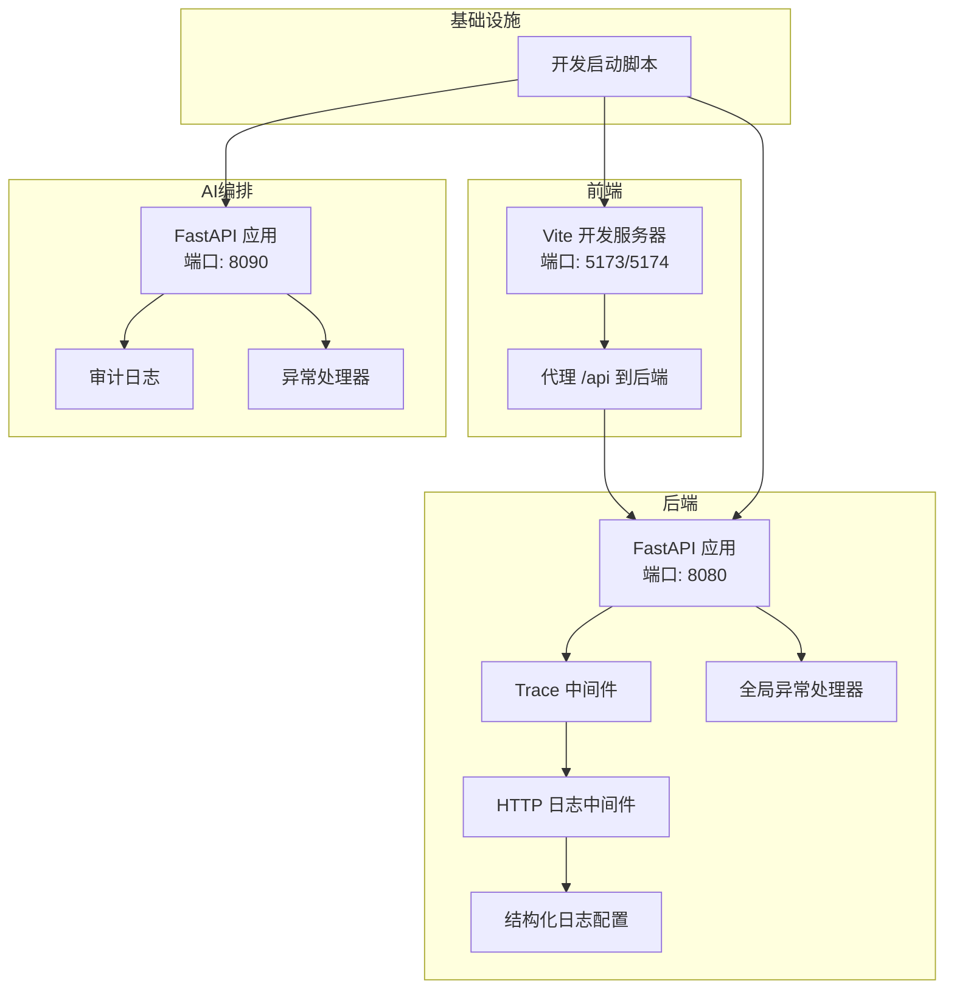
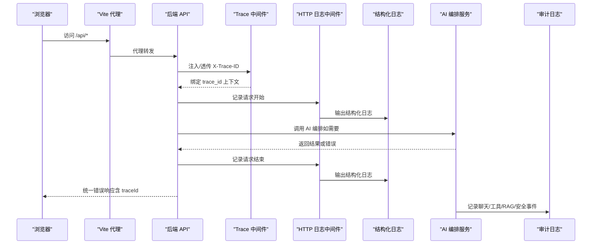
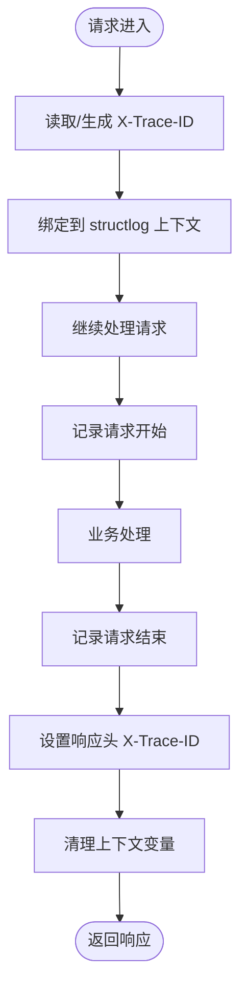
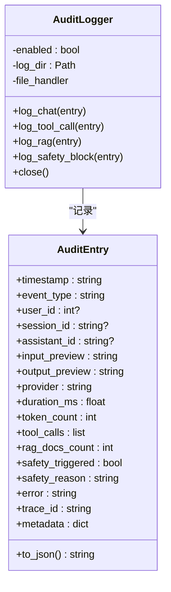
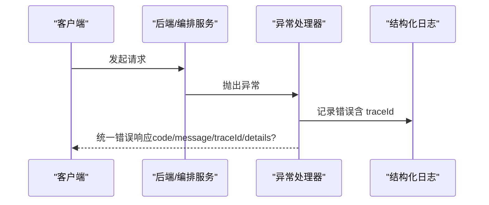

# 调试技巧

<cite>
**本文引用的文件**
- [workspace/api/app/config/logging.py](file://workspace/api/app/config/logging.py)
- [workspace/api/app/middleware/logging.py](file://workspace/api/app/middleware/logging.py)
- [workspace/api/app/middleware/trace.py](file://workspace/api/app/middleware/trace.py)
- [workspace/api/app/exceptions/handlers.py](file://workspace/api/app/exceptions/handlers.py)
- [workspace/ai-orchestrator/app/audit/logger.py](file://workspace/ai-orchestrator/app/audit/logger.py)
- [workspace/ai-orchestrator/app/exceptions/handlers.py](file://workspace/ai-orchestrator/app/exceptions/handlers.py)
- [workspace/web/vite.config.ts](file://workspace/web/vite.config.ts)
- [workspace/scripts/dev/start-dev.sh](file://workspace/scripts/dev/start-dev.sh)
- [workspace/api/pyproject.toml](file://workspace/api/pyproject.toml)
- [workspace/ai-orchestrator/pyproject.toml](file://workspace/ai-orchestrator/pyproject.toml)
- [workspace/api/tests/conftest.py](file://workspace/api/tests/conftest.py)
- [workspace/web/tests/setup.ts](file://workspace/web/tests/setup.ts)
- [docs/code-review/02-后端CR规范.md](file://docs/code-review/02-后端CR规范.md)
- [docs/detail-design/03-AI编排服务详细设计.md](file://docs/detail-design/03-AI编排服务详细设计.md)
</cite>

## 目录
1. [简介](#简介)
2. [项目结构](#项目结构)
3. [核心组件](#核心组件)
4. [架构总览](#架构总览)
5. [详细组件分析](#详细组件分析)
6. [依赖分析](#依赖分析)
7. [性能考虑](#性能考虑)
8. [故障排查指南](#故障排查指南)
9. [结论](#结论)
10. [附录](#附录)

## 简介
本文件面向FDE工作台开发与运维团队，提供系统化的调试技巧与实操指南。内容覆盖：
- 后端与AI编排服务的调试配置与日志分析
- 前端开发环境与代理配置
- 统一日志格式、请求追踪与异常处理
- 性能分析方法（后端、前端、数据库、AI推理）
- 错误排查流程与常见问题定位策略

## 项目结构
FDE工作台采用多模块分层：前端Web应用、后端API服务、AI编排服务与基础设施脚本。开发与调试涉及以下关键路径：
- 前端：Vite开发服务器、代理到后端API
- 后端：FastAPI + Uvicorn + 结构化日志 + 请求追踪中间件 + 全局异常处理
- AI编排：FastAPI + Uvicorn + 审计日志
- 脚本：一键启动开发环境、健康检查与日志查看

图表来源
- [workspace/web/vite.config.ts:17-25](file://workspace/web/vite.config.ts#L17-L25)
- [workspace/api/app/middleware/trace.py:12-30](file://workspace/api/app/middleware/trace.py#L12-L30)
- [workspace/api/app/middleware/logging.py:13-36](file://workspace/api/app/middleware/logging.py#L13-L36)
- [workspace/api/app/config/logging.py:10-35](file://workspace/api/app/config/logging.py#L10-L35)
- [workspace/api/app/exceptions/handlers.py:31-99](file://workspace/api/app/exceptions/handlers.py#L31-L99)
- [workspace/ai-orchestrator/app/audit/logger.py:46-120](file://workspace/ai-orchestrator/app/audit/logger.py#L46-L120)
- [workspace/ai-orchestrator/app/exceptions/handlers.py:60-138](file://workspace/ai-orchestrator/app/exceptions/handlers.py#L60-L138)
- [workspace/scripts/dev/start-dev.sh:52-66](file://workspace/scripts/dev/start-dev.sh#L52-L66)

章节来源
- [workspace/web/vite.config.ts:1-36](file://workspace/web/vite.config.ts#L1-L36)
- [workspace/scripts/dev/start-dev.sh:1-269](file://workspace/scripts/dev/start-dev.sh#L1-L269)

## 核心组件
- 结构化日志与请求追踪
  - 后端使用结构化日志记录请求开始/结束、异常与验证错误，并在日志中绑定trace_id，便于跨服务串联。
  - 前端通过Vite代理将/api转发至后端，便于本地联调。
- 审计日志
  - AI编排侧提供审计日志模块，记录聊天、工具调用、RAG检索、安全拦截等事件，支持文件落盘与JSONL格式输出。
- 全局异常处理
  - 统一响应体字段，包含错误码、消息、traceId与可选details，确保前后端一致的错误语义。

章节来源
- [workspace/api/app/config/logging.py:10-35](file://workspace/api/app/config/logging.py#L10-L35)
- [workspace/api/app/middleware/logging.py:13-36](file://workspace/api/app/middleware/logging.py#L13-L36)
- [workspace/api/app/middleware/trace.py:12-30](file://workspace/api/app/middleware/trace.py#L12-L30)
- [workspace/api/app/exceptions/handlers.py:31-99](file://workspace/api/app/exceptions/handlers.py#L31-L99)
- [workspace/ai-orchestrator/app/audit/logger.py:46-120](file://workspace/ai-orchestrator/app/audit/logger.py#L46-L120)
- [workspace/ai-orchestrator/app/exceptions/handlers.py:60-138](file://workspace/ai-orchestrator/app/exceptions/handlers.py#L60-L138)

## 架构总览
下图展示从浏览器到后端API、再到AI编排服务的关键链路，以及日志与异常处理如何贯穿其中。

图表来源
- [workspace/web/vite.config.ts:17-25](file://workspace/web/vite.config.ts#L17-L25)
- [workspace/api/app/middleware/trace.py:12-30](file://workspace/api/app/middleware/trace.py#L12-L30)
- [workspace/api/app/middleware/logging.py:13-36](file://workspace/api/app/middleware/logging.py#L13-L36)
- [workspace/api/app/config/logging.py:10-35](file://workspace/api/app/config/logging.py#L10-L35)
- [workspace/ai-orchestrator/app/audit/logger.py:46-120](file://workspace/ai-orchestrator/app/audit/logger.py#L46-L120)
- [workspace/api/app/exceptions/handlers.py:31-99](file://workspace/api/app/exceptions/handlers.py#L31-L99)
- [workspace/ai-orchestrator/app/exceptions/handlers.py:60-138](file://workspace/ai-orchestrator/app/exceptions/handlers.py#L60-L138)

## 详细组件分析

### 后端日志与追踪中间件
- 结构化日志
  - 使用结构化处理器输出JSON格式日志，结合上下文变量自动携带trace_id，便于集中采集与检索。
- HTTP请求日志中间件
  - 在请求开始与结束分别记录方法、路径、状态码等关键信息，辅助快速定位慢请求与异常端点。
- 请求追踪中间件
  - 从请求头提取或生成X-Trace-ID，绑定到structlog上下文，同时将trace_id回注到响应头，便于跨服务串联。

图表来源
- [workspace/api/app/middleware/trace.py:12-30](file://workspace/api/app/middleware/trace.py#L12-L30)
- [workspace/api/app/middleware/logging.py:13-36](file://workspace/api/app/middleware/logging.py#L13-L36)
- [workspace/api/app/config/logging.py:10-35](file://workspace/api/app/config/logging.py#L10-L35)

章节来源
- [workspace/api/app/config/logging.py:10-35](file://workspace/api/app/config/logging.py#L10-L35)
- [workspace/api/app/middleware/logging.py:13-36](file://workspace/api/app/middleware/logging.py#L13-L36)
- [workspace/api/app/middleware/trace.py:12-30](file://workspace/api/app/middleware/trace.py#L12-L30)

### AI编排审计日志
- 数据结构
  - 审计条目包含时间戳、事件类型、用户/会话/助手标识、输入/输出预览、提供商、耗时、Token数、工具调用列表、RAG文档数量、安全拦截标记与trace_id等。
- 写入策略
  - 支持文件落盘（按日期切分JSONL文件），若文件系统不可用则降级到stderr；记录失败不影响主流程。
- 单例管理
  - 提供模块级单例获取函数，确保全局一致性。

图表来源
- [workspace/ai-orchestrator/app/audit/logger.py:21-120](file://workspace/ai-orchestrator/app/audit/logger.py#L21-L120)

章节来源
- [workspace/ai-orchestrator/app/audit/logger.py:1-136](file://workspace/ai-orchestrator/app/audit/logger.py#L1-L136)

### 全局异常处理与统一响应
- 后端与AI编排均注册统一异常处理器，将业务异常、系统异常、HTTP异常与参数校验异常转换为统一响应体，包含code、message、traceId与details。
- traceId生成策略：优先从请求状态或请求头提取，否则随机生成，确保每条错误都有唯一追踪线索。

图表来源
- [workspace/api/app/exceptions/handlers.py:31-99](file://workspace/api/app/exceptions/handlers.py#L31-L99)
- [workspace/ai-orchestrator/app/exceptions/handlers.py:60-138](file://workspace/ai-orchestrator/app/exceptions/handlers.py#L60-L138)

章节来源
- [workspace/api/app/exceptions/handlers.py:31-99](file://workspace/api/app/exceptions/handlers.py#L31-L99)
- [workspace/ai-orchestrator/app/exceptions/handlers.py:60-138](file://workspace/ai-orchestrator/app/exceptions/handlers.py#L60-L138)

### 前端开发与调试配置
- Vite开发服务器
  - 默认端口与别名配置，便于模块化导入与热更新。
  - 代理规则将/api转发至后端，便于本地联调。
- 测试环境初始化
  - Vue Test Utils基础配置、matchMedia与ResizeObserver的mock，以及localStorage的模拟，提升测试稳定性。

章节来源
- [workspace/web/vite.config.ts:1-36](file://workspace/web/vite.config.ts#L1-L36)
- [workspace/web/tests/setup.ts:1-36](file://workspace/web/tests/setup.ts#L1-L36)

### 开发环境启动与日志查看
- 一键启动脚本
  - 支持Docker与原生两种模式，自动拉取依赖镜像、等待健康检查、执行数据库迁移、启动应用服务并打印访问链接。
  - 提供查看日志、停止容器、重建镜像、清理数据卷等子命令。
- 健康检查
  - 依赖服务（MySQL、Redis、Elasticsearch、Milvus）需达到健康状态后才启动应用服务，避免冷启动抖动。

章节来源
- [workspace/scripts/dev/start-dev.sh:1-269](file://workspace/scripts/dev/start-dev.sh#L1-L269)

## 依赖分析
- 后端依赖
  - FastAPI、Uvicorn、Pydantic、SQLAlchemy、Celery、Redis、MySQL、structlog、Elasticsearch、Pymilvus等。
- AI编排依赖
  - FastAPI、Uvicorn、LangChain/LangGraph、OpenAI等。
- 开发工具
  - pytest、ruff、mypy、httpx等。

章节来源
- [workspace/api/pyproject.toml:1-61](file://workspace/api/pyproject.toml#L1-L61)
- [workspace/ai-orchestrator/pyproject.toml:1-29](file://workspace/ai-orchestrator/pyproject.toml#L1-L29)

## 性能考虑
- 后端性能分析
  - 使用Python内置cProfile或py-spy进行CPU火焰图分析，定位热点函数与慢调用。
  - 关注数据库查询与索引命中情况，结合ORM日志与慢查询日志优化SQL。
  - 对外部依赖（如AI服务）增加超时与重试策略，必要时引入熔断器。
- 前端性能监控
  - 使用浏览器开发者工具的Performance面板录制交互，关注主线程阻塞、长任务与内存增长。
  - 利用Vite构建产物的chunk拆分策略，减少首屏包体与重复依赖。
- AI模型推理性能
  - 关注提示词长度、上下文窗口与并发限制；对RAG检索与rerank阶段进行缓存与批量化。
  - 通过审计日志统计平均耗时与Token用量，识别高成本节点。
- 日志与指标
  - 将结构化日志接入集中式日志平台，建立关键指标看板（P95/P99延迟、错误率、吞吐量）。

[本节为通用指导，无需列出具体文件来源]

## 故障排查指南
- 常见错误类型与识别
  - 参数校验错误：统一由参数校验异常处理器捕获，返回400并附details。
  - 业务异常：抛出业务异常，返回对应业务错误码与traceId。
  - 系统异常：捕获通用异常，返回500与traceId。
  - HTTP异常：捕获HTTP异常，返回对应状态码与traceId。
- 根因分析方法
  - 以traceId为线索，在结构化日志中检索同一trace_id下的请求开始/结束、异常与审计事件，还原完整调用链。
  - 对慢请求，结合日志中的耗时字段与审计日志中的工具调用/检索次数，定位瓶颈。
- 问题定位策略
  - 先后端再前端：确认后端接口可用与响应正确，再排查前端调用与渲染问题。
  - 逐步缩小范围：启用最小复现，关闭非必要功能，隔离第三方依赖。
  - 交叉验证：对比不同环境（本地/预发/线上）的日志与行为差异。
- 解决方案实施
  - 修复后进行回归测试，确保异常处理与日志输出符合统一规范。
  - 对高频问题沉淀到知识库，形成FAQ与自动化告警阈值。

章节来源
- [workspace/api/app/exceptions/handlers.py:31-99](file://workspace/api/app/exceptions/handlers.py#L31-L99)
- [workspace/ai-orchestrator/app/exceptions/handlers.py:60-138](file://workspace/ai-orchestrator/app/exceptions/handlers.py#L60-L138)
- [workspace/api/app/middleware/trace.py:12-30](file://workspace/api/app/middleware/trace.py#L12-L30)
- [workspace/api/app/middleware/logging.py:13-36](file://workspace/api/app/middleware/logging.py#L13-L36)
- [workspace/ai-orchestrator/app/audit/logger.py:46-120](file://workspace/ai-orchestrator/app/audit/logger.py#L46-L120)
- [docs/code-review/02-后端CR规范.md:643-711](file://docs/code-review/02-后端CR规范.md#L643-L711)
- [docs/detail-design/03-AI编排服务详细设计.md:601-620](file://docs/detail-design/03-AI编排服务详细设计.md#L601-L620)

## 结论
通过统一的日志格式、请求追踪与异常处理机制，配合结构化审计日志与开发脚本，FDE工作台具备了高效的调试与排障能力。建议在日常开发中坚持：
- 所有错误日志包含traceId
- 统一响应体字段，便于前端消费
- 审计日志覆盖关键AI交互环节
- 使用脚本快速搭建与验证环境
- 建立性能基线与告警阈值

[本节为总结性内容，无需列出具体文件来源]

## 附录

### 调试场景与实用技巧
- 场景一：接口报错但无细节
  - 步骤：在后端异常处理器处确认traceId是否返回；在结构化日志中按traceId检索；查看HTTP日志中间件记录的请求/响应元数据。
  - 关键文件：[异常处理器:31-99](file://workspace/api/app/exceptions/handlers.py#L31-L99)、[HTTP日志中间件:13-36](file://workspace/api/app/middleware/logging.py#L13-L36)、[结构化日志配置:10-35](file://workspace/api/app/config/logging.py#L10-L35)
- 场景二：前端无法访问后端接口
  - 步骤：检查Vite代理配置是否指向正确的后端端口；确认开发脚本已启动后端服务；查看代理转发日志。
  - 关键文件：[Vite配置:17-25](file://workspace/web/vite.config.ts#L17-L25)、[开发脚本:52-66](file://workspace/scripts/dev/start-dev.sh#L52-L66)
- 场景三：AI调用耗时过长
  - 步骤：在审计日志中查找对应trace_id的事件序列；核对工具调用次数与RAG检索文档数；评估提示词长度与并发。
  - 关键文件：[审计日志模块:46-120](file://workspace/ai-orchestrator/app/audit/logger.py#L46-L120)
- 场景四：数据库慢查询
  - 步骤：开启SQL日志与慢查询日志；结合ORM日志定位具体查询；优化索引与查询计划。
  - 关键文件：[后端依赖:15-20](file://workspace/api/pyproject.toml#L15-L20)

章节来源
- [workspace/api/app/exceptions/handlers.py:31-99](file://workspace/api/app/exceptions/handlers.py#L31-L99)
- [workspace/api/app/middleware/logging.py:13-36](file://workspace/api/app/middleware/logging.py#L13-L36)
- [workspace/api/app/config/logging.py:10-35](file://workspace/api/app/config/logging.py#L10-L35)
- [workspace/web/vite.config.ts:17-25](file://workspace/web/vite.config.ts#L17-L25)
- [workspace/scripts/dev/start-dev.sh:52-66](file://workspace/scripts/dev/start-dev.sh#L52-L66)
- [workspace/ai-orchestrator/app/audit/logger.py:46-120](file://workspace/ai-orchestrator/app/audit/logger.py#L46-L120)
- [workspace/api/pyproject.toml:15-20](file://workspace/api/pyproject.toml#L15-L20)