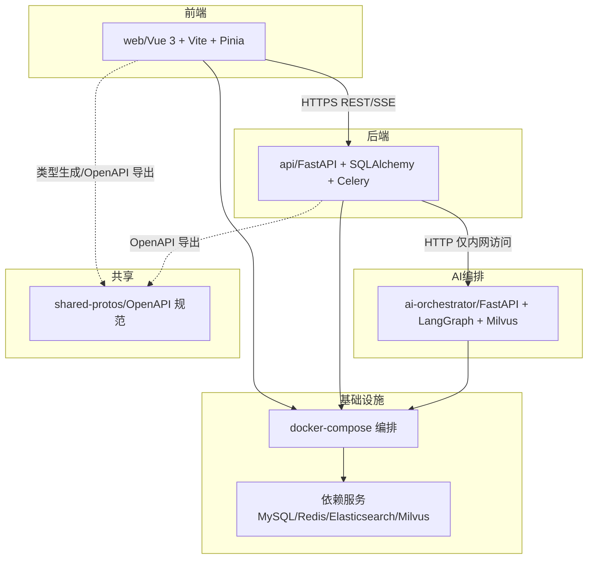
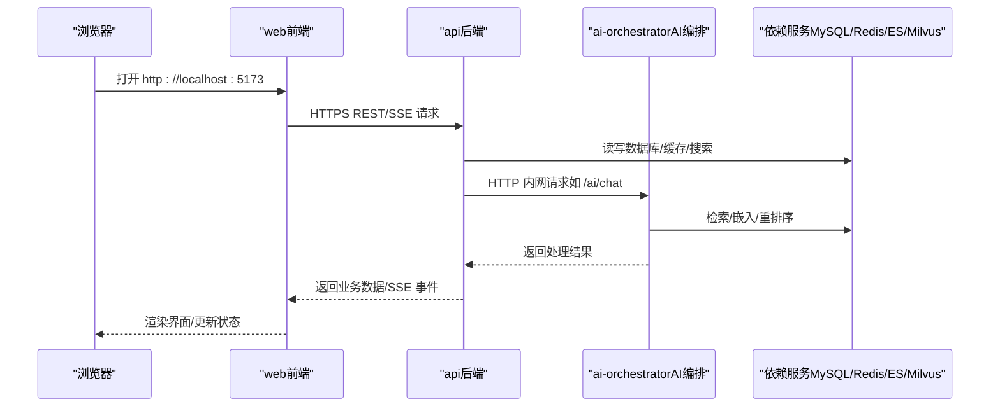
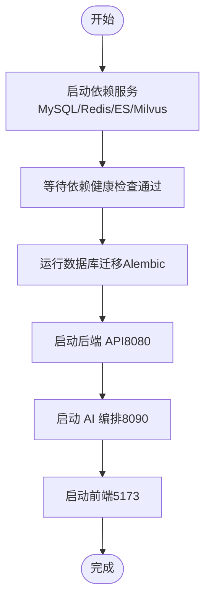
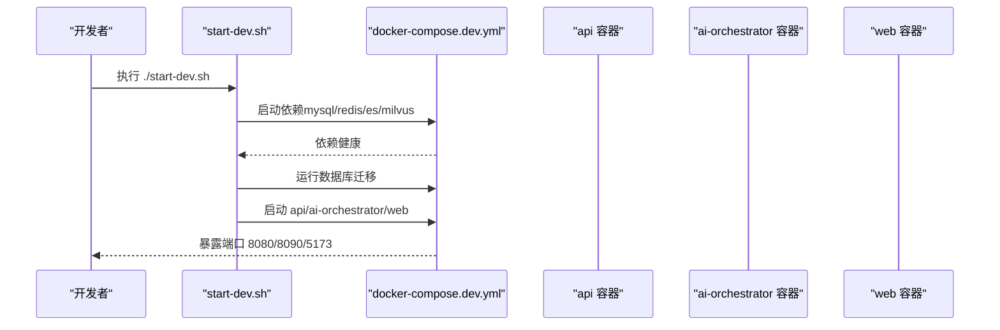
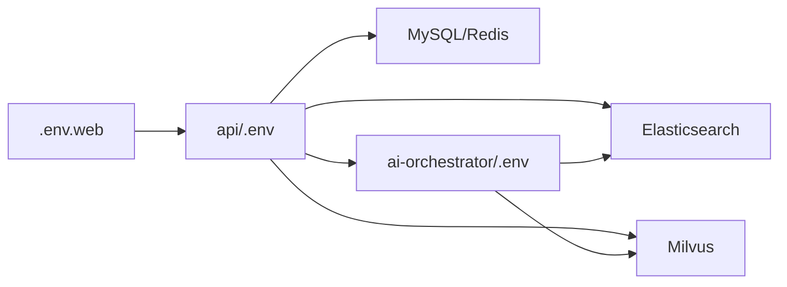

# 快速开始

<cite>
**本文引用的文件**
- [workspace/README.md](file://workspace/README.md)
- [workspace/scripts/dev/start-all.sh](file://workspace/scripts/dev/start-all.sh)
- [workspace/scripts/dev/start-dev.sh](file://workspace/scripts/dev/start-dev.sh)
- [workspace/infra/docker-compose/docker-compose.yml](file://workspace/infra/docker-compose/docker-compose.yml)
- [workspace/infra/docker-compose/docker-compose.dev.yml](file://workspace/infra/docker-compose/docker-compose.dev.yml)
- [workspace/infra/docker-compose/docker-compose.deps.yml](file://workspace/infra/docker-compose/docker-compose.deps.yml)
- [workspace/api/README.md](file://workspace/api/README.md)
- [workspace/api/pyproject.toml](file://workspace/api/pyproject.toml)
- [workspace/api/app/config/settings.py](file://workspace/api/app/config/settings.py)
- [workspace/api/.env.example](file://workspace/api/.env.example)
- [workspace/ai-orchestrator/README.md](file://workspace/ai-orchestrator/README.md)
- [workspace/ai-orchestrator/.env.example](file://workspace/ai-orchestrator/.env.example)
- [workspace/web/README.md](file://workspace/web/README.md)
- [workspace/web/.env.example](file://workspace/web/.env.example)
</cite>

## 目录
1. [简介](#简介)
2. [项目结构](#项目结构)
3. [核心组件](#核心组件)
4. [架构总览](#架构总览)
5. [详细组件分析](#详细组件分析)
6. [依赖分析](#依赖分析)
7. [性能考虑](#性能考虑)
8. [故障排查指南](#故障排查指南)
9. [结论](#结论)
10. [附录](#附录)

## 简介
本指南面向不同经验水平的开发者，帮助你在最短时间内完成 FDE 工作台项目的本地开发环境搭建与启动，涵盖系统要求、依赖安装、数据库初始化、服务启动顺序、Docker 部署与编排、常见问题排查以及基本使用验证步骤。项目采用多模块单仓结构，包含前端 SPA、后端业务服务、AI 编排服务与基础设施编排。

## 项目结构
- 顶层 workspace 为多模块根目录，包含 web（前端）、api（后端业务服务）、ai-orchestrator（AI 编排服务）、shared-protos（共享协议）、infra（基础设施）与 scripts（一键脚本）等子目录。
- 各模块均提供独立的 README 与启动说明，便于按需查阅。
- 依赖服务（MySQL、Redis、Elasticsearch、Milvus）通过 docker-compose 统一编排，支持一键启动与健康检查。

图表来源
- [workspace/README.md:45-57](file://workspace/README.md#L45-L57)
- [workspace/infra/docker-compose/docker-compose.yml:3-132](file://workspace/infra/docker-compose/docker-compose.yml#L3-L132)

章节来源
- [workspace/README.md:1-110](file://workspace/README.md#L1-L110)

## 核心组件
- 前端 web：基于 Vue 3 + TypeScript + Vite + Pinia，支持 Mock 与真实后端切换，提供健康环组件与聊天面板等业务组件。
- 后端 api：基于 FastAPI + SQLAlchemy + Celery，提供 REST 接口与 SSE，集成外部系统适配与异步任务。
- AI 编排 ai-orchestrator：基于 FastAPI + LangGraph + Milvus，提供多 Agent 编排、RAG 检索与安全审计。
- 基础设施 infra：提供 docker-compose 与 K8s 示例，统一管理依赖服务与应用服务。
- 共享协议 shared-protos：用于导出 OpenAPI 规范，驱动前端类型生成与接口契约。

章节来源
- [workspace/web/README.md:1-49](file://workspace/web/README.md#L1-L49)
- [workspace/api/README.md:1-50](file://workspace/api/README.md#L1-L50)
- [workspace/ai-orchestrator/README.md:1-51](file://workspace/ai-orchestrator/README.md#L1-L51)
- [workspace/README.md:7-16](file://workspace/README.md#L7-L16)

## 架构总览
- 通信边界与数据流
  - web 通过 HTTPS REST 与 SSE 访问 api；不直接访问 ai-orchestrator。
  - api 仅以内网 HTTP 方式调用 ai-orchestrator，便于鉴权与审计。
  - 共享类型通过 shared-protos 导出 OpenAPI，避免跨模块直接导入业务代码。
- 服务端口
  - web：5173（开发），生产可通过 Nginx 暴露 80。
  - api：8080。
  - ai-orchestrator：8090。
  - 依赖服务：MySQL 3306/3307、Redis 6379、Elasticsearch 9200、Milvus 19530/9091。

图表来源
- [workspace/README.md:45-57](file://workspace/README.md#L45-L57)
- [workspace/infra/docker-compose/docker-compose.yml:66-126](file://workspace/infra/docker-compose/docker-compose.yml#L66-L126)

章节来源
- [workspace/README.md:45-57](file://workspace/README.md#L45-L57)
- [workspace/infra/docker-compose/docker-compose.yml:66-126](file://workspace/infra/docker-compose/docker-compose.yml#L66-L126)

## 详细组件分析

### 系统要求与前置依赖
- Python 3.11（后端使用 Poetry 管理依赖）
- Node.js 与 npm（前端使用 Vite）
- Docker 与 Docker Compose（推荐使用 docker-compose 启动依赖与应用）
- Git（克隆仓库）

章节来源
- [workspace/api/pyproject.toml:10-11](file://workspace/api/pyproject.toml#L10-L11)
- [workspace/web/README.md:3](file://workspace/web/README.md#L3)

### 环境搭建与配置

#### 1) 克隆与基础准备
- 克隆仓库到本地后，进入 workspace 目录进行后续操作。
- 若使用一键脚本，建议先阅读脚本注释与参数说明。

章节来源
- [workspace/README.md:20-42](file://workspace/README.md#L20-L42)

#### 2) 依赖安装与环境变量
- 后端（api）
  - 安装依赖：使用 Poetry 或 pip 安装项目依赖。
  - 复制示例环境变量文件并根据需要调整。
  - 参考：[workspace/api/README.md:9-18](file://workspace/api/README.md#L9-L18)，[workspace/api/.env.example:1-43](file://workspace/api/.env.example#L1-L43)
- 前端（web）
  - 安装依赖：npm install。
  - 复制示例环境变量文件并根据需要调整。
  - 参考：[workspace/web/README.md:9-17](file://workspace/web/README.md#L9-L17)，[workspace/web/.env.example:1-17](file://workspace/web/.env.example#L1-L17)
- AI 编排（ai-orchestrator）
  - 安装依赖：Poetry 或 pip。
  - 复制示例环境变量文件并根据需要调整。
  - 参考：[workspace/ai-orchestrator/README.md:14-20](file://workspace/ai-orchestrator/README.md#L14-L20)，[workspace/ai-orchestrator/.env.example:1-21](file://workspace/ai-orchestrator/.env.example#L1-L21)

#### 3) 数据库初始化
- 在启动 api 服务前，执行数据库迁移以创建业务表。
- 参考：[workspace/README.md:91-103](file://workspace/README.md#L91-L103)，[workspace/api/README.md:10-13](file://workspace/api/README.md#L10-L13)

章节来源
- [workspace/README.md:91-103](file://workspace/README.md#L91-L103)
- [workspace/api/README.md:10-13](file://workspace/api/README.md#L10-L13)

### 本地启动流程

#### 方法一：一键启动全部服务（推荐新手）
- 使用脚本一键启动依赖与所有服务，并自动等待依赖就绪。
- 访问地址：http://localhost:5173（前端），http://localhost:8080/docs（后端 API 文档）。
- 参考：[workspace/scripts/dev/start-all.sh:14-58](file://workspace/scripts/dev/start-all.sh#L14-L58)，[workspace/README.md:20-28](file://workspace/README.md#L20-L28)

图表来源
- [workspace/scripts/dev/start-all.sh:14-58](file://workspace/scripts/dev/start-all.sh#L14-L58)
- [workspace/scripts/dev/start-dev.sh:102-148](file://workspace/scripts/dev/start-dev.sh#L102-L148)

#### 方法二：Docker Compose 开发模式（推荐）
- 使用 docker-compose.dev.yml 启动，具备热重载、持久化缓存与健康检查。
- 支持多种命令：启动、停止、查看日志、重启、强制重建镜像等。
- 参考：[workspace/scripts/dev/start-dev.sh:39-66](file://workspace/scripts/dev/start-dev.sh#L39-L66)，[workspace/infra/docker-compose/docker-compose.dev.yml:1-281](file://workspace/infra/docker-compose/docker-compose.dev.yml#L1-L281)

图表来源
- [workspace/scripts/dev/start-dev.sh:77-149](file://workspace/scripts/dev/start-dev.sh#L77-L149)
- [workspace/infra/docker-compose/docker-compose.dev.yml:18-148](file://workspace/infra/docker-compose/docker-compose.dev.yml#L18-L148)

#### 方法三：仅启动依赖 + 自行启动各服务
- 仅启动依赖服务（docker-compose.deps.yml）。
- 分别在不同终端启动 api、ai-orchestrator、web。
- 参考：[workspace/README.md:30-41](file://workspace/README.md#L30-L41)

章节来源
- [workspace/scripts/dev/start-all.sh:14-58](file://workspace/scripts/dev/start-all.sh#L14-L58)
- [workspace/scripts/dev/start-dev.sh:77-149](file://workspace/scripts/dev/start-dev.sh#L77-L149)
- [workspace/README.md:30-41](file://workspace/README.md#L30-L41)

### Docker 部署与编排

#### 1) 依赖服务编排
- docker-compose.yml 提供 MySQL、Redis、Elasticsearch、Milvus 的标准编排与健康检查。
- 参考：[workspace/infra/docker-compose/docker-compose.yml:3-132](file://workspace/infra/docker-compose/docker-compose.yml#L3-L132)

#### 2) 应用服务编排
- api、ai-orchestrator、web 服务通过 Dockerfile 构建镜像并暴露端口。
- api 依赖 mysql、redis、elasticsearch 健康后启动；web 依赖 api；ai-orchestrator 依赖 api。
- 参考：[workspace/infra/docker-compose/docker-compose.yml:66-126](file://workspace/infra/docker-compose/docker-compose.yml#L66-L126)

#### 3) 开发专用编排（热重载与缓存）
- docker-compose.dev.yml 支持源码挂载、持久化虚拟环境与 node_modules 缓存，提升开发效率。
- 包含 celery-worker 可选服务，便于异步任务开发。
- 参考：[workspace/infra/docker-compose/docker-compose.dev.yml:18-148](file://workspace/infra/docker-compose/docker-compose.dev.yml#L18-L148)

章节来源
- [workspace/infra/docker-compose/docker-compose.yml:3-132](file://workspace/infra/docker-compose/docker-compose.yml#L3-L132)
- [workspace/infra/docker-compose/docker-compose.dev.yml:18-148](file://workspace/infra/docker-compose/docker-compose.dev.yml#L18-L148)

### 基本使用与验证步骤
- 启动完成后，打开浏览器访问：
  - 前端：http://localhost:5173
  - 后端文档：http://localhost:8080/docs
  - 后端健康：http://localhost:8080/health
  - AI 编排健康：http://localhost:8090/health
- 前端支持 Mock 与真实后端两种模式，可在 .env 中切换。
- 参考：[workspace/scripts/dev/start-dev.sh:61-66](file://workspace/scripts/dev/start-dev.sh#L61-L66)，[workspace/web/README.md:10-17](file://workspace/web/README.md#L10-L17)

章节来源
- [workspace/scripts/dev/start-dev.sh:61-66](file://workspace/scripts/dev/start-dev.sh#L61-L66)
- [workspace/web/README.md:10-17](file://workspace/web/README.md#L10-L17)

## 依赖分析
- 组件耦合与边界
  - web → api（HTTPS REST/SSE），api → ai-orchestrator（HTTP 内网），避免跨模块直接 import。
  - 共享类型通过 shared-protos 导出 OpenAPI，前后端类型生成与契约一致。
- 外部依赖
  - 数据库：MySQL（aiomysql），Redis（Celery/缓存）。
  - 搜索与向量：Elasticsearch（全文检索），Milvus（向量检索）。
  - LLM：DashScope、OpenAI（可配置）。
- 环境变量与配置
  - api 与 ai-orchestrator 均提供 .env.example，建议复制为 .env 并按需修改。
  - 参考：[workspace/api/app/config/settings.py:12-81](file://workspace/api/app/config/settings.py#L12-L81)，[workspace/api/.env.example:1-43](file://workspace/api/.env.example#L1-43)，[workspace/ai-orchestrator/.env.example:1-21](file://workspace/ai-orchestrator/.env.example#L1-21)

图表来源
- [workspace/api/.env.example:1-43](file://workspace/api/.env.example#L1-L43)
- [workspace/ai-orchestrator/.env.example:1-21](file://workspace/ai-orchestrator/.env.example#L1-L21)
- [workspace/web/.env.example:1-17](file://workspace/web/.env.example#L1-L17)

章节来源
- [workspace/api/app/config/settings.py:12-81](file://workspace/api/app/config/settings.py#L12-L81)
- [workspace/api/.env.example:1-43](file://workspace/api/.env.example#L1-43)
- [workspace/ai-orchestrator/.env.example:1-21](file://workspace/ai-orchestrator/.env.example#L1-21)
- [workspace/web/.env.example:1-17](file://workspace/web/.env.example#L1-L17)

## 性能考虑
- 热重载与缓存
  - 开发编排中启用源码挂载与持久化缓存，减少重复构建时间。
- 网络与并发
  - Celery worker 可配置并发度，结合 Redis 作为消息队列提升异步任务吞吐。
- 搜索与向量检索
  - Elasticsearch 与 Milvus 的资源限制与 JVM 参数已在编排中设置，可根据环境调整。

[本节为通用建议，无需特定文件引用]

## 故障排查指南

### 1) 依赖服务未就绪
- 症状：api/ai-orchestrator 启动失败或健康检查失败。
- 排查要点：
  - 检查 docker-compose 是否成功拉取镜像并启动依赖。
  - 查看依赖健康状态与日志输出。
- 参考：[workspace/scripts/dev/start-dev.sh:102-118](file://workspace/scripts/dev/start-dev.sh#L102-L118)，[workspace/infra/docker-compose/docker-compose.dev.yml:201-264](file://workspace/infra/docker-compose/docker-compose.dev.yml#L201-L264)

### 2) 数据库迁移失败
- 症状：启动 api 时报错提示缺少表或版本不匹配。
- 排查要点：
  - 确认已执行数据库迁移（Alembic）。
  - 检查 DATABASE_URL 与数据库权限。
- 参考：[workspace/README.md:91-103](file://workspace/README.md#L91-L103)，[workspace/api/README.md:10-13](file://workspace/api/README.md#L10-L13)

### 3) JWT 密钥校验失败
- 症状：启动时报错提示 JWT_SECRET_KEY 长度不足或缺失。
- 排查要点：
  - 设置至少 16 字符的 JWT_SECRET_KEY。
  - 确保 .env 文件存在且被正确加载。
- 参考：[workspace/api/app/config/settings.py:63-72](file://workspace/api/app/config/settings.py#L63-L72)，[workspace/api/.env.example:27](file://workspace/api/.env.example#L27)

### 4) 前端无法连接后端
- 症状：前端 404 或 CORS 错误。
- 排查要点：
  - 检查 VITE_API_BASE_URL 与后端端口是否一致。
  - 确认后端已启动且健康。
- 参考：[workspace/web/.env.example:4-5](file://workspace/web/.env.example#L4-L5)，[workspace/scripts/dev/start-dev.sh:137-140](file://workspace/scripts/dev/start-dev.sh#L137-L140)

### 5) AI 编排服务无法访问后端工具接口
- 症状：AI 编排调用 api 失败。
- 排查要点：
  - 检查 AI_ORCHESTRATOR_URL 与 API_BASE_URL 配置。
  - 确认 api 服务健康且网络连通。
- 参考：[workspace/ai-orchestrator/.env.example:19-21](file://workspace/ai-orchestrator/.env.example#L19-L21)，[workspace/infra/docker-compose/docker-compose.yml:104](file://workspace/infra/docker-compose/docker-compose.yml#L104)

章节来源
- [workspace/scripts/dev/start-dev.sh:102-118](file://workspace/scripts/dev/start-dev.sh#L102-L118)
- [workspace/infra/docker-compose/docker-compose.dev.yml:201-264](file://workspace/infra/docker-compose/docker-compose.dev.yml#L201-L264)
- [workspace/README.md:91-103](file://workspace/README.md#L91-L103)
- [workspace/api/README.md:10-13](file://workspace/api/README.md#L10-L13)
- [workspace/api/app/config/settings.py:63-72](file://workspace/api/app/config/settings.py#L63-L72)
- [workspace/api/.env.example:27](file://workspace/api/.env.example#L27)
- [workspace/web/.env.example:4-5](file://workspace/web/.env.example#L4-L5)
- [workspace/scripts/dev/start-dev.sh:137-140](file://workspace/scripts/dev/start-dev.sh#L137-L140)
- [workspace/ai-orchestrator/.env.example:19-21](file://workspace/ai-orchestrator/.env.example#L19-L21)
- [workspace/infra/docker-compose/docker-compose.yml:104](file://workspace/infra/docker-compose/docker-compose.yml#L104)

## 结论
通过本指南，你可以快速完成 FDE 工作台的本地开发环境搭建与启动。建议优先使用 Docker Compose 的开发模式，以获得最佳的热重载与缓存体验；若希望更灵活地控制服务，也可选择仅启动依赖并自行启动各模块。遇到问题时，可依据“故障排查指南”逐项定位并解决。

[本节为总结性内容，无需特定文件引用]

## 附录

### A. 端口与服务一览
- web：5173（开发），生产可通过 Nginx 暴露 80。
- api：8080。
- ai-orchestrator：8090。
- 依赖服务：MySQL 3306/3307、Redis 6379、Elasticsearch 9200、Milvus 19530/9091。

章节来源
- [workspace/README.md:11-13](file://workspace/README.md#L11-L13)
- [workspace/infra/docker-compose/docker-compose.yml:11-11](file://workspace/infra/docker-compose/docker-compose.yml#L11-L11)

### B. 常用命令速查
- 一键启动全部：参考 [workspace/scripts/dev/start-all.sh:24-28](file://workspace/scripts/dev/start-all.sh#L24-L28)
- Docker 开发模式：参考 [workspace/scripts/dev/start-dev.sh:260-261](file://workspace/scripts/dev/start-dev.sh#L260-L261)
- 查看日志：参考 [workspace/scripts/dev/start-dev.sh:180-185](file://workspace/scripts/dev/start-dev.sh#L180-L185)
- 停止与清理：参考 [workspace/scripts/dev/start-dev.sh:234-236](file://workspace/scripts/dev/start-dev.sh#L234-L236)

章节来源
- [workspace/scripts/dev/start-all.sh:24-28](file://workspace/scripts/dev/start-all.sh#L24-L28)
- [workspace/scripts/dev/start-dev.sh:260-261](file://workspace/scripts/dev/start-dev.sh#L260-L261)
- [workspace/scripts/dev/start-dev.sh:180-185](file://workspace/scripts/dev/start-dev.sh#L180-L185)
- [workspace/scripts/dev/start-dev.sh:234-236](file://workspace/scripts/dev/start-dev.sh#L234-L236)