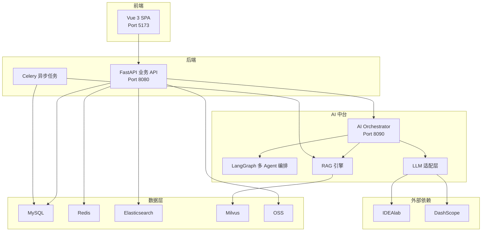
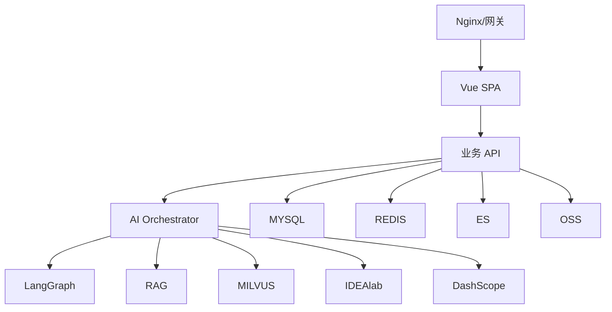
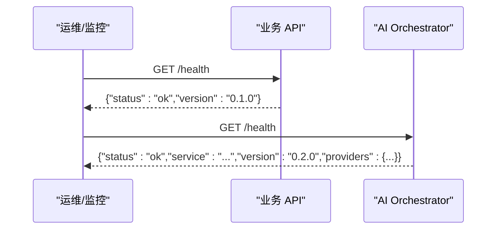
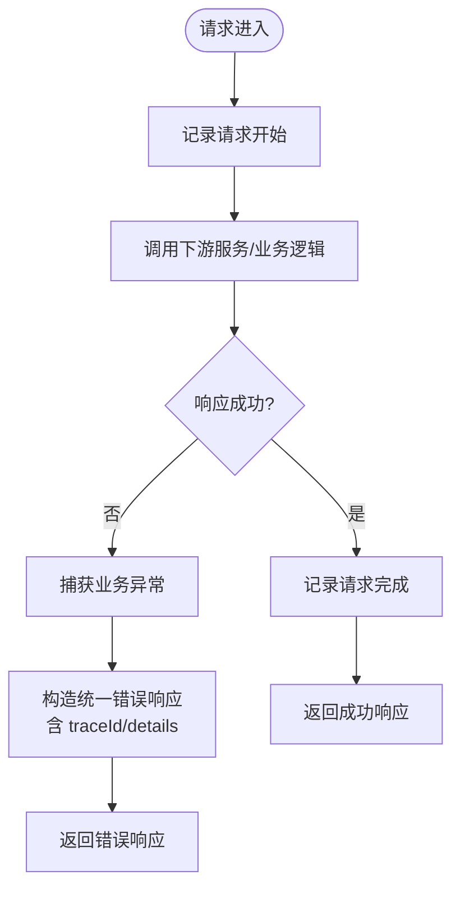
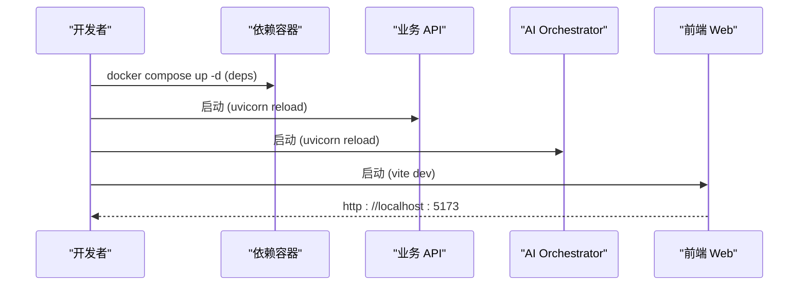
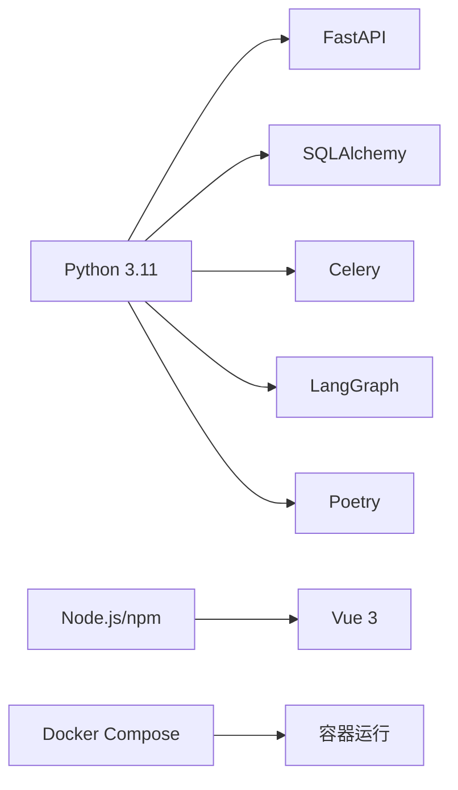
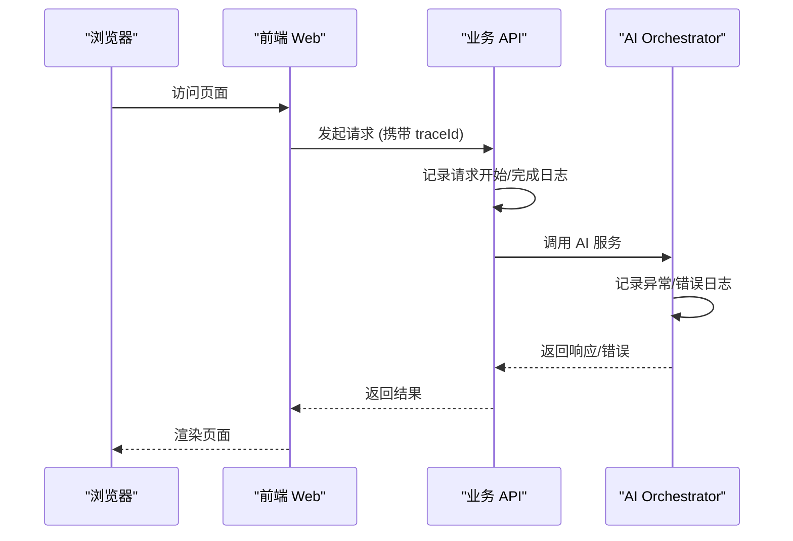

# 故障排除

<cite>
**本文引用的文件**
- [workspace/README.md](file://workspace/README.md)
- [docs/FDE工作台技术方案.md](file://docs/FDE工作台技术方案.md)
- [docs/部署文档.md](file://docs/部署文档.md)
- [workspace/api/app/main.py](file://workspace/api/app/main.py)
- [workspace/ai-orchestrator/app/main.py](file://workspace/ai-orchestrator/app/main.py)
- [workspace/infra/docker-compose/docker-compose.yml](file://workspace/infra/docker-compose/docker-compose.yml)
- [workspace/scripts/dev/start-all.sh](file://workspace/scripts/dev/start-all.sh)
- [workspace/api/app/config/logging.py](file://workspace/api/app/config/logging.py)
- [workspace/api/app/middleware/logging.py](file://workspace/api/app/middleware/logging.py)
- [workspace/api/app/exceptions/handlers.py](file://workspace/api/app/exceptions/handlers.py)
- [workspace/ai-orchestrator/app/exceptions/handlers.py](file://workspace/ai-orchestrator/app/exceptions/handlers.py)
- [workspace/api/pyproject.toml](file://workspace/api/pyproject.toml)
- [workspace/ai-orchestrator/pyproject.toml](file://workspace/ai-orchestrator/pyproject.toml)
- [workspace/web/src/main.ts](file://workspace/web/src/main.ts)
</cite>

## 目录
1. [简介](#简介)
2. [项目结构](#项目结构)
3. [核心组件](#核心组件)
4. [架构总览](#架构总览)
5. [详细组件分析](#详细组件分析)
6. [依赖分析](#依赖分析)
7. [性能考虑](#性能考虑)
8. [故障排除指南](#故障排除指南)
9. [结论](#结论)
10. [附录](#附录)

## 简介
本指南面向 FDE 工作台的研发与运维团队，提供系统化的故障排除方法与应急响应流程。内容覆盖启动失败排查、性能问题诊断、数据库连接问题、AI 服务异常、监控告警配置、健康检查、日志分析与错误追踪，并区分开发与生产环境的差异策略，同时提供问题报告模板与社区支持资源。

## 项目结构
FDE 工作台采用多模块单仓（monorepo）组织，包含前端 SPA、后端业务 API、AI 编排服务、共享协议、基础设施与脚本。模块间通过 REST/SSE 与 HTTP 通信，避免跨服务直接 import，确保边界清晰与可维护性。

**图表来源**
- [docs/FDE工作台技术方案.md](file://docs/FDE工作台技术方案.md)
- [workspace/README.md](file://workspace/README.md)

**章节来源**
- [workspace/README.md](file://workspace/README.md)
- [docs/FDE工作台技术方案.md](file://docs/FDE工作台技术方案.md)

## 核心组件
- 前端 Web：Vue 3 + TypeScript + Vite，提供 SPA 界面与 Copilot 对话体验。
- 后端 API：FastAPI + SQLAlchemy + Celery，提供 REST API、SSE、鉴权与审计。
- AI Orchestrator：FastAPI + LangGraph，负责多 Agent 编排、RAG 检索与工具调用。
- 基础设施：Docker Compose 编排 MySQL、Redis、ES、Milvus，以及 API、AI Orchestrator、Web。
- 共享协议：OpenAPI 规范与类型生成，确保跨模块契约一致。

**章节来源**
- [workspace/README.md](file://workspace/README.md)
- [docs/FDE工作台技术方案.md](file://docs/FDE工作台技术方案.md)

## 架构总览
系统采用五层架构：接入层（Nginx/网关）、前端层（Vue SPA）、后端服务层（FastAPI）、AI 中台层（LangGraph/RAG）、数据层（MySQL/Redis/ES/Milvus/OSS）。AI 服务通过 HTTP 与业务 API 通信，前端不直接访问 AI 服务，保证鉴权与审计可控。

**图表来源**
- [docs/FDE工作台技术方案.md](file://docs/FDE工作台技术方案.md)

## 详细组件分析

### 健康检查与端点
- API 服务健康检查：/health 返回服务状态与版本。
- AI Orchestrator 健康检查：/health 返回服务状态、版本与提供方状态。
- 基础设施健康检查：Compose 中为 MySQL、Redis、ES、Milvus、API、AI Orchestrator 配置了 healthcheck。

**图表来源**
- [workspace/api/app/main.py](file://workspace/api/app/main.py)
- [workspace/ai-orchestrator/app/main.py](file://workspace/ai-orchestrator/app/main.py)

**章节来源**
- [workspace/api/app/main.py](file://workspace/api/app/main.py)
- [workspace/ai-orchestrator/app/main.py](file://workspace/ai-orchestrator/app/main.py)
- [workspace/infra/docker-compose/docker-compose.yml](file://workspace/infra/docker-compose/docker-compose.yml)

### 日志与异常处理
- 结构化日志：后端使用 structlog 输出 JSON 日志，便于采集与检索。
- 请求日志中间件：记录请求开始与完成，包含方法、路径、状态码。
- 统一异常处理：BizException/SystemException 与 400/500 统一响应，包含 traceId 与 details。

**图表来源**
- [workspace/api/app/middleware/logging.py](file://workspace/api/app/middleware/logging.py)
- [workspace/api/app/exceptions/handlers.py](file://workspace/api/app/exceptions/handlers.py)
- [workspace/ai-orchestrator/app/exceptions/handlers.py](file://workspace/ai-orchestrator/app/exceptions/handlers.py)

**章节来源**
- [workspace/api/app/config/logging.py](file://workspace/api/app/config/logging.py)
- [workspace/api/app/middleware/logging.py](file://workspace/api/app/middleware/logging.py)
- [workspace/api/app/exceptions/handlers.py](file://workspace/api/app/exceptions/handlers.py)
- [workspace/ai-orchestrator/app/exceptions/handlers.py](file://workspace/ai-orchestrator/app/exceptions/handlers.py)

### 启动流程与依赖
- 一键启动：start-all.sh 启动依赖（MySQL/Redis/ES/Milvus）与 API、AI Orchestrator、Web。
- Compose 编排：API 依赖数据库与缓存健康；AI Orchestrator 依赖 API；Web 依赖 API。
- 端口映射：Web 5173→80；API 8080；AI Orchestrator 8090。

**图表来源**
- [workspace/scripts/dev/start-all.sh](file://workspace/scripts/dev/start-all.sh)
- [workspace/infra/docker-compose/docker-compose.yml](file://workspace/infra/docker-compose/docker-compose.yml)

**章节来源**
- [workspace/scripts/dev/start-all.sh](file://workspace/scripts/dev/start-all.sh)
- [workspace/infra/docker-compose/docker-compose.yml](file://workspace/infra/docker-compose/docker-compose.yml)

## 依赖分析
- 语言与框架：Python 3.11、FastAPI、SQLAlchemy、Celery、LangGraph、Milvus、Elasticsearch。
- 依赖管理：Poetry；前端使用 npm。
- 运行时：Docker Compose；生产可对接 K8s（技术方案中描述）。

**图表来源**
- [workspace/api/pyproject.toml](file://workspace/api/pyproject.toml)
- [workspace/ai-orchestrator/pyproject.toml](file://workspace/ai-orchestrator/pyproject.toml)

**章节来源**
- [workspace/api/pyproject.toml](file://workspace/api/pyproject.toml)
- [workspace/ai-orchestrator/pyproject.toml](file://workspace/ai-orchestrator/pyproject.toml)

## 性能考虑
- 前端：路由懒加载、Vite 代码分割、CDN；Copilot 切换与 @ 引用响应延迟目标明确。
- 后端：Redis 缓存、数据库连接池、异步任务；SSE 流式输出。
- AI 中台：LangGraph 编排、RAG 检索、模型路由；注意外部 LLM 调用延迟与限流。

[本节为通用指导，不直接分析具体文件]

## 故障排除指南

### 启动失败排查
- 依赖未就绪
  - 检查依赖容器健康：MySQL、Redis、ES、Milvus 的 healthcheck 是否通过。
  - 查看 Compose 依赖条件：api/ai-orchestrator 的 depends_on healthy。
- 服务端口占用
  - 确认端口映射：Web 5173→80、API 8080、AI Orchestrator 8090。
- 开发模式启动
  - 使用 start-all.sh 启动依赖与各服务，观察控制台输出。
- 健康检查失败
  - 访问 /health 端点验证服务状态；若失败，结合日志定位。

**章节来源**
- [workspace/infra/docker-compose/docker-compose.yml](file://workspace/infra/docker-compose/docker-compose.yml)
- [workspace/scripts/dev/start-all.sh](file://workspace/scripts/dev/start-all.sh)
- [workspace/api/app/main.py](file://workspace/api/app/main.py)
- [workspace/ai-orchestrator/app/main.py](file://workspace/ai-orchestrator/app/main.py)

### 性能问题诊断
- 前端性能
  - 使用浏览器性能面板检查首屏与切换耗时；核对路由懒加载与组件缓存。
  - 关注 Copilot 首 token 延迟与消息流追加性能。
- 后端性能
  - 关注数据库查询与缓存命中率；检查 Redis 读写延迟。
  - 监控 Celery 任务积压与执行时长。
- AI 中台性能
  - 关注 LangGraph 节点执行耗时、RAG 检索耗时、外部 LLM 调用耗时。
  - 检查 Milvus/ES 健康与查询延迟。

**章节来源**
- [docs/FDE工作台技术方案.md](file://docs/FDE工作台技术方案.md)
- [workspace/api/app/middleware/logging.py](file://workspace/api/app/middleware/logging.py)

### 数据库连接问题
- 检查步骤
  - 确认 MySQL 容器运行与健康。
  - 在 API 容器内执行数据库连接测试，核对 DATABASE_URL。
  - 查看 API 日志中的连接错误与异常堆栈。
- 常见原因
  - 网络连通性问题（容器间 DNS/网络）。
  - 凭据错误或字符集配置不当。
  - Alembic 迁移未执行导致表缺失。
- 处理建议
  - 优先在容器内复现并定位；必要时在宿主机直连验证。
  - 若为新环境，先执行数据库初始化与迁移。

**章节来源**
- [docs/部署文档.md](file://docs/部署文档.md)
- [workspace/infra/docker-compose/docker-compose.yml](file://workspace/infra/docker-compose/docker-compose.yml)

### AI 服务异常
- 症状
  - /copilot/chat 无响应或中断；/ai/chat 返回错误帧；RAG 检索失败。
- 诊断步骤
  - 访问 /health 检查 AI Orchestrator 状态与提供方状态。
  - 核查外部 LLM API Key 与网络可达性。
  - 检查 Milvus/ES 健康与索引状态。
  - 查看统一异常响应中的 code、details、traceId。
- 常见原因
  - 输入安全拦截（提示注入被阻断）。
  - RAG 检索/索引异常。
  - 客户端断开导致流式传输提前结束。
- 处理建议
  - 修正输入内容或上下文；重试请求；必要时清理缓存/索引。
  - 对外部服务进行降级或熔断处理。

**章节来源**
- [workspace/ai-orchestrator/app/main.py](file://workspace/ai-orchestrator/app/main.py)
- [workspace/api/app/exceptions/handlers.py](file://workspace/api/app/exceptions/handlers.py)
- [workspace/ai-orchestrator/app/exceptions/handlers.py](file://workspace/ai-orchestrator/app/exceptions/handlers.py)

### 监控告警配置
- 关键指标
  - 服务可用性：/health 状态、容器健康检查。
  - 响应时延：API/SSE/LLM/RAG。
  - 错误率：BizException/SystemException 比例。
  - 资源使用：CPU/内存/磁盘/网络。
  - 数据层健康：MySQL/Redis/ES/Milvus 连接数与延迟。
- 告警规则示例
  - /health 连续失败阈值。
  - SSE 流式首 token 超时阈值。
  - LLM 调用错误率与超时阈值。
  - Celery 任务堆积时长阈值。
- 告警通知
  - 邮件/IM 通知；分级升级策略（预警→严重→紧急）。
- 故障恢复流程
  - 自动恢复：重启容器、重试任务、回滚配置。
  - 人工干预：扩容、修复索引、修复外部依赖。

[本节为通用指导，不直接分析具体文件]

### 系统健康检查
- 健康端点
  - API：/health
  - AI Orchestrator：/health
- Compose 健康检查
  - API、AI Orchestrator、MySQL、Redis、ES、Milvus 均配置 healthcheck。
- 建议
  - 将健康端点纳入外部监控系统；设置多地域探测与自动告警。

**章节来源**
- [workspace/api/app/main.py](file://workspace/api/app/main.py)
- [workspace/ai-orchestrator/app/main.py](file://workspace/ai-orchestrator/app/main.py)
- [workspace/infra/docker-compose/docker-compose.yml](file://workspace/infra/docker-compose/docker-compose.yml)

### 日志分析与错误追踪
- 日志结构
  - structlog JSON 输出，包含级别、消息、上下文与异常信息。
- 请求追踪
  - traceId 生成与传递：异常处理器与中间件均记录 traceId，便于跨服务串联。
- 前端入口
  - main.ts 初始化应用、Pinia、路由与拦截器，便于定位前端发起的请求链路。

**图表来源**
- [workspace/web/src/main.ts](file://workspace/web/src/main.ts)
- [workspace/api/app/middleware/logging.py](file://workspace/api/app/middleware/logging.py)
- [workspace/api/app/exceptions/handlers.py](file://workspace/api/app/exceptions/handlers.py)
- [workspace/ai-orchestrator/app/exceptions/handlers.py](file://workspace/ai-orchestrator/app/exceptions/handlers.py)

**章节来源**
- [workspace/api/app/config/logging.py](file://workspace/api/app/config/logging.py)
- [workspace/api/app/middleware/logging.py](file://workspace/api/app/middleware/logging.py)
- [workspace/web/src/main.ts](file://workspace/web/src/main.ts)

### 应急响应预案与问题升级流程
- 预案
  - 快速隔离：停止异常服务副本，切换流量至健康实例。
  - 降级策略：关闭非关键功能、启用缓存、降级外部依赖。
  - 回滚：回滚到上一个稳定版本或配置。
- 升级流程
  - 一线：值班工程师处理；超过阈值升级。
  - 二线：资深工程师介入；影响范围扩大时升级。
  - 三线：架构师/技术负责人；重大事故升级。
- 通知机制
  - 自动通知 + 人工确认；定期演练。

[本节为通用指导，不直接分析具体文件]

### 开发环境 vs 生产环境差异
- 开发模式
  - 热重载、体积小、日志实时；依赖容器健康检查。
  - 前端可通过 VITE_API_MODE 控制 Mock/真实 API。
- 生产环境
  - 完整构建、镜像缓存、稳定版本；需配置真实密钥与外部依赖。
  - 健康检查与监控告警需完善；日志输出与采集链路需就绪。

**章节来源**
- [docs/部署文档.md](file://docs/部署文档.md)
- [workspace/README.md](file://workspace/README.md)

### 问题报告模板
- 基本信息
  - 时间、环境（开发/生产）、版本号
- 复现步骤
  - 操作步骤、期望结果、实际结果
- 日志与截图
  - API/SSE 错误、traceId、浏览器控制台、服务日志
- 影响范围
  - 用户数、功能模块、数据影响
- 紧急程度与升级路径
- 处理建议与临时方案

[本节为通用指导，不直接分析具体文件]

### 社区支持资源
- 文档与设计
  - 技术方案、详细设计、部署文档
- 仓库与脚本
  - 一键启动脚本、Docker Compose 编排
- 提交与规范
  - 代码评审规范、测试用例

**章节来源**
- [docs/FDE工作台技术方案.md](file://docs/FDE工作台技术方案.md)
- [docs/部署文档.md](file://docs/部署文档.md)
- [workspace/scripts/dev/start-all.sh](file://workspace/scripts/dev/start-all.sh)

## 结论
通过明确的健康检查、统一的日志与异常处理、完善的监控告警与应急流程，FDE 工作台可在开发与生产环境中高效定位与解决问题。建议持续完善指标体系与自动化恢复能力，以提升系统稳定性与可维护性。

## 附录
- 常用命令参考
  - 部署：deploy up/build/dev/logs/status/restart/down/reset/test/open/clean
  - Docker：ps/logs/exec/restart/stats/network
  - 数据库：进入容器、查看库表、备份/恢复

**章节来源**
- [docs/部署文档.md](file://docs/部署文档.md)