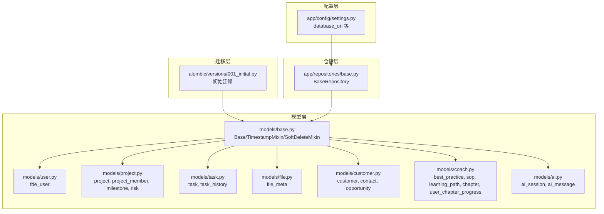
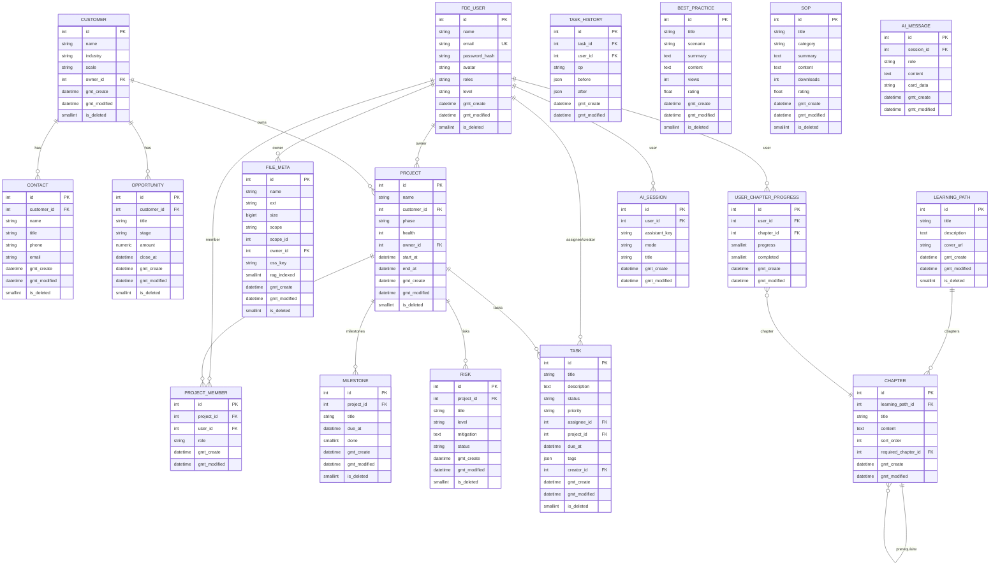
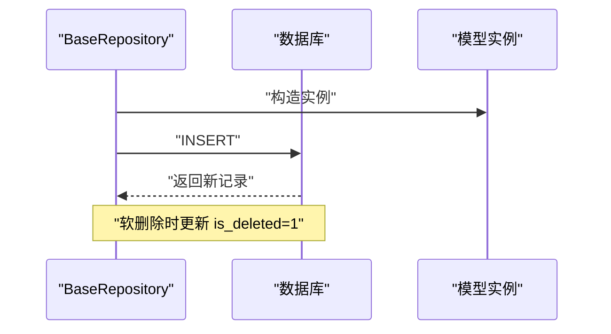

# 数据库设计

<cite>
**本文引用的文件**
- [workspace/api/app/models/base.py](file://workspace/api/app/models/base.py)
- [workspace/api/app/models/user.py](file://workspace/api/app/models/user.py)
- [workspace/api/app/models/project.py](file://workspace/api/app/models/project.py)
- [workspace/api/app/models/task.py](file://workspace/api/app/models/task.py)
- [workspace/api/app/models/file.py](file://workspace/api/app/models/file.py)
- [workspace/api/app/models/customer.py](file://workspace/api/app/models/customer.py)
- [workspace/api/app/models/coach.py](file://workspace/api/app/models/coach.py)
- [workspace/api/app/models/ai.py](file://workspace/api/app/models/ai.py)
- [workspace/api/alembic/versions/001_initial.py](file://workspace/api/alembic/versions/001_initial.py)
- [workspace/api/app/config/settings.py](file://workspace/api/app/config/settings.py)
- [workspace/api/app/repositories/base.py](file://workspace/api/app/repositories/base.py)
- [workspace/api/app/utils/id_gen.py](file://workspace/api/app/utils/id_gen.py)
</cite>

## 目录
1. [简介](#简介)
2. [项目结构](#项目结构)
3. [核心组件](#核心组件)
4. [架构总览](#架构总览)
5. [详细组件分析](#详细组件分析)
6. [依赖分析](#依赖分析)
7. [性能考量](#性能考量)
8. [故障排查指南](#故障排查指南)
9. [结论](#结论)
10. [附录](#附录)

## 简介
本文件为 FDE 工作台数据库设计文档，聚焦于数据库架构设计原则、索引策略与连接池配置建议；深入解析核心表（用户、项目、任务、文件、客户、教练与 AI 会话/消息）的设计理念与字段定义；阐明数据关系（外键、软删除、时间戳）、完整性约束与业务规则；提供 ER 模型图与示例数据；并给出数据访问模式、缓存策略、性能优化、数据生命周期与归档策略以及数据迁移路径与版本管理。

## 项目结构
数据库相关代码主要位于后端 API 工程中，采用 SQLAlchemy ORM 映射与 Alembic 迁移管理：
- 模型层：各领域实体在 models 子包下定义，统一继承基础 Mixin（时间戳、软删除）
- 迁移层：Alembic 版本化迁移脚本定义初始表结构
- 配置层：应用配置集中于 settings，包含数据库连接串等
- 仓储层：通用 CRUD 基类封装软删除等通用逻辑

图表来源
- [workspace/api/app/models/base.py:1-24](file://workspace/api/app/models/base.py#L1-L24)
- [workspace/api/app/models/user.py:1-22](file://workspace/api/app/models/user.py#L1-L22)
- [workspace/api/app/models/project.py:1-63](file://workspace/api/app/models/project.py#L1-L63)
- [workspace/api/app/models/task.py:1-41](file://workspace/api/app/models/task.py#L1-L41)
- [workspace/api/app/models/file.py:1-23](file://workspace/api/app/models/file.py#L1-L23)
- [workspace/api/app/models/customer.py:1-47](file://workspace/api/app/models/customer.py#L1-L47)
- [workspace/api/app/models/coach.py:1-73](file://workspace/api/app/models/coach.py#L1-L73)
- [workspace/api/app/models/ai.py:1-32](file://workspace/api/app/models/ai.py#L1-L32)
- [workspace/api/alembic/versions/001_initial.py:1-290](file://workspace/api/alembic/versions/001_initial.py#L1-L290)
- [workspace/api/app/config/settings.py:23-25](file://workspace/api/app/config/settings.py#L23-L25)
- [workspace/api/app/repositories/base.py:1-42](file://workspace/api/app/repositories/base.py#L1-L42)

章节来源
- [workspace/api/app/models/base.py:1-24](file://workspace/api/app/models/base.py#L1-L24)
- [workspace/api/alembic/versions/001_initial.py:1-290](file://workspace/api/alembic/versions/001_initial.py#L1-L290)
- [workspace/api/app/config/settings.py:23-25](file://workspace/api/app/config/settings.py#L23-L25)
- [workspace/api/app/repositories/base.py:1-42](file://workspace/api/app/repositories/base.py#L1-L42)

## 核心组件
- 基础模型与混入
  - Base：所有 ORM 模型的基类
  - TimestampMixin：统一 gmt_create/gmt_modified 时间戳字段
  - SoftDeleteMixin：统一 is_deleted 软删除字段（小整型，0/1）
- 仓储基类 BaseRepository：提供 get/list_by_ids/create/soft_delete 等通用能力
- 应用配置 Settings：包含 database_url 等关键配置项

章节来源
- [workspace/api/app/models/base.py:10-24](file://workspace/api/app/models/base.py#L10-L24)
- [workspace/api/app/repositories/base.py:14-42](file://workspace/api/app/repositories/base.py#L14-L42)
- [workspace/api/app/config/settings.py:23-25](file://workspace/api/app/config/settings.py#L23-L25)

## 架构总览
数据库采用关系型设计，围绕“用户-项目-任务-文件-客户-教练-AI”六大主题域构建。通过外键约束保证引用完整性，结合软删除与统一时间戳实现可审计的数据生命周期管理。迁移脚本定义了完整的初始表结构，并在创建任务表后再补充 project_id 的外键约束以确保一致性。

图表来源
- [workspace/api/alembic/versions/001_initial.py:16-267](file://workspace/api/alembic/versions/001_initial.py#L16-L267)
- [workspace/api/app/models/project.py:9-63](file://workspace/api/app/models/project.py#L9-L63)
- [workspace/api/app/models/task.py:9-41](file://workspace/api/app/models/task.py#L9-L41)
- [workspace/api/app/models/file.py:9-23](file://workspace/api/app/models/file.py#L9-L23)
- [workspace/api/app/models/customer.py:9-47](file://workspace/api/app/models/customer.py#L9-L47)
- [workspace/api/app/models/coach.py:9-73](file://workspace/api/app/models/coach.py#L9-L73)
- [workspace/api/app/models/ai.py:9-32](file://workspace/api/app/models/ai.py#L9-L32)

## 详细组件分析

### 用户表（fde_user）
- 设计理念
  - 统一身份标识与角色体系，支持多角色逗号分隔存储
  - 提供头像、级别（P5-P9）等扩展属性
  - 与项目、任务、文件、AI 会话等建立多对多/一对多关联
- 字段要点
  - 主键自增 id
  - 唯一邮箱 email
  - 角色 roles 默认值为单一角色字符串
  - 级别 level 默认 P5
  - 统一时间戳与软删除
- 关系
  - 作为 owner/assignee/creator/owner_id 外键出现在多个表中

章节来源
- [workspace/api/app/models/user.py:8-22](file://workspace/api/app/models/user.py#L8-L22)
- [workspace/api/alembic/versions/001_initial.py:17-30](file://workspace/api/alembic/versions/001_initial.py#L17-L30)

### 项目表（project）与成员、里程碑、风险
- 设计理念
  - 项目阶段（init/discovery/delivery/review/closed）、健康度（0-100）量化管理
  - 项目成员按角色（owner/core/support）区分权限
  - 里程碑与风险随项目生命周期动态演进
- 字段要点
  - 项目 owner_id 引用用户
  - 里程碑 done 字段标记完成状态
  - 风险 level 与状态 status 双维度管理
- 关系
  - 与用户（owner）、客户（customer）多对一
  - 与成员、里程碑、风险一对多级联删除

章节来源
- [workspace/api/app/models/project.py:9-63](file://workspace/api/app/models/project.py#L9-L63)
- [workspace/api/alembic/versions/001_initial.py:104-159](file://workspace/api/alembic/versions/001_initial.py#L104-L159)

### 任务表（task）与历史（task_history）
- 设计理念
  - 任务状态（todo/in_progress/review/done/blocked）、优先级（p0/p1/p2/p3）标准化
  - 支持标签数组、截止日期、负责人与创建者分离
  - 历史表记录每次变更的 before/after，便于审计
- 字段要点
  - assignee_id、creator_id 引用用户
  - project_id 引用项目（迁移时补外键）
  - tags 为 JSON 数组
- 关系
  - 与用户（assignee/creator）、项目多对一
  - 与历史表一对多

章节来源
- [workspace/api/app/models/task.py:9-41](file://workspace/api/app/models/task.py#L9-L41)
- [workspace/api/alembic/versions/001_initial.py:32-61](file://workspace/api/alembic/versions/001_initial.py#L32-L61)

### 文件元数据表（file_meta）
- 设计理念
  - 统一文件存储元信息，支持作用域（个人/项目/客户/共享）与归属人
  - 结合 OSS 键与大小、扩展名等信息，便于检索与归档
- 字段要点
  - scope/scope_id 定位作用域对象
  - rag_indexed 标记是否已建立向量索引
- 关系
  - 与用户（owner）多对一

章节来源
- [workspace/api/app/models/file.py:9-23](file://workspace/api/app/models/file.py#L9-L23)
- [workspace/api/alembic/versions/001_initial.py:161-176](file://workspace/api/alembic/versions/001_initial.py#L161-L176)

### 客户表（customer）、联系人（contact）、商机（opportunity）
- 设计理念
  - 客户主表承载基本信息与所有者
  - 联系人与商机随客户展开，形成销售线索闭环
- 字段要点
  - 商机金额使用高精度数值类型，关闭日期用于周期统计
- 关系
  - 客户与联系人、商机一对多

章节来源
- [workspace/api/app/models/customer.py:9-47](file://workspace/api/app/models/customer.py#L9-L47)
- [workspace/api/alembic/versions/001_initial.py:63-102](file://workspace/api/alembic/versions/001_initial.py#L63-L102)

### 教练知识（best_practice、sop）、学习路径（learning_path）、章节（chapter）、进度（user_chapter_progress）
- 设计理念
  - 最佳实践与标准作业流程沉淀组织经验
  - 学习路径与章节构成培训体系，支持前置章节依赖
  - 用户章节进度记录学习轨迹
- 字段要点
  - rating/views/downloads 等指标用于评估内容质量
  - 章节排序字段与自引用前置章节
- 关系
  - 学习路径与章节一对多；章节自引用形成依赖链；进度与用户/章节多对多

章节来源
- [workspace/api/app/models/coach.py:9-73](file://workspace/api/app/models/coach.py#L9-L73)
- [workspace/api/alembic/versions/001_initial.py:178-243](file://workspace/api/alembic/versions/001_initial.py#L178-L243)

### AI 会话与消息（ai_session、ai_message）
- 设计理念
  - 会话与消息分离，支持不同助手键与模式（智能/创意/严谨）
  - 卡片数据以字符串存储，便于扩展复杂交互内容
- 字段要点
  - 会话与用户多对一；消息与会话多对一
- 关系
  - 会话与消息一对多

章节来源
- [workspace/api/app/models/ai.py:9-32](file://workspace/api/app/models/ai.py#L9-L32)
- [workspace/api/alembic/versions/001_initial.py:245-267](file://workspace/api/alembic/versions/001_initial.py#L245-L267)

## 依赖分析
- 外键关系
  - 任务表 project_id 在迁移脚本中延后添加，确保先创建 project 表
  - 多处外键指向 fde_user（owner/assignee/creator/owner_id），形成统一身份体系
- 软删除机制
  - 所有实体继承 SoftDeleteMixin，删除操作通过更新 is_deleted 实现
  - 仓储层提供 soft_delete 方法，避免物理删除影响关联完整性
- 时间戳管理
  - 所有实体继承 TimestampMixin，统一记录创建与更新时间
  - 迁移脚本中为各表设置默认值与触发器（server_default）

图表来源
- [workspace/api/app/repositories/base.py:29-41](file://workspace/api/app/repositories/base.py#L29-L41)
- [workspace/api/app/models/base.py:21-24](file://workspace/api/app/models/base.py#L21-L24)

章节来源
- [workspace/api/alembic/versions/001_initial.py:120-121](file://workspace/api/alembic/versions/001_initial.py#L120-L121)
- [workspace/api/app/repositories/base.py:35-41](file://workspace/api/app/repositories/base.py#L35-L41)
- [workspace/api/app/models/base.py:15-24](file://workspace/api/app/models/base.py#L15-L24)

## 性能考量
- 索引策略（建议）
  - 唯一索引：用户邮箱（唯一性校验）
  - 外键列：project_id、assignee_id、creator_id、owner_id、customer_id 等高频过滤列
  - 范围查询：start_at/end_at、due_at、gmt_create/gmt_modified
  - 模糊/条件查询：任务标题/描述、文件名称、客户名称、商机标题
  - JSON 列：tags（如需检索可考虑虚拟列或 GIN 索引，视数据库版本而定）
- 连接池配置（建议）
  - 连接池大小：根据并发请求与数据库吞吐量设定（如 20-50）
  - 超时与重试：合理设置连接超时与查询超时，启用幂等重试
  - 读写分离：将只读报表查询路由至从库
- 缓存策略（建议）
  - 热点数据：用户信息、项目概览、常用任务列表
  - LRU 缓存：基于 Redis 或本地缓存，设置 TTL 与失效策略
  - 一致性：写操作先更新数据库再淘汰缓存
- 查询优化
  - 分页与投影：仅选择必要字段，避免 SELECT *
  - 批量接口：批量查询使用 IN 子句与批量插入
  - 历史表：task_history 按时间倒序查询，必要时分表或冷热分离

## 故障排查指南
- 常见问题
  - 外键约束失败：检查被引用记录是否存在，确认迁移顺序正确
  - 软删除导致数据不可见：确认查询未过滤 is_deleted=1
  - 时间戳异常：检查服务器时区与默认值配置
- 排查步骤
  - 核对迁移版本：确保数据库 schema 与迁移脚本一致
  - 审核 SQL 日志：定位慢查询与重复查询
  - 校验缓存命中率：调整 TTL 与淘汰策略
- 修复建议
  - 使用仓储层 soft_delete 替代直接 DELETE
  - 对高频查询列补充索引，定期分析执行计划

章节来源
- [workspace/api/app/repositories/base.py:35-41](file://workspace/api/app/repositories/base.py#L35-L41)
- [workspace/api/alembic/versions/001_initial.py:270-289](file://workspace/api/alembic/versions/001_initial.py#L270-L289)

## 结论
该数据库设计以统一的时间戳与软删除机制为基础，围绕用户、项目、任务、文件、客户、教练与 AI 七大主题域构建清晰的关系模型。通过 Alembic 进行版本化迁移，配合仓储层通用能力与合理的索引策略，能够满足当前业务需求并具备良好的扩展性与可维护性。

## 附录

### 数据关系设计与业务规则
- 外键关系
  - 项目 owner_id 引用用户
  - 任务 assignee_id/creator_id/project_id 引用用户与项目
  - 文件 owner_id 引用用户
  - 客户 owner_id 引用用户
  - 学习路径与章节、章节自引用
- 软删除机制
  - 所有实体支持 is_deleted=1 标记删除，仓储层提供统一软删除方法
- 时间戳管理
  - gmt_create/gmt_modified 自动维护，迁移脚本设置默认值
- 业务规则
  - 任务状态与优先级枚举约束
  - 项目阶段与健康度范围约束
  - 章节排序与前置依赖约束

章节来源
- [workspace/api/app/models/base.py:15-24](file://workspace/api/app/models/base.py#L15-L24)
- [workspace/api/app/repositories/base.py:35-41](file://workspace/api/app/repositories/base.py#L35-L41)
- [workspace/api/alembic/versions/001_initial.py:16-267](file://workspace/api/alembic/versions/001_initial.py#L16-L267)

### 示例数据
- 用户（fde_user）
  - name: "张三", email: "zhangsan@xxx.com", roles: "fde,tl", level: "P6"
- 客户（customer）
  - name: "ABC 科技", owner_id: 1
- 项目（project）
  - name: "XX 产品重构", customer_id: 1, owner_id: 1, start_at: "2026-04-01", end_at: "2026-09-30"
- 任务（task）
  - title: "需求评审", status: "todo", priority: "p1", project_id: 1, assignee_id: 1, due_at: "2026-04-15"
- 文件（file_meta）
  - name: "需求文档_v1.pdf", ext: "pdf", size: 1048576, scope: "project", scope_id: 1, owner_id: 1, oss_key: "proj/1/doc.pdf"
- 教练（best_practice）
  - title: "需求评审最佳实践", scenario: "产品", rating: 4.8
- AI 会话（ai_session）
  - user_id: 1, assistant_key: "tasks", mode: "smart", title: "任务讨论"

章节来源
- [workspace/api/alembic/versions/001_initial.py:17-267](file://workspace/api/alembic/versions/001_initial.py#L17-L267)
- [workspace/api/app/models/user.py:11-17](file://workspace/api/app/models/user.py#L11-L17)
- [workspace/api/app/models/customer.py:12-16](file://workspace/api/app/models/customer.py#L12-L16)
- [workspace/api/app/models/project.py:12-19](file://workspace/api/app/models/project.py#L12-L19)
- [workspace/api/app/models/task.py:12-21](file://workspace/api/app/models/task.py#L12-L21)
- [workspace/api/app/models/file.py:12-20](file://workspace/api/app/models/file.py#L12-L20)
- [workspace/api/app/models/coach.py:12-18](file://workspace/api/app/models/coach.py#L12-L18)
- [workspace/api/app/models/ai.py:12-16](file://workspace/api/app/models/ai.py#L12-L16)

### 数据访问模式与缓存策略
- 访问模式
  - 读多写少场景：优先缓存热点数据（用户、项目、任务列表）
  - 写多场景：采用批量写入与事务控制，减少锁竞争
- 缓存策略
  - LRU 缓存 + 失效时间，写操作先更新数据库再淘汰缓存
  - 对高频过滤条件（如 project_id、assignee_id）建立二级索引

章节来源
- [workspace/api/app/repositories/base.py:20-27](file://workspace/api/app/repositories/base.py#L20-L27)
- [workspace/api/app/utils/id_gen.py:8-21](file://workspace/api/app/utils/id_gen.py#L8-L21)

### 数据生命周期、保留策略与归档规则
- 生命周期
  - 创建：记录 gmt_create
  - 更新：记录 gmt_modified
  - 删除：标记 is_deleted=1（软删除）
- 保留策略
  - 任务历史与日志：按月清理，保留最近 6-12 个月
  - AI 会话与消息：按用户维度清理，保留最近 3 个月
  - 文件元数据：与 OSS 生命周期联动，过期自动清理
- 归档规则
  - 历史数据按年归档至冷存储，保留摘要与索引以便检索

章节来源
- [workspace/api/app/models/base.py:17-18](file://workspace/api/app/models/base.py#L17-L18)
- [workspace/api/alembic/versions/001_initial.py:270-289](file://workspace/api/alembic/versions/001_initial.py#L270-L289)

### 数据迁移路径与版本管理
- 迁移路径
  - 初始版本：001_initial 创建全部表与外键约束
  - 后续版本：按需新增表或列，保持向后兼容
- 版本管理
  - 使用 Alembic 管理迁移脚本，严格遵循升级/降级顺序
  - 生产环境执行前进行回滚验证与备份

章节来源
- [workspace/api/alembic/versions/001_initial.py:1-14](file://workspace/api/alembic/versions/001_initial.py#L1-L14)
- [workspace/api/alembic.ini:1-48](file://workspace/api/alembic.ini#L1-L48)