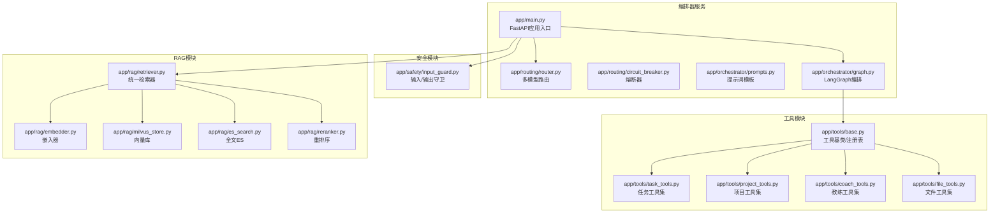
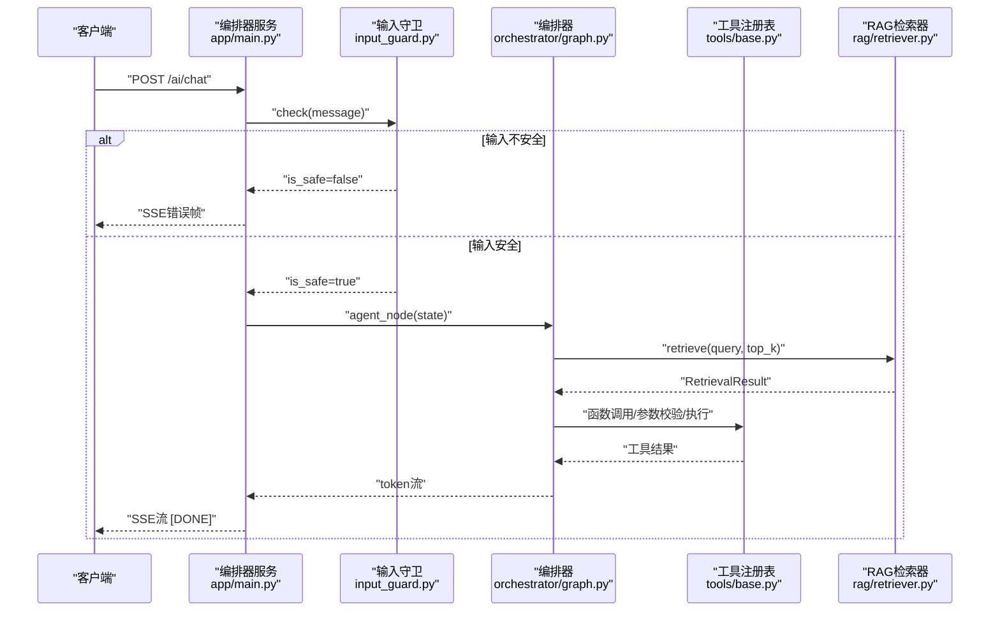
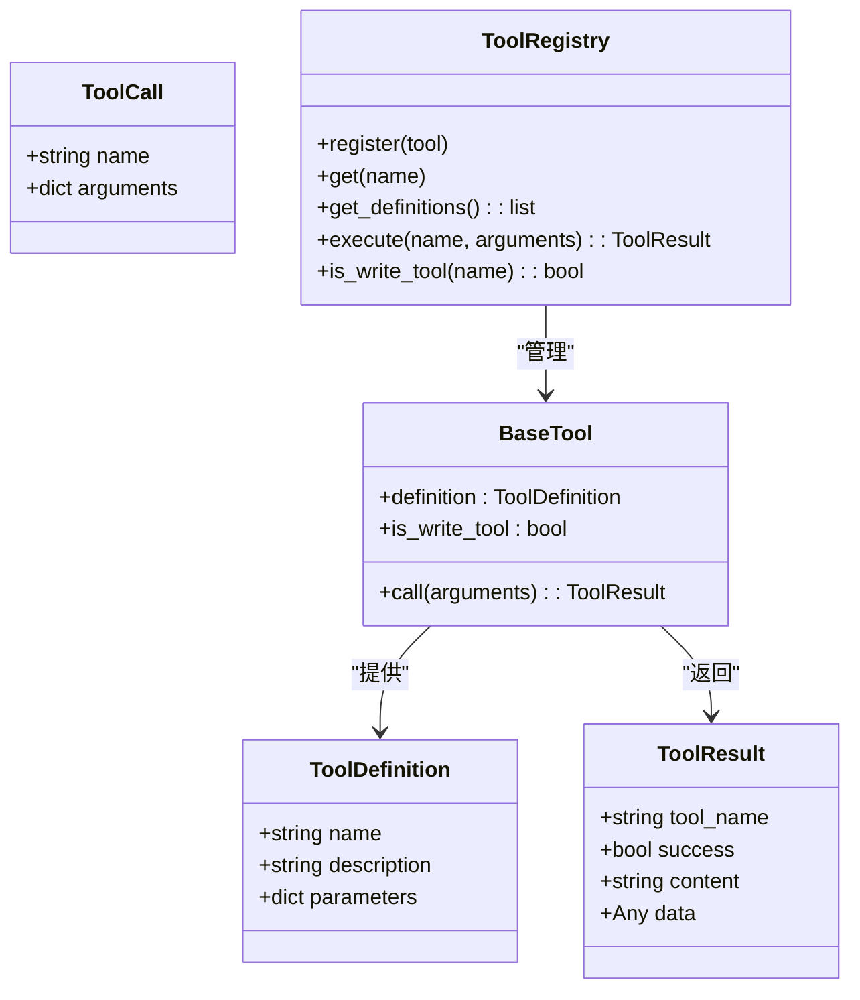
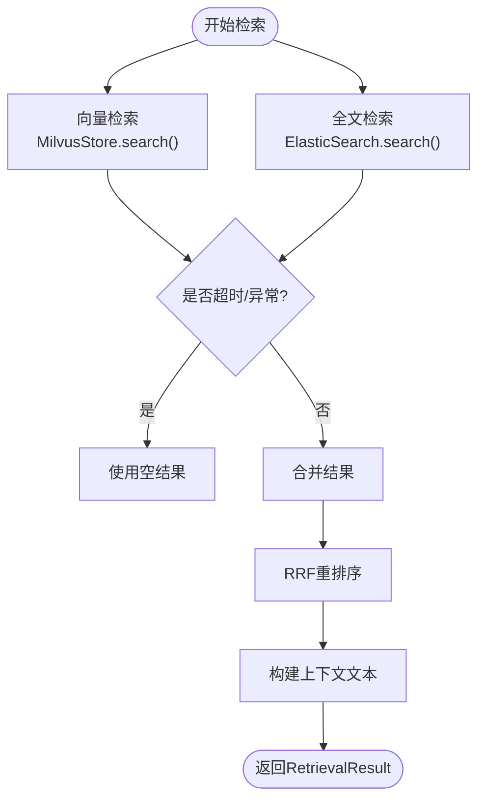
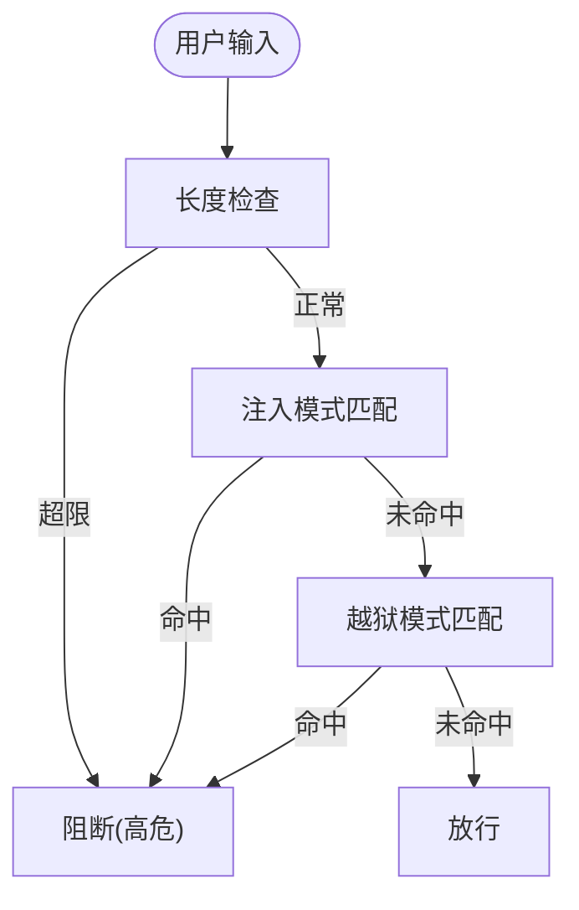
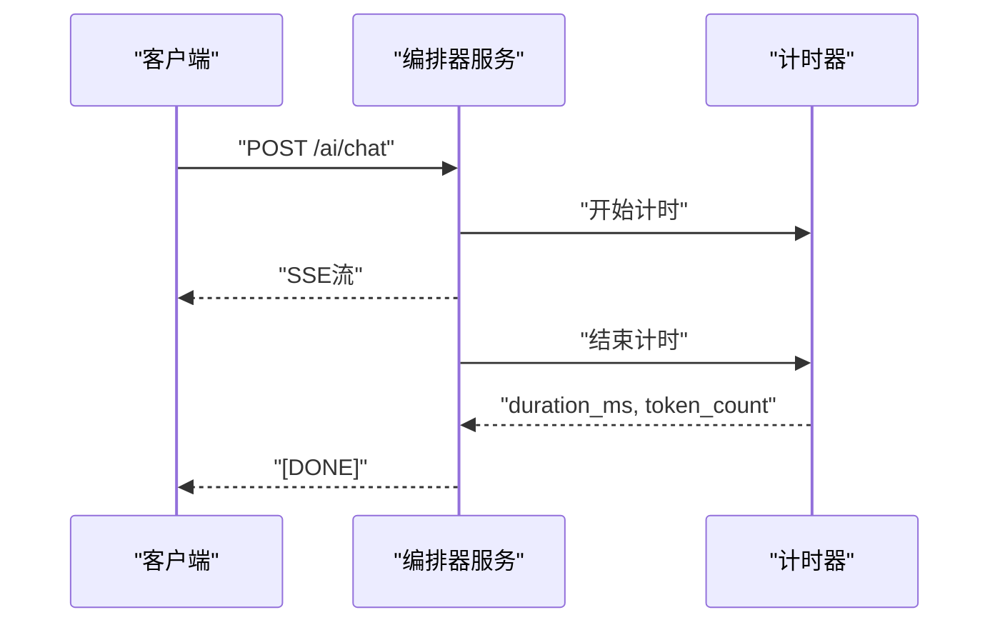
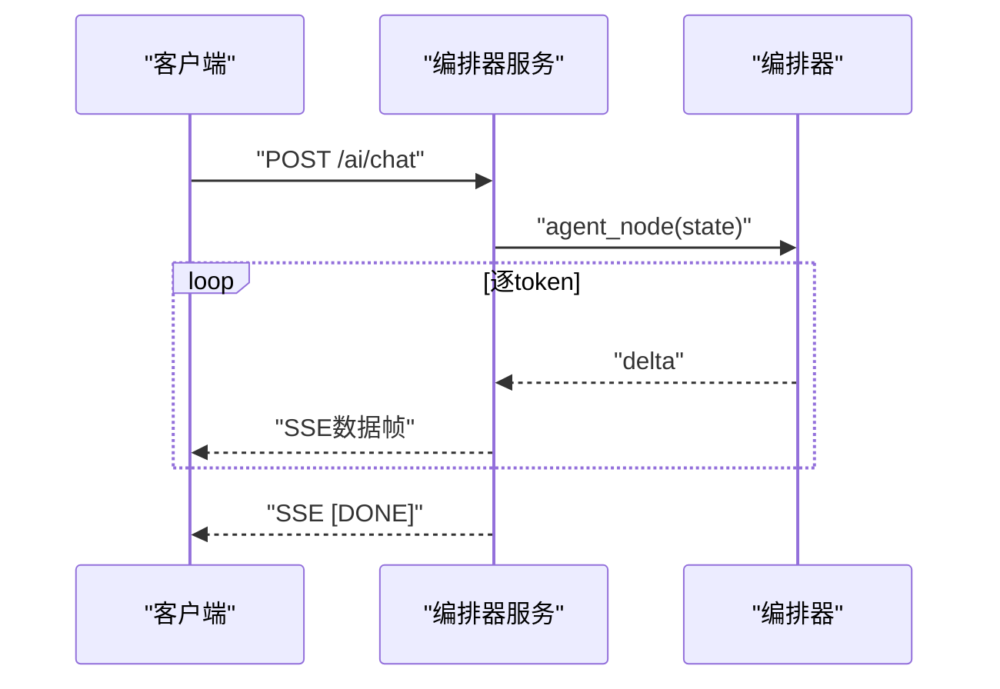
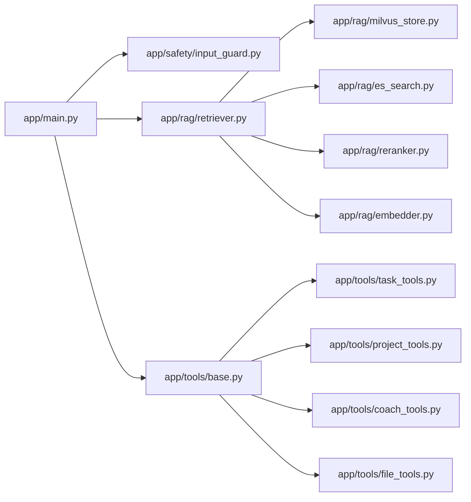

# AI系统测试

<cite>
**本文引用的文件**
- [workspace/ai-orchestrator/tests/test_main.py](file://workspace/ai-orchestrator/tests/test_main.py)
- [workspace/ai-orchestrator/tests/test_integration.py](file://workspace/ai-orchestrator/tests/test_integration.py)
- [workspace/ai-orchestrator/app/main.py](file://workspace/ai-orchestrator/app/main.py)
- [workspace/ai-orchestrator/app/tools/base.py](file://workspace/ai-orchestrator/app/tools/base.py)
- [workspace/ai-orchestrator/app/tools/coach_tools.py](file://workspace/ai-orchestrator/app/tools/coach_tools.py)
- [workspace/ai-orchestrator/app/tools/task_tools.py](file://workspace/ai-orchestrator/app/tools/task_tools.py)
- [workspace/ai-orchestrator/app/tools/project_tools.py](file://workspace/ai-orchestrator/app/tools/project_tools.py)
- [workspace/ai-orchestrator/app/tools/file_tools.py](file://workspace/ai-orchestrator/app/tools/file_tools.py)
- [workspace/ai-orchestrator/app/safety/input_guard.py](file://workspace/ai-orchestrator/app/safety/input_guard.py)
- [workspace/ai-orchestrator/app/rag/retriever.py](file://workspace/ai-orchestrator/app/rag/retriever.py)
- [workspace/ai-orchestrator/app/rag/reranker.py](file://workspace/ai-orchestrator/app/rag/reranker.py)
- [workspace/ai-orchestrator/app/rag/embedder.py](file://workspace/ai-orchestrator/app/rag/embedder.py)
- [workspace/ai-orchestrator/app/rag/es_search.py](file://workspace/ai-orchestrator/app/rag/es_search.py)
- [workspace/ai-orchestrator/app/rag/milvus_store.py](file://workspace/ai-orchestrator/app/rag/milvus_store.py)
</cite>

## 目录
1. [引言](#引言)
2. [项目结构](#项目结构)
3. [核心组件](#核心组件)
4. [架构总览](#架构总览)
5. [详细组件分析](#详细组件分析)
6. [依赖关系分析](#依赖关系分析)
7. [性能考虑](#性能考虑)
8. [故障排查指南](#故障排查指南)
9. [结论](#结论)
10. [附录](#附录)

## 引言
本测试文档面向FDE工作台的AI系统，围绕以下目标构建系统化测试方案：
- 工具调用测试：Function Calling工具测试、工具参数验证、工具执行结果测试
- RAG检索测试：向量检索准确性、文档相关性评分、ACL权限过滤测试
- 安全过滤测试：输入过滤验证、输出净化测试、Prompt注入防护测试
- 性能基准测试：模型推理延迟、批量处理性能、内存使用优化测试
- AI助手对话测试与多轮交互测试

文档以仓库现有实现为依据，结合测试用例与源码行为，提供可操作的测试策略与验证方法。

## 项目结构
AI系统主要由“编排器服务”和“工具/安全/RAG子模块”构成，测试覆盖通过单元与集成测试双层保障。

图示来源
- [workspace/ai-orchestrator/app/main.py:1-307](file://workspace/ai-orchestrator/app/main.py#L1-L307)
- [workspace/ai-orchestrator/app/tools/base.py:1-89](file://workspace/ai-orchestrator/app/tools/base.py#L1-L89)
- [workspace/ai-orchestrator/app/safety/input_guard.py:1-183](file://workspace/ai-orchestrator/app/safety/input_guard.py#L1-L183)
- [workspace/ai-orchestrator/app/rag/retriever.py:1-127](file://workspace/ai-orchestrator/app/rag/retriever.py#L1-L127)
- [workspace/ai-orchestrator/app/rag/embedder.py:1-85](file://workspace/ai-orchestrator/app/rag/embedder.py#L1-L85)
- [workspace/ai-orchestrator/app/rag/milvus_store.py:1-158](file://workspace/ai-orchestrator/app/rag/milvus_store.py#L1-L158)
- [workspace/ai-orchestrator/app/rag/es_search.py:1-128](file://workspace/ai-orchestrator/app/rag/es_search.py#L1-L128)
- [workspace/ai-orchestrator/app/rag/reranker.py:1-129](file://workspace/ai-orchestrator/app/rag/reranker.py#L1-L129)

章节来源
- [workspace/ai-orchestrator/app/main.py:1-307](file://workspace/ai-orchestrator/app/main.py#L1-L307)

## 核心组件
- 编排器服务：提供健康检查、聊天流式响应、工具列表、RAG检索/索引/删除等HTTP接口；内置输入安全守卫与审计日志。
- 工具体系：统一的工具定义、注册表与执行框架，按助手类型划分工具集（任务/项目/教练/文件），支持写操作识别与动作卡片预览。
- 安全过滤：输入守卫检测注入/越狱/超长等风险；输出守卫检测敏感信息与超长输出。
- RAG检索：向量（Milvus）+ 全文（ES）混合检索，Reciprocal Rank Fusion（RRF）重排序，支持上下文构建与ACL过滤。

章节来源
- [workspace/ai-orchestrator/app/main.py:79-307](file://workspace/ai-orchestrator/app/main.py#L79-L307)
- [workspace/ai-orchestrator/app/tools/base.py:50-89](file://workspace/ai-orchestrator/app/tools/base.py#L50-L89)
- [workspace/ai-orchestrator/app/safety/input_guard.py:96-183](file://workspace/ai-orchestrator/app/safety/input_guard.py#L96-L183)
- [workspace/ai-orchestrator/app/rag/retriever.py:32-127](file://workspace/ai-orchestrator/app/rag/retriever.py#L32-L127)

## 架构总览
下图展示从客户端到编排器、工具与RAG的典型调用链路，以及安全过滤与审计环节。

图示来源
- [workspace/ai-orchestrator/app/main.py:89-172](file://workspace/ai-orchestrator/app/main.py#L89-L172)
- [workspace/ai-orchestrator/app/safety/input_guard.py:102-132](file://workspace/ai-orchestrator/app/safety/input_guard.py#L102-L132)
- [workspace/ai-orchestrator/app/rag/retriever.py:49-102](file://workspace/ai-orchestrator/app/rag/retriever.py#L49-L102)
- [workspace/ai-orchestrator/app/tools/base.py:76-85](file://workspace/ai-orchestrator/app/tools/base.py#L76-L85)

## 详细组件分析

### 工具调用测试
目标：验证Function Calling工具的定义、参数校验与执行结果。
- 工具定义与注册
  - 统一的工具定义结构与注册表，导出OpenAI兼容的函数定义，供LLM函数调用。
  - 测试要点：列出所有工具、按助手类型筛选工具、工具定义字段完整性。
- 参数验证
  - 工具参数采用JSON Schema约束（枚举、必填、默认值），在执行前由LLM生成参数字典。
  - 测试要点：必填参数缺失、非法枚举值、参数类型不匹配时的错误处理。
- 执行结果
  - 工具执行返回标准化结果对象，包含成功标志、简要内容与详细数据。
  - 写操作工具需触发动作卡片预览机制（在编排器中体现）。

图示来源
- [workspace/ai-orchestrator/app/tools/base.py:9-89](file://workspace/ai-orchestrator/app/tools/base.py#L9-L89)

章节来源
- [workspace/ai-orchestrator/app/tools/base.py:50-89](file://workspace/ai-orchestrator/app/tools/base.py#L50-L89)
- [workspace/ai-orchestrator/tests/test_integration.py:185-230](file://workspace/ai-orchestrator/tests/test_integration.py#L185-L230)

#### 工具参数验证与执行结果测试用例
- TC-INT-TOOLS-001：工具列表端点返回工具定义数组，支持按agent过滤。
- TC-INT-TOOL-REG-001：工具注册表返回各助手工具集合数量与定义字段。
- TC-AI-CHAT-001：聊天端点SSE流返回token块与结束标记，空消息拒绝。
- TC-AI-ACTION-001：动作预览端点返回动作卡片数据（已弃用，仅保留测试逻辑）。

章节来源
- [workspace/ai-orchestrator/tests/test_integration.py:16-44](file://workspace/ai-orchestrator/tests/test_integration.py#L16-L44)
- [workspace/ai-orchestrator/tests/test_integration.py:185-230](file://workspace/ai-orchestrator/tests/test_integration.py#L185-L230)
- [workspace/ai-orchestrator/tests/test_main.py:25-94](file://workspace/ai-orchestrator/tests/test_main.py#L25-L94)
- [workspace/ai-orchestrator/tests/test_main.py:96-112](file://workspace/ai-orchestrator/tests/test_main.py#L96-L112)

### RAG检索测试
目标：验证向量检索准确性、相关性评分与ACL权限过滤。
- 检索流程
  - 并行发起向量与全文检索，异常时降级为空结果；根据来源选择混合/向量/文本/无。
  - 使用RRF重排序合并结果并构建上下文字符串。
- ACL过滤
  - 全文检索支持按用户ID过滤；向量检索支持按用户/项目过滤表达式。
- 相关性评分
  - 向量相似度（余弦距离）与全文BM25分数经重排序融合，最终文档得分用于上下文构建。

图示来源
- [workspace/ai-orchestrator/app/rag/retriever.py:49-102](file://workspace/ai-orchestrator/app/rag/retriever.py#L49-L102)
- [workspace/ai-orchestrator/app/rag/reranker.py:27-71](file://workspace/ai-orchestrator/app/rag/reranker.py#L27-L71)
- [workspace/ai-orchestrator/app/rag/es_search.py:81-116](file://workspace/ai-orchestrator/app/rag/es_search.py#L81-L116)
- [workspace/ai-orchestrator/app/rag/milvus_store.py:101-133](file://workspace/ai-orchestrator/app/rag/milvus_store.py#L101-L133)

章节来源
- [workspace/ai-orchestrator/app/rag/retriever.py:32-127](file://workspace/ai-orchestrator/app/rag/retriever.py#L32-L127)
- [workspace/ai-orchestrator/app/rag/reranker.py:10-129](file://workspace/ai-orchestrator/app/rag/reranker.py#L10-L129)
- [workspace/ai-orchestrator/app/rag/es_search.py:14-128](file://workspace/ai-orchestrator/app/rag/es_search.py#L14-L128)
- [workspace/ai-orchestrator/app/rag/milvus_store.py:21-158](file://workspace/ai-orchestrator/app/rag/milvus_store.py#L21-L158)

#### RAG检索测试用例
- TC-INT-RAG-001：RAG搜索端点返回结果与来源字段。
- TC-INT-RERANK-001：混合重排序合并向量与文本结果，重排顺序合理。
- TC-INT-EMBED-001：嵌入器返回固定维度向量，批处理与确定性向量生成。

章节来源
- [workspace/ai-orchestrator/tests/test_integration.py:58-69](file://workspace/ai-orchestrator/tests/test_integration.py#L58-L69)
- [workspace/ai-orchestrator/tests/test_integration.py:255-289](file://workspace/ai-orchestrator/tests/test_integration.py#L255-L289)
- [workspace/ai-orchestrator/tests/test_integration.py:291-325](file://workspace/ai-orchestrator/tests/test_integration.py#L291-L325)

### 安全过滤测试
目标：验证输入过滤、输出净化与Prompt注入防护。
- 输入过滤
  - 检测忽略指令、角色替换、系统标签、绕过安全、编码规避、假设场景等注入模式；检测越狱尝试与超长输入。
- 输出净化
  - 检测敏感数据泄露（邮箱、卡号等）与超长输出。
- Prompt注入防护
  - 聊天端点在输入不安全时直接阻断并返回稳定错误码，同时记录审计日志。

图示来源
- [workspace/ai-orchestrator/app/safety/input_guard.py:102-132](file://workspace/ai-orchestrator/app/safety/input_guard.py#L102-L132)
- [workspace/ai-orchestrator/app/main.py:97-120](file://workspace/ai-orchestrator/app/main.py#L97-L120)

章节来源
- [workspace/ai-orchestrator/app/safety/input_guard.py:96-183](file://workspace/ai-orchestrator/app/safety/input_guard.py#L96-L183)
- [workspace/ai-orchestrator/app/main.py:97-120](file://workspace/ai-orchestrator/app/main.py#L97-L120)
- [workspace/ai-orchestrator/tests/test_integration.py:130-162](file://workspace/ai-orchestrator/tests/test_integration.py#L130-L162)

#### 安全过滤测试用例
- TC-INT-SAFETY-001：输入守卫对注入与越狱尝试进行阻断，长文本按中危处理。
- TC-AI-PROMPT-001：提示词模板按助手类型返回相应内容，未知类型回退至聊天模板。

章节来源
- [workspace/ai-orchestrator/tests/test_integration.py:130-162](file://workspace/ai-orchestrator/tests/test_integration.py#L130-L162)
- [workspace/ai-orchestrator/tests/test_main.py:129-191](file://workspace/ai-orchestrator/tests/test_main.py#L129-L191)

### 性能基准测试
目标：评估模型推理延迟、批量处理性能与内存使用优化。
- 推理延迟
  - 通过聊天端点SSE流统计单次请求的响应时间与token计数，作为端到端延迟指标。
- 批量处理
  - 嵌入器支持批处理接口，建议对大批次内容进行分片与并发控制，避免内存峰值过高。
- 内存优化
  - 向量库与全文索引均具备连接懒加载与异常降级能力；RAG检索对超时任务进行等待与异常处理，避免阻塞。

图示来源
- [workspace/ai-orchestrator/app/main.py:128-160](file://workspace/ai-orchestrator/app/main.py#L128-L160)

章节来源
- [workspace/ai-orchestrator/app/main.py:128-160](file://workspace/ai-orchestrator/app/main.py#L128-L160)
- [workspace/ai-orchestrator/app/rag/embedder.py:43-45](file://workspace/ai-orchestrator/app/rag/embedder.py#L43-L45)

### AI助手对话与多轮交互测试
目标：验证聊天端点的SSE流式响应、断连处理与审计日志。
- 单轮对话
  - 端点返回SSE流，包含token增量与结束标记；空消息拒绝。
- 多轮交互
  - 编排器维护会话状态，逐轮累积消息；客户端断连时记录错误并优雅退出。
- 审计日志
  - 记录输入预览、输出预览、耗时、token数与安全触发原因。

图示来源
- [workspace/ai-orchestrator/app/main.py:130-162](file://workspace/ai-orchestrator/app/main.py#L130-L162)

章节来源
- [workspace/ai-orchestrator/tests/test_main.py:25-94](file://workspace/ai-orchestrator/tests/test_main.py#L25-L94)
- [workspace/ai-orchestrator/app/main.py:128-160](file://workspace/ai-orchestrator/app/main.py#L128-L160)

## 依赖关系分析
- 组件耦合
  - 编排器服务依赖安全守卫、路由与工具注册表；RAG检索器依赖向量库、全文搜索引擎与重排序器。
- 外部依赖
  - Milvus向量库、Elasticsearch全文检索、DashScope嵌入服务（可选）。
- 可能的循环依赖
  - 工具与业务API通过HTTP调用，避免在编排器内直接耦合业务层。

图示来源
- [workspace/ai-orchestrator/app/main.py:24-31](file://workspace/ai-orchestrator/app/main.py#L24-L31)
- [workspace/ai-orchestrator/app/rag/retriever.py:9-12](file://workspace/ai-orchestrator/app/rag/retriever.py#L9-L12)
- [workspace/ai-orchestrator/app/tools/base.py:33-48](file://workspace/ai-orchestrator/app/tools/base.py#L33-L48)

章节来源
- [workspace/ai-orchestrator/app/main.py:24-31](file://workspace/ai-orchestrator/app/main.py#L24-L31)
- [workspace/ai-orchestrator/app/rag/retriever.py:9-12](file://workspace/ai-orchestrator/app/rag/retriever.py#L9-L12)

## 性能考虑
- 延迟优化
  - 使用SSE流式输出，减少首字节延迟；对超时任务进行等待与异常处理，避免阻塞。
- 批处理优化
  - 嵌入器支持批量接口，建议按队列分批提交，控制每批大小与并发度。
- 内存与资源
  - 向量库与ES惰性连接，异常时降级为空结果；合理配置超时与重试策略。

## 故障排查指南
- 聊天端点阻断
  - 若返回SSE错误帧且包含稳定错误码，检查输入守卫规则与审计日志。
- RAG检索异常
  - 检查Milvus/ES连接状态与索引映射；确认查询参数范围与超时设置。
- 工具执行失败
  - 核对工具定义与参数Schema；查看工具返回的失败内容与数据字段。

章节来源
- [workspace/ai-orchestrator/app/main.py:97-120](file://workspace/ai-orchestrator/app/main.py#L97-L120)
- [workspace/ai-orchestrator/app/rag/retriever.py:74-84](file://workspace/ai-orchestrator/app/rag/retriever.py#L74-L84)
- [workspace/ai-orchestrator/app/tools/base.py:76-85](file://workspace/ai-orchestrator/app/tools/base.py#L76-L85)

## 结论
本测试文档基于仓库现有实现，构建了覆盖工具调用、RAG检索、安全过滤、性能与对话交互的完整测试矩阵。建议在CI流水线中持续运行单元与集成测试，并结合性能基准测试定期评估系统稳定性与吞吐能力。

## 附录
- 测试用例清单（按模块）
  - 工具与编排：TC-INT-TOOLS-001、TC-INT-TOOL-REG-001、TC-AI-CHAT-001、TC-AI-ACTION-001
  - RAG与检索：TC-INT-RAG-001、TC-INT-RERANK-001、TC-INT-EMBED-001
  - 安全过滤：TC-INT-SAFETY-001、TC-AI-PROMPT-001
  - 路由与熔断：TC-INT-ROUTER-001、TC-INT-CIRCUIT-001
  - 审计日志：TC-INT-AUDIT-001