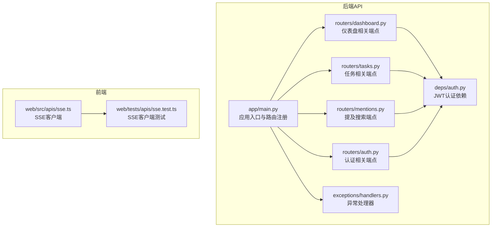
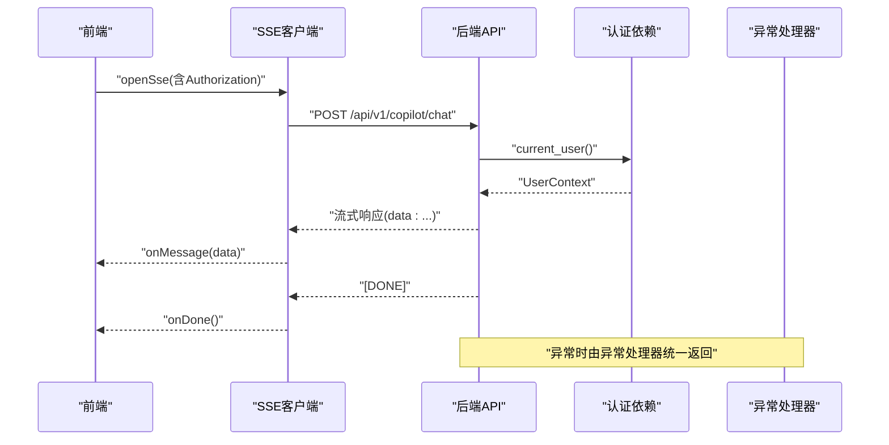
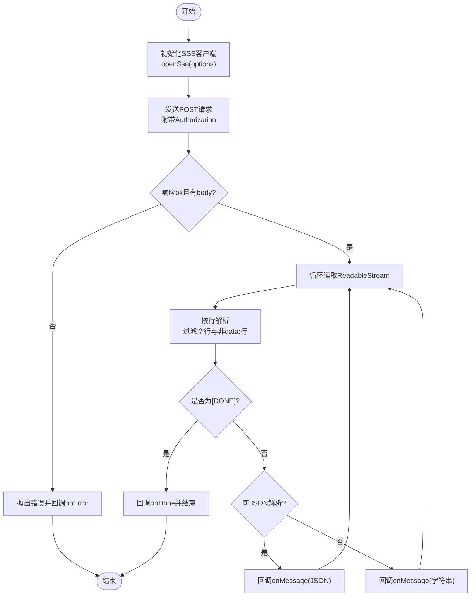
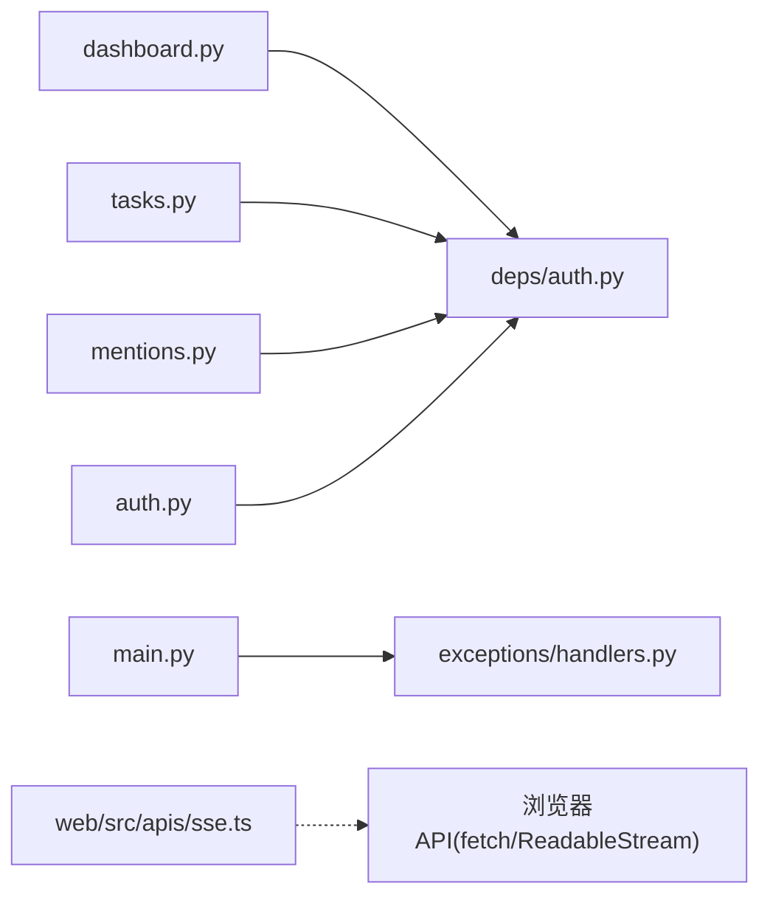

# API测试

<cite>
**本文引用的文件**
- [workspace/api/app/main.py](file://workspace/api/app/main.py)
- [workspace/api/app/routers/dashboard.py](file://workspace/api/app/routers/dashboard.py)
- [workspace/api/app/routers/tasks.py](file://workspace/api/app/routers/tasks.py)
- [workspace/api/app/routers/mentions.py](file://workspace/api/app/routers/mentions.py)
- [workspace/api/app/routers/auth.py](file://workspace/api/app/routers/auth.py)
- [workspace/api/app/deps/auth.py](file://workspace/api/app/deps/auth.py)
- [workspace/api/app/exceptions/handlers.py](file://workspace/api/app/exceptions/handlers.py)
- [workspace/api/tests/integration/test_api_endpoints.py](file://workspace/api/tests/integration/test_api_endpoints.py)
- [workspace/api/tests/services/test_auth_service.py](file://workspace/api/tests/services/test_auth_service.py)
- [workspace/web/src/apis/sse.ts](file://workspace/web/src/apis/sse.ts)
- [workspace/web/tests/apis/sse.test.ts](file://workspace/web/tests/apis/sse.test.ts)
- [docs/test-cases/01-工作台.md](file://docs/test-cases/01-工作台.md)
</cite>

## 目录
1. [引言](#引言)
2. [项目结构](#项目结构)
3. [核心组件](#核心组件)
4. [架构总览](#架构总览)
5. [详细组件分析](#详细组件分析)
6. [依赖分析](#依赖分析)
7. [性能考虑](#性能考虑)
8. [故障排查指南](#故障排查指南)
9. [结论](#结论)
10. [附录](#附录)

## 引言
本文件面向FDE工作台后端与前端的API测试，覆盖REST API端点测试、请求/响应验证与错误处理测试；Server-Sent Events（SSE）流式测试（连接、消息接收、断开与重连）；性能测试（负载、压力、并发）；以及安全测试（身份验证、授权、SQL注入防护）。文档基于仓库中的路由定义、异常处理、认证依赖与现有测试用例，提供可执行的测试策略与用例设计，并给出测试数据准备建议。

## 项目结构
后端采用FastAPI应用，通过路由模块组织各业务域API；前端通过自研SSE客户端封装fetch实现POST风格的SSE流式通信。集成测试覆盖任务、仪表盘、提及搜索等端点；单元测试覆盖认证服务；前端对SSE客户端具备基础行为验证。

图表来源
- [workspace/api/app/main.py:58-67](file://workspace/api/app/main.py#L58-L67)
- [workspace/api/app/routers/dashboard.py:21-35](file://workspace/api/app/routers/dashboard.py#L21-L35)
- [workspace/api/app/routers/tasks.py:32-69](file://workspace/api/app/routers/tasks.py#L32-L69)
- [workspace/api/app/routers/mentions.py:17-19](file://workspace/api/app/routers/mentions.py#L17-L19)
- [workspace/api/app/routers/auth.py:19-42](file://workspace/api/app/routers/auth.py#L19-L42)
- [workspace/api/app/deps/auth.py:28-58](file://workspace/api/app/deps/auth.py#L28-L58)
- [workspace/api/app/exceptions/handlers.py:31-99](file://workspace/api/app/exceptions/handlers.py#L31-L99)
- [workspace/web/src/apis/sse.ts:18-79](file://workspace/web/src/apis/sse.ts#L18-L79)
- [workspace/web/tests/apis/sse.test.ts:1-46](file://workspace/web/tests/apis/sse.test.ts#L1-L46)

章节来源
- [workspace/api/app/main.py:58-67](file://workspace/api/app/main.py#L58-L67)
- [workspace/api/app/routers/dashboard.py:21-35](file://workspace/api/app/routers/dashboard.py#L21-L35)
- [workspace/api/app/routers/tasks.py:32-69](file://workspace/api/app/routers/tasks.py#L32-L69)
- [workspace/api/app/routers/mentions.py:17-19](file://workspace/api/app/routers/mentions.py#L17-L19)
- [workspace/api/app/routers/auth.py:19-42](file://workspace/api/app/routers/auth.py#L19-L42)
- [workspace/api/app/deps/auth.py:28-58](file://workspace/api/app/deps/auth.py#L28-L58)
- [workspace/api/app/exceptions/handlers.py:31-99](file://workspace/api/app/exceptions/handlers.py#L31-L99)
- [workspace/web/src/apis/sse.ts:18-79](file://workspace/web/src/apis/sse.ts#L18-L79)
- [workspace/web/tests/apis/sse.test.ts:1-46](file://workspace/web/tests/apis/sse.test.ts#L1-L46)

## 核心组件
- 应用入口与路由注册：集中注册认证、仪表盘、任务、项目、客户、文件、教练、Copilot、提及、设置等路由，并挂载中间件与异常处理器。
- 认证依赖：基于HTTP Bearer Token解析JWT，校验用户有效性与角色权限。
- 异常处理：统一BizException/SystemException/HTTPException/ValidationException等错误响应格式，包含traceId与可选details。
- SSE客户端：基于fetch与ReadableStream实现POST风格SSE，支持消息解析、完成信号与错误回调。

章节来源
- [workspace/api/app/main.py:58-67](file://workspace/api/app/main.py#L58-L67)
- [workspace/api/app/deps/auth.py:28-58](file://workspace/api/app/deps/auth.py#L28-L58)
- [workspace/api/app/exceptions/handlers.py:31-99](file://workspace/api/app/exceptions/handlers.py#L31-L99)
- [workspace/web/src/apis/sse.ts:18-79](file://workspace/web/src/apis/sse.ts#L18-L79)

## 架构总览
后端以FastAPI为核心，路由层负责参数解析与依赖注入，服务层调用仓储层访问数据库，认证依赖负责鉴权，异常处理器统一输出错误响应。前端通过SSE客户端向后端发起POST风格SSE请求，接收流式数据并驱动UI更新。

图表来源
- [workspace/web/src/apis/sse.ts:18-79](file://workspace/web/src/apis/sse.ts#L18-L79)
- [workspace/api/app/routers/copilot.py:1-200](file://workspace/api/app/routers/copilot.py#L1-L200)
- [workspace/api/app/deps/auth.py:28-58](file://workspace/api/app/deps/auth.py#L28-L58)
- [workspace/api/app/exceptions/handlers.py:31-99](file://workspace/api/app/exceptions/handlers.py#L31-L99)

## 详细组件分析

### REST API测试策略
- 端点测试
  - 仪表盘：GET /api/v1/dashboard/summary、GET /api/v1/dashboard/recent-tasks、GET /api/v1/dashboard/key-events
  - 任务：GET /api/v1/tasks、GET /api/v1/tasks/{id}、POST /api/v1/tasks、PUT /api/v1/tasks/{id}、DELETE /api/v1/tasks/{id}、批量更新状态、批量指派、历史查询
  - 提及搜索：GET /api/v1/mentions/search
  - 认证：POST /api/v1/auth/login、POST /api/v1/auth/refresh、POST /api/v1/auth/logout、GET /api/v1/auth/me
- 请求/响应验证
  - 成功场景：返回2xx状态码，响应体包含约定字段（如code/data/traceId），数据类型与长度符合预期
  - 参数校验：422/400错误，details包含字段级错误
  - 未登录/过期：401，message包含“未登录或登录已过期”
  - 业务异常：BizException映射为指定HTTP状态与code
- 错误处理测试
  - 非法参数（如days越界）、资源不存在、权限不足等
  - 通用异常捕获：500与统一错误结构

章节来源
- [workspace/api/app/routers/dashboard.py:21-94](file://workspace/api/app/routers/dashboard.py#L21-L94)
- [workspace/api/app/routers/tasks.py:32-69](file://workspace/api/app/routers/tasks.py#L32-L69)
- [workspace/api/app/routers/mentions.py:17-19](file://workspace/api/app/routers/mentions.py#L17-L19)
- [workspace/api/app/routers/auth.py:19-42](file://workspace/api/app/routers/auth.py#L19-L42)
- [workspace/api/app/exceptions/handlers.py:31-99](file://workspace/api/app/exceptions/handlers.py#L31-L99)
- [workspace/api/tests/integration/test_api_endpoints.py:52-144](file://workspace/api/tests/integration/test_api_endpoints.py#L52-L144)
- [docs/test-cases/01-工作台.md:483-556](file://docs/test-cases/01-工作台.md#L483-L556)

### SSE流式测试
- 连接测试
  - 验证openSse返回AbortController实例，可调用abort中断
  - 验证Authorization头随请求发送
- 消息接收验证
  - data: 行解析，JSON片段与普通字符串均能正确回调onMessage
  - 收到[DONE]后触发onDone
- 断开与重连
  - 断线捕获与错误回调onError
  - 建议：在前端实现指数退避重连策略，结合心跳检测

图表来源
- [workspace/web/src/apis/sse.ts:18-79](file://workspace/web/src/apis/sse.ts#L18-L79)
- [workspace/web/tests/apis/sse.test.ts:1-46](file://workspace/web/tests/apis/sse.test.ts#L1-L46)

章节来源
- [workspace/web/src/apis/sse.ts:18-79](file://workspace/web/src/apis/sse.ts#L18-L79)
- [workspace/web/tests/apis/sse.test.ts:1-46](file://workspace/web/tests/apis/sse.test.ts#L1-L46)

### 性能测试设计
- 负载测试
  - 场景：固定并发下逐步提升RPS，观察响应时间、错误率与吞吐
  - 关注点：仪表盘聚合查询、任务列表分页、提及搜索等热点端点
- 压力测试
  - 场景：持续超过峰值的流量，观察系统降级与恢复能力
  - 关注点：数据库连接池、Redis缓存命中、异常处理器稳定性
- 并发测试
  - 场景：多用户同时进行高频操作（如频繁刷新仪表盘、批量更新任务）
  - 关注点：JWT鉴权链路、依赖注入与事务一致性

[本节为通用性能指导，无需特定文件引用]

### 安全测试
- 身份验证测试
  - 无效/缺失Authorization头：401
  - JWT过期/伪造：401或BizException
  - 未登录访问受保护端点：401
- 授权测试
  - 角色要求：require_role校验失败返回403/PermissionDeniedException
  - 用户不存在/被删除：401
- SQL注入防护测试
  - 输入参数均为模型校验与ORM查询，避免直接拼接SQL
  - 建议：对路径参数与查询参数进行白名单/范围限制（如days ge 1, le 365）

章节来源
- [workspace/api/app/deps/auth.py:28-58](file://workspace/api/app/deps/auth.py#L28-L58)
- [workspace/api/app/routers/dashboard.py:77-84](file://workspace/api/app/routers/dashboard.py#L77-L84)
- [workspace/api/app/exceptions/handlers.py:31-99](file://workspace/api/app/exceptions/handlers.py#L31-L99)

## 依赖分析
后端路由依赖认证依赖与数据库会话，异常处理器统一拦截各类异常并输出标准错误结构。前端SSE客户端依赖浏览器fetch与ReadableStream，通过localStorage读取token。

图表来源
- [workspace/api/app/routers/dashboard.py:21-35](file://workspace/api/app/routers/dashboard.py#L21-L35)
- [workspace/api/app/routers/tasks.py:32-69](file://workspace/api/app/routers/tasks.py#L32-L69)
- [workspace/api/app/routers/mentions.py:17-19](file://workspace/api/app/routers/mentions.py#L17-L19)
- [workspace/api/app/routers/auth.py:19-42](file://workspace/api/app/routers/auth.py#L19-L42)
- [workspace/api/app/deps/auth.py:28-58](file://workspace/api/app/deps/auth.py#L28-L58)
- [workspace/api/app/exceptions/handlers.py:31-99](file://workspace/api/app/exceptions/handlers.py#L31-L99)
- [workspace/web/src/apis/sse.ts:18-79](file://workspace/web/src/apis/sse.ts#L18-L79)

章节来源
- [workspace/api/app/main.py:58-67](file://workspace/api/app/main.py#L58-L67)
- [workspace/api/app/deps/auth.py:28-58](file://workspace/api/app/deps/auth.py#L28-L58)
- [workspace/api/app/exceptions/handlers.py:31-99](file://workspace/api/app/exceptions/handlers.py#L31-L99)
- [workspace/web/src/apis/sse.ts:18-79](file://workspace/web/src/apis/sse.ts#L18-L79)

## 性能考虑
- 连接与会话
  - 控制并发连接数，避免数据库/Redis连接池耗尽
  - 合理设置超时与重试策略
- 缓存与索引
  - 对高频查询（如仪表盘统计）引入缓存与预计算
  - 确保查询字段建立必要索引
- 日志与追踪
  - traceId贯穿请求链路，便于定位性能瓶颈
- 前端体验
  - SSE断线重连与节流，避免过多UI重绘

[本节为通用性能指导，无需特定文件引用]

## 故障排查指南
- 401未登录/过期
  - 检查Authorization头是否携带Bearer Token
  - 刷新令牌流程：POST /api/v1/auth/refresh
- 422参数校验失败
  - 校验请求体字段类型、长度与枚举值
- 业务异常
  - BizException包含code/message/details，结合traceId定位
- SSE异常
  - 检查网络与跨域配置，确保后端允许前端Origin
  - 确认Authorization头随请求发送

章节来源
- [workspace/api/app/exceptions/handlers.py:31-99](file://workspace/api/app/exceptions/handlers.py#L31-L99)
- [workspace/api/app/routers/auth.py:25-29](file://workspace/api/app/routers/auth.py#L25-L29)
- [workspace/web/src/apis/sse.ts:24-32](file://workspace/web/src/apis/sse.ts#L24-L32)

## 结论
本文基于现有路由、认证与异常处理机制，给出了REST API与SSE的测试策略、用例设计与数据准备建议，并补充了性能与安全测试要点。建议在CI中集成端到端测试与SSE行为验证，持续监控关键指标与错误率，保障工作台API的稳定性与安全性。

## 附录

### 测试用例设计与数据准备（示例）
- 仪表盘
  - TC-DASH-I-001：GET /api/v1/dashboard/summary 返回200，包含taskCount/projectCount/customerCount/pendingTasks
  - TC-DASH-I-002：GET /api/v1/dashboard/recent-tasks 默认limit=10，可传limit=5
  - TC-DASH-I-003：未登录访问返回401
  - TC-DASH-I-004：GET /api/v1/dashboard/key-events days边界：7/0/-1/365/366
- 任务
  - TC-INT-TASK-LIST-001：GET /api/v1/tasks 返回分页列表
  - TC-INT-TASK-CREATE-001：POST /api/v1/tasks 有效数据返回200/201；缺少必填返回400/422
  - TC-INT-TASK-UPDATE-001：PUT /api/v1/tasks/{id} 更新状态返回200
- 提及搜索
  - TC-INT-MENTION-001：GET /api/v1/mentions/search?q=test 返回200
- 认证
  - TC-AUTH-S-001：登录成功返回access_token/refresh_token
  - TC-AUTH-S-002：注册邮箱为空抛出异常
  - TC-AUTH-S-003：刷新令牌成功/失败
- SSE
  - TC-SSE-001：SSEClient实例化与初始断开状态
  - TC-SSE-002：openSse返回AbortController并可中断

章节来源
- [docs/test-cases/01-工作台.md:483-556](file://docs/test-cases/01-工作台.md#L483-L556)
- [workspace/api/tests/integration/test_api_endpoints.py:52-144](file://workspace/api/tests/integration/test_api_endpoints.py#L52-L144)
- [workspace/api/tests/services/test_auth_service.py:10-129](file://workspace/api/tests/services/test_auth_service.py#L10-L129)
- [workspace/web/tests/apis/sse.test.ts:1-46](file://workspace/web/tests/apis/sse.test.ts#L1-L46)