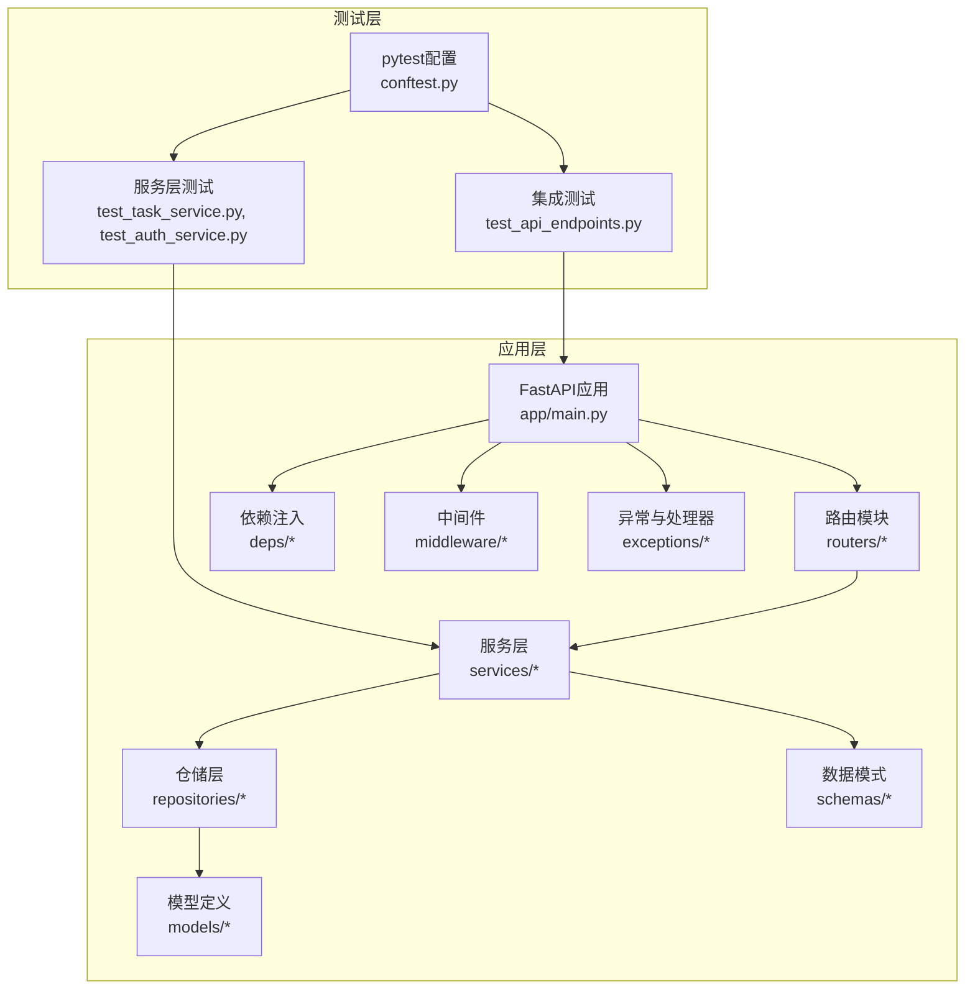
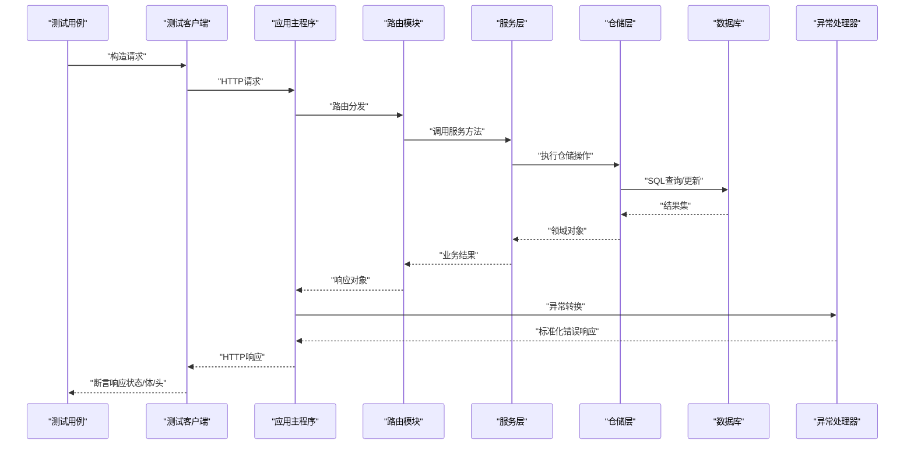
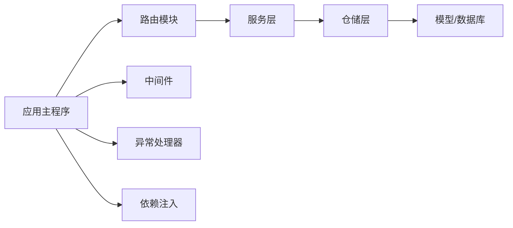

# REST API测试

<cite>
**本文引用的文件**
- [workspace/api/tests/conftest.py](file://workspace/api/tests/conftest.py)
- [workspace/api/tests/integration/conftest.py](file://workspace/api/tests/integration/conftest.py)
- [workspace/api/tests/integration/test_api_endpoints.py](file://workspace/api/tests/integration/test_api_endpoints.py)
- [workspace/api/tests/services/test_task_service.py](file://workspace/api/tests/services/test_task_service.py)
- [workspace/api/tests/services/test_auth_service.py](file://workspace/api/tests/services/test_auth_service.py)
- [workspace/api/app/main.py](file://workspace/api/app/main.py)
- [workspace/api/app/routers/tasks.py](file://workspace/api/app/routers/tasks.py)
- [workspace/api/app/routers/dashboard.py](file://workspace/api/app/routers/dashboard.py)
- [workspace/api/app/routers/mentions.py](file://workspace/api/app/routers/mentions.py)
- [workspace/api/app/schemas/task.py](file://workspace/api/app/schemas/task.py)
- [workspace/api/app/schemas/common.py](file://workspace/api/app/schemas/common.py)
- [workspace/api/app/repositories/task_repo.py](file://workspace/api/app/repositories/task_repo.py)
- [workspace/api/app/services/task_service.py](file://workspace/api/app/services/task_service.py)
- [workspace/api/app/services/auth_service.py](file://workspace/api/app/services/auth_service.py)
- [workspace/api/app/deps/__init__.py](file://workspace/api/app/deps/__init__.py)
- [workspace/api/app/middleware/cors.py](file://workspace/api/app/middleware/cors.py)
- [workspace/api/app/middleware/logging.py](file://workspace/api/app/middleware/logging.py)
- [workspace/api/app/middleware/tenant.py](file://workspace/api/app/middleware/tenant.py)
- [workspace/api/app/middleware/trace.py](file://workspace/api/app/middleware/trace.py)
- [workspace/api/app/exceptions/biz.py](file://workspace/api/app/exceptions/biz.py)
- [workspace/api/app/exceptions/codes.py](file://workspace/api/app/exceptions/codes.py)
- [workspace/api/app/exceptions/handlers.py](file://workspace/api/app/exceptions/handlers.py)
- [workspace/api/app/models/task.py](file://workspace/api/app/models/task.py)
- [workspace/api/app/models/base.py](file://workspace/api/app/models/base.py)
- [workspace/api/app/utils/crypto.py](file://workspace/api/app/utils/crypto.py)
- [workspace/api/app/utils/id_gen.py](file://workspace/api/app/utils/id_gen.py)
- [workspace/api/app/utils/time.py](file://workspace/api/app/utils/time.py)
- [workspace/api/pyproject.toml](file://workspace/api/pyproject.toml)
- [workspace/api/alembic/versions/001_initial.py](file://workspace/api/alembic/versions/001_initial.py)
- [workspace/api/alembic/env.py](file://workspace/api/alembic/env.py)
- [workspace/api/scripts/init_admin.py](file://workspace/api/scripts/init_admin.py)
- [workspace/api/scripts/seed_test_data.py](file://workspace/api/scripts/seed_test_data.py)
- [workspace/web/src/apis/modules/tasks.ts](file://workspace/web/src/apis/modules/tasks.ts)
- [workspace/web/src/apis/modules/dashboard.ts](file://workspace/web/src/apis/modules/dashboard.ts)
- [workspace/web/src/apis/modules/mentions.ts](file://workspace/web/src/apis/modules/mentions.ts)
- [workspace/web/src/apis/http.ts](file://workspace/web/src/apis/http.ts)
- [workspace/web/src/stores/tasks.ts](file://workspace/web/src/stores/tasks.ts)
- [workspace/web/src/stores/projects.ts](file://workspace/web/src/stores/projects.ts)
- [workspace/docs/test-cases/README.md](file://workspace/docs/test-cases/README.md)
- [workspace/docs/test-cases/01-工作台.md](file://workspace/docs/test-cases/01-工作台.md)
- [workspace/docs/test-cases/P0-冒烟测试报告.md](file://workspace/docs/test-cases/P0-冒烟测试报告.md)
</cite>

## 目录
1. [简介](#简介)
2. [项目结构](#项目结构)
3. [核心组件](#核心组件)
4. [架构总览](#架构总览)
5. [详细组件分析](#详细组件分析)
6. [依赖分析](#依赖分析)
7. [性能考虑](#性能考虑)
8. [故障排查指南](#故障排查指南)
9. [结论](#结论)
10. [附录](#附录)

## 简介
本测试文档面向FDE工作台后端REST API，系统性梳理端到端测试策略与实现要点，覆盖以下关键目标：
- 端点测试策略：针对GET、POST、PUT、DELETE等HTTP方法，设计请求参数校验、响应数据结构校验与状态码测试的完整用例矩阵。
- 集成测试：在依赖注入与模拟对象（Mock）层面，重点说明数据库会话模拟、认证上下文模拟与外部服务模拟的实践方式。
- 典型端点测试实现：任务列表获取、任务创建、任务更新、仪表板汇总、提及搜索等。
- 错误场景测试：缺失必填字段、无效数据格式、权限不足等常见异常路径。

## 项目结构
后端采用FastAPI应用，测试分为两类：
- 服务层单元测试：位于workspace/api/tests/services/，用于验证业务逻辑与服务层封装。
- 集成测试：位于workspace/api/tests/integration/，用于验证路由、中间件、异常处理与端到端流程。

图表来源
- [workspace/api/tests/integration/test_api_endpoints.py](file://workspace/api/tests/integration/test_api_endpoints.py)
- [workspace/api/tests/services/test_task_service.py](file://workspace/api/tests/services/test_task_service.py)
- [workspace/api/app/main.py](file://workspace/api/app/main.py)
- [workspace/api/app/routers/tasks.py](file://workspace/api/app/routers/tasks.py)
- [workspace/api/app/services/task_service.py](file://workspace/api/app/services/task_service.py)
- [workspace/api/app/repositories/task_repo.py](file://workspace/api/app/repositories/task_repo.py)
- [workspace/api/app/models/task.py](file://workspace/api/app/models/task.py)
- [workspace/api/app/schemas/task.py](file://workspace/api/app/schemas/task.py)
- [workspace/api/app/deps/__init__.py](file://workspace/api/app/deps/__init__.py)
- [workspace/api/app/middleware/cors.py](file://workspace/api/app/middleware/cors.py)
- [workspace/api/app/middleware/logging.py](file://workspace/api/app/middleware/logging.py)
- [workspace/api/app/middleware/tenant.py](file://workspace/api/app/middleware/tenant.py)
- [workspace/api/app/middleware/trace.py](file://workspace/api/app/middleware/trace.py)
- [workspace/api/app/exceptions/biz.py](file://workspace/api/app/exceptions/biz.py)
- [workspace/api/app/exceptions/codes.py](file://workspace/api/app/exceptions/codes.py)
- [workspace/api/app/exceptions/handlers.py](file://workspace/api/app/exceptions/handlers.py)

章节来源
- [workspace/api/tests/conftest.py](file://workspace/api/tests/conftest.py)
- [workspace/api/tests/integration/conftest.py](file://workspace/api/tests/integration/conftest.py)
- [workspace/api/app/main.py](file://workspace/api/app/main.py)

## 核心组件
- 测试框架与配置
  - pytest配置与fixture：通过conftest.py统一管理数据库会话、测试客户端、认证上下文与外部服务模拟。
  - 集成测试入口：test_api_endpoints.py组织端点级测试用例，覆盖路由、中间件与异常处理。
  - 服务层测试：test_task_service.py与test_auth_service.py验证业务逻辑与服务封装。
- 路由与端点
  - 任务相关：tasks.py提供任务列表、创建、更新等端点。
  - 仪表板：dashboard.py提供汇总统计端点。
  - 提及搜索：mentions.py提供提及检索端点。
- 数据模型与模式
  - 模型定义：models/task.py定义任务实体。
  - 数据模式：schemas/task.py定义任务请求/响应模式；schemas/common.py定义通用分页/返回结构。
- 仓储与服务
  - 仓储：repositories/task_repo.py封装数据库操作。
  - 服务：services/task_service.py与services/auth_service.py封装业务规则与事务控制。
- 中间件与异常
  - 中间件：CORS、日志、租户隔离、链路追踪。
  - 异常：biz.py定义业务异常，codes.py定义错误码，handlers.py统一异常处理。

章节来源
- [workspace/api/tests/conftest.py](file://workspace/api/tests/conftest.py)
- [workspace/api/tests/integration/conftest.py](file://workspace/api/tests/integration/conftest.py)
- [workspace/api/tests/integration/test_api_endpoints.py](file://workspace/api/tests/integration/test_api_endpoints.py)
- [workspace/api/tests/services/test_task_service.py](file://workspace/api/tests/services/test_task_service.py)
- [workspace/api/tests/services/test_auth_service.py](file://workspace/api/tests/services/test_auth_service.py)
- [workspace/api/app/routers/tasks.py](file://workspace/api/app/routers/tasks.py)
- [workspace/api/app/routers/dashboard.py](file://workspace/api/app/routers/dashboard.py)
- [workspace/api/app/routers/mentions.py](file://workspace/api/app/routers/mentions.py)
- [workspace/api/app/schemas/task.py](file://workspace/api/app/schemas/task.py)
- [workspace/api/app/schemas/common.py](file://workspace/api/app/schemas/common.py)
- [workspace/api/app/repositories/task_repo.py](file://workspace/api/app/repositories/task_repo.py)
- [workspace/api/app/services/task_service.py](file://workspace/api/app/services/task_service.py)
- [workspace/api/app/services/auth_service.py](file://workspace/api/app/services/auth_service.py)
- [workspace/api/app/models/task.py](file://workspace/api/app/models/task.py)
- [workspace/api/app/exceptions/biz.py](file://workspace/api/app/exceptions/biz.py)
- [workspace/api/app/exceptions/codes.py](file://workspace/api/app/exceptions/codes.py)
- [workspace/api/app/exceptions/handlers.py](file://workspace/api/app/exceptions/handlers.py)

## 架构总览
下图展示从测试到应用的调用链与依赖关系，突出集成测试中依赖注入与模拟对象的使用位置。

图表来源
- [workspace/api/tests/integration/test_api_endpoints.py](file://workspace/api/tests/integration/test_api_endpoints.py)
- [workspace/api/app/main.py](file://workspace/api/app/main.py)
- [workspace/api/app/routers/tasks.py](file://workspace/api/app/routers/tasks.py)
- [workspace/api/app/services/task_service.py](file://workspace/api/app/services/task_service.py)
- [workspace/api/app/repositories/task_repo.py](file://workspace/api/app/repositories/task_repo.py)
- [workspace/api/app/exceptions/handlers.py](file://workspace/api/app/exceptions/handlers.py)

## 详细组件分析

### 端点测试策略与用例设计
- GET类端点
  - 任务列表：校验分页参数、过滤条件、排序字段；断言响应结构符合通用分页模式；验证空数据与边界值。
  - 仪表板汇总：校验聚合字段完整性与类型；断言时间范围与租户维度正确性。
  - 提及搜索：校验关键词、范围与返回条目数量；断言去重与排序规则。
- POST类端点
  - 任务创建：校验必填字段、格式约束与业务规则；断言创建成功后的状态与关联资源；验证重复提交与幂等性。
- PUT类端点
  - 任务更新：校验字段更新范围、权限校验与并发控制；断言版本号/乐观锁机制；验证部分更新与全量更新差异。
- DELETE类端点
  - 任务删除：校验软删除/硬删除策略；断言级联清理与审计字段；验证权限不足与资源不存在场景。
- 状态码与响应结构
  - 成功：2xx状态码；响应体符合schemas/common.py定义的通用结构。
  - 参数错误：422状态码；断言字段级错误信息。
  - 权限错误：401/403状态码；断言未认证或无权限提示。
  - 业务错误：400状态码；断言错误码与消息。
  - 服务器错误：500状态码；断言错误兜底与日志记录。

章节来源
- [workspace/api/tests/integration/test_api_endpoints.py](file://workspace/api/tests/integration/test_api_endpoints.py)
- [workspace/api/app/schemas/common.py](file://workspace/api/app/schemas/common.py)

### 依赖注入与模拟对象
- 数据库会话模拟
  - 使用pytest fixture在conftest.py中创建临时数据库会话；在测试中替换真实会话以支持事务回滚与隔离。
- 认证上下文模拟
  - 在fixture中注入用户身份、租户ID与权限集合；确保路由与服务层的鉴权逻辑可被独立验证。
- 外部服务模拟
  - 对接钉钉、CRM、OSS等外部客户端进行Mock，避免真实网络调用；在服务层通过依赖注入切换至Mock实现。
- 中间件行为验证
  - CORS、日志、租户隔离与链路追踪中间件在集成测试中一并验证，确保端到端一致性。

章节来源
- [workspace/api/tests/conftest.py](file://workspace/api/tests/conftest.py)
- [workspace/api/tests/integration/conftest.py](file://workspace/api/tests/integration/conftest.py)
- [workspace/api/app/deps/__init__.py](file://workspace/api/app/deps/__init__.py)
- [workspace/api/app/middleware/cors.py](file://workspace/api/app/middleware/cors.py)
- [workspace/api/app/middleware/logging.py](file://workspace/api/app/middleware/logging.py)
- [workspace/api/app/middleware/tenant.py](file://workspace/api/app/middleware/tenant.py)
- [workspace/api/app/middleware/trace.py](file://workspace/api/app/middleware/trace.py)

### 典型端点测试实现

#### 任务列表获取
- 测试要点
  - 分页参数：页码、每页大小、排序字段与方向。
  - 过滤条件：状态、负责人、项目ID等。
  - 响应结构：断言列表项字段与总数。
- 断言清单
  - HTTP状态码为2xx。
  - 响应体包含分页字段与数据数组。
  - 数组元素满足任务模式定义。
- 参考实现路径
  - [workspace/api/tests/integration/test_api_endpoints.py](file://workspace/api/tests/integration/test_api_endpoints.py)
  - [workspace/api/app/routers/tasks.py](file://workspace/api/app/routers/tasks.py)
  - [workspace/api/app/schemas/task.py](file://workspace/api/app/schemas/task.py)

章节来源
- [workspace/api/tests/integration/test_api_endpoints.py](file://workspace/api/tests/integration/test_api_endpoints.py)
- [workspace/api/app/routers/tasks.py](file://workspace/api/app/routers/tasks.py)
- [workspace/api/app/schemas/task.py](file://workspace/api/app/schemas/task.py)

#### 任务创建
- 测试要点
  - 必填字段校验：标题、项目ID、负责人等。
  - 格式校验：日期、数值范围、枚举值。
  - 业务规则：唯一性、依赖关系、状态机。
- 断言清单
  - 成功时返回201 Created，响应体包含创建后的任务完整信息。
  - 参数错误返回422，字段级错误明确。
  - 权限不足返回403。
- 参考实现路径
  - [workspace/api/tests/integration/test_api_endpoints.py](file://workspace/api/tests/integration/test_api_endpoints.py)
  - [workspace/api/app/routers/tasks.py](file://workspace/api/app/routers/tasks.py)
  - [workspace/api/app/services/task_service.py](file://workspace/api/app/services/task_service.py)
  - [workspace/api/app/repositories/task_repo.py](file://workspace/api/app/repositories/task_repo.py)

章节来源
- [workspace/api/tests/integration/test_api_endpoints.py](file://workspace/api/tests/integration/test_api_endpoints.py)
- [workspace/api/app/routers/tasks.py](file://workspace/api/app/routers/tasks.py)
- [workspace/api/app/services/task_service.py](file://workspace/api/app/services/task_service.py)
- [workspace/api/app/repositories/task_repo.py](file://workspace/api/app/repositories/task_repo.py)

#### 任务更新
- 测试要点
  - 字段白名单：仅允许更新允许的字段。
  - 并发控制：版本号/乐观锁校验。
  - 权限校验：负责人变更、状态推进等敏感操作。
- 断言清单
  - 成功时返回200，响应体为更新后的任务。
  - 版本冲突返回409。
  - 权限不足返回403。
- 参考实现路径
  - [workspace/api/tests/integration/test_api_endpoints.py](file://workspace/api/tests/integration/test_api_endpoints.py)
  - [workspace/api/app/routers/tasks.py](file://workspace/api/app/routers/tasks.py)
  - [workspace/api/app/services/task_service.py](file://workspace/api/app/services/task_service.py)

章节来源
- [workspace/api/tests/integration/test_api_endpoints.py](file://workspace/api/tests/integration/test_api_endpoints.py)
- [workspace/api/app/routers/tasks.py](file://workspace/api/app/routers/tasks.py)
- [workspace/api/app/services/task_service.py](file://workspace/api/app/services/task_service.py)

#### 仪表板汇总
- 测试要点
  - 聚合字段：完成率、逾期数、待处理数等。
  - 时间维度：按日/周/月聚合。
  - 租户隔离：多租户数据隔离与聚合。
- 断言清单
  - 返回200，响应体字段齐全且类型正确。
  - 边界值：空数据、极端值、零值。
- 参考实现路径
  - [workspace/api/tests/integration/test_api_endpoints.py](file://workspace/api/tests/integration/test_api_endpoints.py)
  - [workspace/api/app/routers/dashboard.py](file://workspace/api/app/routers/dashboard.py)

章节来源
- [workspace/api/tests/integration/test_api_endpoints.py](file://workspace/api/tests/integration/test_api_endpoints.py)
- [workspace/api/app/routers/dashboard.py](file://workspace/api/app/routers/dashboard.py)

#### 提及搜索
- 测试要点
  - 关键词匹配：模糊匹配、前缀匹配、正则限制。
  - 结果排序：权重、时间、相关度。
  - 去重与上限：避免重复、限制返回条数。
- 断言清单
  - 返回200，数组元素满足提及模式。
  - 空关键词返回空数组。
- 参考实现路径
  - [workspace/api/tests/integration/test_api_endpoints.py](file://workspace/api/tests/integration/test_api_endpoints.py)
  - [workspace/api/app/routers/mentions.py](file://workspace/api/app/routers/mentions.py)

章节来源
- [workspace/api/tests/integration/test_api_endpoints.py](file://workspace/api/tests/integration/test_api_endpoints.py)
- [workspace/api/app/routers/mentions.py](file://workspace/api/app/routers/mentions.py)

### 错误场景测试
- 缺失必填字段
  - 触发422状态码；断言字段级错误信息与定位。
- 无效数据格式
  - 日期格式、数值范围、枚举值非法；断言错误码与消息。
- 权限不足
  - 未登录返回401；无角色/权限返回403。
- 业务异常
  - 重复创建、状态不可逆、资源不存在；断言400与具体错误码。
- 服务器异常
  - 数据库连接失败、外部服务超时；断言500与错误兜底。

章节来源
- [workspace/api/tests/integration/test_api_endpoints.py](file://workspace/api/tests/integration/test_api_endpoints.py)
- [workspace/api/app/exceptions/biz.py](file://workspace/api/app/exceptions/biz.py)
- [workspace/api/app/exceptions/codes.py](file://workspace/api/app/exceptions/codes.py)
- [workspace/api/app/exceptions/handlers.py](file://workspace/api/app/exceptions/handlers.py)

## 依赖分析
- 组件耦合
  - 路由依赖服务层；服务层依赖仓储层；仓储层依赖模型与数据库。
  - 中间件横切关注点，贯穿请求/响应生命周期。
  - 异常处理器统一转换业务异常与系统异常。
- 依赖注入
  - 通过deps/__init__.py集中管理数据库会话、外部客户端实例与认证上下文。
- 测试依赖
  - 集成测试通过conftest.py注入测试客户端与Mock对象；服务层测试通过参数化与Mock验证分支逻辑。

图表来源
- [workspace/api/app/main.py](file://workspace/api/app/main.py)
- [workspace/api/app/routers/tasks.py](file://workspace/api/app/routers/tasks.py)
- [workspace/api/app/services/task_service.py](file://workspace/api/app/services/task_service.py)
- [workspace/api/app/repositories/task_repo.py](file://workspace/api/app/repositories/task_repo.py)
- [workspace/api/app/models/task.py](file://workspace/api/app/models/task.py)
- [workspace/api/app/deps/__init__.py](file://workspace/api/app/deps/__init__.py)
- [workspace/api/app/middleware/cors.py](file://workspace/api/app/middleware/cors.py)
- [workspace/api/app/middleware/logging.py](file://workspace/api/app/middleware/logging.py)
- [workspace/api/app/middleware/tenant.py](file://workspace/api/app/middleware/tenant.py)
- [workspace/api/app/middleware/trace.py](file://workspace/api/app/middleware/trace.py)
- [workspace/api/app/exceptions/handlers.py](file://workspace/api/app/exceptions/handlers.py)

章节来源
- [workspace/api/app/main.py](file://workspace/api/app/main.py)
- [workspace/api/app/deps/__init__.py](file://workspace/api/app/deps/__init__.py)

## 性能考虑
- 测试数据库与事务
  - 使用事务回滚减少写操作开销；批量插入与索引优化提升测试效率。
- Mock策略
  - 外部服务Mock减少网络延迟；对高频调用的接口进行缓存或Stub。
- 并发与隔离
  - 多线程测试时注意数据库连接池与租户隔离；避免竞态条件。
- 资源清理
  - 测试结束后清理临时数据与会话，防止内存泄漏与数据污染。

## 故障排查指南
- 常见问题定位
  - 请求参数错误：检查schemas定义与请求体；关注422错误详情。
  - 权限问题：核对认证上下文与路由装饰器；确认租户隔离逻辑。
  - 业务异常：查看异常处理器映射与错误码；比对biz.py与codes.py。
- 日志与追踪
  - 启用中间件日志与链路追踪，结合测试客户端响应头定位问题。
- 数据一致性
  - 集成测试中使用事务回滚与隔离；服务层测试通过Mock确保确定性。

章节来源
- [workspace/api/app/exceptions/handlers.py](file://workspace/api/app/exceptions/handlers.py)
- [workspace/api/app/middleware/logging.py](file://workspace/api/app/middleware/logging.py)
- [workspace/api/app/middleware/trace.py](file://workspace/api/app/middleware/trace.py)

## 结论
本测试文档提供了FDE工作台REST API的系统化测试策略与实现参考，涵盖端点测试、依赖注入与模拟对象、典型场景与错误场景。建议在持续集成中运行冒烟测试与回归测试，并结合前端API模块与Store进行端到端联动验证。

## 附录
- 测试用例参考
  - 工作台测试用例总览与分类：README与01-工作台.md。
  - 冒烟测试报告模板与流程：P0-冒烟测试报告.md。
- 前端对接
  - 任务、仪表板、提及等API模块与HTTP封装：web/src/apis/modules/* 与 http.ts。
  - Store层数据流与状态管理：web/src/stores/tasks.ts、projects.ts。

章节来源
- [workspace/docs/test-cases/README.md](file://workspace/docs/test-cases/README.md)
- [workspace/docs/test-cases/01-工作台.md](file://workspace/docs/test-cases/01-工作台.md)
- [workspace/docs/test-cases/P0-冒烟测试报告.md](file://workspace/docs/test-cases/P0-冒烟测试报告.md)
- [workspace/web/src/apis/modules/tasks.ts](file://workspace/web/src/apis/modules/tasks.ts)
- [workspace/web/src/apis/modules/dashboard.ts](file://workspace/web/src/apis/modules/dashboard.ts)
- [workspace/web/src/apis/modules/mentions.ts](file://workspace/web/src/apis/modules/mentions.ts)
- [workspace/web/src/apis/http.ts](file://workspace/web/src/apis/http.ts)
- [workspace/web/src/stores/tasks.ts](file://workspace/web/src/stores/tasks.ts)
- [workspace/web/src/stores/projects.ts](file://workspace/web/src/stores/projects.ts)