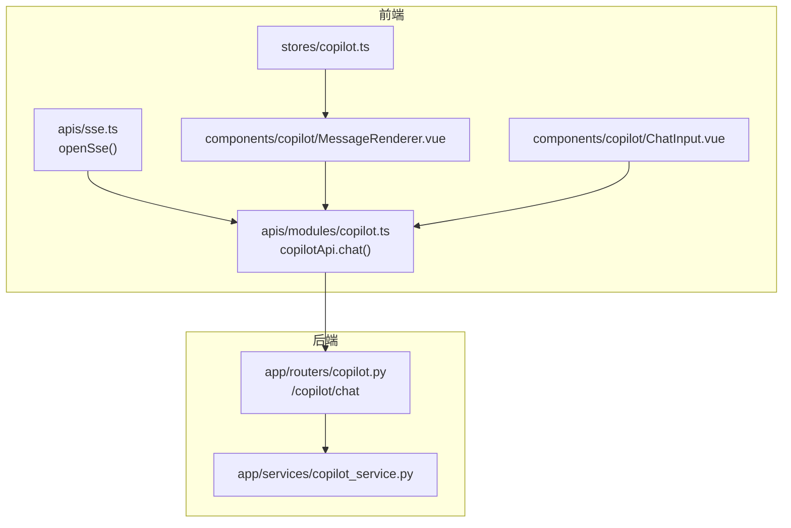
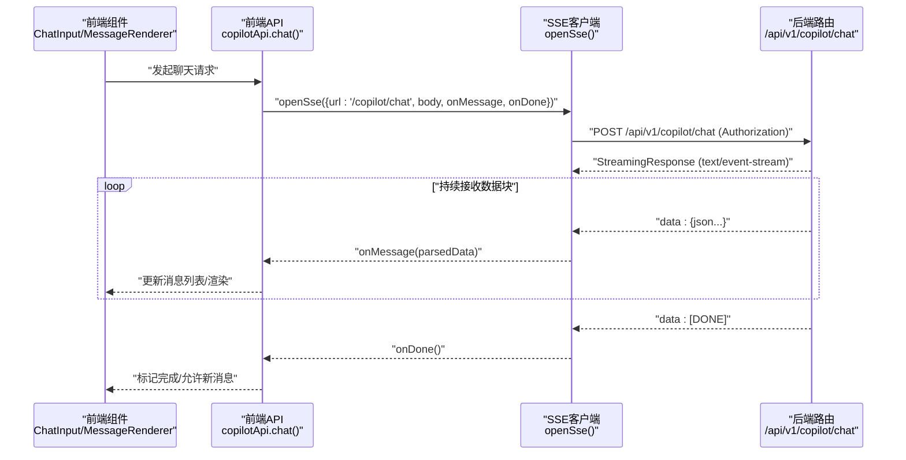
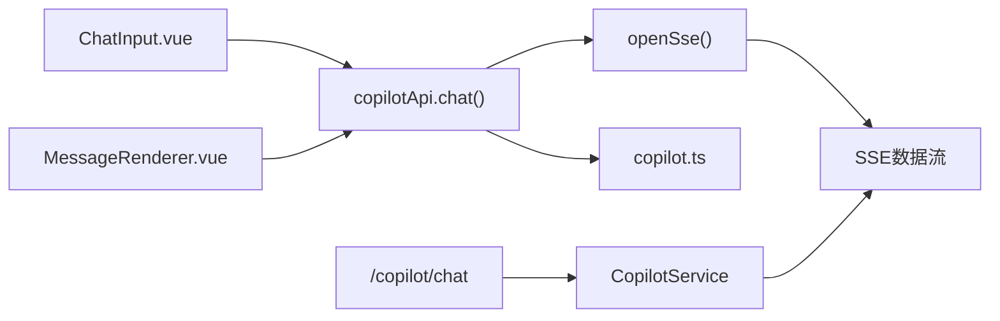

# SSE流式测试

<cite>
**本文引用的文件**
- [workspace/web/src/apis/sse.ts](file://workspace/web/src/apis/sse.ts)
- [workspace/web/tests/apis/sse.test.ts](file://workspace/web/tests/apis/sse.test.ts)
- [workspace/web/src/apis/modules/copilot.ts](file://workspace/web/src/apis/modules/copilot.ts)
- [workspace/web/tests/components/copilot.test.ts](file://workspace/web/tests/components/copilot.test.ts)
- [workspace/web/src/components/copilot/MessageRenderer.vue](file://workspace/web/src/components/copilot/MessageRenderer.vue)
- [workspace/web/src/components/copilot/ChatInput.vue](file://workspace/web/src/components/copilot/ChatInput.vue)
- [workspace/web/src/components/copilot/cards/ActionCard.vue](file://workspace/web/src/components/copilot/cards/ActionCard.vue)
- [workspace/web/src/stores/copilot.ts](file://workspace/web/src/stores/copilot.ts)
- [workspace/web/tests/stores/copilot.test.ts](file://workspace/web/tests/stores/copilot.test.ts)
- [workspace/api/app/routers/copilot.py](file://workspace/api/app/routers/copilot.py)
- [workspace/api/app/services/copilot_service.py](file://workspace/api/app/services/copilot_service.py)
- [workspace/api/app/schemas/copilot.py](file://workspace/api/app/schemas/copilot.py)
- [docs/FDE工作台技术方案.md](file://docs/FDE工作台技术方案.md)
- [docs/detail-design/01-前端详细设计.md](file://docs/detail-design/01-前端详细设计.md)
</cite>

## 目录
1. [简介](#简介)
2. [项目结构](#项目结构)
3. [核心组件](#核心组件)
4. [架构概览](#架构概览)
5. [详细组件分析](#详细组件分析)
6. [依赖关系分析](#依赖关系分析)
7. [性能考虑](#性能考虑)
8. [故障排查指南](#故障排查指南)
9. [结论](#结论)
10. [附录](#附录)

## 简介
本测试文档聚焦于FDE工作台的Server-Sent Events（SSE）流式通信，覆盖从后端流式接口到前端SSE客户端的完整链路。文档详细说明了连接建立、心跳检测与断开重连机制的测试策略，消息接收验证（格式、事件类型、完整性），以及Copilot聊天消息流、实时通知推送和状态更新流的测试方法。同时提供可操作的测试用例设计，涵盖聊天消息发送接收、错误处理与网络中断恢复等场景，并包含前端SSE客户端测试，验证消息渲染、滚动行为与用户交互响应。

## 项目结构
围绕SSE的关键文件分布如下：
- 前端SSE客户端与API封装：workspace/web/src/apis/sse.ts、workspace/web/src/apis/modules/copilot.ts
- 前端组件与Store：workspace/web/src/components/copilot/*、workspace/web/src/stores/copilot.ts
- 后端SSE路由与服务：workspace/api/app/routers/copilot.py、workspace/api/app/services/copilot_service.py
- 技术方案与设计文档：docs/FDE工作台技术方案.md、docs/detail-design/01-前端详细设计.md
- 单元测试：workspace/web/tests/apis/sse.test.ts、workspace/web/tests/components/copilot.test.ts、workspace/web/tests/stores/copilot.test.ts

图表来源
- [workspace/web/src/apis/sse.ts:18-79](file://workspace/web/src/apis/sse.ts#L18-L79)
- [workspace/web/src/apis/modules/copilot.ts:12-20](file://workspace/web/src/apis/modules/copilot.ts#L12-L20)
- [workspace/api/app/routers/copilot.py:892-908](file://workspace/api/app/routers/copilot.py#L892-L908)

章节来源
- [workspace/web/src/apis/sse.ts:1-79](file://workspace/web/src/apis/sse.ts#L1-L79)
- [workspace/web/src/apis/modules/copilot.ts:1-40](file://workspace/web/src/apis/modules/copilot.ts#L1-L40)
- [workspace/api/app/routers/copilot.py:892-908](file://workspace/api/app/routers/copilot.py#L892-L908)

## 核心组件
- SSE客户端（openSse）：基于fetch + ReadableStream实现POST型SSE，解析data:行，支持JSON解析失败回退为原始字符串，识别[DONE]终止信号，返回AbortController用于中断流。
- Copilot API封装：在openSse之上提供chat接口，统一URL前缀与请求体，便于上层组件直接调用。
- 前端组件与Store：MessageRenderer负责不同类型消息的渲染（文本、动作卡片等），ChatInput负责输入与快捷键触发，Store管理会话与消息状态。
- 后端SSE路由：/api/v1/copilot/chat返回text/event-stream，逐块输出JSON或结构化数据，并在结束时输出[DONE]。

章节来源
- [workspace/web/src/apis/sse.ts:18-79](file://workspace/web/src/apis/sse.ts#L18-L79)
- [workspace/web/src/apis/modules/copilot.ts:12-20](file://workspace/web/src/apis/modules/copilot.ts#L12-L20)
- [workspace/web/src/components/copilot/MessageRenderer.vue](file://workspace/web/src/components/copilot/MessageRenderer.vue)
- [workspace/web/src/components/copilot/ChatInput.vue](file://workspace/web/src/components/copilot/ChatInput.vue)
- [workspace/web/src/stores/copilot.ts](file://workspace/web/src/stores/copilot.ts)
- [workspace/api/app/routers/copilot.py:892-908](file://workspace/api/app/routers/copilot.py#L892-L908)

## 架构概览
SSE从后端到前端的端到端流程如下：

图表来源
- [workspace/web/src/apis/modules/copilot.ts:12-20](file://workspace/web/src/apis/modules/copilot.ts#L12-L20)
- [workspace/web/src/apis/sse.ts:18-79](file://workspace/web/src/apis/sse.ts#L18-L79)
- [workspace/api/app/routers/copilot.py:892-908](file://workspace/api/app/routers/copilot.py#L892-L908)

## 详细组件分析

### SSE客户端（openSse）测试策略
- 连接建立
  - 验证返回AbortController实例，确保调用方可中断流。
  - 验证Authorization头携带方式（localStorage中的access_token）。
  - 验证URL前缀拼接（/api/v1）与POST方法。
- 心跳检测
  - 后端未定义独立心跳事件类型，前端通过持续接收data行判断连接健康。
  - 若长时间无数据，结合onError回调与上层重试逻辑进行判定。
- 断开重连
  - 使用AbortController中断旧流，重新调用openSse建立新连接。
  - onDone触发后，建议延迟重试并指数退避，避免频繁重连。
- 消息接收验证
  - data行解析：优先尝试JSON.parse，失败则回退为原始字符串。
  - [DONE]识别：收到[DONE]后触发onDone并结束读取。
  - 错误处理：非AbortError才回调onError，避免主动中断触发错误。
- 典型测试用例
  - TC-SSE-002：openSse函数返回AbortController且可abort。
  - TC-SSE-003：成功解析JSON数据块并触发onMessage。
  - TC-SSE-004：解析失败时回退为原始字符串并触发onMessage。
  - TC-SSE-005：收到[DONE]后触发onDone并结束。
  - TC-SSE-006：网络异常时触发onError（排除AbortError）。

章节来源
- [workspace/web/tests/apis/sse.test.ts:1-46](file://workspace/web/tests/apis/sse.test.ts#L1-L46)
- [workspace/web/src/apis/sse.ts:18-79](file://workspace/web/src/apis/sse.ts#L18-L79)

### Copilot聊天消息流测试
- 路由与服务
  - 后端路由返回StreamingResponse，逐块yield data行，最后yield [DONE]。
  - 服务层按请求生成流式响应，支持多种消息类型（文本、动作卡片、报告等）。
- 前端集成
  - copilotApi.chat封装openSse，统一消息回调与完成回调。
  - MessageRenderer根据消息类型渲染不同UI（文本、动作卡片）。
  - ChatInput支持Enter发送，空消息不触发。
- 测试要点
  - TC-SSE-007：copilotApi.chat正确调用openSse并传递参数。
  - TC-SSE-008：MessageRenderer正确渲染用户/助手文本消息。
  - TC-SSE-009：ActionCard组件渲染动作详情并可点击确认。
  - TC-SSE-010：ChatInput在Enter时触发send事件且空消息不触发。
- 典型用例
  - 发送一条普通消息，验证消息列表中出现用户消息与助手回复。
  - 发送动作类消息，验证动作卡片渲染与按钮交互。
  - 输入为空时按下Enter，验证不触发发送。

章节来源
- [workspace/web/src/apis/modules/copilot.ts:12-20](file://workspace/web/src/apis/modules/copilot.ts#L12-L20)
- [workspace/web/tests/components/copilot.test.ts:1-156](file://workspace/web/tests/components/copilot.test.ts#L1-L156)
- [workspace/web/src/components/copilot/MessageRenderer.vue](file://workspace/web/src/components/copilot/MessageRenderer.vue)
- [workspace/web/src/components/copilot/ChatInput.vue](file://workspace/web/src/components/copilot/ChatInput.vue)
- [workspace/web/src/components/copilot/cards/ActionCard.vue](file://workspace/web/src/components/copilot/cards/ActionCard.vue)
- [workspace/api/app/routers/copilot.py:892-908](file://workspace/api/app/routers/copilot.py#L892-L908)

### 实时通知推送与状态更新流测试
- 设计思路
  - 通知与状态更新可复用SSE通道，通过不同事件类型或数据字段区分。
  - 前端监听同一SSE流，根据消息类型切换渲染逻辑。
- 测试策略
  - TC-SSE-011：后端路由支持多类型事件输出（通知/状态）。
  - TC-SSE-012：前端根据事件类型选择MessageRenderer或专用组件渲染。
  - TC-SSE-013：消息去重与顺序一致性校验（基于时间戳或ID）。
- 注意事项
  - 保持与聊天流相同的鉴权与URL前缀规则。
  - 对异常事件（如错误事件）进行降级处理，避免中断主消息流。

章节来源
- [workspace/api/app/routers/copilot.py:892-908](file://workspace/api/app/routers/copilot.py#L892-L908)
- [workspace/web/src/apis/sse.ts:18-79](file://workspace/web/src/apis/sse.ts#L18-L79)

### 错误处理与网络中断恢复测试
- 错误分类
  - 请求失败：HTTP状态码非2xx，抛出错误并触发onError。
  - 无响应体：response.body不存在，抛出错误。
  - 主动中断：AbortError不触发onError，仅关闭流。
- 恢复策略
  - 上层组件在onError中触发重试，建议指数退避与最大重试次数。
  - 在onDone中清理资源并准备下一次连接。
- 测试用例
  - TC-SSE-014：HTTP 500时触发onError并记录日志。
  - TC-SSE-015：主动调用controller.abort不触发onError。
  - TC-SSE-016：网络中断后，onError触发并可手动重试。

章节来源
- [workspace/web/src/apis/sse.ts:34-39](file://workspace/web/src/apis/sse.ts#L34-L39)
- [workspace/web/src/apis/sse.ts:72-76](file://workspace/web/src/apis/sse.ts#L72-L76)

### 前端SSE客户端测试（消息渲染、滚动与交互）
- 消息渲染
  - 文本消息：MessageRenderer根据role与type渲染用户/助手文本。
  - 动作卡片：ActionCard渲染工具名称、参数预览与确认按钮。
- 滚动行为
  - 新消息到达时自动滚动到底部，避免遮挡最新消息。
  - 滚动条位于顶部时暂停自动滚动，防止打断用户阅读。
- 用户交互
  - ChatInput支持多行输入与快捷键发送。
  - ActionCard点击“确认”触发执行动作，等待反馈结果。
- 测试用例
  - TC-SSE-017：消息列表自动滚动至底部。
  - TC-SSE-018：滚动至顶部时暂停自动滚动。
  - TC-SSE-019：ActionCard点击触发click事件并传递参数。
  - TC-SSE-020：ChatInput Enter发送事件与空消息拦截。

章节来源
- [workspace/web/tests/components/copilot.test.ts:1-156](file://workspace/web/tests/components/copilot.test.ts#L1-L156)
- [workspace/web/src/components/copilot/MessageRenderer.vue](file://workspace/web/src/components/copilot/MessageRenderer.vue)
- [workspace/web/src/components/copilot/ChatInput.vue](file://workspace/web/src/components/copilot/ChatInput.vue)
- [workspace/web/src/components/copilot/cards/ActionCard.vue](file://workspace/web/src/components/copilot/cards/ActionCard.vue)

## 依赖关系分析
- 前端依赖链
  - ChatInput/MessageRenderer依赖copilotApi.chat，后者封装openSse。
  - openSse依赖fetch与ReadableStream，解析SSE数据行。
  - Store管理消息状态，驱动UI更新。
- 后端依赖链
  - /copilot/chat路由依赖CopilotService生成流式响应。
  - 服务层可能依赖外部AI服务，需考虑超时与断开检测。
- 依赖可视化

图表来源
- [workspace/web/src/apis/modules/copilot.ts:12-20](file://workspace/web/src/apis/modules/copilot.ts#L12-L20)
- [workspace/web/src/apis/sse.ts:18-79](file://workspace/web/src/apis/sse.ts#L18-L79)
- [workspace/web/src/stores/copilot.ts](file://workspace/web/src/stores/copilot.ts)
- [workspace/api/app/routers/copilot.py:892-908](file://workspace/api/app/routers/copilot.py#L892-L908)
- [workspace/api/app/services/copilot_service.py](file://workspace/api/app/services/copilot_service.py)

## 性能考虑
- 流式传输优化
  - 后端禁用代理缓冲（Nginx配置）以保证低延迟转发。
  - 前端采用流式读取与增量解析，减少内存占用。
- 重连与退避
  - 建议指数退避（1s, 2s, 4s...，上限30s）与抖动，避免雪崩效应。
- 渲染性能
  - 大量消息时采用虚拟滚动或分页加载。
  - 避免在onMessage中执行重计算，尽量在渲染层做轻量处理。

## 故障排查指南
- 常见问题
  - 无法建立连接：检查Authorization头与URL前缀是否正确。
  - 无消息输出：确认后端路由已返回text/event-stream且未被代理缓冲。
  - JSON解析失败：前端会回退为原始字符串，检查后端输出格式。
  - 主动中断：AbortError不会触发onError，需检查调用方是否显式abort。
- 排查步骤
  - 使用浏览器开发者工具Network面板查看SSE连接状态与响应头。
  - 在onError中打印错误信息，定位具体阶段（网络、解析、业务）。
  - 在后端增加trace_id，串联日志以便定位问题。

章节来源
- [workspace/web/src/apis/sse.ts:22-29](file://workspace/web/src/apis/sse.ts#L22-L29)
- [workspace/web/src/apis/sse.ts:34-39](file://workspace/web/src/apis/sse.ts#L34-L39)
- [workspace/web/src/apis/sse.ts:72-76](file://workspace/web/src/apis/sse.ts#L72-L76)
- [docs/FDE工作台技术方案.md:880-913](file://docs/FDE工作台技术方案.md#L880-L913)

## 结论
本文档提供了FDE工作台SSE流式通信的系统性测试方案，覆盖从前端SSE客户端到后端流式路由的全链路验证。通过明确的测试策略与用例设计，可有效保障连接稳定性、消息完整性与用户体验。建议在持续集成中加入SSE相关端到端测试，配合日志与监控，确保生产环境的可靠性。

## 附录
- 测试用例清单（示例）
  - TC-SSE-001：SSEClient类实例化与初始状态
  - TC-SSE-002：openSse返回AbortController
  - TC-SSE-003：JSON数据块解析与消息回调
  - TC-SSE-004：解析失败回退为原始字符串
  - TC-SSE-005：[DONE]触发完成回调
  - TC-SSE-006：网络异常触发onError
  - TC-SSE-007：copilotApi.chat正确封装openSse
  - TC-SSE-008：MessageRenderer渲染文本消息
  - TC-SSE-009：ActionCard渲染与交互
  - TC-SSE-010：ChatInput Enter发送与空消息拦截
  - TC-SSE-011：后端多类型事件输出
  - TC-SSE-012：前端按事件类型渲染
  - TC-SSE-013：消息去重与顺序一致性
  - TC-SSE-014：HTTP 500触发onError
  - TC-SSE-015：主动中断不触发onError
  - TC-SSE-016：网络中断后的重试机制
  - TC-SSE-017：消息列表自动滚动
  - TC-SSE-018：滚动至顶部暂停自动滚动
  - TC-SSE-019：ActionCard点击事件
  - TC-SSE-020：ChatInput Enter发送事件