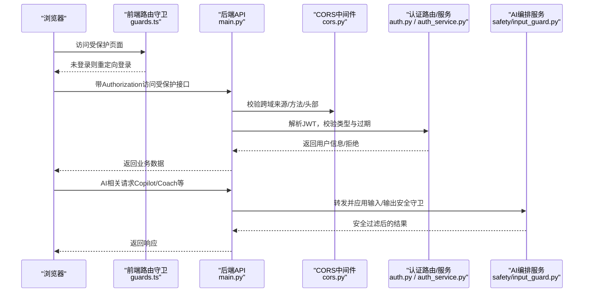
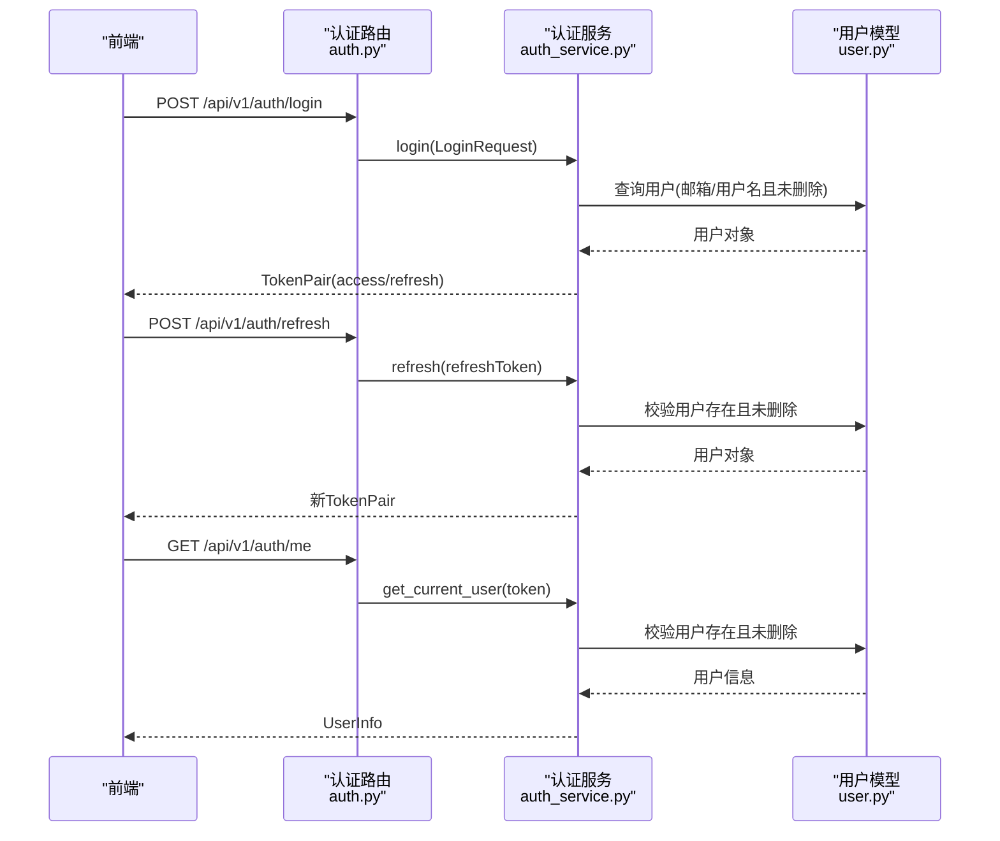
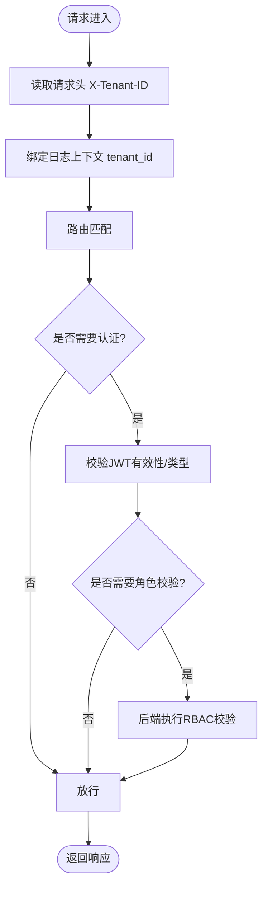
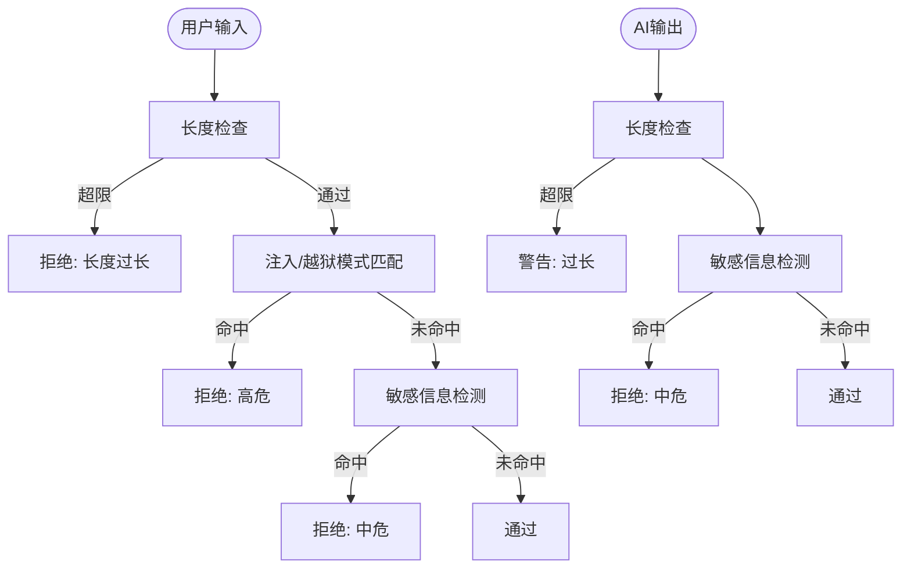
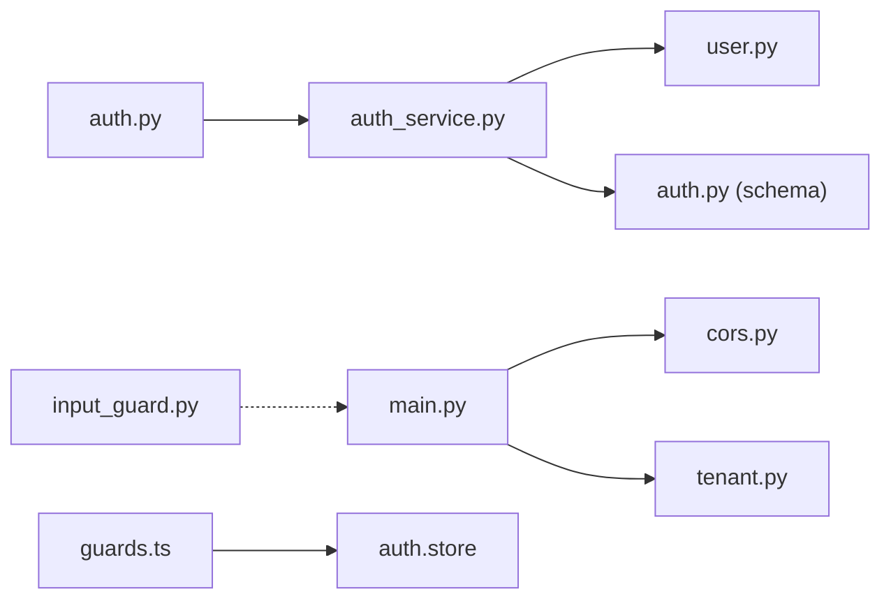

# 安全测试

<cite>
**本文引用的文件**
- [workspace/api/app/main.py](file://workspace/api/app/main.py)
- [workspace/api/app/middleware/cors.py](file://workspace/api/app/middleware/cors.py)
- [workspace/api/app/middleware/tenant.py](file://workspace/api/app/middleware/tenant.py)
- [workspace/api/app/routers/auth.py](file://workspace/api/app/routers/auth.py)
- [workspace/api/app/services/auth_service.py](file://workspace/api/app/services/auth_service.py)
- [workspace/api/app/models/user.py](file://workspace/api/app/models/user.py)
- [workspace/api/app/schemas/auth.py](file://workspace/api/app/schemas/auth.py)
- [workspace/api/tests/integration/test_health_auth.py](file://workspace/api/tests/integration/test_health_auth.py)
- [workspace/api/tests/services/test_auth_service.py](file://workspace/api/tests/services/test_auth_service.py)
- [workspace/web/src/router/guards.ts](file://workspace/web/src/router/guards.ts)
- [workspace/web/tests/stores/auth.test.ts](file://workspace/web/tests/stores/auth.test.ts)
- [workspace/ai-orchestrator/app/safety/input_guard.py](file://workspace/ai-orchestrator/app/safety/input_guard.py)
- [workspace/ai-orchestrator/tests/test_integration.py](file://workspace/ai-orchestrator/tests/test_integration.py)
</cite>

## 目录
1. [简介](#简介)
2. [项目结构](#项目结构)
3. [核心组件](#核心组件)
4. [架构总览](#架构总览)
5. [详细组件分析](#详细组件分析)
6. [依赖分析](#依赖分析)
7. [性能考虑](#性能考虑)
8. [故障排查指南](#故障排查指南)
9. [结论](#结论)
10. [附录](#附录)

## 简介
本安全测试文档面向FDE工作台，围绕身份认证与会话、授权与多租户、安全中间件、SQL注入防护、AI安全（Prompt注入、输出过滤、安全提示工程）、以及安全测试用例设计与渗透测试策略展开。文档基于仓库中的后端API、前端路由守卫、AI安全层等实现，结合现有测试用例，给出可落地的测试方法与风险评估建议。

## 项目结构
后端采用FastAPI，前端采用Vue3+Pinia+Vue Router，AI编排服务独立容器化运行。安全相关能力主要分布在：
- 后端：CORS中间件、多租户中间件、认证路由与服务、用户模型与Schema、异常处理与健康检查
- 前端：路由守卫（鉴权跳转）、Pinia状态（token与用户信息）
- AI编排：输入/输出安全守卫（Prompt注入、Jailbreak、敏感信息检测）

```mermaid
graph TB
subgraph "前端(Web)"
FE_Router["Vue Router<br/>guards.ts"]
FE_Store["Pinia Store<br/>auth.store"]
end
subgraph "后端(API)"
FastAPI["FastAPI 应用<br/>main.py"]
CORS["CORS 中间件<br/>cors.py"]
TENANT["多租户中间件<br/>tenant.py"]
AUTH_ROUTER["认证路由<br/>routers/auth.py"]
AUTH_SERVICE["认证服务<br/>services/auth_service.py"]
USER_MODEL["用户模型<br/>models/user.py"]
AUTH_SCHEMA["认证Schema<br/>schemas/auth.py"]
end
subgraph "AI编排(AI Orchestrator)"
SAFETY["AI安全层<br/>safety/input_guard.py"]
end
FE_Router --> FE_Store
FE_Router --> |受保护页面| FE_Router
FE_Router --> |登录/登出| AUTH_ROUTER
AUTH_ROUTER --> AUTH_SERVICE
AUTH_SERVICE --> USER_MODEL
FastAPI --> CORS
FastAPI --> TENANT
FastAPI --> AUTH_ROUTER
AUTH_SERVICE --> AUTH_SCHEMA
SAFETY -.-> FastAPI
```

图表来源
- [workspace/api/app/main.py:44-52](file://workspace/api/app/main.py#L44-L52)
- [workspace/api/app/middleware/cors.py:7-19](file://workspace/api/app/middleware/cors.py#L7-L19)
- [workspace/api/app/middleware/tenant.py:11-23](file://workspace/api/app/middleware/tenant.py#L11-L23)
- [workspace/api/app/routers/auth.py:19-42](file://workspace/api/app/routers/auth.py#L19-L42)
- [workspace/api/app/services/auth_service.py:22-105](file://workspace/api/app/services/auth_service.py#L22-L105)
- [workspace/api/app/models/user.py:8-22](file://workspace/api/app/models/user.py#L8-L22)
- [workspace/api/app/schemas/auth.py:7-32](file://workspace/api/app/schemas/auth.py#L7-L32)
- [workspace/web/src/router/guards.ts:4-21](file://workspace/web/src/router/guards.ts#L4-L21)
- [workspace/ai-orchestrator/app/safety/input_guard.py:96-164](file://workspace/ai-orchestrator/app/safety/input_guard.py#L96-L164)

章节来源
- [workspace/api/app/main.py:44-52](file://workspace/api/app/main.py#L44-L52)
- [workspace/api/app/middleware/cors.py:7-19](file://workspace/api/app/middleware/cors.py#L7-L19)
- [workspace/api/app/middleware/tenant.py:11-23](file://workspace/api/app/middleware/tenant.py#L11-L23)
- [workspace/api/app/routers/auth.py:19-42](file://workspace/api/app/routers/auth.py#L19-L42)
- [workspace/api/app/services/auth_service.py:22-105](file://workspace/api/app/services/auth_service.py#L22-L105)
- [workspace/api/app/models/user.py:8-22](file://workspace/api/app/models/user.py#L8-L22)
- [workspace/api/app/schemas/auth.py:7-32](file://workspace/api/app/schemas/auth.py#L7-L32)
- [workspace/web/src/router/guards.ts:4-21](file://workspace/web/src/router/guards.ts#L4-L21)
- [workspace/ai-orchestrator/app/safety/input_guard.py:96-164](file://workspace/ai-orchestrator/app/safety/input_guard.py#L96-L164)

## 核心组件
- 身份认证与会话
  - 登录/刷新/登出接口与用户信息查询
  - JWT访问令牌与刷新令牌签发与校验
  - 密码哈希存储
- 授权与多租户
  - 用户角色字段与前端路由守卫
  - 多租户上下文透传（X-Tenant-ID）
- 安全中间件
  - CORS允许来源、方法、头部配置
- AI安全
  - 输入守卫（Prompt注入、Jailbreak、长度限制、敏感信息）
  - 输出守卫（长度限制、敏感信息）

章节来源
- [workspace/api/app/routers/auth.py:19-42](file://workspace/api/app/routers/auth.py#L19-L42)
- [workspace/api/app/services/auth_service.py:22-105](file://workspace/api/app/services/auth_service.py#L22-L105)
- [workspace/api/app/models/user.py:16-22](file://workspace/api/app/models/user.py#L16-L22)
- [workspace/api/app/middleware/cors.py:7-19](file://workspace/api/app/middleware/cors.py#L7-L19)
- [workspace/api/app/middleware/tenant.py:14-23](file://workspace/api/app/middleware/tenant.py#L14-L23)
- [workspace/ai-orchestrator/app/safety/input_guard.py:96-164](file://workspace/ai-orchestrator/app/safety/input_guard.py#L96-L164)

## 架构总览
下图展示了从浏览器到后端API再到AI编排服务的请求链路，以及安全控制点（CORS、JWT、多租户、AI安全）的位置。

图表来源
- [workspace/web/src/router/guards.ts:4-21](file://workspace/web/src/router/guards.ts#L4-L21)
- [workspace/api/app/main.py:44-52](file://workspace/api/app/main.py#L44-L52)
- [workspace/api/app/middleware/cors.py:7-19](file://workspace/api/app/middleware/cors.py#L7-L19)
- [workspace/api/app/routers/auth.py:19-42](file://workspace/api/app/routers/auth.py#L19-L42)
- [workspace/api/app/services/auth_service.py:56-76](file://workspace/api/app/services/auth_service.py#L56-L76)
- [workspace/ai-orchestrator/app/safety/input_guard.py:102-132](file://workspace/ai-orchestrator/app/safety/input_guard.py#L102-L132)

## 详细组件分析

### 身份验证测试
目标：验证JWT令牌验证、登录流程、会话管理（含刷新与登出）。
- 登录流程
  - 输入：用户名或邮箱 + 密码
  - 逻辑：查找用户（邮箱/用户名且未软删），校验密码哈希，签发访问/刷新令牌
  - 输出：返回令牌对与过期秒数
- 刷新流程
  - 输入：刷新令牌
  - 逻辑：解码校验类型为“refresh”，用户存在且未软删，重新签发新令牌对
- 获取当前用户
  - 输入：Authorization头（Bearer）
  - 逻辑：解码校验类型为“access”，用户存在且未软删，返回用户信息
- 会话管理
  - 访问令牌过期：前端应使用刷新令牌换取新访问令牌
  - 登出：后端返回成功消息（前端负责清理本地token）

图表来源
- [workspace/api/app/routers/auth.py:19-42](file://workspace/api/app/routers/auth.py#L19-L42)
- [workspace/api/app/services/auth_service.py:22-105](file://workspace/api/app/services/auth_service.py#L22-L105)
- [workspace/api/app/models/user.py:8-22](file://workspace/api/app/models/user.py#L8-L22)

章节来源
- [workspace/api/app/routers/auth.py:19-42](file://workspace/api/app/routers/auth.py#L19-L42)
- [workspace/api/app/services/auth_service.py:22-105](file://workspace/api/app/services/auth_service.py#L22-L105)
- [workspace/api/app/models/user.py:8-22](file://workspace/api/app/models/user.py#L8-L22)
- [workspace/api/tests/services/test_auth_service.py:10-129](file://workspace/api/tests/services/test_auth_service.py#L10-L129)
- [workspace/api/tests/integration/test_health_auth.py:24-75](file://workspace/api/tests/integration/test_health_auth.py#L24-L75)
- [workspace/web/tests/stores/auth.test.ts:12-62](file://workspace/web/tests/stores/auth.test.ts#L12-L62)

### 授权测试
目标：验证RBAC权限、多租户数据隔离、资源访问控制。
- RBAC权限
  - 用户角色字段为逗号分隔字符串，服务端解析为列表
  - 前端路由守卫仅做基础登录态判断，未发现显式路由级权限拦截逻辑
  - 建议：在后端路由或服务层增加基于角色的资源访问控制
- 多租户数据隔离
  - 多租户中间件从请求头提取X-Tenant-ID并绑定到日志上下文
  - 建议：在数据查询层强制加入租户过滤条件，并在接口层校验租户一致性
- 资源访问控制
  - 未登录访问受保护接口应返回401/403
  - 健康检查无需认证

图表来源
- [workspace/api/app/middleware/tenant.py:14-23](file://workspace/api/app/middleware/tenant.py#L14-L23)
- [workspace/api/app/services/auth_service.py:56-76](file://workspace/api/app/services/auth_service.py#L56-L76)
- [workspace/api/app/models/user.py:16-22](file://workspace/api/app/models/user.py#L16-L22)
- [workspace/web/src/router/guards.ts:4-21](file://workspace/web/src/router/guards.ts#L4-L21)

章节来源
- [workspace/api/app/middleware/tenant.py:11-23](file://workspace/api/app/middleware/tenant.py#L11-L23)
- [workspace/api/app/models/user.py:16-22](file://workspace/api/app/models/user.py#L16-L22)
- [workspace/web/src/router/guards.ts:4-21](file://workspace/web/src/router/guards.ts#L4-L21)
- [workspace/api/tests/integration/test_health_auth.py:37-57](file://workspace/api/tests/integration/test_health_auth.py#L37-L57)

### 安全中间件测试
目标：验证CORS配置、XSS防护、CSRF防护现状与建议。
- CORS配置
  - 允许来源：本地开发与API服务器
  - 允许方法：GET/POST/PUT/DELETE/OPTIONS
  - 允许头部：Authorization、Content-Type、X-Trace-ID、X-Tenant-ID
  - 建议：生产环境限制允许来源，避免通配符；对敏感接口启用凭证与预检缓存策略
- XSS防护
  - 后端未发现专门的XSS过滤/转义逻辑
  - 建议：对所有用户输入进行最小可行的HTML转义或使用安全模板引擎；对富文本输出严格白名单
- CSRF防护
  - 未发现CSRF令牌机制
  - 建议：对状态变更类请求（POST/PUT/DELETE）启用SameSite Cookie、CSRF令牌或Origin/Referer校验

章节来源
- [workspace/api/app/main.py:44-50](file://workspace/api/app/main.py#L44-L50)
- [workspace/api/app/middleware/cors.py:7-19](file://workspace/api/app/middleware/cors.py#L7-L19)

### SQL注入防护测试
目标：验证恶意输入检测、参数绑定、数据库查询安全。
- 现状
  - 用户查询通过SQLAlchemy异步查询构建器执行，使用参数化查询
  - 登录流程对用户名/邮箱进行参数化查询
- 建议测试
  - 注入载荷：单引号、拼接、注释符、编码绕过
  - 参数绑定：确保所有用户输入均通过ORM/SQLAlchemy参数化执行
  - 预编译语句：对动态SQL（如有）进行白名单与长度限制
  - 错误信息：避免泄露底层数据库错误细节

章节来源
- [workspace/api/app/services/auth_service.py:28-39](file://workspace/api/app/services/auth_service.py#L28-L39)

### AI安全测试
目标：验证Prompt注入防护、输出过滤、安全提示工程。
- 输入守卫
  - 检测模式：忽略指令、角色替换、系统标签、绕过安全、编码规避、假设场景、强制服从、特殊字符溢出、漏洞术语
  - 长度限制：超过阈值直接拒绝
  - 结果：高危/中危分级
- 输出守卫
  - 长度限制与敏感信息检测（信用卡号、邮箱）
- 测试建议
  - Prompt注入：构造“ignore previous instructions”、“system override”等典型模式
  - Jailbreak：构造“developer mode”、“disable safety”等
  - 敏感信息：构造真实格式的信用卡号、邮箱
  - 长度：超过最大阈值的输入
  - 安全提示工程：验证提示词是否被识别为注入或越狱

图表来源
- [workspace/ai-orchestrator/app/safety/input_guard.py:102-163](file://workspace/ai-orchestrator/app/safety/input_guard.py#L102-L163)
- [workspace/ai-orchestrator/tests/test_integration.py:130-162](file://workspace/ai-orchestrator/tests/test_integration.py#L130-L162)

章节来源
- [workspace/ai-orchestrator/app/safety/input_guard.py:96-164](file://workspace/ai-orchestrator/app/safety/input_guard.py#L96-L164)
- [workspace/ai-orchestrator/tests/test_integration.py:130-162](file://workspace/ai-orchestrator/tests/test_integration.py#L130-L162)

## 依赖分析
- 组件耦合
  - 认证服务依赖用户模型与配置（JWT密钥、算法、过期时间）
  - 路由依赖服务层，服务层依赖数据库会话
  - 前端路由守卫依赖Pinia状态（token与用户信息）
  - AI安全层独立于API，通过服务调用集成
- 外部依赖
  - FastAPI中间件（CORS、日志、追踪）
  - Pydantic模型用于请求/响应校验
  - bcrypt用于密码哈希
  - jose用于JWT编解码

图表来源
- [workspace/api/app/routers/auth.py:19-42](file://workspace/api/app/routers/auth.py#L19-L42)
- [workspace/api/app/services/auth_service.py:18-105](file://workspace/api/app/services/auth_service.py#L18-L105)
- [workspace/api/app/models/user.py:8-22](file://workspace/api/app/models/user.py#L8-L22)
- [workspace/api/app/schemas/auth.py:7-32](file://workspace/api/app/schemas/auth.py#L7-L32)
- [workspace/api/app/main.py:44-52](file://workspace/api/app/main.py#L44-L52)
- [workspace/api/app/middleware/cors.py:7-19](file://workspace/api/app/middleware/cors.py#L7-L19)
- [workspace/api/app/middleware/tenant.py:11-23](file://workspace/api/app/middleware/tenant.py#L11-L23)
- [workspace/web/src/router/guards.ts:4-21](file://workspace/web/src/router/guards.ts#L4-L21)
- [workspace/ai-orchestrator/app/safety/input_guard.py:96-164](file://workspace/ai-orchestrator/app/safety/input_guard.py#L96-L164)

章节来源
- [workspace/api/app/routers/auth.py:19-42](file://workspace/api/app/routers/auth.py#L19-L42)
- [workspace/api/app/services/auth_service.py:18-105](file://workspace/api/app/services/auth_service.py#L18-L105)
- [workspace/api/app/models/user.py:8-22](file://workspace/api/app/models/user.py#L8-L22)
- [workspace/api/app/schemas/auth.py:7-32](file://workspace/api/app/schemas/auth.py#L7-L32)
- [workspace/api/app/main.py:44-52](file://workspace/api/app/main.py#L44-L52)
- [workspace/api/app/middleware/cors.py:7-19](file://workspace/api/app/middleware/cors.py#L7-L19)
- [workspace/api/app/middleware/tenant.py:11-23](file://workspace/api/app/middleware/tenant.py#L11-L23)
- [workspace/web/src/router/guards.ts:4-21](file://workspace/web/src/router/guards.ts#L4-L21)
- [workspace/ai-orchestrator/app/safety/input_guard.py:96-164](file://workspace/ai-orchestrator/app/safety/input_guard.py#L96-L164)

## 性能考虑
- JWT解码与bcrypt校验为CPU密集点，建议：
  - 合理设置过期时间，减少频繁刷新
  - 对高频接口启用缓存（如用户基本信息）
  - 优化数据库索引（邮箱/用户名唯一索引）
- CORS预检与中间件链路开销可控，建议：
  - 生产环境限制允许来源与头部，减少不必要的跨域握手
- AI安全守卫为正则匹配，建议：
  - 对超长输入提前短路
  - 缓存常用敏感模式的编译结果

## 故障排查指南
- 未登录访问受保护接口
  - 现象：返回401/403
  - 排查：确认Authorization头是否携带、令牌是否过期
- JWT无效或类型不符
  - 现象：抛出令牌无效异常
  - 排查：核对密钥、算法、令牌类型（access/refresh）
- 多租户上下文缺失
  - 现象：日志中tenant_id为空或默认值
  - 排查：确认请求头X-Tenant-ID是否传递
- CORS失败
  - 现象：浏览器跨域报错
  - 排查：确认来源、方法、头部是否在允许列表
- AI输入被拒绝
  - 现象：返回高/中危安全结果
  - 排查：检查输入是否命中注入/越狱/敏感信息规则

章节来源
- [workspace/api/tests/integration/test_health_auth.py:37-75](file://workspace/api/tests/integration/test_health_auth.py#L37-L75)
- [workspace/api/app/services/auth_service.py:41-76](file://workspace/api/app/services/auth_service.py#L41-L76)
- [workspace/api/app/middleware/tenant.py:14-23](file://workspace/api/app/middleware/tenant.py#L14-L23)
- [workspace/api/app/middleware/cors.py:7-19](file://workspace/api/app/middleware/cors.py#L7-L19)
- [workspace/ai-orchestrator/app/safety/input_guard.py:102-132](file://workspace/ai-orchestrator/app/safety/input_guard.py#L102-L132)

## 结论
FDE工作台在后端实现了基础的身份认证与JWT令牌管理、CORS与多租户中间件、以及AI安全输入/输出守卫。建议在以下方面加强：
- 后端完善RBAC与资源访问控制
- 强化XSS与CSRF防护
- 增强SQL注入与错误信息脱敏
- 补充安全测试用例与渗透测试策略

## 附录
- 安全测试用例设计与渗透测试策略
  - 身份认证
    - 正常用例：登录成功、令牌签发、刷新成功、获取当前用户
    - 异常用例：用户名/密码为空、用户不存在、密码错误、令牌过期/伪造、类型不符
    - 渗透：暴力破解、撞库、JWT重放、令牌泄露
  - 授权与多租户
    - 正常用例：具备角色访问对应资源
    - 异常用例：越权访问、未传X-Tenant-ID、传入非法租户ID
    - 渗透：角色提升、数据横向越权、租户隔离绕过
  - 安全中间件
    - CORS：来源/方法/头部不匹配、预检失败
    - XSS：脚本注入、DOM/XSS、富文本逃逸
    - CSRF：跨站请求伪造、状态变更接口无防护
  - SQL注入
    - 载荷：单引号、拼接、注释、编码绕过
    - 防护：参数化查询、白名单、长度限制、错误屏蔽
  - AI安全
    - Prompt注入：忽略指令、系统标签、角色替换、绕过安全
    - Jailbreak：开发者模式、禁用安全、跳过检查
    - 输出过滤：敏感信息泄露、过长输出
  - 渗透测试策略
    - 基线扫描：端口、弱口令、CORS滥用
    - 手工测试：JWT、RBAC、多租户、AI安全
    - 自动化：OWASP ZAP/Sqlmap等工具辅助
    - 回归：每次发布前执行关键安全用例