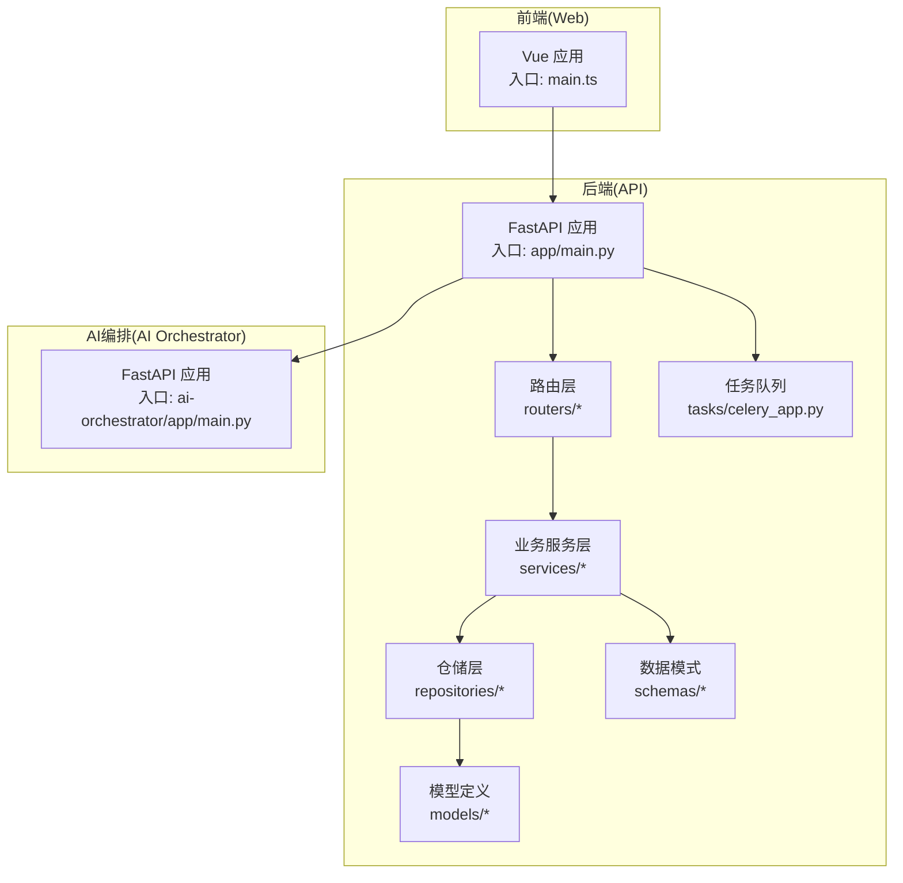
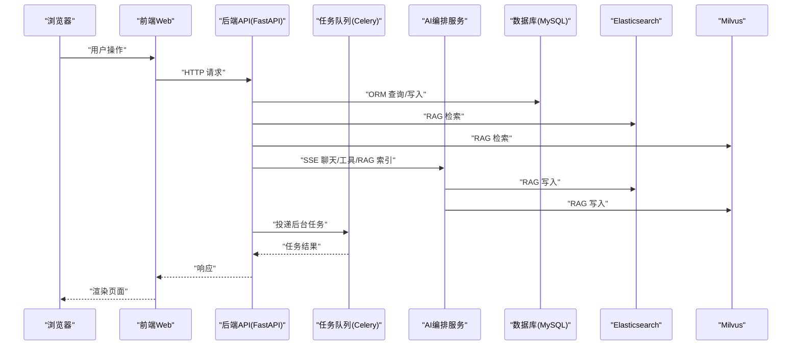
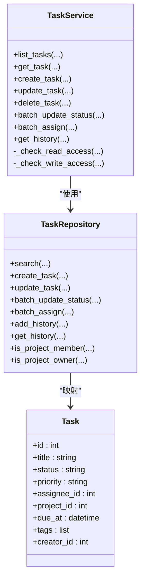
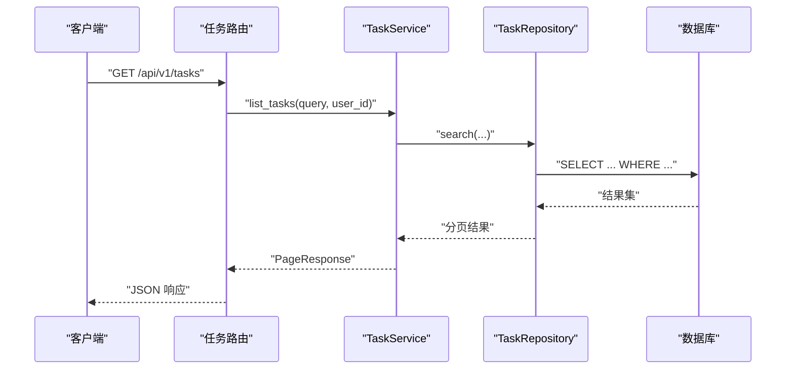
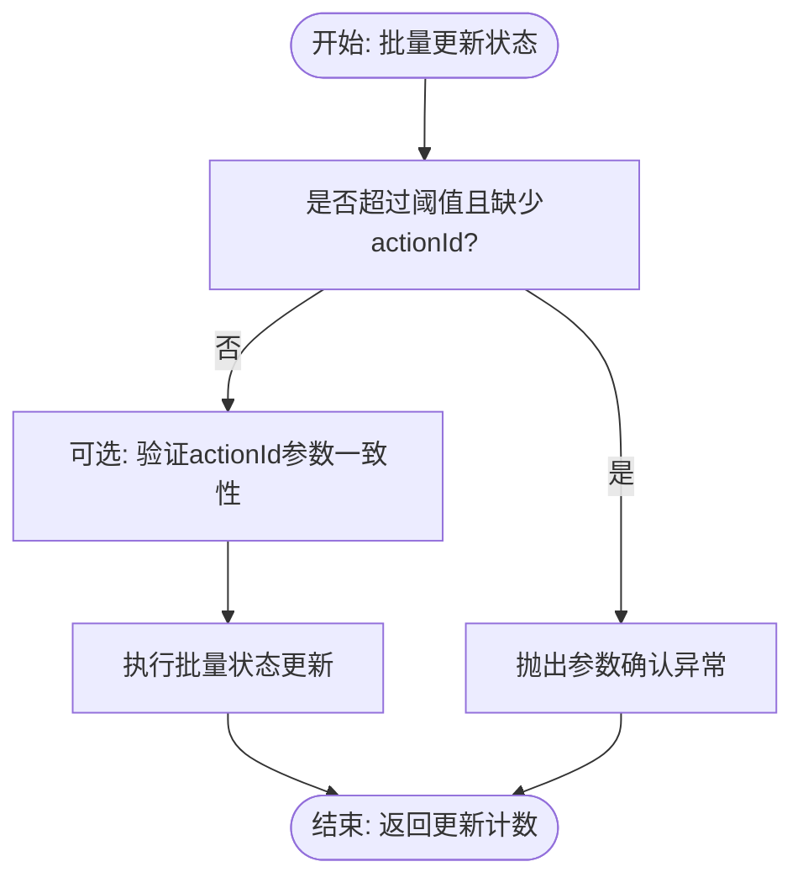
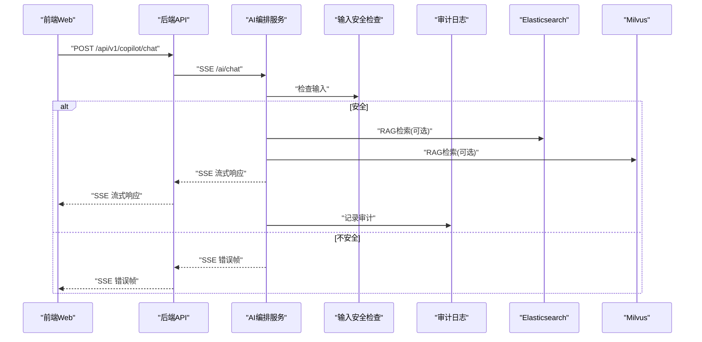
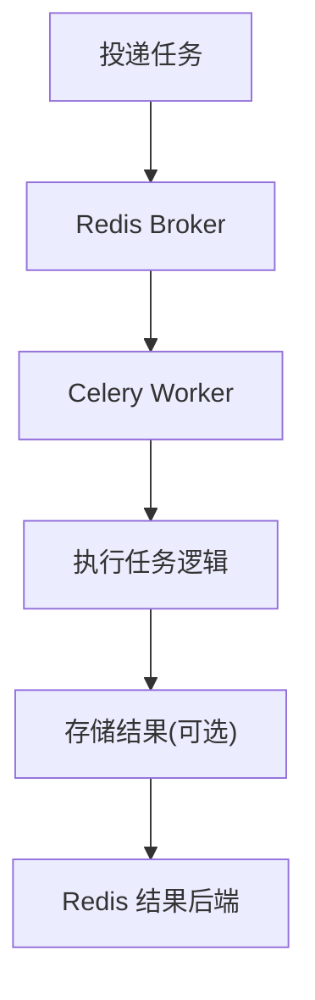
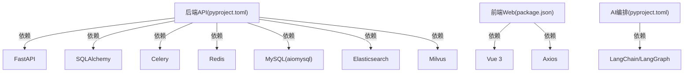

# 性能测试

<cite>
**本文引用的文件**
- [workspace/api/app/main.py](file://workspace/api/app/main.py)
- [workspace/api/app/config/settings.py](file://workspace/api/app/config/settings.py)
- [workspace/api/app/middleware/logging.py](file://workspace/api/app/middleware/logging.py)
- [workspace/api/app/middleware/trace.py](file://workspace/api/app/middleware/trace.py)
- [workspace/api/app/routers/tasks.py](file://workspace/api/app/routers/tasks.py)
- [workspace/api/app/services/task_service.py](file://workspace/api/app/services/task_service.py)
- [workspace/api/app/repositories/task_repo.py](file://workspace/api/app/repositories/task_repo.py)
- [workspace/api/app/models/task.py](file://workspace/api/app/models/task.py)
- [workspace/api/app/schemas/task.py](file://workspace/api/app/schemas/task.py)
- [workspace/api/app/tasks/celery_app.py](file://workspace/api/app/tasks/celery_app.py)
- [workspace/api/tests/integration/test_api_endpoints.py](file://workspace/api/tests/integration/test_api_endpoints.py)
- [workspace/ai-orchestrator/app/main.py](file://workspace/ai-orchestrator/app/main.py)
- [workspace/web/src/main.ts](file://workspace/web/src/main.ts)
- [workspace/api/pyproject.toml](file://workspace/api/pyproject.toml)
- [workspace/web/package.json](file://workspace/web/package.json)
- [workspace/ai-orchestrator/pyproject.toml](file://workspace/ai-orchestrator/pyproject.toml)
</cite>

## 目录
1. [引言](#引言)
2. [项目结构](#项目结构)
3. [核心组件](#核心组件)
4. [架构总览](#架构总览)
5. [详细组件分析](#详细组件分析)
6. [依赖分析](#依赖分析)
7. [性能考虑](#性能考虑)
8. [故障排查指南](#故障排查指南)
9. [结论](#结论)
10. [附录](#附录)

## 引言
本文件面向FDE工作台的性能测试，围绕后端API服务、前端Web应用与AI编排服务三部分，制定系统化的负载测试、压力测试与基准测试方案。内容涵盖并发用户模拟、请求速率控制、资源使用监控、数据库连接池压力、内存与CPU峰值测试、API响应时间基准、数据库查询优化与缓存命中率测试，并提供测试环境搭建、测试数据准备与指标采集方法，以及性能瓶颈识别与优化建议。

## 项目结构
FDE工作台采用前后端分离架构：前端Vue应用负责UI与交互；后端FastAPI服务提供REST接口与任务调度；AI编排服务提供流式对话与RAG检索能力。整体通过Docker Compose进行本地编排，便于在统一环境中进行端到端性能评估。

图表来源
- [workspace/web/src/main.ts:1-24](file://workspace/web/src/main.ts#L1-L24)
- [workspace/api/app/main.py:1-73](file://workspace/api/app/main.py#L1-L73)
- [workspace/api/app/routers/tasks.py:1-70](file://workspace/api/app/routers/tasks.py#L1-L70)
- [workspace/api/app/services/task_service.py:1-127](file://workspace/api/app/services/task_service.py#L1-L127)
- [workspace/api/app/repositories/task_repo.py:1-143](file://workspace/api/app/repositories/task_repo.py#L1-L143)
- [workspace/api/app/models/task.py:1-41](file://workspace/api/app/models/task.py#L1-L41)
- [workspace/api/app/schemas/task.py:1-116](file://workspace/api/app/schemas/task.py#L1-L116)
- [workspace/api/app/tasks/celery_app.py:1-29](file://workspace/api/app/tasks/celery_app.py#L1-L29)
- [workspace/ai-orchestrator/app/main.py:1-307](file://workspace/ai-orchestrator/app/main.py#L1-L307)

章节来源
- [workspace/api/app/main.py:1-73](file://workspace/api/app/main.py#L1-L73)
- [workspace/web/src/main.ts:1-24](file://workspace/web/src/main.ts#L1-L24)
- [workspace/ai-orchestrator/app/main.py:1-307](file://workspace/ai-orchestrator/app/main.py#L1-L307)

## 核心组件
- 后端API服务：提供认证、仪表盘、任务、项目、客户、文件、教练、Copilot、提及与设置等REST接口，内置CORS、日志与追踪中间件，异常统一处理。
- 任务服务与仓储：基于SQLAlchemy异步会话实现任务的CRUD、批量更新、历史记录与权限校验。
- 任务队列：Celery集成Redis作为Broker与结果后端，支持任务序列化、时延限制与软超时。
- AI编排服务：提供SSE流式聊天、工具列表、RAG检索与索引管理，具备输入安全检查与审计日志。
- 前端Web应用：基于Vue 3 + Pinia + Vue Router，Axios拦截器统一处理请求与错误。

章节来源
- [workspace/api/app/main.py:1-73](file://workspace/api/app/main.py#L1-L73)
- [workspace/api/app/routers/tasks.py:1-70](file://workspace/api/app/routers/tasks.py#L1-L70)
- [workspace/api/app/services/task_service.py:1-127](file://workspace/api/app/services/task_service.py#L1-L127)
- [workspace/api/app/repositories/task_repo.py:1-143](file://workspace/api/app/repositories/task_repo.py#L1-L143)
- [workspace/api/app/tasks/celery_app.py:1-29](file://workspace/api/app/tasks/celery_app.py#L1-L29)
- [workspace/ai-orchestrator/app/main.py:1-307](file://workspace/ai-orchestrator/app/main.py#L1-L307)
- [workspace/web/src/main.ts:1-24](file://workspace/web/src/main.ts#L1-L24)

## 架构总览
下图展示从浏览器到后端API再到AI编排服务与数据库/搜索引擎的典型调用链路，用于指导性能测试场景设计与指标采集。

图表来源
- [workspace/api/app/main.py:1-73](file://workspace/api/app/main.py#L1-L73)
- [workspace/api/app/config/settings.py:1-81](file://workspace/api/app/config/settings.py#L1-L81)
- [workspace/ai-orchestrator/app/main.py:1-307](file://workspace/ai-orchestrator/app/main.py#L1-L307)

## 详细组件分析

### 组件A：任务相关API与服务链路
该组件覆盖任务列表、详情、创建、更新、删除、批量更新状态、批量指派与历史查询，涉及数据库读写、权限校验与历史记录写入。

图表来源
- [workspace/api/app/models/task.py:1-41](file://workspace/api/app/models/task.py#L1-L41)
- [workspace/api/app/repositories/task_repo.py:1-143](file://workspace/api/app/repositories/task_repo.py#L1-L143)
- [workspace/api/app/services/task_service.py:1-127](file://workspace/api/app/services/task_service.py#L1-L127)

图表来源
- [workspace/api/app/routers/tasks.py:1-70](file://workspace/api/app/routers/tasks.py#L1-L70)
- [workspace/api/app/services/task_service.py:1-127](file://workspace/api/app/services/task_service.py#L1-L127)
- [workspace/api/app/repositories/task_repo.py:1-143](file://workspace/api/app/repositories/task_repo.py#L1-L143)

图表来源
- [workspace/api/app/services/task_service.py:82-94](file://workspace/api/app/services/task_service.py#L82-L94)

章节来源
- [workspace/api/app/routers/tasks.py:1-70](file://workspace/api/app/routers/tasks.py#L1-L70)
- [workspace/api/app/services/task_service.py:1-127](file://workspace/api/app/services/task_service.py#L1-L127)
- [workspace/api/app/repositories/task_repo.py:1-143](file://workspace/api/app/repositories/task_repo.py#L1-L143)
- [workspace/api/app/models/task.py:1-41](file://workspace/api/app/models/task.py#L1-L41)
- [workspace/api/app/schemas/task.py:1-116](file://workspace/api/app/schemas/task.py#L1-L116)

### 组件B：AI编排服务与SSE流式响应
AI编排服务提供SSE聊天流、工具列表与RAG检索/索引接口，具备输入安全检查与审计日志，适合进行高并发流式响应与RAG检索的性能测试。

图表来源
- [workspace/ai-orchestrator/app/main.py:89-172](file://workspace/ai-orchestrator/app/main.py#L89-L172)
- [workspace/api/app/main.py:1-73](file://workspace/api/app/main.py#L1-L73)

章节来源
- [workspace/ai-orchestrator/app/main.py:1-307](file://workspace/ai-orchestrator/app/main.py#L1-L307)

### 组件C：任务队列与后台任务
Celery配置了序列化、时延与超时策略，适合进行后台任务吞吐与延迟的性能测试。

图表来源
- [workspace/api/app/tasks/celery_app.py:1-29](file://workspace/api/app/tasks/celery_app.py#L1-L29)

章节来源
- [workspace/api/app/tasks/celery_app.py:1-29](file://workspace/api/app/tasks/celery_app.py#L1-L29)

## 依赖分析
- 运行时依赖：后端API服务依赖FastAPI、SQLAlchemy、Celery、Redis、MySQL/aiomysql、Elasticsearch、Milvus等；前端依赖Vue 3、Axios；AI编排服务依赖FastAPI、LangChain/LangGraph等。
- 中间件：后端API包含CORS、日志与追踪中间件，有助于性能观测与问题定位。
- 配置：后端API通过Settings加载数据库、Redis、ES、Milvus、AI编排服务地址与超时等配置。

图表来源
- [workspace/api/pyproject.toml:1-61](file://workspace/api/pyproject.toml#L1-L61)
- [workspace/web/package.json:1-59](file://workspace/web/package.json#L1-L59)
- [workspace/ai-orchestrator/pyproject.toml:1-29](file://workspace/ai-orchestrator/pyproject.toml#L1-L29)

章节来源
- [workspace/api/pyproject.toml:1-61](file://workspace/api/pyproject.toml#L1-L61)
- [workspace/web/package.json:1-59](file://workspace/web/package.json#L1-L59)
- [workspace/ai-orchestrator/pyproject.toml:1-29](file://workspace/ai-orchestrator/pyproject.toml#L1-L29)

## 性能考虑
- 并发与速率控制
  - 使用压测工具（如wrk、k6、JMeter）对关键端点施加并发与恒定/阶梯式请求速率，观察响应时间、错误率与吞吐。
  - 对SSE端点（如AI聊天）采用“连接保持+令牌级采样”方式采集首字节时间与持续吞吐。
- 资源监控
  - CPU/内存/IO：采集容器与主机指标（如Prometheus+Grafana），关注数据库连接池饱和、Redis队列堆积、ES/Milvus查询延迟。
  - 日志与追踪：启用TraceMiddleware与LoggingMiddleware，结合分布式追踪（如Jaeger/Zipkin）定位慢请求路径。
- 数据库连接池压力
  - 通过设置数据库URL与连接池参数（最大连接数、空闲连接、超时），逐步提升并发，观察连接池等待与拒绝情况。
  - 关注慢查询日志与锁等待，结合索引与查询计划优化。
- 内存与CPU峰值
  - 针对AI编排服务的流式处理与RAG检索，监控峰值内存与CPU占用，评估模型推理与向量检索的资源消耗。
- 缓存与命中率
  - 利用Redis缓存热点数据与会话信息，测量缓存命中率与未命中导致的延迟上升。
- 基准测试
  - API响应时间基准：在稳定负载下记录P50/P90/P95响应时间，建立基线。
  - 数据库查询优化：对比优化前后的查询计划与执行时间，验证索引与SQL改写效果。
  - 缓存命中率：调整缓存策略与TTL，观察命中率与延迟变化。

[本节为通用性能指导，无需具体文件引用]

## 故障排查指南
- 中间件与日志
  - LoggingMiddleware记录请求开始/完成事件，便于定位慢请求与异常路径。
  - TraceMiddleware为每个请求注入跟踪ID，便于跨服务串联日志与指标。
- 异常处理
  - 后端API统一异常处理，确保压测中错误响应格式一致，便于自动化分析。
- 集成测试参考
  - 可参考集成测试中的依赖注入与Mock策略，构建稳定的压测环境。

章节来源
- [workspace/api/app/middleware/logging.py:1-36](file://workspace/api/app/middleware/logging.py#L1-L36)
- [workspace/api/app/middleware/trace.py:1-30](file://workspace/api/app/middleware/trace.py#L1-L30)
- [workspace/api/tests/integration/test_api_endpoints.py:1-144](file://workspace/api/tests/integration/test_api_endpoints.py#L1-L144)

## 结论
通过明确的负载与压力测试策略、资源监控与基准测试方法，结合数据库连接池、缓存与异步任务的专项优化，可系统性提升FDE工作台在高并发场景下的稳定性与性能表现。建议以关键端点（任务API、AI聊天、RAG检索）为核心，逐步扩展至全链路压测，并持续迭代优化。

[本节为总结性内容，无需具体文件引用]

## 附录

### A. 性能测试实施步骤
- 测试环境搭建
  - 使用Docker Compose启动后端API、AI编排、数据库、Redis、Elasticsearch、Milvus等服务。
  - 在压测机上部署监控（Prometheus/Grafana）与日志聚合（ELK/EFK）。
- 测试数据准备
  - 初始化管理员账户与基础数据，生成多项目、多任务、多文件与知识库样本，确保RAG检索与索引可用。
- 指标采集
  - API侧：响应时间、错误率、吞吐、数据库连接池状态、Redis队列长度。
  - AI侧：SSE首字节时间、平均吞吐、RAG检索耗时、模型推理耗时。
  - 基础设施：CPU/内存/磁盘IO、网络带宽、数据库/ES/Milvus查询QPS与延迟。

[本节为通用流程说明，无需具体文件引用]

### B. 典型测试场景设计
- 负载测试
  - 场景1：任务列表/详情/创建/更新的稳定并发，逐步提升至目标并发，观察P95响应时间与错误率。
  - 场景2：AI聊天SSE在不同并发下的首字节时间与持续吞吐。
- 压力测试
  - 场景3：数据库连接池上限测试，观察连接等待与拒绝。
  - 场景4：RAG检索与索引在高并发下的延迟与失败率。
- 基准测试
  - 场景5：建立API响应时间基线，记录不同数据规模下的变化。
  - 场景6：缓存命中率测试，评估不同TTL与淘汰策略的影响。

[本节为通用场景说明，无需具体文件引用]

### C. 性能瓶颈识别与优化建议
- 数据库查询优化
  - 分析慢查询日志，补充必要索引；避免N+1查询；使用分页与投影减少数据传输。
- 缓存策略改进
  - 对高频读取的数据（如任务列表、用户信息）引入Redis缓存，合理设置TTL与失效策略。
- 异步任务处理
  - 将耗时操作（如RAG索引、报表生成）放入Celery队列，设置合理的软/硬超时与重试策略。
- 中间件与日志
  - 控制日志级别与字段，避免在高并发下产生过多I/O开销；利用TraceMiddleware进行端到端追踪。

[本节为通用优化建议，无需具体文件引用]