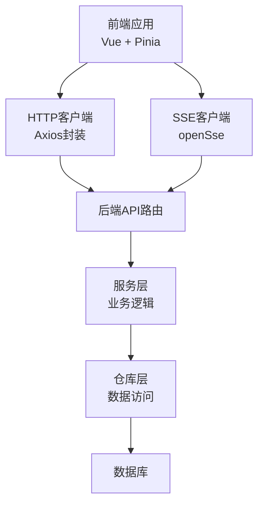
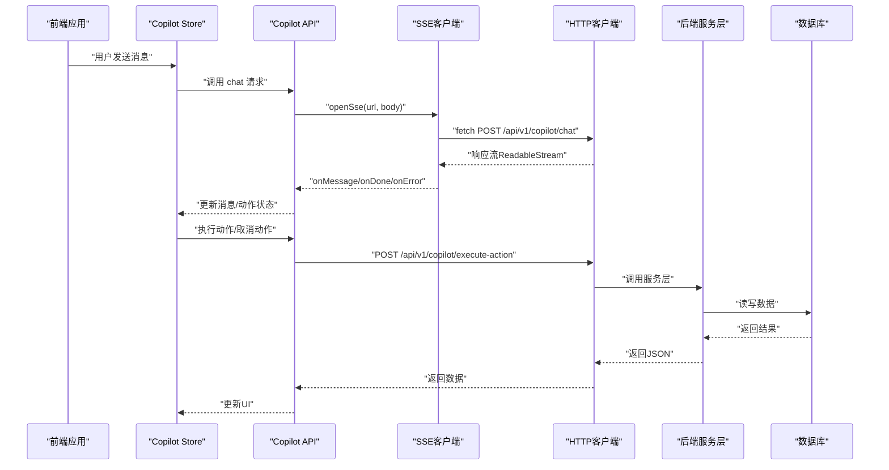
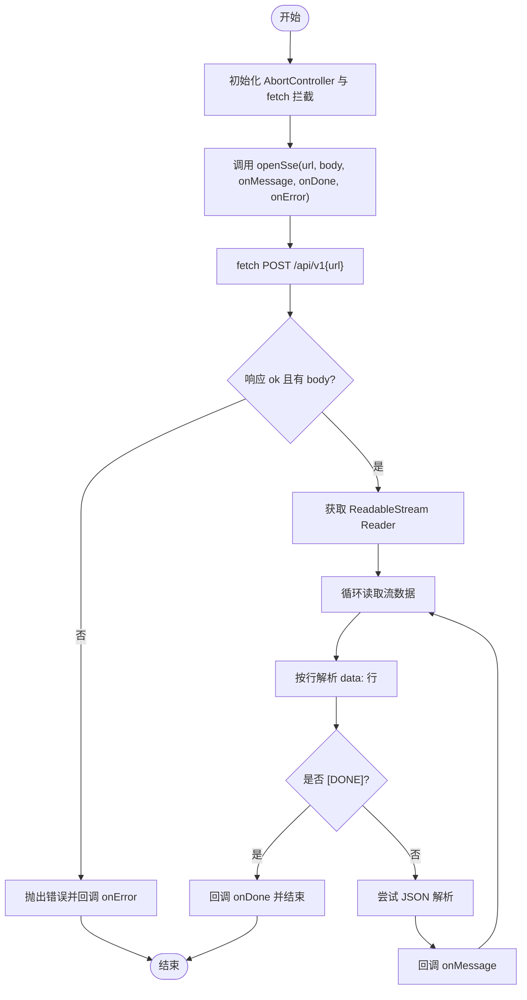
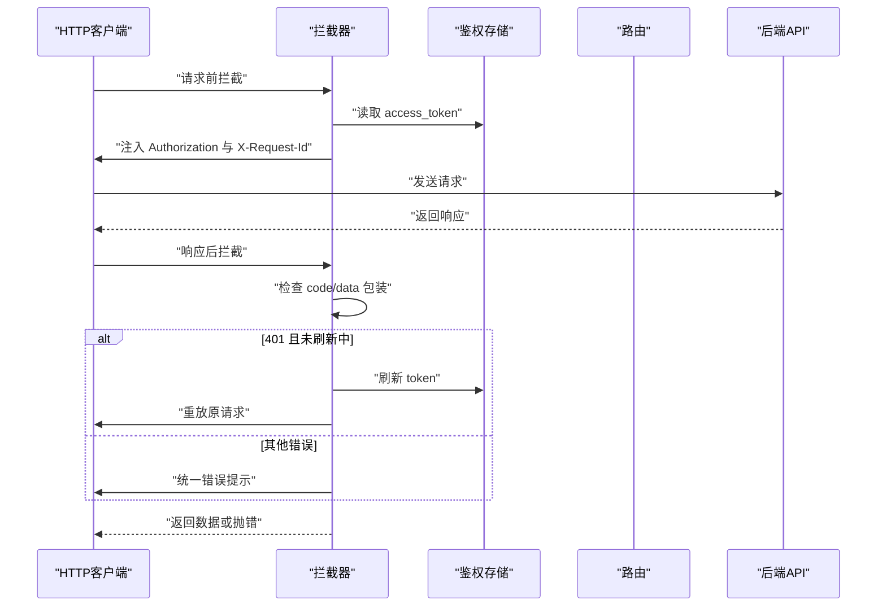
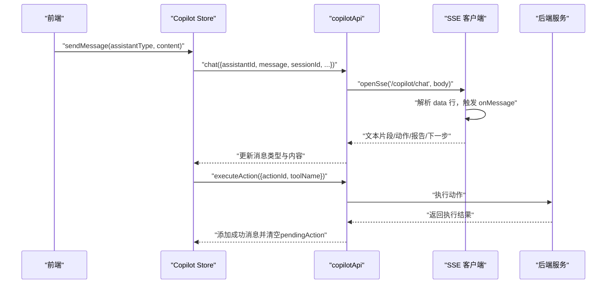
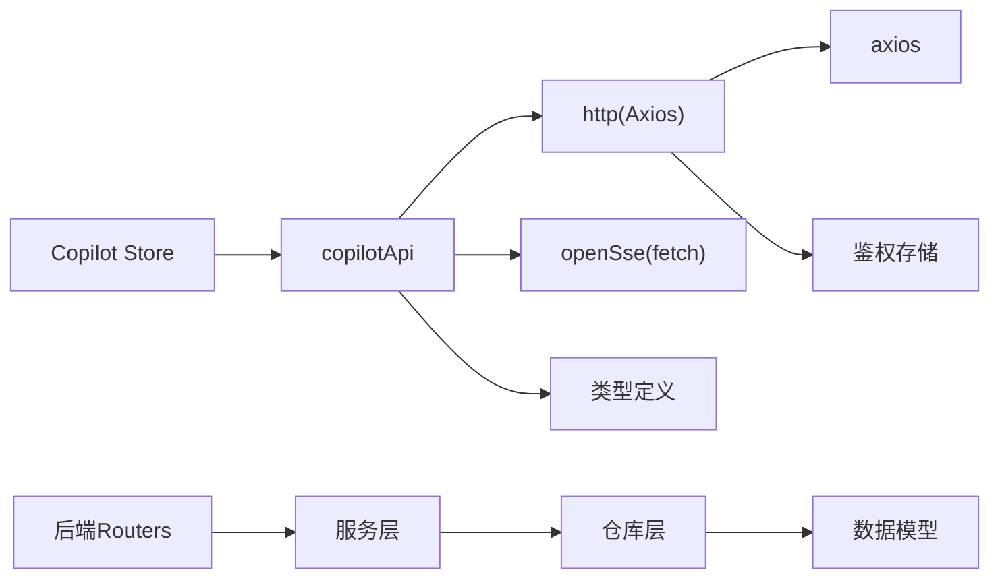

# API接口测试

<cite>
**本文引用的文件**
- [workspace/web/tests/apis/sse.test.ts](file://workspace/web/tests/apis/sse.test.ts)
- [workspace/web/src/apis/sse.ts](file://workspace/web/src/apis/sse.ts)
- [workspace/web/src/apis/modules/copilot.ts](file://workspace/web/src/apis/modules/copilot.ts)
- [workspace/web/src/apis/modules/files.ts](file://workspace/web/src/apis/modules/files.ts)
- [workspace/web/src/apis/http.ts](file://workspace/web/src/apis/http.ts)
- [workspace/web/src/stores/copilot.ts](file://workspace/web/src/stores/copilot.ts)
- [workspace/api/tests/integration/test_api_endpoints.py](file://workspace/api/tests/integration/test_api_endpoints.py)
- [workspace/api/tests/conftest.py](file://workspace/api/tests/conftest.py)
- [workspace/api/tests/services/test_action_service.py](file://workspace/api/tests/services/test_action_service.py)
</cite>

## 目录
1. [引言](#引言)
2. [项目结构](#项目结构)
3. [核心组件](#核心组件)
4. [架构总览](#架构总览)
5. [详细组件分析](#详细组件分析)
6. [依赖分析](#依赖分析)
7. [性能考虑](#性能考虑)
8. [故障排查指南](#故障排查指南)
9. [结论](#结论)
10. [附录](#附录)

## 引言
本测试文档面向FDE工作台的API接口测试，重点覆盖以下方面：
- SSE（Server-Sent Events）连接测试策略：连接建立、事件接收、错误处理、连接断开
- HTTP API调用测试：使用Axios封装的HTTP客户端进行同步请求与响应拦截
- Mock数据与异步请求测试：通过Vitest与Pytest的Mock能力验证业务流程
- Copilot API、文件上传API、动作二次确认API等测试示例
- 网络模拟、超时处理与重试机制测试
- 自动化测试策略与性能测试方法

## 项目结构
FDE工作台采用前后端分离架构，API层位于后端Python应用，前端Vue应用通过HTTP客户端与SSE客户端访问后端接口。测试覆盖前端SSE与HTTP客户端、后端集成测试与服务层测试。

图表来源
- [workspace/web/src/apis/http.ts:1-73](file://workspace/web/src/apis/http.ts#L1-L73)
- [workspace/web/src/apis/sse.ts:1-79](file://workspace/web/src/apis/sse.ts#L1-L79)
- [workspace/api/tests/integration/test_api_endpoints.py:1-144](file://workspace/api/tests/integration/test_api_endpoints.py#L1-L144)

章节来源
- [workspace/web/src/apis/http.ts:1-73](file://workspace/web/src/apis/http.ts#L1-L73)
- [workspace/web/src/apis/sse.ts:1-79](file://workspace/web/src/apis/sse.ts#L1-L79)
- [workspace/api/tests/integration/test_api_endpoints.py:1-144](file://workspace/api/tests/integration/test_api_endpoints.py#L1-L144)

## 核心组件
- 前端HTTP客户端：基于Axios，统一设置基础URL、超时、鉴权头、响应拦截与Token刷新队列
- SSE客户端：基于fetch + ReadableStream，支持POST型SSE流式数据接收
- Copilot API模块：封装Copilot聊天、会话管理、动作预览/执行/取消、反馈
- 文件API模块：封装文件列表、树形结构、配额、上传令牌、完成上传、删除等
- 后端API集成测试：使用ASGI测试客户端与Mock依赖，验证端点行为
- 动作服务测试：验证动作预览、执行、取消、过期与校验

章节来源
- [workspace/web/src/apis/http.ts:1-73](file://workspace/web/src/apis/http.ts#L1-L73)
- [workspace/web/src/apis/sse.ts:1-79](file://workspace/web/src/apis/sse.ts#L1-L79)
- [workspace/web/src/apis/modules/copilot.ts:1-40](file://workspace/web/src/apis/modules/copilot.ts#L1-L40)
- [workspace/web/src/apis/modules/files.ts:1-37](file://workspace/web/src/apis/modules/files.ts#L1-L37)
- [workspace/api/tests/integration/test_api_endpoints.py:1-144](file://workspace/api/tests/integration/test_api_endpoints.py#L1-L144)
- [workspace/api/tests/services/test_action_service.py:1-217](file://workspace/api/tests/services/test_action_service.py#L1-L217)

## 架构总览
下图展示从前端到后端的关键交互路径，以及测试关注点（Mock、拦截器、SSE流）：

图表来源
- [workspace/web/src/stores/copilot.ts:48-137](file://workspace/web/src/stores/copilot.ts#L48-L137)
- [workspace/web/src/apis/modules/copilot.ts:12-39](file://workspace/web/src/apis/modules/copilot.ts#L12-L39)
- [workspace/web/src/apis/sse.ts:18-79](file://workspace/web/src/apis/sse.ts#L18-L79)
- [workspace/web/src/apis/http.ts:6-72](file://workspace/web/src/apis/http.ts#L6-L72)

## 详细组件分析

### SSE客户端测试策略
- 连接建立测试：验证openSse返回AbortController；验证fetch被调用且携带Authorization头
- 事件接收测试：解析data行，区分JSON与纯文本，触发onMessage；遇到[DONE]触发onDone
- 错误处理测试：捕获非AbortError异常并回调onError；断言错误信息
- 连接断开测试：调用AbortController.abort中断流读取

图表来源
- [workspace/web/src/apis/sse.ts:18-79](file://workspace/web/src/apis/sse.ts#L18-L79)
- [workspace/web/tests/apis/sse.test.ts:22-44](file://workspace/web/tests/apis/sse.test.ts#L22-L44)

章节来源
- [workspace/web/tests/apis/sse.test.ts:1-46](file://workspace/web/tests/apis/sse.test.ts#L1-L46)
- [workspace/web/src/apis/sse.ts:1-79](file://workspace/web/src/apis/sse.ts#L1-L79)

### HTTP客户端与拦截器测试策略
- 统一配置：baseURL、timeout、Content-Type
- 请求拦截：自动注入Authorization头与X-Request-Id
- 响应拦截：识别包装格式{code,data}；401时触发Token刷新队列与重试
- 错误提示：统一错误消息提示与路由跳转

图表来源
- [workspace/web/src/apis/http.ts:15-72](file://workspace/web/src/apis/http.ts#L15-L72)

章节来源
- [workspace/web/src/apis/http.ts:1-73](file://workspace/web/src/apis/http.ts#L1-L73)

### Copilot API测试策略
- 聊天流式接口：通过copilotApi.chat触发SSE，Store在onMessage中增量拼接内容，onDone处理空响应兜底
- 会话管理：列出/获取/删除会话
- 动作二次确认：预览生成actionId与过期时间；执行/取消动作；校验工具名一致性
- 反馈接口：提交评分

图表来源
- [workspace/web/src/stores/copilot.ts:48-137](file://workspace/web/src/stores/copilot.ts#L48-L137)
- [workspace/web/src/apis/modules/copilot.ts:12-39](file://workspace/web/src/apis/modules/copilot.ts#L12-L39)
- [workspace/api/tests/services/test_action_service.py:1-217](file://workspace/api/tests/services/test_action_service.py#L1-L217)

章节来源
- [workspace/web/src/stores/copilot.ts:1-184](file://workspace/web/src/stores/copilot.ts#L1-L184)
- [workspace/web/src/apis/modules/copilot.ts:1-40](file://workspace/web/src/apis/modules/copilot.ts#L1-L40)
- [workspace/api/tests/services/test_action_service.py:1-217](file://workspace/api/tests/services/test_action_service.py#L1-L217)

### 文件上传API测试策略
- 列表/详情/树形/配额：GET接口验证分页与字段
- 上传令牌：POST生成上传凭证（endpoint/bucket/oss_key/token）
- 完成上传：上报oss_key与元信息，返回文件元数据
- 删除/批量删除/下载：验证状态码与返回结构

章节来源
- [workspace/web/src/apis/modules/files.ts:1-37](file://workspace/web/src/apis/modules/files.ts#L1-L37)

### 后端API集成测试策略
- 使用ASGI测试客户端与自定义Transport
- 通过dependency_override替换数据库会话与认证上下文
- 验证任务增删改查、仪表盘汇总、提及搜索等端点

章节来源
- [workspace/api/tests/integration/test_api_endpoints.py:1-144](file://workspace/api/tests/integration/test_api_endpoints.py#L1-L144)
- [workspace/api/tests/conftest.py:1-139](file://workspace/api/tests/conftest.py#L1-L139)

## 依赖分析
- 前端依赖关系：store依赖copilotApi，copilotApi依赖http与sse；http依赖axios与鉴权存储
- 后端依赖关系：routers依赖services；services依赖repositories；repositories依赖数据库模型
- 测试依赖关系：前端测试通过vi.mock与stubGlobal模拟fetch；后端测试通过unittest.mock与ASGI Transport

图表来源
- [workspace/web/src/stores/copilot.ts:1-184](file://workspace/web/src/stores/copilot.ts#L1-L184)
- [workspace/web/src/apis/modules/copilot.ts:1-40](file://workspace/web/src/apis/modules/copilot.ts#L1-L40)
- [workspace/web/src/apis/http.ts:1-73](file://workspace/web/src/apis/http.ts#L1-L73)
- [workspace/web/src/apis/sse.ts:1-79](file://workspace/web/src/apis/sse.ts#L1-L79)

## 性能考虑
- SSE流式传输：前端按行解析，避免一次性缓冲大块数据；建议在Store中限制最大消息长度与速率
- HTTP超时与重试：HTTP客户端默认超时15秒；401时内置30秒刷新超时与队列等待；建议在接口层增加指数退避重试
- 数据Mock：后端测试使用AsyncMock与MagicMock减少真实IO；前端测试使用stubGlobal与vi.mock隔离外部依赖
- 并发与资源释放：SSE需确保AbortController正确释放；HTTP请求失败时及时清理队列

## 故障排查指南
- SSE连接失败
  - 检查Authorization头是否正确注入
  - 确认后端返回状态码与body存在性
  - 断言onError回调被触发并记录错误信息
- SSE事件解析异常
  - 确保data行以"data: "开头
  - 处理JSON解析失败回退为字符串
- HTTP 401未刷新
  - 检查isRefreshing标志与pendingQueue队列
  - 确认刷新Promise与30秒超时逻辑
- 动作执行失败
  - 校验actionId是否存在与过期
  - 确认用户匹配与工具名一致
- 文件上传失败
  - 校验上传令牌有效期与endpoint/bucket/oss_key
  - 确认finalizeUpload参数与后端期望一致

章节来源
- [workspace/web/src/apis/sse.ts:33-76](file://workspace/web/src/apis/sse.ts#L33-L76)
- [workspace/web/src/apis/http.ts:32-71](file://workspace/web/src/apis/http.ts#L32-L71)
- [workspace/api/tests/services/test_action_service.py:140-168](file://workspace/api/tests/services/test_action_service.py#L140-L168)

## 结论
本文档提供了FDE工作台API测试的系统化策略，涵盖SSE连接、HTTP请求、Mock与异步场景，并结合Copilot与文件上传等关键API给出可落地的测试步骤与可视化流程。建议在持续集成中引入自动化测试与性能回归，确保接口稳定性与用户体验。

## 附录
- 自动化策略
  - 前端：Vitest单测+覆盖率；SSE与HTTP客户端分别Mock
  - 后端：Pytest集成测试+依赖替换；数据库事务模拟
- 性能测试方法
  - 压测SSE流速与Store渲染性能
  - 压测HTTP并发与401刷新队列吞吐
  - 压测文件上传令牌与finalize耗时