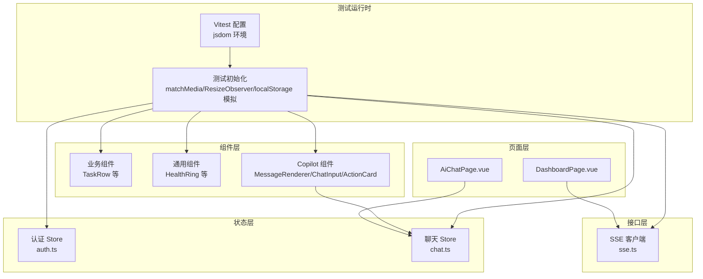
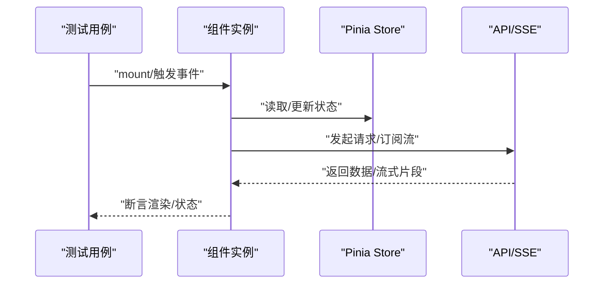
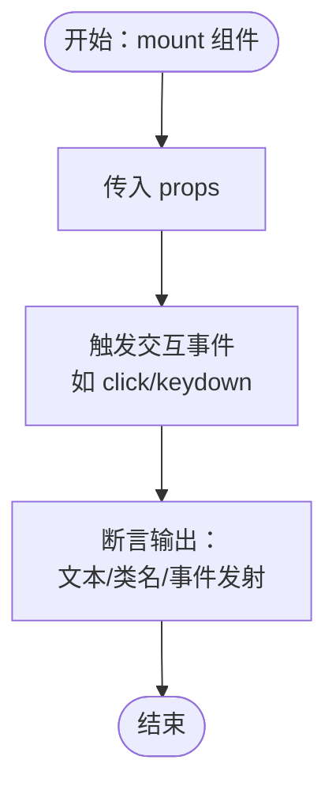
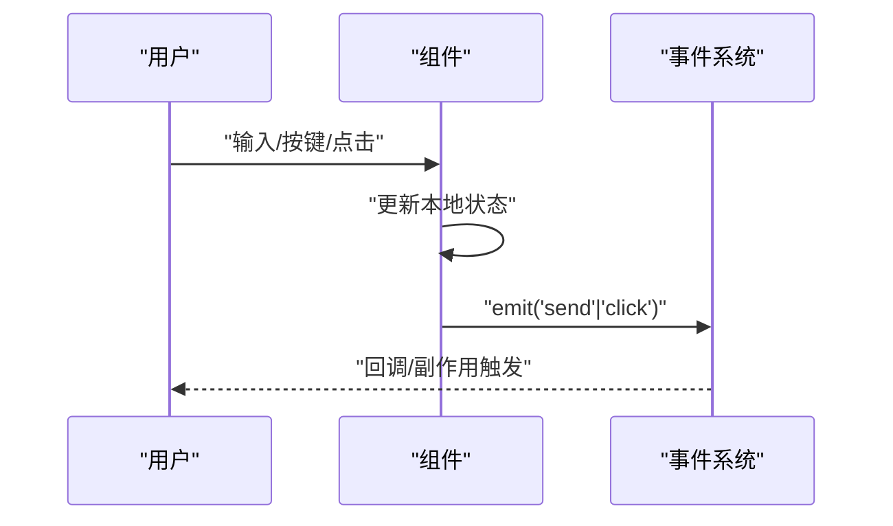
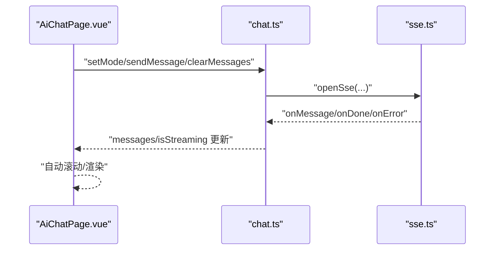
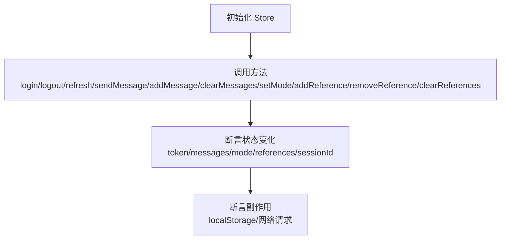
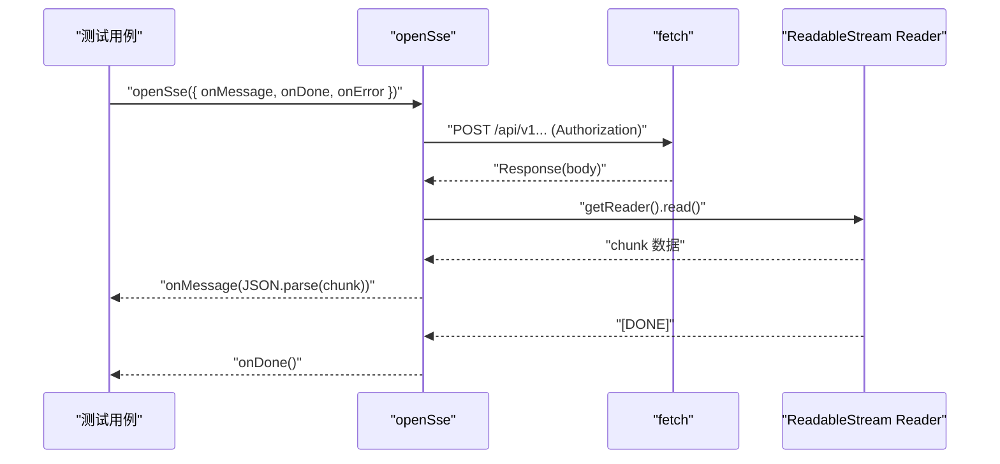
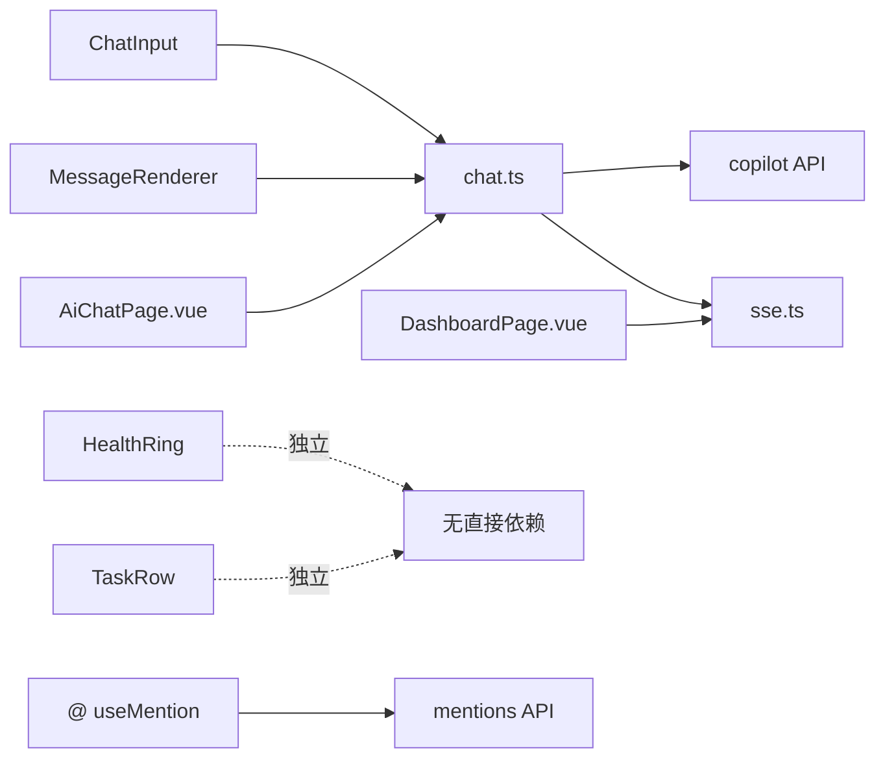

# 前端测试

<cite>
**本文引用的文件**
- [workspace/web/vitest.config.ts](file://workspace/web/vitest.config.ts)
- [workspace/web/tests/setup.ts](file://workspace/web/tests/setup.ts)
- [workspace/web/package.json](file://workspace/web/package.json)
- [workspace/web/src/stores/auth.ts](file://workspace/web/src/stores/auth.ts)
- [workspace/web/src/stores/chat.ts](file://workspace/web/src/stores/chat.ts)
- [workspace/web/tests/stores/auth.test.ts](file://workspace/web/tests/stores/auth.test.ts)
- [workspace/web/tests/stores/chat.test.ts](file://workspace/web/tests/stores/chat.test.ts)
- [workspace/web/src/apis/sse.ts](file://workspace/web/src/apis/sse.ts)
- [workspace/web/tests/apis/sse.test.ts](file://workspace/web/tests/apis/sse.test.ts)
- [workspace/web/src/composables/useMention.ts](file://workspace/web/src/composables/useMention.ts)
- [workspace/web/tests/composables/useMention.test.ts](file://workspace/web/tests/composables/useMention.test.ts)
- [workspace/web/tests/components/HealthRing.test.ts](file://workspace/web/tests/components/HealthRing.test.ts)
- [workspace/web/tests/components/TaskRow.test.ts](file://workspace/web/tests/components/TaskRow.test.ts)
- [workspace/web/tests/components/copilot.test.ts](file://workspace/web/tests/components/copilot.test.ts)
- [workspace/web/src/pages/chat/AiChatPage.vue](file://workspace/web/src/pages/chat/AiChatPage.vue)
- [workspace/web/src/pages/dashboard/DashboardPage.vue](file://workspace/web/src/pages/dashboard/DashboardPage.vue)
</cite>

## 目录
1. [引言](#引言)
2. [项目结构](#项目结构)
3. [核心组件](#核心组件)
4. [架构总览](#架构总览)
5. [详细组件分析](#详细组件分析)
6. [依赖关系分析](#依赖关系分析)
7. [性能考量](#性能考量)
8. [故障排查指南](#故障排查指南)
9. [结论](#结论)
10. [附录](#附录)

## 引言
本测试文档面向 FDE 工作台前端，围绕组件测试、用户交互测试、组件集成测试、状态管理测试（Pinia Store）、用户界面测试（页面渲染、样式与响应式）、可访问性测试（屏幕阅读器、键盘导航、色彩对比度）以及 SSE 连接与实时数据更新测试，给出系统化的策略与实操指引。文档同时结合仓库现有测试用例与配置，帮助开发者快速落地高质量的前端测试。

## 项目结构
前端采用 Vue 3 + Pinia + Vitest + Vue Test Utils 技术栈，测试运行环境为 jsdom，通过别名简化导入路径，并在测试前注入全局环境模拟（如 matchMedia、ResizeObserver、localStorage）。测试覆盖范围包括：
- 组件层：业务组件、通用组件、Copilot 相关组件
- 状态层：认证、聊天、UI 等 Pinia Store
- 接口层：SSE 客户端
- 可组合函数：@ 引用的组合式工具
- 页面层：聊天页、仪表盘等页面组件

**图表来源**
- [workspace/web/vitest.config.ts:1-26](file://workspace/web/vitest.config.ts#L1-L26)
- [workspace/web/tests/setup.ts:1-36](file://workspace/web/tests/setup.ts#L1-L36)
- [workspace/web/src/stores/auth.ts:1-56](file://workspace/web/src/stores/auth.ts#L1-L56)
- [workspace/web/src/stores/chat.ts:1-147](file://workspace/web/src/stores/chat.ts#L1-L147)
- [workspace/web/src/apis/sse.ts:1-79](file://workspace/web/src/apis/sse.ts#L1-L79)
- [workspace/web/src/pages/chat/AiChatPage.vue:1-301](file://workspace/web/src/pages/chat/AiChatPage.vue#L1-L301)
- [workspace/web/src/pages/dashboard/DashboardPage.vue:1-286](file://workspace/web/src/pages/dashboard/DashboardPage.vue#L1-L286)

**章节来源**
- [workspace/web/vitest.config.ts:1-26](file://workspace/web/vitest.config.ts#L1-L26)
- [workspace/web/tests/setup.ts:1-36](file://workspace/web/tests/setup.ts#L1-L36)
- [workspace/web/package.json:1-59](file://workspace/web/package.json#L1-L59)

## 核心组件
- 测试框架与环境
  - Vitest 配置启用 jsdom，全局挂载，包含测试覆盖率；路径别名统一指向 src 下各模块。
  - 测试初始化文件对浏览器环境进行必要模拟，确保组件渲染与交互测试稳定。
- 状态管理
  - 认证 Store：负责 token、刷新 token、登录登出、用户信息等。
  - 聊天 Store：负责消息流式渲染、会话管理、模式切换、引用管理等。
- 接口与实时能力
  - SSE 客户端：基于 fetch + ReadableStream 的 POST SSE 实现，支持消息分片解析、结束信号与错误处理。
- 可组合函数
  - @ 引用的组合式工具，如提及功能，提供去抖搜索、选中项管理等。
- 页面组件
  - 聊天页：多 Tab 切换、自动滚动、发送与清空逻辑。
  - 仪表盘：并发加载多个数据源、状态计算与展示。

**章节来源**
- [workspace/web/vitest.config.ts:1-26](file://workspace/web/vitest.config.ts#L1-L26)
- [workspace/web/tests/setup.ts:1-36](file://workspace/web/tests/setup.ts#L1-L36)
- [workspace/web/src/stores/auth.ts:1-56](file://workspace/web/src/stores/auth.ts#L1-L56)
- [workspace/web/src/stores/chat.ts:1-147](file://workspace/web/src/stores/chat.ts#L1-L147)
- [workspace/web/src/apis/sse.ts:1-79](file://workspace/web/src/apis/sse.ts#L1-L79)
- [workspace/web/src/composables/useMention.ts:1-63](file://workspace/web/src/composables/useMention.ts#L1-L63)
- [workspace/web/src/pages/chat/AiChatPage.vue:1-301](file://workspace/web/src/pages/chat/AiChatPage.vue#L1-L301)
- [workspace/web/src/pages/dashboard/DashboardPage.vue:1-286](file://workspace/web/src/pages/dashboard/DashboardPage.vue#L1-L286)

## 架构总览
下图展示了测试视角下的关键交互：组件通过 Pinia Store 与 API 层（含 SSE）交互，页面组件驱动 Store 并消费其状态，测试通过 Vue Test Utils 挂载组件并断言行为与状态变化。

**图表来源**
- [workspace/web/tests/components/copilot.test.ts:1-156](file://workspace/web/tests/components/copilot.test.ts#L1-L156)
- [workspace/web/src/stores/chat.ts:1-147](file://workspace/web/src/stores/chat.ts#L1-L147)
- [workspace/web/src/apis/sse.ts:1-79](file://workspace/web/src/apis/sse.ts#L1-L79)

## 详细组件分析

### 组件测试策略
- 目标
  - 验证组件渲染正确性、属性传递、事件发射与交互行为。
- 方法
  - 使用 @vue/test-utils 的 mount 挂载组件，传入 props，触发 DOM 事件，断言文本、类名、事件发射等。
- 示例要点
  - 通用组件：校验数值显示、尺寸参数、边界值（如 0-100 夹紧）。
  - 业务组件：校验字段渲染、状态徽标、点击事件发射。
  - Copilot 组件：校验消息类型渲染（文本/动作/报告）、输入框回车发送、动作卡片确认按钮事件。

**图表来源**
- [workspace/web/tests/components/HealthRing.test.ts:1-31](file://workspace/web/tests/components/HealthRing.test.ts#L1-L31)
- [workspace/web/tests/components/TaskRow.test.ts:1-52](file://workspace/web/tests/components/TaskRow.test.ts#L1-L52)
- [workspace/web/tests/components/copilot.test.ts:1-156](file://workspace/web/tests/components/copilot.test.ts#L1-L156)

**章节来源**
- [workspace/web/tests/components/HealthRing.test.ts:1-31](file://workspace/web/tests/components/HealthRing.test.ts#L1-L31)
- [workspace/web/tests/components/TaskRow.test.ts:1-52](file://workspace/web/tests/components/TaskRow.test.ts#L1-L52)
- [workspace/web/tests/components/copilot.test.ts:1-156](file://workspace/web/tests/components/copilot.test.ts#L1-L156)

### 用户交互测试策略
- 目标
  - 验证用户操作（点击、输入、键盘）与组件行为一致。
- 关键点
  - 输入框值变更与禁用状态、回车键发送、按钮禁用条件。
  - 事件发射次数与参数（如发送内容、附件列表）。
- 场景示例
  - ChatInput：空内容不发送、回车发送、多行输入。
  - ActionCard：确认按钮触发外部事件。
  - TaskRow：点击事件发射。

**图表来源**
- [workspace/web/tests/components/copilot.test.ts:72-109](file://workspace/web/tests/components/copilot.test.ts#L72-L109)
- [workspace/web/tests/components/TaskRow.test.ts:37-50](file://workspace/web/tests/components/TaskRow.test.ts#L37-L50)

**章节来源**
- [workspace/web/tests/components/copilot.test.ts:1-156](file://workspace/web/tests/components/copilot.test.ts#L1-L156)
- [workspace/web/tests/components/TaskRow.test.ts:1-52](file://workspace/web/tests/components/TaskRow.test.ts#L1-L52)

### 组件集成测试策略
- 目标
  - 验证多个组件协同工作，页面级行为（如聊天页）与 Store 协同。
- 关键点
  - 页面组件读取 Store 状态、调用 Store 方法、自动滚动、清空对话。
  - Store 与 API/SSE 的协作，消息流式更新、结束与错误处理。
- 场景示例
  - AiChatPage：切换 Tab、发送消息、清空、滚动到底部。
  - DashboardPage：并发加载多个数据源、计算指标、渲染列表与时间线。

**图表来源**
- [workspace/web/src/pages/chat/AiChatPage.vue:1-301](file://workspace/web/src/pages/chat/AiChatPage.vue#L1-L301)
- [workspace/web/src/stores/chat.ts:1-147](file://workspace/web/src/stores/chat.ts#L1-L147)
- [workspace/web/src/apis/sse.ts:1-79](file://workspace/web/src/apis/sse.ts#L1-L79)

**章节来源**
- [workspace/web/src/pages/chat/AiChatPage.vue:1-301](file://workspace/web/src/pages/chat/AiChatPage.vue#L1-L301)
- [workspace/web/src/pages/dashboard/DashboardPage.vue:1-286](file://workspace/web/src/pages/dashboard/DashboardPage.vue#L1-L286)

### 状态管理测试（Pinia Store）
- 目标
  - 验证 Store 初始化状态、方法调用、状态变更与副作用（如本地存储）。
- 方法
  - 使用 createPinia 与 setActivePinia 创建隔离的 Store 实例；对 API 方法进行 mock，断言状态与行为。
- 示例要点
  - 认证 Store：初始 token 为空、登录成功设置 token、登出清空、刷新 token 调用。
  - 聊天 Store：初始状态、添加消息、清空消息与会话重置、模式切换、引用去重与增删改查。

**图表来源**
- [workspace/web/tests/stores/auth.test.ts:1-63](file://workspace/web/tests/stores/auth.test.ts#L1-L63)
- [workspace/web/tests/stores/chat.test.ts:1-112](file://workspace/web/tests/stores/chat.test.ts#L1-L112)
- [workspace/web/src/stores/auth.ts:1-56](file://workspace/web/src/stores/auth.ts#L1-L56)
- [workspace/web/src/stores/chat.ts:1-147](file://workspace/web/src/stores/chat.ts#L1-L147)

**章节来源**
- [workspace/web/tests/stores/auth.test.ts:1-63](file://workspace/web/tests/stores/auth.test.ts#L1-L63)
- [workspace/web/tests/stores/chat.test.ts:1-112](file://workspace/web/tests/stores/chat.test.ts#L1-L112)
- [workspace/web/src/stores/auth.ts:1-56](file://workspace/web/src/stores/auth.ts#L1-L56)
- [workspace/web/src/stores/chat.ts:1-147](file://workspace/web/src/stores/chat.ts#L1-L147)

### 异步状态处理测试
- 目标
  - 验证异步流程（登录、刷新、消息发送、SSE 流）的状态变化与错误处理。
- 关键点
  - 登录/刷新：mock API 返回，断言 token 设置与本地存储。
  - 消息发送：添加用户消息与占位助理消息、流式更新、结束与错误兜底。
  - SSE：断言连接状态、消息解析、结束信号与错误回调。
- 建议
  - 使用 fake timers 控制定时器场景（如去抖）。
  - 使用 AbortController 中止请求，验证清理逻辑。

**章节来源**
- [workspace/web/tests/stores/auth.test.ts:25-37](file://workspace/web/tests/stores/auth.test.ts#L25-L37)
- [workspace/web/tests/stores/chat.test.ts:5-112](file://workspace/web/tests/stores/chat.test.ts#L5-L112)
- [workspace/web/tests/apis/sse.test.ts:1-46](file://workspace/web/tests/apis/sse.test.ts#L1-L46)
- [workspace/web/src/stores/chat.ts:55-128](file://workspace/web/src/stores/chat.ts#L55-L128)
- [workspace/web/src/apis/sse.ts:18-79](file://workspace/web/src/apis/sse.ts#L18-L79)

### 用户界面测试（页面渲染、样式与响应式）
- 目标
  - 验证页面渲染正确、样式按预期应用、响应式布局在不同视口下表现稳定。
- 方法
  - 渲染测试：断言关键元素存在、文本内容、类名与结构。
  - 样式验证：通过类名与 scoped 样式断言视觉一致性。
  - 响应式测试：通过 matchMedia 模拟断点，验证布局切换。
- 建议
  - 在 setup.ts 中统一注入 matchMedia 与 ResizeObserver，避免浏览器差异导致的不稳定。
  - 对复杂布局（如聊天消息容器）断言滚动条与高度限制。

**章节来源**
- [workspace/web/tests/setup.ts:7-27](file://workspace/web/tests/setup.ts#L7-L27)
- [workspace/web/src/pages/chat/AiChatPage.vue:216-300](file://workspace/web/src/pages/chat/AiChatPage.vue#L216-L300)
- [workspace/web/src/pages/dashboard/DashboardPage.vue:204-286](file://workspace/web/src/pages/dashboard/DashboardPage.vue#L204-L286)

### 可访问性测试（屏幕阅读器、键盘导航、色彩对比度）
- 目标
  - 确保组件具备良好的可访问性：语义化标签、键盘可达、颜色对比度满足要求。
- 方法
  - 屏幕阅读器：断言 aria-label、role、tabindex 等属性；确保焦点顺序合理。
  - 键盘导航：Tab 导航、Enter/Space 触发、Esc 关闭弹窗等。
  - 色彩对比度：断言关键文本与背景色对比度满足 WCAG 要求。
- 建议
  - 结合测试断言与自动化工具（如 axe-core）进行可访问性扫描。
  - 对按钮、输入框、提示信息等关键元素逐一覆盖。

[本节为通用指导，无需特定文件引用]

### SSE 连接测试与实时数据更新测试
- 目标
  - 验证 SSE 客户端连接、消息解析、结束与错误处理，以及 Store 与页面对流式数据的正确消费。
- 方法
  - 单元测试：构造 AbortController、模拟 fetch 与 ReadableStream，断言 onMessage/onDone/onError 回调触发。
  - 集成测试：在聊天页或 Store 中集成 SSE，断言消息追加、流结束、错误兜底与滚动行为。
- 建议
  - 使用 AbortController 中止流，验证资源释放。
  - 断言 [DONE] 结束信号与异常分支（如非 OK 响应、无 body）。

**图表来源**
- [workspace/web/tests/apis/sse.test.ts:1-46](file://workspace/web/tests/apis/sse.test.ts#L1-L46)
- [workspace/web/src/apis/sse.ts:18-79](file://workspace/web/src/apis/sse.ts#L18-L79)

**章节来源**
- [workspace/web/tests/apis/sse.test.ts:1-46](file://workspace/web/tests/apis/sse.test.ts#L1-L46)
- [workspace/web/src/apis/sse.ts:1-79](file://workspace/web/src/apis/sse.ts#L1-L79)

## 依赖关系分析
- 组件依赖
  - Copilot 组件依赖 chat Store；聊天页依赖 chat Store 与 MessageRenderer。
  - 通用组件（如 HealthRing）与业务组件（如 TaskRow）独立于 Store。
- 状态依赖
  - 认证 Store 依赖本地存储与认证 API；聊天 Store 依赖 Copilot API 与 SSE。
- 接口依赖
  - SSE 客户端依赖 fetch 与 ReadableStream，需在测试中模拟。
- 可组合函数
  - useMention 依赖 mentions API，内部使用去抖优化。

**图表来源**
- [workspace/web/tests/components/copilot.test.ts:1-156](file://workspace/web/tests/components/copilot.test.ts#L1-L156)
- [workspace/web/src/pages/chat/AiChatPage.vue:1-301](file://workspace/web/src/pages/chat/AiChatPage.vue#L1-L301)
- [workspace/web/src/stores/chat.ts:1-147](file://workspace/web/src/stores/chat.ts#L1-L147)
- [workspace/web/src/apis/sse.ts:1-79](file://workspace/web/src/apis/sse.ts#L1-L79)
- [workspace/web/src/composables/useMention.ts:1-63](file://workspace/web/src/composables/useMention.ts#L1-L63)

**章节来源**
- [workspace/web/tests/components/copilot.test.ts:1-156](file://workspace/web/tests/components/copilot.test.ts#L1-L156)
- [workspace/web/src/pages/chat/AiChatPage.vue:1-301](file://workspace/web/src/pages/chat/AiChatPage.vue#L1-L301)
- [workspace/web/src/stores/chat.ts:1-147](file://workspace/web/src/stores/chat.ts#L1-L147)
- [workspace/web/src/apis/sse.ts:1-79](file://workspace/web/src/apis/sse.ts#L1-L79)
- [workspace/web/src/composables/useMention.ts:1-63](file://workspace/web/src/composables/useMention.ts#L1-L63)

## 性能考量
- 测试性能
  - 合理使用 fake timers 与异步断言，避免不必要的等待。
  - 对高频 API 调用进行 mock，减少真实网络请求带来的波动。
- 组件性能
  - 对长列表与频繁更新的区域使用虚拟滚动或最小化重渲染。
  - 在聊天页中仅在需要时滚动，避免每次更新都强制布局。
- 覆盖率
  - 通过 Vitest 覆盖率报告识别薄弱环节，优先补齐关键分支与异常路径。

[本节为通用指导，无需特定文件引用]

## 故障排查指南
- 常见问题
  - 组件渲染异常：检查 props 是否正确传入、DOM 选择器是否匹配、scoped 样式是否生效。
  - 事件未触发：确认事件监听绑定、修饰符（如 .native）是否正确、事件名称一致。
  - Store 状态未更新：检查方法调用链、异步流程、副作用（如本地存储）。
  - SSE 不工作：检查 fetch 模拟、ReadableStream 读取、[DONE] 结束信号、错误捕获。
- 排查步骤
  - 逐步缩小范围：从组件到 Store 再到 API/SSE。
  - 使用调试断点与日志，观察状态变化与回调触发。
  - 对比快照与期望输出，定位差异。

**章节来源**
- [workspace/web/tests/setup.ts:1-36](file://workspace/web/tests/setup.ts#L1-L36)
- [workspace/web/tests/apis/sse.test.ts:1-46](file://workspace/web/tests/apis/sse.test.ts#L1-L46)
- [workspace/web/src/stores/chat.ts:55-128](file://workspace/web/src/stores/chat.ts#L55-L128)

## 结论
通过以组件、交互、集成、状态与实时能力为核心的测试体系，结合 Vitest 与 jsdom 环境，FDE 工作台前端可在开发早期发现并修复问题，提升稳定性与可维护性。建议持续完善可访问性与响应式测试，并在 CI 中引入覆盖率与可访问性扫描，确保质量门槛。

## 附录
- 测试命令
  - 运行全部测试：npm run test
  - 生成覆盖率：npm run test:coverage
- 路径别名
  - @、@apis、@components、@stores、@types 在 Vitest 配置中已定义，便于统一导入。

**章节来源**
- [workspace/web/package.json:6-16](file://workspace/web/package.json#L6-L16)
- [workspace/web/vitest.config.ts:17-25](file://workspace/web/vitest.config.ts#L17-L25)