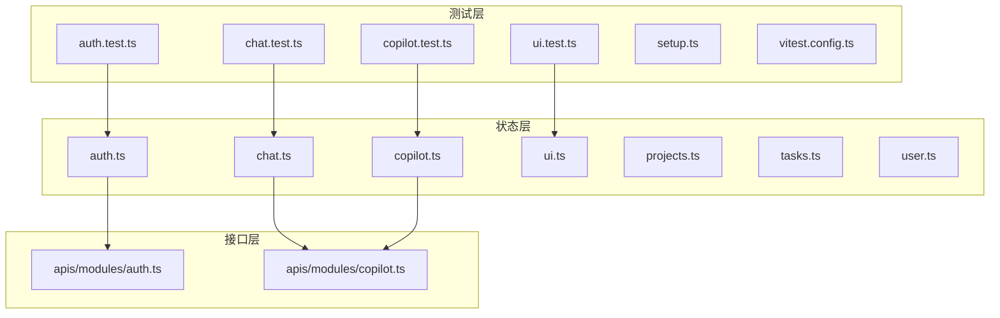
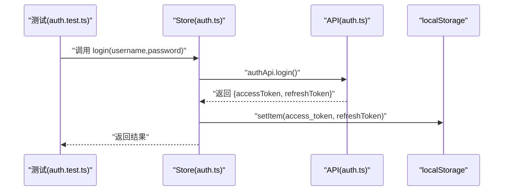
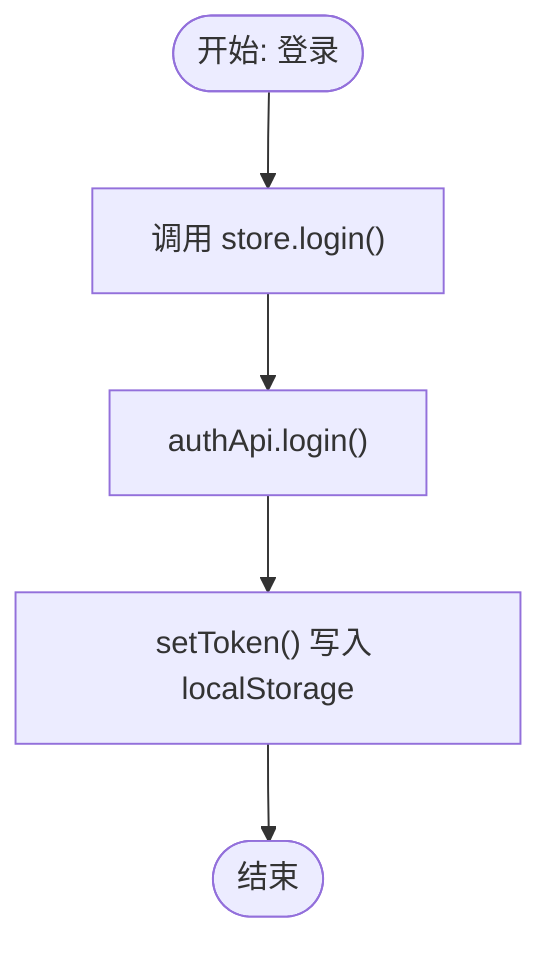
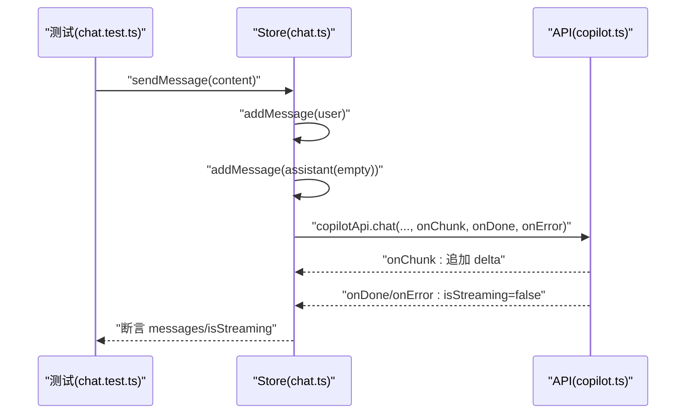
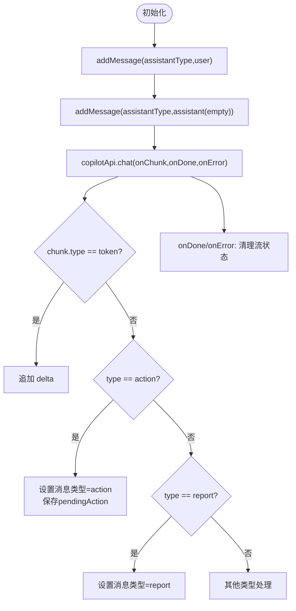
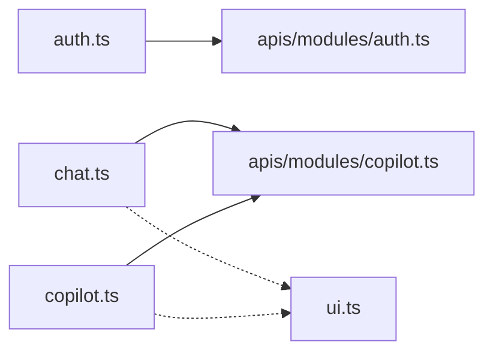

# 状态管理测试

<cite>
**本文引用的文件**
- [workspace/web/src/stores/auth.ts](file://workspace/web/src/stores/auth.ts)
- [workspace/web/src/stores/chat.ts](file://workspace/web/src/stores/chat.ts)
- [workspace/web/src/stores/copilot.ts](file://workspace/web/src/stores/copilot.ts)
- [workspace/web/src/stores/ui.ts](file://workspace/web/src/stores/ui.ts)
- [workspace/web/src/stores/projects.ts](file://workspace/web/src/stores/projects.ts)
- [workspace/web/src/stores/tasks.ts](file://workspace/web/src/stores/tasks.ts)
- [workspace/web/src/stores/user.ts](file://workspace/web/src/stores/user.ts)
- [workspace/web/src/apis/modules/auth.ts](file://workspace/web/src/apis/modules/auth.ts)
- [workspace/web/src/apis/modules/copilot.ts](file://workspace/web/src/apis/modules/copilot.ts)
- [workspace/web/tests/stores/auth.test.ts](file://workspace/web/tests/stores/auth.test.ts)
- [workspace/web/tests/stores/chat.test.ts](file://workspace/web/tests/stores/chat.test.ts)
- [workspace/web/tests/stores/copilot.test.ts](file://workspace/web/tests/stores/copilot.test.ts)
- [workspace/web/tests/stores/ui.test.ts](file://workspace/web/tests/stores/ui.test.ts)
- [workspace/web/tests/setup.ts](file://workspace/web/tests/setup.ts)
- [workspace/web/vitest.config.ts](file://workspace/web/vitest.config.ts)
</cite>

## 目录
1. [引言](#引言)
2. [项目结构](#项目结构)
3. [核心组件](#核心组件)
4. [架构总览](#架构总览)
5. [详细组件分析](#详细组件分析)
6. [依赖关系分析](#依赖关系分析)
7. [性能考量](#性能考量)
8. [故障排查指南](#故障排查指南)
9. [结论](#结论)
10. [附录](#附录)

## 引言
本文件面向FDE工作台前端的Pinia状态管理测试，系统性阐述Store的单元测试策略与最佳实践，覆盖以下主题：
- 状态初始化测试：验证初始值与默认行为
- Action调用测试：同步与异步动作的行为验证
- Getter计算属性测试：基于响应式状态的派生值校验
- 状态变更验证测试：断言状态在Action后的正确变化
- 异步Action测试：SSE流式数据、错误处理与完成回调
- 状态持久化与同步：本地存储与全局状态一致性
- Store间依赖测试：多Store协作与消息传递
- 副作用测试：通知、加载态、主题切换等UI副作用
- 状态重置测试：清理会话、清空消息、恢复默认值
- 调试技巧与覆盖率配置：Vitest环境、别名与Mock策略

## 项目结构
本项目的状态管理位于前端工程的stores目录，围绕认证(auth)、聊天(chat)、智能体(Copilot)、UI(ui)、项目(projects)、任务(tasks)、用户(user)等模块组织。测试文件集中于tests/stores目录，使用Vitest进行单元测试，并通过setup.ts统一配置浏览器环境与全局Mock。

图表来源
- [workspace/web/tests/stores/auth.test.ts:1-63](file://workspace/web/tests/stores/auth.test.ts#L1-L63)
- [workspace/web/tests/stores/chat.test.ts:1-112](file://workspace/web/tests/stores/chat.test.ts#L1-L112)
- [workspace/web/tests/stores/copilot.test.ts:1-128](file://workspace/web/tests/stores/copilot.test.ts#L1-L128)
- [workspace/web/tests/stores/ui.test.ts:1-63](file://workspace/web/tests/stores/ui.test.ts#L1-L63)
- [workspace/web/tests/setup.ts:1-36](file://workspace/web/tests/setup.ts#L1-L36)
- [workspace/web/vitest.config.ts:1-26](file://workspace/web/vitest.config.ts#L1-L26)
- [workspace/web/src/stores/auth.ts:1-56](file://workspace/web/src/stores/auth.ts#L1-L56)
- [workspace/web/src/stores/chat.ts:1-147](file://workspace/web/src/stores/chat.ts#L1-L147)
- [workspace/web/src/stores/copilot.ts:1-184](file://workspace/web/src/stores/copilot.ts#L1-L184)
- [workspace/web/src/stores/ui.ts:1-86](file://workspace/web/src/stores/ui.ts#L1-L86)
- [workspace/web/src/stores/projects.ts:1-102](file://workspace/web/src/stores/projects.ts#L1-L102)
- [workspace/web/src/stores/tasks.ts:1-85](file://workspace/web/src/stores/tasks.ts#L1-L85)
- [workspace/web/src/stores/user.ts:1-36](file://workspace/web/src/stores/user.ts#L1-L36)
- [workspace/web/src/apis/modules/auth.ts:1-14](file://workspace/web/src/apis/modules/auth.ts#L1-L14)
- [workspace/web/src/apis/modules/copilot.ts:1-40](file://workspace/web/src/apis/modules/copilot.ts#L1-L40)

章节来源
- [workspace/web/vitest.config.ts:1-26](file://workspace/web/vitest.config.ts#L1-L26)
- [workspace/web/tests/setup.ts:1-36](file://workspace/web/tests/setup.ts#L1-L36)

## 核心组件
本节概述四个核心Store（auth、chat、copilot、ui）的职责与测试关注点：
- 认证(auth)：令牌管理、登录/登出、刷新、用户信息持久化
- 聊天(chat)：消息列表、模式切换、引用管理、SSE流式回复
- 智能体(copilot)：多助手会话、消息分组、待确认动作、SSE流式回复
- UI(ui)：主题、侧边栏、Copilot面板可见性、全局加载态、通知

章节来源
- [workspace/web/src/stores/auth.ts:1-56](file://workspace/web/src/stores/auth.ts#L1-L56)
- [workspace/web/src/stores/chat.ts:1-147](file://workspace/web/src/stores/chat.ts#L1-L147)
- [workspace/web/src/stores/copilot.ts:1-184](file://workspace/web/src/stores/copilot.ts#L1-L184)
- [workspace/web/src/stores/ui.ts:1-86](file://workspace/web/src/stores/ui.ts#L1-L86)

## 架构总览
下图展示Store与API层的交互关系，以及测试中常用的Mock策略（如SSE与HTTP）：

图表来源
- [workspace/web/tests/stores/auth.test.ts:25-37](file://workspace/web/tests/stores/auth.test.ts#L25-L37)
- [workspace/web/src/stores/auth.ts:23-27](file://workspace/web/src/stores/auth.ts#L23-L27)
- [workspace/web/src/apis/modules/auth.ts:4-12](file://workspace/web/src/apis/modules/auth.ts#L4-L12)

## 详细组件分析

### 认证Store（auth）测试策略
- 初始化测试：检查token、refreshToken、user初始值与认证状态计算属性
- 登录测试：模拟登录API返回，断言setToken被调用并写入localStorage
- 刷新测试：无刷新令牌时抛错；有令牌时调用刷新API并更新token
- 登出测试：清空token、refreshToken、user并移除localStorage项
- 状态持久化：验证localStorage与store状态的一致性

图表来源
- [workspace/web/src/stores/auth.ts:23-27](file://workspace/web/src/stores/auth.ts#L23-L27)
- [workspace/web/src/stores/auth.ts:14-21](file://workspace/web/src/stores/auth.ts#L14-L21)

章节来源
- [workspace/web/tests/stores/auth.test.ts:12-23](file://workspace/web/tests/stores/auth.test.ts#L12-L23)
- [workspace/web/tests/stores/auth.test.ts:25-37](file://workspace/web/tests/stores/auth.test.ts#L25-L37)
- [workspace/web/tests/stores/auth.test.ts:39-48](file://workspace/web/tests/stores/auth.test.ts#L39-L48)
- [workspace/web/tests/stores/auth.test.ts:50-61](file://workspace/web/tests/stores/auth.test.ts#L50-L61)

### 聊天Store（chat）测试策略
- 初始化测试：messages为空、mode为free、sessionId存在
- 添加消息：断言消息数组长度与内容
- 清空消息：断言messages清空且sessionId重置
- 模式切换：断言mode在free/task/report之间切换
- 引用管理：去重、添加、删除、清空
- 异步发送消息：Mock copilotApi.chat，断言先添加用户消息，再添加空助理消息，流式更新content，结束或错误时isStreaming复位

图表来源
- [workspace/web/tests/stores/chat.test.ts:108-126](file://workspace/web/tests/stores/chat.test.ts#L108-L126)
- [workspace/web/src/stores/chat.ts:55-128](file://workspace/web/src/stores/chat.ts#L55-L128)
- [workspace/web/src/apis/modules/copilot.ts:13-20](file://workspace/web/src/apis/modules/copilot.ts#L13-L20)

章节来源
- [workspace/web/tests/stores/chat.test.ts:11-26](file://workspace/web/tests/stores/chat.test.ts#L11-L26)
- [workspace/web/tests/stores/chat.test.ts:28-41](file://workspace/web/tests/stores/chat.test.ts#L28-L41)
- [workspace/web/tests/stores/chat.test.ts:43-60](file://workspace/web/tests/stores/chat.test.ts#L43-L60)
- [workspace/web/tests/stores/chat.test.ts:62-74](file://workspace/web/tests/stores/chat.test.ts#L62-L74)
- [workspace/web/tests/stores/chat.test.ts:76-110](file://workspace/web/tests/stores/chat.test.ts#L76-L110)

### 智能体Store（copilot）测试策略
- 初始化测试：按助手类型messages为空、sessionIds存在、pendingAction为null
- 添加消息：按助手类型区分，断言消息角色与内容
- 清理会话：仅清空指定助手的消息，不影响其他助手
- 取消动作：断言pendingAction被清空
- 发送消息：Mock copilotApi.chat，断言先添加用户消息，再准备空助理消息槽，流式更新content并根据类型设置消息元数据

图表来源
- [workspace/web/tests/stores/copilot.test.ts:108-126](file://workspace/web/tests/stores/copilot.test.ts#L108-L126)
- [workspace/web/src/stores/copilot.ts:48-137](file://workspace/web/src/stores/copilot.ts#L48-L137)
- [workspace/web/src/apis/modules/copilot.ts:13-20](file://workspace/web/src/apis/modules/copilot.ts#L13-L20)

章节来源
- [workspace/web/tests/stores/copilot.test.ts:11-30](file://workspace/web/tests/stores/copilot.test.ts#L11-L30)
- [workspace/web/tests/stores/copilot.test.ts:32-63](file://workspace/web/tests/stores/copilot.test.ts#L32-L63)
- [workspace/web/tests/stores/copilot.test.ts:65-95](file://workspace/web/tests/stores/copilot.test.ts#L65-L95)
- [workspace/web/tests/stores/copilot.test.ts:97-106](file://workspace/web/tests/stores/copilot.test.ts#L97-L106)
- [workspace/web/tests/stores/copilot.test.ts:108-126](file://workspace/web/tests/stores/copilot.test.ts#L108-L126)

### UI Store（ui）测试策略
- 初始化测试：theme为light、sidebarCollapsed为false、copilotOpen为true
- 主题切换：toggleTheme在light/dark之间切换
- Copilot面板可见性：toggleCopilot在true/false之间切换
- 侧边栏切换：toggleSidebar与setSidebarCollapsed
- 全局加载态：setGlobalLoading
- 通知：addNotification、removeNotification、clearNotifications

章节来源
- [workspace/web/tests/stores/ui.test.ts:11-26](file://workspace/web/tests/stores/ui.test.ts#L11-L26)
- [workspace/web/tests/stores/ui.test.ts:28-43](file://workspace/web/tests/stores/ui.test.ts#L28-L43)
- [workspace/web/tests/stores/ui.test.ts:45-52](file://workspace/web/tests/stores/ui.test.ts#L45-L52)
- [workspace/web/tests/stores/ui.test.ts:54-61](file://workspace/web/tests/stores/ui.test.ts#L54-L61)

### 项目与任务Store（projects/tasks）测试策略
- 项目Store：加载项目列表、获取单个项目、成员与里程碑加载、增删改查
- 任务Store：任务列表、看板数据分组、增删改查
- 测试要点：异步加载时loading与error状态、数据聚合与过滤、错误捕获与finally复位

章节来源
- [workspace/web/src/stores/projects.ts:18-29](file://workspace/web/src/stores/projects.ts#L18-L29)
- [workspace/web/src/stores/projects.ts:31-40](file://workspace/web/src/stores/projects.ts#L31-L40)
- [workspace/web/src/stores/projects.ts:42-58](file://workspace/web/src/stores/projects.ts#L42-L58)
- [workspace/web/src/stores/projects.ts:60-84](file://workspace/web/src/stores/projects.ts#L60-L84)
- [workspace/web/src/stores/tasks.ts:18-29](file://workspace/web/src/stores/tasks.ts#L18-L29)
- [workspace/web/src/stores/tasks.ts:32-49](file://workspace/web/src/stores/tasks.ts#L32-L49)
- [workspace/web/src/stores/tasks.ts:51-69](file://workspace/web/src/stores/tasks.ts#L51-L69)

### 用户Store（user）测试策略
- 偏好设置与系统设置：语言、时区、日期格式、通知开关、主题、侧边栏、Copilot可见性
- 更新方法：updatePreferences与updateSettings支持部分字段合并

章节来源
- [workspace/web/src/stores/user.ts:22-28](file://workspace/web/src/stores/user.ts#L22-L28)

## 依赖关系分析
- Store到API：auth与copilot分别依赖对应API模块；chat与copilot共享SSE通道
- Store间耦合：chat与copilot均依赖copilotApi；ui独立但影响chat/copilot的可见性与加载态
- 测试隔离：每个Store的测试文件独立，通过createPinia与setActivePinia确保测试隔离

图表来源
- [workspace/web/src/stores/auth.ts:1-56](file://workspace/web/src/stores/auth.ts#L1-L56)
- [workspace/web/src/stores/chat.ts:1-147](file://workspace/web/src/stores/chat.ts#L1-L147)
- [workspace/web/src/stores/copilot.ts:1-184](file://workspace/web/src/stores/copilot.ts#L1-L184)
- [workspace/web/src/stores/ui.ts:1-86](file://workspace/web/src/stores/ui.ts#L1-L86)
- [workspace/web/src/apis/modules/auth.ts:1-14](file://workspace/web/src/apis/modules/auth.ts#L1-L14)
- [workspace/web/src/apis/modules/copilot.ts:1-40](file://workspace/web/src/apis/modules/copilot.ts#L1-L40)

## 性能考量
- 测试并发：避免在单测中并发触发大量异步操作，建议串行或分批执行
- Mock粒度：优先MockAPI层，减少真实网络请求带来的不稳定因素
- 状态快照：对复杂状态（如messages）使用浅拷贝快照，避免深层引用导致断言误判
- 清理：每个测试用例结束后清理store状态与全局Mock，防止跨用例污染

## 故障排查指南
- 环境问题：确保Vitest使用jsdom环境与setup.ts中的全局Mock（localStorage、matchMedia、ResizeObserver）
- 别名解析：Vitest配置了@、@apis、@stores等路径别名，测试文件需保持与别名一致
- 覆盖率：开启v8覆盖率，结合HTML报告定位未覆盖分支
- 常见失败场景：
  - SSE未触发：检查onChunk/onDone/onError是否被调用，必要时在测试中手动触发回调
  - 令牌未持久化：断言localStorage.setItem被调用，或直接断言store.token与localStorage一致
  - 多Store协作：当chat依赖copilot会话时，确保在同一测试上下文中共享store实例

章节来源
- [workspace/web/tests/setup.ts:7-36](file://workspace/web/tests/setup.ts#L7-L36)
- [workspace/web/vitest.config.ts:7-16](file://workspace/web/vitest.config.ts#L7-L16)

## 结论
通过上述测试策略与最佳实践，可以系统地保障FDE工作台Pinia状态管理的正确性与稳定性。建议在新增功能时同步补充单元测试，并持续优化Mock与断言策略，提升测试可维护性与覆盖率。

## 附录
- 测试运行：使用Vitest命令执行tests/stores下的测试文件
- 扩展建议：为projects与tasks增加更多边界条件与错误处理测试；为auth增加刷新令牌失败的场景测试