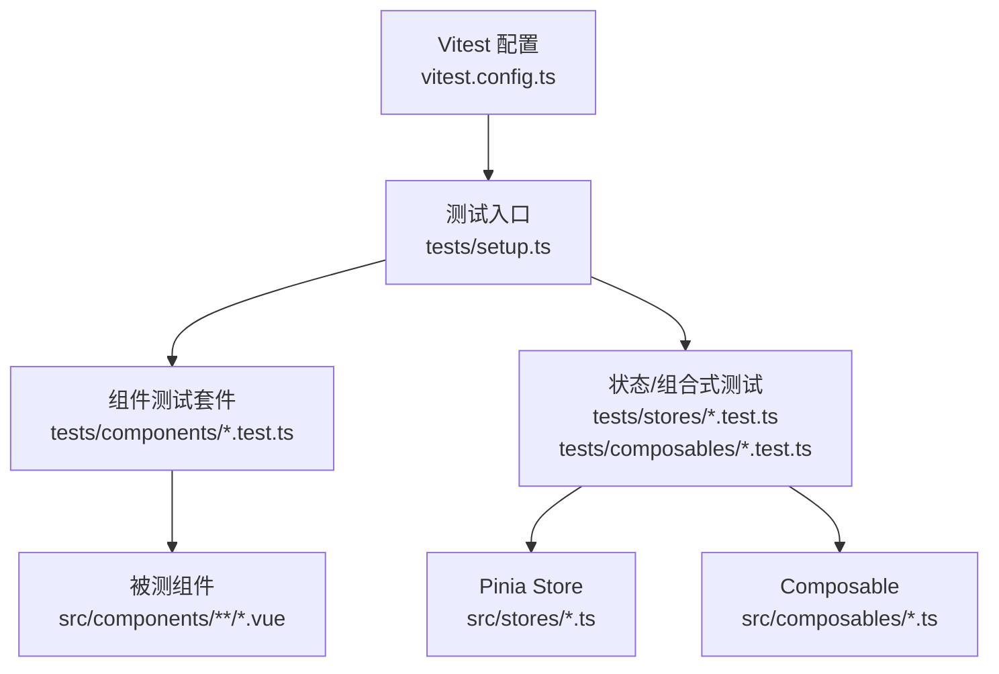
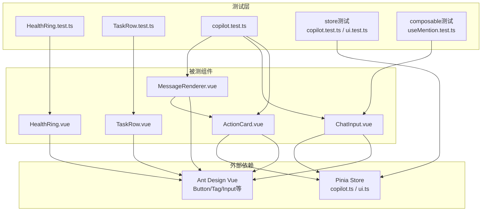
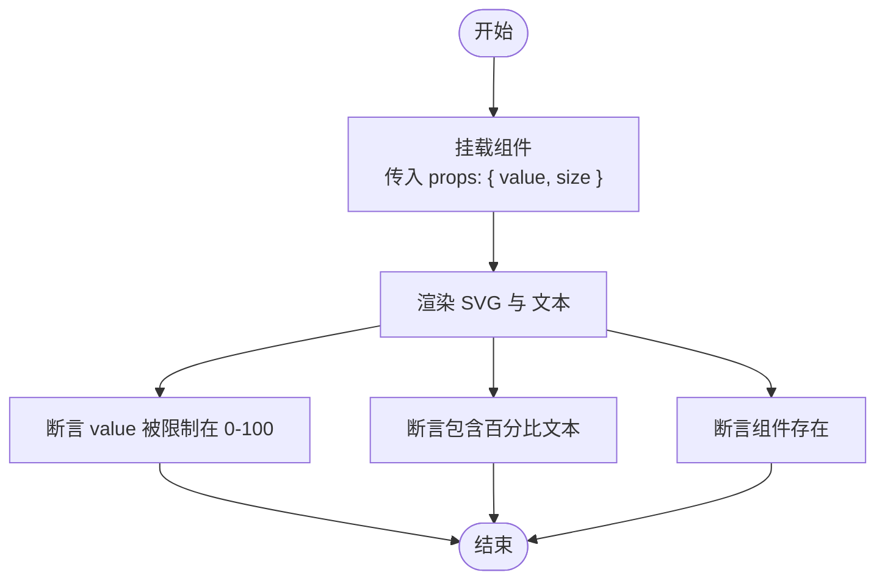
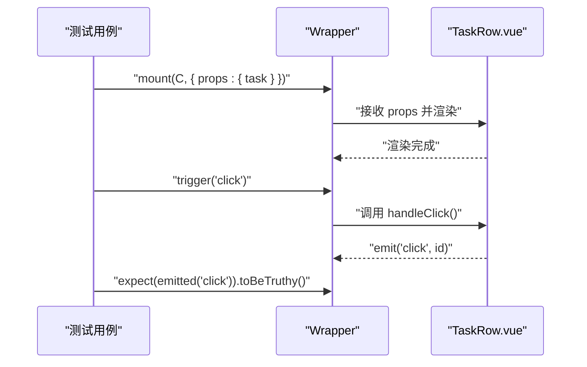
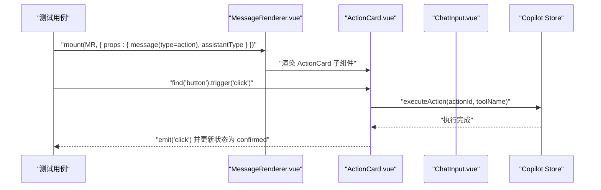
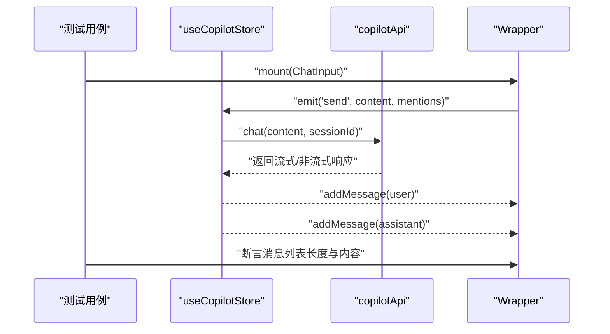
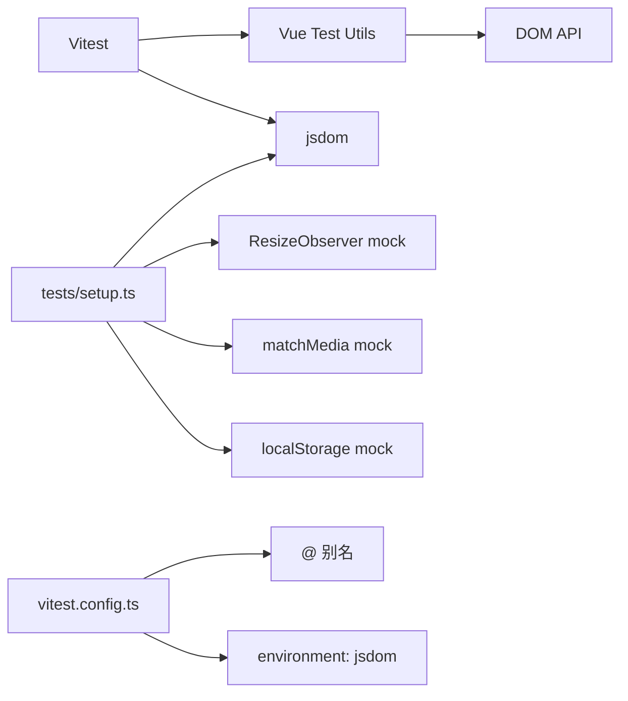

# 组件测试

<cite>
**本文档引用的文件**
- [HealthRing.test.ts](file://workspace/web/tests/components/HealthRing.test.ts)
- [TaskRow.test.ts](file://workspace/web/tests/components/TaskRow.test.ts)
- [copilot.test.ts](file://workspace/web/tests/components/copilot.test.ts)
- [setup.ts](file://workspace/web/tests/setup.ts)
- [vitest.config.ts](file://workspace/web/vitest.config.ts)
- [package.json](file://workspace/web/package.json)
- [HealthRing.vue](file://workspace/web/src/components/common/HealthRing.vue)
- [TaskRow.vue](file://workspace/web/src/components/business/TaskRow.vue)
- [MessageRenderer.vue](file://workspace/web/src/components/copilot/MessageRenderer.vue)
- [ChatInput.vue](file://workspace/web/src/components/copilot/ChatInput.vue)
- [ActionCard.vue](file://workspace/web/src/components/copilot/cards/ActionCard.vue)
- [copilot.test.ts（store）](file://workspace/web/tests/stores/copilot.test.ts)
- [ui.test.ts](file://workspace/web/tests/stores/ui.test.ts)
- [useMention.test.ts](file://workspace/web/tests/composables/useMention.test.ts)
</cite>

## 目录
1. [简介](#简介)
2. [项目结构](#项目结构)
3. [核心组件](#核心组件)
4. [架构总览](#架构总览)
5. [详细组件分析](#详细组件分析)
6. [依赖关系分析](#依赖关系分析)
7. [性能考量](#性能考量)
8. [故障排查指南](#故障排查指南)
9. [结论](#结论)
10. [附录](#附录)

## 简介
本文件面向FDE工作台前端团队，系统化梳理Vue组件的单元测试策略与实践，覆盖组件渲染、props校验、事件触发、生命周期钩子、组件间通信、插槽与条件渲染等场景，并结合仓库内现有测试用例（HealthRing、TaskRow、Copilot系列组件）给出可复用的测试方法论与最佳实践。测试框架采用Vitest + Vue Test Utils，环境为jsdom，配合Pinia状态管理与Ant Design Vue生态。

## 项目结构
- 测试入口与配置
  - Vitest配置：定义环境、别名、覆盖率与setupFiles。
  - 测试初始化：统一stub、matchMedia、ResizeObserver、localStorage等浏览器API的mock。
- 组件测试
  - 常用组件：HealthRing、TaskRow。
  - Copilot相关：MessageRenderer、ChatInput、ActionCard。
  - 状态与组合式：Pinia store与composable测试。
- 依赖与脚本
  - 通过package.json中的test与test:coverage脚本运行测试与覆盖率统计。

图表来源
- [vitest.config.ts:1-26](file://workspace/web/vitest.config.ts#L1-L26)
- [setup.ts:1-36](file://workspace/web/tests/setup.ts#L1-L36)

章节来源
- [vitest.config.ts:1-26](file://workspace/web/vitest.config.ts#L1-L26)
- [setup.ts:1-36](file://workspace/web/tests/setup.ts#L1-L36)
- [package.json:1-59](file://workspace/web/package.json#L1-L59)

## 核心组件
- HealthRing：健康环形图组件，支持value、size、color等props，内部计算strokeWidth、radius、circumference与dashoffset，用于绘制进度环与显示百分比。
- TaskRow：任务行组件，接收TaskDTO对象，渲染优先级标签、截止日期、状态点，支持选择与点击事件。
- MessageRenderer：Copilot消息渲染器，根据消息类型渲染文本、ActionCard、ReportCard、NextStepsCard或SearchResultsCard。
- ChatInput：聊天输入框，支持@提及、多行输入、回车发送、mentions收集与清理。
- ActionCard：动作卡片，带倒计时、确认/取消、加载态与不同状态样式，依赖Copilot Store执行动作。

章节来源
- [HealthRing.vue:1-113](file://workspace/web/src/components/common/HealthRing.vue#L1-L113)
- [TaskRow.vue:1-109](file://workspace/web/src/components/business/TaskRow.vue#L1-L109)
- [MessageRenderer.vue:1-192](file://workspace/web/src/components/copilot/MessageRenderer.vue#L1-L192)
- [ChatInput.vue:1-110](file://workspace/web/src/components/copilot/ChatInput.vue#L1-L110)
- [ActionCard.vue:1-207](file://workspace/web/src/components/copilot/cards/ActionCard.vue#L1-L207)

## 架构总览
下图展示测试层与被测组件之间的交互关系，以及Pinia在Copilot相关组件中的角色。

图表来源
- [HealthRing.test.ts:1-31](file://workspace/web/tests/components/HealthRing.test.ts#L1-L31)
- [TaskRow.test.ts:1-52](file://workspace/web/tests/components/TaskRow.test.ts#L1-L52)
- [copilot.test.ts:1-156](file://workspace/web/tests/components/copilot.test.ts#L1-L156)
- [copilot.test.ts（store）:1-128](file://workspace/web/tests/stores/copilot.test.ts#L1-L128)
- [ui.test.ts:1-63](file://workspace/web/tests/stores/ui.test.ts#L1-L63)
- [useMention.test.ts:1-48](file://workspace/web/tests/composables/useMention.test.ts#L1-L48)

## 详细组件分析

### HealthRing 组件测试
- 渲染测试
  - 验证传入value时能正确显示百分比文本。
  - 验证传入size属性后组件存在。
- 边界与约束
  - 验证value被限制在0-100区间（例如超过100时显示上限值）。
- 复杂度与性能
  - 计算逻辑集中在computed中，测试应关注渲染输出而非内部算法细节。
- 最佳实践
  - 使用mount而非shallow，确保SVG渲染完整。
  - 对于边界值（负数、>100）分别断言。
  - 可选：断言CSS类随size/color变化。

图表来源
- [HealthRing.test.ts:7-29](file://workspace/web/tests/components/HealthRing.test.ts#L7-L29)
- [HealthRing.vue:34-61](file://workspace/web/src/components/common/HealthRing.vue#L34-L61)

章节来源
- [HealthRing.test.ts:1-31](file://workspace/web/tests/components/HealthRing.test.ts#L1-L31)
- [HealthRing.vue:1-113](file://workspace/web/src/components/common/HealthRing.vue#L1-L113)

### TaskRow 组件测试
- 渲染测试
  - 断言任务标题出现在DOM中。
  - 断言状态徽标元素存在。
- 事件测试
  - 触发点击事件，断言自定义事件被发射。
- Props与状态
  - 传入task对象（含id、title、status、priority、assignee、due_at），断言渲染正确。
- 最佳实践
  - 使用真实数据结构（TaskDTO）构造props，避免遗漏字段。
  - 对selected状态切换事件进行独立测试。

图表来源
- [TaskRow.test.ts:37-50](file://workspace/web/tests/components/TaskRow.test.ts#L37-L50)
- [TaskRow.vue:52-58](file://workspace/web/src/components/business/TaskRow.vue#L52-L58)

章节来源
- [TaskRow.test.ts:1-52](file://workspace/web/tests/components/TaskRow.test.ts#L1-L52)
- [TaskRow.vue:1-109](file://workspace/web/src/components/business/TaskRow.vue#L1-L109)

### Copilot 相关组件测试
- MessageRenderer
  - 用户消息与助手文本消息均能正确渲染。
  - 动作类消息（type为action）渲染为ActionCard。
- ChatInput
  - 输入框存在且可交互。
  - 按Enter键发送消息（忽略空内容）。
  - @提及触发与选择逻辑（通过useMention组合式）。
- ActionCard
  - 渲染预览、参数与严重级别标签。
  - 确认按钮点击后触发store执行动作并进入“已确认”状态；倒计时结束后进入“已过期”。

图表来源
- [copilot.test.ts:9-70](file://workspace/web/tests/components/copilot.test.ts#L9-L70)
- [MessageRenderer.vue:63-67](file://workspace/web/src/components/copilot/MessageRenderer.vue#L63-L67)
- [ActionCard.vue:62-71](file://workspace/web/src/components/copilot/cards/ActionCard.vue#L62-L71)

章节来源
- [copilot.test.ts:1-156](file://workspace/web/tests/components/copilot.test.ts#L1-L156)
- [MessageRenderer.vue:1-192](file://workspace/web/src/components/copilot/MessageRenderer.vue#L1-L192)
- [ChatInput.vue:1-110](file://workspace/web/src/components/copilot/ChatInput.vue#L1-L110)
- [ActionCard.vue:1-207](file://workspace/web/src/components/copilot/cards/ActionCard.vue#L1-L207)

### 组件间通信与状态测试
- Pinia Store（Copilot）
  - 初始化状态：会话ID、消息列表为空、pendingAction为null。
  - 添加消息：区分用户与助手消息，断言消息数量与内容。
  - 清理会话：仅清空指定助手类型的消息，不影响其他类型。
  - 执行动作：ActionCard确认后调用store执行动作并更新状态。
- UI Store
  - 主题切换：light/dark互切。
  - 导航折叠：切换状态。
  - Copilot面板开关：打开/关闭。

图表来源
- [copilot.test.ts（store）:108-126](file://workspace/web/tests/stores/copilot.test.ts#L108-L126)
- [ChatInput.vue:51-57](file://workspace/web/src/components/copilot/ChatInput.vue#L51-L57)

章节来源
- [copilot.test.ts（store）:1-128](file://workspace/web/tests/stores/copilot.test.ts#L1-L128)
- [ui.test.ts:1-63](file://workspace/web/tests/stores/ui.test.ts#L1-L63)

### 插槽与条件渲染测试
- 条件渲染
  - MessageRenderer根据message.type渲染不同类型卡片（text/action/report/nextSteps/searchResults）。
  - ActionCard根据状态（pending/confirmed/expired/cancelled）渲染不同UI。
- 插槽
  - 当前测试未直接覆盖具名插槽；若后续组件引入插槽，建议使用slots选项挂载并断言投影内容。

章节来源
- [MessageRenderer.vue:54-89](file://workspace/web/src/components/copilot/MessageRenderer.vue#L54-L89)
- [ActionCard.vue:89-131](file://workspace/web/src/components/copilot/cards/ActionCard.vue#L89-L131)

## 依赖关系分析
- 测试工具链
  - Vitest提供测试运行与覆盖率；Vue Test Utils用于挂载与交互；jsdom提供DOM环境。
  - setup.ts统一mock浏览器API，避免第三方库对测试环境的干扰。
- 组件依赖
  - Copilot组件依赖Ant Design Vue组件库与Pinia store。
  - ChatInput依赖useMention组合式，负责@提及搜索与收集。
- 配置别名
  - Vitest配置了@、@components、@stores等别名，便于在测试中以绝对路径导入。

图表来源
- [setup.ts:1-36](file://workspace/web/tests/setup.ts#L1-L36)
- [vitest.config.ts:7-26](file://workspace/web/vitest.config.ts#L7-L26)

章节来源
- [setup.ts:1-36](file://workspace/web/tests/setup.ts#L1-L36)
- [vitest.config.ts:1-26](file://workspace/web/vitest.config.ts#L1-L26)
- [package.json:1-59](file://workspace/web/package.json#L1-L59)

## 性能考量
- 测试性能
  - 使用fake timers控制ActionCard倒计时，避免真实等待时间。
  - 合理使用flushPromises处理异步流程（如store中API调用）。
- 渲染性能
  - 对于HealthRing等纯展示组件，优先断言输出而非内部计算细节。
  - 避免在单个测试中多次mount同一组件，复用wrapper可减少开销。
- 覆盖率
  - 通过vitest --coverage生成报告，关注分支与语句覆盖率，重点补齐条件渲染与错误路径。

章节来源
- [copilot.test.ts:112-115](file://workspace/web/tests/components/copilot.test.ts#L112-L115)
- [ActionCard.vue:79-85](file://workspace/web/src/components/copilot/cards/ActionCard.vue#L79-L85)

## 故障排查指南
- 常见问题
  - 缺少Pinia环境：Copilot相关组件需在beforeEach中激活Pinia。
  - 未mock浏览器API：出现matchMedia/ResizeObserver报错时检查setup.ts。
  - 异步未处理：store中API调用需await并flushPromises。
  - 事件未触发：确保使用Wrapper.trigger并断言emitted数组。
- 定位手段
  - 在测试中打印wrapper.html()或wrapper.find(...).element.outerHTML辅助定位。
  - 对复杂逻辑（如@提及）拆分为独立测试，逐步缩小范围。

章节来源
- [copilot.test.ts:10-12](file://workspace/web/tests/components/copilot.test.ts#L10-L12)
- [setup.ts:7-36](file://workspace/web/tests/setup.ts#L7-L36)
- [copilot.test.ts（store）:108-126](file://workspace/web/tests/stores/copilot.test.ts#L108-L126)

## 结论
本测试体系以Vitest为核心，结合Vue Test Utils与jsdom，覆盖了渲染、事件、生命周期、状态与组合式功能。针对HealthRing、TaskRow与Copilot系列组件，已形成可复用的测试模板：props校验、事件发射、条件渲染与状态流转。建议持续完善覆盖率，补充插槽与更复杂的边界场景，并保持setup.ts与vitest.config.ts的一致性以降低环境差异带来的不确定性。

## 附录
- 快照测试建议
  - 对于静态组件（如HealthRing、StatusDot），可使用toMatchSnapshot记录DOM结构，便于回归。
  - 注意：当前仓库未包含快照测试文件，可在后续扩展。
- 行为测试清单
  - 渲染：props存在性、默认值、类名拼接。
  - 事件：点击、键盘、输入变更。
  - 生命周期：onMounted/onUnmounted定时器清理、副作用释放。
  - 状态：store初始值、消息增删、动作执行与过期。
  - 组合式：useMention的添加、去重、清空。
- 命令参考
  - 运行测试：npm run test
  - 生成覆盖率：npm run test:coverage