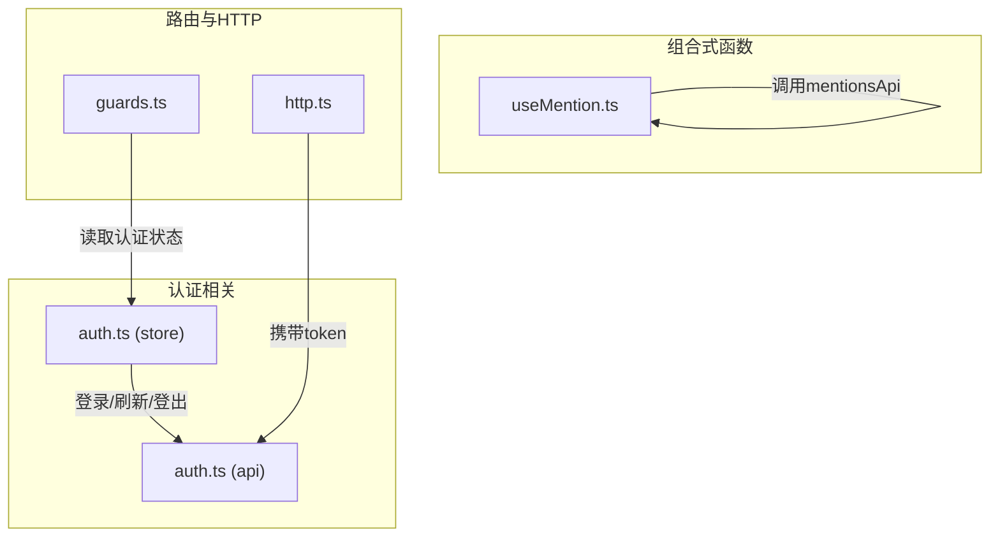
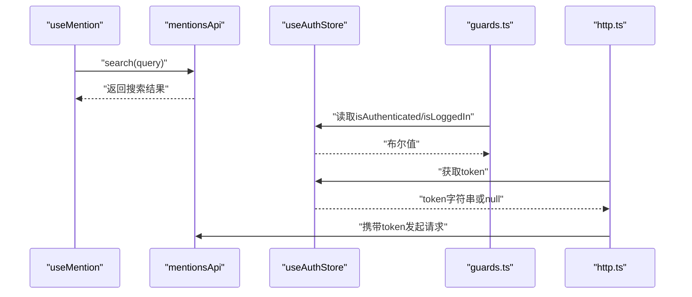
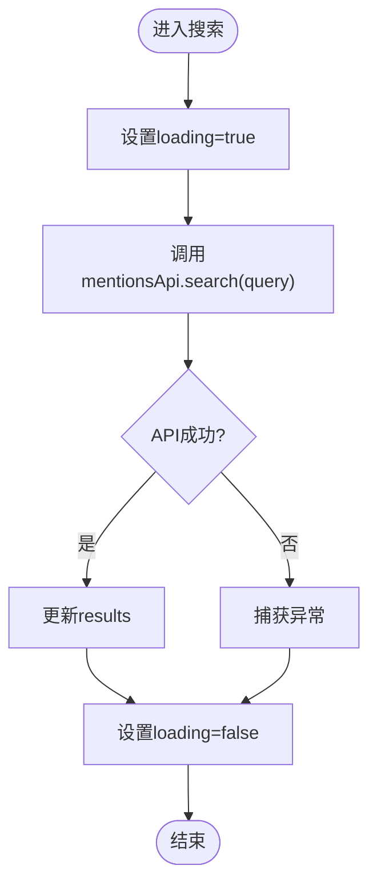
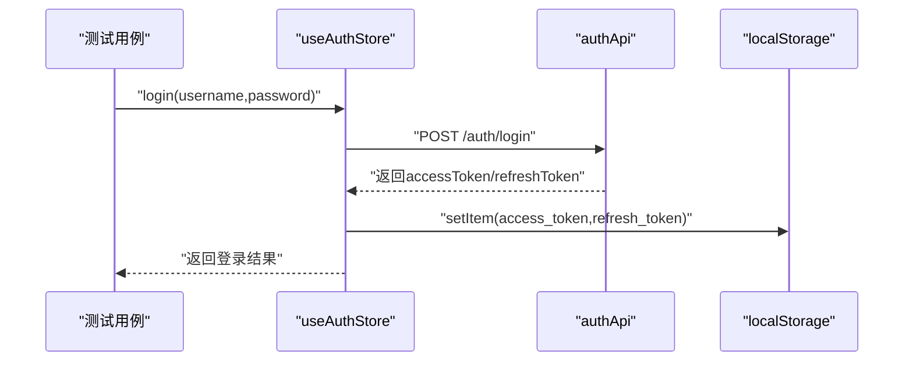
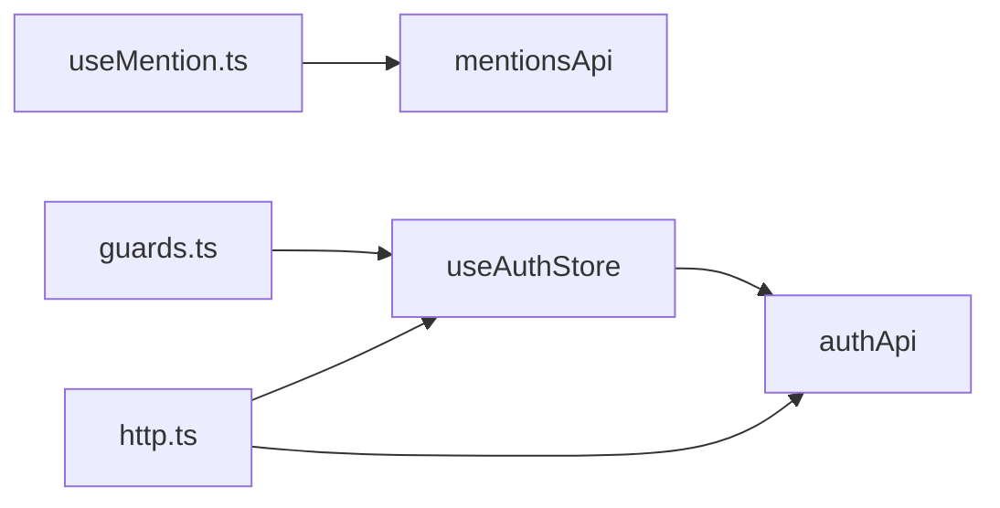

# 组合式函数测试

<cite>
**本文引用的文件**
- [useMention.ts](file://workspace/web/src/composables/useMention.ts)
- [useMention.test.ts](file://workspace/web/tests/composables/useMention.test.ts)
- [useAuth.test.ts](file://workspace/web/tests/composables/useAuth.test.ts)
- [auth.ts](file://workspace/web/src/stores/auth.ts)
- [auth.ts](file://workspace/web/src/apis/modules/auth.ts)
- [guards.ts](file://workspace/web/src/router/guards.ts)
- [http.ts](file://workspace/web/src/apis/http.ts)
- [auth.test.ts](file://workspace/web/tests/stores/auth.test.ts)
</cite>

## 目录
1. [简介](#简介)
2. [项目结构](#项目结构)
3. [核心组件](#核心组件)
4. [架构概览](#架构概览)
5. [详细组件分析](#详细组件分析)
6. [依赖分析](#依赖分析)
7. [性能考虑](#性能考虑)
8. [故障排查指南](#故障排查指南)
9. [结论](#结论)
10. [附录](#附录)

## 简介
本文件面向FDE工作台的Vue组合式函数测试，重点覆盖以下主题：
- 测试策略：针对useAuth（以store形式存在）、useMention等组合式函数的单元测试、集成测试与依赖模拟策略
- 关键能力验证：响应式数据、计算属性、副作用与生命周期行为
- 组件集成测试：如何验证组合式函数与组件的协作
- 错误处理与异步操作：断言错误路径与异步状态变化
- 最佳实践与常见场景：覆盖初始化、交互、清理与边界条件

## 项目结构
本项目的前端位于workspace/web，测试位于tests目录。与本文相关的结构要点如下：
- 组合式函数位于src/composables，如useMention.ts
- 认证相关逻辑以Pinia Store形式存在，位于src/stores/auth.ts
- API层位于src/apis/modules，如auth.ts
- 路由守卫与HTTP拦截器中使用认证状态，位于src/router/guards.ts与src/apis/http.ts
- 测试文件位于tests/composables与tests/stores

图表来源
- [useMention.ts:1-63](file://workspace/web/src/composables/useMention.ts#L1-L63)
- [auth.ts:1-56](file://workspace/web/src/stores/auth.ts#L1-L56)
- [auth.ts:1-14](file://workspace/web/src/apis/modules/auth.ts#L1-L14)
- [guards.ts:1-10](file://workspace/web/src/router/guards.ts#L1-L10)
- [http.ts:1-40](file://workspace/web/src/apis/http.ts#L1-L40)

章节来源
- [useMention.ts:1-63](file://workspace/web/src/composables/useMention.ts#L1-L63)
- [auth.ts:1-56](file://workspace/web/src/stores/auth.ts#L1-L56)
- [auth.ts:1-14](file://workspace/web/src/apis/modules/auth.ts#L1-L14)
- [guards.ts:1-10](file://workspace/web/src/router/guards.ts#L1-L10)
- [http.ts:1-40](file://workspace/web/src/apis/http.ts#L1-L40)

## 核心组件
- useMention：提供@提及功能的组合式函数，包含响应式结果集、加载状态、选中项集合以及搜索、添加、移除、清空等方法
- 认证相关（以store形式存在）：useAuthStore提供token管理、登录、刷新、登出与认证状态计算属性

章节来源
- [useMention.ts:12-63](file://workspace/web/src/composables/useMention.ts#L12-L63)
- [auth.ts:6-56](file://workspace/web/src/stores/auth.ts#L6-L56)

## 架构概览
下图展示组合式函数与外部依赖的交互关系，包括API调用、路由守卫与HTTP拦截器：

图表来源
- [useMention.ts:24-32](file://workspace/web/src/composables/useMention.ts#L24-L32)
- [auth.ts:6-56](file://workspace/web/src/stores/auth.ts#L6-L56)
- [guards.ts:1-10](file://workspace/web/src/router/guards.ts#L1-L10)
- [http.ts:1-40](file://workspace/web/src/apis/http.ts#L1-L40)

## 详细组件分析

### useMention 组合式函数测试
- 响应式数据与状态
  - 初始化：selectedMentions为空数组；results包含各类型空列表；loading初始false
  - 搜索：debounce包装的search方法触发，设置loading=true，调用mentionsApi.search，成功后更新results，finally中重置loading=false
  - 选中项管理：addMention去重插入；removeMention按id过滤；clearMentions清空；getMentions返回当前选中项
- 计算属性与副作用
  - 无显式计算属性，但loading作为副作用标志位，用于UI反馈
- 生命周期
  - 该组合式函数不直接管理组件生命周期，但其内部状态会在组件卸载时被销毁（Vue自动）
- 测试策略
  - 单元测试：验证初始化状态、去重行为、清空行为
  - 集成测试：通过mock mentionsApi，验证search方法在不同输入下的行为
  - 异步与错误处理：模拟网络失败，验证loading状态恢复与错误传播
  - 依赖模拟：使用vi.mock或vitest替代mentionsApi，控制返回值与异常

图表来源
- [useMention.ts:24-32](file://workspace/web/src/composables/useMention.ts#L24-L32)

章节来源
- [useMention.ts:12-63](file://workspace/web/src/composables/useMention.ts#L12-L63)
- [useMention.test.ts:1-48](file://workspace/web/tests/composables/useMention.test.ts#L1-L48)

### 认证相关（以store形式存在）测试
- store职责
  - 管理token与refreshToken，持久化到localStorage
  - 提供isAuthenticated、isLoggedIn计算属性
  - 提供login、refresh、logout等方法，内部调用authApi
- 测试策略
  - 单元测试：验证token设置、计算属性状态、登录/刷新/登出流程
  - 集成测试：通过mock authApi，验证登录成功后的token写入与localStorage同步
  - 错误处理：模拟refresh无refreshToken的情况，验证抛错路径
  - 与路由/HTTP集成：验证guards.ts与http.ts在有无token时的行为差异

图表来源
- [auth.ts:23-27](file://workspace/web/src/stores/auth.ts#L23-L27)
- [auth.ts:14-21](file://workspace/web/src/stores/auth.ts#L14-L21)
- [auth.ts:1-14](file://workspace/web/src/apis/modules/auth.ts#L1-L14)

章节来源
- [auth.ts:6-56](file://workspace/web/src/stores/auth.ts#L6-L56)
- [auth.ts:1-14](file://workspace/web/src/apis/modules/auth.ts#L1-L14)
- [guards.ts:1-10](file://workspace/web/src/router/guards.ts#L1-L10)
- [http.ts:1-40](file://workspace/web/src/apis/http.ts#L1-L40)
- [auth.test.ts:1-60](file://workspace/web/tests/stores/auth.test.ts#L1-L60)

### 组合式函数与组件集成测试
- 目标：验证组合式函数与组件的协作，包括事件绑定、状态渲染与副作用触发
- 方法：使用测试框架提供的组件挂载能力，结合组合式函数的返回值进行断言
- 关注点：输入变更（如查询框输入）触发的搜索、UI状态（loading显示/隐藏）、选中项列表渲染

[本节为概念性内容，不直接分析具体文件]

### 错误处理与异步操作测试
- 异步操作：登录、刷新、搜索等均涉及异步调用，需等待Promise完成后再断言状态
- 错误处理：模拟网络异常、服务端错误码，验证错误提示与状态恢复
- 加载状态：确保loading在请求开始时为true，在finally中恢复为false

[本节为概念性内容，不直接分析具体文件]

## 依赖分析
- useMention依赖mentionsApi进行远程搜索，并维护本地响应式状态
- 认证相关依赖authApi进行登录/刷新/登出，并持久化token
- 路由守卫与HTTP拦截器依赖认证状态与token

图表来源
- [useMention.ts:24-28](file://workspace/web/src/composables/useMention.ts#L24-L28)
- [auth.ts:23-34](file://workspace/web/src/stores/auth.ts#L23-L34)
- [guards.ts:1-10](file://workspace/web/src/router/guards.ts#L1-L10)
- [http.ts:1-40](file://workspace/web/src/apis/http.ts#L1-L40)

章节来源
- [useMention.ts:1-63](file://workspace/web/src/composables/useMention.ts#L1-L63)
- [auth.ts:1-56](file://workspace/web/src/stores/auth.ts#L1-L56)
- [guards.ts:1-10](file://workspace/web/src/router/guards.ts#L1-L10)
- [http.ts:1-40](file://workspace/web/src/apis/http.ts#L1-L40)

## 性能考虑
- 防抖搜索：useMention对搜索进行了防抖，减少频繁请求，建议在测试中验证防抖延迟与多次快速输入的行为
- 响应式更新：避免不必要的响应式对象深拷贝，保持selectedMentions与results的轻量结构
- 依赖注入：通过mock替换API层，避免真实网络请求影响测试性能

[本节为一般性指导，不直接分析具体文件]

## 故障排查指南
- 初始化问题：若组合式函数未正确初始化，检查响应式ref与computed的默认值
- 异步状态未恢复：确认finally块是否执行，loading状态是否在异常情况下也能复位
- 依赖未模拟：若测试间出现相互影响，检查是否正确resetModules或隔离测试环境
- 路由守卫失效：若guards.ts判断逻辑异常，检查useAuthStore的计算属性与token状态

章节来源
- [useMention.test.ts:6-8](file://workspace/web/tests/composables/useMention.test.ts#L6-L8)
- [useAuth.test.ts:6-8](file://workspace/web/tests/composables/useAuth.test.ts#L6-L8)

## 结论
- useMention与认证相关逻辑（以store形式存在）均可通过单元测试与集成测试有效验证
- 测试应覆盖响应式数据、计算属性、副作用与异步流程
- 通过mock依赖与隔离测试环境，可稳定地验证组合式函数与组件的协作

[本节为总结性内容，不直接分析具体文件]

## 附录
- 最佳实践清单
  - 使用beforeEach重置模块与全局状态
  - 对异步操作使用await并断言状态变化
  - 对API层进行mock，控制返回值与异常
  - 验证边界条件（重复添加、空输入、无token等）
  - 在组件集成测试中验证UI与组合式函数的交互

[本节为一般性指导，不直接分析具体文件]