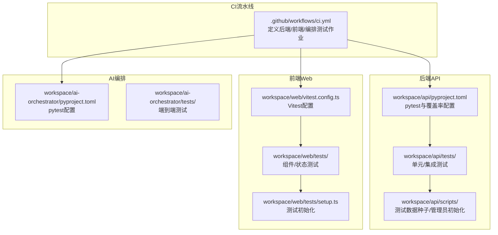
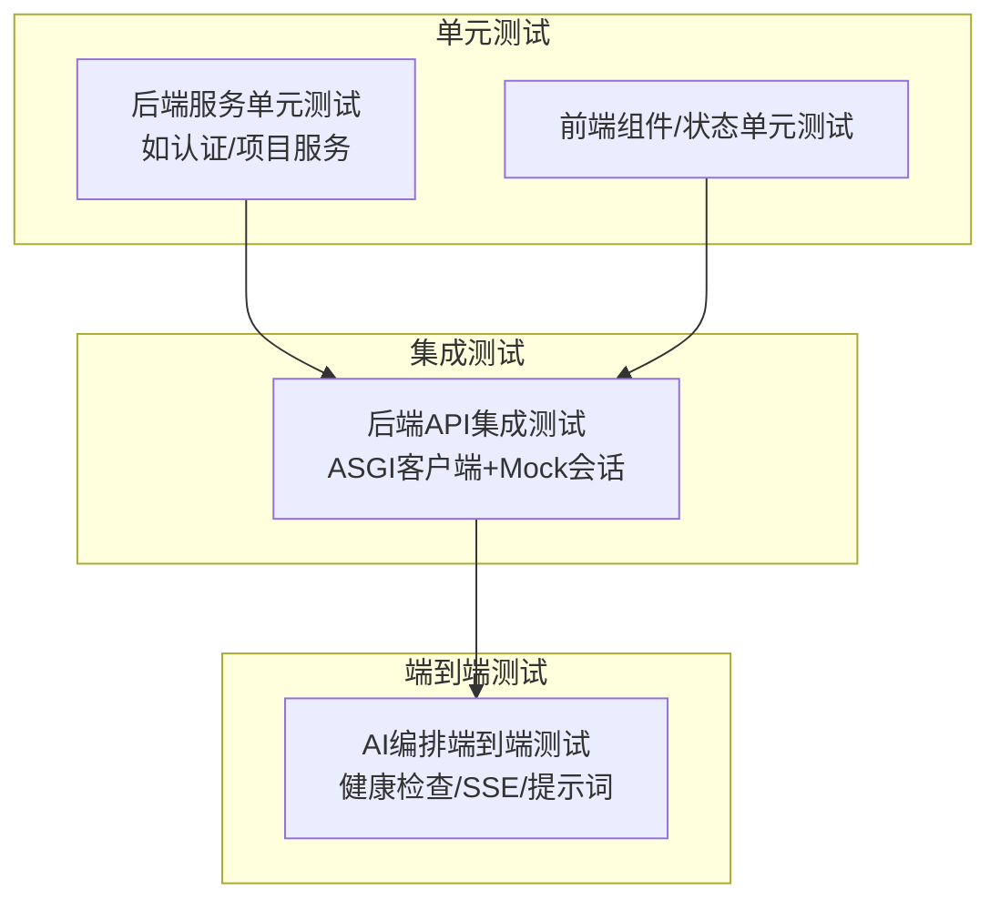
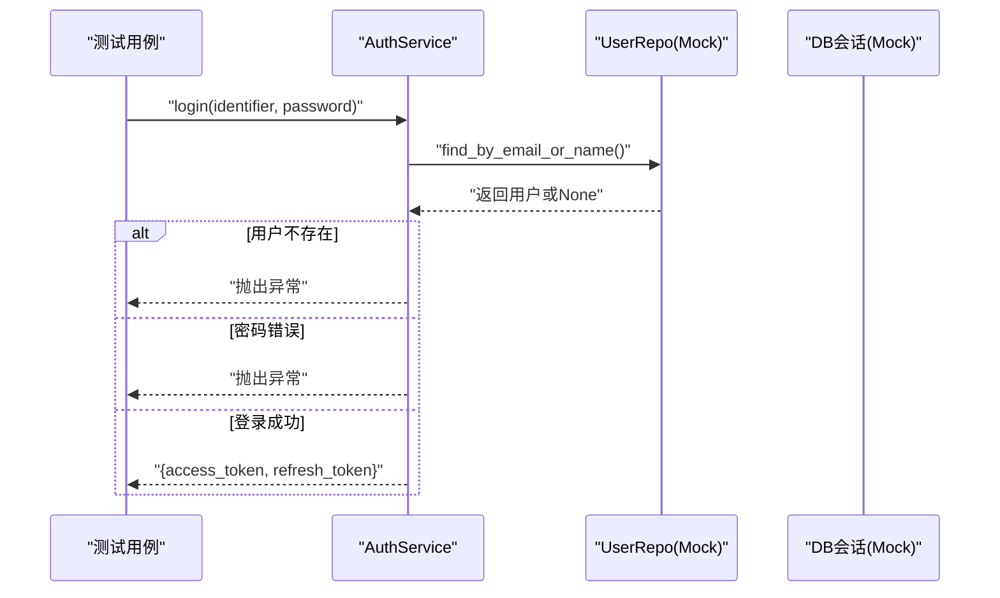
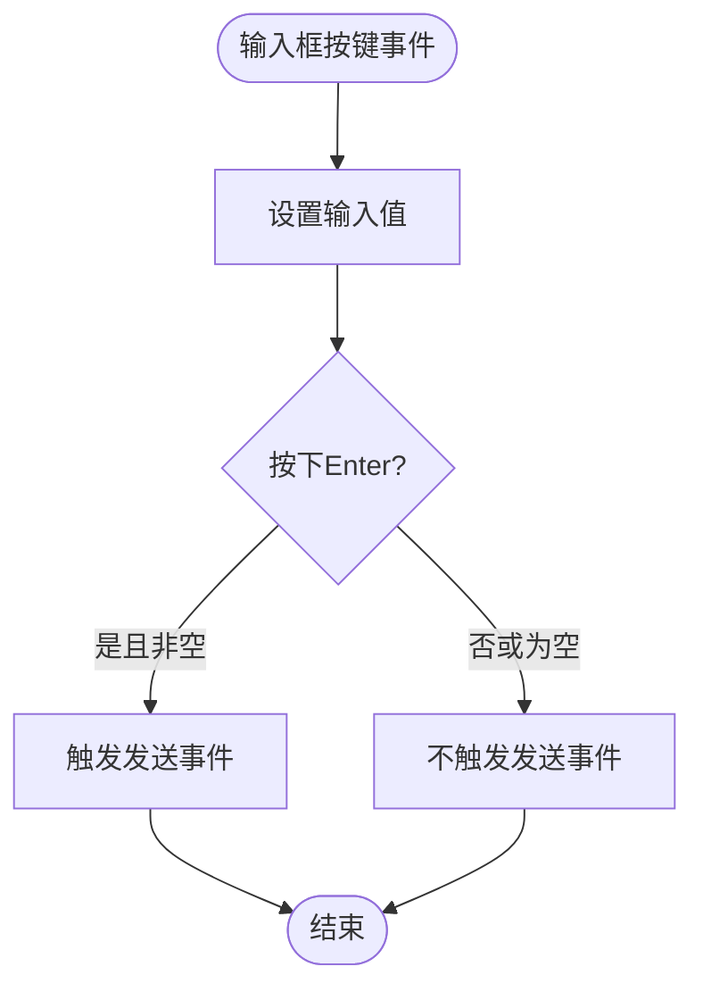
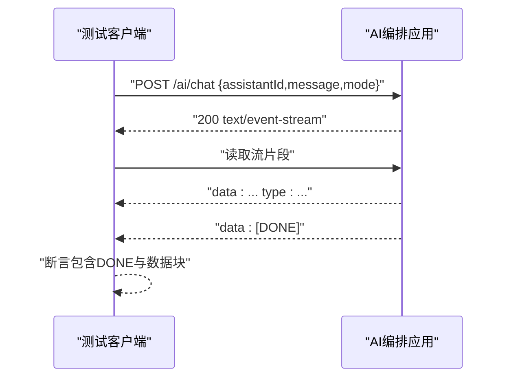
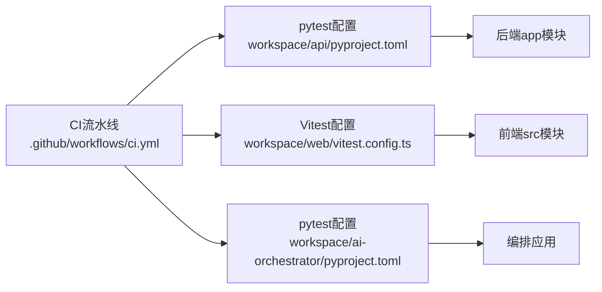

# 测试架构设计

<cite>
**本文引用的文件**
- [.github/workflows/ci.yml](file://.github/workflows/ci.yml)
- [workspace/api/pyproject.toml](file://workspace/api/pyproject.toml)
- [workspace/api/tests/conftest.py](file://workspace/api/tests/conftest.py)
- [workspace/api/tests/integration/conftest.py](file://workspace/api/tests/integration/conftest.py)
- [workspace/api/scripts/seed_test_data.py](file://workspace/api/scripts/seed_test_data.py)
- [workspace/api/scripts/init_admin.py](file://workspace/api/scripts/init_admin.py)
- [workspace/api/tests/services/test_auth_service.py](file://workspace/api/tests/services/test_auth_service.py)
- [workspace/api/tests/services/test_project_service.py](file://workspace/api/tests/services/test_project_service.py)
- [workspace/web/vitest.config.ts](file://workspace/web/vitest.config.ts)
- [workspace/web/tests/setup.ts](file://workspace/web/tests/setup.ts)
- [workspace/web/tests/components/copilot.test.ts](file://workspace/web/tests/components/copilot.test.ts)
- [workspace/web/tests/stores/auth.test.ts](file://workspace/web/tests/stores/auth.test.ts)
- [workspace/ai-orchestrator/pyproject.toml](file://workspace/ai-orchestrator/pyproject.toml)
- [workspace/ai-orchestrator/tests/test_main.py](file://workspace/ai-orchestrator/tests/test_main.py)
</cite>

## 目录
1. [引言](#引言)
2. [项目结构](#项目结构)
3. [核心组件](#核心组件)
4. [架构总览](#架构总览)
5. [详细组件分析](#详细组件分析)
6. [依赖分析](#依赖分析)
7. [性能考虑](#性能考虑)
8. [故障排查指南](#故障排查指南)
9. [结论](#结论)
10. [附录](#附录)

## 引言
本文件面向FDE工作台项目，提供一套完整的测试架构设计文档，覆盖测试金字塔（单元测试、集成测试、端到端测试）的层次关系与职责边界；详述测试环境配置（pytest、Vitest）、测试数据管理策略（生成、清理、隔离）、测试容器化与CI流程，以及测试覆盖率与质量门禁建议。目标是帮助开发与测试团队在保证质量的同时提升交付效率。

## 项目结构
FDE工作台采用多模块并行的工程组织方式，包含后端API服务、前端Web应用、AI编排服务三部分，分别在CI流水线中独立运行测试与构建镜像。测试配置与脚本分布如下：
- 后端API：pytest配置、服务层单元测试、集成测试夹具与HTTP客户端
- 前端Web：Vitest配置、组件与状态管理测试、全局测试初始化
- AI编排：pytest配置、主应用与AI能力的端到端测试

**图表来源**
- [.github/workflows/ci.yml:1-106](file://.github/workflows/ci.yml#L1-L106)
- [workspace/api/pyproject.toml:54-57](file://workspace/api/pyproject.toml#L54-L57)
- [workspace/web/vitest.config.ts:1-26](file://workspace/web/vitest.config.ts#L1-L26)
- [workspace/ai-orchestrator/pyproject.toml:21-23](file://workspace/ai-orchestrator/pyproject.toml#L21-L23)

**章节来源**
- [.github/workflows/ci.yml:1-106](file://.github/workflows/ci.yml#L1-L106)
- [workspace/api/pyproject.toml:54-57](file://workspace/api/pyproject.toml#L54-L57)
- [workspace/web/vitest.config.ts:1-26](file://workspace/web/vitest.config.ts#L1-L26)
- [workspace/ai-orchestrator/pyproject.toml:21-23](file://workspace/ai-orchestrator/pyproject.toml#L21-L23)

## 核心组件
- 测试框架与工具
  - 后端：pytest + pytest-asyncio + pytest-cov（覆盖率）
  - 前端：Vitest（jsdom环境、v8覆盖率）
  - AI编排：pytest（异步HTTP客户端）
- 测试夹具与共享资源
  - 后端：单元/集成测试共享的数据库会话与模型样例
  - 前端：Vue Test Utils全局配置、window与DOM API模拟
- 测试数据与环境
  - 种子数据脚本：批量生成用户、项目、任务、客户、文件等测试数据
  - 管理员初始化脚本：确保默认管理员存在
  - CI环境变量：JWT密钥等

**章节来源**
- [workspace/api/pyproject.toml:29-57](file://workspace/api/pyproject.toml#L29-L57)
- [workspace/web/vitest.config.ts:7-16](file://workspace/web/vitest.config.ts#L7-L16)
- [workspace/web/tests/setup.ts:1-36](file://workspace/web/tests/setup.ts#L1-L36)
- [workspace/api/scripts/seed_test_data.py:1-245](file://workspace/api/scripts/seed_test_data.py#L1-L245)
- [workspace/api/scripts/init_admin.py:1-79](file://workspace/api/scripts/init_admin.py#L1-L79)

## 架构总览
测试金字塔在本项目中的体现：
- 单元测试（最底层）：针对服务层与工具函数，使用pytest-asyncio与Mock对象，快速验证逻辑正确性
- 集成测试（中间层）：通过ASGI客户端与数据库会话Mock，验证API路由与服务交互
- 端到端测试（最上层）：对AI编排服务的健康检查、SSE流、提示词模板等进行端到端验证

**图表来源**
- [workspace/api/tests/services/test_auth_service.py:1-129](file://workspace/api/tests/services/test_auth_service.py#L1-L129)
- [workspace/api/tests/services/test_project_service.py:1-169](file://workspace/api/tests/services/test_project_service.py#L1-L169)
- [workspace/api/tests/integration/conftest.py:37-43](file://workspace/api/tests/integration/conftest.py#L37-L43)
- [workspace/ai-orchestrator/tests/test_main.py:9-23](file://workspace/ai-orchestrator/tests/test_main.py#L9-L23)

## 详细组件分析

### 后端API测试架构
- 测试配置
  - pytest选项：测试路径、异步模式、覆盖率参数
  - 覆盖率范围：仅统计app源码，排除测试与第三方包
- 单元测试
  - 使用AsyncMock与patch对仓库层进行隔离，验证服务层业务规则
  - 示例：认证登录/注册/刷新、项目创建/列表/更新/删除
- 集成测试
  - 通过ASGI传输与AsyncClient发起HTTP请求，结合数据库会话Mock
  - 设置JWT密钥以启用鉴权流程
- 测试数据管理
  - 种子数据脚本：批量插入用户、项目、任务、客户、文件，支持幂等判断
  - 管理员初始化脚本：在迁移后创建默认管理员账户
- 关键流程时序（认证服务）

**图表来源**
- [workspace/api/tests/services/test_auth_service.py:14-63](file://workspace/api/tests/services/test_auth_service.py#L14-L63)

**章节来源**
- [workspace/api/pyproject.toml:54-57](file://workspace/api/pyproject.toml#L54-L57)
- [workspace/api/tests/conftest.py:1-139](file://workspace/api/tests/conftest.py#L1-L139)
- [workspace/api/tests/integration/conftest.py:10-43](file://workspace/api/tests/integration/conftest.py#L10-L43)
- [workspace/api/scripts/seed_test_data.py:74-241](file://workspace/api/scripts/seed_test_data.py#L74-L241)
- [workspace/api/scripts/init_admin.py:29-74](file://workspace/api/scripts/init_admin.py#L29-L74)
- [workspace/api/tests/services/test_auth_service.py:1-129](file://workspace/api/tests/services/test_auth_service.py#L1-L129)
- [workspace/api/tests/services/test_project_service.py:1-169](file://workspace/api/tests/services/test_project_service.py#L1-L169)

### 前端Web测试架构
- 测试配置
  - Vitest：jsdom环境、全局测试初始化、别名映射、v8覆盖率
  - 全局setup：Vue Test Utils配置、matchMedia、ResizeObserver、localStorage模拟
- 组件与状态测试
  - Copilot消息渲染、输入框事件、动作卡片交互
  - Pinia状态管理（认证store）：初始状态、登录/登出/刷新行为
- 关键流程（聊天输入框）

**图表来源**
- [workspace/web/tests/components/copilot.test.ts:85-108](file://workspace/web/tests/components/copilot.test.ts#L85-L108)

**章节来源**
- [workspace/web/vitest.config.ts:1-26](file://workspace/web/vitest.config.ts#L1-L26)
- [workspace/web/tests/setup.ts:1-36](file://workspace/web/tests/setup.ts#L1-L36)
- [workspace/web/tests/components/copilot.test.ts:1-156](file://workspace/web/tests/components/copilot.test.ts#L1-L156)
- [workspace/web/tests/stores/auth.test.ts:1-63](file://workspace/web/tests/stores/auth.test.ts#L1-L63)

### AI编排服务测试架构
- 测试配置
  - pytest + pytest-asyncio，使用ASGI传输与AsyncClient
- 端到端测试
  - 健康检查：返回状态码与响应体字段
  - SSE聊天：校验内容类型、事件流格式、结束标记
  - 提示词模板：按助手类型返回对应系统提示
  - LLM提供者：Mock LLM返回流式分片
  - 图编排：代理ID到Agent名称映射
- 关键流程（SSE聊天）

**图表来源**
- [workspace/ai-orchestrator/tests/test_main.py:28-94](file://workspace/ai-orchestrator/tests/test_main.py#L28-L94)

**章节来源**
- [workspace/ai-orchestrator/pyproject.toml:21-23](file://workspace/ai-orchestrator/pyproject.toml#L21-L23)
- [workspace/ai-orchestrator/tests/test_main.py:1-260](file://workspace/ai-orchestrator/tests/test_main.py#L1-L260)

## 依赖分析
- 模块内依赖
  - 后端：pytest依赖于app模块，覆盖率仅统计app源码
  - 前端：Vitest依赖于src目录别名，测试仅统计src代码
  - AI编排：pytest直接测试应用入口与提示词模块
- 外部依赖
  - 后端：pytest-asyncio、pytest-cov、httpx
  - 前端：Vitest、@vue/test-utils、jsdom
  - AI编排：pytest-asyncio、httpx
- CI依赖
  - GitHub Actions按模块并行执行测试，构建镜像阶段在所有测试完成后触发

**图表来源**
- [workspace/api/pyproject.toml:29-57](file://workspace/api/pyproject.toml#L29-L57)
- [workspace/web/vitest.config.ts:17-25](file://workspace/web/vitest.config.ts#L17-L25)
- [workspace/ai-orchestrator/pyproject.toml:21-23](file://workspace/ai-orchestrator/pyproject.toml#L21-L23)
- [.github/workflows/ci.yml:9-73](file://.github/workflows/ci.yml#L9-L73)

**章节来源**
- [workspace/api/pyproject.toml:29-57](file://workspace/api/pyproject.toml#L29-L57)
- [workspace/web/vitest.config.ts:17-25](file://workspace/web/vitest.config.ts#L17-L25)
- [workspace/ai-orchestrator/pyproject.toml:21-23](file://workspace/ai-orchestrator/pyproject.toml#L21-L23)
- [.github/workflows/ci.yml:9-73](file://.github/workflows/ci.yml#L9-L73)

## 性能考虑
- 测试执行速度
  - 单元测试优先，避免昂贵的外部依赖调用，使用Mock与异步测试
  - 集成测试尽量使用内存数据库或Mock会话，减少IO开销
- 覆盖率控制
  - 后端仅统计app源码，避免测试与第三方包影响覆盖率指标
  - 前端覆盖率报告包含文本、JSON、HTML，便于持续集成可视化
- CI并行度
  - 后端、前端、编排三模块并行测试，缩短整体流水线时间

[本节为通用指导，无需具体文件分析]

## 故障排查指南
- 后端测试常见问题
  - JWT密钥未设置导致鉴权失败：在集成测试夹具中设置环境变量
  - 数据库会话未Mock导致连接失败：确保使用AsyncMock并替换依赖注入
  - 覆盖率缺失：确认测试路径与覆盖率参数一致
- 前端测试常见问题
  - DOM API未定义：检查setup.ts中matchMedia、ResizeObserver、localStorage的模拟
  - 别名解析失败：确认vitest.config.ts中的alias与实际src目录一致
- AI编排测试常见问题
  - SSE流格式不符：检查事件类型与DONE标记
  - 提示词模板缺失：确认提示词模块路径与助手类型映射

**章节来源**
- [workspace/api/tests/integration/conftest.py:14-18](file://workspace/api/tests/integration/conftest.py#L14-L18)
- [workspace/web/tests/setup.ts:7-36](file://workspace/web/tests/setup.ts#L7-L36)
- [workspace/web/vitest.config.ts:17-25](file://workspace/web/vitest.config.ts#L17-L25)
- [workspace/ai-orchestrator/tests/test_main.py:28-94](file://workspace/ai-orchestrator/tests/test_main.py#L28-L94)

## 结论
本测试架构以pytest与Vitest为核心，结合Mock与ASGI客户端，在单元、集成、端到端三个层级形成完整闭环。通过种子数据与管理员初始化脚本保障测试数据一致性，配合CI并行测试与镜像构建，实现高效、可维护的质量保障体系。建议在后续迭代中逐步完善覆盖率阈值与质量门禁策略，以进一步提升测试有效性。

[本节为总结性内容，无需具体文件分析]

## 附录
- 测试数据生成与清理
  - 种子数据脚本支持幂等插入，避免重复创建
  - 管理员初始化脚本在迁移后运行，确保默认账户可用
- 测试容器化与CI流程
  - CI按模块并行执行测试，构建镜像阶段在所有测试完成后触发
- 覆盖率与质量门禁建议
  - 后端：建议设置最小覆盖率阈值（例如≥80%），并开启“覆盖率缺失即失败”
  - 前端：建议设置最小覆盖率阈值（例如≥85%），并保留HTML报告用于人工审查
  - 质量门禁：将覆盖率阈值纳入PR检查，未达标禁止合并

**章节来源**
- [workspace/api/scripts/seed_test_data.py:74-241](file://workspace/api/scripts/seed_test_data.py#L74-L241)
- [workspace/api/scripts/init_admin.py:29-74](file://workspace/api/scripts/init_admin.py#L29-L74)
- [.github/workflows/ci.yml:74-106](file://.github/workflows/ci.yml#L74-L106)
- [workspace/api/pyproject.toml:57-57](file://workspace/api/pyproject.toml#L57-L57)
- [workspace/web/vitest.config.ts:12-15](file://workspace/web/vitest.config.ts#L12-L15)